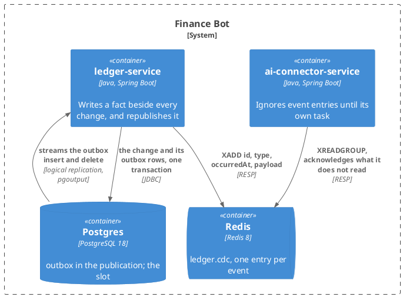
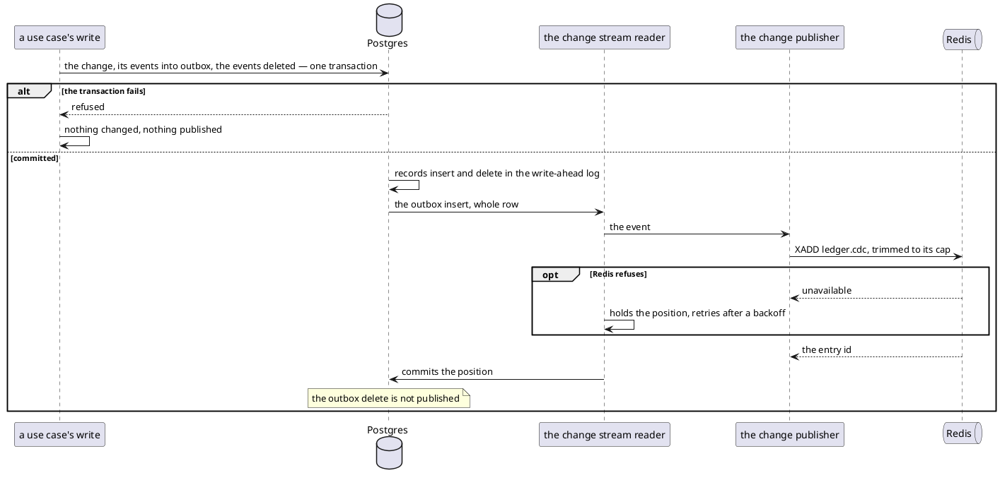

# Design: The Ledger Publishes Facts, Not Rows

**Affected Modules:** `ledger-service`

## Objective

The change stream carries raw row changes today: an `INSERT` on `expense` whose `status` says whether it is
pending, a `u` that may be an acceptance or a refile, a `category` row with no name for its parent. Every
consumer has to re-derive what the ledger meant, and backlog R3 lists what that costs the connector.

This design builds on [34](../implemented/34-one-expense-table-with-a-status/design.md): one `expense` table, one id for an
entry's whole life.

This change makes the ledger say what happened. Each write appends the facts it produced to an outbox table, in
the transaction that made the change, and the existing capture publishes those facts onto the existing stream.
An event names the fact — a proposal created, refiled, discarded or accepted, an expense recorded or refiled —
and carries everything a consumer needs to apply it on its own. An expense removed and a category or grouping
changed are facts no use case produces yet; their events arrive with those use cases (D2).

This is the ledger's half of R3. The connector's move to the events is a task of its own, after this one, and
[task 33](../33-the-model-reads-the-connectors-memory/design.md) is implemented against the row stream first.

## Context

| What exists                                                        | Where                                                                                                                                                                                                                       | What this change does with it                                                                                          |
|--------------------------------------------------------------------|-----------------------------------------------------------------------------------------------------------------------------------------------------------------------------------------------------------------------------|------------------------------------------------------------------------------------------------------------------------|
| The target architecture, R3                                        | [findings](../implemented/32-the-connector-learns-what-became-of-a-message/review/findings.md)                                                                                                                              | Its part (a) is this change; (b) and (c) are the connector's task                                                       |
| The capture pipeline and the stream                                | [Design 23](../implemented/23-broadcast-ledger-changes-to-redis/design.md), [`change-capture.md`](../../ledger-service/docs/contracts/out/change-capture.md), [`change-stream.md`](../../ledger-service/docs/contracts/out/change-stream.md) | The engine, the slot, the heartbeat, the recovery and the meters stay; the captured set and the entry shape change |
| The publication and the replica identity                           | [`V010`](../../ledger-service/src/main/resources/db/migration/V010__publish_ledger_changes.sql), renumbered from `V009` by [Design 34](../implemented/34-one-expense-table-with-a-status/design.md) D2                                 | Rewritten in place: the outbox replaces the two tables, the identity lines go (D6, F4)                                 |
| One expense table, one id, accept as an update                     | [Design 34](../implemented/34-one-expense-table-with-a-status/design.md)                                                                                                                                                                | Every spending event keys on `expenseId`; `ProposalAccepted` needs no second id (F6)                                   |
| The publisher, its category cache and lookup                       | [`ChangeEventPublisher`](../../ledger-service/src/main/java/bot/finance/adapter/cdc/ChangeEventPublisher.java), [`CategoryNameResolver`](../../ledger-service/src/main/java/bot/finance/adapter/cdc/CategoryNameResolver.java) | The enrichment and the cache go; the publisher forwards an outbox insert and drops its delete (F5)              |
| Accept and discard, one `UPDATE` or `DELETE` each after 34         | [Design 34](../implemented/34-one-expense-table-with-a-status/design.md), the writes table                                                                                                                                              | Each returns its rows; the events are built from them (F6)                                                             |
| Every write that changes spending                                  | [`ExpenseRepositoryAdapter`](../../ledger-service/src/main/java/bot/finance/adapter/persistence/ExpenseRepositoryAdapter.java), the one store after Design 34                                                                | Each transaction gains its outbox rows; discard gains the clock's instant (F8)              |
| The connector's reader of the stream                               | [`ChangeStreamEntryReader`](../../ai-connector-service/src/main/java/bot/finance/ai/adapter/redis/ChangeStreamEntryReader.java)                                                                                          | Ignores an entry naming no captured table, which is what an event entry is to it (D1)                                  |
| The rows and their columns                                         | [`database.md`](../../ledger-service/docs/contracts/out/database.md)                                                                                                                                                        | The event bodies carry these columns by name; the page gains `outbox`                                                  |
| The operator's meters                                              | [`operations.md`](../../ledger-service/docs/contracts/in/operations.md)                                                                                                                                                     | Two meters go, one is retagged                                                                                          |
| Debezium's own outbox router                                       | `io.debezium.transforms.outbox.EventRouterDelegate`, in `debezium-core`                                                                                                                                                     | Read for what an outbox capture must drop: the delete (F5)                                                              |

## Proposed Solution

### What the change adds

| Surface                  | What it becomes                                                                                                   |
|--------------------------|-------------------------------------------------------------------------------------------------------------------|
| The ledger's database    | Gains `outbox`, empty at rest; the publication captures it instead of the three spending tables                  |
| Every spending write     | Appends its events to `outbox` and deletes them again, in its own transaction                                     |
| The stream `ledger.cdc`  | Carries one entry per event: `id`, `type`, `occurredAt`, `payload`. No row, no `enrichment`                        |
| The publisher            | Forwards an outbox insert, resolves nothing; the outbox delete never reaches it                                    |
| Configuration            | Loses `CDC_CATEGORY_CACHE_SIZE`                                                                                   |
| `/actuator/prometheus`   | Loses the two lookup meters, gains the outbox gauge; `ledger_cdc_events_published_total` is tagged by `type`      |

**An event carries what a consumer needs and nothing it has to look up.** Every spending event carries the whole
entry — content, category and grouping, each with id and name — as of the transaction that produced it. The
names are read inside that transaction, so they are exact, and the cache-versus-live window Design 23 F69
describes closes.

**The outbox is a table nobody reads.** A row is inserted and deleted in one transaction. The insert reaches the
slot and the stream; the delete stays in the log, unpublished. Nothing is retained, so nothing is purged.

**Delivery, ordering and loss are as today.** At-least-once, in commit order, on one capped stream, bounded by
the slot's retention. What changes is the entry, not the pipe.

**Six of Design 23's decisions stop holding** — D3 the captured tables, D4 the unaltered envelope, D15 the
enrichment, D16 and D17 the cache, and D18 the previous side of a refile (F15, D3 here). D15 chose enrichment over
"reopening the transactional outbox" because a lost `category` event was permanent; names read in the writing
transaction close the same gap without the cache.

### Diagrams

The module takes the repository's [Diagram Format](../conventions/diagrams.md) unchanged. There is no component
diagram: classes belong to the plan.

#### Container — what this change reaches



#### Flow — a fact reaching the stream



Which events one write produces is a table, not a flow: the catalogue's **Emitted by** column below.

### Details

#### The migration

No new migration. The capture migration, `V010`, has been applied to no database, so it is rewritten in place
(D6). Renamed to say what it now does, `V010__publish_facts_through_an_outbox.sql`:

```sql
CREATE TABLE outbox (
    id          UUID        PRIMARY KEY DEFAULT gen_random_uuid(),
    type        TEXT        NOT NULL,
    occurred_at TIMESTAMPTZ NOT NULL,
    payload     JSONB       NOT NULL
);

CREATE TABLE cdc_heartbeat (
    id        BOOLEAN     PRIMARY KEY DEFAULT TRUE CHECK (id),
    beat_at   TIMESTAMPTZ NOT NULL
);

INSERT INTO cdc_heartbeat (beat_at) VALUES (now());

CREATE PUBLICATION finance_ledger_cdc
    FOR TABLE outbox, cdc_heartbeat
    WITH (publish = 'insert, update');
```

`publish` names the operations the publication sends to the slot, for every table in it. `insert` is the event
itself. `update` is the heartbeat, an `UPDATE` on `cdc_heartbeat`. `delete` is left out: the only delete on a
captured table is the outbox row's own, which must never reach the stream, so it is filtered before it reaches
the slot rather than dropped by the reader (F5). `truncate`, in Postgres's default, is left out as Design 23 F78
left it out: it would arrive with neither side.

| Column        | Holds                                                                                   |
|---------------|-----------------------------------------------------------------------------------------|
| `id`          | the event's id, and the consumer's deduplication key                                    |
| `type`        | the event's name, from the catalogue below                                              |
| `occurred_at` | the instant the use case stamped on the change (F8)                                     |
| `payload`     | the event body                                                                          |

The two `REPLICA IDENTITY FULL` lines go: they served deletes and updates on tables no longer captured (F4).
The heartbeat table and its row are unchanged. The publication stays declared by migration, and the slot stays
the engine's (Design 23).

#### What a stream entry carries

| Field        | Holds                                                                    |
|--------------|----------------------------------------------------------------------------|
| `id`         | the event id, a UUID                                                     |
| `type`       | the event's name                                                         |
| `occurredAt` | ISO-8601 instant, the ledger's clock                                     |
| `payload`    | the event body, JSON, whose shape the type fixes                         |

The stream's position — its entry id — is the event's position. A consumer keeping a per-row "applied up to"
mark uses it; the ledger emits no sequence of its own (F9).

Delivery stays at-least-once (Design 23 F6). A redelivered event is byte-identical, since nothing is resolved at
publish time; a consumer deduplicates on `id` alone.

#### The event catalogue

Every body carries `userId`. A spending body carries the entry it is about, so nothing about it depends on an
earlier event having arrived:

| Body field                    | Holds                                                                                |
|-------------------------------|--------------------------------------------------------------------------------------|
| `userId`                      | the person, by internal id (Design 23 D12)                                           |
| `incomingMessageId`           | the message the entry came from; `null` on an expense entered with none              |
| `expenseId`                   | the entry's row id, one for its whole life (Design 34)                               |
| `status`                      | `PENDING` or `RECORDED`, as the row is after the fact                                |
| `description`, `merchant`     | as stored; `merchant` may be `null`                                                  |
| `amount`, `currencyCode`      | the money as a decimal string in the currency's main unit — `12.50`, `7200` — and the ISO code (D7)  |
| `category`                    | `{ "id", "name" }` — the category the entry is filed under                           |
| `grouping`                    | `{ "id", "name" }` — the grouping that category sits in                              |

| Type                | The fact                                                   | Emitted by                                                    | Body                                          |
|---------------------|------------------------------------------------------------|---------------------------------------------------------------|-----------------------------------------------|
| `ProposalCreated`   | the model proposed an expense from a message               | [create an expense proposal](../../ledger-service/docs/usecases/create-an-expense-proposal.md) | the pending entry            |
| `ProposalRefiled`   | a pending entry was moved to another category              | [change an expense's category](../../ledger-service/docs/usecases/browse-expenses.md), the pending arm | the pending entry  |
| `ProposalDiscarded` | the person rejected the pending entry                      | [resolve a reported proposal](../../ledger-service/docs/usecases/resolve-a-reported-proposal.md), discard | the entry as it was, `status: PENDING` |
| `ProposalAccepted`  | the person confirmed it, and it is now recorded            | resolve, accept; [accept chosen proposals](../../ledger-service/docs/usecases/accept-chosen-proposals.md) | the entry, `status: RECORDED`, same `expenseId` |
| `ExpenseRecorded`   | an expense was recorded with no proposal                   | [create an expense](../../ledger-service/docs/usecases/create-an-expense.md)                    | the recorded entry           |
| `ExpenseRefiled`    | a recorded entry was moved to another category             | change an expense's category, the recorded arm                | the recorded entry                            |

Six types, one per fact a use case produces today. An expense removed, a category or a grouping changed are the
next three, each added by the use case that first produces it (D2, F21). A category and a grouping are named by
id everywhere, so such an event will carry `(id, new value)` and a consumer matches on the id (D3).

One event per row. A report accepting three proposals is three `ProposalAccepted`, in one transaction, in one
commit, so they reach the stream together and in order. An accept or discard that matches no row — already
resolved, or unknown — emits nothing (Design 34 F1).

Nothing else emits: a person's initial categories, a spending query, a report, and a person deleted with their
rows leave no event (F10, F11).

#### The writes

Each writing operation appends its events in the transaction that makes the change. The names in `category` and
`grouping` are read there, joined from `category` and its parent, so an event names what the row named at commit.
The event is written from the changed row, one per row, whatever the join finds: a category with no parent gives
`grouping: null` and still an event (F16). A missing category cannot happen — the row's foreign key holds it.

| Write                        | What the transaction does now                                                                                                                  |
|------------------------------|------------------------------------------------------------------------------------------------------------------------------------------------|
| create a proposal, an expense | the row, then its event                                                                                                                       |
| refile                       | the update, then its event, from the row the update returned                                                                                   |
| discard                      | the delete returns the rows; one event each                                                                                                    |
| accept, by message or by ids | the `UPDATE` to `RECORDED` returns each row it changed, with its names; one event each (F6). Accept by ids still returns its message ids to the caller (F20) |
| every write                  | builds the event bodies from the rows its statement returned — the amount scaled by `Money` (D7, F22) — inserts them into `outbox`, and deletes them, all in the one transaction |

Discard carries no instant today; it gains the clock's, as accept already has (F8).

#### The publisher

| Sees                              | Does                                                                        |
|-----------------------------------|-----------------------------------------------------------------------------|
| an outbox insert                  | writes one entry: the row's `id`, `type`, `occurred_at`, `payload`          |
| Redis refuses                     | holds the position and retries, as today (Design 23 D5)                     |
| an outbox delete, any other table | none arrives — the publication sends inserts and updates, and the include list names `outbox` alone (F5) |

The category resolver, its cache, its eviction on `category` events and its two meters go with the enrichment.

#### Configuration, meters and documents

| Setting or document                                                                | Change                                                                                     |
|------------------------------------------------------------------------------------|--------------------------------------------------------------------------------------------|
| `CDC_CATEGORY_CACHE_SIZE`                                                          | Removed, with the cache                                                                    |
| `ledger_cdc_events_published_total`                                                | Tagged by `type`, not `table` and `op`                                                     |
| `ledger_cdc_category_lookups_total`, `ledger_cdc_category_lookup_failures_total`   | Removed                                                                                    |
| `ledger_cdc_outbox_rows`                                                           | New gauge: rows in `outbox`, read on the slot monitor's timer; anything but zero at rest is a write that did not delete (F17) |
| The engine's include list                                                          | `public.outbox`                                                                            |
| [`change-stream.md`](../../ledger-service/docs/contracts/out/change-stream.md)     | Rewritten: the entry, the catalogue, deduplication on `id`, what is not promised           |
| [`change-capture.md`](../../ledger-service/docs/contracts/out/change-capture.md)   | The captured set is `outbox` and the heartbeat; the flow loses its lookup; the schema line names the renamed `V010` |
| [`database.md`](../../ledger-service/docs/contracts/out/database.md)               | Gains `outbox`; the replica-identity sentence goes                                          |
| [`configuration.md`](../../ledger-service/docs/configuration.md)                   | Loses one row                                                                              |
| [`operations.md`](../../ledger-service/docs/contracts/in/operations.md)            | The meter table                                                                            |
| [Architecture](../../ledger-service/docs/conventions/architecture.md)              | `adapter/cdc`'s line, if the resolver's removal changes it                                 |
| The connector's [`change-stream.md`](../../ai-connector-service/docs/contracts/out/change-stream.md) | Untouched here; the connector's task rewrites it                         |
| Backlog R2 (`CategoryNames`, `CategoryRow` in `adapter/cdc`)                       | Closed by removal                                                                          |
| `CategoryRowUtils` and the capture tests                                            | The rename helper drove `category` events; the tests now assert entries by `type`          |

## Acceptance Scenarios

### The change stream

- **A1:** a proposal is published as a fact
  - Given: the engine is streaming
  - When: a proposal is stored for an incoming message
  - Then: one entry reaches `ledger.cdc` with `type: ProposalCreated` and a body carrying `expenseId`,
    `status: PENDING`, the message id, the content, and the category and grouping with their names

- **A2:** an acceptance is one fact per proposal
  - Given: three pending entries under one message
  - When: the report is confirmed
  - Then: three `ProposalAccepted` entries follow, each with the `expenseId` the pending entry already had and
    `status: RECORDED`

- **A3:** a discard is one fact per proposal
  - Given: two pending proposals under one message
  - When: the report is discarded
  - Then: two `ProposalDiscarded` entries follow, each carrying the proposal as it was

- **A4:** a refile is a fact naming the new filing
  - Given: a recorded expense under category `Coffee` in `Dining`
  - When: it is refiled to `Groceries` in `Food` through `PATCH /api/v1/expenses/RECORDED/{id}`
  - Then: one `ExpenseRefiled` entry carries `category.name: Groceries` and `grouping.name: Food`, and the same for
    a pending entry gives `ProposalRefiled`

- **A5:** an expense recorded with no proposal
  - Given: the engine is streaming
  - When: an expense is created through the create-expense use case
  - Then: one `ExpenseRecorded` entry with `expenseId` and `incomingMessageId: null`

- **A6:** the names are the transaction's
  - Given: a category renamed by SQL after an expense was recorded under it
  - When: that expense is refiled within its grouping
  - Then: the entry carries the new name, and no earlier entry is republished

- **A7:** the outbox delete never reaches the stream
  - Given: the engine is streaming
  - When: any spending write commits
  - Then: the stream gains exactly as many entries as events, `outbox` is empty afterwards, and the reader is
    offered no delete

- **A8:** a resolution that matches nothing
  - Given: a report already accepted
  - When: it is confirmed or discarded again
  - Then: no entry reaches the stream

- **A9:** a raw row change is no longer published
  - Given: the engine is streaming
  - When: a `category` row is renamed by SQL, or an `expense` row updated by SQL
  - Then: nothing reaches the stream

- **A10:** the write fails
  - Given: a database refusing the outbox insert
  - When: a proposal is created
  - Then: the caller gets the persistence failure, no proposal is stored, and nothing reaches the stream

- **A11:** Redis is unavailable
  - Given: the engine is streaming and Redis refuses writes
  - When: a proposal is created, and Redis returns inside the slot's bound
  - Then: the entry reaches the stream once Redis is back, once, with the same `id`

- **A12:** the same event delivered twice
  - Given: an entry published and the position not yet committed
  - When: the service restarts
  - Then: the entry is republished byte-identical, under the same `id`

- **A13:** the connector meets the new entries
  - Given: the connector of Design 32 reading `ledger.cdc`
  - When: an event entry arrives
  - Then: it is acknowledged and nothing is stored (D1)

- **A14:** chosen proposals are accepted from the web
  - Given: two pending proposals under two messages
  - When: both are accepted by id through the web API
  - Then: two `ProposalAccepted` entries follow, and the caller's answer names both messages as before

- **A15:** a proposal under a category with no parent
  - Given: a proposal filed under a grouping's own id
  - When: it is stored
  - Then: one `ProposalCreated` entry follows with `grouping: null`, and the proposal is stored as before

- **A16:** an outbox row left behind
  - Given: a row inserted into `outbox` by hand
  - When: the slot monitor next runs
  - Then: `ledger_cdc_outbox_rows` reads `1`

## Decisions

- **D1:** What happens to the row stream while the connector still reads rows?
  - Answer: It ends when this lands. One stream, one shape. The connector's consumer (Design 32) reads
    `payload.source.table`, finds none on an event entry, and acknowledges it, so the memory learns nothing until
    the connector's own task lands (A13).
  - Basis: decided — the user chose replacing in place over keeping the three tables in the publication beside the
    outbox until the connector moves, and over a second stream key (user, 2026-08-16). Nothing runs in production
    yet, so the gap costs nothing.

- **D2:** Are the events no use case emits yet defined now?
  - Answer: No. The catalogue holds the six facts a use case produces today. `ExpenseRemoved`, `CategoryChanged`
    and `GroupingChanged` are added by the use case that first produces each (F21).
  - Basis: decided — the user chose to focus on what the ledger can already emit over fixing three shapes nobody
    produces (user, 2026-08-16); the [documentation conventions](../conventions/documentation.md) say the same,
    a page documents what is served now.

- **D3:** Does a refile event name the category it moved *from*?
  - Answer: No. A refile event names the current filing — `category` and `grouping`, each `(id, name)`. A consumer
    matches what to update by id, so the previous side is not needed. This reverses Design 23 D18 (F15).
  - Basis: decided — the user chose dropping it, on the condition that a category and a grouping are identified by
    id and an event carries `(id, new value)` (user, 2026-08-16). R3 names no previous side, and no consumer keeps
    a per-category view.

- **D4:** May the migration run while the slot still holds unpublished row changes?
  - Answer: Yes. Nothing is stated about draining the slot, and the cut-over promises no tail and no gap. The
    stream contract documents the event shape alone.
  - Basis: decided — the user set compatibility with the row stream aside: the pipeline runs in no environment,
    production or test, so no slot holds anything at the cut-over (user, 2026-08-16).

- **D5:** Is any event kept once published, for a rebuilt slot to recover from?
  - Answer: No. Outbox rows are deleted in the writing transaction, the table is empty at rest, and a rebuilt
    slot's gap is gone, as Design 23 A19 already accepts. `CDC_SNAPSHOT_MODE` keeps its default and snapshots
    nothing (F13).
  - Basis: decided — the user chose no retention over keeping rows for a bounded time with a purge, an index and
    a snapshot that means something (user, 2026-08-16).

- **D6:** Is the change a new migration, or a rewrite of the capture migration?
  - Answer: A rewrite. The capture migration — `V009` when this was decided, `V010` since Design 34 — creates the outbox and
    publishes it with the heartbeat; the spending tables are never published and never carry
    `REPLICA IDENTITY FULL`. The file is renamed to what it now does. A developer's local database that applied
    the old file fails Flyway's checksum and is rebuilt from scratch.
  - Basis: decided — the user chose editing the unapplied migration over creating a publication in one and
    altering it in the next (user, 2026-08-17), and asked that 34 and 35 leave one aligned history (Design 34
    D2). [`database.md`](../../ledger-service/docs/contracts/out/database.md)'s append-only rule protects a
    database that has run the migration, and none has.

- **D7:** In what shape does an event carry the amount?
  - Answer: `amount`, a decimal string in the currency's main unit as `Money.amount()` scales it, beside
    `currencyCode`. No minor units cross. The scaling happens where the event is written, in the ledger, which
    owns the scale ([ADR 0011](../../ledger-service/docs/adr/0011-the-amount-is-scaled-to-minor-units-in-the-domain.md)).
  - Basis: decided — the user chose the main-unit figure over the store's minor units (user, 2026-08-17): the
    connector knows nothing of minor units, the model does not handle them, and an example rendered from the
    memory in task 33 must read as the amount the model is asked to extract. The MCP tool takes the amount the
    same way ([task 12](../implemented/12-the-expense-tool-takes-the-amount-as-written/design.md)); the Telegram
    report prints `Money.amount()` followed by the ISO code.

## Design Findings

Grilled (2026-08-16): failure modes, concurrency, data edges, compatibility with Design 23's decisions, lifecycle,
observability, the diagram convention, and the branch-to-scenario pass; authorization, the ledger's own API
contract, limits, and time precision found clear.

| #   | Question                                                        | Answer                                                                                                                | Evidence                                                                                                          |
|-----|-----------------------------------------------------------------|-----------------------------------------------------------------------------------------------------------------------|-------------------------------------------------------------------------------------------------------------------|
| F1  | Which events, named how?                                        | R3's catalogue, with the request's "create, delete, discard, update" mapped onto it, and `Changed` for a category or grouping so a move counts as well as a rename | [findings](../implemented/32-the-connector-learns-what-became-of-a-message/review/findings.md) R3 |
| F2  | Is the event shape a build-time artifact?                       | No — the contract page fixes it, as it fixes the row entry today; deferred until a second module generates code from it | [`change-stream.md`](../../ledger-service/docs/contracts/out/change-stream.md), "Schema: none held in a file" |
| F3  | Does a refile carry the previous category?                      | Reopened as D3 — Design 23 D18 decided it, and this row cannot reverse a decided entry                                  | Design 23 D18                                                                                                     |
| F4  | Does `REPLICA IDENTITY FULL` stay on the spending tables?       | No — it made deletes legible on tables no longer captured, and it doubles what an update writes to the log            | Design 23 F3, F13                                                                                                 |
| F5  | How does the outbox delete stay off the stream?                 | The publication sends no deletes — `publish = 'insert, update'` — so it never reaches the slot; `update` stays for the heartbeat, which is publication-wide (user, 2026-08-17). Debezium's own router drops the same delete one stage later | `EventRouterDelegate.apply`, "Skipping deletes"; `ChangeStreamConfiguration`, `HEARTBEAT_ACTION_QUERY` |
| F6  | How does an acceptance event know its ids?                      | There is one: after Design 34 an acceptance is an `UPDATE` on the entry's own row, and its `RETURNING` gives the row, the id and the names the event needs | [Design 34](../implemented/34-one-expense-table-with-a-status/design.md), the writes table |
| F7  | Where do the names come from?                                   | Joined from `category` and its parent inside the writing transaction; no cache, no window                             | [`ExpenseEntityRepository`](../../ledger-service/src/main/java/bot/finance/adapter/persistence/ExpenseEntityRepository.java), the summaries query's join                                                          |
| F8  | What is `occurredAt`?                                           | The `now` the use case stamps, microsecond-truncated as the rows are; discard gains it                                | [`ExpenseRepositoryAdapter`](../../ledger-service/src/main/java/bot/finance/adapter/persistence/ExpenseRepositoryAdapter.java) `accept`, `discard`                 |
| F9  | Does the event carry a sequence?                                | No — the stream entry id is monotone and is the position; a `BIGSERIAL` would not follow commit order               | Design 23, "in the order the database committed it"; `XADD` auto ids                                             |
| F10 | A person's initial categories, a spending query, a report?      | No event — nothing asked for one, and no consumer needs it                                                             | Design 32, the consumer table: `category` `c` does nothing                                                        |
| F11 | A person deleted with their rows?                               | No event — no use case deletes a person; deferred until one does, which then emits what it needs                       | Design 31 F20; Design 23 A40                                                                                     |
| F12 | The engine's stored position across the migration?              | Nothing to keep — no database has run the old capture migration, so no slot or offset exists (D4, D6); a rebuilt local database starts fresh | [`change-capture.md`](../../ledger-service/docs/contracts/out/change-capture.md), the slot and the stored position |
| F13 | Does the outbox need snapshotting?                              | No — it is empty at rest, and `CDC_SNAPSHOT_MODE` stays at its default `no_data`; what a rebuilt slot can recover is D5 | [`configuration.md`](../../ledger-service/docs/configuration.md), `CDC_SNAPSHOT_MODE`                             |
| F14 | An expense recorded with no entry point today?                  | `ExpenseRecorded` is written by the same repository write, so the first caller of the use case publishes it            | [`CreateExpenseUseCase`](../../ledger-service/src/main/java/bot/finance/application/usecase/CreateExpenseUseCase.java), wired and uncalled |
| F15 | Which of Design 23's decided entries stop holding?              | D3, D4, D15, D16, D17 by this design; D18 by D3 here. Each is named in the solution; the ADR the plan writes supersedes ADR 0016's shape where it states the entry | Design 23, the Decisions section; [ADR lifecycle](../conventions/adr.md) |
| F16 | The names join matches nothing?                                 | The event is still written, from the row, with `grouping: null` for a category with no parent; the category itself is held by the row's foreign key | [`CategoryRepositoryAdapter`](../../ledger-service/src/main/java/bot/finance/adapter/persistence/CategoryRepositoryAdapter.java), the refile guard that creation lacks; [`CategoryNameResolver`](../../ledger-service/src/main/java/bot/finance/adapter/cdc/CategoryNameResolver.java), today's tolerance |
| F17 | What shows an outbox row a write never deleted?                 | `ledger_cdc_outbox_rows`, read on the slot monitor's timer                                                             | [`operations.md`](../../ledger-service/docs/contracts/in/operations.md), the meter table; `ReplicationSlotMonitor` |
| F18 | Does the churn bloat the table and its index?                   | Autovacuum on defaults; deferred until the write rate or D5's retention changes, and no setting is written for it       | The migration above; [`database.md`](../../ledger-service/docs/contracts/out/database.md), which records no per-table vacuum settings |
| F19 | Why does the sequence diagram keep no branch for which event?   | The catalogue's **Emitted by** column is the table the convention asks for; every arm was one guard ending the flow     | [Diagrams](../conventions/diagrams.md), "Choosing a Flow Diagram"                                                  |
| F20 | Both accept statements?                                         | Accept by message and accept by ids are two statements; each returns its rows and writes the events, and the second keeps returning its message ids | [Design 34](../implemented/34-one-expense-table-with-a-status/design.md), the writes table |
| F21 | An expense removed, a category or grouping changed?             | No event until a use case does it; deferred to that use case's task, whose event carries the row's id and its new value (D3) | Design 32 F1, no rename; [backlog](../backlog.md) R1, no hand-entered expense; D2 |
| F22 | Is the event body built in SQL or in the ledger's code?         | In the code, from the rows the statement returns: the currency's scale lives in `Money`, not in the database, so `amount` cannot be rendered by the statement | [`Money`](../../ledger-service/src/main/java/bot/finance/domain/value/Money.java) `fractionDigits`; [ADR 0011](../../ledger-service/docs/adr/0011-the-amount-is-scaled-to-minor-units-in-the-domain.md) |
