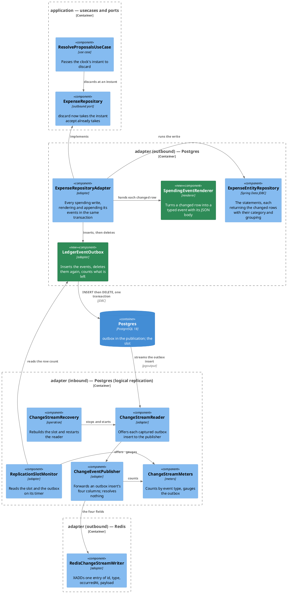

# Plan: The Ledger Publishes Facts, Not Rows

**Affected Modules:** `ledger-service`
**Design:** [The Ledger Publishes Facts, Not Rows](design.md)

## Components

| What a box cannot carry               | The detail                                                                                                                                                                                                             |
|---------------------------------------|--------------------------------------------------------------------------------------------------------------------------------------------------------------------------------------------------------------------------|
| `LedgerEvent`                         | `UUID id`, `String type`, `Instant occurredAt`, `String payload` — `payload` is the rendered JSON body, held as text and cast to `JSONB` in the statement                                                                |
| `SpendingRowProjection`               | `long id`, `long userId`, `String incomingMessageId`, `String status`, `String description`, `String merchant`, `long amountMinorUnits`, `String currencyCode`, `Instant createdAt`, `long categoryId`, `String categoryName`, `Long groupingId`, `String groupingName` — the grouping pair is null for a category with no parent, and `createdAt` is what `refile` still owes `ExpenseEntry` |
| `SpendingEventRenderer`               | `LedgerEvent render(String type, SpendingRowProjection row, Instant occurredAt)`; the amount is `new Money(amountMinorUnits, CurrencyCode.of(currencyCode)).amount().toPlainString()`                                    |
| `LedgerEventOutbox`                   | `void insert(List<LedgerEvent> events)`, `void delete(List<UUID> ids)`, `long rowCount()` — two statements rather than one, so each is observable on its own; the adapter calls both inside its transaction              |
| The event id                          | minted in Java with `UUID.randomUUID()` rather than taken from the column default, so the delete names the ids the insert just wrote without a `RETURNING` round trip. The column keeps its default for a hand-written row |
| `ExpenseEntityRepository`, the writes | `accept`, `discard`, `acceptByIds` and `refile` each become a data-modifying CTE: `WITH changed AS (<the write> RETURNING …) SELECT … FROM changed c JOIN category cat ON c.category_id = cat.id LEFT JOIN category grp ON cat.parent_id = grp.id`, returning `List<SpendingRowProjection>` (`Optional<…>` for `refile`). The `LEFT` is what gives a parentless category a null grouping |
| `ExpenseEntityRepository`, the create  | `create` keeps `save`, which owns the generated id, the truncation and the foreign-key classification. It gains a sibling statement — `Optional<SpendingRowProjection> findEventRow(Long id)`, the same join keyed on the row just written — called inside the same `@Transactional` method                |
| `ExpenseRepositoryAdapter`            | the constructor gains `LedgerEventOutbox` and `SpendingEventRenderer`; every write renders its events, inserts them and deletes them before returning                                                                    |
| `ExpenseRepository.discard`           | gains `Instant now`, matching `accept`; the one caller, `ResolveProposalsUseCase.applyResolution`, passes `Instant.now(clock)`                                                                                            |
| `RedisChangeStreamWriter.write`       | `boolean write(String id, String type, String occurredAt, String payload)` — four body fields, no `Optional`                                                                                                             |
| `ChangeStreamMeters`                  | `countPublished(String type)`, `setOutboxRows(long)`; `countCategoryLookupHit/Miss/Failure` go                                                                                                                            |
| What the publisher reads              | the outbox insert's `after` node: `id`, `type`, `occurred_at`, `payload`. `occurred_at` arrives as Debezium's `ZonedTimestamp` — an ISO-8601 string — and `payload` as the JSONB's own text, both forwarded verbatim      |
| How an appended event is observed     | the outbox is empty at commit, so no test can read one back off the table. `ExpenseRepositoryAdapterTest` imports `LedgerEventOutbox` as a spy and captures the `insert` argument; `LedgerEventOutboxTest` drives `insert` and `delete` separately against the real table |

Classes deleted outright, with their test classes: `CategoryNameResolver`, `CategoryNames`, `CategoryRow`,
`CategoryRowCache` in `adapter/cdc`; `CategoryRowReader`, `CategoryRowProjection` and
`CategoryEntityRepository.findCategoryRow` in `adapter/persistence`.

## Step-by-Step Implementation Map (To-Do List)

### Stabilization

#### Database

- [x] ST01 · Replace the capture migration in place (design D6). `git rm` the unapplied
  `V010__publish_ledger_changes.sql` and add `V010__publish_facts_through_an_outbox.sql` carrying, in this order:
  the `outbox` table (`id UUID PRIMARY KEY DEFAULT gen_random_uuid()`, `type TEXT NOT NULL`,
  `occurred_at TIMESTAMPTZ NOT NULL`, `payload JSONB NOT NULL`), the `cdc_heartbeat` table and its seed row
  unchanged, and `CREATE PUBLICATION finance_ledger_cdc FOR TABLE outbox, cdc_heartbeat WITH (publish = 'insert,
  update')`. The two `ALTER TABLE … REPLICA IDENTITY FULL` lines are not carried over.

#### Interface-First / Build Stabilization

**Interface & Signature Sync**

- [x] ST02 · Add `LedgerEvent` and `SpendingRowProjection` in `adapter/persistence` as the records the Components
  table describes. Records, so no stub body.
- [x] ST03 · Add `SpendingEventRenderer` in `adapter/persistence` with `render(String, SpendingRowProjection,
  Instant)` stubbed to the minimum, its intent stated.
- [x] ST04 · Add `LedgerEventOutbox` in `adapter/persistence` as a `@Component` taking `JdbcTemplate`, with
  `insert(List<LedgerEvent>)`, `delete(List<UUID>)` and `rowCount()` stubbed to the minimum, their intent stated.
- [x] ST05 · Rewrite the four writing statements on `ExpenseEntityRepository` as the data-modifying CTEs the
  Components table gives, each returning every column `SpendingRowProjection` holds — `created_at` included, since
  `refile` still owes it to `ExpenseEntry` — so they answer `List<SpendingRowProjection>`, and
  `Optional<SpendingRowProjection>` for `refile`. Add `findEventRow(Long id)`, the same join keyed on one row, for
  `create`. `RefiledEntryProjection` is superseded by `SpendingRowProjection` and goes with this item.
- [x] ST06 · Widen `ExpenseRepositoryAdapter`'s constructor to take `LedgerEventOutbox` and
  `SpendingEventRenderer`, keeping each write's existing return value, and resolve every construction site until
  the module builds: the `@Import` list of `ExpenseRepositoryAdapterTest` **and** of
  `ExpenseRepositoryAdapterConcurrencyTest`, which imports the adapter alone and stops booting the moment the
  constructor grows, plus the three places `ExpenseRepositoryAdapterTest` builds the adapter by hand — the
  `WithAMockedStore` field and the two `throwingAdapter` helpers — each of which is handed the two new
  collaborators.
- [x] ST07 · Widen `ExpenseRepository.discard` to `discard(long userId, IncomingMessageId reference, Instant now)`
  and update every call site until the module builds: `ExpenseRepositoryAdapter.discard` and
  `ResolveProposalsUseCase.applyResolution`, which passes `Instant.now(clock)`. In the test tree the call sites are
  `ResolveProposalsUseCaseTest` (three `discard(USER_ID, REFERENCE)` stubs) and `ExpenseRepositoryAdapterTest`
  (`adapter.discard(userId, reference)` and the mocked-store failure test). `SpendingQueryRepository.discard` is a
  different port and is not touched.
- [x] ST08 · Change `RedisChangeStreamWriter.write` to `write(String id, String type, String occurredAt, String
  payload)`, writing those four body fields, and resolve the call sites: `ChangeEventPublisher` and
  `RedisChangeStreamWriterTest`.
- [x] ST09 · Change `ChangeStreamMeters`: `countPublished(String type)` replaces `countPublished(String, String)`,
  the three `countCategoryLookup*` methods are removed, and `setOutboxRows(long)` registers a
  `ledger_cdc_outbox_rows` gauge. Resolve the call sites in `ChangeEventPublisher`, `CategoryNameResolver` (deleted
  in ST10) and `ChangeStreamMetersTest`.
- [x] ST10 · Delete the enrichment machinery and everything that only served it: `CategoryNameResolver`,
  `CategoryNames`, `CategoryRow`, `CategoryRowCache` and `CategoryRowReader`, `CategoryRowProjection`,
  `CategoryEntityRepository.findCategoryRow`, and the test classes `CategoryNameResolverTest`,
  `CategoryRowCacheTest`, `CategoryRowReaderTest` — one `git rm` naming all of them. Strip `CategoryNameResolver`
  and `CategoryRowReader` from `CaptureAdapterConfiguration`'s `@Import` list, and reduce `ChangeEventPublisher` to
  a compiling stub that forwards nothing, with a `TODO` naming the work: forward the outbox insert's four columns
  to the writer.
- [x] ST11 · Point the engine at the outbox: `ChangeStreamConfiguration.CAPTURED_TABLES` becomes `public.outbox`.
- [x] ST12 · Add `ReplicationSlotMonitor`'s fifth collaborator, `LedgerEventOutbox`, and resolve its construction
  sites: `CaptureAdapterConfiguration`'s `@Import` list and `ReplicationSlotMonitorGaugesTest`, which builds the
  monitor by hand.

**Configuration**

- [x] ST13 · Remove `categoryCacheSize` from `CdcProperties` and `cdc.category-cache-size` from
  `src/main/resources/application.yaml`, and resolve the constructor call sites — `CdcConfigurations.forStream`
  is the one in the test tree.

**Shared Test Infrastructure**

- [x] ST14 · Rework `ChangeStreamEntries` for the event entry: `ChangeStreamEntry` exposes `eventId()`, `type()`,
  `occurredAt()` and `payload()` read from the four body fields, with `userId()` reading `payload.userId`;
  `entriesOnFor(String streamKey, String type, long userId)` filters by event type instead of `source.table`, and
  `allEntriesOn` keeps its shape. The `enrichment` field, `op()`, `source()`, `table()`, `before()` and `after()`
  go. Seven test classes call the removed members — `ChangeStreamReaderTest`, `ChangeStreamRecoveryTest`,
  `BroadcastLedgerChangesSystemTest`, `AcceptedProposalChangeStreamSystemTest`, `ChangeStreamMetersSystemTest`,
  `RecoverSlotSystemTest` and `CaptureDisabledSystemTest`. Every method of theirs that cannot compile against the
  new shape keeps its method, carries `@Disabled` naming the red step that reworks it, and has only the lines
  inside it commented out, so the module builds and the runner reports what is owed. A **private helper** using a
  removed member returns a value, so commenting its body does not compile: delete it with the disabled methods it
  serves — `awaitCategoryIdsInOrder`, `awaitCategoryChangeLsn`, `expenseEntryFor` and `deleteFor` in
  `ChangeStreamReaderTest`, `updateEntry` and `expenseEntryNaming` in `AcceptedProposalChangeStreamSystemTest`,
  and `updateEntryFor` in `BroadcastLedgerChangesSystemTest`.

- [x] ST15 · Disable the three methods that still compile against the new `ChangeStreamEntries` but go red the
  moment ST01 and ST11 land, since a `category` or `expense` row change no longer reaches the slot at all:
  `ChangeStreamMetersSystemTest.whenPrometheusIsScraped_thenItCarriesThePublishedFailureLagSlotAndStateMeters`
  (naming RS04), `RecoverSlotSystemTest`'s method waiting on `category` entries (naming RS05), and
  `ChangeStreamReaderTest`'s `RedisUnavailable.whenCapturedRowChanges_thenChangeHeldBackAndPositionNotCommitted`
  (naming RI04), whose `category` insert never reaches the reader and so never drives the state back to `DOWN`.

- [x] ST16 · Add `OutboxRowUtils` to `bot.finance.common.rows`, one class per table as the module's
  [testing conventions](../../ledger-service/docs/conventions/testing.md) require: reads a user's outbox rows
  back, counts the table, and stores one row directly. RI01, RI02, RI04 and RS03 all read the table, and each red
  step agent is scoped to add no shared fixture beyond its own, so it is written once here. List it in that page's
  package tree alongside the existing `*RowUtils`.

- [x] ST17 · Confirm `bot.finance.architecture.CleanArchitectureTest` still passes.

### Red Phase

#### TDD Unit Red Phase

- [x] RU01 · `SpendingEventRenderer` · test: `SpendingEventRendererTest` · covers: `render()` · scenarios: A1, A15
  - `render()`:
    - given: a projection for a pending row with a merchant, a category and a grouping
      when: rendered as `ProposalCreated` at a given instant
      then: the event carries a fresh `id`, `type` `ProposalCreated`, that instant as `occurredAt`, and a payload
      whose `userId`, `incomingMessageId`, `expenseId`, `status`, `description`, `merchant`, `currencyCode`,
      `category.id`, `category.name`, `grouping.id` and `grouping.name` are the projection's values
    - given: a projection whose amount is 350 minor units in `EUR`
      when: rendered
      then: the payload's `amount` is the string `3.50`, in the currency's main unit
    - given: a projection whose amount is 7200 minor units in a currency with no minor unit
      when: rendered
      then: the payload's `amount` is the string `7200`
    - given: a projection whose grouping id and grouping name are both null
      when: rendered
      then: the payload's `grouping` is JSON null and every other field is unchanged
    - given: a projection whose merchant and incoming message id are both null
      when: rendered
      then: the payload's `merchant` and `incomingMessageId` are both JSON null
    - given: the same projection rendered twice
      when: both events are compared
      then: their payloads are equal and their ids differ

- [x] RU02 · `ChangeEventPublisher` · test: `ChangeEventPublisherTest` · covers: `publish()` · scenarios: A12
  - `publish()`:
    - given: an outbox insert whose `after` carries an id, a type, an `occurred_at` and a payload
      when: published
      then: the writer is handed exactly those four values, and `publish` answers published
    - given: the same outbox insert published a second time
      when: published again
      then: the writer is handed the identical four values, the id included
    - given: an event whose payload names a grouping of JSON null
      when: published
      then: the payload reaches the writer unchanged, the publisher parsing nothing inside it
  - update: premise — the publisher resolves no names, inspects no `category` event and builds no `enrichment`
    block; it forwards one outbox insert's four columns · a test arranging a `CategoryNameResolver`, asserting on
    an `enrichment` block, or driving a `category`-table payload is deleted, and what survives is rewritten against
    an outbox insert

- [x] RU03 · `ChangeStreamMeters` · test: `ChangeStreamMetersTest` · covers: `countPublished()`, `setOutboxRows()`
  · scenarios: A16
  - `countPublished()`:
    - given: a fresh registry
      when: an event of type `ProposalAccepted` is counted
      then: `ledger_cdc_events_published_total` carries one tag, `type`, reading `ProposalAccepted`
  - `setOutboxRows()`:
    - given: a fresh registry
      when: the outbox row count is set to a non-zero value
      then: `ledger_cdc_outbox_rows` reads that value back
  - update: `whenLookupCountedHitAndAnotherMiss_thenCategoryLookupsCounterSeparatesTheTwoByTag()` — delete
  - update: `whenEventIsCounted_thenPublishedCounterCarriesOnlyTableAndOpTags()` — delete; the `type` scenario
    above replaces it

- [x] RU04 · `ReplicationSlotMonitor` · test: `ReplicationSlotMonitorGaugesTest` · covers: `readSlot()` ·
  scenarios: A16
  - `readSlot()`:
    - given: a mocked outbox answering one row a write never deleted
      when: the monitor reads on its timer
      then: `ledger_cdc_outbox_rows` reads `1`, beside the slot gauges it already sets
    - given: a mocked outbox answering no rows
      when: the monitor reads
      then: `ledger_cdc_outbox_rows` reads `0`
    - given: no slot of that name, and a mocked outbox answering one row
      when: the monitor reads
      then: `ledger_cdc_outbox_rows` reads `1` beside the absent-slot gauges — the early return on a missing slot
      does not skip the outbox
  - update: premise — the monitor takes `LedgerEventOutbox` as a fifth collaborator and reads it on every pass ·
    a test constructing the monitor hands it a mocked outbox, and one asserting only the slot gauges keeps its
    assertions unchanged

#### TDD Integration Red Phase

- [x] RI01 · `LedgerEventOutbox` · test: `LedgerEventOutboxTest` · covers: `insert()`, `delete()`, `rowCount()` ·
  scenarios: A16
  - `insert()`:
    - given: two events with distinct ids, types, instants and JSON payloads
      when: inserted
      then: `outbox` holds both rows, each column carrying what the event held, the payload readable as `JSONB`
    - given: an empty list
      when: inserted
      then: nothing is written and no statement fails
  - `delete()`:
    - given: three rows in `outbox`, two of them just inserted
      when: the two ids are deleted
      then: only the third remains
    - given: an empty list of ids
      when: deleted
      then: nothing is removed and no statement fails
  - `rowCount()`:
    - given: one row inserted into `outbox`
      when: the count is read
      then: it answers `1`
    - given: an empty table
      when: the count is read
      then: it answers `0`

- [x] RI02 · `ExpenseRepositoryAdapter` · test: `ExpenseRepositoryAdapterTest` · covers: `create()`, `accept()`,
  `discard()`, `acceptByIds()`, `refile()` · scenarios: A1, A2, A3, A4, A5, A6, A8, A10, A15
  - `create()`:
    - given: a pending entry under a category filed in a grouping
      when: created
      then: the outbox spy captured one `ProposalCreated` event carrying the stored row's `expenseId`, its message
      id, `status` `PENDING`, and both names as the category and grouping hold them — and `outbox` is empty at the
      end of the call
    - given: a recorded entry carrying no message id
      when: created
      then: one `ExpenseRecorded` event was inserted with `incomingMessageId` null and `status` `RECORDED`
    - given: a category filed under no grouping
      when: a proposal is created under it
      then: the proposal is stored as before and its event carries a null grouping
    - given: an outbox whose insert fails
      when: a proposal is created
      then: a `PersistenceFailedException` reaches the caller and nothing was handed to the outbox's delete. The
      slice runs inside a rolled-back transaction the adapter joins rather than starts, so *no row was stored* is
      not observable here. A10's both-or-neither half rests on the adapter's `@Transactional` boundary, which the
      exception propagating out of it is what this scenario can show; RS03's unhappy path adds that nothing
      reaches the stream when a create fails
  - `accept()`:
    - given: three pending entries under one message
      when: accepted
      then: three `ProposalAccepted` events were inserted, one per row, each with the `expenseId` the pending row
      already had and `status` `RECORDED`, and the caller is still answered `3`
    - given: entries under that message already recorded
      when: accepted again
      then: nothing is inserted
  - `discard()`:
    - given: two pending entries under one message
      when: discarded at a given instant
      then: two `ProposalDiscarded` events were inserted, each carrying the row as it was with `status` `PENDING`,
      each stamped with that instant, and the caller is still answered `2`
    - given: a message holding nothing pending
      when: discarded
      then: nothing is inserted
  - `acceptByIds()`:
    - given: two pending entries reported on two different messages
      when: both are accepted by id
      then: two `ProposalAccepted` events were inserted, and the caller is still answered with both message ids
    - given: an id naming another person's pending entry
      when: accepted by id
      then: nothing is inserted and their row stays pending
  - `refile()`:
    - given: a recorded entry under one category
      when: refiled to a category in another grouping
      then: one `ExpenseRefiled` event was inserted, naming the new category and grouping and no previous side
    - given: a pending entry
      when: refiled
      then: one `ProposalRefiled` event was inserted
    - given: a category renamed by SQL after the entry was stored
      when: that entry is refiled
      then: the event carries the new name, read inside the same transaction
    - given: an id naming no entry of the caller's under that status
      when: refiled
      then: the answer is empty and nothing is inserted
  - update: premise — every write renders its events and hands them to `LedgerEventOutbox`, which deletes them
    again before the write returns, so the table is empty at commit and the spy's captured `insert` argument is
    the only record of what was appended · the class imports the outbox as a spy, and a test asserting on a
    write's stored rows or its return value keeps those assertions unchanged
  - update: premise — `accept`, `discard`, `acceptByIds` and `refile` now run a data-modifying CTE returning each
    changed row with its category and grouping, and `create` reads the same join back by id · a test asserting on
    the count, the message ids or the entry a write answers keeps asserting exactly that, the adapter deriving it
    from the rows the statement returned

- [x] RI03 · `RedisChangeStreamWriter` · test: `RedisChangeStreamWriterTest` · covers: `write()`
  - `write()`:
    - given: an id, a type, an instant and a payload
      when: written
      then: one entry on the stream carries all four as body fields, each verbatim, and no other field
  - update: premise — `write` takes four strings instead of a payload and an optional enrichment · every test
    calling it passes the four, and an assertion on an `enrichment` body field is replaced by one on the three
    new fields; the cap and the unreachable-Redis tests keep their subjects

- [x] RI04 · `ChangeStreamReader` · test: `ChangeStreamReaderTest` · covers: `start()` · scenarios: A9, A11
  - `start()`:
    - given: the engine streaming against the real slot
      when: two rows are inserted into `outbox` and deleted again through `JdbcTemplate`
      then: the stream gains exactly two entries, each carrying that row's four columns, and no entry names a
      delete
    - given: the engine streaming
      when: a `category` row is renamed and an `expense` row updated, both by SQL
      then: nothing reaches the stream
    - given: the engine streaming with nothing else written
      when: the heartbeat fires
      then: nothing reaches the stream and the slot still moves forward
    - given: Redis refusing writes
      when: a row is inserted into `outbox` and Redis returns inside the slot's bound
      then: the entry reaches the stream once Redis is back, exactly once, under the same event id
  - update: premise — the vehicle for a change that must arrive is now a direct `INSERT INTO outbox` through
    `JdbcTemplate`, since a `category` or `expense` row change no longer reaches the slot · a test whose subject
    is something else — the fresh slot, the resumed position, the stopped engine, the held-back change — keeps
    that subject and its assertions and only changes the write it drives, and every assertion keyed on
    `source.table`, an `op`, or a `before`/`after` side is restated against an event type and its payload. The
    class javadoc's reason for writing a row directly rather than through a use case is unchanged, and the
    `@CdcAdapterTest` slice still wires no persistence adapter
  - update: `whenUncapturedTablesAreWritten_thenNoneOfThemIsOffered()` — the four assertions naming `app_user`,
    `spending_query`, `proposal_report` and `cdc_heartbeat` would pass vacuously against a filter on event type,
    so they become one assertion that no entry on the stream carries that user at all
  - update: `whenStreamingReaderStopped_thenTaskFinishesSlotLeftInPlaceAndFreshReaderResumes()` — the entry no
    longer carries `source.lsn`, so the position the test waits past is read with
    `SELECT pg_current_wal_lsn()` through `JdbcTemplate` immediately after the vehicle write, which
    `ReplicationCatalogue` already reads the same function for
  - update: `whenCategoryRenamedThroughRowHelper_thenCategoryEventOfferedCarryingTreesOwnChange()` — delete
  - update: `whenGroupingIsRenamedBetweenTwoExpenses_thenSecondEntryCarriesItsNewName()` — delete; the names are
    now read in the writing transaction, which RI02 covers
  - update: `whenPendingProposalDiscardedAsLoneDelete_thenOneDeleteEventCarriesWholeRowAndNoExpenseSharesTxn()`
    — delete; a discard
    is a `ProposalDiscarded` entry, covered above

- [x] RI05 · `ChangeStreamRecovery` · test: `ChangeStreamRecoveryTest` · covers: `recover()`
  - `recover()`:
    - given: a rebuilt slot and the engine streaming again
      when: a row is inserted into `outbox` through `JdbcTemplate` afterwards
      then: its entry reaches the stream, and nothing written before the rebuild does
  - update: premise — a `category` row change publishes nothing, so it can no longer stand for "a change made
    after recovery" · the two assertions reading `category` entries for the user drive a direct outbox insert and
    wait on its entry instead, this slice wiring no persistence adapter

#### TDD System Test Red Phase

- [x] RS01 · `BroadcastLedgerChangesSystemTest` · covers: `PATCH /api/v1/expenses/RECORDED/{id}` ·
  scenarios: A4, A11
  - Happy Path:
    - given: a recorded expense filed under `Supermarkets` in `Groceries`
      when: it is refiled to `Restaurants` in `Dining` through the endpoint
      then: one entry of type `ExpenseRefiled` reaches `ledger.cdc`, its payload naming `category.name`
      `Restaurants` and `grouping.name` `Dining`, with the ids beside them
  - Unhappy Path:
    - given: the connection to Redis cut at the proxy
      when: a refile is made and Redis returns afterwards
      then: nothing reaches the stream while Redis refuses, the health component reads `DOWN`, and the held event
      reaches the stream once Redis is back
  - update: premise — an entry names an event type and carries a payload, never `op`, `source.table`,
    `before`/`after` or an `enrichment` block · the helper reading update entries reads `ExpenseRefiled` entries by
    payload `expenseId`, and the four `enrichment` assertions become assertions on the payload's category and
    grouping

- [x] RS02 · `AcceptedProposalChangeStreamSystemTest` · covers: `POST /api/v1/expenses/acceptances` ·
  scenarios: A2, A14
  - Happy Path:
    - given: two pending proposals reported on two different messages
      when: both are accepted by id through the endpoint
      then: two `ProposalAccepted` entries reach the stream, each keeping the `expenseId` its pending entry
      already had and carrying `status` `RECORDED`, and the caller's answer still names both messages
  - update: premise — an accepted proposal is one `ProposalAccepted` entry rather than a `u` carrying a before and
    an after side · the two helpers matching on `op` and on `before`/`after` ids match on event type and payload
    `expenseId`, and the pending-to-recorded assertion becomes one on the event type and its `status`
  - update: `whenAnIdNamesNoProposalOfTheirs_thenEndpointAnswersAsTodayAndNothingReachesTheStream()` — the
    endpoint assertions stand; the stream assertion looks for no entry of any type carrying that `expenseId`,
    rather than an `expense` entry

- [x] RS03 · `ProposalFactsSystemTest` · covers: `POST /mcp` · scenarios: A1, A7
  - Happy Path:
    - given: capture switched on and a person with a category tree
      when: a proposal is created through the MCP expense tool
      then: one `ProposalCreated` entry reaches `ledger.cdc` carrying the `expenseId`, `status` `PENDING`, the
      message id, the description and amount as given, and the category and grouping with their ids and names —
      and `outbox` holds no row afterwards
  - Unhappy Path:
    - given: capture switched on
      when: a proposal is created through the tool carrying a token for a user id no row backs
      then: the tool call fails with the error the endpoint answers today, and nothing reaches the stream

- [x] RS04 · `ChangeStreamMetersSystemTest` · covers: `GET /actuator/prometheus` · scenarios: A16
  - update: `whenPrometheusIsScraped_thenItCarriesThePublishedFailureLagSlotAndStateMeters()` — clear the
    `@Disabled` ST15 left on it; the pattern asserting `table="expense"` and `op="u"` asserts a single `type` tag
    naming the event the refile produced, an assertion on `ledger_cdc_outbox_rows` joins the meter list, and the
    wait on `entriesOnFor(STREAM_KEY, "expense", userId)` reads the event type instead
  - update: `whenPrometheusIsRequestedOnTheServicePort_thenItIsNotServedThere()` — unchanged, and no scenario of
    this step's own restates either method: both already exist and the two bullets above are the whole rework

- [x] RS05 · `RecoverSlotSystemTest` · covers: `POST /actuator/cdc`
  - Happy Path:
    - given: a slot rebuilt through the recovery operation
      when: a spending write is made afterwards
      then: its event reaches the stream, proving capture resumed
  - update: premise — seeding a grouping no longer publishes anything, so it cannot show that capture resumed ·
    the assertion waiting on `category` entries for the user drives a spending write and waits on its event, and
    the `@Disabled` ST15 left on the method is cleared

- [x] RS06 · `CaptureDisabledSystemTest` · covers: `GET /actuator/health`, `GET /actuator/prometheus`
  - Happy Path:
    - given: capture switched off against a `wal_level=replica` database
      when: the endpoints are exercised and a spending write is made
      then: no replication slot is opened and nothing reaches this class's own stream
  - update: `whenEveryEndpointIsExercisedAndCapturedRowsChange_thenNoSlotIsOpenedAndNothingIsPublished()` — the
    sign-in stands for "a write that would publish" only while `category` is captured, so the test makes a
    spending write as well; the slot-count and empty-stream assertions are unchanged

### Green Phase

#### TDD Unit Green Phase

- [ ] GU01 · `SpendingEventRenderer` · test: `SpendingEventRendererTest`
- [ ] GU02 · `ChangeEventPublisher` · test: `ChangeEventPublisherTest`
- [ ] GU03 · `ChangeStreamMeters` · test: `ChangeStreamMetersTest`
- [ ] GU04 · `ReplicationSlotMonitor` · test: `ReplicationSlotMonitorGaugesTest`

#### TDD Integration Green Phase

- [ ] GI01 · `LedgerEventOutbox` · test: `LedgerEventOutboxTest`
- [ ] GI02 · `ExpenseRepositoryAdapter` · test: `ExpenseRepositoryAdapterTest` · after: GU01, GI01
- [ ] GI03 · `RedisChangeStreamWriter` · test: `RedisChangeStreamWriterTest`
- [ ] GI04 · `ChangeStreamReader` · test: `ChangeStreamReaderTest` · after: GU02, GI03
- [ ] GI05 · `ChangeStreamRecovery` · test: `ChangeStreamRecoveryTest` · after: GI04

#### TDD System Test Green Phase

- [ ] GS01 · `BroadcastLedgerChangesSystemTest` · covers: `PATCH /api/v1/expenses/RECORDED/{id}`
- [ ] GS02 · `AcceptedProposalChangeStreamSystemTest` · covers: `POST /api/v1/expenses/acceptances`
- [ ] GS03 · `ProposalFactsSystemTest` · covers: `POST /mcp`
- [ ] GS04 · `ChangeStreamMetersSystemTest` · covers: `GET /actuator/prometheus`
- [ ] GS05 · `RecoverSlotSystemTest` · covers: `POST /actuator/cdc`
- [ ] GS06 · `CaptureDisabledSystemTest` · covers: `GET /actuator/health`, `GET /actuator/prometheus`

### Post-Implementation Steps

- [ ] P01 · Place ADR: the ledger publishes facts through a transactional outbox rather than its own row changes.
  Repo-root tier — the stream is what `ai-connector-service` consumes — at the next number in the global sequence,
  `0019`. Conditional on **Q1**; without an answered `yes` this item is struck rather than done.

Every contract, configuration and conventions page the design lists — `change-stream.md`, `change-capture.md`,
`database.md`, `configuration.md`, `operations.md`, and the module's testing conventions — is written by
`archive-knowledge` once this plan is finished, per [Follow-Up Work](../../docs/conventions/follow-up.md). This
plan writes none of them.

## Open Questions / Blockers

- **Q1:** Does this change earn an ADR — *the ledger publishes facts through a transactional outbox rather than its
  own row changes*, at repo-root `docs/adr/0019-…`? Without one the fact is held by
  [`change-capture.md`](../../ledger-service/docs/contracts/out/change-capture.md), which states the captured set,
  and [`change-stream.md`](../../ledger-service/docs/contracts/out/change-stream.md), which states the entry — but
  neither records *why* the outbox was chosen over publishing the rows, which is what a later reader would have to
  reconstruct.
  - A: Yes, repo-root `docs/adr/0019-…`. P01 places it.

- **Q2:** A developer's local database that already ran `V010__publish_ledger_changes.sql` fails Flyway's checksum
  once ST01 lands, and D6 answers that it is rebuilt from scratch. Is any local database in that state right now,
  so the rebuild is planned rather than met as a failed startup?
  - A: No database has run it, so D6's premise holds as written and ST01 needs no rebuild note.

- **Q3:** Four steps rework an existing test class and carry no design scenario of their own — RI03 (the writer's
  four body fields), RI05 and RS05 (capture still works after a slot rebuild) and RS06 (capture switched off).
  Each has had its `scenarios:` citation dropped, since the ones they carried named scenarios they do not test.
  Is that right, or should the design gain acceptance scenarios for recovery and capture-off so the steps trace to
  something?
  - A: Right. They rework existing coverage rather than adding behaviour anyone signed off, so they stay uncited
    and the design's acceptance scenarios are unchanged.
- **RS03 note (resolved, not blocking):** F12's unhappy path — a category id belonging to nobody — is unreachable
  through `POST /mcp` as written: the tool resolves category and grouping by name, scoped to the caller's own
  `userId` (`CreateExpenseProposalUseCase.resolveCategoryId`), so no name lookup can return a foreign or
  nonexistent id without fault injection, which RS03's own resolution excludes. The system-test step substituted
  the closest reachable, pre-existing, un-fault-injected `EntityNotFoundException` path: an MCP token minted for a
  `userId` no row backs, which the tool already maps to the same error before any category lookup runs. This
  duplicates the mechanism `McpAuthenticationSystemTest` already covers, but adds RS03's own assertion that
  nothing reaches the stream, which that test does not carry. RS03's Unhappy Path text above is updated to match
  what was implemented.

## Review Findings

- **F1:** The outbox row is inserted and deleted in one transaction, so RI01's and RI02's `then:` lines had nothing
  to read back.
  - Resolution: decision
  - Action: resolved — `LedgerEventOutbox` is split into `insert` and `delete`, each observable on its own against
    the real table (RI01), and `ExpenseRepositoryAdapterTest` imports the outbox as a spy and captures the `insert`
    argument (RI02). The module's own `ExpenseRepositoryAdapterTest` already mocks a collaborator in its
    "against a mocked store" group, so the shape has precedent; the Components table now names it.

- **F2:** No item widened `ExpenseRepositoryAdapter`'s constructor, and `ExpenseRepositoryAdapterConcurrencyTest`
  imports the adapter alone.
  - Resolution: mechanical
  - Action: applied — ST06 widens the constructor and adds both classes to the `@Import` list of that test and of
    `ExpenseRepositoryAdapterTest`.

- **F3:** `create()` calls `save`, which returns no category or grouping name, and no step targeted
  `ExpenseEntityRepository`.
  - Resolution: decision
  - Action: resolved — `create` keeps `save`, which owns the generated id, the truncation and the foreign-key
    classification that the `RETURNING` form would have to reproduce, and gains a sibling `findEventRow(Long id)`
    read in the same `@Transactional` method. ST05 carries every statement change, including that one.

- **F4:** ST10's `TODO` named a plan step, which `CommentConventionsTest` fails the build on.
  - Resolution: mechanical
  - Action: applied — the `TODO` now names the work, not the step.

- **F5:** ST14 removed members seven test classes call and left them unrepaired, so the module would not compile.
  - Resolution: mechanical
  - Action: applied — ST14 names the seven classes and disables each broken method, naming the red step that
    reworks it, with only the lines inside commented out.

- **F6:** RI05 named `rebuild()`; the method is `recover()`.
  - Resolution: mechanical
  - Action: applied.

- **F7:** RI04 listed `stop()` in `covers:` with no scenario block for it.
  - Resolution: mechanical
  - Action: applied — `covers: start()`.

- **F8:** GS06 covered one endpoint where RS06 covers two.
  - Resolution: mechanical
  - Action: applied.

- **F9:** RI04's premise bullet forced a choice between deleting the reader's core coverage and restating it.
  - Resolution: mechanical
  - Action: applied — split into a premise about the vehicle write becoming a spending write, plus three
    per-method `— delete` bullets for the tests whose subject is the raw row change itself.

- **F10:** RS04, RI03 and RS02 listed scenarios their existing tests already cover verbatim.
  - Resolution: mechanical
  - Action: applied — the duplicated blocks are gone and the rework is carried by `update:` bullets; RS04 keeps
    only the scenario the new `type` tag and gauge genuinely add.

- **F11:** RI03, RI05, RS05 and RS06 cited acceptance scenarios they do not test.
  - Resolution: decision
  - Action: the citations are dropped, since each of the four reworks an existing class rather than covering new
    agreed behaviour. Whether the design should instead grow scenarios for recovery and capture-off is **Q3**.

- **F12:** RS03's unhappy path was a second happy-path assertion.
  - Resolution: decision
  - Action: resolved — the error path is a category id belonging to nobody, which `create` already classifies as
    `EntityNotFoundException` through `ForeignKeyViolations`, so it is raised from deep in the stack without fault
    injection. The outbox-empty assertion moved into the happy path, where A7 owns it.

- **F13:** `ChangeStreamRecovery`, `ExpenseRepository` and `ResolveProposalsUseCase` were missing from the diagram.
  - Resolution: mechanical
  - Action: applied — all three are drawn, with an `application` boundary for the port and its caller.

- **F14:** `ledger-service/docs/conventions/testing.md` describes `ChangeStreamEntries` in terms ST14 invalidates,
  and the design's document table did not list it.
  - Resolution: decision
  - Action: resolved — the page is added to the design's document table, so `archive-knowledge` picks it up rather
    than a step rewriting a conventions file.

- **F15:** `SpendingRowProjection` carried no `createdAt`, which `refile` still owes `ExpenseEntry`.
  - Resolution: mechanical
  - Action: applied — `Instant createdAt` added to the record and to what the four CTEs return in ST05.

- **F16:** ST06 named the two `@Import` lists but not the three places `ExpenseRepositoryAdapterTest` builds the
  adapter by hand, so the module would not compile.
  - Resolution: mechanical
  - Action: applied — ST06 names the `WithAMockedStore` field and both `throwingAdapter` helpers.

- **F17:** Three pre-existing tests still compile after ST14 but go red the moment ST01 and ST11 land, leaving
  Stabilization not green.
  - Resolution: decision
  - Action: resolved — the module's testing conventions already answer it: a test owed a rework is `@Disabled`
    naming the step that owns it. New ST15 disables the three, naming RS04, RS05 and RI04, and each of those steps
    now clears its own.

- **F18:** ST14's comment-out rule reaches methods only; seven private helpers return a value and would not
  compile.
  - Resolution: mechanical
  - Action: applied — ST14 names all seven and says a helper is deleted with the methods it serves.

- **F19:** `whenStreamingReaderStopped_…` reads the change's LSN off `source.lsn`, which the event entry no longer
  carries.
  - Resolution: decision
  - Action: resolved — `SELECT pg_current_wal_lsn()` through `JdbcTemplate` immediately after the vehicle write
    gives a position at or past the change, and `ReplicationCatalogue` already reads that same function. Written
    as a per-method `update:` on RI04.

- **F20:** `whenUncapturedTablesAreWritten_…` would pass vacuously against a filter on event type.
  - Resolution: mechanical
  - Action: applied — a per-method `update:` on RI04 turns the four table-named assertions into one that no entry
    carries that user.

- **F21:** RU02 listed two scenarios its own premise bullet already reworks.
  - Resolution: mechanical
  - Action: applied — both blocks deleted.

- **F22:** RS04's Happy Path restated the very method its `update:` bullet reworks.
  - Resolution: mechanical
  - Action: applied — the block is gone; RS04 is now two `update:` bullets, which is the whole rework.

- **F23:** RS04's bullet said "the two waits"; there is one.
  - Resolution: mechanical
  - Action: applied.

- **F24:** RU02 cited A9 and RI01 cited A7, neither of which those steps test.
  - Resolution: mechanical
  - Action: applied — both citations dropped, on F11's terms.

- **F25:** RI02's create-failure `then:` claimed "no expense row is stored", which a rolled-back slice cannot
  observe.
  - Resolution: decision
  - Action: resolved — narrowed to what the level can show: the exception propagates out of the adapter's
    `@Transactional` boundary and nothing reached the outbox's delete. RS03's unhappy path carries the rest of A10.

- **F26:** RI04 made the reader's vehicle a spending write, contradicting `ChangeStreamReaderTest`'s own javadoc
  and putting three unwired classes on the reader's path.
  - Resolution: decision
  - Action: resolved — the vehicle is a direct `INSERT INTO outbox` through `JdbcTemplate`, which keeps the class's
    stated reason for writing a row directly, leaves the `@CdcAdapterTest` slice as it is, and satisfies the
    integration rule against reaching the target through another class. RI05 takes the same vehicle, GI04 drops
    `after: GI02`, and A7's outbox-is-empty half stays with RI02 and RS03.

- **F27:** Four red steps read the `outbox` table with no shared helper, which the module's conventions put in
  `common/rows`.
  - Resolution: decision
  - Action: resolved — new ST16 creates `OutboxRowUtils` there and lists it in the package tree, so it is written
    once rather than four times.

- **F28:** RU04's scenarios all presumed a slot exists, so an implementation reading the outbox after the
  early return would go uncaught.
  - Resolution: mechanical
  - Action: applied — a third scenario covers the absent slot.
