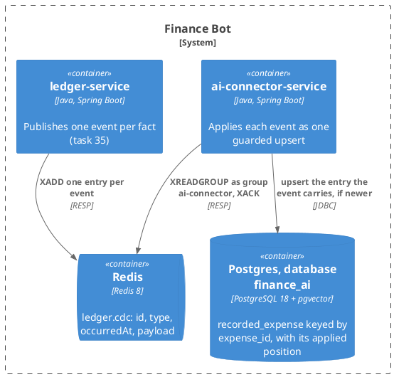

# Design: The Connector Applies Facts

**Affected Modules:** `ai-connector-service`

## Objective

[Task 35](../35-the-ledger-publishes-facts-not-rows/design.md) makes the ledger say what happened: one event per
fact, each carrying the whole entry. The connector still reads rows. Its consumer of Design 32 pairs a proposal
delete with an expense insert by `txId` and content, guesses a discard until its partner arrives, marks `UNKNOWN`
when that partner is dropped, and renames a grouping by name. Since 35 landed, it finds no `source.table` on an
event entry, acknowledges it, and learns nothing (35 D1).

This task is R3's parts (b) and (c) ([findings](../implemented/32-the-connector-learns-what-became-of-a-message/review/findings.md)):
the connector applies each event as one upsert keyed by the entry's `expenseId`, guarded by the event's position
on the stream, so an older delivery can never overwrite a newer one. The pairing, the provisional discard,
`UNKNOWN`, content-equality and the name-keyed rename go. What the model reads through
[task 33](../implemented/33-the-model-reads-the-connectors-memory/design.md) is unchanged in shape and exact in
content.

## Context

| What exists                                              | Where                                                                                                                                                                                                                                                       | What this change does with it                                                                                          |
|----------------------------------------------------------|-------------------------------------------------------------------------------------------------------------------------------------------------------------------------------------------------------------------------------------------------------------|------------------------------------------------------------------------------------------------------------------------|
| The event stream: entry, catalogue, delivery             | [Design 35](../35-the-ledger-publishes-facts-not-rows/design.md), "What a stream entry carries", "The event catalogue"                                                                                                                                       | What the reader parses; the six types are the whole input                                                              |
| The target architecture, R3 (b) and (c)                  | [findings](../implemented/32-the-connector-learns-what-became-of-a-message/review/findings.md)                                                                                                                                                              | (b) is this change; (c)'s guard is this change, its category mirror is D1                                             |
| The consumer as it stands, and its store                 | [Design 32](../implemented/32-the-connector-learns-what-became-of-a-message/design.md); [`learn-message-outcome.md`](../../ai-connector-service/docs/usecases/learn-message-outcome.md)                                                                    | Retry-then-drop, the group, the claim and the backoffs stay; the entry reader, the change and every write are replaced |
| The connector's schema                                   | [`V002`](../../ai-connector-service/src/main/resources/db/migration/V002__create_recorded_expense.sql), [`database.md`](../../ai-connector-service/docs/contracts/out/database.md)                                                                          | `recorded_expense` is rewritten in place (F1); `stream_entry_failure` stays                                             |
| The row's writes and reads                               | [`RecordedExpenseEntityRepository`](../../ai-connector-service/src/main/java/bot/finance/ai/adapter/persistence/RecordedExpenseEntityRepository.java)                                                                                                        | Ten statements become one upsert; the decided-rows read keeps its shape                                                |
| The consumer loop: claim, own pending, new, backoff      | [`ChangeStreamConsumer`](../../ai-connector-service/src/main/java/bot/finance/ai/adapter/redis/ChangeStreamConsumer.java)                                                                                                                                    | Untouched: it reads, offers, acknowledges. What it offers changes                                                       |
| The example an expense renders as                        | [Design 33](../implemented/33-the-model-reads-the-connectors-memory/design.md), "The prompt"; [`RecordedExpenseEntity`](../../ai-connector-service/src/main/java/bot/finance/ai/adapter/persistence/RecordedExpenseEntity.java) `toExampleExpense`           | The amount is stored as the event rendered it, so nothing is scaled on the way out (F3)                                |
| The amount's shape on the stream                         | Design 35 D7                                                                                                                                                                                                                                                | A decimal string in the main unit; kept as such                                                                        |
| The connector's contract for the stream                  | [`change-stream.md`](../../ai-connector-service/docs/contracts/out/change-stream.md)                                                                                                                                                                         | Rewritten: what an entry is here, what is ignored, what redelivery and order mean                                       |
| Backlog R1                                               | [`backlog.md`](../backlog.md)                                                                                                                                                                                                                                | Stays open: an entry with `incomingMessageId: null` is still ignored (F6)                                              |

## Proposed Solution

### What the change adds

| Surface                     | What it becomes                                                                                                         |
|-----------------------------|-------------------------------------------------------------------------------------------------------------------------|
| The stream, as read here    | One entry is one event: `type` picks the status, `payload` is the row, the entry id is its position                    |
| The connector's database    | `recorded_expense` keyed by the ledger's one `expense_id`, three statuses, and the position it was last applied from   |
| Every event                 | One upsert: written when its position is past the row's, skipped when it is not                                        |
| The use case               | Learn or ignore, retry or drop — as today, minus the pairing and the abandonment                                        |
| What the model reads        | The same example lines; `PROPOSED` still hidden, `UNKNOWN` no longer exists                                             |

**One event, one write, no memory of the last one.** Every spending event carries the whole entry, so the row is
overwritten from the event alone. Nothing looks up a partner, a transaction or the previous name.

**Order is kept per row, by the stream.** The entry id is monotone (35 F9). A row remembers the position it was
last written from, and a write with an older position is skipped. A stalled entry claimed after its successors, a
pending sweep past a failing entry, and a plain redelivery all land the same way: the newest fact wins (F4).

**A ledger replay is harmless.** A republished event (35 A12) arrives at a new position and rewrites the row with
the same content; the events after it are republished in order behind it, so the row ends where it was (F5).

### Diagrams

The module takes the repository's [Diagram Format](../conventions/diagrams.md) unchanged. There is no component
diagram: classes belong to the plan.

#### Container — what this change reaches



#### Flow — applying one entry

There is no flow diagram. Every arm is one guard ending the flow, which the
[diagram conventions](../conventions/diagrams.md) make a table (F13); the shape Design 32 drew — two halves of an
acceptance meeting — is what this change removes. What remains after the guards is Design 32's retry-then-drop,
unchanged, drawn on [`learn-message-outcome.md`](../../ai-connector-service/docs/usecases/learn-message-outcome.md).

| An entry that                                                | Does                                                                                          |
|--------------------------------------------------------------|-----------------------------------------------------------------------------------------------|
| has no `payload`, no `type`, or a `payload` that is not JSON, or an id that is not positive | logged at `WARN`, acknowledged, nothing written (F15)                          |
| names a `type` not in the table below                        | acknowledged, nothing written                                                                 |
| carries `incomingMessageId: null`                            | acknowledged, nothing written (F6)                                                            |
| names a message this store never held                        | the upsert inserts nothing; acknowledged                                                      |
| is older than the row it names                               | the upsert overwrites nothing; acknowledged                                                   |
| is applied                                                   | the delivery's failure count is cleared; acknowledged                                         |
| meets an unreachable store                                   | nothing counted, not acknowledged, offered again after the backoff                            |
| meets a store that refuses it                                | the refusal is counted; at `MEMORY_ENTRY_ATTEMPTS` logged at `ERROR`, count cleared, acknowledged, dropped; below it, offered again after the backoff |

**What an entry does** — the six types of Design 35's catalogue, and everything else. Every write is the same
upsert; only the status differs.

| `type`              | Status written | Notes                                                                                        |
|---------------------|----------------|----------------------------------------------------------------------------------------------|
| `ProposalCreated`   | `PROPOSED`     |                                                                                              |
| `ProposalRefiled`   | `PROPOSED`     | the same upsert; the row takes the new category and grouping                                 |
| `ProposalDiscarded` | `DISCARDED`    | final; nothing follows it                                                                    |
| `ProposalAccepted`  | `ACCEPTED`     | the same `expense_id` the pending row had (35 F6)                                            |
| `ExpenseRecorded`   | `ACCEPTED`     | an expense recorded with no proposal; `incomingMessageId` is `null` today, so it is ignored (F6) |
| `ExpenseRefiled`    | `ACCEPTED`     | the row takes the new category and grouping                                                  |
| any other named type | —             | acknowledged, nothing written: a type added later (35 D2) is learned when this service learns it |

The status is decided by `type`; the body's own `status` field is not read (F7). A body with no
`incomingMessageId`, or naming a message this store never held, writes nothing and is acknowledged (F6). An
expense the ledger removes has no event yet, so its row stays until its message is purged (F14).

### Details

#### The store

`V002__create_recorded_expense.sql` is rewritten in place (F1); `stream_entry_failure` is carried over unchanged.

```sql
CREATE TABLE recorded_expense (
    id             BIGSERIAL   PRIMARY KEY,
    message_id     BIGINT      NOT NULL REFERENCES incoming_message (id) ON DELETE CASCADE,
    user_id        BIGINT      NOT NULL,
    expense_id     BIGINT      NOT NULL UNIQUE,
    description    TEXT        NOT NULL,
    merchant       TEXT,
    amount         TEXT        NOT NULL,
    currency_code  VARCHAR(3)  NOT NULL,
    category_id    BIGINT      NOT NULL,
    category_name  TEXT        NOT NULL,
    grouping_id    BIGINT,
    grouping_name  TEXT,
    status         TEXT        NOT NULL CHECK (status IN ('PROPOSED', 'ACCEPTED', 'DISCARDED')),
    applied_ms     BIGINT      NOT NULL,
    applied_seq    BIGINT      NOT NULL,
    updated_at     TIMESTAMPTZ NOT NULL
);

CREATE INDEX idx_recorded_expense_message ON recorded_expense (message_id);

CREATE TABLE stream_entry_failure (
    entry_id        TEXT        PRIMARY KEY,
    attempts        INT         NOT NULL,
    first_failed_at TIMESTAMPTZ NOT NULL,
    last_error      TEXT        NOT NULL
);
```

| Column                       | Holds                                                                                                       |
|------------------------------|-------------------------------------------------------------------------------------------------------------|
| `expense_id`                 | the ledger's one id for the entry's whole life (Design 34); the row's key                                   |
| `amount`                     | the decimal string the event carries, verbatim — `4.50`, `7200` (F3)                                        |
| `category_id`, `category_name` | the filing, from the event's `category`; the name is never absent now                                     |
| `grouping_id`, `grouping_name` | from the event's `grouping`; both `NULL` when the category has no parent (35 F16)                         |
| `status`                     | `PROPOSED`, `ACCEPTED` or `DISCARDED`, from the type table above                                            |
| `applied_ms`, `applied_seq`  | the stream entry id the row was last written from, split at the dash; the guard compares the pair (F4)      |
| `updated_at`                 | when this service last wrote the row, its own clock                                                          |

Gone: `proposal_id`, `moved_in_tx`, `UNKNOWN`, the has-a-key check, and the three indexes that served the
pairing and the name-keyed rename (F8). The row's own `id` is still its arrival order, which task 33 sorts by.

#### The upsert

One statement per event, in one store transaction, no lock beyond the row's own:

- insert the row from the event, joined to `incoming_message` on `(userId, incomingMessageId)` — no message, no
  row;
- on conflict on `expense_id`, overwrite every content column, the status and the position, only where the
  stored `(applied_ms, applied_seq)` is less than the event's;
- a statement that touched no row is not a failure: the message is unknown, or the event is older than the row;
- an event for an `expense_id` this store never inserted — its earlier event dropped, trimmed, or the message
  registered late — inserts the whole row, since every event carries the whole entry (F17).

An entry the reader cannot turn into an event — no `type`, no `payload`, a non-positive `expenseId` or `userId`
— is refused before the store, logged at `WARN` and acknowledged (F15).

| Property                          | How it holds                                                                                                                                       |
|-----------------------------------|----------------------------------------------------------------------------------------------------------------------------------------------------|
| at-least-once, applied once       | the same entry redelivered has the same position, which is not greater; the upsert writes nothing                                                   |
| out of order                      | a claimed or swept entry older than the row's position writes nothing; the row keeps the newer fact (F4)                                           |
| a ledger replay                   | new positions, same content, same order; the row ends as it was (F5)                                                                                |
| two instances, one row            | two upserts on one `expense_id` serialize on the row; the guard decides which content stands, whichever commits first                                |
| the store refuses                 | not acknowledged, counted, dropped at `MEMORY_ENTRY_ATTEMPTS` — Design 32 D1 unchanged; nothing else is written on a drop (F9)                     |
| the store is unreachable          | not counted, not acknowledged, retried after the backoff (32 A18)                                                                                  |
| a message purged meanwhile        | the cascade removed the row; a later event finds no message and writes nothing. A purge committing during the insert fails its foreign key once — one counted refusal — and the redelivery writes nothing and is acknowledged (F18) |
| a rename in the ledger            | no event yet (35 D2); the stored names stay as the last event carried them, and the row holds both ids for when one exists (D1)                    |

#### What the model reads

Nothing changes in the retrieval or the prompt. `ACCEPTED` and `DISCARDED` rows render; `PROPOSED` does not.
`UNKNOWN` had no rendering and no longer exists. The example's amount is the stored string as it is; the currency
still comes from `currency_code`.

#### Configuration, enforcement and documents

No variable is added or removed. `MEMORY_ENABLED`, `REDIS_URL`, `CDC_STREAM_KEY` and `MEMORY_ENTRY_ATTEMPTS`
keep their meaning.

| Setting or document                                                                                    | Change                                                                                                                       |
|--------------------------------------------------------------------------------------------------------|------------------------------------------------------------------------------------------------------------------------------|
| [`change-stream.md`](../../ai-connector-service/docs/contracts/out/change-stream.md)                   | Rewritten: an entry is an event; the ignored table; redelivery and order; the compatibility table                            |
| [`database.md`](../../ai-connector-service/docs/contracts/out/database.md)                             | `recorded_expense` as above                                                                                                  |
| [`learn-message-outcome.md`](../../ai-connector-service/docs/usecases/learn-message-outcome.md)        | Outcomes: one per type, unknown message, held, dropped; the pairing, the abandonment and the renames go; the flow above         |
| `ai-connector-service/docs/domain/`                                                                    | `recorded-change`, `spending-row-change`, `category-row-change`, `category-row`, `change-operation`, `spending-kind` describe what no longer exists; `spending-row` describes the entry the event carries |
| [Testing conventions](../../ai-connector-service/docs/conventions/testing.md)                          | `ChangeStreamEntryFixtures`, `RecordedChangeFixtures` and `RecordedExpenseRowUtils` are described by the row shape           |
| [Architecture](../../ai-connector-service/docs/conventions/architecture.md)                            | Unchanged: `adapter/redis` stays the consumer, no library joins                                                              |
| Backlog R3                                                                                             | Closed by this task and 35 together, less the category mirror (D1)                                                            |
| The ledger's [`change-stream.md`](../../ledger-service/docs/contracts/out/change-stream.md)            | Its "deduplicates on `id`" line, written by 35's plan, is softened to *may*: this consumer guards by position instead (F12) |

## Acceptance Scenarios

### The change stream

- **A1:** a proposal is learned
  - Given: a registered message
  - When: a `ProposalCreated` entry naming it reaches the stream
  - Then: one `PROPOSED` row holds the `expenseId`, the description, the merchant, the amount as the event wrote
    it, the currency, and the category and grouping with their ids and names

- **A2:** a refiled proposal
  - Given: a `PROPOSED` row
  - When: a `ProposalRefiled` entry for its `expenseId` reaches the stream
  - Then: the same row holds the new category and grouping and stays `PROPOSED`

- **A3:** an acceptance
  - Given: a `PROPOSED` row
  - When: a `ProposalAccepted` entry for its `expenseId` reaches the stream
  - Then: the same row is `ACCEPTED`, and no second row exists

- **A4:** a discard
  - Given: a `PROPOSED` row
  - When: a `ProposalDiscarded` entry for its `expenseId` reaches the stream
  - Then: the same row is `DISCARDED`

- **A5:** several proposals accepted at once
  - Given: three `PROPOSED` rows from one message
  - When: three `ProposalAccepted` entries reach the stream
  - Then: each row is `ACCEPTED`, and nothing else changed

- **A6:** a recorded expense is refiled
  - Given: an `ACCEPTED` row, or no row at all for that `expenseId`
  - When: an `ExpenseRefiled` entry for its `expenseId` reaches the stream
  - Then: one `ACCEPTED` row holds the new category id, category name, grouping id and grouping name

- **A7:** an acceptance arriving before its creation
  - Given: no row for an `expenseId`
  - When: its `ProposalAccepted` entry reaches the stream, then its `ProposalCreated` entry from an earlier
    position
  - Then: one row is `ACCEPTED` throughout, and both entries are acknowledged

- **A8:** the same entry delivered twice
  - Given: an entry already applied and acknowledged
  - When: the same entry is offered again
  - Then: the row is unchanged, and the entry is acknowledged

- **A9:** a ledger replay
  - Given: a row written from a `ProposalCreated` and then a `ProposalRefiled`
  - When: both events are republished, byte-identical, in order, at new positions
  - Then: the row ends with the refiled category, and both entries are acknowledged

- **A10:** an entry for an unknown message
  - Given: no registered message with that `incomingMessageId`
  - When: a `ProposalCreated` entry naming it reaches the stream
  - Then: nothing is stored, and the entry is acknowledged

- **A11:** an expense with no message
  - Given: any state
  - When: an `ExpenseRecorded` entry with `incomingMessageId: null` reaches the stream
  - Then: nothing is stored, and the entry is acknowledged

- **A12:** a category with no parent
  - Given: a registered message
  - When: a `ProposalCreated` entry with `grouping: null` reaches the stream
  - Then: the row holds the category, and no grouping id or name

- **A13:** a type this service does not know
  - Given: any state
  - When: an entry whose `type` is none of the six reaches the stream
  - Then: nothing is stored, and the entry is acknowledged

- **A14:** an entry that is not an event
  - Given: any state
  - When: an entry with no `payload`, no `type`, a `payload` that is not JSON, or an `expenseId` that is not
    positive reaches the stream
  - Then: a `WARN` names it, nothing is stored, and it is acknowledged

- **A15:** the store is unreachable mid-apply
  - Given: the connector's database refuses connections
  - When: an entry is read
  - Then: it is not acknowledged, and once the database is back it is applied and acknowledged before newer
    entries

- **A19:** the store is unreachable while an entry is pending
  - Given: an entry delivered `MEMORY_ENTRY_ATTEMPTS` times, every time to a database refusing connections
  - When: the database returns
  - Then: the entry is applied and acknowledged; it was never dropped

- **A16:** a poison entry
  - Given: an entry whose upsert fails every time
  - When: it has been delivered `MEMORY_ENTRY_ATTEMPTS` times
  - Then: an `ERROR` names the entry, its type and its `expenseId`; it is acknowledged and dropped, no row changes,
    and the entries after it are applied

- **A17:** two instances apply one row's events
  - Given: two connector instances in the group, and a `PROPOSED` row
  - When: its `ProposalRefiled` and `ProposalAccepted` entries are handed to different instances
  - Then: one row is `ACCEPTED` with the refiled category, whichever instance commits first

### What the model reads

- **A18:** an example renders the amount as the ledger wrote it
  - Given: an `ACCEPTED` row from an event with `amount: "4.50"` and `currencyCode: "USD"`
  - When: its message is chosen as an example
  - Then: the line reads the description, `4.50 USD`, the category and grouping names, and `accepted`

## Decisions

- **D1:** Does the connector keep a category mirror keyed by id, as R3 (c) names?
  - Answer: No. The row carries `category_id` and `grouping_id` beside the names, and nothing else is kept. A
    rename event, when one exists (35 D2), updates the rows by id in one indexed statement, or brings the mirror
    with it.
  - Basis: decided — the user chose no mirror until an event feeds one, over seeding one now (user, 2026-08-18).
    R3 (c) named the mirror; 35 F23 states the re-resolution path by id without one, and 35 D2's basis quotes the
    convention that a page documents what is served now.

## Design Findings

Grilled (2026-08-18): the diagram convention, failure modes, redelivery and replay, the purge race, the reader's
edges, data, concurrency, recovery and the branch-to-scenario pass; authorization, limits, contract compat with
task 33's reads and the state machine's invariants found clear.

| #   | Question                                                        | Answer                                                                                                                | Evidence                                                                                                          |
|-----|-----------------------------------------------------------------|-----------------------------------------------------------------------------------------------------------------------|-------------------------------------------------------------------------------------------------------------------|
| F1  | A new migration, or `V002` rewritten in place?                  | Rewritten: no database outside a developer's has run it, and 35 D6 set the same rule for the ledger's capture migration; a local database that ran the old file is rebuilt | Design 35 D6; [`database.md`](../../ai-connector-service/docs/contracts/out/database.md), "an *applied* migration is never edited" |
| F2  | Which entries carry a fact this service wants?                  | The six spending types of 35's catalogue; a category or a grouping event does not exist yet, and a type not in the six is acknowledged | Design 35, the catalogue; D2                                                                             |
| F3  | The amount: minor units, or the string?                         | The string, verbatim, in `amount TEXT`; the example already renders a string, and nothing compares amounts any more  | Design 35 D7; [`ExampleExpense`](../../ai-connector-service/src/main/java/bot/finance/ai/domain/value/ExampleExpense.java) `String amount` |
| F4  | What guards an older delivery?                                  | The stream entry id, split into `(ms, seq)` and compared as a pair — a text comparison would misorder `999-0` and `1000-0`; the ledger names the entry id as the position | Design 35 F9; R3 (c)                                                                                       |
| F5  | A republished event lands at a newer position — does it revert the row? | Briefly, and the events after it are republished in order behind it, so the row ends as it was; the memory is an aid, and a read inside that window costs a prompt | Design 35 A12; Design 32 D1                                                                            |
| F6  | An event with `incomingMessageId: null`?                        | Ignored and acknowledged, as today; keeping it is backlog R1, unchanged                                                | [`backlog.md`](../backlog.md) R1; Design 32 F15                                                                   |
| F7  | Is the body's `status` read?                                    | No — the type fixes it, and `ProposalDiscarded` carries `PENDING`, which is not the status this store keeps           | Design 35, the catalogue's Body column                                                                            |
| F8  | Which indexes go?                                               | `category`, `user_grouping` and `moved_in_tx`: they served the rename and the pairing; a rename event's index comes with it (D1) | The migration above; Design 32 F8                                                                            |
| F9  | What does a dropped entry leave behind?                         | Nothing but the log line: no provisional state exists to abandon, so `abandonAcceptance` and `UNKNOWN` go             | Design 32 F19, the reason it existed; the upsert above                                                             |
| F10 | Does the consumer loop change?                                  | No — claim, own pending, new, backoff and acknowledgement are as Design 32 left them; only the reader and the use case's writes change | [`ChangeStreamConsumer`](../../ai-connector-service/src/main/java/bot/finance/ai/adapter/redis/ChangeStreamConsumer.java) |
| F11 | Does the row lock on the message stay?                          | No — nothing pairs two entries any more; the upsert's own row lock is enough (A17)                                    | Design 32 F12, the reason it existed                                                                              |
| F12 | Is the event `id` stored or checked?                            | No — the position guard covers a redelivery and a replay alike (F4, F5). This is not the ledger's "deduplicates on `id`": that consumer would skip a republished event, this one re-applies it and lets the tail restore the row. The ledger's line is softened to *may*, and this module's contract states the guard as its own rule | Design 35, "What a stream entry carries"; the document table above |
| F13 | Does the entry flow earn a diagram?                             | No — every arm is one guard ending the flow, and what follows is Design 32's retry-then-drop, already drawn on the use-case page; the table stands in | [Diagrams](../conventions/diagrams.md), "Choosing a Flow Diagram"; Design 32, the paragraph above its flow |
| F14 | An expense the ledger removes?                                  | Nothing until an `ExpenseRemoved` event exists; the row stays until its message is purged. Deferred to the task adding the event, where it is a delete keyed by `expense_id`, guarded the same way | Design 35 D2, F21; Design 32 A12, which goes |
| F15 | A well-typed body whose `expenseId` or `userId` is absent or not a number? | Refused as unreadable — today `asLong()` answers `0` and the row shape validates neither, so such a body would key on `expense_id = 0`; the event value validates both as positive in its constructor, which routes it to the `WARN` path | [`ChangeStreamEntryReader`](../../ai-connector-service/src/main/java/bot/finance/ai/adapter/redis/ChangeStreamEntryReader.java) `spendingRow`; Design 32 F23; [Code Style](../../ai-connector-service/docs/conventions/code-style.md), value objects validate in the compact constructor |
| F16 | Can a replay republish a `ProposalCreated` without the `ProposalAccepted` behind it? | No — the engine commits its position in order after Redis acknowledges, so a replay runs whole from the last committed position; an accept whose position was committed is never behind a republished create | Design 35, "Flow — a fact reaching the stream"; [ADR 0016](../adr/0016-an-embedded-engine-holds-the-log-position-until-redis-acknowledges-bounded-by-the-database.md) |
| F17 | An event for an `expenseId` this store never inserted?           | Inserted as a whole row, whatever the type — the event carries the whole entry, so a dropped or trimmed earlier event is healed by the next one (A6, A7) | The upsert above; F9 |
| F18 | A message purged during the insert?                             | The insert's foreign key fails once, one counted refusal; the redelivery finds no message, writes nothing and is acknowledged — nothing wrong is left behind | `IncomingMessageEntityRepository.deleteReceivedBefore`; `V002`'s `ON DELETE CASCADE`; Design 32 D1 |
| F19 | Which scenario proves an unreachable store burns no attempts?    | A19, carried from Design 32 A18; A15's Given now says unreachable, since its Then is the unreachable arm | Design 32 A16, A18; `MessageStoreExceptionMapper` |
