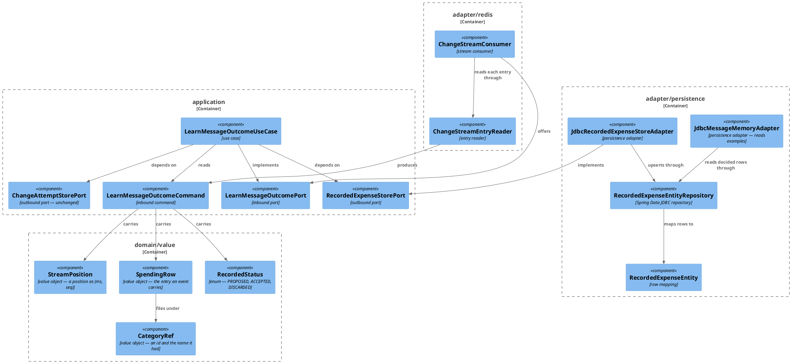

# Plan: The Connector Applies Facts

**Affected Modules:** `ai-connector-service`
**Design:** [The Connector Applies Facts](design.md)

## Components

The design named responsibilities; these are the classes that hold them.



| Type                         | Holds                                                                                                                                            | Refuses                                                                                             |
|------------------------------|--------------------------------------------------------------------------------------------------------------------------------------------------|-------------------------------------------------------------------------------------------------------|
| `SpendingRow`                | `expenseId`, `userId`, `incomingMessageId` (`Optional<String>`), `description`, `merchant` (`Optional<String>`), `amount` (`String`), `currencyCode`, `category` (`CategoryRef`), `grouping` (`Optional<CategoryRef>`) | a non-positive `expenseId` or `userId`, a blank `description` or `amount`, a null `currencyCode`, `category`, or any null `Optional` |
| `CategoryRef`                | `id`, `name`                                                                                                                                      | a non-positive `id`, a null or blank `name`                                                          |
| `RecordedStatus`             | `PROPOSED`, `ACCEPTED`, `DISCARDED`                                                                                                               | —                                                                                                     |
| `StreamPosition`             | `ms`, `seq`; `Comparable`, ordered by `ms` then `seq`                                                                                              | a `ms` of zero or below, a negative `seq`                                                            |
| `LearnMessageOutcomeCommand` | `deliveryId` (the raw entry id), `position`, `status`, `entry`                                                                                     | a blank `deliveryId`, a null `position`, `status` or `entry`                                          |
| `RecordedExpenseEntity`      | `id`, `messageId`, `userId`, `expenseId`, `description`, `merchant`, `amount`, `currencyCode`, `categoryId`, `categoryName`, `groupingId`, `groupingName`, `status`, `appliedMs`, `appliedSeq`, `updatedAt` | — (an outbound row mapping, validating nothing)               |

The entry id's `<ms>-<seq>` text is the stream's own shape, so it is parsed in `ChangeStreamEntryReader` and
never reaches `domain` as a string.

| Port                        | Methods                                                                       |
|-----------------------------|-------------------------------------------------------------------------------|
| `LearnMessageOutcomePort`   | `learn(command)` — unchanged signature                                        |
| `RecordedExpenseStorePort`  | `apply(SpendingRow entry, RecordedStatus status, StreamPosition position)`    |
| `ChangeAttemptStorePort`    | `countFailure(deliveryId, message)`, `clear(deliveryId)` — unchanged          |

| Gone                                                                                                | Replaced by                                                             |
|-----------------------------------------------------------------------------------------------------|---------------------------------------------------------------------------|
| `RecordedChange`, `SpendingRowChange`, `CategoryRowChange`, `CategoryRow`, `ChangeOperation`, `SpendingKind` | `SpendingRow` + `RecordedStatus` + `StreamPosition` on the command   |
| the port's `recordProposed`, `settleProposalDeleted`, `settleExpenseInserted`, `refileExpense`, `removeExpense`, `renameCategory`, `renameGrouping`, `abandonAcceptance` | `apply(...)`                                  |
| `CurrencyCode.toDecimal(long)`                                                                      | the stored decimal string, passed through unscaled                        |

## Step-by-Step Implementation Map (To-Do List)

### Stabilization

#### Database

- [x] ST01 · Rewrite `ai-connector-service/src/main/resources/db/migration/V002__create_recorded_expense.sql` in
  place (design F1), `stream_entry_failure` carried over unchanged:
  ```sql
  CREATE TABLE recorded_expense (
      id             BIGSERIAL   PRIMARY KEY,
      message_id     BIGINT      NOT NULL REFERENCES incoming_message (id) ON DELETE CASCADE,
      user_id        BIGINT      NOT NULL,
      expense_id     BIGINT      NOT NULL UNIQUE,
      description    TEXT        NOT NULL,
      merchant       TEXT,
      amount         TEXT        NOT NULL,
      currency_code  VARCHAR(3)  NOT NULL,
      category_id    BIGINT      NOT NULL,
      category_name  TEXT        NOT NULL,
      grouping_id    BIGINT,
      grouping_name  TEXT,
      status         TEXT        NOT NULL CHECK (status IN ('PROPOSED', 'ACCEPTED', 'DISCARDED')),
      applied_ms     BIGINT      NOT NULL,
      applied_seq    BIGINT      NOT NULL,
      updated_at     TIMESTAMPTZ NOT NULL
  );

  CREATE INDEX idx_recorded_expense_message ON recorded_expense (message_id);

  CREATE TABLE stream_entry_failure (
      entry_id        TEXT        PRIMARY KEY,
      attempts        INT         NOT NULL,
      first_failed_at TIMESTAMPTZ NOT NULL,
      last_error      TEXT        NOT NULL
  );
  ```

#### Interface & Signature Sync

- [x] ST02 · Add `bot.finance.ai.domain.value.RecordedStatus` — an enum of `PROPOSED`, `ACCEPTED`, `DISCARDED`.
- [x] ST03 · Add `bot.finance.ai.domain.value.CategoryRef(long id, String name)` with an empty compact
  constructor, and a `TODO` naming the validation RU02 covers.
- [x] ST04 · Add `bot.finance.ai.domain.value.StreamPosition(long ms, long seq)` implementing
  `Comparable<StreamPosition>`, its compact constructor empty under a `TODO` naming the validation RU03 covers
  and `compareTo` stubbed to `0` under an intent comment naming the `ms`-then-`seq` order. It parses no text:
  the entry id's `<ms>-<seq>` shape belongs to `ChangeStreamEntryReader` (ST11).
- [x] ST05 · Reshape `SpendingRow` to the fields in the Components table, its compact constructor keeping only the
  existing null checks and carrying a `TODO` for the positivity checks RU01 covers; drop `amountMinorUnits`,
  `categoryName`, `groupingName` and `id` in favour of `amount`, `category`, `grouping` and `expenseId`; keep
  `messageIdentity()`.
- [x] ST06 · Delete `RecordedChange`, `SpendingRowChange`, `CategoryRowChange`, `CategoryRow`, `ChangeOperation`
  and `SpendingKind`, together with their tests `SpendingRowChangeTest`, `CategoryRowChangeTest` and
  `CategoryRowTest`, and the fixture `RecordedChangeFixtures` that builds them.
- [x] ST07 · Reshape `LearnMessageOutcomeCommand` to `(String deliveryId, StreamPosition position,
  RecordedStatus status, SpendingRow entry)`, keeping the existing `deliveryId` check and adding null checks for
  the three new components.
- [x] ST08 · Replace `RecordedExpenseStorePort`'s eight methods with
  `void apply(SpendingRow entry, RecordedStatus status, StreamPosition position)`, and stub
  `JdbcRecordedExpenseStoreAdapter` down to that one method — its body empty but for the `DataAccessException`
  mapping through `MessageStoreExceptionMapper` and an intent comment naming the guarded upsert GI01 implements.
- [x] ST09 · Reshape `RecordedExpenseEntity` to the columns ST01 declares (`amount` a `String`, `groupingId` a
  `Long`, `appliedMs`/`appliedSeq` `long`; `proposalId` and `movedInTx` gone), and change `toExampleExpense()` to
  pass `amount` through unscaled, dropping the `CurrencyCode.toDecimal(...)` call.
- [x] ST10 · Reduce `RecordedExpenseEntityRepository` to `findDecidedByMessageIds(...)` — its projection updated
  to the new column list — and one stubbed `upsertApplied(...)` returning `0`, with an intent comment naming the
  insert-joined-to-`incoming_message`, conflict-on-`expense_id`, newer-position-only statement GI01 implements.
  Every pairing, rename, discard, delete and `markUnknown` statement goes.
- [x] ST11 · Rewrite `ChangeStreamEntryReader.read(String entryId, Map<String, String> body)` down to a stub
  answering `Optional.empty()`, with an intent comment naming the type-to-status mapping, the event body it
  reads, and the `<ms>-<seq>` entry id it turns into a `StreamPosition`; the old table-and-op parsing goes.
- [x] ST12 · Reduce `LearnMessageOutcomeUseCase`'s `apply` to a stub calling nothing, with an intent comment
  naming the single guarded upsert GU06 implements; delete `applySpendingChange`, `applyProposalChange`,
  `applyExpenseChange`, `applyCategoryChange`, `abandonAcceptanceIfExpenseCreated` and `kindOf`. `onFailure` and
  `drop` take the command in place of the deleted `RecordedChange`, and the `ERROR` line names the delivery id,
  the command's status and the entry's `expenseId`. The attempt counting, the backoff arms and `LearnOutcome`
  stay as they are.
- [x] ST18 · Delete `CurrencyCode.toDecimal(long)`, whose last caller ST09 removes.
- [x] ST16 · Disable every test method that no longer compiles or would now fail, per the module's
  [testing conventions](../../ai-connector-service/docs/conventions/testing.md) — `@Disabled("<step>: …")`
  naming the step that reworks it, the method kept and only its body commented out where it cannot compile:
  `ChangeStreamEntryReaderTest` (RU05), `LearnMessageOutcomeUseCaseTest` (RU06), `SpendingRowTest` (RU01),
  `LearnMessageOutcomeCommandTest` (RU04), `RecordedExpenseEntityTest` (RU07), `CurrencyCodeTest` (RU07),
  `JdbcRecordedExpenseStoreAdapterTest` (RI01), `JdbcMessageMemoryAdapterTest` (RI02),
  `ChangeStreamConsumerTest` (RI03), `LearnMessageOutcomeSystemTest` (RS01), `RecallExamplesSystemTest` (RS02).

#### Shared Test Infrastructure

- [x] ST13 · Rewrite `ChangeStreamEntryFixtures` to build event entries — a body of `id`, `type`, `occurredAt`
  and `payload`, the payload carrying `userId`, `incomingMessageId`, `expenseId`, `status`, `description`,
  `merchant`, `amount`, `currencyCode`, `category` and `grouping` — with one builder per type of the design's
  table, a builder for a body with no `payload`, one for a body whose `payload` is not JSON, and one for an
  unknown `type`.
- [x] ST14 · Add `bot.finance.ai.common.fixtures.SpendingFactFixtures` — `SpendingRow`, `CategoryRef`,
  `RecordedStatus` and `StreamPosition` builders with named defaults, for the unit and integration steps.
- [x] ST15 · Reshape `RecordedExpenseRowUtils` to the new columns: `insert(...)` taking `expenseId`, a decimal
  `String` amount, `groupingId` and an applied position; `insertApplied(...)` replacing `insertDecided(...)`;
  `findByExpenseId(...)` kept and `findByProposalId(...)` gone; the `RecordedExpenseRow` record dropping
  `proposalId` and `movedInTx` and gaining `groupingId`, `appliedMs` and `appliedSeq`. Fix the call sites the
  renames break where nothing about their assertions changes — `BackfillEmbeddingsSystemTest` and
  `RecallExamplesSystemTest`'s `insertEarlierAcceptedMessage(...)` — to `insertApplied(...)` and
  `findByExpenseId(...)`, so neither is disabled.
- [x] ST17 · Confirm `bot.finance.ai.architecture.CleanArchitectureTest` still passes.

### Red Phase

#### TDD Unit Red Phase

- [x] RU01 · `SpendingRow` · test: `SpendingRowTest` · covers: `SpendingRow(...)`, `messageIdentity()` · scenarios: A1, A12, A14
  - `SpendingRow(...)`:
    - given: an `expenseId` of zero or below, or a `userId` of zero or below
      when: the record is constructed
      then: an `InvalidValueException` is thrown
    - given: a blank or null `description`, or a blank or null `amount`
      when: the record is constructed
      then: an `InvalidValueException` is thrown
    - given: a null `currencyCode`, `category`, or any null `Optional` component
      when: the record is constructed
      then: an `InvalidValueException` is thrown
    - given: an empty `grouping` and an empty `merchant`
      when: the record is constructed
      then: it is accepted and both read back empty
  - `messageIdentity()`:
    - given: a row carrying an `incomingMessageId`
      when: `messageIdentity()` is called
      then: it holds the row's `userId` and that message id
    - given: a row carrying none
      when: `messageIdentity()` is called
      then: it is empty
  - update: `whenDescriptionIsNullOrBlank_thenThrowsInvalidValueException()` — delete
  - update: `whenCurrencyCodeIsNull_thenThrowsInvalidValueException()` — delete
  - update: `whenAnOptionalFieldIsNull_thenThrowsInvalidValueException()` — delete
  - update: `whenRowCarriesIncomingMessageId_thenIdentityCarriesUserIdAndMessageId()` — delete
  - update: `whenRowHasNoIncomingMessageId_thenItIsEmpty()` — delete

- [x] RU02 · `CategoryRef` · test: `CategoryRefTest` · covers: `CategoryRef(...)` · scenarios: A1
  - `CategoryRef(...)`:
    - given: an id of zero or below
      when: the record is constructed
      then: an `InvalidValueException` is thrown
    - given: a null or blank name
      when: the record is constructed
      then: an `InvalidValueException` is thrown
    - given: a positive id and a name
      when: the record is constructed
      then: both read back unchanged

- [x] RU03 · `StreamPosition` · test: `StreamPositionTest` · covers: `StreamPosition(...)`, `compareTo()` · scenarios: A7, A8, A9
  - `StreamPosition(...)`:
    - given: a `ms` of zero or below, or a negative `seq`
      when: the record is constructed
      then: an `InvalidValueException` is thrown
  - `compareTo()`:
    - given: `(999, 0)` and `(1000, 0)`
      when: they are compared
      then: `(999, 0)` is the smaller, so the order a text comparison would give does not decide it
    - given: two positions sharing a `ms` and differing in `seq`
      when: they are compared
      then: the lower `seq` is the smaller
    - given: two positions with the same `ms` and `seq`
      when: they are compared
      then: neither is greater

- [x] RU04 · `LearnMessageOutcomeCommand` · test: `LearnMessageOutcomeCommandTest` · covers: `LearnMessageOutcomeCommand(...)` · scenarios: A1
  - `LearnMessageOutcomeCommand(...)`:
    - given: a delivery id, a position, a status and an entry
      when: the record is constructed
      then: all four read back unchanged
    - given: a null or blank delivery id, or a null position, status or entry
      when: the record is constructed
      then: an `InvalidValueException` is thrown
  - update: `whenDeliveryIdAndChangeGiven_thenBothReadBackUnchanged()` — delete
  - update: `whenDeliveryIdNullOrBlankOrChangeIsNull_thenThrowsInvalidValueException()` — delete

- [x] RU05 · `ChangeStreamEntryReader` · test: `ChangeStreamEntryReaderTest` · covers: `read()` · scenarios: A1, A2, A3, A4, A6, A11, A12, A13, A14
  - `read()`:
    - given: a `ProposalCreated` entry naming a message, at entry id `1700000000000-3`
      when: it is read
      then: the command holds that entry id as its delivery id, a position of `ms` `1700000000000` and `seq`
      `3`, `PROPOSED`, and an entry carrying the `expenseId`, description, merchant, amount string, currency,
      category id and name, grouping id and name
    - given: a `ProposalRefiled` entry
      when: it is read
      then: the command's status is `PROPOSED`
    - given: a `ProposalDiscarded` entry, whose body's own `status` reads `PENDING`
      when: it is read
      then: the command's status is `DISCARDED`, the body's `status` field never consulted
    - given: a `ProposalAccepted`, an `ExpenseRecorded` or an `ExpenseRefiled` entry
      when: it is read
      then: the command's status is `ACCEPTED`
    - given: an entry whose `payload` has `grouping: null`
      when: it is read
      then: the entry's grouping is empty and its category is unchanged
    - given: an entry whose `payload` has `merchant: null`
      when: it is read
      then: the entry's merchant is empty
    - given: an entry whose `payload` has `incomingMessageId: null`
      when: it is read
      then: the command is answered and its entry carries no message id
    - given: an entry whose `type` is none of the six
      when: it is read
      then: it answers empty
    - given: an entry with no `payload`, no `type`, a `payload` that is not JSON, or an `expenseId` or `userId`
      that is absent, not a number or not positive
      when: it is read
      then: an `InvalidValueException` is thrown
    - given: an entry id with no dash, a non-numeric half, or a `ms` of zero or below
      when: it is read
      then: an `InvalidValueException` is thrown
  - update: `whenProposalCreatedBodyCarriesEnrichment_thenCommandHoldsProposalCreatedChange()` — delete
  - update: `whenProposalDeletedBodyIsRead_thenChangeIsDeletedWithBeforeRowAndNoAfter()` — delete
  - update: `whenExpenseUpdatedBodyHasDifferentEnrichmentNames_thenBeforeAndAfterHoldTheirOwnNames()` — delete
  - update: `whenExpenseCreatedBodyHasNullIncomingMessageId_thenAfterRowMessageIdIsEmpty()` — delete
  - update: `whenSpendingBodyHasNoEnrichmentBlock_thenBothNamesAreEmptyOnEveryRow()` — delete
  - update: `whenCategoryUpdatedBodyIsRead_thenAfterRowParentIdMatchesRow()` — delete
  - update: `whenBodyIsIgnored_thenAnswersEmpty()` — delete
  - update: `whenBodyIsNotValidChangeEvent_thenInvalidValueExceptionIsThrown()` — delete

- [x] RU06 · `LearnMessageOutcomeUseCase` · test: `LearnMessageOutcomeUseCaseTest` · covers: `learn()` · scenarios: A1, A11, A15, A16, A19
  - `learn()`:
    - given: a command carrying an entry with a message id
      when: `learn(...)` is called
      then: the store's `apply(...)` receives that entry, status and position, the attempt store is cleared for
      the delivery id, and the outcome is `APPLIED`
    - given: a command whose entry carries no message id
      when: `learn(...)` is called
      then: the store is never touched and the outcome is `APPLIED`
    - given: a store throwing `MessageStoreUnavailableException` on three successive calls
      when: `learn(...)` is called three times
      then: every outcome is `RETRY_LATER`, no failure is counted, and one `WARN` names each delivery
    - given: a store throwing `MessageStoreFailedException` and an attempt store answering below
      `entryAttempts`
      when: `learn(...)` is called
      then: the outcome is `RETRY_LATER`, the failure is counted, and nothing is logged at `ERROR`
    - given: a store throwing `MessageStoreFailedException` and an attempt store answering `entryAttempts`
      when: `learn(...)` is called
      then: the outcome is `DROPPED`, one `ERROR` names the delivery, the status and the entry's `expenseId`,
      the attempts are cleared, and nothing else is written
    - given: an attempt store throwing `MessageStoreUnavailableException` while counting
      when: `learn(...)` is called
      then: the outcome is `RETRY_LATER` and nothing propagates
  - update: premise — the use case applies one command through one `apply(...)` call and keeps no provisional
    state · a test whose body verifies a pairing, a rename, a removal or an abandonment is deleted, and one
    whose body drives only the retry-then-drop arms is rewritten against `apply(...)`
  - update: `whenProposalCreatedOrUpdatedWithMessageId_thenRecordProposedReceivesAfterRowAndOutcomeApplied()` — delete
  - update: `whenProposalDeletedWithMessageId_thenSettleProposalDeletedReceivesBeforeRowAndTransactionId()` — delete
  - update: `whenExpenseCreatedWithMessageId_thenSettleExpenseInsertedReceivesAfterRowAndTransactionId()` — delete
  - update: `whenExpenseUpdatedWithMessageId_thenRefileExpenseReceivesAfterRow()` — delete
  - update: `whenExpenseDeletedWithMessageId_thenRemoveExpenseReceivesBeforeRowId()` — delete
  - update: `whenSpendingChangeCarriesNoMessageId_thenStoreNeverTouchedAndOutcomeApplied()` — delete
  - update: `whenCategoryUpdatedWithParentAndNewName_thenRenameCategoryReceivesCategoryIdAndAfterName()` — delete
  - update: `whenCategoryUpdatedWithNoParentAndNewName_thenRenameGroupingReceivesUserIdBeforeNameAndAfterName()` — delete
  - update: `whenCategoryMovedCreatedOrDeleted_thenStoreNeverTouchedAndOutcomeApplied()` — delete
  - update: `whenNonExpenseCreatedChangeIsDropped_thenDroppedAndAbandonAcceptanceNeverCalled()` — delete
  - update: `whenAbandonAcceptanceThrowsFailedException_thenStillDroppedAndOneWarnLogged()` — delete
  - update: `whenExpenseCreatedFailsAtEntryAttempts_thenDroppedErrorLoggedAbandonAcceptanceAndClearCalled()` — delete

- [x] RU07 · `RecordedExpenseEntity` · test: `RecordedExpenseEntityTest` · covers: `toExampleExpense()` · scenarios: A18
  - `toExampleExpense()`:
    - given: a row whose `amount` reads `4.50` and whose currency is `USD`
      when: `toExampleExpense()` is called
      then: the example's amount is `4.50` and its currency is `USD`, nothing scaled
    - given: a row whose `amount` reads `7200` and whose currency is `JPY`
      when: `toExampleExpense()` is called
      then: the example's amount is `7200`
  - update: premise — the entity is built with a `String` amount, a `Long` `groupingId` and an applied position,
    and with no `proposalId` or `movedInTx` · a test constructing a `RecordedExpenseEntity` is rebuilt from the
    new components
  - update: `whenCurrencyHasTwoMinorDigits_thenAmountScalesIntoExampleAccordingly()` — delete
  - update: `whenCurrencyHasNoMinorUnit_thenAmountAnswersWithNoDecimalPlaces()` — delete
  - update: `whenCategoryNameIsAbsent_thenExampleCategoryNameIsEmpty()` — delete: `category_name` is now
    `NOT NULL`, so no row can reach the mapping without one
  - update: `whenToDecimalCalled_thenItAnswersTheMainUnitDecimalShiftedByTheCurrencysOwnMinorUnitDigits()` —
    delete, with the `minorUnitScenarios` source it reads, since ST18 removes the method it drives

#### TDD Integration Red Phase

- [x] RI01 · `JdbcRecordedExpenseStoreAdapter` · test: `JdbcRecordedExpenseStoreAdapterTest` · covers: `apply()` · scenarios: A1, A2, A3, A4, A5, A6, A7, A8, A9, A10, A12, A17
  - `apply()`:
    - given: a registered message and no row for the `expenseId`
      when: `apply(...)` is called with a `PROPOSED` entry
      then: one row holds the message, the user, the `expenseId`, the description, the merchant, the amount
      string, the currency, both category columns, both grouping columns, `PROPOSED`, and the position's `ms`
      and `seq`
    - given: that `PROPOSED` row
      when: `apply(...)` is called again for the same `expenseId` at a newer position with another category and
      grouping, still `PROPOSED`
      then: the same row holds the new category and grouping, stays `PROPOSED`, and no second row exists
    - given: that `PROPOSED` row
      when: `apply(...)` is called at a newer position with `ACCEPTED`
      then: the same row is `ACCEPTED` and no second row exists
    - given: that `PROPOSED` row
      when: `apply(...)` is called at a newer position with `DISCARDED`
      then: the same row is `DISCARDED`
    - given: three `PROPOSED` rows of one message
      when: `apply(...)` is called for each `expenseId` with `ACCEPTED`
      then: each row is `ACCEPTED` and nothing else changed
    - given: a registered message and no row for the `expenseId`
      when: `apply(...)` is called with an `ACCEPTED` entry
      then: the whole row is inserted `ACCEPTED`
    - given: a row written at a position
      when: `apply(...)` is called for the same `expenseId` at an older position with other content
      then: the row is untouched — content, status and position alike — and the call throws nothing
    - given: a row written at a position
      when: `apply(...)` is called with the very same entry and position again
      then: the row is unchanged and the call throws nothing
    - given: a row written from a `PROPOSED` entry and then a `PROPOSED` refile
      when: both are applied again, byte-identical, at newer positions in the same order
      then: the row ends with the refiled category
    - given: no registered message under the entry's identity
      when: `apply(...)` is called
      then: no row is written and the call throws nothing
    - given: a registered message and an entry whose grouping is empty
      when: `apply(...)` is called
      then: the row holds the category id and name, and `grouping_id` and `grouping_name` are both null
    - given: two threads applying a refile and an acceptance of one `expenseId` at once, repeatedly
      when: both calls run
      then: every run ends with exactly one row whose content and status are those of the higher position
    - given: a repository throwing a resource-failure or transient exception, then another `DataAccessException`
      when: `apply(...)` is called
      then: a `MessageStoreUnavailableException` is thrown for the first, and a `MessageStoreFailedException`
      that is not that subtype for the second
  - update: `whenRegisteredMessageHasNoRow_thenOnePropsedRowHoldsContentAndIdentifiers()` — delete
  - update: `whenCalledAgainForRowAlreadyAccepted_thenStillOneRowLaterNameStillAccepted()` — delete
  - update: `whenNoMessageRegisteredUnderIdentity_thenNoRowWritten()` — delete
  - update: `whenProposedRowHasNoOtherRow_thenBecomesDiscardedRememberingTransaction()` — delete
  - update: `whenUnpairedAcceptedRowOfTransactionMatches_thenOneRowRemainsAcceptedWithBothIds()` — delete
  - update: `whenTwoUnpairedAcceptedRowsMatch_thenLowerExpenseIdTakesProposalId()` — delete
  - update: `whenCalledAgainForRowAlreadyAcceptedWithBothIds_thenRowUnchanged()` — delete
  - update: `whenNoMessageRegisteredForProposal_thenNothingChanges()` — delete
  - update: `whenDiscardedRowOfTransactionMatches_thenBecomesAcceptedHoldingExpenseId()` — delete
  - update: `whenCalledTwiceForTwoEqualContentDiscardedRows_thenLowerProposalIdPairsFirst()` — delete
  - update: `whenThreeDiscardedRowsDifferInContent_thenEachPairsWithMatchingContent()` — delete
  - update: `whenOnlyDiscardedMatchOfAnotherTransaction_thenLoneAcceptedRowWritten()` — delete
  - update: `whenOnlyDiscardedMatchOfAnotherMessage_thenLoneAcceptedRowWritten()` — delete
  - update: `whenCalledAgainForRowAlreadyKeyedByExpenseId_thenStillOneRowLaterName()` — delete
  - update: `whenBothSettleCallsRunAtOnceRepeatedly_thenEveryRunEndsWithOneAcceptedRowHoldingBothIds()` — delete
  - update: `whenRefileExpenseCalledForAcceptedRow_thenHoldsNewCategoryStayingAccepted()` — delete
  - update: `whenRemoveExpenseCalledWithAcceptedRowExpenseId_thenGoneMessageStays()` — delete
  - update: `whenNoRowUnderExpenseId_thenRefileAndRemoveThrowNothing()` — delete
  - update: `whenRenameCategoryCalledForOneCategory_thenOnlyItsRowsHoldNewName()` — delete
  - update: `whenRenameGroupingCalledForOnePerson_thenOnlyThatPersonRowsRenamed()` — delete
  - update: `whenNoRowMatchesCategoryOrGrouping_thenBothCallsThrowNothing()` — delete
  - update: `whenAbandonAcceptanceCalledForTransaction_thenOnlyItsRowBecomesUnknown()` — delete
  - update: `whenNoRowOfMessageMatchesTransaction_thenAbandonAcceptanceThrowsNothing()` — delete
  - update: `whenRepositoryThrowsResourceFailureOrTransientException_thenThrowsMessageStoreUnavailableException()` — delete
  - update: `whenRepositoryThrowsAnotherDataAccessException_thenThrowsMessageStoreFailedExceptionNotSubtype()` — delete

- [x] RI02 · `JdbcMessageMemoryAdapter` · test: `JdbcMessageMemoryAdapterTest` · covers: `findExamples()` · scenarios: A18
  - `findExamples()`:
    - given: a neighbouring message whose rows read `15.50` in `EUR` and `7200` in `JPY`
      when: `findExamples(...)` is called
      then: the examples carry those two strings verbatim, each beside its own currency
  - update: premise — a `recorded_expense` row is keyed by `expense_id`, stores its amount as a decimal string
    and holds a `grouping_id`, and `UNKNOWN` is no longer a status the table accepts · a test whose body inserts
    a decided row passes an `expenseId`, a string amount and an applied position
  - update: `whenNeighbourHoldsAcceptedDiscardedAndUnknown_thenOnlyDecidedTwoAreCarried()` — rewritten to a
    neighbour holding `ACCEPTED`, `DISCARDED` and `PROPOSED` rows, asserting only the two decided ones are carried
  - update: `whenAmountsAre1550EurAnd1500Jpy_thenReadAsMainUnitDecimalBesideOwnCurrency()` — delete, replaced by
    the scenario above
  - update: `whenExpenseHasNoCategoryOrGroupingName_thenBothAbsentRestUnchanged()` — rewritten to a row with a
    category name and no grouping, asserting only the grouping name is absent

- [x] RI03 · `ChangeStreamConsumer` · test: `ChangeStreamConsumerTest` · covers: `run()` · mocks: `LearnMessageOutcomePort` · scenarios: A8, A14, A15, A16
  - Happy Path:
    - given: the port answering `APPLIED`
      when: a `ProposalCreated` entry is published to the stream
      then: the group exists, the port is offered a command whose status is `PROPOSED` and whose entry holds the
      published `expenseId`, and the group's pending count reads zero
  - Error Mapping:
    - given: the port answering `RETRY_LATER` for a first entry and `APPLIED` for a second
      when: both are published
      then: the second is never offered before the first's last offer, and both end acknowledged
    - given: the port answering `DROPPED`
      when: an entry is published
      then: it is acknowledged and the next entry is offered
    - given: an entry whose body carries no `payload`
      when: it is published
      then: a `WARN` names it, it is acknowledged, and the port is never offered it
    - given: the port throwing a `RuntimeException`
      when: an entry is published
      then: an `ERROR` names it, it stays pending, and the consumer runs on
  - update: premise — an entry is an event and the command carries a status, a position and one entry instead of
    a `RecordedChange` · a test whose body builds a change-stream body or asserts on the offered command's
    `change()` is rebuilt on the event fixtures, asserting the command's status and entry instead

#### TDD System Test Red Phase

- [x] RS01 · `LearnMessageOutcomeSystemTest` · covers: `ChangeStreamConsumer.run()` · scenarios: A1, A3, A10
  - Happy Path:
    - given: a registered message
      when: a `ProposalCreated` entry naming it is published to the stream, and then its `ProposalAccepted`
      then: exactly one row for that `expenseId` ends `ACCEPTED` holding the description, merchant, amount
      string, currency, category and grouping, and the group's pending count reads zero
  - Unhappy Path:
    - given: no registered message under the entry's identity
      when: a `ProposalCreated` entry naming it is published
      then: the pending count reads zero and no row exists
  - update: `whenProposalDeleteAndExpenseInsertShareTxId_thenOneRowAcceptedWithBothIdsAndPendingZero()` — delete
  - update: `whenProposedRowsDeleteArrivesAlone_thenRowIsDiscarded()` — delete
  - update: `whenProposalForUnregisteredMessageArrives_thenAcknowledgedAndNoRowExists()` — delete

- [x] RS02 · `RecallExamplesSystemTest` · covers: `ExtractIntents` RPC · scenarios: A18
  - Happy Path:
    - given: an earlier accepted message whose stored row reads `4.50` in `USD`
      when: a new close message is handled
      then: the prompt's example line carries the description, `4.50 USD`, the category and grouping names, and
      `accepted`
  - update: `whenNewMessageArrivesCloseToEarlierAcceptedOne_thenPromptCarriesItAsExample()` — delete, replaced by
    the scenario above

### Green Phase

#### TDD Unit Green Phase

- [x] GU01 · `CategoryRef` · test: `CategoryRefTest`
- [x] GU02 · `StreamPosition` · test: `StreamPositionTest`
- [x] GU03 · `SpendingRow` · test: `SpendingRowTest` · after: GU01
- [x] GU04 · `LearnMessageOutcomeCommand` · test: `LearnMessageOutcomeCommandTest` · after: GU01, GU02, GU03
- [x] GU05 · `ChangeStreamEntryReader` · test: `ChangeStreamEntryReaderTest` · after: GU01, GU02, GU03, GU04
- [x] GU06 · `LearnMessageOutcomeUseCase` · test: `LearnMessageOutcomeUseCaseTest` · after: GU02, GU03, GU04
- [x] GU07 · `RecordedExpenseEntity` · test: `RecordedExpenseEntityTest`

#### TDD Integration Green Phase

- [x] GI01 · `JdbcRecordedExpenseStoreAdapter` · test: `JdbcRecordedExpenseStoreAdapterTest` · after: GU01, GU02, GU03
- [x] GI02 · `JdbcMessageMemoryAdapter` · test: `JdbcMessageMemoryAdapterTest` · after: GU07
- [x] GI03 · `ChangeStreamConsumer` · test: `ChangeStreamConsumerTest` · after: GU05

#### TDD System Test Green Phase

- [x] GS01 · `LearnMessageOutcomeSystemTest` · covers: `ChangeStreamConsumer.run()`
- [x] GS02 · `RecallExamplesSystemTest` · covers: `ExtractIntents` RPC

### Post-Implementation Steps

None. Q1 was answered `no`, and this group holds only the ADR an approved candidate earns.

## Open Questions / Blockers

- **Q1:** Is an ADR approved for *the connector applies each event once per row, guarded by the stream entry
  position rather than by the event id*? Without one, the module's
  [`change-stream.md`](../../ai-connector-service/docs/contracts/out/change-stream.md) states the guard as its own
  rule, which is what design F12 already asks for.
  - A: No. The contract page states the guard as its own rule, and no ADR is written.

- **B1 (RU06):** `whenStoreApplies_thenAttemptsClearReceivesDeliveryId()` was disabled under RU06 but named by no
  `update:` bullet, and its body verified only `clear(...)` — so neither RU06's premise bullet nor any per-method
  bullet authorized removing it. The red agent folded its assertion into
  `whenEntryCarriesMessageId_thenStoreAppliesEntryStatusPositionAttemptsClearedAndOutcomeApplied()` and dropped
  the method, so no coverage was lost, but one method left the tree that the plan did not name. Recorded rather
  than reverted: the surviving test asserts the same thing.

- **B2 (RU07 / GU07):** RU07's two new `toExampleExpense()` tests pass in the red phase instead of failing, because
  ST09 already made the method pass `amount` through unscaled — the stabilization step and the green step overlap,
  so the behaviour GU07 would implement was already in the tree. Not a red defect: the tests assert real
  behaviour and would fail if the pass-through were removed. GU07 is therefore a verification-only step.

- **B3 (RI02 / GI02, RS02 / GS02):** the same overlap as B2, one layer out. `JdbcMessageMemoryAdapter.findExamples()`
  and the recall path were never stubbed — ST09's unscaled pass-through was the whole behaviour change — so every
  `FindExamples` test and RS02's example-line test pass in the red phase. The assertions are genuine (they fail if
  the amount is scaled again or an undecided row leaks through), so GI02 and GS02 join GU07 as verification-only
  steps.

- **B4 (GI03, GS01, GS02):** these three steps needed no production change of their own. `ChangeStreamConsumer` and
  both system flows were never stubbed — they were red only because the reader and the use case below them were —
  so GU05 and GU06 greened all nine of their tests at once. Ticked on the orchestrator's own full-suite run
  (384/384, 0 skipped), which is the stage guardrail these steps are judged by, rather than on a step agent's
  report.

## Review Findings

- **F1:** ST16 disabled `ChangeStreamConsumerTest` naming GU05, which reworks a different class, so it would
  have stayed disabled — losing A14's acknowledged-`WARN` arm and A15's applied-before-newer-entries arm, which
  no other step reached.
  - Resolution: decision
  - Action: applied — added RI03 and GI03 for `ChangeStreamConsumer` against `ChangeStreamConsumerTest`,
    covering A8, A14, A15 and A16, and pointed ST16's reason at RI03. Resolved against the repository: the
    module's [testing conventions](../../ai-connector-service/docs/conventions/testing.md) map
    `adapter/redis`'s consumer to the integration type via `@RedisAdapterTest`, so the step's type was not a
    judgement call.

- **F2:** ST16 disabled `BackfillEmbeddingsSystemTest` naming RI02, which reworks another class; it breaks only
  on ST15's helper renames.
  - Resolution: mechanical
  - Action: applied — dropped it from ST16 and named it in ST15 as a call site fixed to `insertApplied(...)`
    and `findByExpenseId(...)`.

- **F3:** ST12 claimed the retry-then-drop logic stays untouched, but `onFailure`/`drop` take a `RecordedChange`
  and the `ERROR` line reads `kindOf(change)`, `change.op()` and `change.rowId()` — all deleted by ST06.
  - Resolution: mechanical
  - Action: applied — ST12 now names the signature change to the command, the removal of `kindOf`, and the
    `ERROR` line naming the delivery id, the status and the `expenseId`.

- **F4:** RU07's bullets reached only three of `RecordedExpenseEntityTest`'s methods, leaving three disabled
  ones nothing would re-enable, and two of RU07's scenarios restated what they already proved.
  - Resolution: mechanical
  - Action: applied — added the constructor-reshape premise bullet and dropped the grouping-absent and
    status-mapping scenarios.

- **F5:** Six steps listed scenarios that a premise `update:` bullet in the same step would already turn an
  existing test into, so each would be written twice.
  - Resolution: decision
  - Action: applied — took the second shape throughout: every duplicated method now carries a per-method
    `— delete` bullet, and the premise bullets that only said "rewritten" are gone (RU01, RU04, RU05, RI01,
    RS01, RS02). Resolved against
    [`step-formats.md`](../../.claude/templates/step-formats.md), whose red-exit check counts what left the tree
    against `— delete` bullets; the two premises left (RU06, RI02, RI03) name a fact each and are not restated
    by any scenario.

- **F6:** `StreamPosition.of(String entryId)` parsed the stream's `<ms>-<seq>` text inside `domain/value`,
  against the module's rule that no core type carries a transport-shaped field.
  - Resolution: decision
  - Action: applied — `StreamPosition` keeps `(long ms, long seq)` and its ordering; the parsing moved into
    `ChangeStreamEntryReader`, and RU03's `of()`/`entryId()` scenarios moved to RU05 with it. Resolved against
    [Architecture & Layering](../../ai-connector-service/docs/conventions/architecture.md), "No type in
    `domain`/`application` carries a transport-shaped field".

- **F7:** ST09 removed `CurrencyCode.toDecimal(long)`'s last production caller, leaving the method and its
  parameterized test behind it.
  - Resolution: decision
  - Action: applied — added ST18 deleting the method, and RU07 now carries the `— delete` bullet for
    `whenToDecimalCalled_...`. Resolved against the repository: `RecordedExpenseEntity.toExampleExpense()` is
    its only caller anywhere in `src/main`, and [Code Style](../../ai-connector-service/docs/conventions/code-style.md)
    puts leftover scaffolding on the cleanup list.

- **F8:** ST16 sat under **Shared Test Infrastructure**, while a broken call site's test-tree fix belongs to
  **Interface & Signature Sync**.
  - Resolution: mechanical
  - Action: applied — moved ST16 to the end of that sub-group, ST13–ST15 left as the shared-infrastructure
    items and ST17 as the closing one.
