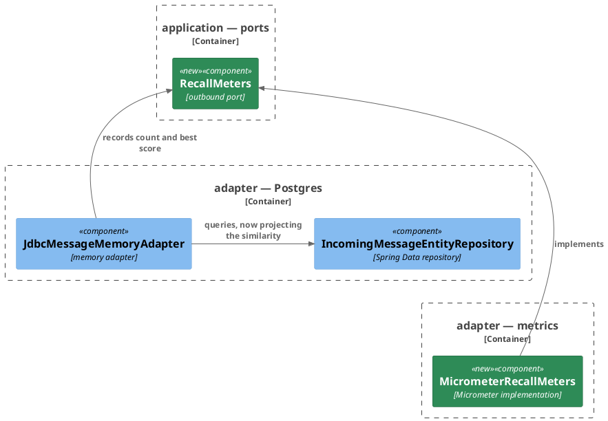
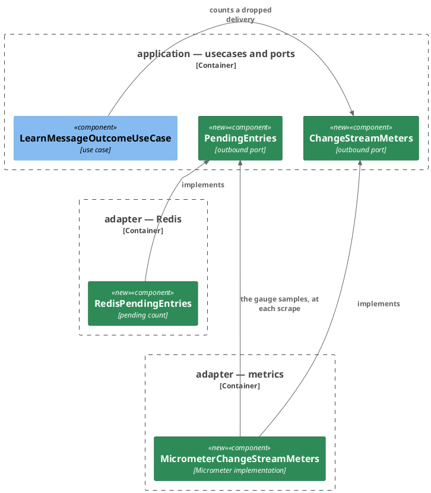

# Plan: Meter the Extraction Pipeline — AI Connector Service

**Affected Modules:** `ai-connector-service`
**Design:** [Meter the Extraction Pipeline](../design.md)

The provider timers, token counters, tool-call timer and gRPC timer come from the framework's observations —
no class here records them. The system steps below are what asserts they reach the scrape. Per the design's D4,
the module's own meters are reached through ports in `application/port`, logger-style; only the new
`adapter/metrics` package touches Micrometer.

## Components

Two subjects, no arrow between them, so two diagrams.

The recall meters:

The change-stream meters:

| Port                 | Methods                                                                                                                        |
|----------------------|--------------------------------------------------------------------------------------------------------------------------------|
| `RecallMeters`       | `recordExamples(int returned)`, `recordBestSimilarity(double score)`                                                           |
| `ChangeStreamMeters` | `countDropped()`                                                                                                               |
| `PendingEntries`     | `double count()` — the group's delivered-but-unacknowledged entry count; `NaN` before the first successful read (design F26) |

| Record            | Fields                                                           |
|-------------------|------------------------------------------------------------------|
| `ClosestMatchRow` | `id` (the message), `similarity` (`1 - (embedding <=> :vector)`) |

- `MicrometerRecallMeters`, `MicrometerChangeStreamMeters` and `RedisPendingEntries` carry
  `@ConditionalOnProperty(name = "memory.enabled", havingValue = "true")`. No off-implementation exists: every
  consumer of any port — the memory adapter, the metrics adapter, and `LearnMessageOutcomeUseCase` itself
  (`UseCaseConfiguration` builds it only with the memory on) — is gated on the same switch.
- `MicrometerChangeStreamMeters` registers `ai_cdc_entries_pending` in its constructor as a gauge over the
  `PendingEntries` port, sampled at each scrape (D7); its counter and the summaries build per call.
- `RedisPendingEntries.count()` runs a live `XPENDING` summary for the group. When Redis is unreachable it
  answers the last value it saw and logs at warn; before any read has succeeded it answers `NaN`, so the gauge
  is absent from the scrape rather than reading as a drained group. The `redis` health component is what says
  the value is stale.
- `IncomingMessageEntityRepository.findClosestIds` returns `ClosestMatchRow`s; the adapter records the first
  row's score. `findClosestRecentId` is unchanged.
- `JdbcMessageMemoryAdapter.findExamples` records the returned example count on every call, and the best score
  only when at least one row came back.
- `LearnMessageOutcomeUseCase` calls `countDropped()` where the attempt bound is reached and the delivery
  dropped.
- `RedisPendingEntries` shares the consumer's group name — move the `GROUP` constant where both can read it.

## Step-by-Step Implementation Map (To-Do List)

### Stabilization

#### Interface-First / Build Stabilization

**Interface & Signature Sync**

- [x] ST01 · Create the `RecallMeters`, `ChangeStreamMeters` and `PendingEntries` port interfaces in
  `application/port`, methods per the Components table. JDK types only.
- [x] ST02 · Create `MicrometerRecallMeters` and `MicrometerChangeStreamMeters` in a new `adapter/metrics`
  package, conditional registration and meter names per the Components bullets (`ai_recall_examples`,
  `ai_recall_best_similarity`, `ai_cdc_deliveries_dropped_total`, and `ai_cdc_entries_pending` as a
  constructor-registered gauge over the injected `PendingEntries` bean itself —
  `Gauge.builder("ai_cdc_entries_pending", pendingEntries, PendingEntries::count)`, never a locally constructed
  holder, which Micrometer holds weakly and silently decays to `NaN` after a GC). Trivial delegation,
  implemented fully here; no unit step. Also: `adapter/metrics/package-info.java` in its siblings' shape, and a `metrics` line in the
  architecture conventions' Package Structure tree.
- [x] ST03 · Change `IncomingMessageEntityRepository.findClosestIds` to return the `ClosestMatchRow` projection
  record (new, in `adapter/persistence`, fields in the Components table), and sync `JdbcMessageMemoryAdapter`
  to compile against it with behaviour unchanged (`TODO` where the score will be recorded).
- [x] ST04 · Stub `RedisPendingEntries` in `adapter/redis` — `@ConditionalOnProperty` on `memory.enabled`,
  implementing `PendingEntries`, a `count()` stub with intent: answers the group's `XPENDING` summary count;
  the last value it saw when Redis is unreachable; `NaN` before any read has succeeded.
- [x] ST05 · Move the consumer group name out of `ChangeStreamConsumer`'s private constants to where
  `RedisPendingEntries` can read it, fixing call sites until the module builds green.
- [x] ST08 · Add the port constructor parameters and fields, recording nothing yet, and update every
  construction site so the pre-existing suite stays green: `JdbcMessageMemoryAdapter` takes `RecallMeters`
  (its test's nested `WithAMockedRepository` builds the adapter directly), and `LearnMessageOutcomeUseCase`
  takes `ChangeStreamMeters` (wired in `adapter/config`'s use-case configuration; its unit test builds it
  directly).

**Shared Test Infrastructure**

- [x] ST06 · Extend the shared test infrastructure, listing each addition where the conventions keep it:
  - usage metadata (`prompt_tokens`, `completion_tokens`, `total_tokens`) on `ChatCompletionFixtures`'
    response builders — the framework generates token counters only when the response carries usage
  - a create-group helper on `LedgerChangeStreamStubs` (`XGROUP CREATE` with `MKSTREAM`, tolerating
    `BUSYGROUP`) — RI03 is the module's first Redis test without the consumer, which is what creates the group
    everywhere else
  - a **Test Layers** entry in the testing conventions for `RedisPendingEntries`: driven directly over a
    `RedisContainers` template, no Spring context, the class carrying
    `@Testcontainers(disabledWithoutDocker = true)` itself so it skips rather than fails without Docker

**Closing item**

- [x] ST07 · Add `io.micrometer..` to `domainAndApplicationStayFrameworkAgnostic`'s banned-package list in
  `CleanArchitectureTest` and to the Rules bullet in the architecture conventions — the library joins the list
  as its adapter lands — then confirm `bot.finance.ai.architecture.CleanArchitectureTest` passes.

### Red Phase

#### TDD Unit Red Phase

- [x] RU01 · `LearnMessageOutcomeUseCase` · test: `LearnMessageOutcomeUseCaseTest` · covers: `learn()` ·
  scenarios: A19
  - update: `whenStoreFailsAndAttemptsBelowEntryAttempts_thenRetryLaterFailureCountedAndNoErrorLogged()` — also
    verify the mocked `ChangeStreamMeters` recorded no drop
  - `learn()`:
    - given: the mocked store fails and the mocked attempt store answers the bound
      when: learn() is called
      then: the mocked `ChangeStreamMeters.countDropped` was called once

#### TDD Integration Red Phase

- [x] RI01 · `JdbcMessageMemoryAdapter` · test: `JdbcMessageMemoryAdapterTest` · covers: `findExamples()` ·
  scenarios: A16, A17
  - update: premise — `JdbcMessageMemoryAdapter` gains a `RecallMeters` constructor argument · a test
    constructing the adapter directly passes a mocked `RecallMeters`
  - `findExamples()`:
    - given: stored messages with embeddings at known similarities above the threshold
      when: findExamples() is called
      then: the mocked `RecallMeters` received the returned count and the closest row's score
    - given: no stored message within the similarity threshold
      when: findExamples() is called
      then: `recordExamples` received 0 and `recordBestSimilarity` was never called

- [x] RI03 · `RedisPendingEntries` · test: `RedisPendingEntriesTest` · covers: `count()` · scenarios: A18
  Built directly against the containerized Redis (its template comes from the container singleton), so the
  consumer's draining loop never runs beside it.
  - `count()`:
    - given: entries delivered to the group and not acknowledged
      when: count() is called
      then: it answers their count
    - given: every delivered entry acknowledged
      when: count() is called
      then: it answers 0
    - given: a first call answered a positive count, then the connection is cut (restored in a `finally`, as
      the consumer's connection-cut test does)
      when: count() is called again
      then: nothing is thrown and it answers the value it last saw
    - given: a fresh instance and Redis unreachable
      when: count() is called
      then: nothing is thrown and it answers `NaN`

#### TDD System Test Red Phase

- [x] RS01 · `MetersSystemTest` · covers: `GET /actuator/prometheus` · scenarios: A11, A12, A13, A14, A15, A18
  - Happy Path:
    - given: the stubbed provider answers a tool-calling chat turn with usage metadata, the stubbed ledger
      answers the tool call, and the stubbed embedding endpoint answers the recall
      when: one ExtractIntents turn runs and the management port is scraped
      then: the scrape carries a `grpc_server_seconds` sample for the RPC, a chat-tagged
      `gen_ai_client_operation_seconds` sample, grown input and output `gen_ai_client_token_usage_total`
      counters, a `spring_ai_tool_seconds` sample whose tool tag ends in the tool's name, an
      embedding-tagged `gen_ai_client_operation_seconds` sample, and an `ai_cdc_entries_pending` sample reading
      0 — a numeric value, since an unsampled gauge renders as `NaN`
  - Unhappy Path:
    - given: the stubbed provider refuses the chat call
      when: a turn runs and the management port is scraped
      then: the RPC fails and the chat operation's sample carries the error tag

- [x] RS02 · `MetersWithMemoryOffSystemTest` · covers: `GET /actuator/prometheus` · scenarios: A20
  - Happy Path:
    - given: the application booted with the memory off
      when: the management port is scraped
      then: no `ai_recall_*` and no `ai_cdc_*` meter appears

### Green Phase

#### TDD Unit Green Phase

- [x] GU01 · `LearnMessageOutcomeUseCase` · test: `LearnMessageOutcomeUseCaseTest`

#### TDD Integration Green Phase

- [x] GI01 · `JdbcMessageMemoryAdapter` · test: `JdbcMessageMemoryAdapterTest`
- [x] GI03 · `RedisPendingEntries` · test: `RedisPendingEntriesTest`

#### TDD System Test Green Phase

- [x] GS01 · `MetersSystemTest` · covers: `GET /actuator/prometheus`
- [x] GS02 · `MetersWithMemoryOffSystemTest` · covers: `GET /actuator/prometheus`

## Open Questions / Blockers

- **Unrelated failure (environmental, resolved by rerun):** the first coverage run
  (`build/agent-runs/coverage-20260820-193141-1333`) failed 8 tests in `AiExpenseRecordingAdapterTest` — a class
  this plan never touched — with `java.lang.OutOfMemoryError: Java heap space` killing the HTTP client's selector
  manager, while the ledger-service pipeline's suite ran beside it. The immediate rerun passed clean (391/391,
  coverage guardrail met). Memory pressure per `docs/conventions/parallelism.md`, not a code defect.

- **Q1:** The design fixes that the provider timers, token counters and tool timer are the framework's
  observations, never hand-rolled (design F2). Record it as an ADR — "the connector's provider meters come from
  framework observations" — or leave the design and the operations contract page as the record?
  - A: No ADR — the design's F2 and the operations page's Meters table are the record (user, 2026-08-20).

## Review Findings

The plan was reworked after this review for the design's D4 (meter ports, recording moved to the use cases);
supersessions are noted per finding. RI02/GI02 (`ChangeStreamConsumer`) were dropped by that rework — the
consumer no longer changes, and A19's counting moved to RU01 on `LearnMessageOutcomeUseCase`.

- **F1:** RI02's `covers:` and sub-bullet were prose, not the method the tests enter through.
  - Resolution: mechanical
  - Action: applied — superseded by D4: RI02 was dropped with the consumer change itself.

- **F2:** The two constructor changes broke pre-existing tests building the targets directly, with no `update:`
  bullet reaching them.
  - Resolution: mechanical
  - Action: applied — RI01 carries the premise bullet; the consumer no longer changes, and ST08 owns the
    use-case test's construction sites.

- **F3:** `InMemoryMeters` was created but wired into no slice; `@RedisAdapterTest`'s explicit class list would
  fail to load, and RI03 had no boot arrangement free of the consumer's draining loop.
  - Resolution: mechanical
  - Action: applied — superseded by D4: no registry crosses the tests any more (the meter ports are mocked), so
    `InMemoryMeters` is dropped. The monitor boot arrangement went with the monitor under D7:
    `RedisPendingEntriesTest` builds its target directly against the container singleton.

- **F4:** RS01's pending-gauge assertion tested ST02's eager registration, not the monitor, and the fixed poll
  interval is unobservable in a system test.
  - Resolution: mechanical
  - Action: applied — A18 and the gauge clause dropped from RS01; RI03 owns A18. D7 later removed the poll
    entirely: the gauge now samples the pending-count port at scrape time.

- **F5:** `ChatCompletionFixtures` carries no usage metadata, so the token counters could never move.
  - Resolution: mechanical
  - Action: applied — ST06 adds usage to the response builders.

- **F6:** The `ClosestMatchRow` projection record was a new class in no diagram and no table.
  - Resolution: mechanical
  - Action: applied — named in ST03, fields in the Components table.

- **F7:** `NoChangeStreamMeters` had no consumer — `LearnMessageOutcomeUseCase` is itself built only with the
  memory on, so nothing injects the port in a memory-off context.
  - Resolution: mechanical
  - Action: applied — dropped from ST02, the diagram and the bullets; `MicrometerChangeStreamMeters` is the sole
    implementation.

- **F8:** Nothing enforces D4's "only `adapter/metrics` touches Micrometer" — `io.micrometer..` is not in the
  ArchUnit ban list.
  - Resolution: mechanical
  - Action: applied — ST07 adds it to `domainAndApplicationStayFrameworkAgnostic` and the conventions' Rules
    bullet.

- **F9:** RU01 duplicated two settled outcomes of `LearnMessageOutcomeUseCaseTest`, and its applied-fact scenario
  held against a stub.
  - Resolution: mechanical
  - Action: applied — one scenario (the drop counts) plus an `update:` on the retry test as the negative guard.

- **F10:** The new `adapter/metrics` package was in no conventions tree and had no `package-info.java` item.
  - Resolution: mechanical
  - Action: applied — ST02 adds both.

- **F11:** Nothing creates the consumer group `RedisPendingEntriesTest` reads — every other Redis test lets the
  consumer create it.
  - Resolution: mechanical
  - Action: applied — ST06 adds a create-group helper to `LedgerChangeStreamStubs`.

- **F12:** RI03's direct, context-free arrangement was a third shape the testing conventions do not map, with
  no Docker guard.
  - Resolution: mechanical
  - Action: applied — ST06 records it in the Test Layers entry, the class carrying
    `@Testcontainers(disabledWithoutDocker = true)` itself.

- **F13:** Under D7 the gauge-samples-the-port wiring was covered nowhere, though a system scrape now reads it
  deterministically.
  - Resolution: mechanical
  - Action: applied — RS01 gained A18 and asserts the sample reads 0.

- **F14:** What the pending count answers before any successful read was unsettled — `0` reads as a drained
  group.
  - Resolution: decision
  - Action: resolved — `NaN`, absent from the scrape, per the design's own staleness position (design F26);
    the port answers a `double`, and RI03 gained the fresh-instance scenario.

- **F15:** ST02 left the gauge's registration shape open; the weak-reference overload over a local holder
  silently decays to `NaN`.
  - Resolution: mechanical
  - Action: applied — ST02 fixes the gauge over the injected `PendingEntries` bean itself.
