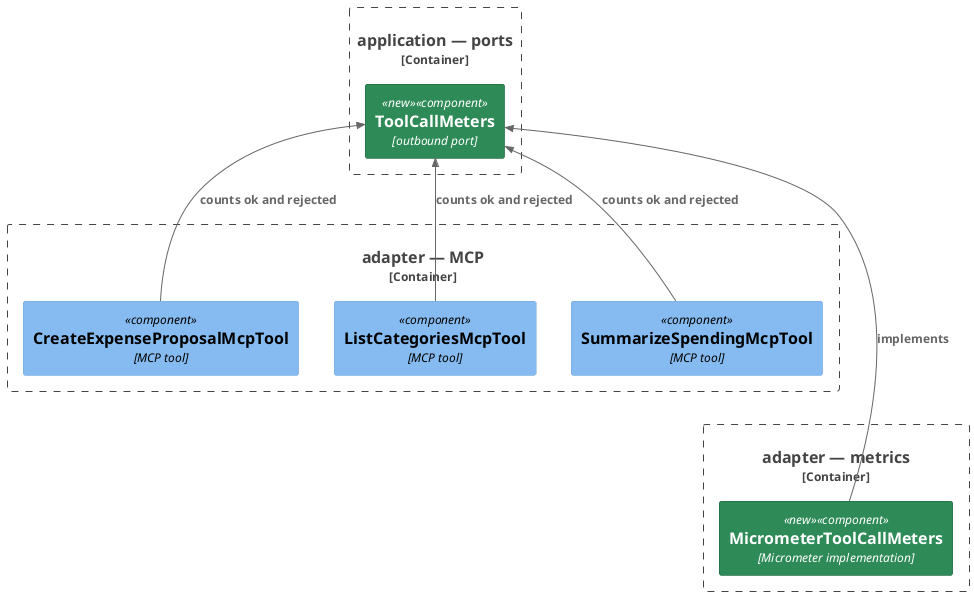
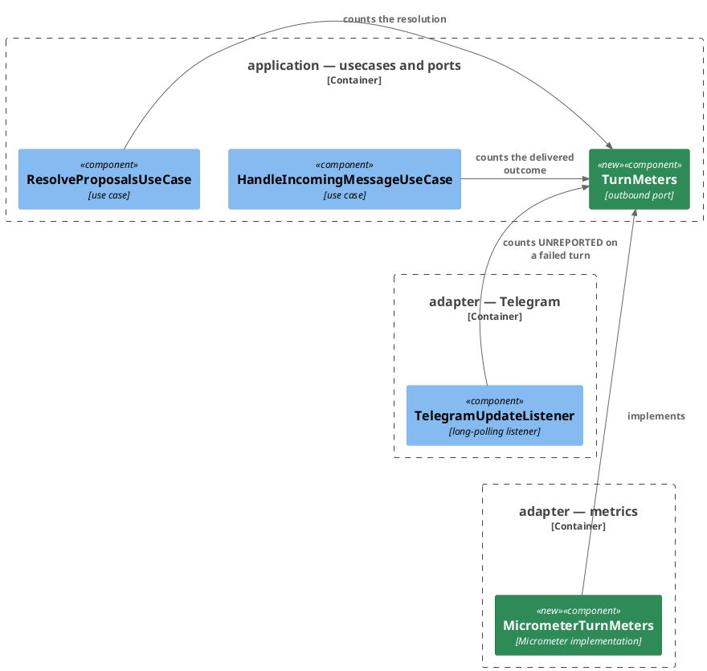
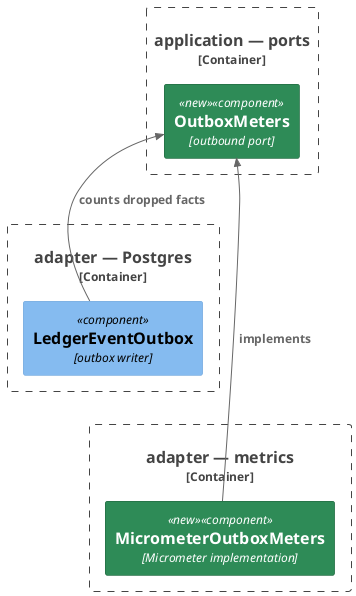

# Plan: Meter the Extraction Pipeline — Ledger Service

**Affected Modules:** `ledger-service`
**Design:** [Meter the Extraction Pipeline](../design.md)

Per the design's D4, meters are reached through ports in `application/port`, logger-style; only the new
`adapter/metrics` package touches Micrometer.

Per the design's D5 and D6, one pre-existing meter migrates behind a port in this task: the outbox drop
counter. The change-stream meters and slot gauges keep their shape in `adapter/cdc` — their facts are
adapter-shaped and may not cross into `application/port`. Every meter name and tag stays byte-identical at the
scrape.

## Components

Three subjects, no arrow between them, so three diagrams.

The MCP tools and their counter:

The turn and resolution counters:

The migration of the outbox drop counter (D5, D6) — the class keeps its name as a port, the Micrometer body
moves:

| Port             | Methods                                                                                                            |
|------------------|--------------------------------------------------------------------------------------------------------------------|
| `ToolCallMeters` | `countOk(String tool)`, `countRejected(String tool, String reason)`                                                |
| `TurnMeters`     | `countTurn(ReportOutcome outcome)`, `countUnreported()`, `countResolved(ProposalResolution resolution, int count)` |
| `OutboxMeters`   | `countFactsDropped(String type, long facts)`                                                                       |

- The Micrometer implementations build their counters per call, as `OutboxMeters` does — nothing registers at
  startup. `countUnreported()` increments the same counter as `countTurn`, under the tag value `UNREPORTED`.
- `countRejected`'s `reason` is the refusing exception's simple name; the tools' `catch (RuntimeException)`
  branch passes the fixed value `unexpected`, and `countOk` records `reason="none"`.
- `HandleIncomingMessageUseCase` calls `countTurn` after `messageDeliveryPort.deliver(...)` returns. A refused
  delivery throws past it, and the listener's catch counts the turn as `UNREPORTED` instead.
- The listener counts `UNREPORTED` only on the incoming-message branch. A failed proposal resolution is not a
  turn and counts nothing.
- A `RuntimeException` after a delivered report (storing the report's location, discarding reported periods)
  still reaches the listener's catch, so that one message counts twice. Accepted: the design fixes the counters
  as at-least-once, read as rates.
- `ResolveProposalsUseCase` calls `countResolved` when `applyResolution` resolved anything, before the
  acknowledgement is delivered — the resolution already landed in the store. `ALREADY_ACCEPTED` and
  `NOTHING_TO_RESOLVE` count nothing. The tag value is `accepted`/`discarded`, mapped in the Micrometer
  implementation.
- `OutboxMeters` carries JDK types only: `LedgerEventType` is an adapter type an `application/port` interface
  may not name, so the tag crosses as the enum's name, mapped at the call site — exactly what is published
  today.
- `ChangeStreamMeters`, `ReplicationSlotMonitor` and every cdc caller stay untouched in `adapter/cdc` (D6).
- The migration changes no meter name, no tag and no value; the pre-existing meter tests are the guard.

## Step-by-Step Implementation Map (To-Do List)

### Stabilization

#### Interface-First / Build Stabilization

**Interface & Signature Sync**

- [x] ST01 · Create the `ToolCallMeters` and `TurnMeters` port interfaces in `application/port`, methods per the
  Components table. JDK types and `application/dto` types only.
- [x] ST02 · Create `MicrometerToolCallMeters` and `MicrometerTurnMeters` in a new `adapter/metrics` package —
  `@Component`s over `MeterRegistry`, building `ledger_mcp_tool_calls_total{tool,outcome,reason}`,
  `ledger_turns_total{outcome}` and `ledger_proposals_resolved_total{resolution}` counters per call, in the
  style of `OutboxMeters`. `countResolved` maps `ACCEPT`→`accepted` and `DISCARD`→`discarded` for the tag —
  `ProposalResolution.name()` would publish values the dashboards never match. Trivial delegation, implemented
  fully here; no unit step. Also: `adapter/metrics/package-info.java` in its siblings' shape, and a `metrics`
  line in the architecture conventions' Package Structure tree.
- [x] ST08 · Create the `OutboxMeters` port interface in `application/port`, methods per the Components table —
  JDK types only; `LedgerEventType` maps to its name at the call site. In the same item, add `io.micrometer..`
  to the banned-package list for `domain`/`application` in `CleanArchitectureTest` and to the Rules bullet in
  the architecture conventions — the library joins the list as its adapter lands.
- [x] ST09 · Move the existing `OutboxMeters` class into `adapter/metrics` as `MicrometerOutboxMeters`,
  implementing the ST08 port with body, meter name and tags unchanged. Rewire `LedgerEventOutbox` — its only
  caller — and every test site: `LedgerEventOutboxTest`, and the three persistence slices listing the class as
  a bean (`ExpenseRepositoryAdapterTest`, `ExpenseRepositoryAdapterEventsTest`,
  `ExpenseRepositoryAdapterConcurrencyTest` switch to `MicrometerOutboxMeters.class`), until the module builds
  and the pre-existing suite stays green.
- [x] ST05 · Add a `ToolCallMeters` constructor parameter and field to `CreateExpenseProposalMcpTool`,
  `ListCategoriesMcpTool` and `SummarizeSpendingMcpTool`, recording nothing yet, until the module builds green.
- [x] ST06 · Add a `TurnMeters` constructor parameter and field to `HandleIncomingMessageUseCase`,
  `ResolveProposalsUseCase` and `TelegramUpdateListener`, recording nothing yet, and update every construction
  site — the use-case wiring in `adapter/config`, the two use cases' unit test classes, and
  `TelegramUpdateListenerTest` — so the pre-existing suite stays green.

**Shared Test Infrastructure**

- [x] ST03 · Add `@MockitoBean ToolCallMeters` to the three MCP tool test classes — their shared context
  registers beans by explicit `@Import` and component-scans nothing, so the tools' new dependency must be
  supplied or every MCP test fails on context load.
- [x] ST07 · Add a `TelegramScenario` constant for the meters flow to `TelegramTestBot` — its own update id,
  user and conversation — per the testing conventions' long-polling isolation rules. RS01 drives the poll and
  reads its outcome back through the scenario-scoped accessors.

**Closing item**

- [x] ST04 · Confirm `bot.finance.architecture.CleanArchitectureTest` still passes.

### Red Phase

#### TDD Unit Red Phase

- [x] RU01 · `HandleIncomingMessageUseCase` · test: `HandleIncomingMessageUseCaseTest` · covers: `handle()` ·
  scenarios: A3, A4, A5, A6, A7
  The class already carries one test per `ReportOutcome` arrangement, so the meter assertions ride those tests
  rather than duplicating their arrangements.
  - update: premise — `handle()` now counts the delivered outcome through the mocked `TurnMeters` after
    `deliver` returns · a test whose arrangement lets `handle()` complete a delivery also verifies `countTurn`
    received that test's outcome, exactly once
  - update: `whenDeliverThrowsMessageDeliveryFailedException_thenExceptionPropagates()` — also verify
    `countTurn` was never called (the listener owns `UNREPORTED`)

- [x] RU02 · `ResolveProposalsUseCase` · test: `ResolveProposalsUseCaseTest` · covers: `resolve()` ·
  scenarios: A8, A9, A10
  The class already carries accept, discard, already-accepted and nothing-to-resolve arrangements, so the meter
  assertions ride them.
  - update: premise — `resolve()` now counts a positive resolution through the mocked `TurnMeters` before the
    acknowledgement · a test resolving n > 0 proposals also verifies `countResolved` received that resolution
    and n; a test resolving nothing (`ALREADY_ACCEPTED`, `NOTHING_TO_RESOLVE`) also verifies `countResolved`
    was never called
  - update: `whenAcknowledgeThrowsMessageDeliveryFailedException_thenExceptionPropagates()` — also verify
    `countResolved` was already called when its arrangement resolved anything: the count lands before the
    acknowledgement

#### TDD Integration Red Phase

- [x] RI01 · `CreateExpenseProposalMcpTool` · test: `CreateExpenseProposalMcpToolTest` · covers:
  `create_expense_proposal (MCP)` · mocks: `CreateExpenseProposalPort`, `ToolCallMeters` · scenarios: A1, A2
  - Happy Path:
    - given: the mocked port returns a stored expense
      when: the tool is called with a valid request
      then: the mocked `ToolCallMeters` received `countOk("create_expense_proposal")` once
  - Error Mapping:
    - given: the mocked port throws `InvalidGroupingException`
      when: the tool is called
      then: `countRejected` received `"create_expense_proposal"`, `"InvalidGroupingException"`
    - given: the mocked port throws a plain `RuntimeException`
      when: the tool is called
      then: `countRejected` received `"create_expense_proposal"`, `"unexpected"`

- [x] RI02 · `ListCategoriesMcpTool` · test: `ListCategoriesMcpToolTest` · covers: `list_categories (MCP)` ·
  mocks: `ListCategoriesPort`, `ToolCallMeters` · scenarios: A1, A2
  - Happy Path:
    - given: the mocked port returns a category list
      when: the tool is called
      then: `countOk` received `"list_categories"` once
  - Error Mapping:
    - given: the mocked port throws `InvalidGroupingException`
      when: the tool is called
      then: `countRejected` received `"list_categories"`, `"InvalidGroupingException"`

- [x] RI03 · `SummarizeSpendingMcpTool` · test: `SummarizeSpendingMcpToolTest` · covers:
  `summarize_spending (MCP)` · mocks: `SummarizeSpendingPort`, `ToolCallMeters` · scenarios: A1, A2
  - Happy Path:
    - given: the mocked port returns a summary
      when: the tool is called
      then: `countOk` received `"summarize_spending"` once
  - Error Mapping:
    - given: the mocked port throws the tool's invalid-period exception
      when: the tool is called
      then: `countRejected` received `"summarize_spending"` and that exception's simple name

- [x] RI05 · `TelegramUpdateListener` · test: `TelegramUpdateListenerTest` · covers: the Telegram update poll ·
  mocks: `HandleIncomingMessagePort`, `ResolveProposalsPort`, `TurnMeters` · scenarios: A22
  - Happy Path:
    - given: the mocked incoming-message port returns normally
      when: an update is delivered through the poll
      then: `countUnreported` was never called
  - Error Mapping:
    - given: the mocked incoming-message port throws a `RuntimeException`
      when: a message update is delivered through the poll
      then: `countUnreported` was called once and the batch is still confirmed
    - given: the mocked resolve port throws a `RuntimeException`
      when: a callback_query update is delivered through the poll
      then: `countUnreported` was never called

#### TDD System Test Red Phase

- [x] RS01 · `PipelineMetersSystemTest` · covers: `GET /actuator/prometheus` · scenarios: A1, A2, A3, A8
  - Happy Path:
    - given: a Telegram turn processed end to end through the stubbed Bot API on its own `TelegramScenario`,
      its delivered report's Confirm button tapped, and a `create_expense_proposal` call posted to `/mcp` with
      a minted token
      when: the management port's `/actuator/prometheus` is scraped
      then: the scrape carries `ledger_turns_total`, `ledger_mcp_tool_calls_total{outcome="ok"}` and
      `ledger_proposals_resolved_total{resolution="accepted"}` samples under their normalised names and tags
  - Unhappy Path:
    - given: a stored user with no grouping of the posted name
      when: `create_expense_proposal` is posted to `/mcp` and the management port is scraped
      then: the scrape carries `ledger_mcp_tool_calls_total` under `outcome="rejected"` with the refusing
      exception as `reason`

### Green Phase

#### TDD Unit Green Phase

- [ ] GU01 · `HandleIncomingMessageUseCase` · test: `HandleIncomingMessageUseCaseTest`
- [ ] GU02 · `ResolveProposalsUseCase` · test: `ResolveProposalsUseCaseTest`

#### TDD Integration Green Phase

- [ ] GI01 · `CreateExpenseProposalMcpTool` · test: `CreateExpenseProposalMcpToolTest` · covers:
  `create_expense_proposal (MCP)` · mocks: `CreateExpenseProposalPort`, `ToolCallMeters`
- [ ] GI02 · `ListCategoriesMcpTool` · test: `ListCategoriesMcpToolTest` · covers: `list_categories (MCP)` ·
  mocks: `ListCategoriesPort`, `ToolCallMeters`
- [ ] GI03 · `SummarizeSpendingMcpTool` · test: `SummarizeSpendingMcpToolTest` · covers:
  `summarize_spending (MCP)` · mocks: `SummarizeSpendingPort`, `ToolCallMeters`
- [ ] GI05 · `TelegramUpdateListener` · test: `TelegramUpdateListenerTest` · covers: the Telegram update poll ·
  mocks: `HandleIncomingMessagePort`, `ResolveProposalsPort`, `TurnMeters`

#### TDD System Test Green Phase

- [ ] GS01 · `PipelineMetersSystemTest` · covers: `GET /actuator/prometheus`

## Open Questions / Blockers

- Stabilization widened two boundaries no item named, both forced by the tools' and outbox's new dependencies:
  `CaptureAdapterConfiguration` switched its `OutboxMeters` import to `MicrometerOutboxMeters`, and
  `McpAdapterContextTest` gained `@MockitoBean(types = ToolCallMeters.class)` to keep the shared MCP context
  loading. No behaviour changed; recorded for the record only.
- Red phase flagged two tests RU01/RU02's bullets do not name, left untouched: RU01's
  `whenReportCannotBeDelivered_thenPeriodsAskedAboutAreKept` also has `deliver` throw
  `MessageDeliveryFailedException` and could carry the same `verify(countTurn, never())` as the named test;
  RU02's `whenAcceptThrowsPersistenceFailedException_thenExceptionPropagatesAndAcknowledgeNeverCalled` throws
  before any outcome is computed, so neither premise branch fits — a `countResolved` never-called assertion is a
  possible unlisted update. Both are gaps in assertion breadth, not defects in what was implemented.

## Review Findings

The plan was reworked after this review for the design's D4 (meter ports, recording moved to the use cases);
supersessions are noted per finding. RI04/GI04 (`TelegramMessageDeliveryAdapter`) were dropped by that rework —
their scenarios live in RU01 and RU02.

- **F1:** No stabilization item wired the meter holders into the target classes' constructors, so Red Phase
  could not compile against them.
  - Resolution: decision
  - Action: resolved — the stabilization template's Interface & Signature Sync owns exactly this; ST05 and ST06
    wire the ports and update the broken construction sites.

- **F2:** ST03's "add nothing else" left the tools' new dependency out of the explicit `@Import` context,
  failing every MCP context load.
  - Resolution: mechanical
  - Action: applied — superseded by D4: ST03 now supplies the dependency as `@MockitoBean ToolCallMeters` in the
    three tool test classes.

- **F3:** RI01–RI03 asserted absolute counts against a registry shared across each test class's tests.
  - Resolution: mechanical
  - Action: applied — superseded by D4: the steps now verify the mocked port, which is per-test.

- **F4:** RI05 counted `UNREPORTED` in a catch that also covers proposal resolutions, and omitted
  `ResolveProposalsPort` from `mocks:`.
  - Resolution: mechanical
  - Action: applied — the count is scoped to the incoming-message branch, a resolve-failure scenario asserts no
    call, and the mock is listed.

- **F5:** The design's Documentation section (operations-page meter rows) had no step.
  - Resolution: decision
  - Action: resolved — `docs/conventions/follow-up.md` gives `archive-knowledge` the contract pages once the work
    is complete; the plan deliberately carries no docs step.

- **F6:** Nothing proved the three counters reach `GET /actuator/prometheus`.
  - Resolution: decision
  - Action: resolved — `ChangeStreamMetersSystemTest` is the module's precedent for proving meters at the scrape;
    RS01/GS01 mirror it.

- **F7:** A `RuntimeException` after a delivered report counts one message twice (its outcome, then
  `UNREPORTED`).
  - Resolution: decision
  - Action: resolved — accepted under the design's at-least-once bullet; recorded in the Components bullets.

- **F8:** The `acknowledge()` error path had no counting order and no scenario.
  - Resolution: mechanical
  - Action: applied — superseded by D4: `ResolveProposalsUseCase` counts before the acknowledgement is delivered,
    and RU02's last scenario pins it.

- **F9:** The Telegram diagram split `adapter/telegram` into inbound/outbound boundaries the conventions do not
  name.
  - Resolution: mechanical
  - Action: applied — one `adapter — Telegram` boundary.

- **F10:** RS01 drives the poll but no item gave it a `TelegramScenario`.
  - Resolution: decision
  - Action: resolved — the testing conventions' long-polling isolation rules mandate one; ST07 creates it.

- **F11:** ST02 left the `resolution` tag value unmapped — `ProposalResolution.name()` publishes `ACCEPT`, which
  the dashboards never match.
  - Resolution: mechanical
  - Action: applied — the mapping is fixed in ST02 and the Components bullets.

- **F12:** `ledger_proposals_resolved_total` reached no test through its real implementation.
  - Resolution: decision
  - Action: resolved — `AcceptExpensesSystemTest` shows the tap flow reachable at system level; RS01's happy
    path taps Confirm and asserts the sample, and A8 joined its `scenarios:`.

- **F13:** RS01 carried free prose in the step body and no error path.
  - Resolution: mechanical
  - Action: applied — prose dropped; the rejected tool call is its Unhappy Path, A2 added.

- **F14:** RU01's `given:` named a delivery-port arrangement that cannot produce the outcomes.
  - Resolution: mechanical
  - Action: applied — superseded by F15's rework: no new arrangements are written; the existing tests'
    arrangements carry the assertions.

- **F15:** RU01/RU02 duplicated arrangements the two unit test classes already carry.
  - Resolution: decision
  - Action: resolved — the step-formats' existing-test updates rule owns this; both steps became premise
    `update:` bullets on the existing tests, plus per-method bullets on the two delivery-failure tests.

- **F16:** RU02's third scenario bundled the `ALREADY_ACCEPTED` and `NOTHING_TO_RESOLVE` arrangements.
  - Resolution: mechanical
  - Action: applied — superseded by F15's rework: the two existing tests each carry their own verification
    under the premise bullet.

- **F17:** ST09's test-site list missed the three persistence slices registering `OutboxMeters` as a bean and
  `ChangeEventPublisherTest`'s import, and "outbox writers" was plural.
  - Resolution: mechanical
  - Action: applied — the three slices are named and switch to `MicrometerOutboxMeters.class`;
    `LedgerEventOutbox` named singular. `ChangeEventPublisherTest` needs nothing under D6.

- **F18:** The moved change-stream meters would lose the state gauge's seeded `DOWN` ordinal.
  - Resolution: mechanical
  - Action: applied — moot under D6: the class does not move.

- **F19:** ST09 did not move or rename `ChangeStreamMetersTest`.
  - Resolution: mechanical
  - Action: applied — moot under D6: the class and its test stay in `adapter/cdc`.

- **F20:** The "nothing registers at startup" bullet was false for the migrated change-stream gauges.
  - Resolution: mechanical
  - Action: applied — under D6 every class the bullet now covers builds its counters per call; the
    constructor-registered gauges stay in `adapter/cdc`, outside it.

- **F21:** The `ChangeStreamMeters` port would carry adapter-shaped facts (slot WAL status, engine-state
  ordinals) into `application/port`, against the conventions' transport-shape rule.
  - Resolution: decision
  - Action: resolved — the user chose keeping the change-stream meters and slot gauges in `adapter/cdc`
    (design D6); only `OutboxMeters` migrates.

- **F22:** ST04, the closing confirmation item, performed the ArchUnit-rule edits.
  - Resolution: mechanical
  - Action: applied — the `io.micrometer..` ban moved into ST08; ST04 confirms only.
