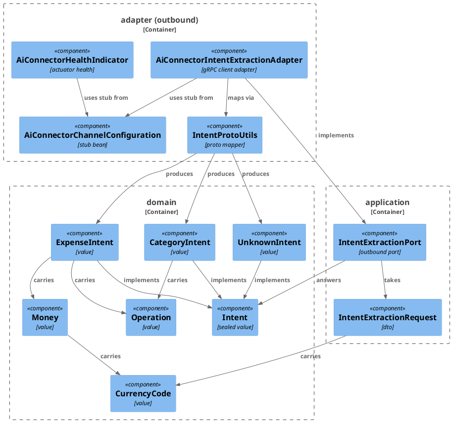
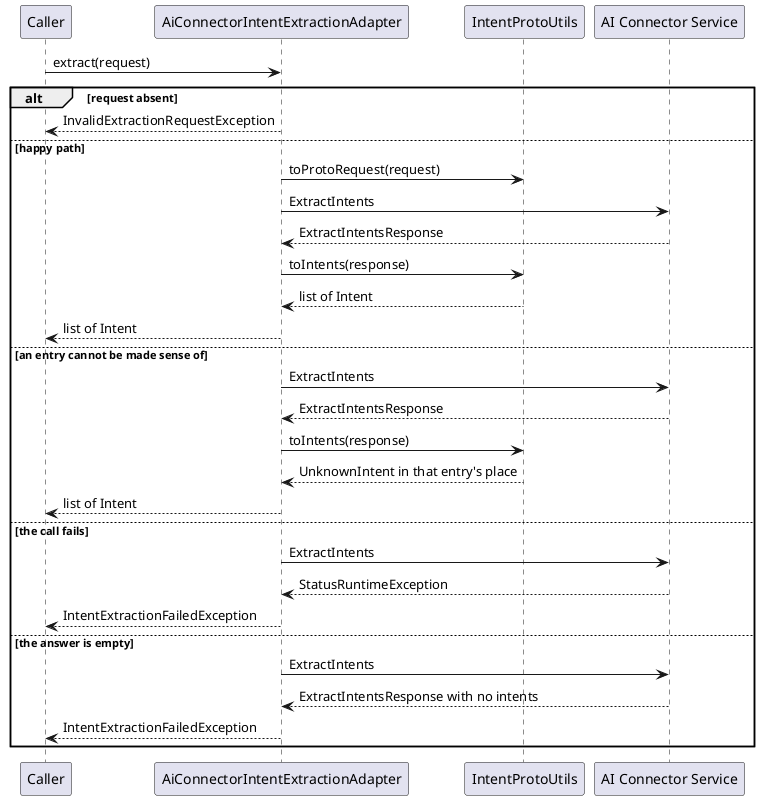

# Plan: Call the AI Connector from the Ledger Service

**Affected Modules:** `ledger-service`; `ai-connector-service` (documentation only — P05, P06)

## Objective

Give `ledger-service` an outbound port for intent extraction and a gRPC adapter that fulfils it against
`ai-connector-service`, speaking the shared `proto/intent_extraction.proto` contract. Nothing calls the port
yet — the caller arrives in a later plan.

## Proposed Solution

`ai-connector-service` and `proto/intent_extraction.proto` are unchanged. All work is on the calling side.

**Build.** `ledger-service/build.gradle` gains the `com.google.protobuf` plugin, `$rootDir/../proto` as an extra
proto source directory, and `spring-boot-starter-grpc-client`, mirroring how `ai-connector-service` consumes the
same schema. Generated Java lands in `build/generated/sources/proto/main/` under the schema's own
`java_package`, `bot.finance.ai.adapter.grpc.v1` — never edited, never committed. Spotless is pinned to
`src/**` so it does not reformat generated sources.

**Core.** A new outbound port `IntentExtractionPort` takes an `IntentExtractionRequest` and answers a
`List<Intent>`. The answer is expressed in new `domain/value` types mirroring what the contract promises —
`Intent` (sealed) over `CategoryIntent`, `ExpenseIntent`, `UnknownIntent`, plus `Operation`, `Money`,
`CurrencyCode`. Money keeps the wire's minor units and exposes `amount()`, so nothing the user said is lost to
a binary float. Four exceptions join `domain/exception`: `InvalidMoneyException`, `InvalidIntentException`,
`InvalidExtractionRequestException`, `IntentExtractionFailedException`.

**Adapter.** `adapter/aiconnector` holds everything fronting the AI connector:

- `AiConnectorChannelConfiguration` — declares the generated blocking stub as a bean, over a channel obtained
  from Spring gRPC's `GrpcChannelFactory` by the channel name `ai-connector`;
- `AiConnectorIntentExtractionAdapter` — implements the port, calls the stub, and translates every
  `StatusRuntimeException` and every unusable answer into `IntentExtractionFailedException`;
- `IntentProtoUtils` — the static mapper both ways. Reading the response it is deliberately tolerant, as the
  contract's compatibility clause requires: an operation it does not recognize, a missing payload, a currency
  ISO 4217 does not know, or a shape the domain values reject each become an `UnknownIntent` carrying the
  reason, never an exception;
- `AiConnectorHealthIndicator` — reports the connector's own `grpc.health.v1.Health` answer into the ledger's
  `/actuator/health`, so a target pointing nowhere shows up before the first extraction call rather than after
  it. The connector already serves that check: its gRPC server starter registers the health service whenever a
  service is bound.

Generated proto types and domain types share five simple names (`Intent`, `Money`, `CategoryIntent`,
`ExpenseIntent`, `Operation`). As on the connector's side, the mapper imports the domain types and fully
qualifies the generated ones.

**Configuration.** `spring.grpc.client.channel.ai-connector.target` reads `AI_CONNECTOR_GRPC_TARGET`, defaulting
to the connector's local gRPC port. `ledger-service/Dockerfile` and the compose service move to a repo-root
build context so the shared `proto/` directory is inside it — the change `ai-connector-service` already made.

**Assumption.** The client starter is `org.springframework.boot:spring-boot-starter-grpc-client`, pairing the
`spring-boot-starter-grpc-server` the connector uses. Should that coordinate not resolve, the fallback is
`org.springframework.boot:spring-boot-grpc-client` (the cached autoconfiguration artifact) plus
`io.grpc:grpc-stub`, `io.grpc:grpc-protobuf` and `io.grpc:grpc-netty-shaded`. ST01 compiles, so a wrong
coordinate surfaces immediately.

Files touched: `build.gradle`, `gradle.properties`, `Dockerfile`, `infrastructure/docker-compose.yaml`,
`application.yaml`, `Operation`, `CurrencyCode`, `Money`, `Intent`, `CategoryIntent`, `ExpenseIntent`,
`UnknownIntent`, `InvalidMoneyException`, `InvalidIntentException`, `InvalidExtractionRequestException`,
`IntentExtractionFailedException`, `IntentExtractionRequest`, `IntentExtractionPort`,
`AiConnectorChannelConfiguration`, `AiConnectorIntentExtractionAdapter`, `IntentProtoUtils`,
`AiConnectorHealthIndicator`, `adapter/aiconnector/package-info.java`, `CleanArchitectureTest`,
`GrpcStubServer`, `AiConnectorAdapterTest`, `IntentFixtures`.

#### Diagrams





## Step-by-Step Implementation Map (To-Do List)

### Stabilization

#### Interface-First / Build Stabilization

**Interface & Signature Sync**

- [x] ST01 · `ledger-service/build.gradle` + `gradle.properties` — add the `com.google.protobuf` plugin,
  `sourceSets.main.proto.srcDir("$rootDir/../proto")`, the `protobuf`/`grpc` codegen block, and
  `implementation "org.springframework.boot:spring-boot-starter-grpc-client"`, copying the versions
  (`protobufGradlePluginVersion`, `protobufVersion`, `grpcVersion`) and the codegen block verbatim from
  `ai-connector-service/build.gradle`. Add `implementation "io.grpc:grpc-services"` for the generated
  `grpc.health.v1.Health` client, and `testImplementation "io.grpc:grpc-testing"` for the in-test gRPC server.
  Pin Spotless to hand-written sources so it never reformats generated ones:
  ```groovy
  spotless {
      java {
          target "src/main/java/**/*.java", "src/test/java/**/*.java"
          palantirJavaFormat("${palantirJavaFormatVersion}")
          removeUnusedImports()
          importOrder()
      }
  }
  ```
- [x] ST02 · `bot.finance.domain.exception` — add four exceptions in the shape of the existing ones
  (`RuntimeException` subclass, one constructor): `InvalidMoneyException(String)`,
  `InvalidIntentException(String)`, `InvalidExtractionRequestException(String)`, and
  `IntentExtractionFailedException(String, Throwable)`.
- [x] ST03 · `bot.finance.domain.value.Operation` — enum `CREATE`, `READ`, `UPDATE`, `DELETE`, no other members.
  Complete here; it has no behaviour to test.
- [x] ST04 · `bot.finance.domain.value` — add `sealed interface Intent permits CategoryIntent, ExpenseIntent,
  UnknownIntent` (no members) and the three records with their components and an empty compact constructor
  carrying a `TODO` naming the validation GU03/GU04/GU05 implement:
  `CategoryIntent(Operation operation, String name, Optional<String> newName)`,
  `ExpenseIntent(Operation operation, Optional<String> categoryName, Optional<Money> amount,
  Optional<String> description)`, `UnknownIntent(String reason)`.
- [x] ST05 · `bot.finance.domain.value` — add `CurrencyCode(String code)` and `Money(long minorUnits,
  CurrencyCode currencyCode)` with empty compact constructors carrying a `TODO`, plus stubs
  `CurrencyCode.of(String)` and `Money.amount()`; each stub body holds an inline comment stating its intent
  (`of` normalizes the code to upper case and rejects anything ISO 4217 does not know; `amount()` scales the
  minor units by the currency's default fraction digits).
- [x] ST06 · `bot.finance.application.dto.IntentExtractionRequest(String text, List<String> knownCategories,
  Optional<CurrencyCode> defaultCurrency)` — record with an empty compact constructor carrying a `TODO` naming
  the validation GU06 implements.
- [x] ST07 · `bot.finance.application.port.IntentExtractionPort` — `List<Intent> extract(IntentExtractionRequest
  request)`, with `@throws` javadoc for `InvalidExtractionRequestException` and
  `IntentExtractionFailedException`.
- [x] ST08 · `bot.finance.adapter.aiconnector.IntentProtoUtils` — static `*Utils` class with a private
  constructor and two stubbed methods, each carrying an inline comment of its intent:
  `toProtoRequest(IntentExtractionRequest)` builds the generated `ExtractIntentsRequest`, setting
  `default_currency` only when present; `toIntents(ExtractIntentsResponse)` maps each generated entry onto a
  domain `Intent`, falling back to `UnknownIntent` for anything it cannot map.
- [x] ST09 · `bot.finance.adapter.aiconnector` — add `AiConnectorChannelConfiguration`, a `@Configuration`
  declaring **both** generated blocking stubs as beans — `IntentExtractionServiceGrpc.newBlockingStub(...)` and
  `HealthGrpc.newBlockingStub(...)` — over the one channel from
  `GrpcChannelFactory.createChannel("ai-connector")`, and `AiConnectorIntentExtractionAdapter`, a `@Component`
  implementing `IntentExtractionPort` with a stubbed `extract` (constructor takes the extraction stub and
  `LoggerFactory`; the stub body carries an inline comment of the call-map-translate sequence GI01 implements).
  Add `AiConnectorHealthIndicator`, a `@Component` implementing
  `org.springframework.boot.health.contributor.HealthIndicator` — Spring Boot 4 moved `HealthIndicator`/`Health`
  out of `org.springframework.boot.actuate.health`, which no longer exists — taking the health
  stub, with a stubbed `health()` (inline comment: it calls the connector's `grpc.health.v1.Health/Check` for
  the **empty service name** — the server as a whole, which is the only name the connector registers — and
  reports `UP` for `SERVING` and `DOWN` for everything else, carrying what came back as a detail). Add
  `bot/finance/adapter/aiconnector/package-info.java` in the shape of the existing adapter subpackages' — what
  the package fronts, and that every gRPC and generated proto type stays inside it.
- [x] ST10 · `bot.finance.architecture.CleanArchitectureTest` — extend
  `domainAndApplicationStayFrameworkAgnostic` with `"io.grpc.."`, `"com.google.protobuf.."` and
  `"bot.finance.ai.."` (the generated schema package), and `coreTypesCarryNoExternalSystemName` with
  `"AiConnector"`, `"Grpc"` and `"Proto"`.

**Configuration**

- [x] ST11 · `ledger-service/src/main/resources/application.yaml` — add the channel:
  ```yaml
  spring:
    grpc:
      client:
        channel:
          ai-connector:
            target: ${AI_CONNECTOR_GRPC_TARGET:static://localhost:1001}
            default:
              deadline: 10s
  ```
  `application-test.yaml` is left alone: the channel is dialed only by an RPC, and the one test making an RPC
  overrides the target through `@AiConnectorAdapterTest`.
- [x] ST12 · `ledger-service/Dockerfile` and `infrastructure/docker-compose.yaml` — move the ledger image to a
  repo-root build context so `proto/` is inside it, following `ai-connector-service`'s Dockerfile and compose
  entry exactly: `COPY proto ./proto` before the module's own sources, `context: ..` with
  `dockerfile: ledger-service/Dockerfile`. Add `AI_CONNECTOR_GRPC_TARGET:
  static://ai-connector-service:1001` to the ledger service's environment.

**Shared Test Infrastructure**

- [x] ST13 · `bot.finance.common.containers.GrpcStubServer` — a JVM-wide singleton in the shape of
  `WireMockSupport`: a real gRPC server started once on a dynamic port, hosting an
  `IntentExtractionServiceGrpc.IntentExtractionServiceImplBase` and a `HealthGrpc.HealthImplBase`, each
  delegating to a mutable handler. Exposes `target()` as `static://localhost:<port>`, a method to set the
  extraction handler for the next call (answer with a given `ExtractIntentsResponse`, or fail with a given
  `Status`), a method to set the serving status the health service reports for the empty service name — the
  only name the connector registers — or fail the check outright, a `lastExtractionRequest()` and a
  `lastHealthCheckRequest()` (RI01 asserts on the first, RI02 on the second), and `reset()`.
- [x] ST14 · `bot.finance.common.AiConnectorAdapterTest` — composed annotation for the outbound gRPC adapter,
  in the shape of `ai-connector-service`'s `@AiConnectorAdapterTest` counterpart `@AiAdapterTest`:
  `@SpringBootTest(classes = {AiConnectorIntentExtractionAdapter.class, AiConnectorHealthIndicator.class,
  AiConnectorChannelConfiguration.class, Slf4jLoggerFactory.class})`, `@ActiveProfiles("test")`,
  `@ImportAutoConfiguration({GrpcClientAutoConfiguration.class,
  CompositeChannelFactoryAutoConfiguration.class})`, and a nested `@TestConfiguration` whose
  `DynamicPropertyRegistrar` bean points `spring.grpc.client.channel.ai-connector.target` at
  `GrpcStubServer.target()`. Nothing is mocked; a real client over a stubbed server is the point.
- [x] ST15 · `bot.finance.common.IntentFixtures` — builders for the generated `ExtractIntentsResponse` shapes
  the tests need (a category entry, an expense entry, an unknown entry, a multi-entry response) and for the
  domain `Intent`/`Money` values they are compared against. Add all three new classes — `GrpcStubServer`,
  `AiConnectorAdapterTest` and `IntentFixtures` — to the package listing in
  [`testing.md`](../ledger-service/docs/conventions/testing.md#package-structure), and widen that file's
  `containers/` description to cover the in-JVM gRPC stub server, noting that the
  `@Testcontainers(disabledWithoutDocker = true)` rule applies to the container-backed singletons only —
  `GrpcStubServer` needs no Docker.
- [x] ST16 · Confirm `bot.finance.architecture.CleanArchitectureTest` still passes with the generated schema
  package on the classpath.

### Red Phase

#### TDD Unit Red Phase

- [x] RU01 · `CurrencyCode` · test: `CurrencyCodeTest` · covers: `CurrencyCode(String)`, `of(String)`
  - `CurrencyCode(String)`:
    - given: the code `"eur"`
      when: the record is constructed
      then: `code()` is `"EUR"`
    - given: a code ISO 4217 does not know, such as `"XYZ"`
      when: the record is constructed
      then: `InvalidMoneyException` is thrown naming the code
    - given: a null code and a blank code
      when: the record is constructed
      then: `InvalidMoneyException` is thrown (parameterized over both)
  - `of(String)`:
    - given: the code `"jpy"`
      when: `of` is called
      then: a `CurrencyCode` equal to `new CurrencyCode("JPY")` comes back

- [x] RU02 · `Money` · test: `MoneyTest` · covers: `Money(long, CurrencyCode)`, `amount()`
  - `Money(long, CurrencyCode)`:
    - given: a null currency code
      when: the record is constructed
      then: `InvalidMoneyException` is thrown
    - given: minor units of `-1`
      when: the record is constructed
      then: `InvalidMoneyException` is thrown
    - given: minor units of `0` and a valid currency
      when: the record is constructed
      then: the record holds `0` minor units
  - `amount()`:
    - given: `1250` minor units of `EUR`, a currency with two fraction digits
      when: `amount()` is called
      then: it compares equal to `12.50`
    - given: `1200` minor units of `JPY`, a currency with no fraction digits
      when: `amount()` is called
      then: it compares equal to `1200`

- [x] RU03 · `CategoryIntent` · test: `CategoryIntentTest` · covers:
  `CategoryIntent(Operation, String, Optional<String>)`
  - `CategoryIntent(Operation, String, Optional<String>)`:
    - given: operation `CREATE`, name `"Coffee"`, no new name
      when: the record is constructed
      then: it holds the operation, the name, and an empty new name
    - given: a null operation, a null name, a blank name, and a null new-name `Optional`
      when: the record is constructed
      then: `InvalidIntentException` is thrown (parameterized over the four)
    - given: operation `UPDATE` and an empty new name
      when: the record is constructed
      then: `InvalidIntentException` is thrown saying a new name is required
    - given: operation `UPDATE` and the new name `"Cafés"`
      when: the record is constructed
      then: the record holds that new name

- [x] RU04 · `ExpenseIntent` · test: `ExpenseIntentTest` · covers:
  `ExpenseIntent(Operation, Optional<String>, Optional<Money>, Optional<String>)`
  - `ExpenseIntent(Operation, Optional<String>, Optional<Money>, Optional<String>)`:
    - given: operation `CREATE`, category `"Dining"`, an amount, and a description
      when: the record is constructed
      then: it holds all four
    - given: a null operation and each of the three `Optional` components null in turn
      when: the record is constructed
      then: `InvalidIntentException` is thrown (parameterized over the four)
    - given: operation `CREATE` with no amount
      when: the record is constructed
      then: `InvalidIntentException` is thrown saying `CREATE` requires an amount
    - given: operation `CREATE` with an amount but no category name
      when: the record is constructed
      then: `InvalidIntentException` is thrown saying `CREATE` requires a category name
    - given: operations `READ`, `UPDATE` and `DELETE` with every optional empty
      when: the record is constructed
      then: the record is accepted (parameterized over the three) — only `CREATE` carries a requirement, as on
      `ai-connector-service`'s own `ExpenseIntent`

- [x] RU05 · `UnknownIntent` · test: `UnknownIntentTest` · covers: `UnknownIntent(String)`
  - `UnknownIntent(String)`:
    - given: the reason `"no amount was stated"`
      when: the record is constructed
      then: it holds that reason
    - given: a null reason and a blank reason
      when: the record is constructed
      then: `InvalidIntentException` is thrown (parameterized over both)

- [x] RU06 · `IntentExtractionRequest` · test: `IntentExtractionRequestTest` · covers:
  `IntentExtractionRequest(String, List<String>, Optional<CurrencyCode>)`
  - `IntentExtractionRequest(String, List<String>, Optional<CurrencyCode>)`:
    - given: text, one category, and a default currency
      when: the record is constructed
      then: it holds all three
    - given: a null text and a blank text
      when: the record is constructed
      then: `InvalidExtractionRequestException` is thrown (parameterized over both)
    - given: a null category list and an empty category list
      when: the record is constructed
      then: `InvalidExtractionRequestException` is thrown (parameterized over both)
    - given: a category list holding a null entry and one holding a blank entry
      when: the record is constructed
      then: `InvalidExtractionRequestException` is thrown (parameterized over both)
    - given: a null `defaultCurrency` `Optional`
      when: the record is constructed
      then: `InvalidExtractionRequestException` is thrown
    - given: `Optional.empty()` as the default currency
      when: the record is constructed
      then: it is accepted and `defaultCurrency()` comes back empty
    - given: a mutable category list handed to the constructor
      when: that list is modified afterwards
      then: `knownCategories()` is unchanged

- [x] RU07 · `IntentProtoUtils` · test: `IntentProtoUtilsTest` · covers:
  `toProtoRequest(IntentExtractionRequest)`, `toIntents(ExtractIntentsResponse)`
  - `toProtoRequest(IntentExtractionRequest)`:
    - given: a request with text, three categories, and the default currency `EUR`
      when: it is mapped
      then: the generated request carries the text, the three categories in the same order, and
      `default_currency` set to `"EUR"`
    - given: a request whose default currency is empty
      when: it is mapped
      then: the generated request reports `hasDefaultCurrency()` as false
  - `toIntents(ExtractIntentsResponse)`:
    - given: a response holding one `OPERATION_CREATE` entry with a category payload
      when: it is mapped
      then: a `CategoryIntent` with operation `CREATE`, that name, and an empty new name comes back
    - given: a response holding one `OPERATION_UPDATE` category entry carrying `new_name`
      when: it is mapped
      then: the `CategoryIntent` holds that new name
    - given: a response holding one `OPERATION_CREATE` expense entry with a category, `1250` minor units of
      `"EUR"`, and a description
      when: it is mapped
      then: an `ExpenseIntent` comes back whose amount is `Money(1250, EUR)` and whose other fields match
    - given: a response holding one `OPERATION_READ` expense entry with no amount and no description
      when: it is mapped
      then: an `ExpenseIntent` with operation `READ` and empty optionals comes back
    - given: a response holding one `OPERATION_DELETE` expense entry
      when: it is mapped
      then: an `ExpenseIntent` with operation `DELETE` comes back
    - given: a response holding one `OPERATION_UNKNOWN` entry carrying a reason
      when: it is mapped
      then: an `UnknownIntent` with that reason comes back
    - given: a response holding one `OPERATION_UNKNOWN` entry whose reason is empty
      when: it is mapped
      then: an `UnknownIntent` comes back carrying a stand-in reason rather than throwing
    - given: a response holding one `OPERATION_UNSPECIFIED` entry
      when: it is mapped
      then: an `UnknownIntent` comes back whose reason names the unrecognized operation
    - given: a response holding one entry built with `setOperationValue(<a number the schema does not define>)`,
      so `getOperation()` answers the generated `Operation.UNRECOGNIZED`
      when: it is mapped
      then: an `UnknownIntent` comes back whose reason names the unrecognized operation, and nothing is thrown
    - given: a response holding one `OPERATION_CREATE` entry with neither payload set
      when: it is mapped
      then: an `UnknownIntent` comes back whose reason says the entry carried no payload
    - given: a response holding an expense entry whose money carries a currency ISO 4217 does not know
      when: it is mapped
      then: an `UnknownIntent` comes back naming that currency
    - given: a response holding an `OPERATION_CREATE` expense entry with no amount — a shape `ExpenseIntent`
      rejects
      when: it is mapped
      then: an `UnknownIntent` comes back carrying the domain's reason
    - given: a response holding a category entry, an expense entry, and an unknown entry in that order
      when: it is mapped
      then: the three intents come back in the same order

#### TDD Integration Red Phase

- [x] RI01 · `AiConnectorIntentExtractionAdapter` · test: `AiConnectorIntentExtractionAdapterTest` · covers:
  `extract(IntentExtractionRequest)`
  - `extract(IntentExtractionRequest)`:
    - given: the stub server answers a two-entry response
      when: `extract` is called with a request carrying text, two categories, and a default currency
      then: the two domain intents come back in order, and the request the server received carries that text,
      those two categories in order, and that `default_currency`
    - given: the stub server answers a response with no entries
      when: `extract` is called
      then: `IntentExtractionFailedException` is thrown
    - given: the stub server fails the call with `INVALID_ARGUMENT`, and separately with `UNAVAILABLE`
      when: `extract` is called
      then: `IntentExtractionFailedException` is thrown carrying the `StatusRuntimeException` as its cause and
      naming the status (parameterized over both)
    - given: no request at all
      when: `extract` is called with `null`
      then: `InvalidExtractionRequestException` is thrown and the server is never called

- [x] RI02 · `AiConnectorHealthIndicator` · test: `AiConnectorHealthIndicatorTest` · covers: `health()`
  - `health()`:
    - given: the stub server's health service reports `SERVING` for the empty service name
      when: `health()` is called
      then: the status is `UP`, and the check the server received named the empty service
    - given: the stub server's health service reports `NOT_SERVING`, `UNKNOWN`, and `SERVICE_UNKNOWN` for the
      empty service name
      when: `health()` is called
      then: the status is `DOWN` and the detail carries the serving status that came back (parameterized over
      the three)
    - given: the stub server fails the health check with `UNAVAILABLE`, and separately with `UNIMPLEMENTED`
      when: `health()` is called
      then: the status is `DOWN` and the detail names the status (parameterized over both)

### Green Phase

#### TDD Unit Green Phase

- [ ] GU01 · `CurrencyCode` · test: `CurrencyCodeTest`
- [ ] GU02 · `Money` · test: `MoneyTest` · after: GU01
- [ ] GU03 · `CategoryIntent` · test: `CategoryIntentTest`
- [ ] GU04 · `ExpenseIntent` · test: `ExpenseIntentTest` · after: GU02
- [ ] GU05 · `UnknownIntent` · test: `UnknownIntentTest`
- [ ] GU06 · `IntentExtractionRequest` · test: `IntentExtractionRequestTest` · after: GU01
- [ ] GU07 · `IntentProtoUtils` · test: `IntentProtoUtilsTest` · after: GU01, GU02, GU03, GU04, GU05, GU06

#### TDD Integration Green Phase

- [ ] GI01 · `AiConnectorIntentExtractionAdapter` · test: `AiConnectorIntentExtractionAdapterTest` ·
  after: GU06, GU07
- [ ] GI02 · `AiConnectorHealthIndicator` · test: `AiConnectorHealthIndicatorTest`

### Post-Implementation Steps

#### Documentation

- [ ] P01 · `ledger-service/docs/configuration.md` — add the `AI_CONNECTOR_GRPC_TARGET` row (sets where the AI
  Connector's gRPC server is reached; default the connector's local port; not required) and a note that the
  default matches `infrastructure/docker-compose.yaml`.
- [ ] P02 · `ledger-service/docs/conventions/orientation.md` — correct the Tech Stack: the AI Connector Service
  is consumed over gRPC, not HTTP/REST, and contract-first codegen is no longer "none" but the repo-root
  `proto/` schema generating into `build/generated/sources/proto/main/`.
- [ ] P03 · `ledger-service/docs/conventions/architecture.md` — add the generated-sources location to File
  Locations, and bring the Architecture Enforcement rule list in line with ST10's banned packages and name
  fragments.
- [ ] P04 · `ledger-service/README.md` — the C3 diagram illustrates **one** primary use case, the expense
  pipeline. Drop the `Initialize User Port` / `Initialize a New User Use Case` / `User Repository Port` /
  `User Repository Adapter` components and their relationships, and rename the placeholder
  `Expense Extraction Port` / `AI Connector Adapter` pair to the names this plan built.
- [ ] P05 · Record the diagram convention where each file already says what a document holds — the
  Documentation References entries in `ledger-service/docs/conventions/orientation.md` and
  `ai-connector-service/docs/conventions/orientation.md`: the README's C3 covers one primary use case rather
  than every port and adapter, and each page under `docs/usecases/` carries its own C3 showing that use case's
  collaborators and interfaces.
- [ ] P06 · Add that C3 diagram to every existing use-case page — `ledger-service/docs/usecases/`'s
  `handle-incoming-message.md` and `initialize-a-new-user.md`, and
  `ai-connector-service/docs/usecases/extract-intents.md` — showing the components each use case touches on
  both sides, its ports, and the external systems they front. No page is left describing a convention it does
  not follow.

## Open Questions / Blockers

- **Q1:** What deadline should an intent-extraction call carry? ST11 proposes `10s` on
  `spring.grpc.client.channel.ai-connector.default.deadline`, which has to cover a model round trip on the
  connector's side.
- A: acceptable.

- **Q2:** `ledger-service/docs/conventions/orientation.md` currently records the AI Connector Service as
  consumed "over HTTP/REST". P02 rewrites that line to gRPC. Confirm the conventions file is the thing to
  change rather than the transport.
- A: yes, correct.

- **Q3:** With no caller, nothing dials the channel outside `@AiConnectorAdapterTest` — a misconfigured
  `AI_CONNECTOR_GRPC_TARGET` in a deployment stays invisible until the first real call. Should a readiness
  signal on the channel (Spring gRPC exposes a health check per channel) be in scope here, or left to the plan
  that wires the first caller?
- A: yes, we should extend the health check to the connector's gRPC server.

## Review Findings

- **F1:** RU07's `toIntents(ExtractIntentsResponse)` operation matrix is incomplete in the one place the
  contract's compatibility clause bites. `OPERATION_DELETE` is never mapped, and the generated
  `Operation.UNRECOGNIZED` constant has no scenario at all — that constant is what an operation number the
  schema does not define arrives as (see `Operation.UNRECOGNIZED(-1)` in the already-generated
  `ai-connector-service/build/generated/sources/proto/main/java/bot/finance/ai/adapter/grpc/v1/Operation.java`),
  and `intent-extraction.md` § Compatibility requires the caller to tolerate exactly that. `OPERATION_UNSPECIFIED`,
  the case RU07 does list, is a different value and does not stand in for it: a switch over the generated enum
  that omits `UNRECOGNIZED` fails to compile as an exhaustive switch expression, or throws at runtime, the first
  time the connector widens the schema. Add two scenarios under `toIntents`: an `OPERATION_DELETE` entry mapping
  to `Operation.DELETE`, and an entry built with `setOperationValue(<a number the schema does not define>)` so
  `getOperation()` returns `UNRECOGNIZED`, yielding an `UnknownIntent` naming the unrecognized operation rather
  than throwing.
- Resolution: mechanical
- Action: applied — RU07's `toIntents` gained an `OPERATION_DELETE` scenario and an
  `setOperationValue(<undefined number>)` / `UNRECOGNIZED` scenario mapping to `UnknownIntent`.

- **F2:** ST09 creates the `bot.finance.adapter.aiconnector` package but neither it nor the *Files touched* list
  creates `package-info.java` for it. Every existing adapter subpackage in `ledger-service` has one
  (`adapter/config`, `adapter/logging`, `adapter/persistence`, `adapter/telegram`, `adapter/web`), and the direct
  counterpart on the other side is `ai-connector-service/src/main/java/bot/finance/ai/adapter/grpc/package-info.java`.
  Add `bot/finance/adapter/aiconnector/package-info.java` to ST09, in the shape of the existing ones — what the
  package fronts, and that every gRPC/proto type stays inside it.
- Resolution: mechanical
- Action: applied — ST09 now creates `adapter/aiconnector/package-info.java`, and it joins the *Files touched*
  list.

- **F3:** RU06 gives `IntentExtractionRequest` no scenario for an **absent** `defaultCurrency`. Every other
  component of the record has both an accept and a reject scenario, `proto/intent_extraction.proto:18-20` makes an
  absent `default_currency` a meaningful contract case, and RU07's `toProtoRequest` scenario "a request whose
  default currency is empty" cannot be written unless the record accepts `Optional.empty()` — which no scenario
  asserts. Add an accept scenario to RU06: `Optional.empty()` as `defaultCurrency` is accepted and
  `defaultCurrency()` comes back empty.
- Resolution: mechanical
- Action: applied — RU06 gained the accept scenario for `Optional.empty()`.

- **F4:** RU04's accept scenario is parameterized over `READ` and `DELETE` only, so `Operation.UPDATE` is never
  exercised for `ExpenseIntent` and the plan never states what an expense `UPDATE` requires. The schema permits
  `OPERATION_UPDATE` on an expense entry (`proto/intent_extraction.proto:38-45`), so `IntentProtoUtils` can
  receive one and will construct an `ExpenseIntent` with it. Decide which it is and record it in RU04: either
  `UPDATE` is accepted with every optional empty (add it to the parameterized accept case, as
  `ai-connector-service`'s own `ExpenseIntent` does, imposing no `UPDATE` constraint), or it carries its own
  requirement (add the matching reject scenario).
- Resolution: decision
- Action: the same rule applies as in the ai connector service.

- **F5:** ST15's closing sentence — "Add both to the package listing in `testing.md` alongside ST13 and ST14" —
  does not say what to add. Three new classes need an entry under
  [Package Structure](../ledger-service/docs/conventions/testing.md#package-structure): `GrpcStubServer`,
  `AiConnectorAdapterTest` and `IntentFixtures`; "both" names two of them. The same listing describes
  `containers/` as "Testcontainers / WireMock singleton lifecycle" and requires every class touching it to carry
  `@Testcontainers(disabledWithoutDocker = true)` — `GrpcStubServer` is an in-JVM server needing no Docker, and
  ST14 correctly does not carry that annotation. Reword ST15 to name all three classes explicitly, and to widen
  the `containers/` description to cover the in-JVM gRPC stub server, noting the Docker rule applies to the
  container-backed singletons only.
- Resolution: mechanical
- Action: applied — ST15 now names `GrpcStubServer`, `AiConnectorAdapterTest` and `IntentFixtures` explicitly
  and carries the `containers/` description and Docker-rule wording.

Re-review (2026-07-28):

- **F6:** Nothing declares the `HealthGrpc` blocking stub `AiConnectorHealthIndicator` is built on. ST09 has
  `AiConnectorChannelConfiguration` declare only *the generated blocking stub* — the
  `IntentExtractionServiceGrpc` one — while the indicator is a `@Component` "over a `HealthGrpc` blocking stub on
  the same channel". `HealthGrpc.HealthBlockingStub` is a third-party generated type
  (`io/grpc/health/v1/HealthGrpc$HealthBlockingStub` in `io.grpc:grpc-services`), and
  [architecture.md](../ledger-service/docs/conventions/architecture.md#package-structure) requires third-party
  classes to come from a `@Bean` method rather than a `@Component`. ST14's
  `@SpringBootTest(classes = {AiConnectorIntentExtractionAdapter, AiConnectorHealthIndicator,
  AiConnectorChannelConfiguration, Slf4jLoggerFactory})` names no other bean source, so RI02's context cannot
  satisfy the indicator's constructor. The component diagram compounds it: `Rel(healthIndicator, channelConfig,
  "uses channel from")` describes a channel bean ST09 never declares. Extend ST09 so
  `AiConnectorChannelConfiguration` declares both stubs — the extraction blocking stub and
  `HealthGrpc.newBlockingStub(...)` — over the one `GrpcChannelFactory.createChannel("ai-connector")` channel,
  and relabel that relationship "uses stub from".
- Resolution: mechanical
- Action: applied — ST09's `AiConnectorChannelConfiguration` now declares both blocking stubs over the one
  channel, the indicator takes the health stub, and the diagram relationship reads "uses stub from".

- **F7:** Neither ST09 nor RI02 says which service name the health check asks about, and the wrong choice reports
  `DOWN` against a healthy connector. `HealthCheckRequest` carries a service name, and the connector registers
  only the overall, empty-string one: `ai-connector-service/src/main/resources/application.yaml` sets no
  `spring.grpc.server.health.service.*` entries, so Spring Boot's `AutoConfiguredHealthCheckedGrpcComponents`
  builds an empty per-service map and only `HealthStatusManager.SERVICE_NAME_ALL_SERVICES` (`""`, initialized to
  `SERVING`) is ever updated. A check naming `bot.finance.ai.v1.IntentExtractionService` comes back `NOT_FOUND`.
  State in ST09 that `health()` checks the empty service name — the server as a whole — and carry that into
  ST13's health-handler description and RI02's `given:` clauses.
- Resolution: mechanical
- Action: applied — the empty service name is now named in ST09, ST13 and RI02's `given:` clauses, and RI02's
  happy path asserts the check the server received named it.

- **F8:** ST09 says `health()` reports "up, down, or out-of-service", but RI02 covers only `SERVING` → `UP` and
  `NOT_SERVING` → `DOWN`; the third outcome has no scenario, so an error path the plan introduces carries no
  coverage. `HealthCheckResponse.ServingStatus` also holds `UNKNOWN`, `SERVICE_UNKNOWN` and `UNRECOGNIZED` (see
  `io/grpc/health/v1/HealthCheckResponse$ServingStatus` in `io.grpc:grpc-services`), each reachable from a real
  connector. Decide the mapping and record it in RU/RI terms: either add a scenario to RI02 covering
  `UNKNOWN`/`SERVICE_UNKNOWN` → `OUT_OF_SERVICE` (and a `GrpcStubServer` handler in ST13 able to report them), or
  drop "out-of-service" from ST09's comment and make everything that is not `SERVING` report `DOWN`.
- Resolution: decision
- Action: resolved — everything that is not `SERVING` reports `DOWN`, carrying the returned status as a detail.
  `OUT_OF_SERVICE` is dropped from ST09: nothing in the ledger treats it differently from `DOWN`, and the
  distinction would need a `GrpcStubServer` capability no other test wants. RI02's `DOWN` scenario is
  parameterized over `NOT_SERVING`, `UNKNOWN` and `SERVICE_UNKNOWN` to pin the catch-all.

- **F9:** P05 records into `ai-connector-service/docs/conventions/orientation.md` that each page under
  `docs/usecases/` carries its own C3, while P06 explicitly leaves `ai-connector-service/docs/usecases/extract-intents.md`
  — that module's only use-case page — without one. That orientation file states "where they disagree with the
  conventions, the conventions win", so the plan would ship a conventions file describing a diagram that is not
  there. Either add `extract-intents.md`'s C3 to P06, which makes `ai-connector-service` more than the "one
  documentation line" the **Affected Modules** line claims, or narrow P05's second half to `ledger-service` and
  leave the ai-connector entry alone.
- Resolution: decision
- Action: resolved — P06 now covers `extract-intents.md` too, and **Affected Modules** reads "documentation
  only — P05, P06". Narrowing P05 instead would leave the ai-connector's conventions silent on a rule that
  applies to it, which drifts the moment that module gains a second use case.
