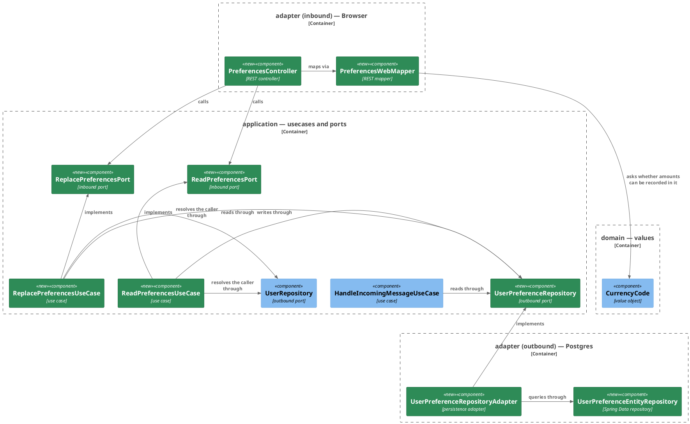

# Plan: Set a default currency — `ledger-service`

**Affected Modules:** `ledger-service`
**Design:** [Set a default currency](../design.md)

## Components

The design named the responsibilities; these are the classes that hold them. The preferences endpoints and the
turn are one subject here, because both reach the store through the same outbound port.



`WebExceptionHandler` and `SecurityConfiguration` are edited but drawn in neither: an exception advice and a filter
chain belong to every endpoint and to none. `UserPreferenceEntity` is a row with no collaborator, so it is the
table below rather than a box.

| Type                        | Holds                                                 | Refuses                                                              |
|-----------------------------|-------------------------------------------------------|----------------------------------------------------------------------|
| `Preferences`               | `Optional<CurrencyCode> defaultCurrency`              | a `null` optional                                                    |
| `ReadPreferencesCommand`    | `AuthenticatedUserId userId`                          | a `null` caller                                                      |
| `ReplacePreferencesCommand` | `AuthenticatedUserId userId`, `CurrencyCode defaultCurrency` | a `null` caller, a `null` currency                            |
| `UserPreferenceEntity`      | `@Id Long userId`, `String defaultCurrencyCode`       | — (written through the upsert query, never through `save()`)         |

| Port                       | Methods                                                                              |
|----------------------------|---------------------------------------------------------------------------------------|
| `ReadPreferencesPort`      | `Preferences read(ReadPreferencesCommand command)`                                    |
| `ReplacePreferencesPort`   | `Preferences replace(ReplacePreferencesCommand command)`                              |
| `UserPreferenceRepository` | `Optional<CurrencyCode> findDefaultCurrency(long userId)`, `void replaceDefaultCurrency(long userId, CurrencyCode defaultCurrency)` |

| Exception                    | Status | Raised by                                                              |
|------------------------------|--------|-------------------------------------------------------------------------|
| `InvalidMoneyException`      | 400    | a code ISO 4217 does not know, or one no amount can be recorded in     |
| `MethodArgumentNotValidException` | 400 | an absent or `null` `defaultCurrency`, or one the pattern refuses     |
| `EntityNotFoundException`    | 404    | a session naming a user the store no longer holds                      |
| `PersistenceFailedException` | 503    | the store did not answer                                               |

The 401 and the 403 are the security chain's, not the controller's: no session reaches the endpoint at all, and a
write with no CSRF token is refused by the enforcement filter.

## Step-by-Step Implementation Map (To-Do List)

### Stabilization

#### Database

- [x] ST01 · Add `ledger-service/src/main/resources/db/migration/V011__create_user_preference.sql`, as designed:
  ```sql
  CREATE TABLE user_preference (
      user_id               BIGINT     PRIMARY KEY REFERENCES app_user (id) ON DELETE CASCADE,
      default_currency_code VARCHAR(3) NOT NULL
  );
  ```

#### Interface-First / Build Stabilization

**Interface & Signature Sync**

- [x] ST02 · Add `bot.finance.application.dto.Preferences`, a record holding
  `Optional<CurrencyCode> defaultCurrency`, refusing a `null` optional with `InvalidValueException` as the
  self-validating records in that package do.
- [x] ST03 · Add `bot.finance.application.dto.ReadPreferencesCommand` and
  `bot.finance.application.dto.ReplacePreferencesCommand`, named for the use cases that take them so
  `inboundPortCommandsAreNamedAfterTheirUseCase` holds, each refusing a `null` component.
- [x] ST04 · Add the inbound ports `bot.finance.application.port.ReadPreferencesPort` and
  `ReplacePreferencesPort`, with the signatures in the port table above (interfaces only — the stubs are ST06).
- [x] ST05 · Add the outbound port `bot.finance.application.port.UserPreferenceRepository`, with
  `findDefaultCurrency` and `replaceDefaultCurrency`, documenting `PersistenceFailedException` on both as
  `UserRepository` documents its own.
- [x] ST06 · Stub `ReadPreferencesUseCase` and `ReplacePreferencesUseCase` in
  `bot.finance.application.usecase`, each implementing its port, each taking `UserRepository` and
  `UserPreferenceRepository`, and each returning the minimum:
  ```java
  public Preferences read(ReadPreferencesCommand command) {
      // resolves the caller through UserRepository, then answers the stored code or nothing
      return null;
  }
  ```
- [x] ST07 · Add `CurrencyCode.recordsAmounts()`, an instance predicate answering whether an amount can be
  recorded in this code, stubbed to `false`. It is a question about the code alone, which is why it sits here
  rather than on `Money`. The **constructor is untouched**: what `CurrencyCode` accepts stays every code
  `Currency.getInstance` knows, so a code already stored on an expense is never retroactively refused. Leave
  `Money.ofMajorUnits` reading the fraction digits itself for now — rewiring it to a stub returning `false` would
  fail every existing `Money` test inside this group. GU01 implements the predicate and folds `ofMajorUnits`'s
  check into a call to it, so the rule ends up written once.
- [x] ST08 · Add `bot.finance.adapter.persistence.UserPreferenceEntity` (`@Table("user_preference")`,
  `@Id Long userId`, `String defaultCurrencyCode`) and `UserPreferenceEntityRepository`, a `CrudRepository` whose
  write is an explicit `@Modifying @Query` returning `int` — every modifying statement in this module that does
  not end in `RETURNING` carries `@Modifying`, and without it Spring Data JDBC will not run it as a write:
  ```sql
  INSERT INTO user_preference (user_id, default_currency_code) VALUES (:userId, :code)
  ON CONFLICT (user_id) DO UPDATE SET default_currency_code = EXCLUDED.default_currency_code
  ```
  The key is assigned rather than generated, so `save()` would issue an `UPDATE` and the first write would find no
  row; the conflict clause is also what lets two concurrent replacements land one after the other.
- [x] ST09 · Stub `bot.finance.adapter.persistence.UserPreferenceRepositoryAdapter`, a `@Component` implementing
  `UserPreferenceRepository`, each method carrying its intent comment and returning the minimum.
- [x] ST10 · Stub `bot.finance.adapter.web.PreferencesWebMapper`, a stateless helper with
  `toReplacePreferencesCommand(ReplacePreferencesRequest, AuthenticatedUserId)` and
  `toResponse(Preferences)`. One `toResponse` is enough: the generator emits one wrapper per distinct response
  shape, and both operations answer `ReadPreferences200Response`. The generator also emits a
  `bot.finance.api.model.Preferences`, which collides by simple name with the application dto ST02 creates — this
  mapper is where the two meet, so it imports the dto and fully qualifies the generated type.
- [x] ST11 · Add `bot.finance.adapter.web.PreferencesController`, a `@RestController` implementing the generated
  `PreferencesApi`, taking both inbound ports, delegating through `PreferencesWebMapper` and
  `AuthenticatedCaller.authenticatedUserId()` as `CategoriesController` does.
- [x] ST12 · Add a `@ExceptionHandler(InvalidMoneyException.class)` to `WebExceptionHandler` answering 400 with
  the exception's own message, so a refused currency code names the code rather than reading "the request carried
  a value this service cannot accept". Spring resolves a handler by exception-type depth, so its position in the
  file decides nothing. `WebExceptionHandlerTest`'s
  `whenPortThrowsARefusedValueNoHandlerNames_thenResponseIs400WithoutTheExceptionsWording()` throws an
  `InvalidMoneyException` precisely to reach the fallback and asserts the body omits its wording; the new handler
  claims it, so rewrite that test's stand-in to an `InvalidValueException` no handler names, keeping what the
  test proves.
- [x] ST13 · Add `UserPreferenceRepository` as a constructor parameter of `HandleIncomingMessageUseCase`, keeping
  every existing line and marking the read's insertion point after `initializeUserPort.initialize` with a `TODO`.
  Fix the call sites the widened constructor breaks — `UseCaseConfiguration`'s `@Bean` method and
  `HandleIncomingMessageUseCaseTest`'s `setUp` — until the module compiles with its test sources.

**Configuration**

- [x] ST14 · Declare `ReadPreferencesUseCase` and `ReplacePreferencesUseCase` as `@Bean` methods in
  `bot.finance.adapter.config.UseCaseConfiguration`, beside the other use cases, each taking `UserRepository` and
  `UserPreferenceRepository`.
- [x] ST15 · Add `GET /api/v1/preferences` and `PUT /api/v1/preferences` to the web chain's matcher list in
  `SecurityConfiguration`, both `.authenticated()`, ahead of `.anyRequest().denyAll()`.

**Shared Test Infrastructure**

- [x] ST16 · Add `bot.finance.common.rows.UserPreferenceRowUtils` — stores a preference row directly and reads a
  user's stored code back — and list it in the package tree in
  [Testing Conventions](../../../ledger-service/docs/conventions/testing.md). `UserPreferenceRepositoryAdapterTest`
  and the system test both need it, and no red-phase step is scoped to add a shared fixture.

#### Closing item

- [x] ST17 · Confirm `bot.finance.architecture.CleanArchitectureTest` still passes, and that the pre-existing suite
  stands where the baseline left it — nothing is disabled by this group.

### Red Phase

#### TDD Unit Red Phase

- [x] RU01 · `ReadPreferencesUseCase` · test: `ReadPreferencesUseCaseTest` · covers: `read()` · scenarios: A1, A2, A19
    - `read()`:
        - given: a caller whose stored preference holds `EUR`
          when: read() is called
          then: the answer carries `EUR`, and the repository was asked for that caller's stored id
        - given: a caller with no preference row
          when: read() is called
          then: the answer carries no currency
        - given: a caller the user store does not hold
          when: read() is called
          then: EntityNotFoundException propagates and the preference port is untouched
        - given: a repository that throws PersistenceFailedException
          when: read() is called
          then: the exception propagates unchanged
- [x] RU02 · `ReplacePreferencesUseCase` · test: `ReplacePreferencesUseCaseTest` · covers: `replace()` · scenarios: A4, A5, A9
    - `replace()`:
        - given: a caller with no preference row and a command carrying `EUR`
          when: replace() is called
          then: the repository is asked to write `EUR` for that caller's stored id, and the answer carries `EUR`
        - given: a caller whose row holds `EUR` and a command carrying `USD`
          when: replace() is called
          then: the repository is asked to write `USD`, and the answer carries `USD`
        - given: a caller the user store does not hold
          when: replace() is called
          then: EntityNotFoundException propagates and nothing is written
        - given: a repository that throws PersistenceFailedException on the write
          when: replace() is called
          then: the exception propagates unchanged
- [x] RU03 · `CurrencyCode` · test: `CurrencyCodeTest` · covers: `recordsAmounts()` · scenarios: A8
    - `recordsAmounts()`:
        - given: a currency an amount can be recorded in, such as `EUR`
          when: recordsAmounts() is called
          then: it answers true
        - given: a currency whose default fraction digits are negative, such as `XAU`
          when: recordsAmounts() is called
          then: it answers false
        - given: the same `XAU`
          when: the code is constructed
          then: it is accepted — the predicate answers a question and never narrows what the record admits
- [x] RU04 · `PreferencesWebMapper` · test: `PreferencesWebMapperTest` · covers: `toReplacePreferencesCommand()`, `toResponse()` · scenarios: A4, A7, A8
    - `toReplacePreferencesCommand()`:
        - given: a request carrying `eur`
          when: it is mapped
          then: the command carries the upper-cased `EUR` and the caller it was given
        - given: a request carrying `XYZ`
          when: it is mapped
          then: InvalidMoneyException is thrown naming the code
        - given: a request carrying `XAU`
          when: it is mapped
          then: InvalidMoneyException is thrown naming the code, and it says no amount can be recorded in it
    - `toResponse()`:
        - given: preferences carrying `EUR`
          when: they are mapped
          then: the response carries the upper-cased `EUR`
        - given: preferences carrying no currency
          when: they are mapped
          then: the response carries `null`
- [x] RU05 · `HandleIncomingMessageUseCase` · test: `HandleIncomingMessageUseCaseTest` · covers: `handle()` · scenarios: A16, A17, A18
    - `handle()`:
        - given: a sender whose stored preference holds `EUR`
          when: handle() is called
          then: the extraction request carries `EUR` as its default currency, read for the sender's stored id
        - given: a sender whose preference read throws PersistenceFailedException
          when: handle() is called
          then: the extraction request carries no default currency, the turn is still delivered, and the failure is
          reported only through the log — nothing else observes it
        - update: `whenCommandIsNull_thenThrowsInvalidIncomingMessageExceptionAndNoPortIsCalled()` — add the new
          preference port to the collaborators it verifies were never touched
    - A sender with no preference row is already what every other test in this class exercises, so it earns no
      scenario of its own.
- [x] RU06 · `Preferences` · test: `PreferencesTest` · covers: the record's constructor
    - the constructor:
        - given: a `null` optional
          when: the record is constructed
          then: InvalidValueException is thrown
        - given: an optional carrying a currency, and an empty optional
          when: the record is constructed
          then: it holds what it was given, in both cases
- [x] RU07 · `ReadPreferencesCommand` · test: `ReadPreferencesCommandTest` · covers: the record's constructor
    - the constructor:
        - given: a `null` caller
          when: the record is constructed
          then: InvalidValueException is thrown
        - given: a caller
          when: the record is constructed
          then: it holds that caller
- [x] RU08 · `ReplacePreferencesCommand` · test: `ReplacePreferencesCommandTest` · covers: the record's constructor
    - the constructor:
        - given: a `null` caller
          when: the record is constructed
          then: InvalidValueException is thrown
        - given: a `null` currency
          when: the record is constructed
          then: InvalidValueException is thrown
        - given: a caller and a currency
          when: the record is constructed
          then: it holds both

#### TDD Integration Red Phase

- [x] RI01 · `UserPreferenceRepositoryAdapter` · test: `UserPreferenceRepositoryAdapterTest` · covers: `findDefaultCurrency()`, `replaceDefaultCurrency()` · scenarios: A4, A5
    - `findDefaultCurrency()`:
        - given: a stored user whose preference row holds `EUR`
          when: findDefaultCurrency() is called for that user
          then: it answers `EUR`
        - given: a stored user with no preference row
          when: findDefaultCurrency() is called for that user
          then: it answers nothing
        - given: a stored user whose row holds `eur` written directly
          when: findDefaultCurrency() is called
          then: it answers a `CurrencyCode` of `EUR`, since `CurrencyCode` upper-cases what it is given
    - `replaceDefaultCurrency()`:
        - given: a stored user with no preference row
          when: replaceDefaultCurrency() is called with `EUR`
          then: one row holds `EUR` for that user
        - given: a stored user whose row holds `EUR`
          when: replaceDefaultCurrency() is called with `USD`
          then: that user still has exactly one row, and it holds `USD`
        - given: a user id no `app_user` row holds
          when: replaceDefaultCurrency() is called
          then: PersistenceFailedException is thrown
- [x] RI02 · `PreferencesController` · test: `PreferencesControllerTest` · covers: `GET /api/v1/preferences`, `PUT /api/v1/preferences` · mocks: `ReadPreferencesPort`, `ReplacePreferencesPort` · scenarios: A1, A2, A7, A9, A19, A24, A29
    - Happy Path:
        - given: the read port answers preferences carrying `EUR`
          when: the preferences are read
          then: 200 is returned with `defaultCurrency` `EUR`, and the port was called for the authenticated caller
        - given: the read port answers preferences carrying no currency
          when: the preferences are read
          then: 200 is returned with `defaultCurrency` `null`
        - given: the replace port answers preferences carrying `EUR`
          when: the preferences are replaced with `eur`
          then: 200 is returned with `defaultCurrency` `EUR`, and the port received a command carrying `EUR`
    - Error Mapping:
        - given: a port that throws PersistenceFailedException
          when: the preferences are read
          then: 503 is returned and the body carries a message
        - given: a port that throws PersistenceFailedException
          when: the preferences are replaced
          then: 503 is returned and the body carries a message
        - given: a request whose `defaultCurrency` is a code ISO 4217 does not know
          when: the preferences are replaced
          then: 400 is returned naming the code, and no port is called
    - Validation: `defaultCurrency` — absent from the body, `null`, blank, two letters, four letters, and a
      three-character value that is not letters
- `PreferencesControllerTest` carries `@WebAdapterTest` and `UserPreferenceRepositoryAdapterTest` carries
  `@PersistenceAdapterTest`; the 401 and the 403 belong to the security chain and are proved once, at system level.

#### TDD System Test Red Phase

- [x] RS01 · `SetDefaultCurrencySystemTest` · covers: `PUT /api/v1/preferences`, `GET /api/v1/preferences` · scenarios: A1, A3, A4, A20
    - Happy Path:
        - given: a signed-in browser session for a person with no preference row
          when: they replace their preferences with `eur` and then read them back
          then: both answer 200 with `defaultCurrency` `EUR`, and one row holds `EUR` for that person
    - Unhappy Path:
        - given: no session cookie
          when: the preferences are read
          then: 401 is returned
        - given: a signed-in session whose request omits the CSRF header
          when: the preferences are replaced
          then: 403 is returned and the stored preference is unchanged
- [x] RS02 · `ReceiveTelegramMessageSystemTest` · covers: `TelegramUpdateListener.process()` · scenarios: A16
    - Happy Path:
        - given: a person whose stored preference holds `EUR`, on a scenario of its own in `TelegramTestBot`
          when: they send a message the bot polls
          then: the extraction request the AI connector stub recorded carries `default_currency` `EUR`
    - A turn for a person with no preference row is what every existing test in this class already drives, so it
      earns no scenario of its own.

### Green Phase

#### TDD Unit Green Phase

- [x] GU01 · `CurrencyCode` · test: `CurrencyCodeTest`
- [x] GU02 · `ReadPreferencesUseCase` · test: `ReadPreferencesUseCaseTest` · after: GU06, GU07
- [x] GU03 · `ReplacePreferencesUseCase` · test: `ReplacePreferencesUseCaseTest` · after: GU06, GU08
- [x] GU04 · `PreferencesWebMapper` · test: `PreferencesWebMapperTest` · after: GU01
- [x] GU05 · `HandleIncomingMessageUseCase` · test: `HandleIncomingMessageUseCaseTest`
- [x] GU06 · `Preferences` · test: `PreferencesTest`
- [x] GU07 · `ReadPreferencesCommand` · test: `ReadPreferencesCommandTest`
- [x] GU08 · `ReplacePreferencesCommand` · test: `ReplacePreferencesCommandTest`

#### TDD Integration Green Phase

- [x] GI01 · `UserPreferenceRepositoryAdapter` · test: `UserPreferenceRepositoryAdapterTest`
- [x] GI02 · `PreferencesController` · test: `PreferencesControllerTest` · after: GU04

#### TDD System Test Green Phase

- [x] GS01 · `SetDefaultCurrencySystemTest` · covers: `PUT /api/v1/preferences`, `GET /api/v1/preferences`
- [x] GS02 · `ReceiveTelegramMessageSystemTest` · covers: `TelegramUpdateListener.process()`

### Post-Implementation Steps

#### Manual Request Files

- [ ] P01 · Add `ledger-service/docs/requests/preferences/read-preferences.http` and
  `replace-preferences.http`, one file per operation in a directory named for the tag, as
  [Architecture & Layering](../../../ledger-service/docs/conventions/architecture.md) requires.

## Open Questions / Blockers

- **Suspected bug the tests do not catch (refactor pass, unverified):**
  `UserPreferenceRepositoryAdapter.findDefaultCurrency` constructs the `CurrencyCode` *inside* its
  `catch (RuntimeException e)`, so an `InvalidMoneyException` from the record's compact constructor is wrapped into
  `PersistenceFailedException` and the caller is told the store was unavailable — a 503 where the plan's exception
  table intends a 400. Reachable only by a write that bypasses the endpoint (`default_currency_code` is
  `VARCHAR(3)` with no check constraint) or by a code the JDK later stops recognising. Derived by reading, not
  executed: demonstrating it needs a new test, which the refactor pass's unchanged-count guardrail forbids. A
  developer should decide whether the mapping belongs outside the `try`.

- **Over-specified test (RU05/GU05):** `HandleIncomingMessageUseCaseTest`'s
  `whenSendersPreferenceReadThrowsPersistenceFailedException_thenRequestCarriesNoCurrencyAndTurnDelivered()` asserts
  `verify(log).warn(anyString(), any())`, which pins the two-argument SLF4J overload rather than the fact that the
  failure was logged. `HandleIncomingMessageUseCase.readDefaultCurrency` therefore logs
  `log.warn("failed to read default currency: {}", "user %d: %s".formatted(userId, e.getMessage()))`, formatting
  eagerly, while its neighbour `storeReport` uses the class's normal three-argument form. The behaviour is right and
  the suite is green; what is wrong is the assertion's grip on the overload. The refactor pass cannot correct it —
  it may not change a test assertion — so this is left for a developer to loosen to an assertion about the warning
  itself.

- **Implementation note (RS02):** the scenario-arming `WireMockStubs.telegramDeliversOnce(...)` call moved out of
  `ReceiveTelegramMessageSystemTest`'s shared `@BeforeEach` into each `@Test` body, the pre-existing test included.
  Two scenarios cannot share one WireMock delivery state machine, so arming both from a scenario-agnostic
  `@BeforeEach` would have raced. No `update:` bullet authorized this; the assertions and the execution order of
  the existing test are unchanged, and the red exit run confirms every pre-existing test in that class still passes.

- **Implementation note (red phase):** ten `@DisplayName` values written by the red step agents exceeded the
  120-character limit `bot.finance.architecture.DisplayNameConventionsTest` enforces, failing it. The owning step
  agents shortened them; nothing else changed, and the re-run returned the same 1193 total and 0 skipped.

- **Blocker note:** `RI01`, `RS01` and `RS02` need Docker for the containerized Postgres. Without it those
  classes skip rather than fail — [Build](../../../ledger-service/docs/conventions/build.md) says so — and the
  run cannot prove them, so a skipped count above the baseline's on those classes means the daemon was down, not
  that a step failed.

## Review Findings

- **F1:** ST12's new handler claims the exception
  `WebExceptionHandlerTest.whenPortThrowsARefusedValueNoHandlerNames_thenResponseIs400WithoutTheExceptionsWording()`
  throws to reach the fallback, so that test would start failing inside Stabilization.
  - Resolution: mechanical
  - Action: applied — ST12 now rewrites that test's stand-in to an `InvalidValueException` no handler names.

- **F2:** ST10 asked for one `toResponse` per generated response type, which would be two methods differing only
  in return type.
  - Resolution: mechanical
  - Action: applied — one `toResponse` is correct: the generated tree has no `SignIn200Response` beside
    `CurrentSession200Response`, so the generator emits one wrapper per response shape and both operations answer
    `ReadPreferences200Response`. ST10 also now says how the generated `Preferences` and the application dto of
    that name are kept apart.

- **F3:** ST08's upsert carried no `@Modifying`, so Spring Data JDBC would not run it as a write.
  - Resolution: mechanical
  - Action: applied — ST08 now specifies `@Modifying @Query` returning `int`.

- **F4:** `UserRepository` is a collaborator of both new use cases and appeared in no diagram box, stub or bean.
  - Resolution: mechanical
  - Action: applied — added the box and both arrows, and named both collaborators in ST06 and ST14.

- **F5:** The three new self-validating `application/dto` records had no unit step, though eighteen sibling
  records each have one.
  - Resolution: decision
  - Action: resolved — the repository settles it: `BrowseCategoriesCommandTest`, `ListCategoriesCommandTest`,
    `ReadSessionCommandTest` and their kind are the module's practice, and the testing conventions map
    self-validating dto records to the unit type. Added RU06–RU08 and GU06–GU08, and made GU02 and GU03 wait on
    them, since a use-case test constructs those records for real.

- **F6:** The plan gives the endpoints a 404 the design's status table never listed.
  - Resolution: decision
  - Action: resolved — the repository settles it: `WebExceptionHandler.onEntityNotFound` already answers 404 for
    a session naming a user the store no longer holds, `BrowseCategoriesUseCase` resolves its caller through
    `UserRepository.requireById`, and the other three browse-API paths declare `NotFound`. The lookup stays, the
    shared plan declares the 404, and the design's omission is recorded there as `F39`.

- **F7:** RI02's `scenarios:` list omitted A7 and A9, which its Error Mapping group writes.
  - Resolution: mechanical
  - Action: applied — the list now reads A1, A2, A7, A9, A19, A24, A29.

- **F8:** RI01's foreign-key scenario read state back after a constraint violation aborted the transaction.
  - Resolution: mechanical
  - Action: applied — cut the read-back clause, leaving the thrown `PersistenceFailedException`.

- **F9:** RU05's premise bullet named no test body — `setUp()` constructs the use case, and ST13 already fixes it.
  - Resolution: mechanical
  - Action: applied — deleted the premise bullet, keeping the per-method one.

- **F10:** The note under the Integration Red Phase called both classes web slices.
  - Resolution: mechanical
  - Action: applied — it now names each class's own annotation.

- **F11:** ST12 justified the handler by its position in the file, which Spring does not read.
  - Resolution: mechanical
  - Action: applied — dropped the ordering rationale.

- **F12:** RS01 and GS01 named only the `PUT`, though the class also drives the `GET`.
  - Resolution: mechanical
  - Action: applied — both now name both entry points.
