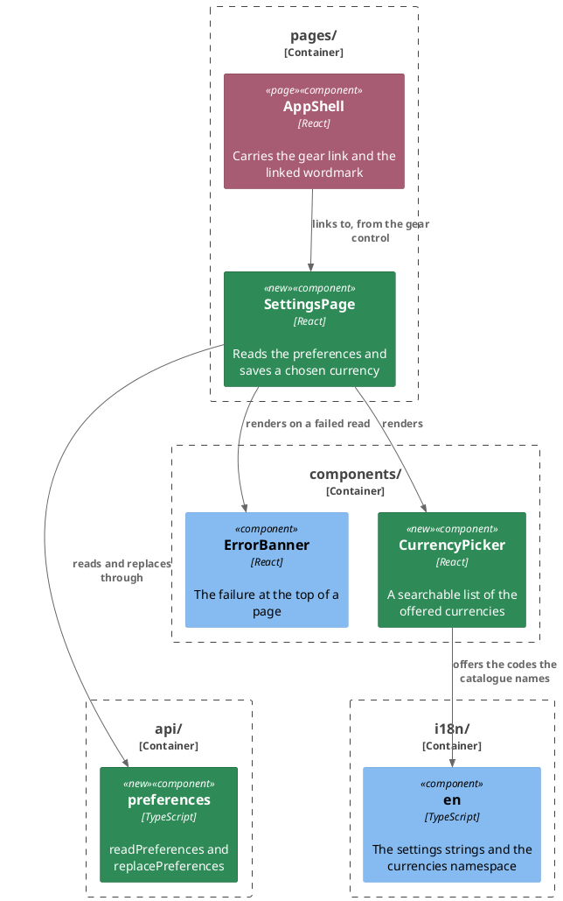

# Plan: Set a default currency — `web-app`

**Affected Modules:** `web-app`
**Design:** [Set a default currency](../design.md)

## Components

The design named the responsibilities; these are the files that hold them. Boxes are grouped by the directory
each sits in, which is how this module organizes code.

`routes.tsx` and `RequireAuth` are edited and drawn in neither: the route table is where every page is wired, and
the guard already stands between the shell and every page behind it.

| File                          | Exports                                                                                  | Refuses                                                       |
|-------------------------------|-------------------------------------------------------------------------------------------|----------------------------------------------------------------|
| `src/api/preferences.ts`      | `Preferences`, `PreferencesUpdate`, `readPreferences()`, `replacePreferences(code)`       | nothing — a refusal reaches the caller as `ApiError`           |
| `src/components/CurrencyPicker.tsx` | `CurrencyPickerProps`, `CurrencyPicker`                                             | an `onChange` that clears — the props carry no unset value     |
| `src/i18n/en.ts`              | `en.currencies` (one key per offered code), `en.settings`, `en.shell.settings`            | a code with no name, and a name no code offers                 |

| Prop           | Type                        | What it carries                                                          |
|----------------|-----------------------------|---------------------------------------------------------------------------|
| `currencyCode` | `string \| undefined`       | the stored code, offered or not; `undefined` where nothing is stored       |
| `onChange`     | `(code: string) => void`    | the picked code — never `undefined`, since a choice cannot be cleared      |
| `label`        | `string`                    | the field's label, read from the catalogue by the page                     |

The offered set is `keyof typeof en.currencies`, so there is no array beside the catalogue that could disagree
with it.

## Step-by-Step Implementation Map (To-Do List)

### Stabilization

#### Interface-First / Build Stabilization

**Interface & Signature Sync**

- [x] ST01 · Add a `currencies` namespace to `src/i18n/en.ts` — a handful of codes only, `EUR`, `USD` and their
  kind, each answering the currency's English name — so `keyof typeof en.currencies` types the picker's props.
  A comment above it names the ISO 4217 published table the full set is transcribed from and says nothing checks
  it afterwards. This is the one namespace that names data rather than the surface reading it, and the comment
  says so. The full transcription is GU02's, which is what RU02's guard drives.
- [x] ST02 · Add a `settings` namespace to `src/i18n/en.ts` — the page heading, the field label, the picker's
  unset wording, its search placeholder, its empty-list wording, the save control, the saved-confirmation line and
  the read-failure wording — and a `shell.settings` label for the gear control's `aria-label`.
- [x] ST03 · Stub `src/api/preferences.ts`: re-export `Preferences` and `PreferencesUpdate` from
  `./generated/ledger-api`, and add `readPreferences()` and `replacePreferences(defaultCurrency)` calling through
  `request` from `./client`, each with an intent comment and returning the minimum. `fetch` appears nowhere but
  `api/`, so the page reaches the ledger only here.
- [x] ST04 · Stub `src/components/CurrencyPicker.tsx` with the props in the table above and a component rendering
  its trigger and nothing else, carrying an intent comment naming the searchable list it will hold.
- [x] ST05 · Stub `src/pages/SettingsPage.tsx`, exporting `SettingsPage` and rendering nothing, with an intent
  comment naming the read on mount, the picker and the explicit save.
- [x] ST06 · Add the `/settings` route to `src/routes.tsx`, inside `RequireAuth` beside `/`, so the page renders
  in `AppShell` and an anonymous visitor is sent to the sign-in page as they are for `/`.

#### Closing item

- [x] ST07 · Confirm the module compiles and the pre-existing suite stands where the baseline left it:
  `npm --prefix web-app run typecheck`, then `tools/agent-test/agent-test.sh --module web-app`. Nothing is skipped
  by this group. This module has no architecture-enforcement test; `src/conventions.test.ts` is the nearest thing
  and asserts nothing this group touches.

### Red Phase

#### TDD Unit Red Phase

- [x] RU01 · `preferences` · test: `preferences.test.ts` · covers: `readPreferences()`, `replacePreferences()` · scenarios: A12
    - `readPreferences()`:
        - given: a stubbed fetch answering 200 with `defaultCurrency` `EUR`
          when: readPreferences() is called
          then: it requests `/api/v1/preferences` with GET, and answers the code the body carried
        - given: a stubbed fetch answering 200 with `defaultCurrency` `null`
          when: readPreferences() is called
          then: it answers preferences carrying no currency rather than throwing
        - given: a stubbed fetch answering 401
          when: readPreferences() is called
          then: it rejects with an `ApiError` carrying 401
    - `replacePreferences()`:
        - given: a stubbed fetch answering 200 and a CSRF cookie the ledger set
          when: replacePreferences() is called with `EUR`
          then: it sends PUT to `/api/v1/preferences` with `defaultCurrency` `EUR` in the body and the CSRF token
          in the header
        - given: a stubbed fetch answering 400 with a problem body
          when: replacePreferences() is called
          then: it rejects with an `ApiError` carrying 400 and the message the body named
- [x] RU02 · `en` · test: `en.test.ts` · covers: the `currencies` namespace · scenarios: A25
    - the `currencies` namespace:
        - given: the namespace's keys
          when: they are compared with a hand-written list of the codes no amount can be recorded in — `XAU`,
          `XDR`, `XXX`, `XAG`, `XPT`, `XPD`, `XBA`, `XBB`, `XBC`, `XBD`, `XTS`, `XSU`, `XUA`
          then: none of them is offered
        - given: the namespace's entries
          when: each key and value is read
          then: every key is three upper-case letters, and every value is a non-empty name
        - given: the namespace's keys
          when: they are counted, and a hand-written sample of common current codes is looked for — `EUR`, `USD`,
          `GBP`, `JPY`, `CHF`, `PLN`, `TRY`, `ZAR`
          then: every one of them is offered, and the namespace holds well over a hundred codes rather than the
          handful stabilization left
- [x] RU03 · `CurrencyPicker` · test: `CurrencyPicker.test.tsx` · covers: the rendered picker · scenarios: A11, A26, A28, A30
    - the trigger:
        - given: a stored code the catalogue names, `EUR`
          when: the picker is rendered
          then: the trigger reads `Euro (EUR)`
        - given: no stored code
          when: the picker is rendered
          then: the trigger reads the catalogue's unset wording
        - given: a stored code the catalogue does not name, `DEM`
          when: the picker is rendered
          then: the trigger reads `DEM`
    - the list:
        - given: the picker is open
          when: the entries are read in the order they stand
          then: each entry reads as its name then its code, and a name beginning with a diacritic stands among
          the plain-letter names rather than after all of them — a hand-written expected order, read off document
          order as `CategoryPicker.test.tsx` reads its own, never one built with the collator under test
        - given: the picker is open
          when: `usd` is typed into its search
          then: `US Dollar (USD)` is among the entries shown, and fewer entries stand than before the search
        - given: the picker is open
          when: a query matching nothing is typed
          then: the catalogue's empty-list wording is shown
        - given: the picker is open
          when: an entry is chosen
          then: `onChange` is called with that entry's code alone, and the list closes
- [x] RU04 · `SettingsPage` · test: `SettingsPage.test.tsx` · covers: the rendered page · scenarios: A11, A12, A13, A14, A15, A22, A23, A26, A30
    - the read on mount:
        - given: `api/preferences` mocked to answer `EUR`
          when: the page is rendered
          then: the picker stands on `Euro (EUR)`, and no save control is offered
        - given: the read answers no stored currency
          when: the page is rendered
          then: the picker stands on its unset wording, and no save control is offered
        - given: the read answers a code the offered set does not hold, `DEM`
          when: the page is rendered and a currency is then picked
          then: the trigger first reads `DEM`, and the save control appears once the picked currency differs
        - given: the read rejects with a failure that is not a refused session
          when: the page is rendered
          then: the failure is shown at the top of the page and no picker is rendered
        - given: the read rejects with an `ApiError` carrying 401
          when: the page is rendered
          then: `sessionExpired` is called on the auth context, and no failure banner is left behind
    - saving:
        - given: the page is on screen with a currency picked that is not the stored one
          when: the save control is used
          then: `replacePreferences` is called with the picked code, and the page reports that it was saved
        - given: a save is out
          when: the save control is used again
          then: the save control is disabled while the first call stands, so nothing is sent
        - given: a save was answered and the page reports it
          when: a different currency is picked
          then: the saved-confirmation line is gone, and the save control is offered again
        - given: the ledger refuses the write for a reason that is not a session
          when: the save control is used
          then: the refusal's wording is shown beside the save control, and the picker still stands on what was
          picked
        - given: the ledger answers 401 to the write
          when: the save control is used
          then: `sessionExpired` is called on the auth context
        - given: the catalogue is substituted
          when: the page is rendered and a different currency is then picked, so the save control is offered
          then: its heading, its field label and its save control read the catalogue's text
- [x] RU05 · `AppShell` · test: `AppShell.test.tsx` · covers: the header · scenarios: A27
    - the header:
        - given: a signed-in person
          when: the shell is rendered
          then: a gear control carrying the catalogue's settings label leads to `/settings`
        - given: a signed-in person on `/settings`
          when: the shell is rendered
          then: the gear control marks itself as the current page
        - given: the shell is rendered on `/settings`
          when: the product name is followed
          then: the listing route is shown
        - update: premise — the header gains a gear control shown only while a session is open · a test asserting
          what the header offers an anonymous visitor names the gear among what is absent
        - update: the test named `shows the catalogue’s text for the product name, the theme control and the
          sign-out control` enumerates every header string read from the catalogue and asserts each substituted
          form — it gains the gear's label among them
- [x] RU06 · `AppRoutes` · test: `App.test.tsx` · covers: the `/settings` route
    - the route table:
        - given: no session
          when: `/settings` is asked for
          then: the sign-in page is shown
        - given: a session that is already open
          when: `/settings` is asked for
          then: the settings page is shown inside the shell

### Green Phase

#### TDD Unit Green Phase

- [x] GU01 · `preferences` · test: `preferences.test.ts`
- [x] GU02 · `en` · test: `en.test.ts`
- [x] GU03 · `CurrencyPicker` · test: `CurrencyPicker.test.tsx` · after: GU02
- [x] GU04 · `SettingsPage` · test: `SettingsPage.test.tsx` · after: GU03
- [x] GU05 · `AppShell` · test: `AppShell.test.tsx`
- [x] GU06 · `AppRoutes` · test: `App.test.tsx` · after: GU04, GU05

`CurrencyPicker` reuses the `Popover` and `Command` primitives under `components/ui/`; `CategoryPicker` itself is
not reused, its props being category-shaped throughout. The picker sits in a `bg-card` panel at the width
`ExpenseFilters` gives a field, its popover takes the trigger's width, and its trigger truncates as
`CategoryFilter`'s does. In the shell, the gear is a `NavLink` beside the theme control taking the same
icon-button shape, and the product name is a `Link` wearing the ghost button's hover and its
`focus-visible:ring-accent` — it is the module's first anchor, and a bare one is invisible under Tab.

## Open Questions / Blockers

- **Q1:** Two decisions travel together here: the currency list is the browser's rather than a ledger endpoint
  (D1), and it is transcribed by hand with nothing checking it afterwards (D7). Both are technical choices with a
  maintenance cost, and neither is stated anywhere outside this task's design. Record them as one ADR?
  - A: No ADR. The design's D1 and D7 carry the reasoning, and the task directory is archived rather than
    deleted. This plan has no **Post-Implementation Steps** group.

- **Defect found while implementing (RU04):** the catalogue-substitution scenario asked for the save control's
  text on a bare render, which the two read-on-mount scenarios rule out — no save control is offered until a
  differing currency is picked. The scenario's `when` now names that interaction, and the test asserts all three
  substituted strings after it. No behaviour changed; the plan text was corrected in place.

- **Defect found while implementing (RU04 / GU04):** RU04's catalogue-substitution scenario names three strings —
  the heading, the field label and the save control. The test written for it also asserted the picker's trigger
  text in its substituted form (`‹Euro› (EUR)`), which no scenario asks for and which the picker cannot produce:
  `CurrencyPicker` resolves a currency's name by indexing `en.currencies`, the offered set the Components section
  defines, rather than through `t()`. RU03's own tests substitute that module directly and depend on it. The test
  was corrected to assert exactly the three strings the scenario names; `CurrencyPicker` was left as it is.

- **Defect found while implementing (RU06 / GU04):** `stubSignedIn` in `App.test.tsx` is shared test
  infrastructure answering `/expenses`, `/categories`, `/groupings` and `/session`. The settings route adds a
  read of `/api/v1/preferences`, which the fixture did not answer, so the page took its read-failure path and
  showed the banner instead of the heading — RU06's signed-in scenario failing on a fixture gap rather than on
  the route table. Stabilization should have widened the fixture; it was widened here instead, and the widening
  is recorded rather than left silent.

- **Blocker note:** [What the Suite Cannot See](../../../web-app/docs/conventions/testing.md#what-the-suite-cannot-see)
  reaches most of this change — position, wrapping, colour in both themes, and a list clipped by a bound it never
  got. The design's F25 already names the screens and the states to look at. Nothing in this plan waits on that,
  and the list belongs in the task's `review/findings.md`, written by whoever finishes the task.

## Review Findings

- **F1:** Three scenarios assert that no entry is marked selected, which this module's suite cannot observe: cmdk
  sets `aria-selected` on the *highlighted* item and highlights the first match as soon as the list opens, and the
  only other marker is `CategoryPicker`'s aria-hidden `Check` with an opacity class — which the testing
  conventions rule out as an assertion. The design (A30, F19) states the outcome, but nothing in the module
  renders it accessibly. Either the clause is dropped from the three scenarios — the trigger's wording already
  distinguishes stored, unset and unoffered — or `CurrencyPicker` renders an accessible marker of its own, which
  changes what it renders.
  - Resolution: decision
  - Action: applied — the user chose to drop the clause. `CurrencyPicker` renders what `CategoryPicker` renders,
    an aria-hidden `Check`, and the three scenarios now assert the trigger's wording alone.

- **F2:** RU03's ordering scenario could only be satisfied by building the expected order with the collator under
  test, which the testing conventions forbid.
  - Resolution: mechanical
  - Action: applied — restated it as a hand-written expected order over a diacritic-initial name, read off
    document order the way `CategoryPicker.test.tsx` reads its own.

- **F3:** RU05's premise bullet carried two unrelated consequences, and its wordmark half reached no test body —
  the four tests naming the product name query it by heading role, whose accessible name is unchanged.
  - Resolution: mechanical
  - Action: applied — kept the gear premise and dropped the wordmark half.

- **F4:** The AppShell test that enumerates the header's catalogue strings would omit the gear's label, and no
  bullet reached it.
  - Resolution: mechanical
  - Action: applied — added an `update:` bullet for it.

- **F5:** ST01 transcribes the whole `currencies` namespace, so RU02 is green the moment stabilization lands and
  GU02 implements nothing. The reviewer recommends ST01 stub the namespace with a handful of codes plus the ISO
  4217 comment and GU02 carry the full transcription; the alternative — treat the catalogue as a contract
  artifact and drop RU02/GU02 — loses the `XAU`/`XDR`/`XXX` guard.
  - Resolution: decision
  - Action: applied — the user chose the stub. ST01 now adds a handful of codes plus the ISO 4217 comment, RU02
    gained a scenario for the full set, and GU02 carries the transcription.

- **F6:** D9's styling for the wordmark and the gear was encoded in no step, and jsdom cannot catch its absence.
  - Resolution: mechanical
  - Action: applied — added it to the paragraph under the Green Phase section.

- **F7:** RU04's second-save scenario asserted a call count that the disabled control already guarantees.
  - Resolution: mechanical
  - Action: applied — reduced it to the disabled control.

- **F8:** F22's saved-confirmation line — that it stands until the choice changes — reached no scenario.
  - Resolution: mechanical
  - Action: applied — added a scenario to RU04's saving group.

- **F9:** The `/settings` route's placement inside `RequireAuth` is claimed by ST06 and asserted nowhere, though
  this module's conventions map a route's composition and its redirects onto the Page layer and `App.test.tsx`
  already tests the route table.
  - Resolution: decision
  - Action: applied — the user chose to cover it. Added RU06 and GU06 over `App.test.tsx`, with the anonymous
    redirect and the signed-in render.

- **F10:** The diagram drew a routing arrow from `AppShell` to `SettingsPage` that does not exist in code.
  - Resolution: mechanical
  - Action: applied — relabelled it as the gear's link.
