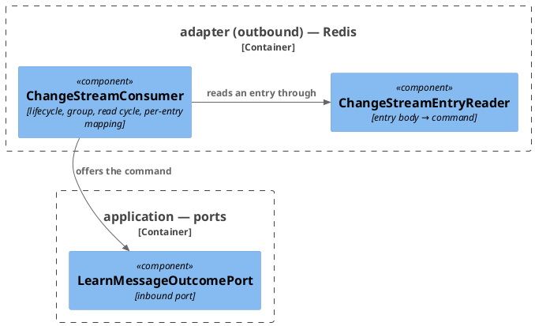
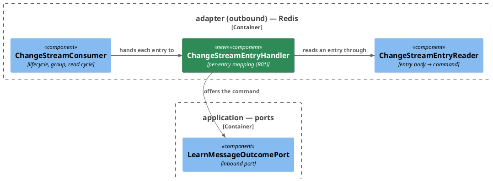

# Rework: The per-entry mapping leaves the change-stream consumer

**Affected Modules:** `ai-connector-service`
**Source:** docs/implemented/32-the-connector-learns-what-became-of-a-message/review/findings.md, R2 (backlog C3)
**Baseline:** 41f08dfd

## The fix

`ChangeStreamConsumer` keeps the thread, the group and the read cycle. The reader→port→acknowledge mapping of
one entry moves, unrewritten, into `ChangeStreamEntryHandler`, a stateless class in `adapter/redis` that a unit
test reaches with the reader and the port mocked. The consumer hands it each entry and the `StreamOperations`
its loop already holds, and reads back the one bit it needs — whether the entry must be offered again. The
retry asymmetry between a fresh delivery and a pending sweep stays in `processEntries`, where it is decided.
Diagrams follow.

## What changes

**Move the per-entry mapping into a unit target**

| #   | Kind      | What changes                                                                                 | Touches                  |
|-----|-----------|----------------------------------------------------------------------------------------------|--------------------------|
| R01 | `extract` | move `processEntry`, `offer` and `acknowledge` into a new `ChangeStreamEntryHandler`         | `adapter.redis`          |

**Not changed:** the claim → own-pending → new read order, `RETRY_BACKOFF` and the stop-on-first-retry rule of
a fresh delivery, the group name and consumer name, every log message's text and level, what
`LearnMessageOutcomePort` is offered, and `ChangeStreamEntryReader`.

## What the code does now

| What                                                  | Where                                    | What is wrong with it                                                                                        |
|-------------------------------------------------------|------------------------------------------|--------------------------------------------------------------------------------------------------------------|
| `processEntry`: read, WARN-and-ack an unreadable body | `ChangeStreamConsumer.java:217`          | the most-branching code in the class is reachable only through `@RedisAdapterTest` and a containerized Redis |
| `offer`: port call, ERROR on a throw, outcome switch  | `ChangeStreamConsumer.java:241`          | a change to the outcome mapping edits the class that owns the thread and the reconnect loop                  |
| `acknowledge`                                         | `ChangeStreamConsumer.java:265`          | called only by the two above; travels with them                                                              |
| The two `LogCapture.attachedTo(ChangeStreamConsumer)` | `ChangeStreamConsumerTest.java:215, 265` | key on the class whose logger the moved lines write through                                                  |

## Structure

Now:

Target:

## What must stay true

- The handler registers only with `memory.enabled=true`, like every other bean of `adapter/redis`. With it off
  the port it needs has no bean, so `MetersWithMemoryOffSystemTest`'s context would fail to start.
- The handler acknowledges through the `StreamOperations` the consumer's loop obtained, never a view it acquires
  itself. Nothing would notice today; a later reconnect change would.
- The consumer's own thread, reconnect and claim behaviour are untouched: `ChangeStreamConsumerTest` runs green
  after its mechanical edits, with no assertion changed.

## Steps

- [x] R01 · extract · move `processEntry`, `offer` and `acknowledge` from `ChangeStreamConsumer` into a new `ChangeStreamEntryHandler` (`adapter/redis`, `@Component`, `@ConditionalOnProperty(memory.enabled)`), constructed from `ChangeStreamEntryReader`, `LearnMessageOutcomePort`, `ChangeStreamProperties` and `LoggerFactory`, exposing `boolean handle(StreamOperations<String, String, String> streamOperations, MapRecord<String, String, String> entry)` that answers whether the entry must be retried; the consumer takes the handler as a constructor parameter, drops the reader and port fields, and `processEntries` calls `handler.handle(...)`. `RedisAdapterTest` and `WhenConnectionCut` add the handler to their booted classes; the two `LogCapture.attachedTo(ChangeStreamConsumer.class)` become `attachedTo(ChangeStreamEntryHandler.class)`. `ChangeStreamConsumerTest` runs green after those edits.
  - files:
    - `ai-connector-service/src/main/java/bot/finance/ai/adapter/redis/ChangeStreamConsumer.java`
    - `ai-connector-service/src/main/java/bot/finance/ai/adapter/redis/ChangeStreamEntryHandler.java`
    - `ai-connector-service/src/main/java/bot/finance/ai/adapter/redis/package-info.java`
  - test-files:
    - `ai-connector-service/src/test/java/bot/finance/ai/adapter/redis/ChangeStreamEntryHandlerTest.java`
    - `ai-connector-service/src/test/java/bot/finance/ai/adapter/redis/ChangeStreamConsumerTest.java`
    - `ai-connector-service/src/test/java/bot/finance/ai/common/boot/RedisAdapterTest.java`
  - frozen: `LearnMessageOutcomeSystemTest`
  - cover: `ChangeStreamEntryHandlerTest` — plain JUnit, reader, port and `StreamOperations` mocked: an unreadable body is WARN-logged and acknowledged; a body the reader maps to nothing is acknowledged; `APPLIED` and `DROPPED` acknowledge and answer no retry; `RETRY_LATER` answers retry without acknowledging; a port throw is ERROR-logged, not acknowledged, and answers retry
  - docs: `ai-connector-service/docs/conventions/testing.md`
  - docs: `ai-connector-service/docs/usecases/learn-message-outcome.md`

## Open Questions

- **Q1:** The WARN for an unreadable entry and the ERROR for a failing port move to the handler, so their logger
  name becomes `bot.finance.ai.adapter.redis.ChangeStreamEntryHandler`. Anyone filtering logs by the consumer's
  class loses those two lines. Acceptable?
  - A: Yes. The lines follow the class that emits them; the two `LogCapture` attachments move with them (user,
    2026-08-25).
