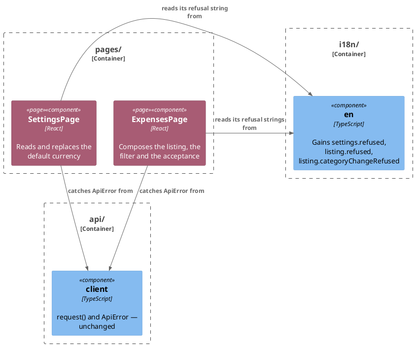

# Plan: The Browser Owns Its Refusal Wording — `web-app`

**Affected Modules:** `web-app`
**Design:** [The Browser Owns Its Refusal Wording](design.md)

## Components

No class is created. `SettingsPage` and `ExpensesPage` are edited in place — how each `report`-style catch branches,
and which string it shows — and both already depend on the catalogue they gain keys in.

| New key                 | Namespace  | Shown for                                                                                                    |
|--------------------------|------------|----------------------------------------------------------------------------------------------------------------|
| `refused`                | `settings` | `SettingsPage`'s read failing and its save failing — one string, per the design's D1                          |
| `refused`                | `listing`  | `ExpensesPage`'s listing read, categories read, groupings read and accept all failing — one string, per D1    |
| `categoryChangeRefused`  | `listing`  | `ExpensesPage`'s per-row category change failing, 404 (moved on) included                                     |

Exact wording is left to the implementing step, in `signIn.refused`'s tone — short, cause-agnostic, no ledger text.

## Step-by-Step Implementation Map (To-Do List)

### Stabilization

#### Interface-First / Build Stabilization

**Interface & Signature Sync**

- [x] ST01 · Add `refused` to `en.ts`'s `settings` namespace, `refused` to its `listing` namespace, and
  `categoryChangeRefused` to its `listing` namespace — each a short, cause-agnostic refusal string in
  `signIn.refused`'s tone. `i18next.d.ts`'s key union derives from `en.ts`'s own shape, so nothing else needs
  editing for the new keys to type-check.

#### Closing item

- [x] ST02 · Confirm the module compiles and the pre-existing suite stands where the baseline left it:
  `npm --prefix web-app run typecheck`, then `tools/agent-test/agent-test.sh --module web-app`. This module has no
  architecture-enforcement test; `src/conventions.test.ts` is the nearest thing and asserts nothing this group
  touches.

### Red Phase

#### TDD Unit Red Phase

- [ ] RU01 · `SettingsPage` · test: `SettingsPage.test.tsx` · covers: the rendered page · scenarios: A1, A2, A7
    - the read failing:
        - update: `shows the failure at the top of the page and renders no picker when the read fails for a reason other than a refused session` — the rejection still carries `'the ledger is temporarily unavailable'` as the `ApiError`'s own message, but the banner now asserts `en.settings.refused` instead of that message
    - the write failing:
        - update: `shows the refusal beside the save control and leaves the picker standing on what was picked when the write is refused for a reason other than a session` — asserts `en.settings.refused` beside the save control instead of the `ApiError`'s own message
    - a network failure:
        - given: `readPreferences` rejects with a plain `Error`, never wrapped as an `ApiError` — no response ever
          came back
          when: the page is rendered
          then: that error's own message is shown at the top of the page, not `en.settings.refused`
    - the catalogue:
        - given: the catalogue is substituted, and `readPreferences` rejects with an `ApiError`
          when: the page is rendered
          then: the banner shows `‹en.settings.refused›`, proving the string is read from the catalogue rather than
          written as a literal

- [ ] RU02 · `ExpensesPage` · test: `ExpensesPage.test.tsx` · covers: the rendered page · scenarios: A3, A4, A5, A6, A7
    - a listing-page refusal:
        - update: `shows a refused filter’s message while the list that was already there still stands` — asserts
          `en.listing.refused` instead of `'from must be a date'`; renamed, since the banner is no longer specific
          to the filter
        - update: `keeps the session when the listing fails for a reason other than an expiry` — asserts
          `en.listing.refused` instead of `'the ledger is temporarily unavailable'`
        - update: `still lists the expenses, with their categories unnamed, when the categories read fails` —
          asserts `en.listing.refused` instead of `'the ledger is temporarily unavailable'`
        - update: `shows the failure, leaves the ticks standing and the listing unchanged when the ledger refuses with 503` —
          asserts `en.listing.refused` instead of `'the ledger is temporarily unavailable'`
    - a category-change refusal:
        - update: `shows the ledger’s own message under the row, keeps its old category, leaves the page’s banner untouched, reads nothing back and leaves every control usable again, when the ledger refuses with 503` —
          asserts `en.listing.categoryChangeRefused` under the row instead of `'the ledger is temporarily unavailable'`;
          renamed, since the row no longer shows the ledger's own message
        - update: `shows the ledger’s message under the row and reads back the day it was on, when the ledger refuses with 404` —
          asserts `en.listing.categoryChangeRefused` under the row instead of `'that entry has moved on'`; renamed
          to match
        - update: `clears a row’s refusal before the second call’s answer arrives` — both assertions read
          `en.listing.categoryChangeRefused` instead of `'the ledger is temporarily unavailable'`
        - update: `reports the session expired, re-reads nothing and shows no message on the row, when the ledger refuses with 401` —
          the row's absence-of-message assertion changes from the ledger's `'no session'` to
          `en.listing.categoryChangeRefused`, which is the only text the row can now carry, so the assertion still
          proves the 401 branch shows nothing
    - a network failure:
        - given: `listExpenses` rejects with a plain `Error`, never wrapped as an `ApiError`
          when: the page is rendered
          then: that error's own message is shown as the page's banner, not `en.listing.refused`
        - given: `changeCategory` rejects with a plain `Error`, never wrapped as an `ApiError`
          when: a row's category is changed
          then: that error's own message is shown beside the row, not `en.listing.categoryChangeRefused`
    - the catalogue:
        - given: the catalogue is substituted, and `listExpenses` rejects with an `ApiError`
          when: the page is rendered
          then: the banner shows `‹en.listing.refused›`
        - given: the catalogue is substituted, and `changeCategory` rejects with an `ApiError`
          when: a row's category is changed
          then: the row shows `‹en.listing.categoryChangeRefused›`

### Green Phase

#### TDD Unit Green Phase

- [ ] GU01 · `SettingsPage` · test: `SettingsPage.test.tsx`
- [ ] GU02 · `ExpensesPage` · test: `ExpensesPage.test.tsx`

Each `report`-style catch shows the surface's catalogue string unless the caught value is an `Error` that is not an
`ApiError` — the one case that still shows that error's own message, since it's what a genuine network failure
throws. This is a two-way split, not the three-way `ApiError` / `Error` / neither the original code had: nothing
in `api/` ever throws anything but an `Error` or an `ApiError` (per the design's F9), so folding the "neither" case
into the catalogue-string branch finishes retiring the three hardcoded English fallback literals (`'That call was
not answered.'`, `'That read was not answered.'`, `'That change was not answered.'`) instead of leaving one of them
behind as an unreachable dead branch.

`ExpenseCategoryChangeProps.changeFailure`'s doc comment in `components/expenseDays.ts` ("The ledger's own words,
and the row they were refused for") is reworded in GU02 to say the row carries the surface's own refusal wording,
not the ledger's.

### Post-Implementation Steps

- [ ] P01 · Rewrite `web-app/docs/contracts/out/ledger-browse-api.md`'s **When the Call Fails** table: the
  "A refusal carrying a body" row, the "A body empty or not JSON" row, the "A 403 on the acceptance" row and the
  "A refusal on the replacement" row all change from "the ledger's own wording" / client-synthesized wording to a
  fixed, surface-owned string; the "Any other refusal" row changes the same way. The 401 row, the network row and
  the "nothing is retried" line stand as written.

## Open Questions / Blockers

- **Q1:** The design's Details section and its F7 commit to rewriting five rows of
  `web-app/docs/contracts/out/ledger-browse-api.md`'s **When the Call Fails** table. This module's conventions
  ([Agent Configuration](../../web-app/docs/conventions/agent.md)) name only one earned kind of
  **Post-Implementation Steps** item for this module — an ADR — and
  [Follow-Up Work](../../web-app/docs/conventions/follow-up.md) names `ledger-session-api.md`, not
  `ledger-browse-api.md`, as what the archiving pass writes. Does this plan need its own step to rewrite that
  table, or does something else own it?
  - A: This plan gets its own step. The design names the exact rows and the design commits to it, so it ships
    with the change rather than depending on archiving to catch it (user, 2026-08-25).

## Review Findings

- **F1:** The design commits to rewriting five rows of `ledger-browse-api.md`'s failure table, and the plan has
  no step for it, and it is not clearly covered by the archiving pass either.
  - Resolution: decision
  - Action: applied — the user chose to give it its own step (Q1). Added a **Post-Implementation Steps** group
    with `P01`.

- **F2:** Every updated assertion reads the new catalogue keys off `en`, which passes just as happily if the
  wording were a literal in the page — nothing proves the string is actually read from the catalogue.
  - Resolution: mechanical
  - Action: applied — added a `substituteCatalogue()` scenario to RU01 and two to RU02, one per surface.

- **F3:** `reports the session expired, re-reads nothing and shows no message on the row, when the ledger refuses with 401`
  asserts the absence of the ledger's own `'no session'` text, which no path shows any more after this change —
  the assertion would pass even if the 401 branch broke. No step named A6.
  - Resolution: mechanical
  - Action: applied — added an `update:` bullet moving the absence-assertion to `en.listing.categoryChangeRefused`,
    and added A6 to RU02's `scenarios:` list.

- **F4:** The three retired literals were the `else` of `error instanceof Error`, not of `ApiError`; the Green
  Phase paragraph did not say what a rejection that is neither shows once the branch changes.
  - Resolution: decision
  - Action: resolved — every `throw` in `api/` is an `Error` or an `ApiError` today (`client.ts`, `expenses.ts`,
    `preferences.ts`, `session.ts`), so that case is unreached, and folding it into the catalogue-string branch
    finishes the literals' retirement rather than leaving one behind. Recorded as the design's F9. The Green
    Phase paragraph is corrected to describe the two-way split.

- **F5:** Four `update:` bullets quoted their test's name with a straight apostrophe; the test file uses `'`
  (U+2019), so the names did not match.
  - Resolution: mechanical
  - Action: applied — re-emitted the four bullets with the test file's own apostrophe.

- **F6:** `components/expenseDays.ts`'s doc comment on `changeFailure` ("The ledger's own words...") is falsified
  by this change and reached no step.
  - Resolution: mechanical
  - Action: applied — added a line under GU02 rewording it.

- **F7:** The Components section's key table was padded to inconsistent widths.
  - Resolution: mechanical
  - Action: applied — re-emitted the table aligned to its widest cell.
