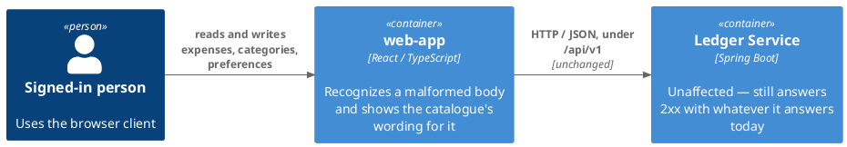
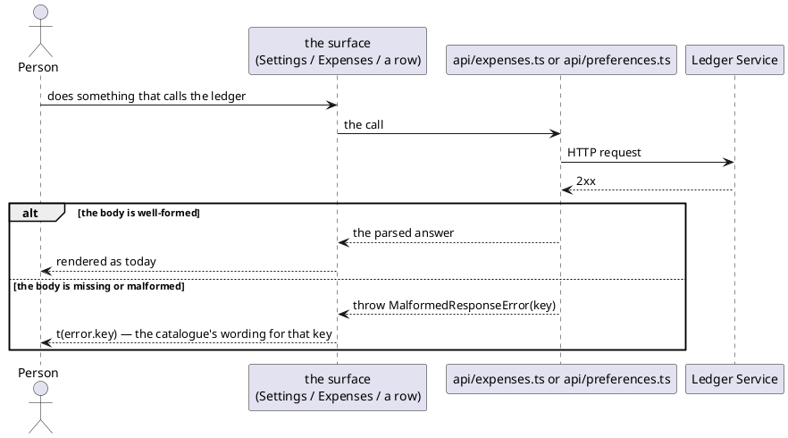

# Design: Malformed Response Errors Carry a Catalogue Key

**Affected Modules:** `web-app`

## Objective

A malformed 2xx response body — one `acceptExpenses`, `changeCategory`, `readPreferences` or `replacePreferences`
cannot make sense of — throws a hardcoded English `Error` today, in `api/expenses.ts` and `api/preferences.ts`.
`SettingsPage`/`ExpensesPage` catch it and show its `.message` verbatim, so an untranslatable literal can reach
the screen the same way a ledger refusal's raw message did before task 44. This gives it the same treatment: a
catalogue-owned string, without pulling `i18n` into `api/`, which the module's layering rule forbids.

## Context

| What exists                                                    | Where                                                          | What this change does with it                                                              |
|-------------------------------------------------------------------|-------------------------------------------------------------------|--------------------------------------------------------------------------------------------|
| `ApiError`, a typed error carrying more than a message         | `web-app/src/api/client.ts`                                    | The pattern this follows: a small `Error` subclass beside it, carrying a `key` instead of a `status` |
| The four throw sites                                           | `web-app/src/api/expenses.ts:55,68`, `web-app/src/api/preferences.ts:12,25` | Each throws the new type instead of a plain `Error`                                        |
| `SettingsPage.report` / `ExpensesPage.report` and `onChangeCategory` | `web-app/src/pages/SettingsPage.tsx`, `web-app/src/pages/ExpensesPage.tsx` | Each gains one branch, before the existing `instanceof ApiError` / fallback-to-`.message` ones |
| `api/`'s dependency rule                                        | `web-app/docs/conventions/architecture.md`                     | Stays true, unedited — `api/` gains no import of `i18n/` or `i18next`                       |
| The English catalogue's namespace convention                    | `web-app/src/i18n/en.ts`                                        | Gains one key in `settings`, two in `listing` — namespaced by the surface that reads each, as the catalogue's own convention requires |
| The task this mirrors                                           | `docs/implemented/44-the-browser-owns-its-refusal-wording`     | Same shape of fix — a fixed string in place of raw text — for a different source of raw text |

## Proposed Solution

`api/client.ts` gains `MalformedResponseError`, an `Error` subclass carrying a `key` narrowed to the three cases
below — the same shape `ApiError` already carries a `status` in. `expenses.ts` and `preferences.ts` throw it
instead of a plain `Error`, keeping today's English text as its `.message` (diagnostic only, never shown — the
pages that catch it read `.key`, not `.message`, once they recognize the type).

`SettingsPage.report` and `ExpensesPage.report`/`onChangeCategory` each gain one branch: a caught
`MalformedResponseError` is shown as `t(error.key)`. Every other branch is unchanged — an `ApiError` still shows
its surface's fixed refusal string, and any other `Error` (a network failure, chiefly) still shows its own
`.message`.

### Diagrams

One module; nothing crosses that did not already. `ledger-service` is unaffected — this is a client-side reading
of an unchanged response.

### Details

| Call site                       | Throws with key             | Shown                                              |
|-----------------------------------|------------------------------|-----------------------------------------------------|
| `acceptExpenses`                 | `listing.acceptanceMalformed`   | `ExpensesPage`'s page-level banner                  |
| `changeCategory`                 | `listing.categoryChangeMalformed` | beside the row whose category was being changed   |
| `readPreferences`                | `settings.preferencesMalformed`  | `SettingsPage`'s page-level banner                  |
| `replacePreferences`             | `settings.preferencesMalformed`  | beside `SettingsPage`'s save control                |

`MalformedResponseError`'s `key` is one of exactly those three strings, typed as a union — not a general
`string` — so a typo fails `npm run typecheck` rather than `t()` falling back silently at runtime.

## Acceptance Scenarios

- **A1:** the acceptance answers a malformed body
  - Given: `acceptExpenses` receives a 2xx with no usable body
  - When: the call resolves
  - Then: `ExpensesPage`'s banner shows the catalogue's `listing.acceptanceMalformed` wording

- **A2:** a category change answers a malformed body
  - Given: `changeCategory` receives a 2xx with no usable body
  - When: the call resolves
  - Then: that row shows the catalogue's `listing.categoryChangeMalformed` wording, and the row's own category stands

- **A3:** the preferences read answers a malformed body
  - Given: `readPreferences` receives a 2xx with no usable body
  - When: the call resolves
  - Then: `SettingsPage`'s banner shows the catalogue's `settings.preferencesMalformed` wording, and no picker is rendered

- **A4:** the preferences write answers a malformed body
  - Given: `replacePreferences` receives a 2xx with no usable body
  - When: the call resolves
  - Then: the catalogue's `settings.preferencesMalformed` wording is shown beside the save control

- **A5:** any other failure is unaffected
  - Given: any of the four calls is refused by the ledger (an `ApiError`), or fails before a response comes back
    (a plain `Error`)
  - When: the call rejects
  - Then: the existing behaviour stands exactly as it does today — a surface's fixed refusal string for an
    `ApiError`, that error's own message for anything else

## Decisions

- **D1:** Does `api/` gain a dependency on `i18n/` to show catalogue text for a malformed body, or does the
  lookup happen where the catalogue is already read?
  - Answer: `api/` stays fully decoupled from `i18n/` — it throws a typed error carrying a `key`, and the page
    that already imports the catalogue does the lookup. `api/`'s dependency rule
    (`web-app/docs/conventions/architecture.md`) is unedited.
  - Basis: decided — the user chose this over the alternative (letting `api/` import the catalogue directly, one
    narrow exception to its dependency rule), since it keeps that rule intact rather than carving an exception
    into it (2026-08-25).

- **D2:** What does each of the three new strings say?
  - Answer: One shared, generic sentence, reused for all three keys: "Something went wrong. Please try again." —
    no mention of what specifically failed to read, since that detail means nothing to the person reading it.
  - Basis: decided — every existing failure string in the catalogue shares one register: capitalized, second
    person, ending "Please try again." (`signIn.refused`, `settings.refused`, `listing.refused`,
    `listing.categoryChangeRefused`). The user chose a generic technical-failure sentence over one naming what
    didn't come back, since "could not be read" explains nothing a person can act on (2026-08-25).

## Design Findings

Grilled (2026-08-25): empty & extreme data, default state, layout stability, control consistency, colour,
motion, third-party embeds, library cost, locale, reachability, and the catalogue's own namespace convention.

| #  | Question | Answer | Evidence |
|----|----------|--------|----------|
| F1 | Does each new key live in a new `api` namespace, or in the surface namespace that reads it? | The surface namespace — `settings.preferencesMalformed`, `listing.acceptanceMalformed`, `listing.categoryChangeMalformed` — matching `settings.refused`/`listing.refused`/`listing.categoryChangeRefused`'s existing shape | `web-app/src/i18n/en.ts:1-2` (the catalogue's own "namespaced by the surface that reads it" comment) |
