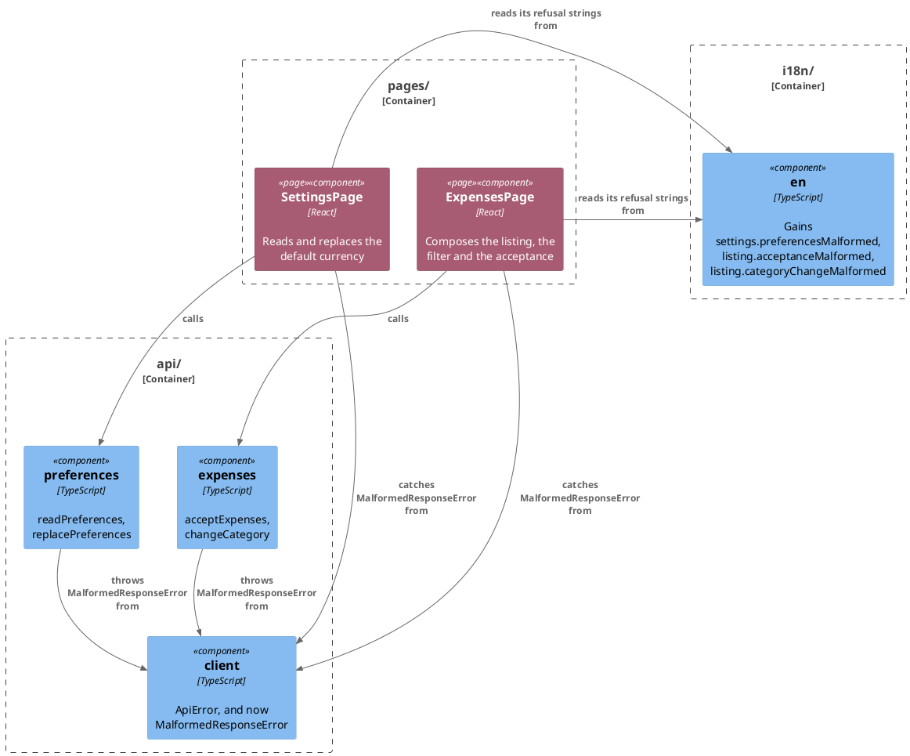

# Plan: Malformed Response Errors Carry a Catalogue Key — `web-app`

**Affected Modules:** `web-app`
**Design:** [Malformed Response Errors Carry a Catalogue Key](design.md)

## Components

`MalformedResponseError` is new, beside the existing `ApiError`. Every other box is changed in place — a throw
site swapped, a catch branch added.

`client` stays in `api/`; adding `MalformedResponseError` there does not cross the module's dependency rule —
only `pages/` gains a new read of the catalogue, which it already had.

| `MalformedResponseError` | Type                                                                                                    |
|---------------------------|------------------------------------------------------------------------------------------------------------|
| `key`                     | `'settings.preferencesMalformed' \| 'listing.acceptanceMalformed' \| 'listing.categoryChangeMalformed'`     |

## Step-by-Step Implementation Map (To-Do List)

### Stabilization

#### Interface-First / Build Stabilization

**Interface & Signature Sync**

- [x] ST01 · Stub `MalformedResponseError` in `client.ts`, beside `ApiError`: `extends Error`, a constructor
  taking `key` (the union in the Components table) and `message`, storing both and exporting the class — with an
  intent comment. `GU01` fills in nothing further; the stub is effectively the whole class.
- [x] ST02 · Add `preferencesMalformed` to `en.ts`'s `settings` namespace, and `acceptanceMalformed` and
  `categoryChangeMalformed` to its `listing` namespace — all three holding the same string, `'Something went
  wrong. Please try again.'`, per the design's D2. `i18next.d.ts`'s key union derives from `en.ts`'s own shape, so
  nothing else needs editing for the new keys to type-check.

#### Closing item

- [x] ST03 · Confirm the module compiles and the pre-existing suite stands where the baseline left it:
  `npm --prefix web-app run typecheck`, then `tools/agent-test/agent-test.sh --module web-app`. This module has no
  architecture-enforcement test; `src/conventions.test.ts` is the nearest thing and asserts nothing this group
  touches.

### Red Phase

#### TDD Unit Red Phase

- [x] RU01 · `client` · test: `client.test.ts` · covers: `MalformedResponseError` constructor · scenarios: A1, A2, A3, A4
    - the new class:
        - given: a `MalformedResponseError` constructed with a key and a message
          when: it is inspected
          then: it is an instance of `Error`, and its `key` and `message` read back what it was given

- [x] RU02 · `expenses` · test: `expenses.test.ts` · covers: `acceptExpenses()`, `changeCategory()` · scenarios: A1, A2
    - `acceptExpenses()`:
        - given: a stubbed fetch answering 204 with no body
          when: `acceptExpenses()` is called
          then: it rejects with a `MalformedResponseError` carrying `key: 'listing.acceptanceMalformed'`
    - `changeCategory()`:
        - given: a stubbed fetch answering 204 with no body
          when: `changeCategory()` is called
          then: it rejects with a `MalformedResponseError` carrying `key: 'listing.categoryChangeMalformed'`

- [x] RU03 · `preferences` · test: `preferences.test.ts` · covers: `readPreferences()`, `replacePreferences()` · scenarios: A3, A4
    - `readPreferences()`:
        - given: a stubbed fetch answering 204 with no body
          when: `readPreferences()` is called
          then: it rejects with a `MalformedResponseError` carrying `key: 'settings.preferencesMalformed'`
    - `replacePreferences()`:
        - given: a stubbed fetch answering 204 with no body
          when: `replacePreferences()` is called
          then: it rejects with a `MalformedResponseError` carrying `key: 'settings.preferencesMalformed'`

- [x] RU04 · `SettingsPage` · test: `SettingsPage.test.tsx` · covers: the rendered page · scenarios: A3, A4
    - a malformed body:
        - given: `readPreferences` rejects with a `MalformedResponseError` carrying `key: 'settings.preferencesMalformed'`
          when: the page is rendered
          then: `en.settings.preferencesMalformed` is shown at the top of the page, and no picker is rendered
        - given: the page is on screen with a currency picked, and `replacePreferences` rejects with a
          `MalformedResponseError` carrying `key: 'settings.preferencesMalformed'`
          when: the save control is used
          then: `en.settings.preferencesMalformed` is shown beside the save control, and the picker stands on what
          was picked

- [x] RU05 · `ExpensesPage` · test: `ExpensesPage.test.tsx` · covers: the rendered page · scenarios: A1, A2
    - a malformed body:
        - given: the listing holds a PENDING entry, ticked, and `acceptExpenses` rejects with a
          `MalformedResponseError` carrying `key: 'listing.acceptanceMalformed'`
          when: the accept control is used
          then: `en.listing.acceptanceMalformed` is shown as the page's own banner
        - given: `changeCategory` rejects with a `MalformedResponseError` carrying `key: 'listing.categoryChangeMalformed'`
          when: a row's category is changed
          then: `en.listing.categoryChangeMalformed` is shown beside that row, and the row's own category stands
          unchanged

A5 needs no new scenario: an `ApiError` still showing its surface's fixed refusal string, and any other `Error`
still showing its own message, are already held by the existing regression tests in `SettingsPage.test.tsx` and
`ExpensesPage.test.tsx`.

### Green Phase

#### TDD Unit Green Phase

- [ ] GU01 · `client` · test: `client.test.ts`
- [ ] GU02 · `expenses` · test: `expenses.test.ts` · after: GU01
- [ ] GU03 · `preferences` · test: `preferences.test.ts` · after: GU01
- [ ] GU04 · `SettingsPage` · test: `SettingsPage.test.tsx` · after: GU01
- [ ] GU05 · `ExpensesPage` · test: `ExpensesPage.test.tsx` · after: GU01

`SettingsPage.report` and `ExpensesPage.report`/`onChangeCategory` each gain one branch, checked before the
existing `instanceof ApiError` one: a caught `MalformedResponseError` shows `t(error.key)`. Every other branch —
`ApiError`, and any other `Error` (a network failure) — is unchanged.

## Open Questions / Blockers

- **Q1:** The design's D1 keeps `api/` decoupled from `i18n/` — a typed error carries a key, the page that
  already reads the catalogue does the lookup — over the alternative of letting `api/` import the catalogue
  directly. Record it as an ADR?
  - A: No ADR. The design's D1 carries the reasoning, and the task directory is archived rather than deleted.
    This plan has no Post-Implementation Steps group.

## Review Findings

- **F1:** No stabilization item created `MalformedResponseError`, so every Red Phase step's import failed to compile.
  - Resolution: decision
  - Action: resolved — added `ST01`, stubbing the class per `templates/stabilization-group.md`'s rule for a new
    type; renumbered the catalogue-keys item to `ST02` and the closing item to `ST03`.

- **F2:** `RU05`'s first scenario named `listExpenses` and "the page is rendered," but `listExpenses` has no
  throw site and `acceptExpenses` is reached only from the accept control.
  - Resolution: mechanical
  - Action: applied — rewrote it around `acceptExpenses` and the accept control, per design A1.

- **F3:** `RU02`/`RU03`'s "200 with no body" given reaches `response.json()`'s parse failure, never the
  malformed-body branch, which only `request()`'s 204 case triggers.
  - Resolution: mechanical
  - Action: applied — changed all four givens to a 204 response.

- **F4:** A5 was named by no step, though already covered by existing regression tests.
  - Resolution: mechanical
  - Action: applied — added a line under Red Phase naming the existing tests that hold it.

- **F5:** `GU04 · after: GU03` and `GU05 · after: GU02` were false dependencies — both page tests mock `api/`, so
  neither's green step depends on the other's.
  - Resolution: mechanical
  - Action: applied — both now read `after: GU01` only.

- **F6:** The Components diagram omitted the `pages/ → client` edges the new `instanceof MalformedResponseError`
  branch adds.
  - Resolution: mechanical
  - Action: applied — added both `Rel_D` lines.

- **F7:** The design's Context table inverted the catalogue's key counts.
  - Resolution: mechanical
  - Action: applied — corrected in `design.md`.

- **F8:** `RU01`'s `scenarios: A1-A4` line overclaims — its own test proves only the class's shape, not any
  page's display behaviour.
  - Resolution: decision
  - Action: kept `RU01` as the cheaper option; `RU02`-`RU05` independently and fully prove A1-A4's display
    behaviour, so the shared citation stands without implying `RU01` proves them alone.

- **F9:** The Components table was not padded to its widest cell.
  - Resolution: mechanical
  - Action: applied — re-emitted, aligned.
