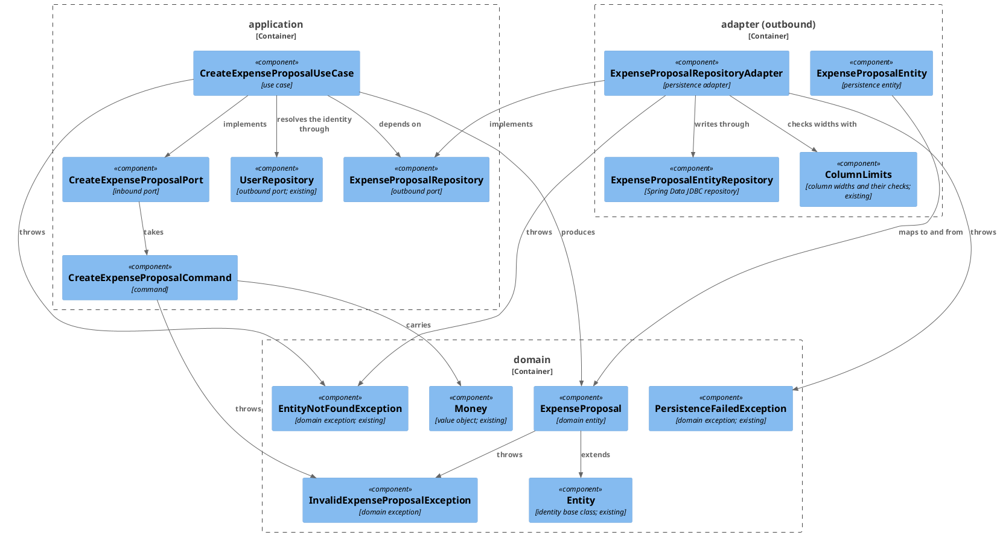
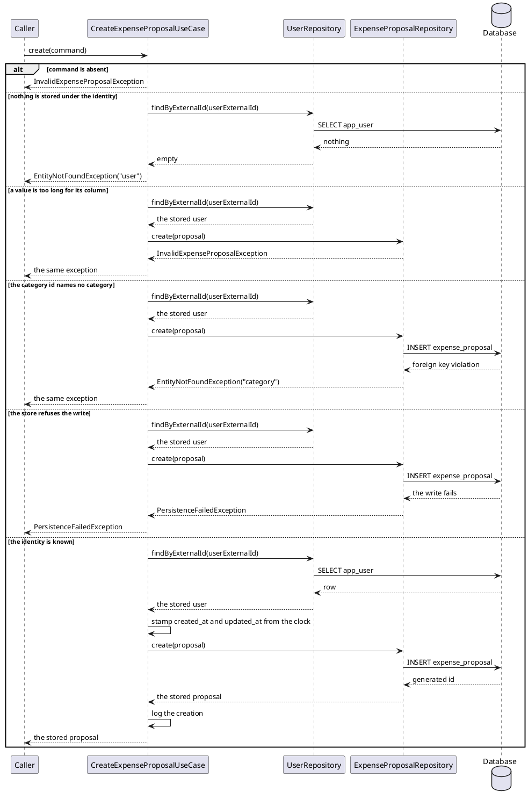

# Plan: Create an Expense Proposal

**Affected Modules:** `ledger-service`

## Objective

Give the service a use case that records one **expense proposal** against an existing user and stores it — a
spending record that has been assembled but not yet accepted into the ledger. The caller supplies the identity the
user is known by, the category, what was spent, what it was for, and optionally where; the use case resolves the
user, stamps the row's timestamps, and stores it.

The proposal row carries exactly the columns the `expense` row carries; only the table name differs. Nothing drives
the use case yet — this plan adds the inbound port and its implementation, not a caller, the same shape
[Create an expense](implemented/5-plan-create-expense.md) ended in.

## Proposed Solution

### The row

`expense_proposal` mirrors `expense` column for column:

| Column               | Type           | From                                                              |
|----------------------|----------------|-------------------------------------------------------------------|
| `id`                 | `BIGSERIAL`    | generated                                                         |
| `user_id`            | `BIGINT`       | the user the external identity resolves to                        |
| `category_id`        | `BIGINT`       | `CreateExpenseProposalCommand.categoryId`                         |
| `description`        | `VARCHAR(500)` | `CreateExpenseProposalCommand.description`                        |
| `merchant`           | `VARCHAR(255)` | `CreateExpenseProposalCommand.merchant`, nullable, blank → absent |
| `amount_minor_units` | `BIGINT`       | `Money.minorUnits`                                                |
| `currency_code`      | `VARCHAR(3)`   | `Money.currencyCode`                                              |
| `created_at`         | `TIMESTAMPTZ`  | stamped by the use case                                           |
| `updated_at`         | `TIMESTAMPTZ`  | stamped by the use case, equal to `created_at` at creation        |

Foreign keys carry the same clauses `expense` carries: `user_id` cascades on delete, `category_id` carries no
`ON DELETE` clause, so a category cannot be removed while proposals reference it.

Migration `src/main/resources/db/migration/V003__create_expense_proposal.sql`:

```sql
CREATE TABLE expense_proposal
(
    id                 BIGSERIAL PRIMARY KEY,
    user_id            BIGINT       NOT NULL REFERENCES app_user (id) ON DELETE CASCADE,
    category_id        BIGINT       NOT NULL REFERENCES category (id),
    description        VARCHAR(500) NOT NULL,
    merchant           VARCHAR(255),
    amount_minor_units BIGINT       NOT NULL CHECK (amount_minor_units >= 0),
    currency_code      VARCHAR(3)   NOT NULL,
    created_at         TIMESTAMPTZ  NOT NULL,
    updated_at         TIMESTAMPTZ  NOT NULL
);

CREATE INDEX idx_expense_proposal_user_created_at ON expense_proposal (user_id, created_at DESC);
```

### Domain

`domain/model/ExpenseProposal` — an entity extending `Entity`, carrying the owning user's database id, the
category's database id, the description, an optional merchant, the `Money`, and the two timestamps. Built through
`newExpenseProposal(long userId, long categoryId, String description, Optional<String> merchant, Money money,
Instant now)` — which stamps both timestamps from `now` — or `stored(...)` taking every field including the
database id. It validates itself in its private constructor, throwing `InvalidExpenseProposalException`, the way
`Expense` does. Identity comes from `Entity` and is asserted once in `EntityTest`, not per subclass.

`domain/exception/InvalidExpenseProposalException` — one exception type per error case, so a caller distinguishes a
rejected proposal from a rejected expense.

### Application

`application/dto/CreateExpenseProposalCommand` — the inbound-port command, a record
`(String userExternalId, long categoryId, String description, Optional<String> merchant, Money money)` validating
itself: a blank external id throws `InvalidUserException`; a non-positive category id, a blank description, or an
absent `merchant`/`money` throws `InvalidExpenseProposalException`. A present-but-blank merchant normalizes to
`Optional.empty()`.

`application/port/CreateExpenseProposalPort` — `ExpenseProposal create(CreateExpenseProposalCommand command)`.

`application/port/ExpenseProposalRepository` — `ExpenseProposal create(ExpenseProposal proposal)`.

`application/usecase/CreateExpenseProposalUseCase` — resolves the external identity through the existing
`UserRepository`, throws `EntityNotFoundException("user", …)` when nothing is stored under it, builds the
`ExpenseProposal` with the clock's instant, stores it, and logs the creation.

`adapter/config/UseCaseConfiguration` gains the `CreateExpenseProposalPort` bean, passing `Clock.systemUTC()`
constructed inside the bean method — no `Clock` bean, as settled by plan 5's **F4**.

### Persistence

`adapter/persistence/ExpenseProposalEntity` — `record ExpenseProposalEntity(@Id Long id, Long userId, Long
categoryId, String description, String merchant, long amountMinorUnits, String currencyCode, Instant createdAt,
Instant updatedAt)` annotated `@Table("expense_proposal")`, with `toDomain()` and
`static fromDomain(ExpenseProposal)`.

`adapter/persistence/ExpenseProposalEntityRepository extends CrudRepository<ExpenseProposalEntity, Long>`.

`adapter/persistence/ExpenseProposalRepositoryAdapter` — a `@Component` implementing `ExpenseProposalRepository`.
It checks the column widths through `ColumnLimits` before writing, truncates both timestamps to microseconds so
the round trip is exact, and classifies a foreign-key violation on `expense_proposal_category_id_fkey` /
`expense_proposal_user_id_fkey` into `EntityNotFoundException`, everything else into
`PersistenceFailedException` — the same three concerns `ExpenseRepositoryAdapter` handles for `expense`.

`ColumnLimits` needs no new constants: `expense_proposal`'s text columns are the same widths as `expense`'s, and
`DESCRIPTION`, `MERCHANT` and `CURRENCY_CODE` already exist. It gains
`static void validateExpenseProposalText(String description, String merchant)`, identical in shape to
`validateExpenseText` but throwing `InvalidExpenseProposalException`.

**For the refactor phase:** the SQLState-and-constraint-name parsing (`FOREIGN_KEY_VIOLATION`,
`CONSTRAINT_NAME_PATTERN`, `foreignKeyConstraintName`, `constraintNameFromMessage`) and the microsecond truncation
will exist in two adapter classes once this plan is green, crossing the "extract only when logic repeats in 2+
classes" threshold in [Code Style](../ledger-service/docs/conventions/code-style.md#refactoring-conventions).
Deduplicating them is refactor-phase work over the finished diff, not a step here — the green steps write what
their tests need, and no step agent may edit another step's target class.

Files touched: `V003__create_expense_proposal.sql`, `InvalidExpenseProposalException`, `ExpenseProposal`,
`CreateExpenseProposalCommand`, `CreateExpenseProposalPort`, `ExpenseProposalRepository`,
`CreateExpenseProposalUseCase`, `ExpenseProposalEntity`, `ExpenseProposalEntityRepository`,
`ExpenseProposalRepositoryAdapter`, `ColumnLimits`, `UseCaseConfiguration`, `ExpenseProposalRowUtils`,
`ExpenseProposalTest`, `CreateExpenseProposalCommandTest`, `CreateExpenseProposalUseCaseTest`,
`ExpenseProposalRepositoryAdapterTest`, `ColumnLimitsSchemaTest`, and
`ledger-service/docs/conventions/testing.md` for the new shared test helper.

#### Diagrams

There is no inbound-adapter boundary below: nothing drives `CreateExpenseProposalPort` yet, which is also why this
plan has no system-test phase.





## Step-by-Step Implementation Map (To-Do List)

### Stabilization

#### Database

- [x] ST01 · Add migration `src/main/resources/db/migration/V003__create_expense_proposal.sql` with the table and
  index given under **The row**, verbatim

#### Interface-First / Build Stabilization

**Interface & Signature Sync**

- [x] ST02 · Add `domain/exception/InvalidExpenseProposalException`, unchecked, shaped like the existing
  `InvalidExpenseException`
- [x] ST03 · Add `domain/model/ExpenseProposal` — a final class extending `Entity`, holding `long userId`,
  `long categoryId`, `String description`, `String merchant` (nullable), `Money money`, `Instant createdAt`,
  `Instant updatedAt`, with `newExpenseProposal(long userId, long categoryId, String description,
  Optional<String> merchant, Money money, Instant now)`, `stored(long id, long userId, long categoryId,
  String description, Optional<String> merchant, Money money, Instant createdAt, Instant updatedAt)`, and the
  accessors `long userId()`, `long categoryId()`, `String description()`, `Optional<String> merchant()`,
  `Money money()`, `Instant createdAt()`, `Instant updatedAt()` — `id()` comes from `Entity`. Both factories
  delegate to a private constructor with a stub validation block:
  ```java
  private ExpenseProposal(...) {
      super(id);
      // rejects an absent or blank description, an absent merchant Optional, an absent money, a
      // non-positive user id, a non-positive category id, and an absent created_at or updated_at,
      // each with InvalidExpenseProposalException
  }
  ```
  No `equals`/`hashCode`: `Entity` declares both `final`
- [x] ST04 · Add `application/dto/CreateExpenseProposalCommand` as
  `record CreateExpenseProposalCommand(String userExternalId, long categoryId, String description,
  Optional<String> merchant, Money money)` with a stub compact constructor:
  ```java
  public CreateExpenseProposalCommand {
      // rejects an absent or blank external id with InvalidUserException; rejects a category id
      // that is not positive, an absent or blank description, an absent merchant Optional, and an
      // absent money with InvalidExpenseProposalException;
      // normalizes a present-but-blank merchant to Optional.empty()
  }
  ```
- [x] ST05 · Add `application/port/CreateExpenseProposalPort` with
  `ExpenseProposal create(CreateExpenseProposalCommand command)`, documenting the runtime exceptions it throws as
  `@throws` javadoc — `InvalidExpenseProposalException`, `EntityNotFoundException`, `PersistenceFailedException`
- [x] ST06 · Add `application/port/ExpenseProposalRepository` with
  `ExpenseProposal create(ExpenseProposal proposal)` and the same `@throws` javadoc —
  `InvalidExpenseProposalException` for a column-width violation, `EntityNotFoundException` for a user id or
  category id naming no stored row, `PersistenceFailedException` for a failed write
- [x] ST07 · Add `application/usecase/CreateExpenseProposalUseCase` implementing `CreateExpenseProposalPort`,
  taking `UserRepository`, `ExpenseProposalRepository`, `Clock` and `LoggerFactory` on its constructor, with a
  stubbed `create()`:
  ```java
  public ExpenseProposal create(CreateExpenseProposalCommand command) {
      // rejects an absent command with InvalidExpenseProposalException; resolves the external id
      // through UserRepository and throws EntityNotFoundException("user", ...) when nothing is
      // stored under it; builds the ExpenseProposal against the resolved user's database id and the
      // command's category id, with Instant.now(clock); stores it, logs the creation at info level,
      // and returns what was stored
      return null;
  }
  ```
- [x] ST08 · Add `adapter/persistence/ExpenseProposalEntity` as
  `record ExpenseProposalEntity(@Id Long id, Long userId, Long categoryId, String description, String merchant,
  long amountMinorUnits, String currencyCode, Instant createdAt, Instant updatedAt)` annotated
  `@Table("expense_proposal")` — **written complete**, including `toDomain()` and
  `static fromDomain(ExpenseProposal proposal)`, shaped like the existing `ExpenseEntity`. All components stay on
  the canonical constructor so `JdbcAggregateTemplate` can read rows back in RI01
- [x] ST09 · Add `adapter/persistence/ExpenseProposalEntityRepository extends
  CrudRepository<ExpenseProposalEntity, Long>`, with no methods of its own
- [x] ST10 · Extend `adapter/persistence/ColumnLimits` with
  `static void validateExpenseProposalText(String description, String merchant)` — **written complete, not
  stubbed**, like the existing `validateExpenseText`: it rejects a description over `DESCRIPTION` characters and a
  merchant over `MERCHANT` characters with `InvalidExpenseProposalException`, and lets an absent merchant through.
  No later step owns this method — GI01's agent may touch only `ExpenseProposalRepositoryAdapter` — so RI01's
  over-length scenarios go green on what this step writes. No new constants: `expense_proposal`'s text columns are
  the same widths as `expense`'s
- [x] ST11 · Add `adapter/persistence/ExpenseProposalRepositoryAdapter` as a `@Component` implementing
  `ExpenseProposalRepository`, taking `ExpenseProposalEntityRepository` on its constructor, with a stubbed method
  carrying `@Transactional`, as `ExpenseRepositoryAdapter.create` does:
  ```java
  @Override
  @Transactional
  public ExpenseProposal create(ExpenseProposal proposal) {
      // checks the column widths through ColumnLimits before writing anything; saves the entity
      // mapped from the domain with both timestamps truncated to microseconds; translates a foreign
      // key violation on expense_proposal_category_id_fkey or expense_proposal_user_id_fkey into
      // EntityNotFoundException and every other runtime exception into PersistenceFailedException;
      // returns the proposal carrying its generated id
      return null;
  }
  ```

**Configuration**

- [x] ST12 · Add the `CreateExpenseProposalPort` bean method to `adapter/config/UseCaseConfiguration`, wired from
  `UserRepository`, `ExpenseProposalRepository` and `LoggerFactory`, and passing `Clock.systemUTC()` constructed
  inside the method, beside the existing `createExpensePort` bean

**Shared Test Infrastructure**

- [x] ST13 · Add `bot.finance.common.ExpenseProposalRowUtils` with
  `static List<ExpenseProposalEntity> expenseProposalRowsFor(JdbcAggregateTemplate jdbcAggregateTemplate,
  long userId)`, shaped like the existing `ExpenseRowUtils`, and list it in the package-structure tree in
  `ledger-service/docs/conventions/testing.md`

**Close-out**

- [x] ST14 · Compile the module and confirm `bot.finance.architecture.CleanArchitectureTest` still passes ·
  after: ST01, ST02, ST03, ST04, ST05, ST06, ST07, ST08, ST09, ST10, ST11, ST12, ST13

### Red Phase

#### TDD Unit Red Phase

- [x] RU01 · `ExpenseProposal` · test: `ExpenseProposalTest` · covers: `newExpenseProposal()`, `stored()`
    - `newExpenseProposal()`:
        - given: a user id, a category id, a description, a merchant, a money and an instant
          when: newExpenseProposal() is called
          then: returns a proposal carrying all of them, with no database id, and with both timestamps equal to
          that instant
        - given: an absent merchant
          when: newExpenseProposal() is called
          then: returns a proposal whose merchant is empty
        - given: a description that is absent, empty, or only whitespace
          when: newExpenseProposal() is called
          then: throws InvalidExpenseProposalException
        - given: an absent merchant Optional
          when: newExpenseProposal() is called
          then: throws InvalidExpenseProposalException — absence is `Optional.empty()`, never null
        - given: an absent money
          when: newExpenseProposal() is called
          then: throws InvalidExpenseProposalException
        - given: a user id of zero or negative
          when: newExpenseProposal() is called
          then: throws InvalidExpenseProposalException
        - given: a category id of zero or negative
          when: newExpenseProposal() is called
          then: throws InvalidExpenseProposalException
        - given: an absent instant
          when: newExpenseProposal() is called
          then: throws InvalidExpenseProposalException
    - `stored()`:
        - given: a database id and every other field, with a created_at earlier than its updated_at
          when: stored() is called
          then: returns a proposal carrying all of them, each timestamp unchanged
        - given: a database id, a blank description, and every other field valid
          when: stored() is called
          then: throws InvalidExpenseProposalException
        - given: a database id and an absent created_at or an absent updated_at
          when: stored() is called
          then: throws InvalidExpenseProposalException
    - Identity (`equals`/`hashCode`, `id()`) is a rule of `Entity` and is asserted once in `EntityTest`; this step
      adds no identity scenarios
- [x] RU02 · `CreateExpenseProposalCommand` · test: `CreateExpenseProposalCommandTest` · covers:
  `CreateExpenseProposalCommand()`
    - `CreateExpenseProposalCommand()`:
        - given: a user external id that is absent, empty, or only whitespace
          when: the record is constructed
          then: throws InvalidUserException
        - given: a category id of zero or negative
          when: the record is constructed
          then: throws InvalidExpenseProposalException
        - given: a description that is absent, empty, or only whitespace
          when: the record is constructed
          then: throws InvalidExpenseProposalException
        - given: an absent merchant Optional
          when: the record is constructed
          then: throws InvalidExpenseProposalException
        - given: a merchant that is present but empty or only whitespace
          when: the record is constructed
          then: the record's merchant is `Optional.empty()`
        - given: an absent money
          when: the record is constructed
          then: throws InvalidExpenseProposalException
        - given: every field present, the merchant a non-blank name
          when: the record is constructed
          then: the record carries them unchanged
- [x] RU03 · `CreateExpenseProposalUseCase` · test: `CreateExpenseProposalUseCaseTest` · covers: `create()`
    - `create()`:
        - given: a user stored under the command's external id and a clock fixed at a known instant
          when: create() is called
          then: the proposal repository is asked to store a proposal carrying that user's database id and the
          command's category id, description, merchant and money, with both timestamps equal to the clock's
          instant; the stored proposal is returned
        - given: nothing stored under the command's external id
          when: create() is called
          then: throws EntityNotFoundException whose entityType() is "user", and the proposal repository is
          untouched
        - given: an absent command
          when: create() is called
          then: throws InvalidExpenseProposalException and neither repository is touched
        - given: a stored user, and a proposal repository that raises PersistenceFailedException
          when: create() is called
          then: the exception reaches the caller unchanged and is not swallowed or retried
        - given: a user repository that raises PersistenceFailedException while resolving the identity
          when: create() is called
          then: the exception reaches the caller unchanged and the proposal repository is untouched

#### TDD Integration Red Phase

- [x] RI01 · `ExpenseProposalRepositoryAdapter` · test: `ExpenseProposalRepositoryAdapterTest` · covers:
  `create()`
    - `create()`:
        - given: a stored user, a stored category, and an unstored proposal carrying a merchant
          when: create() is called
          then: one proposal row exists for that user carrying the category id, description, merchant, minor units
          and currency code given, and the returned proposal carries its generated database id
        - given: a stored user, a stored category, and an unstored proposal with no merchant
          when: create() is called
          then: the row's merchant column is null and the returned proposal's merchant is empty
        - given: a stored user, a stored category, and an unstored proposal stamped with an instant carrying
          nanosecond precision
          when: create() is called and the row is read back
          then: both timestamps equal that instant truncated to microseconds — what `TIMESTAMPTZ` stores
        - given: a stored user, a stored category, and a proposal whose description is exactly 500 characters
          when: create() is called
          then: the row is written and carries the whole description
        - given: a stored user, a stored category, and a proposal whose description is 501 characters
          when: create() is called
          then: throws InvalidExpenseProposalException before anything is written, so no proposal row exists
          afterwards
        - given: a stored user, a stored category, and a proposal whose merchant is exactly 255 characters
          when: create() is called
          then: the row is written and carries the whole merchant
        - given: a stored user, a stored category, and a proposal whose merchant is 256 characters
          when: create() is called
          then: throws InvalidExpenseProposalException before anything is written, so no proposal row exists
          afterwards
        - given: a stored user and a proposal whose category id is positive and names no stored category
          when: create() is called
          then: throws EntityNotFoundException whose entityType() is "category", not PersistenceFailedException
        - given: a stored category and a proposal whose user id is positive and names no stored user
          when: create() is called
          then: throws EntityNotFoundException whose entityType() is "user"
        - given: two proposals for two different stored users, each with its own stored category
          when: create() is called for each
          then: each user owns exactly its own row, and neither references the other's
        - given: an adapter over a mocked `ExpenseProposalEntityRepository` whose `save` raises a non-constraint
          database failure
          when: create() is called
          then: throws PersistenceFailedException, not EntityNotFoundException, carrying the framework exception as
          its cause, so no framework type crosses the port
        - given: an adapter over a mocked `ExpenseProposalEntityRepository` whose `save` raises a foreign-key
          violation naming neither of `expense_proposal`'s own foreign keys
          when: create() is called
          then: throws PersistenceFailedException carrying the framework exception as its cause
- [x] RI02 · `ColumnLimits` · test: `ColumnLimitsSchemaTest` · covers: `DESCRIPTION`, `MERCHANT`, `CURRENCY_CODE`
    - `DESCRIPTION`:
        - given: the migrated schema in the containerized database
          when: `expense_proposal.description`'s `character_maximum_length` is read from
          `information_schema.columns`
          then: it equals the constant
    - `MERCHANT`:
        - given: the migrated schema in the containerized database
          when: `expense_proposal.merchant`'s `character_maximum_length` is read
          then: it equals the constant
    - `CURRENCY_CODE`:
        - given: the migrated schema in the containerized database
          when: `expense_proposal.currency_code`'s `character_maximum_length` is read
          then: it equals the constant
    - The existing `ExternalId`, `CategoryName`, `Description`, `Merchant` and `CurrencyCode` nested classes are
      untouched; this step adds three beside them against the same `COLUMN_WIDTH_QUERY`, named
      `ProposalDescription`, `ProposalMerchant` and `ProposalCurrencyCode` — the unprefixed names are taken by the
      `expense` columns, and two nested classes cannot share a simple name

### Green Phase

#### TDD Unit Green Phase

- [ ] GU01 · `ExpenseProposal` · test: `ExpenseProposalTest`
- [ ] GU02 · `CreateExpenseProposalCommand` · test: `CreateExpenseProposalCommandTest`
- [ ] GU03 · `CreateExpenseProposalUseCase` · test: `CreateExpenseProposalUseCaseTest` · after: GU01, GU02

#### TDD Integration Green Phase

- [ ] GI01 · `ExpenseProposalRepositoryAdapter` · test: `ExpenseProposalRepositoryAdapterTest` · after: GU01
- [ ] GI02 · `ColumnLimits` · test: `ColumnLimitsSchemaTest`

### Post-Implementation Steps

#### ADRs

- [ ] P01 · Write ADR: an expense proposal is a table and an entity of its own, not a status on `expense` — so
  short-lived proposals stay out of the ledger's own table, and the proposal row can carry metadata of its own
  (a rejection reason) that an expense has no use for (**Q5**)

## Open Questions / Blockers

- **Q1:** The request says the expense-proposal table is the same as "the proposal table", but no `proposal` table
  exists in `src/main/resources/db/migration/` — the only comparable one is `expense`. This plan mirrors `expense`
  column for column, including both foreign keys and their `ON DELETE` clauses. Confirm that is what was meant.
- A: yes.

- **Q2:** A proposal is modelled as its own table and its own domain entity (`ExpenseProposal`), rather than as a
  status column on `expense`. The alternative — `expense.status` with `PROPOSED`/`ACCEPTED` — would need no new
  entity or adapter, but makes every existing read of `expense` a read that must filter. Confirm the separate
  table.
- A: yes.

- **Q3:** Nothing drives `CreateExpenseProposalPort`, so this plan has no system-test phase and the port is
  unreachable at runtime — the position plans 3 and 5 ended in. Confirm nothing should reach the port in this plan.
- A: yes.

- **Q4:** "Proposal" implies a later acceptance or rejection, but the table carries no status, no expiry and no
  link to the `expense` row it eventually becomes. Is accepting a proposal a separate use case in a later plan
  (this plan stores and nothing more), or does the row need a column now that a later plan would otherwise have to
  migrate in?
- A: yes.
  Read as the first branch: this plan stores and nothing more, and accepting or rejecting a proposal is a later
  plan that adds whatever columns it needs. Consistent with **Q1** and **Q2** — the row mirrors `expense` column
  for column — and with **Q5**, which puts a rejection reason in the future rather than in `V003`.

- **Q5:** ADR candidate — *an expense proposal is a table and an entity of its own, not a status on `expense`*.
  Record it as an ADR in `ledger-service/docs/adr/`? If not, the decision is carried only by the schema diagram in
  [`docs/contracts/out/database.md`](../ledger-service/docs/contracts/out/database.md) and the new use-case page,
  neither of which records the alternative that was rejected.
- A: It's an ADT. The reason is to keep short-lived proposals in a separate table, also it might store some metadata if
  we want to store the rejection reason in the future.
  Approved — **P01** writes it.

### Blockers recorded during implementation

- **B1** (2026-07-30, RED exit check): `tools/agent-test/agent-test.sh` reports neither
  `CreateExpenseProposalCommandTest` nor the pre-existing `HandleIncomingMessageCommandTest`. Both run and both
  produce results; their JUnit XML filename — `TEST-bot.finance.application.dto.<Class>$<NestedClass>.xml` — is long
  enough that inside a `build/agent-runs/<label>-<timestamp>-<pid>/test-results/` path it overflows the Windows path
  limit, so Gradle writes it as `__TES-<hash>…xml` and the wrapper's `TEST-*.xml` glob misses it. Consequence: the
  wrapper's totals and class list silently omit those classes, in the baseline as much as in any later run.
- Resolution: unrelated to this plan (reproduces on the pre-existing class, and on the baseline commit) — reported,
  not fixed. This run verified `CreateExpenseProposalCommandTest` by reading the run's `console.log` directly, which
  does carry every test. A fix belongs to `tools/agent-test/` — widen the glob, or shorten the run-directory name.

## Review Findings

- **F1:** RI02's three new nested classes reused the simple names `Description`, `Merchant` and `CurrencyCode`,
  which `ColumnLimitsSchemaTest` already uses for the `expense` columns — a compile error.
- Resolution: mechanical
- Action: applied — RI02 now names them `ProposalDescription`, `ProposalMerchant` and `ProposalCurrencyCode`.

- **F2:** ST11's stub omitted the `@Transactional` that `ExpenseRepositoryAdapter.create` carries.
- Resolution: mechanical
- Action: applied — ST11's stub now carries `@Override` and `@Transactional`.

- **F3:** ST08 writes `ExpenseProposalEntity` complete, including the `id == null` branch in `toDomain()` that
  `ExpenseEntity` carries (`ExpenseEntity.java:26-29`), and no step tests it. `testing.md`'s **Test Layers** maps
  pure mapper classes in an adapter package to the unit layer, and RI01 never reaches that branch — every row it
  reads back carries a generated id — so the branch ships uncovered. Either add an `RU`/`GU` pair for
  `ExpenseProposalEntity` covering `toDomain()` on a row with and without an id plus `fromDomain()`, or record that
  it follows `ExpenseEntity`'s untested precedent.
- Resolution: decision
- Action: resolved against the repository — `src/test/java/bot/finance/adapter/persistence/` holds no
  `*EntityTest` at all: `ExpenseEntity`, `CategoryEntity` and `UserEntity` are each covered only through their
  adapter's integration test. `ExpenseProposalEntity` follows that precedent, so no `RU`/`GU` pair is added. The
  uncovered `id == null` branch is a property of `ExpenseEntity` too and is a candidate for the refactor phase to
  remove rather than for this plan to test.

- **F4:** Two sequence-diagram branches reached `ExpenseProposalRepository.create` without the
  `UserRepository.findByExternalId` step the others show.
- Resolution: mechanical
- Action: applied — added the resolution messages to the unknown-category and failed-write branches.

- **F5:** **Files touched** listed no test class the Red Phase creates.
- Resolution: mechanical
- Action: applied — added the four new test classes.
