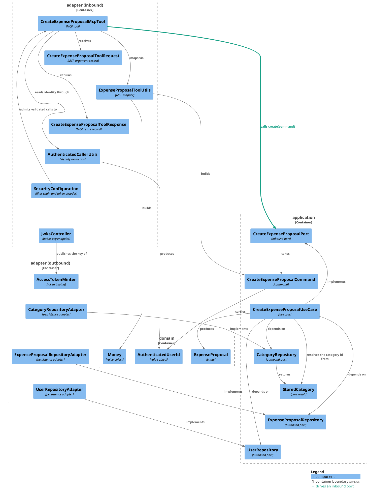
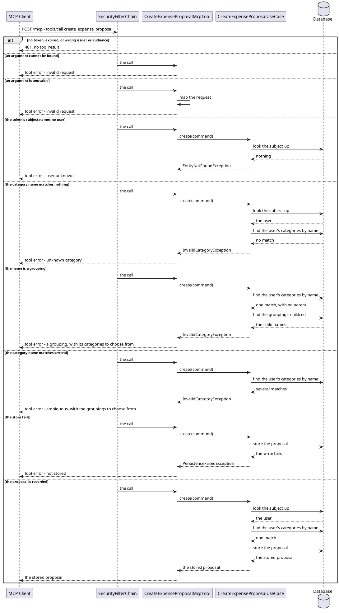

# Design: MCP Adapter with a Create Expense Proposal Tool

**Affected Modules:** `ledger-service`

## Objective

Let an agent acting for a user record spending in the ledger. The service gains an authenticated MCP server
endpoint and one tool on it, `create_expense_proposal`, which drives the existing `CreateExpenseProposalPort`.

The proposal is the right first tool: it lands in `expense_proposal`, apart from the user's own ledger, so a
model's mistake is reviewed before it becomes an expense
([ADR 0006](../ledger-service/docs/adr/0006-an-expense-proposal-is-a-table-and-an-entity-of-its-own.md)).

The intended caller is the AI Connector Service, which will become an MCP client and propose expenses through
this endpoint instead of returning structured intents over gRPC. That module does not change here — this change
builds the server side and the identity chain the client will use.

## Context

The use case this exposes is already built and, per
[Create an expense proposal](../ledger-service/docs/usecases/create-an-expense-proposal.md), nothing calls it yet:
[`CreateExpenseProposalPort`](../ledger-service/src/main/java/bot/finance/application/port/CreateExpenseProposalPort.java),
[`CreateExpenseProposalCommand`](../ledger-service/src/main/java/bot/finance/application/dto/CreateExpenseProposalCommand.java),
[`CreateExpenseProposalUseCase`](../ledger-service/src/main/java/bot/finance/application/usecase/CreateExpenseProposalUseCase.java)
and
[`ExpenseProposalRepositoryAdapter`](../ledger-service/src/main/java/bot/finance/adapter/persistence/ExpenseProposalRepositoryAdapter.java).

The model for the inbound adapter is the AI Connector Service's
[`IntentExtractionGrpcService`](../ai-connector-service/src/main/java/bot/finance/ai/adapter/grpc/IntentExtractionGrpcService.java):
an inbound adapter for a non-HTTP-shaped protocol that validates and maps the wire request itself, converts the
core's exception vocabulary into the protocol's own failure signal, and delegates through one inbound port. Its
mapping helper `IntentProtoUtils` is the model for the mapper below, as
[`TelegramUpdateUtils`](../ledger-service/src/main/java/bot/finance/adapter/telegram/TelegramUpdateUtils.java) is
inside this module.

The module has no `SecurityFilterChain` today, although `spring-boot-starter-security` and
`spring-boot-starter-oauth2-resource-server` are on its classpath — so this change is where HTTP access control
first becomes real. Spring AI is in the repository at version 2.0.0 (`ai-connector-service/gradle.properties`)
but not yet in `ledger-service`.

**The governing rule for the whole design:** anything in a tool's input schema is attacker-controlled, because a
prompt injection in content the agent reads can dictate it. The user's identity is therefore never a tool
argument — it travels as a signed token on the HTTP transport and is read server-side.

## Proposed Solution

### Build and configuration

`ledger-service/build.gradle` gains the Spring AI BOM and the MCP server starter, with `springAiVersion=2.0.0`
added to `ledger-service/gradle.properties` to match the AI Connector:

```groovy
implementation platform("org.springframework.ai:spring-ai-bom:${springAiVersion}")
implementation "org.springframework.ai:spring-ai-starter-mcp-server-webmvc"
```

`application.yaml` gains the MCP server and the token settings, alongside the existing `telegram` block:

```yaml
spring:
  ai:
    mcp:
      server:
        enabled: ${MCP_ENABLED:true}
        name: ledger-service
        version: 1.0.0
        protocol: STATELESS

mcp:
  token:
    keystore: ${MCP_JWT_KEYSTORE:classpath:local-mcp-signing.p12}
    keystore-password: ${MCP_JWT_KEYSTORE_PASSWORD:changeit}
    key-alias: ${MCP_JWT_KEY_ALIAS:mcp-signing}
    issuer: ledger-service
    audience: mcp-adapter
    ttl: ${MCP_JWT_TTL:2m}
```

The endpoint is served by the application's existing servlet container on port 1000 at `/mcp`; nothing new is
published in `infrastructure/docker-compose.yaml`. Every `MCP_*` variable joins the table in
[`docs/configuration.md`](../ledger-service/docs/configuration.md).

### Adapter layer (inbound) — `bot.finance.adapter.mcp`

A new adapter subpackage; every MCP and Spring AI type stays inside it.

- `CreateExpenseProposalMcpTool` — `@Component`, one `@McpTool(name = "create_expense_proposal", …)` method
  taking `CreateExpenseProposalToolRequest` and returning `CreateExpenseProposalToolResponse`. It reads the
  caller's identity through `AuthenticatedCallerUtils`, maps the request through `ExpenseProposalToolUtils`,
  calls `CreateExpenseProposalPort`, and converts every failure into an MCP tool error result (see
  [Failures](#failures)). Logs through the `LoggerFactory` port, as `TelegramUpdateListener` does.
- `CreateExpenseProposalToolRequest` — record, each component carrying an `@McpToolParam` description, since the
  description is what a model reads to fill the argument in. **No identity argument:**

  | Argument           | Type     | Meaning                                                            |
  |--------------------|----------|--------------------------------------------------------------------|
  | `category`         | `String` | the category's name — one filed under a grouping, never a grouping |
  | `parentCategory`   | `String` | the grouping's name, optional — only to break a tie (D29)          |
  | `description`      | `String` | what was bought                                                    |
  | `merchant`         | `String` | who it was bought from, optional — null or blank is none           |
  | `amountMinorUnits` | `Long`   | the amount in the currency's minor units, required                 |
  | `currencyCode`     | `String` | ISO 4217, three letters                                            |

- `CreateExpenseProposalToolResponse` — record of the stored proposal: `id`, `category`, `description`,
  `merchant`, `amountMinorUnits`, `currencyCode`, `createdAt`. It carries no `userId` — the caller already knows
  whose token it sent, and everything returned enters the model's context.
- `ExpenseProposalToolUtils` — static mapper both ways: request plus `AuthenticatedUserId` to
  `CreateExpenseProposalCommand` (building `CurrencyCode` and `Money`, lifting a null or blank optional to
  `Optional.empty()`), and stored `ExpenseProposal` to response.

### Adapter layer — `bot.finance.adapter.security`

A new adapter subpackage holding everything about who may call the service over HTTP. `architecture.md`'s package
tree gains it.

- `SecurityConfiguration` — the module's first `SecurityFilterChain`: `/mcp/**` requires a validated token,
  `/actuator/**` and `/.well-known/jwks.json` are permitted, everything else is denied. Also declares the
  `JwtDecoder`, built with `NimbusJwtDecoder.withJwkSetUri(...)` against this service's own JWKS, pinned to
  RS256, and validating timestamp, issuer and audience.
- `AccessTokenProperties` — `@ConfigurationProperties("mcp.token")` over the block above.
- `AccessTokenMinter` — mints a short-lived RS256 token for one user's external id, with the claims in D24. The
  private key is loaded from the configured keystore at startup, never generated.
- `JwksController` — serves the public key at `/.well-known/jwks.json`, so a client validates and rotates
  without a redeploy.
- `AuthenticatedCallerUtils` — reads the validated token from the security context and returns an
  `AuthenticatedUserId`. The only place that constructs one.

### Domain and application

- `AuthenticatedUserId` — new `domain/value` record over the external id, with the same invariants
  `CreateExpenseProposalCommand` applies today. It exists so an identity cannot be assembled from an arbitrary
  string on the way to a use case; the construction restriction is enforced by an ArchUnit rule rather than by
  Java visibility (D27).
- `CreateExpenseProposalCommand` — `String userExternalId` becomes `AuthenticatedUserId userId`, and
  `long categoryId` becomes `String categoryName` plus `Optional<String> parentCategoryName`.
- `CategoryRepository` — new outbound port with `List<StoredCategory> findByUserIdAndName(long userId, String
  name)`, returning every match, and `List<String> findChildNames(long categoryId)`, which only builds the
  rejection message in D31.
- `StoredCategory` — new `application/dto` record, the port's result: the category's id, its name, and its
  parent's name as an `Optional`, absent for a grouping. It is what D31 and D29 read to reject.
- `CreateExpenseProposalUseCase` — resolves the user as it does today, then resolves the category name to an id
  through the new port, then stores the proposal. It is the use case, not the adapter, that rejects a name that
  is unknown, a grouping, or ambiguous, so the rule holds for every future entry point.
- `CategoryRepositoryAdapter` — new outbound adapter in `adapter/persistence` implementing that port, with a
  derived query on `CategoryEntityRepository`.

`CreateExpensePort` and `CreateExpenseCommand` keep taking a category id: nothing calls them with a name, and
changing them is not this tool's work.

### Failures

The tool answers with a tool error result carrying a message the caller can act on and nothing about the store's
internals. An authentication failure is not in this table — it is a transport-level 401 with no tool result at
all (D26).

| Exception                          | Message the client sees                              |
|------------------------------------|------------------------------------------------------|
| `InvalidExpenseProposalException`  | invalid request, with the field at fault             |
| `InvalidUserException`             | invalid request, with the field at fault             |
| `InvalidMoneyException`            | invalid request, with the field at fault             |
| `InvalidCategoryException`         | the category name is unknown, a grouping, or ambiguous |
| `EntityNotFoundException`          | the user is unknown                                  |
| `PersistenceFailedException`       | the proposal could not be stored                     |
| any other `RuntimeException`       | the proposal could not be created                    |

### Architecture enforcement

`CleanArchitectureTest` gains:

- `io.modelcontextprotocol..` to the packages banned from `domain`/`application`;
- `Mcp` and `Jwt` to `coreTypesCarryNoExternalSystemName`'s forbidden simple names;
- `authenticatedUserIdIsConstructedOnlyBySecurityAdapter` — no class outside `bot.finance.adapter.security` calls
  `AuthenticatedUserId`'s constructor.

### Diagrams

One module is affected, so there is no container diagram.





## Decisions

- **D1:** Which MCP transport does the server expose, and where?
- Answer: Streamable HTTP at `/mcp`, stateless, on the application's existing servlet container and port 1000.
- Basis: decided — the user's identity spec calls for `STATELESS`, since every call carries its own token and no
  elicitation callback needs a session (user, 2026-07-30). The service already binds a servlet container with
  `spring-boot-starter-webmvc`, so STDIO would need a separate process with no database of its own.

- **D2:** Which packages does the change live in?
- Answer: `bot.finance.adapter.mcp` for the tool and its wire types, and a new `bot.finance.adapter.security` for
  the filter chain, the token decoder, the minter and the JWKS endpoint. `architecture.md`'s package tree gains
  the second.
- Basis: assumed — `architecture.md` gives each external-facing concern its own adapter subpackage and reserves
  `adapter/web` for HTTP endpoints this service exposes, not for every inbound adapter; access control fronts no
  external system and belongs with neither the tool nor the persistence adapter.

- **D3:** How is money carried in the tool's arguments?
- Answer: `amountMinorUnits` plus a three-letter `currencyCode`.
- Basis: assumed — `Money(long minorUnits, CurrencyCode)`, the `amount_minor_units`/`currency_code` columns in
  `V003__create_expense_proposal.sql`, and `proto/intent_extraction.proto` all carry the amount this way.

- **D4:** What does the tool name look like?
- Answer: `create_expense_proposal` — snake_case, matching the use case it drives.
- Basis: assumed — the repository's other cross-process contract, `proto/intent_extraction.proto`, names its wire
  fields in snake_case, and an MCP tool name is a wire identifier in the same position.

- **D5:** How does a failure reach the MCP client?
- Answer: As a tool error result, per the table in [Failures](#failures) — never an exception escaping to the
  transport, and never a message naming a table, a constraint, or a stack frame. An authentication failure is the
  exception, and D26 covers it.
- Basis: assumed — `IntentExtractionGrpcService` converts the core's exception vocabulary into the protocol's own
  failure signal at the adapter edge; a model reads the message and retries against it, so it has to name the
  argument at fault and nothing else.

- **D6:** Does the tool declare the description and merchant length limits?
- Answer: No. A too-long value is rejected where the row is written, and reaches the caller as an
  invalid-request tool error.
- Basis: assumed — [ADR 0004](../ledger-service/docs/adr/0004-column-widths-are-checked-in-the-persistence-adapter.md);
  `ColumnLimits` throws `InvalidExpenseProposalException`, which D5 already maps.

- **D7:** How does a model learn which category to send, when it only knows names?
- Answer: It sends the name. Superseded by D15 — the tool takes no category id at all, so there is nothing to
  look up first.
- Basis: decided — the user replaced the id argument with a name (user, 2026-07-30); the deferral this entry
  originally recorded, a `list_categories` tool, is no longer what makes the tool usable.

- **D8:** Can the MCP server be switched off?
- Answer: Yes — `MCP_ENABLED`, default `true`, documented in `docs/configuration.md`.
- Basis: assumed — mirrors `TELEGRAM_POLLING_ENABLED`, the module's existing switch for an entry point that must
  be silenced for local database work.

- **D9:** Is a retried tool call idempotent?
- Answer: No. A second call with identical arguments stores a second proposal. D20 records what brings this back.
- Basis: deferred — the answer would be an idempotency key on the request, not a change to this adapter, and
  `expense_proposal` carries no uniqueness constraint or natural key to build one from.

- **D10:** Does anything in `domain` or `application` change?
- Answer: Yes. `AuthenticatedUserId` is a new `domain/value` type, `CreateExpenseProposalCommand` swaps its
  external id for it and its category id for a name, `CategoryRepository` is a new outbound port, and
  `CreateExpenseProposalUseCase` resolves the name through it.
- Basis: decided — this entry originally read "no", which D14's identity rule and D15's category-by-name answer
  both reverse (user, 2026-07-30). Nothing calls the port yet, so no caller is broken by the signature change.

- **D11:** How do concurrent tool calls interact?
- Answer: They do not. Each call is two lookups and one insert, and the tool holds no state between calls.
- Basis: assumed — `ExpenseProposalRepositoryAdapter.create` is a single `@Transactional` insert with no
  read-modify-write, and the proposal table carries no uniqueness constraint two calls could contend for.

- **D12:** What proves in production that a tool call happened?
- Answer: `CreateExpenseProposalUseCase` already logs each creation at INFO with the identity it resolved — now
  the token's subject; the tool logs each rejection at WARN with the failure kind, never the arguments and never
  the token.
- Basis: assumed — `TelegramUpdateListener` logs its own inbound failures the same way.

- **D13:** How does an MCP client authenticate?
- Answer: With a short-lived RS256 JWT this service mints and validates itself. `/mcp/**` requires a valid token;
  `/actuator/**` and `/.well-known/jwks.json` are open; everything else is denied.
- Basis: decided — the user chose to build the full token chain now rather than defer access control, since the
  AI Connector Service is about to become the caller (user, 2026-07-30).

- **D14:** May an MCP caller create a proposal for any user it names?
- Answer: There is no such argument. The identity is the validated token's `sub` claim, read from the security
  context, and it is the only identity a tool can act under.
- Basis: decided — the user's rule that nothing identity-bearing appears in a tool's input schema, because a
  prompt injection in content the agent reads can dictate any argument (user, 2026-07-30).

- **D15:** May a proposal name a category belonging to a different user?
- Answer: It cannot express one. The tool takes a category *name*, and the use case resolves it among that user's
  own categories (D31 narrows that to the ones under a grouping), rejecting a name they do not have. The
  cross-user id gap in `CreateExpenseUseCase` is untouched and stays as it is.
- Basis: decided — the user chose name-resolution over an id argument, which removes the reachable gap rather
  than adding a check to it (user, 2026-07-30).

- **D16:** What does an omitted `amountMinorUnits` do?
- Answer: It is rejected. The argument is a boxed `Long`, required in the tool schema, and absent is an
  invalid-request error. A deliberate zero still stores, because `Money`'s own invariant permits it.
- Basis: decided — the user chose rejecting absence over the primitive's silent `0` (user, 2026-07-30); the
  domain page for [Money](../ledger-service/docs/domain/money.md) is what keeps zero itself valid.

- **D17:** What does the client see when an argument cannot be bound at all — `amountMinorUnits: "twelve"`?
- Answer: The framework's own binding failure, with the framework's message. The [Failures](#failures) table covers
  only what the tool method throws once its arguments exist; a value that never becomes a
  `CreateExpenseProposalToolRequest` is rejected before the method body runs and none of the rows apply.
- Basis: assumed — the same split holds in the model this design follows: `IntentExtractionGrpcService` maps the
  core's exception vocabulary, while a wire value proto decoding rejects never reaches the service method and is
  mapped by nothing in the adapter. D5's "never an exception escaping to the transport" is a statement about the
  method body, not about the whole call.

- **D18:** Does the tool catch only the listed exceptions?
- Answer: No — it catches `RuntimeException`, mapping anything outside the vocabulary to a generic tool error, so
  no unlisted failure reaches the transport.
- Basis: assumed — `TelegramUpdateListener.handle` catches `RuntimeException` wholesale rather than enumerating,
  and there are reachable failures the table does not list: `user.id().orElseThrow()` in
  `CreateExpenseProposalUseCase` throws `NoSuchElementException`, and result serialization fails outside the core's
  vocabulary entirely.

- **D19:** What does the client see when the database is unreachable during the identity lookup, before any insert?
- Answer: A `PersistenceFailedException`, mapped to the "could not be stored" tool error, with nothing written.
- Basis: assumed — `UserRepositoryAdapter.findByExternalId` wraps every `RuntimeException` from the lookup in
  `PersistenceFailedException`, so a connection failure stays inside the vocabulary D5 maps.

- **D20:** What happens when a tool call times out client-side after the insert has committed?
- Answer: The proposal is stored, the client believes it failed, and a retry stores a second one that nothing can
  tell apart from an intended duplicate.
- Basis: deferred — this challenges D9's "nothing retries today": an MCP client over Streamable HTTP is a retrying
  transport, so the change introduces the caller D9 waits for. The answer is still an idempotency key rather than
  anything in this adapter, and a duplicate proposal is visible to a human before it reaches the ledger
  (ADR 0006). It comes back with the tool that accepts a proposal.

- **D21:** What removes a proposal this tool creates?
- Answer: Nothing. Rows accumulate in `expense_proposal` for as long as the tool is enabled.
- Basis: deferred — the use-case page records that a stored proposal is not an expense and nothing further happens
  to it yet, and ADR 0006 names clearing proposals as a consequence the separate table buys. The tool is the first
  writer, and it writes at a model's pace with no cap. It comes back with the tool that accepts or expires a
  proposal, which is what makes a row removable.

- **D22:** Does `CleanArchitectureTest` need `org.springframework.ai..` added?
- Answer: No. Only `io.modelcontextprotocol..` is new, plus `Mcp` and `Jwt` in
  `coreTypesCarryNoExternalSystemName`.
- Basis: assumed — `architecture.md`'s rule list already bans `org.springframework..` from `domain`/`application`,
  which subsumes `org.springframework.ai..`.

- **D23:** Where does the signing key come from?
- Answer: An RS256 keypair loaded at startup from a PKCS#12 keystore named by `MCP_JWT_KEYSTORE`, never generated
  in the process. The repository ships a local-development keystore for the default; a deployment supplies its
  own from its secret store. Rotation is a new key in the keystore plus a restart — clients re-read the JWKS and
  need no redeploy.
- Basis: decided — the user's spec requires asymmetric signing from a keystore, because replicas generating their
  own keys would disagree and a restart would invalidate live tokens (user, 2026-07-30).

- **D24:** What does a token carry, and for how long?
- Answer: `sub` — the user's external id; `iss` — `ledger-service`; `aud` — `mcp-adapter`; `iat`; `exp` at two
  minutes; `jti` — a random UUID. The decoder validates timestamp, issuer and audience, pins RS256, and rejects a
  token whose `exp - iat` exceeds the configured TTL so a later minting bug cannot widen the window.
- Basis: decided — the claim set, the two-minute TTL and the TTL sanity check are the user's spec (user,
  2026-07-30).

- **D25:** What mints a token in production?
- Answer: Nothing yet. `AccessTokenMinter` is a bean with no production caller until the Ledger Service dispatches
  work to the AI Connector Service, which is where a token gets minted per turn and attached to the MCP calls
  that come back. Until then its callers are the system tests.
- Basis: decided — the user chose to build the server side and the identity chain in this change and connect the
  AI Connector separately (user, 2026-07-30). Naming it here so a component with no caller is a recorded state,
  not an oversight a later reader has to diagnose.

- **D26:** What does an unauthenticated, expired, or wrongly-addressed call see?
- Answer: HTTP 401 from the transport, with no tool result and no descriptive body. There is no fallback to a
  default user and no error text a model could read.
- Basis: decided — the user's spec requires failing closed and keeping validation detail out of model-readable
  context (user, 2026-07-30).

- **D27:** Where does `AuthenticatedUserId` live, given `domain` cannot see Spring?
- Answer: `domain/value`, as a record over the external id. The spec's factory takes a decoded token, which would
  drag `org.springframework.security..` into the core, so the extraction lives in
  `adapter/security/AuthenticatedCallerUtils` instead and an ArchUnit rule keeps every other package from
  constructing one.
- Basis: assumed — `architecture.md` bans Spring from `domain`/`application` and enforces the ban in
  `CleanArchitectureTest`, and its `coreTypesCarryNoExternalSystemName` rule is the precedent for policing a core
  type's shape with a rule rather than with visibility.

- **D28:** How does the use case resolve a category name to an id?
- Answer: Through a new `CategoryRepository` outbound port. `findByUserIdAndName` returns every one of that user's
  categories with that name, each with its id and its parent's name; `findChildNames` returns a grouping's
  children, and exists only to build D31's rejection message. The use case picks or rejects; the adapter only
  reads.
- Basis: assumed — the module has no category read port at all today (`UserRepository` writes the default set and
  nothing reads it back), and resolution is a rule, which `architecture.md` keeps out of adapters.

- **D29:** What happens when a category name matches more than one of the user's categories?
- Answer: The call is rejected as ambiguous, and the message names the groupings to choose from so the model can
  retry with `parentCategory`. A name plus a parent is unique, so a retry resolves.
- Basis: assumed — [ADR 0003](../ledger-service/docs/adr/0003-a-category-is-unique-per-user-and-parent-not-per-user.md)
  states outright that resolving from a name alone can match several rows. D31 removes the reachable case in the
  seeded catalogue — `Category.defaults()` repeats a name only between a grouping and a child (`Travel` is a
  grouping and a child of `Insurance`), never between two children — so `parentCategory` is insurance against a
  user's own later categories rather than something the default set requires.

- **D31:** May a proposal be filed under a grouping?
- Answer: No. Spending is always filed under a category that has a parent; the first level only groups. A name
  matching a grouping is rejected, and the message names that grouping's children so the model retries with one
  of them.
- Basis: decided — the user stated the rule (user, 2026-07-30). The repository does not carry it: `category.md`
  says only that a category is either a group or one of a group's children, and `expense-proposal.md` requires
  the filed category's id to be positive and nothing more. `Category.defaults()` makes the rejection path the
  likely one — `Groceries`, `Shopping` and `Travel` are groupings, and they are the words a model reaches for
  first.

- **D30:** Does this change deprecate the gRPC intent-extraction flow?
- Answer: No. `IntentExtractionPort` and its adapter are untouched, and both paths exist after this change. The
  MCP endpoint has no caller until the AI Connector Service becomes an MCP client.
- Basis: deferred — the user intends the AI Connector to propose expenses through this endpoint instead of
  returning structured intents, which is a change in that module and a decision about how the Ledger Service
  learns what a turn created. It comes back with the AI Connector's MCP client.

## Design Findings

Grilled (2026-07-30): nothing to raise on migrations — the change adds no schema; nothing on rate limiting or
input size beyond D6, since the column widths already bound every text the tool accepts.
