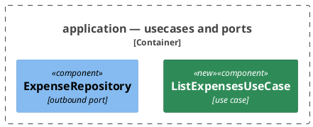

# Conventions > Diagram Format

Applies to every service and to the repository's own documents — READMEs, design files, plans, use-case and
contract pages. It says what a diagram is written in; what a diagram must *show* is fixed by whoever asks for it.

Diagrams are **PlantUML** in fenced ` ```plantuml ` blocks, inline in the document — nothing is rendered to a
committed image. Structure is drawn with the **C4 model** via the bundled C4-PlantUML stdlib (`!include
<C4/C4_Context>`, `<C4/C4_Container>`, `<C4/C4_Component>` for C1, C2 and C3). Flows are drawn as **sequence** or
**activity** diagrams — see below.

## Choosing a Flow Diagram

**First: does the flow earn a diagram?** An activity diagram earns its place when the *shape* carries something
a list cannot — arms that rejoin, a loop, a fork, a guard that changes what comes after it. A straight line of
guards that each end the flow is a table of condition and outcome; drawing it spends a screen to say what five
rows say, and the use-case pages already carry that table under **Outcomes**.

- **Sequence** — when the participants are the content: who calls whom, in what order, and what crosses each
  boundary. Needs no include.
- **Activity** — when the decisions are the content: the branches, guards and loops one flow runs through. Uses
  `start` / `stop`, `if (…) then (…)` / `else` / `endif`, `repeat`, `fork`. Needs no include.

**The test: read the branches.** If every arm of an `alt` names the same one or two participants, the diagram is
about logic rather than interaction, and the lifelines are repeated scenery — an activity diagram states the same
thing once. If the arms differ in *who* takes part, it is a sequence diagram.

A flow with both — several participants *and* real branching — is two diagrams, not one overloaded diagram: a
sequence diagram for the exchange, an activity diagram for the decision it turns on. Neither restates the other.

## A README's C3 Illustrates One Use Case

A service README carries one component diagram, and it shows the primary use case end to end rather than every
component the service has. A diagram of everything is read by scrolling, and a reader arriving at the README
wants to see how one thing works. The per-use-case diagrams live on the `docs/usecases/` pages.

## Component Boundaries

A component diagram carries one boundary per layer — `domain`, `application` — and then **one boundary per partner
system and direction**, not a single pair of inbound and outbound boxes.

- **Label**: `adapter (inbound) — Telegram`, `adapter (outbound) — Postgres`, `adapter (outbound) — AI Connector`.
  Direction, then the system, named as a reader knows it. No package paths.
- **A system that is talked to both ways gets a box each way.** Telegram delivers updates and receives replies, so
  an inbound Telegram box and an outbound Telegram box stand side by side.
- **Every class fronting that system sits in its box**, mappers and renderers included, because all of them break
  when that one API changes.
- **Adapters fronting no external system** — use-case wiring, logging — stay out of the diagram unless the change
  is about them.

A reader then sees what a change to one partner system reaches, which is the question a component diagram is read
to answer.

**One diagram per subject.** Two groups of components with no arrow between them are two diagrams, whatever put
them in the same change. Each is read on its own screen, and a reader looking for one of them is not made to
scan the other. A component belonging to neither — a filter chain, an exception handler — is drawn in neither.

**Roughly a dozen boxes is the bound.** Past it a diagram grows wider than a screen and is read by scrolling,
which is not reading. Split it by subject; where no split is available, the diagram is drawing more than one
question and the extra question belongs elsewhere.

**A relation repeated from every box in a boundary to one target is left out**, and so is the target when nothing
else reaches it. Every component importing the same helper, or reading the same catalogue, says one thing that
one line under the diagram says better — and drawn, it is the fan that makes the rest unreadable. Name it in the
step or the section that creates it.

**A layer boundary splits by the kind of type it holds** when one box would otherwise carry a mixed crowd — a use
case, its command, the read model it answers and the port it calls, all in `application`.

- **Label**: the layer, then the kind — `domain — values`, `domain — entities`, `application — usecases and
  ports`, `application — dto`, `adapter (outbound) — Postgres — entities`. The same grammar as a partner-system
  box, so the two read as one list.
- **Kinds are the package names**: `model` is entities, `value` is values, `dto` is read models and commands.
  A box for a kind the module does not separate in code is a distinction the reader cannot follow back.
- **Split only what the change is about.** A layer holding three components is one box; splitting it spends a
  border to say nothing.
- **Boundaries stay siblings, never nested.** A box inside a box renders as depth the model does not have, and
  the layer is already named in every label.

## Marking What a Change Adds

A component diagram in a plan is read to answer one question first: what is new here. So **every class the change
creates is coloured, and everything already in the tree keeps the default style.**

Declare the tag once, in the preamble, and tag each new element:



- **`new` is the only tag this rule adds.** An existing class drawn for context, or one the change edits without
  creating, carries no tag: green means "this file does not exist yet".
- **The legend is the colour itself.** No `SHOW_LEGEND()` and no explanatory line under the diagram — one colour
  against the default needs neither.
- **A diagram where everything is green says nothing**, and that is fine: a change that adds a whole subject is
  exactly the case where the reader wants the shape, not the novelty.

## Layout

A structure diagram reads left to right along the call chain: **whoever initiates on the left**, the service's own
elements in the middle, **the things it depends on — ports, adapters, stores, other services — on the right**.

Direction is stated, never left to the renderer. Relations carry `Rel_R` / `Rel_L` / `Rel_D`, and elements that
must line up are pinned with `Lay_*`; a diagram whose elements move when one is added was drawn without them.

### A Component Diagram Stacks, It Does Not Stretch

The left-to-right rule is about **who initiates**, not about every arrow. It fits C1 and C2, where a handful of
boxes sit in a row. A component diagram has boundaries, and one `Rel_R` per step of the call chain puts each
boundary beside the last — a strip wider than a screen, read by scrolling. So:

- **A step of the call chain is `Rel_D`.** The entry point is at the top, the layers below it, the adapters at
  the bottom. Depth is what a screen has.
- **`Rel_R` and `Rel_L` are for what sits beside**, not for what comes next: a mapper next to the class that
  calls it, a use case next to the port it implements, a repository next to the entity it queries through.
- **An adapter points back up at its port with `Rel_U`.** Every implementation of a port then leaves the same
  edge of the same box, and a reader sees one boundary's worth of adapters at a glance.
- **Pin each boundary to the one above it** with a single `Lay_D` between one element of each. Two or three
  lines settle the whole stack.
- **Never state a layout macro.** `LAYOUT_TOP_DOWN()` and `LAYOUT_LEFT_RIGHT()` overrule the per-relation
  directions above and undo the arrangement they describe.

**A record with no collaborator of its own is a table row, not a box.** A value object, a command, a read model,
a projection, an entity row: nothing calls them, so they add a box and no arrow, and what a reader wants of them
— their fields and what they refuse — is what a table carries and a box cannot. Draw one only where an arrow
genuinely needs it.
