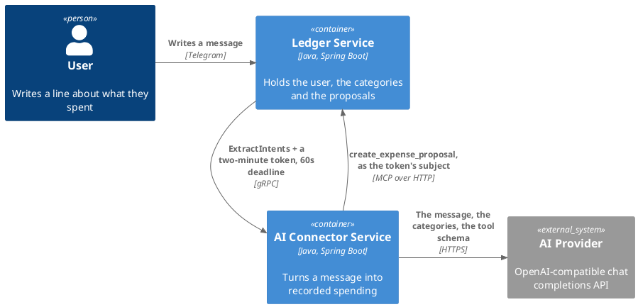
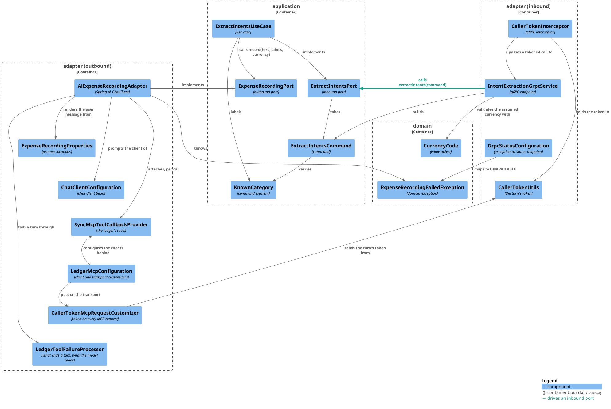
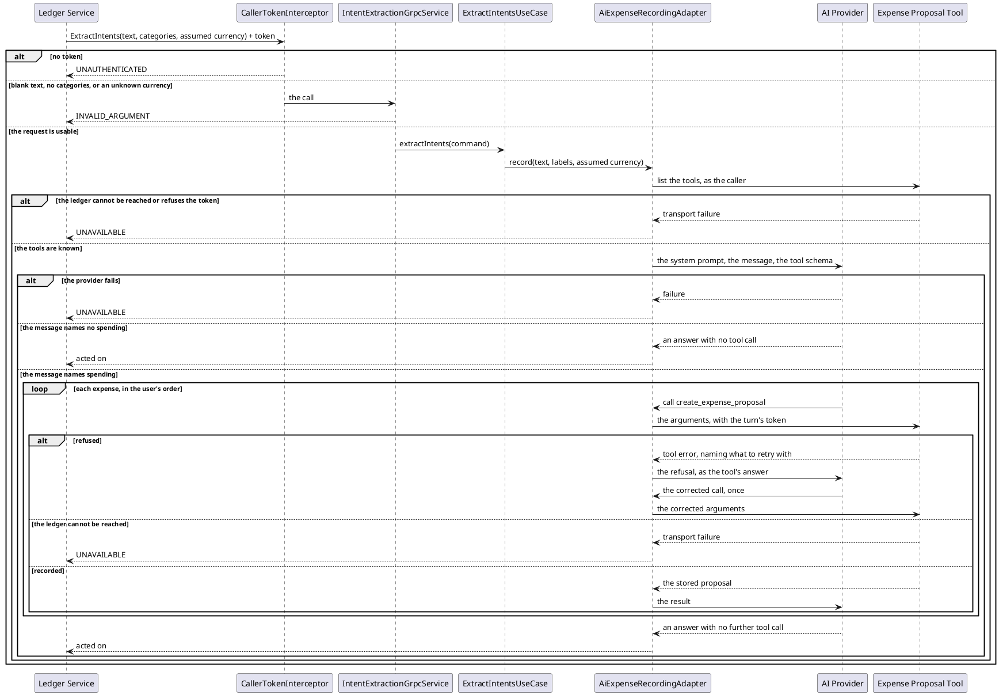

# Design: The Ledger's Tools on the Chat Client

**Affected Modules:** `ai-connector-service`, `ledger-service`

## Objective

The service reaches the ledger's `create_expense_proposal` tool by opening an MCP client by hand and calling the
tool itself, from a use case that has already decided what to send. The model never sees the tool, so it never
sees the ledger's refusals either — and those refusals are written as retry guidance ("the category is a
grouping, choose one of these"), which nothing reads.

This change puts the ledger's tools on the chat client. The model reads the message, calls the tool once per
expense, and reads a refusal and retries against it inside the same turn. The prompt is narrowed to expenses —
categories are no longer extracted — and gains the merchant the tool has always accepted and nothing has ever
sent.

## Context

The hand-rolled client this replaces is
[`McpExpenseProposalAdapter`](../ai-connector-service/src/main/java/bot/finance/ai/adapter/ledger/McpExpenseProposalAdapter.java):
it builds a transport per proposal, puts the caller's token on it, calls the tool, and turns an error result into
`ExpenseProposalFailedException`. It is driven by
[`ExtractIntentsUseCase`](../ai-connector-service/src/main/java/bot/finance/ai/application/usecase/ExtractIntentsUseCase.java),
which assembles a domain `Intent` per raw answer, matches the category, resolves the currency, and proposes each
`CREATE` expense.

The other outbound adapter,
[`AiIntentInferenceAdapter`](../ai-connector-service/src/main/java/bot/finance/ai/adapter/ai/AiIntentInferenceAdapter.java),
renders the user-message template and asks the provider for `ExtractedIntents` as structured output. Its chat
client is a bean built once in
[`ChatClientConfiguration`](../ai-connector-service/src/main/java/bot/finance/ai/adapter/ai/ChatClientConfiguration.java).

The server side needs nothing: the ledger's
[`CreateExpenseProposalMcpTool`](../ledger-service/src/main/java/bot/finance/adapter/mcp/CreateExpenseProposalMcpTool.java)
already declares `merchant` as an optional argument, and already answers a refusal as a tool error result
carrying what to retry with ([its contract](../ledger-service/docs/contracts/in/mcp.md)).

The mechanics this design rests on are Spring AI 2.0.0 and MCP SDK 2.0.0, both already on the classpath
(`spring-ai-starter-mcp-client`), read from the jars rather than assumed:

- `StreamableHttpHttpClientTransportAutoConfiguration` builds one transport per entry under
  `spring.ai.mcp.client.streamable-http.connections`, applying every
  `McpClientCustomizer<HttpClientStreamableHttpTransport.Builder>` bean;
- `McpClientAutoConfiguration` builds one `McpSyncClient` per transport, applying every
  `McpClientCustomizer<McpClient.SyncSpec>` bean, and calls `initialize()` eagerly unless
  `spring.ai.mcp.client.initialized` is `false`;
- `McpToolCallbackAutoConfiguration` publishes a `SyncMcpToolCallbackProvider` over those clients;
- `DefaultChatClientUtils.toChatClientRequest` resolves a provider's callbacks inside `call()`, on the calling
  thread — not when the chat client is built;
- `McpSyncClient` evaluates its `transportContextProvider` on the calling thread per operation, and
  `HttpClientStreamableHttpTransport` hands that context to its `McpSyncHttpClientRequestCustomizer` when
  building each HTTP request;
- `SyncMcpToolCallback` turns a tool error result into a `ToolExecutionException` whose cause is an
  `IllegalStateException`, and a transport failure into one whose cause is an `McpTransportException`;
- `DefaultToolExecutionExceptionProcessor` returns the exception's message to the model unless the cause's type
  is in its rethrow list.

## Proposed Solution

### What is deleted

The model now decides what the tool is called with, so everything the core did to decide that goes:

| Deleted                                                                   | Why                                                        |
|---------------------------------------------------------------------------|------------------------------------------------------------|
| `domain/value/Intent`, `ExpenseIntent`, `CategoryIntent`, `UnknownIntent` | nothing assembles an intent                                |
| `domain/value/IntentTarget`, `Operation`                                  | the prompt reads expenses to record and nothing else       |
| `domain/value/Money`                                                      | the amount reaches the tool as minor units the model sends |
| `domain/exception/ExpenseProposalFailedException`                         | a refusal is the model's to read, not a turn failure       |
| `application/dto/RawIntent`, `ProposedExpense`                            | no structured answer, no assembled proposal                |
| `application/port/IntentInferencePort`, `ExpenseProposalPort`             | replaced by one outbound port                              |
| `adapter/ai/ExtractedIntent`, `ExtractedIntents`                          | the turn's answer is not read                              |
| `adapter/ledger/McpExpenseProposalAdapter`, `LedgerMcpProperties`         | the client is auto-configured and driven by the model      |

`CurrencyCode` stays: `IntentExtractionGrpcService` validates the caller's assumed currency with it.
The domain pages for the deleted values are removed with them (see [Documentation](#documentation)).

### Application layer

- `application/port/ExpenseRecordingPort` — the one outbound port:

  ```java
  void record(String text, List<String> knownCategoryLabels, Optional<CurrencyCode> assumedCurrency);
  ```

  It returns nothing. A call that returns has been acted on, which is what the inbound contract already promises.
- `application/dto/ExtractIntentsCommand`, `KnownCategory` — unchanged, including `KnownCategory.label`.
- `application/usecase/ExtractIntentsUseCase` — reduced to what the core still decides: reject a null command,
  turn the known categories into `Grouping > Category` labels, call the port, and log at INFO that the turn was
  acted on. The class and the inbound port keep their names; the RPC they serve is still `ExtractIntents`
  (D14).

### Adapter layer (outbound) — `adapter/ai`

- `AiExpenseRecordingAdapter` (renamed from `AiIntentInferenceAdapter`) implements `ExpenseRecordingPort`. It
  renders the user message, calls the chat client with the ledger's tool callbacks attached, and translates a
  provider or ledger failure into `ExpenseRecordingFailedException`:

  ```java
  chatClient.prompt().user(userMessage).tools(ledgerToolCallbackProvider).call().content();
  ```

  The answer is logged at `debug` and discarded (D6). The provider is injected, not resolved: its callbacks are
  read inside `call()`, on this thread, which is what puts the caller's token on the tool-listing request too
  (D3).
- `ExpenseRecordingProperties` (renamed from `IntentExtractionProperties`) — `@ConfigurationProperties("ai.expense")`
  over `systemPrompt` and `userMessageTemplate`, unchanged in shape.
- `ChatClientConfiguration` — unchanged: the system prompt is still applied to the bean, and the tools are not
  (D3).

### Adapter layer (outbound) — `adapter/ledger`

The package keeps its name and holds everything that fronts the ledger; what it no longer holds is a class that
calls it.

- `LedgerMcpConfiguration` — `@Configuration`, declaring two beans (D28):
  - `McpClientCustomizer<HttpClientStreamableHttpTransport.Builder>`, applying
    `.httpRequestCustomizer(callerTokenMcpRequestCustomizer)` to the `ledger` connection;
  - `McpClientCustomizer<McpClient.SyncSpec>`, applying `.transportContextProvider(...)` to the `ledger`
    connection — a supplier that reads `CallerTokenUtils.callerToken()` and returns
    `McpTransportContext.create(Map.of(CALLER_TOKEN, token))`, or `McpTransportContext.EMPTY` when the turn holds
    none.
- `LedgerToolFailureProcessor` — `@Component` implementing `ToolExecutionExceptionProcessor`. Walks the failure's
  cause chain: an `McpTransportException` anywhere in it rethrows and ends the turn; anything else returns its message to the
  model to correct and retry against; a cause that is not a `RuntimeException` at all rethrows, as the
  framework's own processor does. The chain is walked rather than the direct cause matched, because the MCP
  client wraps an initialization failure in a plain `RuntimeException` (D21), and only `McpTransportException`
  is listed, because a protocol-level `McpError` is a call the model can correct (D20).
- `CallerTokenMcpRequestCustomizer` — `@Component` implementing `McpSyncHttpClientRequestCustomizer`. Reads the
  token out of the `McpTransportContext` and sets it as the `Authorization` header verbatim, scheme included.
  A missing token throws `McpTransportException`, so an untokened call reaches the ledger as no call at all
  (D8).

### Configuration

`application.yaml` — the `ledger.mcp` block is replaced by the MCP client's own:

```yaml
spring:
  ai:
    mcp:
      client:
        name: ai-connector-service
        version: 1.0.0
        initialized: false
        request-timeout: 5s
        streamable-http:
          connections:
            ledger:
              url: ${LEDGER_MCP_URL:http://localhost:1000}
              endpoint: /mcp

ai:
  expense:
    system-prompt: classpath:prompts/record-expenses.st
    user-message-template: classpath:prompts/user-message.st
```

`LEDGER_MCP_URL` keeps its name and its meaning, so
[`docs/configuration.md`](../ai-connector-service/docs/configuration.md) gains no row — only a corrected note,
since a wrong address no longer fails the turn the same way (D9).

`ledger-service/src/main/resources/application.yaml` raises the deadline the turn runs under:

```yaml
spring:
  grpc:
    client:
      channel:
        ai-connector:
          default:
            deadline: 60s
```

The ceilings, outermost first: the ledger's MCP token lives two minutes, the turn has sixty seconds, one MCP
request has five, and a provider call has whatever the OpenAI client allows (D18).

`CreateExpenseProposalMcpTool`'s `amountMinorUnits` description gains a worked conversion — "the amount in the
currency's minor units, required — 12.50 EUR is 1250". It is the only wording change on that side, and it goes
there rather than into the connector's prompt because the schema is where a model reads what an argument takes
(D27).

### Prompts

`prompts/extract-intents.st` is replaced by `prompts/record-expenses.st`, the system prompt:

```
You record a user's spending in their ledger.

Read the user's message and record every expense it says was paid — one tool call per expense, in the order the
user said them. A message that names no spending records nothing, and is not a failure.

Fill each argument from what the tool says it takes, and from the message and the categories you were given —
never from a guess. An expense whose amount, currency or category you cannot tell is left unrecorded.

A call the tool refuses answers with an error saying what to retry with. Correct that call and try the same
expense once more; if it is refused again, leave that expense and go on to the next one.

Record expenses and nothing else. You do not create, rename or delete categories, and you do not read anything
back for the user.
```

`prompts/user-message.st` becomes:

```
Known categories, each written as "Grouping > Category": {knownCategories}

File every expense under exactly one of them. If none fits, use the caller's catch-all category. Never invent a
category name. The two halves go in separate arguments: what follows the ">" is the category, what precedes it
is the parent category.

Currency to assume when the user states an amount without one: {assumedCurrency}

Message: {text}
```

`{assumedCurrency}` renders the caller's code, or `none — leave an amount with no currency unrecorded` when the
caller sent none (D10).

### Failures

| Condition                                                  | What the caller sees                                                      |
|------------------------------------------------------------|---------------------------------------------------------------------------|
| No token on the call                                       | `UNAUTHENTICATED`, from `CallerTokenInterceptor` — unchanged            |
| Blank text, no categories, an unknown assumed currency     | `INVALID_ARGUMENT`, from `IntentExtractionGrpcService` — unchanged      |
| The provider is unreachable, or its answer unreadable      | `ExpenseRecordingFailedException` → `UNAVAILABLE`                       |
| The ledger cannot be reached, refuses the session, or 401s | the same, by way of the rethrown `McpTransportException` (D7)             |
| An argument's value cannot be bound to its declared type   | the same — the protocol's error reaches the model to correct (D20)      |
| The ledger refuses a proposal                              | nothing — the model reads the refusal, retries once, then moves on (D5) |
| The model records nothing                                  | nothing — an empty answer, as a message asking for nothing already is   |
| The turn outlives the caller's deadline                    | the caller abandons it; the connector runs on and its proposals stand     |

`GrpcStatusConfiguration` loses its `ExpenseProposalFailedException` branch and maps
`ExpenseRecordingFailedException` (renamed from `IntentInferenceException`) to `UNAVAILABLE`. `FAILED_PRECONDITION`
is no longer reachable from this service (D5).

### Documentation

- [`contracts/out/ledger-mcp.md`](../ai-connector-service/docs/contracts/out/ledger-mcp.md) — rewritten: the
  model fills the arguments, `merchant` is sent when named, one long-lived client replaces one session per
  proposal, a refusal is retried rather than ending the turn.
- [`contracts/in/intent-extraction.md`](../ai-connector-service/docs/contracts/in/intent-extraction.md) — the
  failure table loses the refusal row, and the semantics lose the intent vocabulary and the
  assumed-currency-applied-here promise (D10).
- [`usecases/extract-intents.md`](../ai-connector-service/docs/usecases/extract-intents.md) — rewritten around
  what the turn now does; its C3 and sequence diagrams are the ones below.
- `docs/domain/` — `intent.md`, `expense-intent.md`, `category-intent.md`, `unknown-intent.md`,
  `intent-target.md`, `operation.md` and `money.md` are removed; `currency-code.md` stays.
- [`configuration.md`](../ai-connector-service/docs/configuration.md) — the `LEDGER_MCP_URL` note, and the
  `OPENAI_MODEL` note, which describes a model following a supplied answer shape and now has to describe one
  calling tools (D22).
- [`conventions/architecture.md`](../ai-connector-service/docs/conventions/architecture.md) — the package tree's
  `adapter/ledger` line and its `domain/value` examples, two of which this change deletes (D26).
- [`conventions/code-style.md`](../ai-connector-service/docs/conventions/code-style.md) — the *Adapter — AI*
  section gains the rule in D3 and loses the structured-output bullets, which no adapter now follows; what
  survives is that the adapter translates a failure at this boundary and stops (D26).
- [`conventions/testing.md`](../ai-connector-service/docs/conventions/testing.md) — the shared-infrastructure
  list and the `@AiAdapterTest` description, which no longer covers an AI adapter that needs the MCP client
  autoconfiguration and a stubbed ledger behind it (D26).
- [`ledger-service/docs/contracts/out/ai-connector.md`](../ledger-service/docs/contracts/out/ai-connector.md) —
  the ten-second sentence, and what the sixty now has to cover (D18).
- [`ledger-service/docs/contracts/in/mcp.md`](../ledger-service/docs/contracts/in/mcp.md) — the
  `amountMinorUnits` row, matching the argument description it documents (D27). Its compatibility note that a
  client calls the tool by name now describes a model choosing it from the list.
- An ADR for D1, written by `archive-knowledge` after implementation: the connector hands the recording to the
  model instead of doing it itself.

### Diagrams







## Decisions

- **D1:** Does the connector still assemble what it sends, or does the model fill the tool's arguments?
- Answer: The model fills them. The intent vocabulary, the category matching, the currency resolution and the
  proposal loop are deleted; the use case prompts the model and lets the tool loop run.
- Basis: decided — the user chose deletion over keeping the assembly for logging (user, 2026-08-02). The ledger's
  tool errors are written as retry guidance a model reads, which only a model-driven call can use, and
  [ADR 0005](../../adr/0005-the-ledger-mirrors-the-intent-vocabulary-in-its-own-domain.md) already records that no
  intent crosses into the ledger.

- **D2:** How does the caller's token reach each MCP request, when the client is a singleton and the token is
  per turn?
- Answer: `McpClient.SyncSpec.transportContextProvider` reads `CallerTokenUtils.callerToken()` on the calling
  thread and puts it in an `McpTransportContext`; `CallerTokenMcpRequestCustomizer` reads it back out and sets
  the `Authorization` header when the request is built.
- Basis: assumed — `McpSyncClient` evaluates the provider per operation on the caller's thread, and
  `HttpClientStreamableHttpTransport` passes `ctx.getOrDefault(McpTransportContext.KEY, …)` to the customizer for
  every request; `McpSyncHttpClientRequestCustomizer`'s own javadoc names this as the supported route and warns
  against thread-locals in the customizer itself. Both read from the cached `mcp-core-2.0.0` sources.

- **D3:** Are the ledger's tools a default on the chat-client bean or attached per call?
- Answer: Per call — `chatClient.prompt().…tools(provider)` in the adapter.
- Basis: assumed — `ChatClient.Builder.defaultTools`/`defaultToolCallbacks` are deprecated for removal in
  Spring AI 3.0.0, and `DefaultChatClientUtils.toChatClientRequest` resolves a provider's callbacks inside
  `call()` either way, so nothing is gained by the bean holding them. The module's
  [code-style rule](../ai-connector-service/docs/conventions/code-style.md) that the chat client is built once
  is about the prompt and the options, and the bean is still built once.

- **D4:** What lists the tools, and when?
- Answer: `SyncMcpToolCallbackProvider`, inside the first turn's `call()`, over an MCP client that
  `spring.ai.mcp.client.initialized: false` keeps from connecting at startup. The result is cached for the life
  of the process.
- Basis: assumed — the tool list is a property of the server, not of the caller, so caching it across turns is
  right; eager initialization would open the connection at startup, where no caller token exists and the ledger
  answers 401 (`McpClientAutoConfiguration` calls `initialize()` when the property is true, and `McpAsyncClient`
  initializes lazily on first use when it is not).

- **D5:** What does a refusal from the ledger do to the turn?
- Answer: Nothing. The tool error's message goes back to the model as the tool's answer, the prompt asks for one
  corrected retry, and an expense refused twice is left unrecorded while the rest of the message is still acted
  on. `FAILED_PRECONDITION` stops being reachable.
- Basis: decided — this follows D1: a refusal that ends the turn is what the current adapter does, and the
  ledger's [tool contract](../ledger-service/docs/contracts/in/mcp.md) writes every refusal as something to
  retry with. `DefaultToolExecutionExceptionProcessor` returns the message to the model by default, so this is
  also what the framework does unless told otherwise.

- **D6:** What does the service do with the model's final answer?
- Answer: Logs it at `debug` and discards it. The RPC still answers with nothing.
- Basis: assumed — `ExtractIntentsResponse` is empty by contract, and
  [code-style](../ai-connector-service/docs/conventions/code-style.md) keeps a model's raw answer out of any log
  level above `debug`.

- **D7:** Which failures inside the tool loop end the turn, rather than reaching the model as text?
- Answer: An `McpTransportException` anywhere in the cause chain — which covers a 401 through
  `McpHttpClientTransportAuthorizationException` and an initialization failure through the wrapper in D21 — plus
  a cause that is not a `RuntimeException`. Everything else goes to the model: every tool error result, and
  every protocol error the model can correct (D20). `LedgerToolFailureProcessor` is where the split lives.
- Basis: assumed — `SyncMcpToolCallback` wraps a tool error result with an `IllegalStateException` cause and a
  transport failure with the MCP exception itself, so the two cases are separable exactly here. The
  autoconfigured `ToolExecutionExceptionProcessor` is `@ConditionalOnMissingBean`, so the module's own bean
  replaces it; it is written rather than configured because
  `DefaultToolExecutionExceptionProcessor` matches the direct cause's class only (D20, D21).

- **D8:** What happens if a turn somehow reaches the MCP client with no token held?
- Answer: The turn fails, in two places. `AiExpenseRecordingAdapter.record` refuses an untokened turn before it
  prompts the model at all; below it, the request customizer throws `McpTransportException`, which D7 turns into
  `UNAVAILABLE`. No request is sent unauthenticated.
- Basis: assumed — `CallerTokenInterceptor` already closes an untokened `IntentExtractionService` call with
  `UNAUTHENTICATED`, so this is unreachable from the RPC and exists so that a future entry point cannot make it
  reachable quietly. The adapter's own check is the one `McpExpenseProposalAdapter` performed and this design
  first proposed to drop: the customizer alone only fires when a request is actually built, and a turn whose
  tool list is already cached (D4) and whose model answers without calling the tool builds none — so it would
  have returned successfully having recorded nothing, which is the one outcome an untokened turn must not have.
  Found while implementing, against `SyncMcpToolCallbackProvider`'s cache.

- **D9:** Does the configuration surface change?
- Answer: No. `LEDGER_MCP_URL` keeps its name, its default and its meaning; only the property it feeds moves
  from `ledger.mcp.url` to `spring.ai.mcp.client.streamable-http.connections.ledger.url`.
- Basis: assumed — `docs/configuration.md` documents the environment variable, not the property path, and the
  ledger serves the tool at `/mcp` on the same base address the current adapter uses.

- **D10:** Who applies the assumed currency now?
- Answer: The model, from the user-message template. The gRPC contract keeps `default_currency`, and the service
  still rejects a code ISO 4217 does not know before prompting; what changes is that the promise "applied here,
  not by the model" leaves the contract page.
- Basis: assumed — D1 leaves nothing between the model and the tool's `currencyCode` argument. The validation
  survives because `IntentExtractionGrpcService` does it on the request, before the use case is reached.

- **D11:** Who converts an amount to minor units?
- Answer: The model, told the rule where it reads what the argument takes — the tool's own schema, which gains
  the worked example (D27).
- Basis: assumed — the tool's `amountMinorUnits` is a `Long` in a schema the model fills, and nothing between
  them can convert. This is the weakest point of the change: a model that sends `12` for `12.50` records an
  expense a hundred times too small, and the ledger cannot tell. The proposal is reviewed by a human before it
  becomes an expense ([ADR 0006](../ledger-service/docs/adr/0006-an-expense-proposal-is-a-table-and-an-entity-of-its-own.md)),
  which is what makes the risk survivable rather than absent.

- **D12:** What caps the tool loop?
- Answer: Nothing in this service. The prompt asks for one retry per refused expense; beyond that the loop runs
  for as long as the model keeps asking for tool calls.
- Basis: deferred — `ToolCallingAdvisor` has no iteration limit to set (read from
  `spring-ai-client-chat-2.0.0`), so a cap means a custom `ToolExecutionEligibilityChecker` or an advisor of the
  module's own. It comes back with the first turn that loops in production, or with a per-turn cost budget.

- **D13:** Does anything deduplicate a retried turn?
- Answer: No. The same message handled twice records its expenses twice, and a model that retries a call it
  already made records it twice within one turn.
- Basis: deferred — unchanged from
  [design 8's D9 and D20](../8-mcp-adapter-create-expense-proposal/8-design-mcp-adapter-create-expense-proposal.md); the answer is an
  idempotency key on the ledger's tool, not anything here. What is new is that a model, not a program, decides
  when to repeat a call.

- **D14:** Do the RPC, the inbound port, the use case and the command keep their `ExtractIntents` names?
- Answer: Yes. Only the outbound port, its adapter and their prompt properties are renamed.
- Basis: deferred — the RPC name is in
  [`proto/intent_extraction.proto`](../proto/intent_extraction.proto), which both modules generate from, so
  renaming it is a cross-module change and the ArchUnit rule
  `inboundPortCommandsAreNamedAfterTheirUseCase` would pull the command along with it. It comes back if the RPC
  is ever renamed for its own reasons.

- **D15:** Does `ledger-service` change?
- Answer: No. `merchant` is already an optional argument on `create_expense_proposal`, and every refusal already
  carries what to retry with.
- Basis: assumed — `CreateExpenseProposalMcpTool` declares `merchant` with
  `@McpToolParam(required = false, …)`, and its `InvalidCategoryException` branch answers the message the use
  case builds.

- **D16:** Does `CleanArchitectureTest` need new rules?
- Answer: No. `io.modelcontextprotocol..` is already banned from `domain`/`application`, and `Mcp` is already a
  forbidden simple name there.
- Basis: assumed — both were added by
  [design 8](../8-mcp-adapter-create-expense-proposal/8-design-mcp-adapter-create-expense-proposal.md) and are in
  `CleanArchitectureTest` today; this change moves MCP types between adapter classes and adds none to the core.

- **D17:** What proves in production that a turn recorded anything?
- Answer: The use case logs at INFO that a turn was acted on, with the number of categories offered and nothing
  from the message. What was recorded is visible in the ledger, which logs each stored proposal with the
  identity it resolved.
- Basis: assumed — the ledger already logs every creation
  ([design 8's D12](../8-mcp-adapter-create-expense-proposal/8-design-mcp-adapter-create-expense-proposal.md)), and this service now learns
  what happened only from the model's answer, which D6 keeps at `debug`. Counting tool calls here would mean
  reading that answer for a number the ledger already has.

- **D18:** How long may a turn take, now that it is a model-driven loop rather than one provider round trip?
- Answer: Sixty seconds. `ledger-service`'s `ai-connector` channel deadline goes from `10s` to `60s`, and the
  MCP client's `request-timeout` is `5s`, so one slow ledger call cannot spend the turn. The ledger's
  two-minute MCP token TTL stays the outer ceiling, unchanged. A turn that still outlives the deadline is
  abandoned by the caller while the connector runs on — which the caller's contract already promises — and its
  proposals stand. This is what puts `ledger-service` in **Affected Modules**.
- Basis: decided — the user chose raising the deadline over keeping ten seconds and over capping the loop
  (user, 2026-08-02); D12's loop cap stays deferred. `ledger-service/src/main/resources/application.yaml` sets
  the deadline on the
  `ai-connector` channel, and [its contract](../ledger-service/docs/contracts/out/ai-connector.md) states that
  the ten seconds "has to cover a model round trip and every callback the turn makes". Today that is one provider
  call plus one MCP session per expense. After this change it is a `tools/list`, a provider call, one MCP call
  per expense, a provider call per tool result, and a further pair per refused expense the prompt asks to retry —
  every one of them sequential, which is what makes ten seconds the wrong number.

- **D19:** What tells the model to split `Grouping > Category` into the tool's `category` and `parentCategory`
  arguments?
- Answer: The user-message template, which now names the label's shape and says which half goes in which
  argument. The labels themselves stay as they are — the closed set reaching the model as `Grouping > Category`
  is the use case's own rule, and it is what disambiguates two categories sharing a name.
- Basis: assumed — the gap was real as first written and is closed in the prompt above.
  `KnownCategory.label` builds that string; the
  [tool's argument table](../ledger-service/docs/contracts/in/mcp.md#what-the-tool-takes) declares `category` as
  "the category's name — one filed under a grouping, never a grouping" and `parentCategory` as a tie-breaker.
  The split is what `ProposedExpense(categoryName, parentCategoryName)` did, and this change deletes it —
  without the instruction the likely first call carries `category: "Food > Groceries"`, which
  [design 8's D31](../8-mcp-adapter-create-expense-proposal/8-design-mcp-adapter-create-expense-proposal.md) refuses, spending the one retry
  the prompt allows on a mismatch the prompt could have avoided.

- **D20:** Does `McpError` end a turn on a failure the ledger writes for the model to read?
- Answer: It would have, so it is not rethrown. `LedgerToolFailureProcessor` ends a turn on
  `McpTransportException` alone; an `McpError` — the protocol's own binding failure, which is what
  `amountMinorUnits: "twelve"` produces — reaches the model as the tool's answer, and the model corrects the
  call it just made.
- Basis: assumed — challenges D7 as first written. `McpError extends RuntimeException` (`mcp-core-2.0.0`), and
  `DefaultToolExecutionExceptionProcessor.process` rethrows on `rethrown.isAssignableFrom(cause.getClass())`.
  The ledger's [failure table](../ledger-service/docs/contracts/in/mcp.md#failures) and
  [design 8's D17](../8-mcp-adapter-create-expense-proposal/8-design-mcp-adapter-create-expense-proposal.md) both place the binding failure
  outside the tool-error vocabulary, which is exactly the class of failure D5 wants the model to correct.

- **D21:** Does a ledger that is unreachable *during initialization* end the turn, or reach the model as text?
- Answer: It ends the turn, because `LedgerToolFailureProcessor` walks the cause chain rather than matching the
  direct cause. `LifecycleInitializer.withInitialization` wraps every initialization failure in
  `new RuntimeException("Client failed to initialize " + actionName, ex)`, which a direct-cause match — the
  framework processor's — would hand to the model as text.
- Basis: assumed — both read from the cached sources. The reachable window is narrow: the first MCP operation of
  the process is `listTools()` inside `SyncMcpToolCallbackProvider.getToolCallbacks()`, which runs outside the
  tool loop and fails the turn correctly. It widens on re-initialization, which
  `LifecycleInitializer.handleException` triggers after an `McpTransportSessionNotFoundException`, and on any
  later cache invalidation — a `McpToolsChangedEvent` clears `cachedToolCallbacks`, after which the next
  `getToolCallbacks()` re-lists.

- **D22:** What happens when the configured model cannot call tools at all?
- Answer: The turn succeeds and records nothing. The model answers with text, no tool call is made, the answer is
  discarded at `debug` (D6), and the use case logs that the turn was acted on — the same outcome as a message
  that names no spending.
- Basis: assumed — `OPENAI_MODEL` is configurable and defaults to `gpt-4o-mini`
  ([`docs/configuration.md`](../ai-connector-service/docs/configuration.md)). That page's note already warns
  about this in the vocabulary this change deletes — "the model must be able to follow a supplied answer shape …
  turns every message into entries that are skipped rather than into a failure" — and the Documentation section
  only promises the `LEDGER_MCP_URL` note a correction. The `OPENAI_MODEL` note needs rewriting to name tool
  calling instead.

- **D23:** What distinguishes a turn that recorded nothing from a turn whose every call was refused?
- Answer: Nothing in this service. Both end at the same INFO line, and the refusal text is consumed by the model
  and logged nowhere here.
- Basis: assumed — sharpens D17. The trace exists on the other side: the ledger logs every rejection at WARN and
  every creation at INFO ([design 8's D12](../8-mcp-adapter-create-expense-proposal/8-design-mcp-adapter-create-expense-proposal.md)). What
  neither side carries is anything tying a ledger log line to the connector turn that caused it, so the
  correlation is by user and clock. The current adapter needed none, because a refusal ended the turn and
  surfaced as `FAILED_PRECONDITION`; D5 removes that signal.

- **D24:** The message text now steers a tool that writes to the caller's ledger. What bounds what it can make
  the model do?
- Answer: The transport-carried identity, the single tool attached, and human review. A message cannot name a
  user, cannot reach a second tool, and cannot produce an expense — only a proposal a human accepts.
- Basis: assumed — [ADR 0007](../ledger-service/docs/adr/0007-an-mcp-caller-is-identified-by-a-signed-token-not-a-tool-argument.md)
  and [design 8's D14](../8-mcp-adapter-create-expense-proposal/8-design-mcp-adapter-create-expense-proposal.md) keep identity out of the
  input schema for exactly this reason; the ledger publishes one tool, so the callback list holds one entry; and
  [ADR 0006](../ledger-service/docs/adr/0006-an-expense-proposal-is-a-table-and-an-entity-of-its-own.md) keeps a
  proposal apart from the ledger until reviewed. What the message gains over today is the amount, the currency
  and the category of a proposal against its own author — the same blast radius D11 already accepts.

- **D25:** What do two concurrent turns, for two different users, share?
- Answer: One `McpSyncClient`, one HTTP connection and one cached tool-callback list — and no identity. Each
  turn's token is read on its own calling thread, per operation.
- Basis: assumed — `McpSyncClient` evaluates its `contextProvider` inside `withProvidedContext` on every
  operation (D2), `SyncMcpToolCallbackProvider` guards its cache with a `ReentrantLock` and holds only the tool
  schema, which is a property of the server, and the ledger's MCP server is `STATELESS` with per-call token
  validation ([design 8's D1](../8-mcp-adapter-create-expense-proposal/8-design-mcp-adapter-create-expense-proposal.md)). The one shared
  thing that is a caller's is the `initialize` exchange, which the first turn makes with its own token; the
  ledger's contract permits it, since every call carries its own token and no session is kept.

- **D26:** Which convention pages does the change touch beyond the two listed?
- Answer: Two more. `architecture.md`'s package tree annotates `domain/value` with "e.g. Money, CurrencyCode,
  Intent", two of which this change deletes. `testing.md`'s shared-infrastructure list names `IntentFixtures`,
  `LedgerAdapterTest`, `LedgerAdapterContextTest` and `McpLedgerStubs`, and describes `@AiAdapterTest` as booting
  "the adapter under test, its `ChatClient` configuration and Spring AI's OpenAI autoconfiguration" — which no
  longer covers an AI adapter that also needs the MCP client autoconfiguration and a stubbed ledger behind it.
- Basis: assumed — both pages are the module's own conventions and both are read as current;
  [testing.md](../ai-connector-service/docs/conventions/testing.md) additionally requires that a stub standing in
  for a protocol ship with a test completing one exchange through it, which is what `McpLedgerStubs` and
  `LedgerAdapterContextTest` exist for. Also within `code-style.md`'s *Adapter — AI* section, the bullet the
  Documentation section keeps — "It does not build domain objects, parse values, or judge whether an answer is
  usable — that is the core's job" — reads oddly once the core judges nothing; the rule that survives is that the
  adapter translates a failure and stops.

- **D27:** How much of the tool does the prompt describe?
- Answer: None of it. The prompt states the task, the order, the retry policy, the scope, the closed set of
  categories, the assumed currency, and how this service's `Grouping > Category` label maps onto the two
  category arguments. It names no argument's meaning, no format, and not the tool itself — a model reads those
  from the schema the ledger publishes, and a fact stated in both places drifts the moment the ledger edits a
  `@McpToolParam`. Anything the schema should say better is said there: the minor-units example is the one such
  change (D11), and it reaches every client rather than this prompt only.
- Basis: decided — the user rejected restating the tool's name and argument descriptions in the prompt (user,
  2026-08-02). It is also the repository's own rule for prose — a fact has one owning document and everywhere
  else links to it ([`CLAUDE.md`](../CLAUDE.md)) — and the ledger's
  [tool contract](../ledger-service/docs/contracts/in/mcp.md#compatibility) already builds on it: a client reads
  the arguments from the server, which is what makes adding an optional one free. Dropping the tool's name from
  the prompt drops the last thing that called it by name, since the model now chooses it from the list.

- **D28:** Is `LedgerToolFailureProcessor` a `@Bean` method of `LedgerMcpConfiguration` or an annotated component?
- Answer: A `@Component`, like `CallerTokenMcpRequestCustomizer`. `LedgerMcpConfiguration` declares the two
  `McpClientCustomizer` beans and nothing else, since those configure third-party builders.
- Basis: assumed — raised while planning, against this file's own first wording.
  [`conventions/architecture.md`](../ai-connector-service/docs/conventions/architecture.md) reserves `@Bean`
  methods for core and third-party classes and requires the module's own adapters to be annotated and
  component-scanned; the processor is the module's own class in `adapter/ledger`. It also keeps the test context
  honest: a class both component-scanned and declared as a `@Bean` gives Spring AI two
  `ToolExecutionExceptionProcessor` candidates to inject.

## Design Findings

Grilled (2026-08-02): nothing to raise on data and migrations, since the change adds no schema and no column;
nothing on idempotency and retry beyond D13, nor on lifecycle beyond
[design 8's D21](../8-mcp-adapter-create-expense-proposal/8-design-mcp-adapter-create-expense-proposal.md), both of which this change leaves
exactly where they were; nothing on contract compatibility, since `proto/intent_extraction.proto` is untouched,
the response was always empty, and the caller's failure table names no status this change removes.
