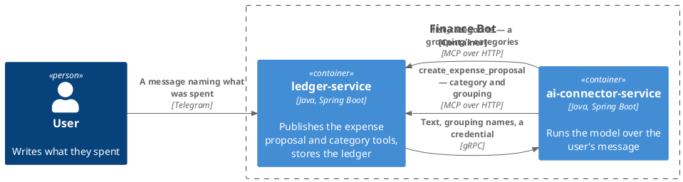
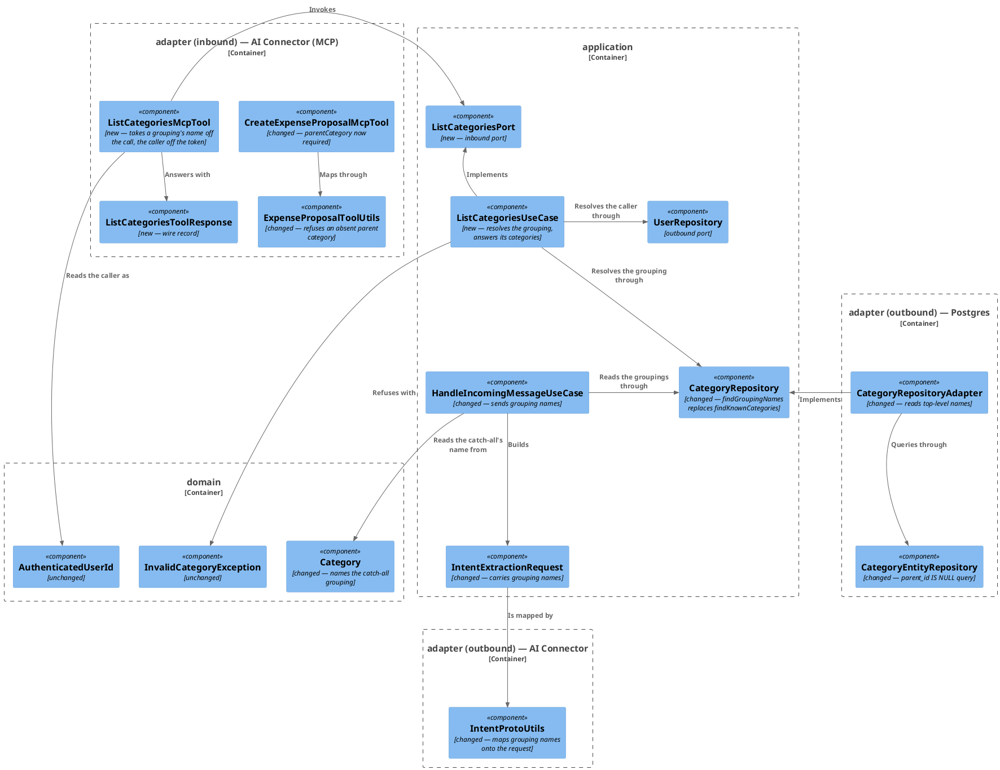
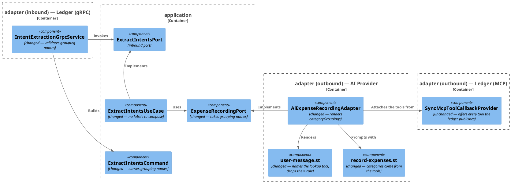
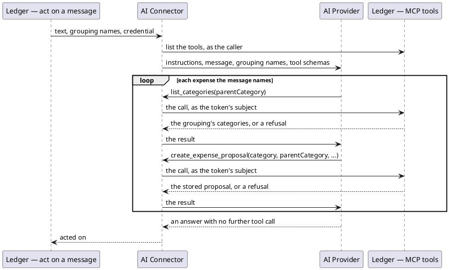
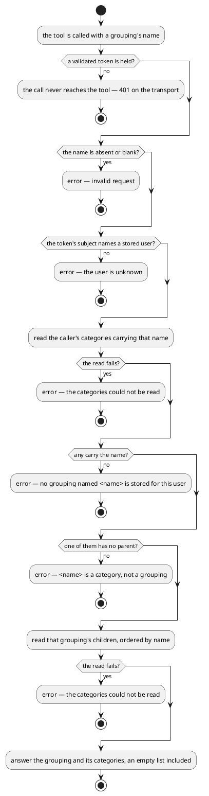

# Design: The Model Looks Up a Grouping's Categories

**Affected Modules:** `ledger-service`, `ai-connector-service`

## Objective

A user's default catalogue is 20 groupings holding about 90 categories, and today every one of them travels to the
model as a `Grouping > Category` label in one prompt line. The model has to pick one leaf out of ninety in a single
step, then split the label back into two arguments — and it picks badly.

This change sends the 20 grouping names instead, and gives the model a tool to ask which categories a grouping
holds. Choosing becomes two small choices instead of one large one: which grouping, then which of its handful of
categories. The `>` label disappears, and with it the splitting rule the prompt has to spell out.

## Context

What exists, and what this change builds on.

- **What travels today** — [`HandleIncomingMessageUseCase`](../../ledger-service/src/main/java/bot/finance/application/usecase/HandleIncomingMessageUseCase.java)
  reads `CategoryRepository.findKnownCategories(userId)`, whose query in
  [`CategoryEntityRepository`](../../ledger-service/src/main/java/bot/finance/adapter/persistence/CategoryEntityRepository.java)
  joins `category` to its parent and so returns **leaves only**, each as `(name, parentName)`. They cross as
  `repeated KnownCategory` in [`proto/intent_extraction.proto`](../../proto/intent_extraction.proto).
- **What the prompt does with them** —
  [`ExtractIntentsUseCase`](../../ai-connector-service/src/main/java/bot/finance/ai/application/usecase/ExtractIntentsUseCase.java)
  maps each to `KnownCategory.label()` → `"Groceries > Supermarkets"`, and
  [`user-message.st`](../../ai-connector-service/src/main/resources/prompts/user-message.st) tells the model that
  what follows the `>` is the `category` argument and what precedes it is the `parentCategory` argument.
- **The catalogue** — [`Category.defaults()`](../../ledger-service/src/main/java/bot/finance/domain/value/Category.java):
  20 groupings, each with 3–7 children, catch-all `Miscellaneous > Uncategorized Expenses`. Names repeat across
  groupings on purpose — `Travel` is both a grouping and `Insurance > Travel`, `Home` sits under `Insurance` while
  `Home Goods` sits under `Shopping`
  ([ADR 0003](../../ledger-service/docs/adr/0003-a-category-is-unique-per-user-and-parent-not-per-user.md)). The
  tree is exactly two levels.
- **The one tool that exists** —
  [`CreateExpenseProposalMcpTool`](../../ledger-service/src/main/java/bot/finance/adapter/mcp/CreateExpenseProposalMcpTool.java),
  declared with `@McpTool`/`@McpToolParam`, reading the caller off the token via
  [`AuthenticatedCallerUtils`](../../ledger-service/src/main/java/bot/finance/adapter/security/AuthenticatedCallerUtils.java)
  ([ADR 0007](../../ledger-service/docs/adr/0007-an-mcp-caller-is-identified-by-a-signed-token-not-a-tool-argument.md)),
  and rendering every failure as a `CallToolResult` error the model reads. Designed in
  [8-mcp-adapter-create-expense-proposal](../implemented/8-mcp-adapter-create-expense-proposal/design.md).
- **How a name resolves today** —
  [`CreateExpenseProposalUseCase.resolveCategoryId`](../../ledger-service/src/main/java/bot/finance/application/usecase/CreateExpenseProposalUseCase.java)
  looks the name up among the user's categories, narrows by `parentCategory` when given, and refuses on three
  counts: unknown, ambiguous (naming the groupings to retry with), and *a grouping* — which already answers with
  that grouping's children, read through `CategoryRepository.findChildNames`. The lookup this change turns into a
  tool therefore already exists as a refusal.
- **How the connector gets its tools** —
  [`LedgerMcpConfiguration`](../../ai-connector-service/src/main/java/bot/finance/ai/adapter/ledger/LedgerMcpConfiguration.java)
  builds one client for the process, and `AiExpenseRecordingAdapter` attaches
  `SyncMcpToolCallbackProvider` wholesale. **A tool added on the ledger is offered to the model with no change to
  the connector's wiring** — the list is read once per process
  ([ledger-mcp.md](../../ai-connector-service/docs/contracts/out/ledger-mcp.md)).
- **The nearest change to mirror** —
  [12-the-expense-tool-takes-the-amount-as-written](../implemented/12-the-expense-tool-takes-the-amount-as-written/design.md),
  which reshaped a tool argument in place and left the contract pages to `archive-knowledge`.

## Proposed Solution

Three moves: the extraction request carries grouping names; the ledger publishes a second MCP tool that answers a
grouping's categories; the prompts stop composing and splitting labels.

### The schema — `proto/intent_extraction.proto`

```proto
message ExtractIntentsRequest {
  string text = 1;
  // The groupings the caller's categories are filed under; must be non-empty. An expense is
  // filed under a category the `list_categories` tool answers for one of these, never under
  // the grouping itself.
  repeated string category_groupings = 2;
  // The grouping to fall back on when no other fits; must be non-blank and one of
  // `category_groupings`, so a fit always exists.
  string catch_all_grouping = 3;
  // ISO 4217 code applied when the user states an amount but no currency. Absent means
  // an amount without a currency is not acted on.
  optional string default_currency = 4;
}
```

The `KnownCategory` message is deleted.

### `ledger-service`

**Domain**

- **`domain/value/Category`** — gains `public static String catchAllGroupingName()`, answering `Miscellaneous`, and
  `defaults()` builds that grouping from the same constant so the two cannot drift.

**Application**

- **`application/port/CategoryRepository`** — `List<KnownCategory> findKnownCategories(long userId)` becomes
  `List<String> findGroupingNames(long userId)`. `findByUserIdAndName` and `findChildNames` are unchanged; the new
  use case is built out of the two of them.
- **`application/dto/KnownCategory`** — deleted.
- **`application/dto/IntentExtractionRequest`** — `List<KnownCategory> knownCategories` becomes
  `List<String> categoryGroupings`, and a `String catchAllGrouping` joins it. Its invariants become: the list
  non-null, non-empty, with no null and no blank element and copied; the catch-all non-blank and one of the
  groupings.
- **`application/port/ListCategoriesPort`** — new inbound port, `List<String> list(ListCategoriesCommand command)`.
- **`application/dto/ListCategoriesCommand`** — new, `(AuthenticatedUserId userId, String parentCategoryName)`;
  both required, the name not blank. The name is fixed by the ArchUnit rule
  `inboundPortCommandsAreNamedAfterTheirUseCase`.
- **`application/usecase/ListCategoriesUseCase`** — new, implementing `ListCategoriesPort` against
  `UserRepository` and `CategoryRepository`:

  | Step | Outcome                                                                                                  |
  |------|----------------------------------------------------------------------------------------------------------|
  | command absent, or its name blank | `InvalidCategoryException` — nothing is looked up                                   |
  | the token's subject names no user | `EntityNotFoundException`, as `CreateExpenseProposalUseCase` throws it              |
  | `findByUserIdAndName` returns nothing | `InvalidCategoryException` — `no grouping named <name> is stored for this user`  |
  | no candidate has an empty `parentName` | `InvalidCategoryException` — `<name> is a category, not a grouping` |
  | one candidate has an empty `parentName` | `findChildNames(id)`, ordered by name, returned as-is — an empty list included |

  At most one candidate can be a grouping: the unique index makes a name unique per user *and parent*, and the
  grouping's parent is null.
- **`application/usecase/HandleIncomingMessageUseCase`** — calls `findGroupingNames`, resolves the catch-all as
  `Category.catchAllGroupingName()` and passes both into `IntentExtractionRequest`. Groupings that do not carry
  that name raise `CatchAllGroupingMissingException`, which nothing catches (D23), so the connector is never
  reached and no report is sent.

**Adapters**

- **`adapter/persistence/CategoryEntityRepository`** — the projection query is replaced by:

  ```sql
  SELECT c.name
  FROM category c
  WHERE c.user_id = :userId
    AND c.parent_id IS NULL
    AND EXISTS (SELECT 1 FROM category child WHERE child.parent_id = c.id)
  ORDER BY c.name
  ```

  declared as `List<String> findGroupingNames(@Param("userId") Long userId)`. `findByParentId` gains
  `OrderByName`, so the tool's answer is stable too.
- **`adapter/persistence/KnownCategoryProjection`** — deleted; a `String` needs no projection record.
- **`adapter/persistence/CategoryRepositoryAdapter`** — `findKnownCategories` becomes `findGroupingNames`, keeping
  the `PersistenceFailedException` wrapper.
- **`adapter/mcp/ListCategoriesMcpTool`** — new, beside `CreateExpenseProposalMcpTool` and shaped like it:

  ```java
  @McpTool(
          name = "list_categories",
          description = "Lists the categories filed under one of the caller's groupings. An expense is filed "
                  + "under one of these, never under the grouping itself.")
  public CallToolResult listCategories(
          @McpToolParam(description = "the grouping's name, exactly as it was offered") String parentCategory)
  ```

  It reads the caller with `AuthenticatedCallerUtils.authenticatedUserId()`, calls `ListCategoriesPort`, and
  serializes `ListCategoriesToolResponse` with the shared `JsonMapper`. Failures are rendered as error results, in
  the same clause order the create tool uses:

  | Caught                       | Message                                    |
  |------------------------------|--------------------------------------------|
  | `InvalidCategoryException`   | the exception's own message                |
  | `InvalidUserException`       | `invalid request: ` + the message          |
  | `EntityNotFoundException`    | `the user is unknown`                      |
  | `PersistenceFailedException` | `the categories could not be read`         |
  | `RuntimeException`           | `the categories could not be listed`       |

- **`adapter/mcp/ListCategoriesToolResponse`** — new, `(String parentCategory, List<String> categories)`, e.g.
  `{"parentCategory":"Groceries","categories":["Household Supplies","Markets","Supermarkets"]}`.
- **`adapter/mcp/CreateExpenseProposalMcpTool`** — `parentCategory` loses `required = false` and is described as
  *"the grouping the category is filed under, exactly as `list_categories` was asked for it"* (D10). The `category`
  description drops "never a grouping", which the tool pair now says structurally.
- **`adapter/mcp/ExpenseProposalToolUtils.toCommand`** — an absent or blank `parentCategory` becomes
  `InvalidExpenseProposalException("expense proposal request has no parent category")`, checked beside the amount
  and before any lookup. `CreateExpenseProposalCommand.parentCategoryName` is a plain `String`, and
  `CreateExpenseProposalUseCase.resolveCategoryId` loses its ambiguity and is-a-grouping branches, both
  unreachable once the parent name is always present (D10).
- **`adapter/aiconnector/IntentProtoUtils`** — `toProtoRequest` calls `builder.addAllCategoryGroupings(...)` and
  `setCatchAllGrouping(...)`; the private `toProtoKnownCategory` is deleted.
- **`adapter/config/UseCaseConfiguration`** — a `@Bean` for `ListCategoriesUseCase`.

### `ai-connector-service`

- **`application/dto/KnownCategory`** — deleted, and with it `label()` — the `>` composition this change removes.
- **`application/dto/ExtractIntentsCommand`** — `List<KnownCategory> knownCategories` becomes
  `List<String> categoryGroupings`, with a `String catchAllGrouping` beside it. Rejects a null, empty,
  null-carrying or blank-carrying list, and a catch-all that is blank or not among the groupings.
- **`application/port/ExpenseRecordingPort`** — `record(String text, List<String> categoryGroupings,
  String catchAllGrouping, Optional<CurrencyCode> assumedCurrency)`.
- **`application/usecase/ExtractIntentsUseCase`** — passes the names straight through; the mapping to labels is
  gone and the log line counts groupings offered.
- **`adapter/grpc/IntentExtractionGrpcService`** — reads `getCategoryGroupingsList()` and `getCatchAllGrouping()`,
  rejecting as `INVALID_ARGUMENT`: `Category groupings must not be empty`, `Category groupings must not contain a
  blank name`, `Catch-all grouping must not be blank`, `Catch-all grouping must be one of the category groupings`.
- **`adapter/ai/AiExpenseRecordingAdapter`** — the template variables become `categoryGroupings` and
  `catchAllGrouping`.
- **`resources/prompts/user-message.st`**:

  ```
  Category groupings the user has: {categoryGroupings}

  Every expense is filed under a category inside one of these, never under a grouping itself. Pick the grouping
  first, then call the list_categories tool for it and file the expense under one of the categories it answers,
  sending that grouping as the parent category. If no grouping fits the expense, use {catchAllGrouping}. Never
  invent a name.

  Currency to assume when the user states an amount without one: {assumedCurrency}

  Message: {text}
  ```

- **`resources/prompts/record-expenses.st`** — two edits. "from the message and the categories you were given"
  becomes "from the message and the categories the tools answer for the groupings you were given"; and the retry
  sentence is scoped to the recording call (D25):

  ```
  A refused recording call answers with an error saying what to retry with. Correct that call and try the same
  expense once more; if it is refused again, leave that expense and go on to the next one. A refused category
  lookup costs the expense nothing — correct the grouping's name and ask again.
  ```

### Diagrams

The two services and what crosses between them:



`ledger-service` — the new tool and the reshaped read:



`ai-connector-service` — the label composition removed:



The turn's exchange — who calls whom:



What `list_categories` decides:



## Decisions

- **D1:** What does the extraction request carry — every category, or the groupings only?
- Answer: The groupings only: `repeated string category_groupings`, one name each, no parent, no `>`.
- Basis: decided — the user proposed sending parent-level categories and having the model query a new MCP tool for
  the rest (2026-08-04).

- **D2:** Does the grouping list keep field number 2, or take a new one?
- Answer: It takes number 2, and no tag is reserved. The message reads `text = 1`, `category_groupings = 2`,
  `catch_all_grouping = 3`, `default_currency = 4`.
- Basis: decided — this review (2026-08-04) overturned the earlier `category_groupings = 4` with `reserved 2` and
  `reserved "known_categories"`. Neither service is in production, so there is no deployed counterpart of the
  other vintage for a reused tag to confuse, and wire compatibility across a partial deploy buys nothing. A
  reservation with nothing to protect is one more thing every reader has to account for.

- **D3:** Does the ledger still refuse the turn when the user has nothing to file under?
- Answer: Yes, unchanged in shape — an empty grouping list makes `IntentExtractionRequest` throw before the
  connector is reached, and the message is answered with no report.
- Basis: assumed — the rule and its outcome row already exist in
  [handle-incoming-message.md](../../ledger-service/docs/usecases/handle-incoming-message.md) ("Request refused"),
  and every user's groupings are created with them by `Category.defaults()`.

- **D4:** What is the new tool called, and what does it take?
- Answer: `list_categories`, taking one required argument `parentCategory` — the grouping's name.
- Basis: assumed — `create_expense_proposal` already calls a grouping `parentCategory` in its own arguments
  ([mcp.md](../../ledger-service/docs/contracts/in/mcp.md)); a second vocabulary across two tools in one list is
  what a model gets wrong.

- **D5:** Where does the lookup live — in the tool, or behind an inbound port?
- Answer: Behind one: `ListCategoriesPort` implemented by `ListCategoriesUseCase`, driven by
  `ListCategoriesMcpTool`.
- Basis: assumed — the ArchUnit rule `adaptersReachUseCasesThroughPorts` and the layering rules in
  [architecture.md](../../ledger-service/docs/conventions/architecture.md) forbid an adapter reaching the
  application any other way; an inbound adapter calling `CategoryRepository` directly would skip the application
  layer entirely.

- **D6:** How does the tool answer a name that is a category rather than a grouping — `Supermarkets`, or `Travel`,
  which is both?
- Answer: `Travel` resolves: among the rows carrying the name, the one with no parent is the grouping, and its
  children are answered. A name carried only by leaves is refused with `<name> is a category, not a grouping`.
- Basis: assumed — the unique index on `(user_id, parent_id, name)` with `NULLS NOT DISTINCT`
  ([ADR 0003](../../ledger-service/docs/adr/0003-a-category-is-unique-per-user-and-parent-not-per-user.md)) admits
  at most one parentless row per name, and `Category.defaults()` contains exactly this collision.

- **D7:** How does it answer an unknown grouping name — an error, or an empty list?
- Answer: An error naming what was asked for, so the model can correct the spelling and retry.
- Basis: assumed — `CreateExpenseProposalUseCase` already refuses an unknown name that way, and
  [ledger-mcp.md](../../ai-connector-service/docs/contracts/out/ledger-mcp.md) has the model correct a refused call
  and retry it once. An empty list would read as "this grouping is empty" and send the model looking elsewhere.

- **D8:** How does it answer a grouping that genuinely holds no categories?
- Answer: A successful result with an empty `categories` list.
- Basis: assumed — a grouping with no children is a real state of the store (`Category.group(name)` admits it, and
  nothing prunes an empty one), and it is not a failure of the call. The model then picks another grouping.

- **D9:** Does the new tool need the message reference off the token?
- Answer: No. It reads only `AuthenticatedCallerUtils.authenticatedUserId()`; a call whose token carries no
  readable reference still lists categories.
- Basis: assumed — the reference exists to tie *stored* proposals to a message
  ([ADR 0010](../../ledger-service/docs/adr/0010-a-message-reference-rides-the-caller-token-not-the-extraction-request.md));
  this tool stores nothing. The filter chain still requires a valid token, so the call is no less authenticated.

- **D10:** Is a category name still resolvable by name alone on `create_expense_proposal`, or is `parentCategory`
  made required now that the model always knows the grouping?
- Answer: Required, all the way down. `parentCategory` loses `required = false`; `ExpenseProposalToolUtils`
  refuses an absent or blank one as an invalid request before any lookup runs; and
  `CreateExpenseProposalCommand.parentCategoryName` is a plain `String`, non-blank by its own compact
  constructor, rather than an `Optional<String>` that is always present. `resolveCategoryId` therefore always
  narrows by parent, and its *ambiguity* and *is-a-grouping* branches are **removed** rather than kept as guards.
- Basis: decided — the user chose making it required over leaving it optional (2026-08-04); this review
  (2026-08-04) followed the consequence through the command and the use case. With a parent name always present,
  a grouping row (whose parent name is empty) can never survive the filter, and the unique index on
  `(user_id, parent_id, name)` admits at most one row per name-and-parent — so neither branch is reachable, and
  an unreachable branch is dead code rather than a guard. A name that resolves only to a grouping now takes the
  parent-mismatch refusal. [mcp.md](../../ledger-service/docs/contracts/in/mcp.md) permits the change in place
  because the tool and its one caller ship together.

- **D11:** Does the connector need wiring for the new tool?
- Answer: No. `AiExpenseRecordingAdapter` attaches `SyncMcpToolCallbackProvider` wholesale, so a tool the ledger
  publishes is offered to the model with no connector change beyond the prompts.
- Basis: assumed — `LedgerMcpConfiguration` builds one client with no per-tool registration, and
  [ledger-mcp.md](../../ai-connector-service/docs/contracts/out/ledger-mcp.md) records that the tools are read
  from the published list.

- **D12:** What does a connector process holding the old tool list do after this ships?
- Answer: It offers only `create_expense_proposal` while holding grouping names, so the model sends a grouping as
  the `category` and no `parentCategory`. The tool refuses that as an invalid request, and nothing the model
  holds lets it correct the call, so those expenses go unrecorded until the connector process restarts.
- Basis: decided — this review (2026-08-04). The earlier answer had the model recover on its one retry through
  the "is a grouping, retry with one of its children" refusal, which D10 removed as unreachable. Neither service
  is in production (D2), so a window in which one side holds a stale tool list is a restart away from closing and
  is not worth a branch kept alive for it.

- **D13:** Given D12, is a tool needed at all — the refusal already answers a grouping's children?
- Answer: Yes, the tool stays, and it is now the only way a grouping's children are ever answered: this review
  (2026-08-04) removed the refusal that used to name them (D10).
- Basis: assumed — the one-retry policy is stated in `ledger-mcp.md` and
  [extract-intents.md](../../ai-connector-service/docs/usecases/extract-intents.md) ("refused a second time is left
  unrecorded"). Discovery through a refusal spent the model's one retry per expense on it, and the refusal named
  only the children, not which grouping was worth asking about.

- **D14:** Does the catch-all survive when only groupings travel?
- Answer: Yes, at the grouping level: the ledger names it on the request and the prompt renders that name, so
  choosing it answers `Uncategorized Expenses` from `list_categories`. See D23 for how it is named.
- Basis: assumed — `Category.defaults()` gives `Miscellaneous` exactly one child, so a grouping-level catch-all
  still lands the expense on a category.

- **D15:** In what order do the groupings travel?
- Answer: Alphabetically, by the query's `ORDER BY c.name`. No rule in the prompt depends on the position of a
  grouping in the list.
- Basis: assumed — `Category.defaults()`'s authored order is not preserved by any current query
  (`findKnownCategories` has no `ORDER BY`), so no order is promised today; a positional rule in the prompt would
  break the first time a user's categories are edited.

- **D16:** Is the model told to list a grouping once per turn, or before every proposal?
- Answer: The prompt says to look up a grouping's categories before filing under it, and nothing forbids reusing a
  listing already in the turn's context.
- Basis: deferred — how often a model re-lists is not decided here and both behaviours are correct; what it costs
  in latency and tokens is what would bring it back, measured against turns in the log.

- **D17:** Does anything stored change?
- Answer: No. No migration, no column, no entity. The change is a read shape, a prompt, and one added tool.
- Basis: assumed — `category` already stores the tree the new query reads with `parent_id IS NULL`
  ([V001](../../ledger-service/src/main/resources/db/migration/V001__create_user_and_category.sql)).

- **D18:** Does the Telegram report change?
- Answer: No. `ProposalReportUtils` reads what a proposal stored, not what the model was offered.
- Basis: assumed — the report is built from `ProposalSummary` rows read back under the message reference
  ([handle-incoming-message.md](../../ledger-service/docs/usecases/handle-incoming-message.md)), which this change
  does not touch.

- **D19:** The MCP boundary is documented as one a model can only *propose an expense* across — does adding a read
  need recording?
- Answer: The sentence is wrong once this ships and the contract page is rewritten; the boundary now also answers
  which categories a caller's own grouping holds. No new decision record is proposed here.
- Basis: assumed — [mcp.md](../../ledger-service/docs/contracts/in/mcp.md) states it as a contract fact, not as a
  decision record; `docs/adr/0008` hands *expense recording* to the model and is untouched. The
  [ADR conventions](../../docs/conventions/adr.md) and
  [agent.md](../../ledger-service/docs/conventions/agent.md) put contract behaviour on the contract page rather
  than in an ADR.

- **D20:** When are the contract, use-case and domain pages rewritten?
- Answer: After implementation, not in this change. Stale the moment it ships:
  [mcp.md](../../ledger-service/docs/contracts/in/mcp.md) (a second operation with its arguments and failures, and
  `parentCategory` now required on the first),
  [ledger-mcp.md](../../ai-connector-service/docs/contracts/out/ledger-mcp.md),
  [intent-extraction.md](../../ai-connector-service/docs/contracts/in/intent-extraction.md) and
  [ai-connector.md](../../ledger-service/docs/contracts/out/ai-connector.md) (what the request carries),
  [extract-intents.md](../../ai-connector-service/docs/usecases/extract-intents.md) (the closed-set and catch-all
  rules, and its diagrams), [handle-incoming-message.md](../../ledger-service/docs/usecases/handle-incoming-message.md)
  (what travels), and a new use-case page for `ListCategoriesUseCase`.
- Basis: assumed — [agent.md](../../ledger-service/docs/conventions/agent.md) Post-Implementation Actions runs
  `archive-knowledge` over the finished plan, which owns those pages; the same split was used in
  [12-the-expense-tool-takes-the-amount-as-written](../implemented/12-the-expense-tool-takes-the-amount-as-written/design.md)
  (D25).

- **D21:** Which tests move with the contract?
- Answer: `ledger-service` — `CategoryRepositoryAdapterTest`, `HandleIncomingMessageUseCaseTest`,
  `IntentProtoUtilsTest`, `IntentExtractionRequestTest`, `AiConnectorIntentExtractionAdapterTest`,
  `CategoryRowUtils`, `CategoryTest`, and — for the required `parentCategory` (D10) —
  `ExpenseProposalToolUtilsTest`, `CreateExpenseProposalMcpToolTest`, `McpRequests`,
  `CreateExpenseProposalMcpToolSystemTest`, `McpAuthenticationSystemTest`,
  `ReceiveTelegramMessageSystemTest`. New: tests for `ListCategoriesUseCase`, `ListCategoriesCommand` and
  `ListCategoriesMcpTool`, and a system test for the tool beside the create tool's.
  `ai-connector-service` — `ExtractIntentsCommandTest`, `ExtractIntentsUseCaseTest`,
  `IntentExtractionGrpcServiceTest`, `AiExpenseRecordingAdapterTest`, `RequestFixtures`, `McpLedgerStubs`
  (publishing `list_categories` in the stubbed tools list and `parentCategory` as required) and
  `ExtractIntentsSystemTest`; `KnownCategoryTest` is deleted in both.
- Basis: assumed — every one of these files names `KnownCategory`, `knownCategories`, `parentCategory`, the
  catch-all, or the stubbed tools list today.

- **D22:** The prompt block in Proposed Solution still says "If no grouping fits the expense, use the last
  grouping in the list" — which grouping is that?
- Answer: `Work` — so the sentence is gone. `user-message.st` renders `{catchAllGrouping}`, the name the ledger
  puts on the request (D23), and no rule in the prompt is positional.
- Basis: assumed — the new query orders by `c.name`, so the last of `Category.defaults()`'s 20 groupings
  alphabetically is `Work` (`Miscellaneous` lands twelfth). A positional catch-all rule would file every
  unmatched expense under a work grouping.

- **D23:** With the positional rule gone, how does the model learn which grouping is the catch-all?
- Answer: The ledger designates it on the request. `catch_all_grouping` is a field of `ExtractIntentsRequest`,
  filled by `HandleIncomingMessageUseCase` from `Category.catchAllGroupingName()`, and the connector renders it
  into the prompt as `{catchAllGrouping}`. Both sides refuse a request whose catch-all is blank or absent from
  the grouping list, so "a fit always exists" is an invariant rather than a hope. **Groupings that do not carry
  that name are a broken invariant, not a case to paper over:** `HandleIncomingMessageUseCase` throws
  `CatchAllGroupingMissingException`, a domain exception nothing catches, so the turn ends with no report rather
  than with a catch-all the catalogue never designated.
- Basis: decided — the user chose a ledger-designated field over hard-coding `Miscellaneous` in the connector's
  prompt and over dropping the guarantee (2026-08-04); this review (2026-08-04) replaced the earlier "the first
  grouping read otherwise" fallback with the throw. The catch-all grouping may not be deleted — nothing in the
  ledger edits a category at all — so its absence is a state the code should not be able to reach, and falling
  back would file every unmatched expense under whatever grouping sorts first. It propagates as
  `PersistenceFailedException` already does, since a broken invariant is not a failed turn to be reported.
  Consequence for **D3**: a user with no groupings at all reaches this throw before the request constructor, so
  the empty-list refusal is `CatchAllGroupingMissingException` rather than `InvalidExtractionRequestException`.
  The outcome is unchanged — the connector is never reached and no report is sent.

- **D24:** What does doubling the calls per expense cost against the deadline the turn runs under?
- Answer: A turn now needs at least two provider round trips and two ledger calls per expense instead of one of
  each. The binding limit is the 60s gRPC deadline on the `ai-connector` channel, not the token: its TTL is 2m,
  so a token cannot expire mid-turn behind a deadline a third its length. A turn that overruns is
  `DEADLINE_EXCEEDED` at the ledger, which is `IntentExtractionFailedException` and a `PARTIAL` or `FAILED`
  report over whatever was recorded before it — the same shape as any unfinished turn.
- Basis: assumed — `ledger-service/src/main/resources/application.yaml` sets `deadline: 60s` and
  `mcp.token.ttl: 2m`; `HandleIncomingMessageUseCase.outcomeFor` and
  [handle-incoming-message.md](../../ledger-service/docs/usecases/handle-incoming-message.md) give the outcome.
  Nothing caps how many times the model may call `list_categories` in a turn; the deadline is the only bound.

- **D25:** Does a refused `list_categories` call spend the expense's one retry?
- Answer: No. `record-expenses.st`'s retry sentence is rewritten to name the *recording* call, and to say a
  refused lookup costs the expense nothing — the model corrects the grouping's name and asks again. The one-retry
  budget stays exactly one, on `create_expense_proposal`.
- Basis: decided — the user chose scoping the retry to recording calls over spending one retry across everything
  that happens to one expense (2026-08-04). A mistyped grouping is a correctable typo, not a rejected expense, and
  the budget exists to stop a model looping on a proposal the ledger will not take. `extract-intents.md`'s rule
  is reworded to match by D20's archiving step.

- **D26:** What does `ListCategoriesMcpTool` log?
- Answer: The same two lines the create tool writes — the call's arguments at debug on entry, and a warn naming
  the exception's class and message on every refusal. The design's tool spec names no logging.
- Basis: assumed — `CreateExpenseProposalMcpTool` logs exactly that, and
  [mcp.md](../../ledger-service/docs/contracts/in/mcp.md) states it as a contract fact: "Every rejection is
  logged with the kind of failure, and with neither the arguments nor the token. A call's arguments reach the
  log only at debug level."

- **D27:** What does the same `list_categories` call arriving twice, or two of them at once, do?
- Answer: Nothing. The tool reads and stores nothing, so a duplicate, a redelivery, or a retry after a timeout
  whose first attempt succeeded all answer the same list and leave no second row anywhere.
- Basis: assumed — `mcp.md`'s "the tool is not idempotent: the same call made twice stores two proposals" is a
  statement about `create_expense_proposal`; the contract page needs the read's own line, which D20 already
  routes to `archive-knowledge`.

- **D28:** Can the grouping list a turn was handed go stale while the turn runs?
- Answer: No. Category rows are written only when a user is first created — `InitializeUserUseCase` calls
  `userRepository.create(User.newUser(externalId), Category.defaults())` and `UserRepositoryAdapter` inserts the
  groupings and their children there. Nothing renames, moves or deletes one, so a name offered at the start of a
  turn still resolves at the end of it.
- Basis: assumed — `Category.defaults()` has one caller and `CategoryEntity` is constructed nowhere else;
  `create-an-expense-proposal.md` and `initialize-a-new-user.md` describe no edit path. A category-editing use
  case would bring the read-then-write gap between `findGroupingNames` and the tool call back into scope.

- **D29:** What happens in the other deploy order — a new connector against a ledger still sending
  `known_categories`?
- Answer: Nothing has to. With no reservation (D2) the old `known_categories` and the new `category_groupings`
  share tag 2, so a mixed pair would read a length-delimited message as a string rather than failing cleanly —
  which is why the two are only ever released together. Neither service is deployed anywhere for the window to
  open in.
- Basis: decided — this review (2026-08-04) replaced the earlier answer, which relied on the reservation to make
  both deploy orders fail loudly. Wire compatibility across a partial deploy is a property nothing in this
  repository is paying for today.

- **D30:** What does the model see when it files under `Travel` after listing `Insurance`, without sending
  `parentCategory`?
- Answer: `several categories named Travel exist, retry with parentCategory naming one of: , Insurance` — the
  grouping candidate renders as an empty string, so the refusal opens with a bare comma and names only one of the
  two options it is asking the model to choose between.
- Basis: assumed — `CreateExpenseProposalUseCase.groupingsOf` maps `parentName()` through `orElse("")`, and
  `Category.defaults()` makes `Travel` the one default name that is both a grouping and a leaf. The old flow
  reached that refusal rarely because the label already carried the grouping; the new flow reaches it whenever
  the model omits the argument. D10 makes the argument required, so the refusal is unreachable through the tool.
  This review (2026-08-04) removed that branch and `groupingsOf` with it, so the malformed message no longer
  exists to leave as it stands; `Travel` under a grouping that does not hold it now takes the parent-mismatch
  refusal, which names both the category and the grouping asked for.

- **D31:** Does a `list_categories` refusal end the turn?
- Answer: No. It is an `isError` `CallToolResult`, a successful call carrying an error, so it reaches the model
  as that call's answer exactly as a create refusal does. Only an `McpTransportException` ends the turn.
- Basis: assumed — `LedgerToolFailureProcessor` rethrows only when an `McpTransportException` is in the cause
  chain and returns the message otherwise, and the new tool renders every failure as a result rather than
  throwing, so no change to the failure policy is needed.

- **D32:** Whose categories can a caller list?
- Answer: Only their own. `findByUserIdAndName` is scoped to the token's subject, and `findChildNames` is handed
  an id that came out of that scoped read, so an id belonging to another user is never reachable through the
  tool.
- Basis: assumed — the tool takes no identity argument
  ([ADR 0007](../../ledger-service/docs/adr/0007-an-mcp-caller-is-identified-by-a-signed-token-not-a-tool-argument.md)),
  and `/mcp/**` is `authenticated()` in `SecurityConfiguration`, so an untokened call never reaches it.

- **D33:** A grouping name that resolves to nothing is a reference to something not stored — why is that
  `InvalidCategoryException` and not `EntityNotFoundException`?
- Answer: `InvalidCategoryException`, matching the sibling lookup. The repository's split is by what the caller
  supplied, not by whether a row was found: `EntityNotFoundException` is constructed only from an **id** — the
  external id in `CreateExpenseUseCase`/`CreateExpenseProposalUseCase`, and the `category_id`/`user_id` foreign
  keys in `ExpenseRepositoryAdapter`/`ExpenseProposalRepositoryAdapter`, all reading `no <entity> stored for id
  <n>` — while a **name the caller chose** that resolves to nothing is `InvalidCategoryException`, reading `no
  category named <name> is stored for this user`. The two mean different recoveries at the tool: an invalid
  category is an argument the model corrects and re-asks (D25), a not-found is an identity on the token that
  nothing the model sends can fix.
- Basis: assumed — `CreateExpenseProposalUseCase.resolveCategoryId` throws `InvalidCategoryException` from this
  exact `findByUserIdAndName` call, and `CreateExpenseProposalMcpTool` renders `EntityNotFoundException` as *"the
  user is unknown"*; a grouping typo reaching that clause would tell the model the caller does not exist, and
  telling the two apart would mean branching on `entityType()`.
  [code-style.md](../../ledger-service/docs/conventions/code-style.md) states the rule as "a reference to
  something that is not stored raises a not-found domain exception, in the use case that looks it up" without
  distinguishing an id from a caller-supplied name — the convention line wants the id/name split spelled out, and
  the plan's post-implementation step should carry that edit.

- **D34:** Is a grouping that holds no categories offered to the model?
- Answer: No. `CategoryEntityRepository.findGroupingNames` keeps only groupings with at least one child, through
  an `EXISTS` clause on the child rows, still `ORDER BY c.name`.
- Basis: decided — this review (2026-08-04). Offering a grouping the model can pick and then find empty spends a
  provider round trip and a ledger call to learn nothing, and the prompt has no rule for what to do next.
  Filtering at the read is the only place that knows; `list_categories` keeps answering an empty list for such a
  grouping (D8), now as a guard on a path the normal flow no longer reaches.

- **D35:** Should a grouping and a category be separate domain types, rather than one `Category` whose children
  list happens to be empty?
- Answer: Not here. The distinction is currently carried by an empty `parentName` on a read and an empty
  `children` list on `Category`, and every rule about it — which resolves, which is refused, which travels — is
  written in the use cases rather than in the type.
- Basis: deferred — the reviewer raised it (2026-08-04) and it is going to its own `design-task` rather than
  being folded in. It reaches the domain type, both persistence reads, the two use cases that resolve a name and
  every test that builds a `StoredCategory`, so it is a change of its own size with its own trade-offs, and
  nothing in this change is blocked on it.

## Design Findings

Grilled (2026-08-04): nothing to raise on data, lifecycle, business invariants.
