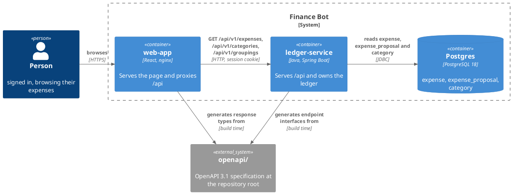
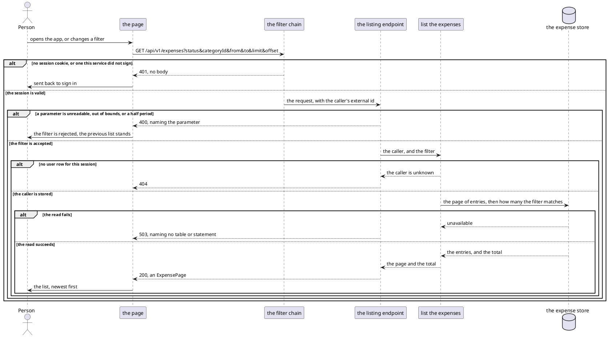
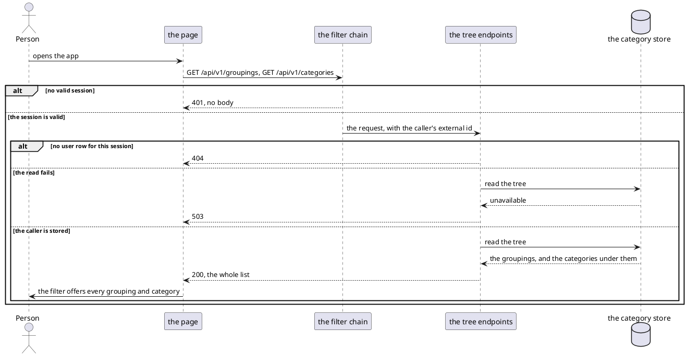

# Design: Browse Recorded Expenses

**Affected Modules:** `ledger-service`, `web-app`

**Shared artifact:** the OpenAPI specification under repo-root `openapi/`. `ledger-service` generates the endpoint
interfaces it implements from it. `web-app` generates the response types it fetches into. Neither module owns it,
so it lands on its own before either module's work. Nothing else crosses between the two.

## Objective

A signed-in person opens the web app and sees what the ledger holds for them. Every expense already recorded and
every proposal still awaiting a decision, newest first, narrowed by a filter.

The ledger serves that list over HTTP under `/api`. It also serves read-only lists of the person's groupings and
categories, so the filter has something to offer and each row can name its category.

## Context

Three shapes already exist and this change mirrors them.

**The session API** — [`SessionController`](../../ledger-service/src/main/java/bot/finance/adapter/web/SessionController.java)
under `/api/session`, on its own filter chain in
[`SecurityConfiguration`](../../ledger-service/src/main/java/bot/finance/adapter/security/SecurityConfiguration.java)
ending in `anyRequest().denyAll()`. Its errors are mapped by
[`WebExceptionHandler`](../../ledger-service/src/main/java/bot/finance/adapter/web/WebExceptionHandler.java). Its
caller is identified by `AuthenticatedCaller.authenticatedUserId()`. Its contract is
[A person signing in from a browser](../../ledger-service/docs/contracts/in/web-session-api.md), and it holds no
schema file — this change gives that boundary one.

**The MCP read tools** —
[`ListCategoriesUseCase`](../../ledger-service/src/main/java/bot/finance/application/usecase/ListCategoriesUseCase.java)
resolves the caller's user row by external id, then reads the category tree. The new reads are the same shape.

**Contract-first codegen** — the repo-root `proto/` schema is shared by both services and generated into `build/`,
never committed ([ADR 0002](../adr/0002-the-intent-extraction-schema-lives-at-the-repository-root.md)).

Three facts about the store this change reads from:

- **A pending expense is a row in `expense_proposal`.** Accepting one deletes it and inserts the same values into
  `expense` in a single statement
  ([`ExpenseProposalEntityRepository.accept`](../../ledger-service/src/main/java/bot/finance/adapter/persistence/ExpenseProposalEntityRepository.java),
  [ADR 0012](../../ledger-service/docs/adr/0012-a-set-of-rows-moves-between-tables-in-one-statement.md)). "Pending"
  and "recorded" are two tables, not a column.
- **Both tables carry `category_id NOT NULL REFERENCES category (id)`**
  ([`V002`](../../ledger-service/src/main/resources/db/migration/V002__create_expense.sql),
  [`V003`](../../ledger-service/src/main/resources/db/migration/V003__create_expense_proposal.sql)). A category is a
  `category` row whose `parent_id` names its grouping
  ([ADR 0003](../../ledger-service/docs/adr/0003-a-category-is-unique-per-user-and-parent-not-per-user.md)).
- **Both tables index `(user_id, created_at DESC)`**, which narrows each arm of the read to one person's rows.
  Neither index carries `status`, `id` or `category_id`, so the union's ordering is a sort rather than a walk (D42).

The browser sees one origin
([ADR 0014](../adr/0014-the-web-app-and-the-ledger-are-served-from-one-origin.md)), so every path below is relative.

## Proposed Solution

### What the change adds

Three read endpoints under a versioned path, described by a specification both modules generate from.

| Endpoint                 | Takes                                                     | Answers                            |
|--------------------------|-----------------------------------------------------------|------------------------------------|
| `GET /api/v1/expenses`   | `status`, `categoryId`, `from`, `to`, `limit`, `offset`   | a page of expenses, newest first   |
| `GET /api/v1/categories` | optional `groupingId`                                     | every category, unpaged (D20)      |
| `GET /api/v1/groupings`  | nothing                                                   | every grouping, unpaged (D20)      |

The existing session endpoints move to `/api/v1/session` and are described by the same specification (D8, D36).

The specification is layered under repo-root `openapi/`, so a change to one concern touches one file:

```
openapi/
├── ledger-api.yaml                        info, servers, security schemes, tags, and the path $refs
├── paths/
│   ├── expenses.yaml                      GET /api/v1/expenses
│   ├── categories.yaml                    GET /api/v1/categories
│   ├── groupings.yaml                     GET /api/v1/groupings
│   └── session.yaml                       POST, GET and DELETE /api/v1/session
└── components/
    ├── schemas/
    │   ├── expense.yaml                   Expense, ExpenseStatus, ExpensePage
    │   ├── category.yaml                  Category, Grouping
    │   ├── session.yaml                   Session, TelegramLoginPayload
    │   └── problem.yaml                   Problem
    ├── parameters/
    │   ├── paging.yaml                    Limit, Offset
    │   └── expense-filters.yaml           StatusFilter, CategoryIdFilter, FromFilter, ToFilter
    └── responses/
        └── errors.yaml                    BadRequest, Unauthorized, ServiceUnavailable
```

`Unauthorized` declares no content: a filter writes that response before any handler runs (D38). Every other error
response carries a `Problem`.

One tag per path file — `expenses`, `categories`, `groupings`, `session` — and one generated interface per tag.
Every file outside `ledger-api.yaml` is reached by a relative `$ref` and holds no `paths` of its own.

### Diagrams

Both modules take the repository's [Diagram Format](../conventions/diagrams.md) unchanged. No component diagram
appears here: classes belong to the plan.

#### Container — what this change reaches



#### Flow — listing expenses

The arms differ in who takes part, so this is a sequence diagram rather than an activity diagram.



#### Flow — the category tree



### Details

#### `ledger-service` — what the wire carries

| `Expense` field    | Meaning                                                        |
|--------------------|-----------------------------------------------------------------|
| `id`               | unique within its `status`, never across the two (D3)           |
| `status`           | `PENDING` or `RECORDED`                                         |
| `categoryId`       | the category as an id, with no name and no grouping (D7)        |
| `description`      | what was bought                                                 |
| `merchant`         | optional                                                        |
| `amountMinorUnits` | the amount in the currency's minor units                        |
| `currency`         | the ISO code                                                    |
| `createdAt`        | when the row was recorded, not when the money was spent (D27)   |

| `ExpensePage` field | Meaning                                                     |
|---------------------|--------------------------------------------------------------|
| `items`             | the page of expenses, newest first                           |
| `limit`             | the page size that was applied                               |
| `offset`            | the offset that was applied                                  |
| `total`             | how many rows the filter matches, ignoring `limit`/`offset`  |

A `Category` carries `id`, `name`, `groupingId` and `groupingName`. A `Grouping` carries `id` and `name`.

`TelegramLoginPayload` is an object of string values with `additionalProperties: true` — the whole payload
[the session contract](../../ledger-service/docs/contracts/in/web-session-api.md) requires. `Problem` is
`{ "message": string }`, served as `application/json` (D35).

#### `ledger-service` — what the filter accepts

| Parameter    | Accepts                                    | Refuses                                                    |
|--------------|--------------------------------------------|------------------------------------------------------------|
| `status`     | `PENDING` or `RECORDED`, or absent         | any other word                                             |
| `categoryId` | any id, or absent                          | a value that is not a number                               |
| `from`, `to` | two `YYYY-MM-DD` days, or neither (D24)    | one without the other, or `to` before `from`               |
| `limit`      | `1` to the maximum, defaulting to 50 (D4)  | zero, negative, or above the maximum — never clamped       |
| `offset`     | zero or more                               | a negative offset                                          |

The maximum page size is declared twice and the two must agree: the domain filter's own constant, and `maximum` on
the `Limit` parameter in `openapi/components/parameters/paging.yaml`.

#### `ledger-service` — what the caller gets

The advice at
[`WebExceptionHandler`](../../ledger-service/src/main/java/bot/finance/adapter/web/WebExceptionHandler.java) covers
all of `bot.finance.adapter.web` and ends in an `Exception.class` handler returning 500. So each mapping below must
be declared before that handler claims it (D25).

| Status | Raised by                                                                       |
|--------|----------------------------------------------------------------------------------|
| 400    | a limit or offset out of bounds — a new invalid-filter exception                 |
| 400    | a half or inverted date range — `InvalidSpendingPeriodException`                 |
| 400    | query-parameter binding — `MethodArgumentTypeMismatchException`, `HandlerMethodValidationException` |
| 401    | no session, refused by the filter chain before the endpoint is reached (D13)     |
| 404    | a session outliving its user row — `EntityNotFoundException` (D10)               |
| 503    | the read failed — `PersistenceFailedException` (D11)                             |

Each 400 message is composed by this module from the parameter's name and the bound it broke, never echoed from
the exception (D41). The 401 alone carries no body: a filter refuses the request before any advice sees it (D38).

Every message and log line in the advice is reworded to stop naming the session (D26). It answers "the service is
temporarily unable to store the session" today, which is wrong for a read that stores nothing.

#### `ledger-service` — the listing query

One `UNION ALL` with a literal status column and no `category` join (D7):

```sql
SELECT 'RECORDED' AS status, e.id AS id, e.category_id AS category_id, e.description AS description,
       e.merchant AS merchant, e.amount_minor_units AS amount_minor_units,
       e.currency_code AS currency_code, e.created_at AS created_at
FROM expense e
WHERE e.user_id = :userId
  AND (CAST(:status AS VARCHAR) IS NULL OR :status = 'RECORDED')
  AND (CAST(:categoryId AS BIGINT) IS NULL OR e.category_id = :categoryId)
  AND (CAST(:from AS TIMESTAMPTZ) IS NULL OR e.created_at >= :from)
  AND (CAST(:toExclusive AS TIMESTAMPTZ) IS NULL OR e.created_at < :toExclusive)
UNION ALL
SELECT 'PENDING', ep.id, ep.category_id, ep.description, ep.merchant,
       ep.amount_minor_units, ep.currency_code, ep.created_at
FROM expense_proposal ep
WHERE ep.user_id = :userId
  AND (CAST(:status AS VARCHAR) IS NULL OR :status = 'PENDING')
  AND (CAST(:categoryId AS BIGINT) IS NULL OR ep.category_id = :categoryId)
  AND (CAST(:from AS TIMESTAMPTZ) IS NULL OR ep.created_at >= :from)
  AND (CAST(:toExclusive AS TIMESTAMPTZ) IS NULL OR ep.created_at < :toExclusive)
ORDER BY created_at DESC, status, id DESC
LIMIT :limit OFFSET :offset
```

The count is not that union counted. It is the two arms' counts added, each carrying the same predicates and
projecting no column (D23):

```sql
SELECT (
    SELECT count(*) FROM expense e
    WHERE e.user_id = :userId
      AND (CAST(:status AS VARCHAR) IS NULL OR :status = 'RECORDED')
      AND (CAST(:categoryId AS BIGINT) IS NULL OR e.category_id = :categoryId)
      AND (CAST(:from AS TIMESTAMPTZ) IS NULL OR e.created_at >= :from)
      AND (CAST(:toExclusive AS TIMESTAMPTZ) IS NULL OR e.created_at < :toExclusive)
) + (
    SELECT count(*) FROM expense_proposal ep
    WHERE ep.user_id = :userId
      AND (CAST(:status AS VARCHAR) IS NULL OR :status = 'PENDING')
      AND (CAST(:categoryId AS BIGINT) IS NULL OR ep.category_id = :categoryId)
      AND (CAST(:from AS TIMESTAMPTZ) IS NULL OR ep.created_at >= :from)
      AND (CAST(:toExclusive AS TIMESTAMPTZ) IS NULL OR ep.created_at < :toExclusive)
) AS total
```

The date filter is half-open on `created_at`, converted at UTC as
[`ExpenseRepositoryAdapter.totalsByCurrency`](../../ledger-service/src/main/java/bot/finance/adapter/persistence/ExpenseRepositoryAdapter.java)
already does (D28).

**No migration.** Each arm's predicate is served by the index that table already carries, and no index can serve
the union's cross-table ordering (D42).

#### `ledger-service` — build

| Setting                                            | Value                                                                  |
|----------------------------------------------------|-------------------------------------------------------------------------|
| Generator plugin                                   | `org.openapi.generator`, its version in `gradle.properties`             |
| Input                                              | `$rootDir/../openapi/ledger-api.yaml`                                   |
| Generator                                          | `spring`, `interfaceOnly=true`, `useTags=true`                          |
| Output                                             | `build/generated/sources/openapi/`, ahead of `compileJava`              |
| Package root                                       | `bot.finance.api` (D31)                                                 |
| `CleanArchitectureTest` ban list                   | `bot.finance.api..` joins it for `domain`/`application`                 |
| JaCoCo exclusion in `build.gradle`                 | `bot/finance/api/**`, beside the generated proto types                  |
| [`ledger-service/Dockerfile`](../../ledger-service/Dockerfile) | `COPY openapi ./openapi`, or `bootJar` cannot resolve the input (D30) |

`swagger-annotations` is already declared in `ledger-service/build.gradle`, which is what the generated interfaces
need.

Three documents state facts this change moves, and are corrected with it:

| Document                                                                                     | Correction                                                    |
|-----------------------------------------------------------------------------------------------|----------------------------------------------------------------|
| [Architecture & Layering](../../ledger-service/docs/conventions/architecture.md#file-locations) | the API schema is `openapi/` at the root, not a module path; `bot.finance.api..` joins the enforcement list |
| [Build](../../ledger-service/docs/conventions/build.md)                                       | "Contract codegen: none is wired" is no longer true            |
| [The session contract](../../ledger-service/docs/contracts/in/web-session-api.md)             | its paths become `/api/v1/session`, and it names a schema file |

#### `web-app`

| Surface                                       | Change                                                                          |
|-----------------------------------------------|----------------------------------------------------------------------------------|
| the generated types                           | `openapi-typescript` output under `src/api/generated/`; ignored by git, by ESLint, by Prettier and by coverage (D44) |
| `package.json`                                | a `generate:api` script that `build`, `test:run` and `verify` depend on          |
| the API functions                             | `listExpenses`, `listCategories`, `listGroupings`, declared against the generated types |
| [`client.ts`](../../web-app/src/api/client.ts) | reads the `Problem` body's message into the thrown error, falling back to its synthesized wording when the body is empty or is not JSON (D33, D38) |
| the session calls and their types             | onto the generated types; the session path becomes `/api/v1/session` (D36)       |
| the auth context                              | a new action that sets the state to anonymous, distinct from signing out (D43)   |
| the expenses page                             | catches a 401 from any read and calls that action, so an expiry mid-browse reaches `/login` (D32) |
| the route table                               | the expenses page takes `/` from the home page, which is deleted with its test   |
| the presentational components                 | the list and the filter controls; their rules join `src/styles.css`              |
| [`web-app/Dockerfile`](../../web-app/Dockerfile) | `COPY openapi /repo/openapi`, before `npm run build` (D30)                     |

`vite.config.ts` needs no change: the dev proxy already forwards all of `/api`.

## Acceptance Scenarios

### `GET /api/v1/expenses`

- **A1:** the page of expenses is served
  - Given: the person is signed in and has recorded expenses and pending proposals
  - When: they open the app with no filter
  - Then: the response is 200 with a page of both kinds, newest first, each row carrying its `status` and
    `categoryId`, and `total` counting every row the person has

- **A2:** a status narrows the list to one kind
  - Given: the person has both recorded expenses and pending proposals
  - When: they request `status=PENDING`
  - Then: the response is 200, every row carries `PENDING`, and `total` counts only the proposals

- **A3:** a period narrows the list
  - Given: the person has expenses recorded inside and outside a given range of days
  - When: they request that `from` and `to`
  - Then: the response is 200 holding only the rows recorded in the range, the last day included

- **A4:** the second page continues the first
  - Given: the person has more expenses than one page holds
  - When: they request `limit` and an `offset` of one page
  - Then: the response is 200 with the next rows, no row repeated from the first page, and the same `total`

- **A5:** the offset is past the last row
  - Given: the person has fewer expenses than the requested `offset`
  - When: they request that `offset`
  - Then: the response is 200 with no items and the real `total`

- **A6:** a parameter is unreadable
  - Given: the person is signed in
  - When: they request `limit=abc`, `status=FOO` or `from=yesterday`
  - Then: the response is 400 naming the parameter, and nothing is read

- **A7:** the page size is above the maximum
  - Given: the person is signed in
  - When: they request a `limit` above the maximum
  - Then: the response is 400 naming the maximum, and no truncated page is returned

- **A8:** the period is half given
  - Given: the person is signed in
  - When: they request a `from` with no `to`, or a `to` before the `from`
  - Then: the response is 400 naming the period

- **A9:** nobody is signed in
  - Given: the request carries no session cookie, or one this service did not sign
  - When: it asks for the list
  - Then: the response is 401, and the endpoint is never reached

- **A10:** the session outlives its user row
  - Given: a valid session whose user row no longer exists
  - When: it asks for the list
  - Then: the response is 404

- **A11:** the store is unavailable
  - Given: the person is signed in and the store refuses reads
  - When: they ask for the list
  - Then: the response is 503, naming no table or statement

- **A12:** another person's category matches nothing
  - Given: the person is signed in and the `categoryId` belongs to somebody else
  - When: they request that `categoryId`
  - Then: the response is 200 with no items and a `total` of zero, never 403

### `GET /api/v1/categories` and `GET /api/v1/groupings`

- **A13:** the whole tree is served
  - Given: the person is signed in and their default category tree was seeded
  - When: they ask for the groupings and the categories
  - Then: both responses are 200 holding every row, unpaged, each category naming its grouping's id and name

- **A14:** a grouping narrows the categories
  - Given: the person is signed in
  - When: they ask for the categories under one `groupingId`
  - Then: the response is 200 holding only that grouping's categories

- **A15:** nobody is signed in
  - Given: the request carries no valid session cookie
  - When: it asks for either list
  - Then: the response is 401

- **A16:** the store is unavailable
  - Given: the person is signed in and the store refuses reads
  - When: they ask for either list
  - Then: the response is 503

- **A21:** the session outlives its user row
  - Given: a valid session whose user row no longer exists
  - When: it asks for either list
  - Then: the response is 404 (D40)

- **A22:** the grouping is unknown or somebody else's
  - Given: the person is signed in and the `groupingId` names no grouping of theirs
  - When: they ask for the categories under it
  - Then: the response is 200 with an empty list, never 404 and never 500 (D39)

### `/api/v1/session`

- **A17:** the session endpoints answer at the versioned path
  - Given: the ledger is running
  - When: a browser opens, reads and ends a session under `/api/v1/session`
  - Then: each answers exactly the status and body
    [its contract](../../ledger-service/docs/contracts/in/web-session-api.md) already documents

- **A18:** the unversioned session path is gone
  - Given: the ledger is running, and the caller holds no session
  - When: they post to `/api/session`
  - Then: the response is 401, because the path is no longer named in the filter chain and the chain refuses it
    before any endpoint (D37)

### The page

- **A19:** the session expires while the page is open
  - Given: a person browsing the list whose session has expired
  - When: they change a filter and the call answers 401
  - Then: the page drops to anonymous and sends them to `/login`, without a reload

- **A20:** a rejected filter is explained
  - Given: a person browsing the list
  - When: a call answers 400 with a `Problem` body
  - Then: the page shows that message, not a status code synthesized from the request

## Decisions

- **D1:** Where does the OpenAPI specification live?
  - Answer: `openapi/` at the repository root, shared by both modules, generated into each module's build output
    and never committed.
  - Basis: assumed — [ADR 0002](../adr/0002-the-intent-extraction-schema-lives-at-the-repository-root.md) settles
    the same question for `proto/`, and its reason is that two builds generating from one file cannot drift. The
    ledger's [File Locations](../../ledger-service/docs/conventions/architecture.md#file-locations) records
    `src/main/resources/schemas/api.yaml` as intended but "to be confirmed with the first contract", and a
    module-private path cannot be read by `web-app`.

- **D2:** Are pending and recorded expenses one endpoint or two?
  - Answer: One — `GET /api/v1/expenses`, with an optional `status` filter over a `UNION ALL` of `expense` and
    `expense_proposal`.
  - Basis: decided — the user asked for one list showing both, narrowed by a filter, rather than two lists.

- **D3:** An expense id is unique within its table, not across the union. What identifies a row?
  - Answer: The pair `status` and `id`. A response carries both, and nothing accepts an `id` alone.
  - Basis: assumed — the two tables have independent `BIGSERIAL` sequences
    ([`V002`](../../ledger-service/src/main/resources/db/migration/V002__create_expense.sql),
    [`V003`](../../ledger-service/src/main/resources/db/migration/V003__create_expense_proposal.sql)), so a shared
    id is normal rather than rare. Nothing in this change reads a single expense by id, so the pair costs nothing.

- **D4:** What bounds a page, and what happens above the bound?
  - Answer: `limit` defaults to 50 and is capped at 100. A larger `limit` is rejected with 400 naming the maximum,
    never silently clamped, so a client cannot mistake a truncated page for the whole list.
  - Basis: decided — the user chose 50/100 and a 400 over clamping (user, 2026-08-07).

- **D5:** Which filters does the endpoint offer?
  - Answer: `status`, `categoryId`, and the `from`/`to` date range. No currency filter, no grouping filter and no
    free-text search.
  - Basis: decided — the user chose the three equality-or-range dimensions (user, 2026-08-07). Free text would need
    an `ILIKE` scan or a trigram index, which nothing here has.

- **D6:** Is paging by offset or by cursor?
  - Answer: By `offset`, with a `total` in the envelope, so the page can say "showing 50 of 312".
  - Basis: decided — the user chose offset paging with a total over a cursor, accepting the drift D16 and D29
    describe (user, 2026-08-07).

- **D7:** Does an expense row carry its category name, or only the category id?
  - Answer: The id alone. Neither arm of the union joins `category`, and no name or grouping field appears on an
    `Expense`. The page resolves a name from `GET /api/v1/categories`.
  - Basis: decided — the user chose the id over the joined names (user, 2026-08-07). The join cost two `category`
    reads per row and bought what one cached call to the categories endpoint already answers.

- **D8:** Are the existing session endpoints generated from the specification too?
  - Answer: Yes. `openapi/paths/session.yaml` describes all three operations, and the session endpoint is reworked
    onto the generated interface. Every path under `/api` is then described and generated the same way.
  - Basis: decided — the user chose described-and-generated over describing them only, accepting that working,
    tested sign-in code is reworked in this task (user, 2026-08-07).

- **D9:** Does `web-app` generate types or a whole client?
  - Answer: Types only. The hand-written `request` in `client.ts` stays the only caller of `fetch`, and the
    generated types are what the `api/` functions are declared against.
  - Basis: assumed — [Orientation](../../web-app/docs/conventions/orientation.md) records that "fetching is the
    module's own client over `fetch`" as a deliberate answer rather than a library, and
    [Architecture & Layering](../../web-app/docs/conventions/architecture.md) makes `api/` the one home of the
    transport, the credentials mode and the CSRF header. A generated client would own all three.

- **D10:** What does the endpoint answer when the session is valid but no user row exists?
  - Answer: 404, from `EntityNotFoundException`, mapped by `WebExceptionHandler`.
  - Basis: assumed — `ListCategoriesUseCase` already throws `EntityNotFoundException` for exactly this, and a
    session outliving its user row is reachable: the session is stateless and cannot be revoked
    ([the session contract](../../ledger-service/docs/contracts/in/web-session-api.md)).

- **D11:** What does a caller see when the database is unavailable mid-read?
  - Answer: 503, from `PersistenceFailedException`, naming no table, statement or stack frame.
  - Basis: assumed — every persistence adapter in the module classifies a non-constraint failure this way, and
    `WebExceptionHandler` already maps it to 503 for the session endpoints.

- **D12:** Can one person read another's expenses?
  - Answer: No. Every query is scoped by the `user_id` resolved from the session's external id, and no endpoint
    takes a user identifier. A `categoryId` belonging to somebody else matches nothing and returns an empty page,
    not a 403.
  - Basis: assumed — the ArchUnit rule `authenticatedUserIdIsConstructedOnlyBySecurityAdapter`
    ([Architecture Enforcement](../../ledger-service/docs/conventions/architecture.md#architecture-enforcement))
    makes the caller's identity unforgeable from inside the core, and the same scoping is what every MCP read
    already does.

- **D13:** Does an unauthenticated `GET /api/v1/expenses` reach the endpoint?
  - Answer: No. `SecurityConfiguration` lists it as `.authenticated()`, and an unlisted path falls to
    `anyRequest().denyAll()`.
  - Basis: assumed — the filter chain in
    [`SecurityConfiguration`](../../ledger-service/src/main/java/bot/finance/adapter/security/SecurityConfiguration.java)
    ends in `denyAll()`, so a new endpoint is unreachable until it is named there. Forgetting to name one refuses a
    correct request — 401 for an anonymous caller, 403 for a signed-in one (D37) — never an open one.

- **D14:** Do the reads need a CSRF token?
  - Answer: No. They are `GET`, which Spring Security's CSRF filter does not protect, and the chain still sets the
    `XSRF-TOKEN` cookie on them.
  - Basis: assumed — `eagerCsrfTokenRequestHandler` in `SecurityConfiguration` exists to set that cookie on the
    unauthenticated read a page makes on load, and `client.ts` sends the header only when the method is not `GET`.

- **D15:** How are the two tables' rows ordered against each other?
  - Answer: `created_at DESC, status, id DESC`, so a page boundary is deterministic when two rows share a
    timestamp.
  - Basis: assumed — both tables index `(user_id, created_at DESC)`, and timestamps are truncated to microseconds
    on write
    ([`ExpenseRepositoryAdapter.truncatedToMicros`](../../ledger-service/src/main/java/bot/finance/adapter/persistence/ExpenseRepositoryAdapter.java)).
    Collisions within a batch of proposals accepted in one statement are expected rather than hypothetical.

- **D16:** What does a person see if a proposal is accepted between reading page 1 and page 2?
  - Answer: The row moves to the top of the list, so a page-2 read can show it twice or not at all. Accepting
    rewrites `created_at` to the acceptance instant
    ([`ExpenseProposalEntityRepository.accept`](../../ledger-service/src/main/java/bot/finance/adapter/persistence/ExpenseProposalEntityRepository.java)).
  - Basis: deferred — the fix is cursor paging or a snapshot timestamp, both of which D6 rules out for now. It
    comes back the first time a person reports a duplicate row across pages.

- **D17:** Does the generated Spring server compile and behave under this module's Spring Boot version?
  - Answer: The plan asserts that each endpoint answers its documented status and body, never what the generator
    emitted. Its first step generates and reads the output before anything is written against it.
  - Basis: deferred — the generator's output for this Boot version does not exist in this tree, and reading the
    generator's own source would show what code exists rather than what compiles here. `swagger-annotations` is
    already a declared dependency in `ledger-service/build.gradle` with no current usage, which is what the
    generated interfaces need.

- **D18:** Do the generators resolve the relative `$ref`s across the layered files?
  - Answer: The plan's first step generates from `openapi/ledger-api.yaml` on both sides and reads the output
    before anything is written against it. A resolver that does not follow relative refs collapses the layout into
    one file, not into a different contract.
  - Basis: deferred — nothing in this tree has ever run either generator, so no observed behaviour can be cited.

- **D19:** Is the specification served at runtime as well as read at build time?
  - Answer: No. Both modules read the file from the repository at build time, and no endpoint serves it.
  - Basis: deferred — comes back if a consumer outside this repository needs the contract, which would mean
    bundling the layered files into one document and publishing it.

- **D20:** Are categories and groupings paged?
  - Answer: No. Both answer the whole list.
  - Basis: assumed — a person's tree is seeded from
    [`Grouping.defaults()`](../../ledger-service/src/main/java/bot/finance/domain/value/Grouping.java), and nothing
    in the repository creates a category outside that seed.

- **D21:** What proves in production that a listing was served?
  - Answer: The listing logs the resolved user id, the filter and the number of entries at DEBUG. The 404 and 503
    paths log through `WebExceptionHandler` as they already do.
  - Basis: assumed — `SessionController` logs its outcome at INFO through `Logger` from `application/port`, and a
    read on every page load is noisier than a sign-in, so it drops a level.

- **D22:** Does anything about the existing MCP or Telegram behaviour change?
  - Answer: No. No existing table or column changes, and nothing the MCP tools or the Telegram listener call is
    touched. The one existing behaviour reworked is the session endpoint, which moves onto the generated interface
    (D8) while answering the same statuses and bodies its contract already documents.
  - Basis: assumed — the remaining edits to existing files are additive: two new repository reads, three route
    entries in `SecurityConfiguration`, and four exception mappings in `WebExceptionHandler`. The session endpoint
    depends on no MCP or Telegram type beyond `TelegramLoginVerifier`, whose signature is unchanged.

- **D23:** How does the count answer one number, and does it need the union at all?
  - Answer: No union. The count is the two arms' `count(*)` added, each subquery carrying the same predicates and
    selecting no column.
  - Basis: assumed — two arms each carrying `count(*)` under a `UNION ALL` answer two rows, one per table, which a
    single `long` cannot hold. Wrapping the union in `SELECT count(*) FROM (…)` fixes that but keeps an append over
    rows built from eight projected columns that nothing counts. The added form is structurally a subset: same
    predicates, same indexes, fewer nodes. A `status` filter also reduces one side's predicate to a constant false,
    which the wrapped form cannot use to skip a scan.

- **D24:** What does the endpoint answer for a `from` with no `to`?
  - Answer: 400. An optional period is both days or neither, and
    [`SpendingPeriod`](../../ledger-service/src/main/java/bot/finance/domain/value/SpendingPeriod.java) throws
    `InvalidSpendingPeriodException` when either day is null. It is also what the "to before from" branch throws.
  - Basis: assumed — the domain value already carries the `from <= to` invariant and refuses a half period, and
    this change reuses it unchanged rather than adding an open-ended range. Without the mapping D25 adds, the
    exception falls to the `Exception` catch-all and answers 500.

- **D25:** What does a caller see for `limit=abc`, `status=FOO` or `from=yesterday`?
  - Answer: 400, naming the parameter — but only because two specific types are mapped. A value that fails
    query-parameter binding raises `MethodArgumentTypeMismatchException`. A `@Min`/`@Max` that a generated
    interface puts on a `@RequestParam` raises `HandlerMethodValidationException`.
    `MethodArgumentNotValidException` covers a `@Valid` body or model attribute, which no read here has.
  - Basis: assumed — the handler at
    [`WebExceptionHandler`](../../ledger-service/src/main/java/bot/finance/adapter/web/WebExceptionHandler.java)
    declares `@ExceptionHandler(Exception.class)` returning 500 in the same advice, and an advice's handler is
    consulted before Spring's default resolver. Every unmapped binding failure lands there.

- **D26:** What does a 503 or a 500 on a listing say?
  - Answer: It names the request, not the session. Every message and log line in `WebExceptionHandler` is reworded.
  - Basis: assumed — the advice is `basePackageClasses = SessionController.class`, which is
    `bot.finance.adapter.web`, so the new endpoints inherit those exact strings the moment they land in that
    package. It answers "the service is temporarily unable to store the session" today.

- **D27:** Which instant is `createdAt`, and what does the date filter narrow?
  - Answer: When the row was recorded, not when the money was spent. Accepting a proposal stamps the new `expense`
    row's `created_at` with the acceptance instant, so a recorded expense is dated by its acceptance. The filter's
    label in the page must say so.
  - Basis: assumed — the acceptance statement in
    [`ExpenseProposalEntityRepository.accept`](../../ledger-service/src/main/java/bot/finance/adapter/persistence/ExpenseProposalEntityRepository.java)
    stamps `:now`, and neither table has a spend-date column
    ([`V002`](../../ledger-service/src/main/resources/db/migration/V002__create_expense.sql)).
    `ExpenseRepositoryAdapter.totalsByCurrency` already periods on `created_at`. A distinct spend date would be a
    migration and a change to every write path, out of scope here.

- **D28:** Whose day is a `from` or a `to`?
  - Answer: UTC's. A person east or west of UTC sees a day boundary shifted by their offset.
  - Basis: assumed — the same UTC conversion is what `ExpenseRepositoryAdapter.totalsByCurrency` already does, and
    nothing stores a person's time zone: `app_user` holds an id and an external id and nothing else
    ([`V001`](../../ledger-service/src/main/resources/db/migration/V001__create_user_and_category.sql)). Sending an
    offset, or storing one, is a contract and schema change that comes back the first time a person reports a row
    landing on the wrong day.

- **D29:** Do the page and the total come from one snapshot of the database?
  - Answer: No. They are two statements with no transaction spanning them, so a proposal created between them makes
    `total` disagree with `items` by one. A browse list tolerates that.
  - Basis: assumed — [Architecture & Layering](../../ledger-service/docs/conventions/architecture.md) puts
    transaction boundaries in adapters, never in a use case, so a use case calling two reads cannot open one. No
    read adapter in the module is transactional today. Making them agree means one adapter read inside a single
    read-only transaction.

- **D30:** Does either container image build see `openapi/`?
  - Answer: Only once each copies it. [`ledger-service/Dockerfile`](../../ledger-service/Dockerfile) copies `proto`
    and the module, so `$rootDir/../openapi/ledger-api.yaml` does not exist in the build stage and `bootJar` fails.
    Each Dockerfile gains its own copy.
  - Basis: assumed — both images are built from the repository root, and the ledger's Dockerfile copies `proto` for
    exactly this reason. [`web-app/Dockerfile`](../../web-app/Dockerfile) copies only `web-app/`.

- **D31:** Which package do the generated endpoint interfaces live in?
  - Answer: One of their own outside `domain` and `application` — `bot.finance.api..`, mirroring the generated
    proto types' `bot.finance.ai..`. It joins the ArchUnit ban list, the JaCoCo exclusion, and the module's
    conventions.
  - Basis: assumed — [Architecture & Layering](../../ledger-service/docs/conventions/architecture.md) records
    `bot.finance.ai..` in the ban list and says the list grows as each adapter lands. Its File Locations line holds
    the API schema path as "to be confirmed with the first contract", which this change is.

- **D32:** What does the page do when the session expires while it is open?
  - Answer: The listing call answers 401 and the page drops the auth state to anonymous, so `RequireAuth` sends the
    person to `/login`.
  - Basis: assumed — [`AuthProvider`](../../web-app/src/auth/AuthProvider.tsx) reads the session once on mount and
    never again, so without that the person sits on a signed-in shell whose every read fails until the tab is
    reloaded. The session cannot be revoked and expires on its own after `SESSION_JWT_TTL`
    ([the session contract](../../ledger-service/docs/contracts/in/web-session-api.md)).

- **D33:** Does the 400 that names the offending parameter reach the person?
  - Answer: Yes, once `request` reads it. It is changed to read the `Problem` body's `message` into the thrown
    error, falling back to the synthesized wording when the body is not one.
  - Basis: assumed — [`client.ts`](../../web-app/src/api/client.ts) discards the response body on a non-2xx today
    and throws `ApiError` with a message built from the method, the path and the status. `api/` is the only place
    `fetch` is called ([Architecture & Layering](../../web-app/docs/conventions/architecture.md)), so the response
    body has exactly one place it can be read.

- **D34:** What can a person do with a `PENDING` row from this page, and what removes one never resolved?
  - Answer: Nothing, and nothing. A proposal is resolved only through the Telegram callback that drives
    `ResolveProposalsUseCase`, and no expiry deletes one. The list accumulates pending rows a browser cannot act on.
  - Basis: deferred — the objective is to browse, not to decide, and the accept/decline path already has an owner.
    It comes back when the web app gains a decision control, or when a person asks why a months-old proposal is
    still listed.

- **D35:** What shape is the `Problem` schema the specification declares?
  - Answer: `{ "message": string }`, served as `application/json` — not RFC 7807 and not
    `application/problem+json`.
  - Basis: assumed — `WebExceptionHandler.problem` returns `Map.of("message", ...)` for every status it maps, so
    any other shape in the schema would misdescribe the session paths the specification also covers.

- **D36:** Does the URL carry an API version?
  - Answer: Yes — every path is `/api/v1/…`, and the session endpoints move from `/api/session` to
    `/api/v1/session` with them. `securityMatcher("/api/**")`, the CSRF cookie, and the nginx and Vite proxies all
    cover the versioned paths unchanged.
  - Basis: decided — the user asked for the version in the URL (user, 2026-08-07). Moving the session with it is
    what keeps one scheme under `/api`. The breaking change to a live path is affordable only because D8 already
    reworks the session endpoint and the sole caller is in this repository.

- **D37:** What status does the retired `/api/session` path actually answer, and does A18's 403 hold?
  - Answer: 401 for a caller with no session cookie, which is the caller A18 describes. The path stays inside
    `securityMatcher("/api/**")`, so it falls to `anyRequest().denyAll()` and is refused by the chain's
    authentication entry point rather than by an authorization decision a browser can read as 403. A18 names the
    caller's state and expects 401; D13's "the failure mode is a 403 on a correct request" is the same correction.
  - Basis: assumed — `WebSessionSystemTest.whenAGenuinePayloadIsPostedWithoutACsrfToken_thenItIsRefusedAndNoUserIsStored`
    asserts 401 for a refused `POST /api/session` against the running service, and
    `whenTheSessionIsReadBeforeSigningIn_then401AndACsrfCookieIsHandedOutAnyway` asserts 401 for an anonymous
    request that never reaches the endpoint. The MockMvc slice
    `SessionControllerTest.whenTheRequestCarriesNoCsrfToken_thenTheSignInIsRefused` asserts 403 for the same
    request, so the two are not interchangeable and a scenario cannot fix one without naming the caller.

- **D38:** Does the 401 the filter chain returns carry a `Problem` body?
  - Answer: No. It is written by the resource server's entry point before any controller runs, so it carries a
    `WWW-Authenticate` header and no body. `openapi/components/responses/errors.yaml` declares `Unauthorized` with
    no content, and `request` in `client.ts` falls back to its synthesized wording whenever the body is empty or
    is not JSON.
  - Basis: assumed — the chain in
    [`SecurityConfiguration`](../../ledger-service/src/main/java/bot/finance/adapter/security/SecurityConfiguration.java)
    names no `authenticationEntryPoint`, and
    [`WebExceptionHandler`](../../ledger-service/src/main/java/bot/finance/adapter/web/WebExceptionHandler.java) is
    a controller advice that never sees a request a filter refused. Every 401 assertion in the module checks the
    status and the cookie and never a body. Without the fallback, `await response.json()` rejects on the empty
    body and A19 gets a parse error instead of the `ApiError` carrying status 401 that it turns on.

- **D39:** What does `GET /api/v1/categories` answer for a `groupingId` that is unknown or belongs to somebody
  else?
  - Answer: 200 with an empty list. `groupingId` is a filter scoped by the resolved `user_id`, exactly as
    `categoryId` is on the listing, and no branch throws.
  - Basis: assumed — A12 already settles the same question for `categoryId`, and the MCP precedent cannot be
    reused: [`ListCategoriesUseCase`](../../ledger-service/src/main/java/bot/finance/application/usecase/ListCategoriesUseCase.java)
    throws `InvalidGroupingException` for an unresolved grouping, which `WebExceptionHandler` does not map, so it
    would fall to the `Exception` catch-all and answer 500 (D25). Neither the status table nor the tree flow
    carries a branch for it today.

- **D40:** Which scenario covers the 404 the category-tree flow draws?
  - Answer: None yet. A13–A16 pin the 200, the 401 and the 503 arms of that diagram and leave the "no user row for
    this session" arm unmatched. The tree endpoints get their own scenario for it rather than borrowing A10, which
    is the listing endpoint.
  - Basis: assumed — a branch a flow diagram draws is behaviour a scenario has to fix, and this is the one branch
    in the second diagram with no acceptance scenario against it.

- **D41:** What does a 400 body actually say, and does it echo the framework's message?
  - Answer: A sentence this module writes, naming the parameter and the bound, never the exception's own message.
    The handler reads `MethodArgumentTypeMismatchException.getName()` and the rejected value, and composes the
    wording itself.
  - Basis: assumed — `MethodArgumentTypeMismatchException.getMessage()` reads "Failed to convert value of type
    'java.lang.String' to required type 'java.time.LocalDate'", which names a JDK type and a conversion step, and
    every mapping in `WebExceptionHandler` passes a hand-written literal to `problem(...)` instead. A6, A7 and A8
    ask for a message naming the parameter and the maximum, which no fixed literal can supply, so the new handlers
    are the first in the advice that compose one.

- **D42:** Does the `(user_id, created_at DESC)` index serve the ordered union, and what bounds the sort?
  - Answer: No. `ORDER BY created_at DESC, status, id DESC` cannot be produced by either arm's index, so every row
    both arms match is sorted before `LIMIT`/`OFFSET` applies. What is sorted is bounded only by how many entries
    one person has, which nothing caps. The Context's claim that the index "is what a filtered read orders on"
    holds for one table, not for the append of two; "No migration" still stands, because no index carries the
    cross-table tiebreaker either.
  - Basis: assumed — [`V002`](../../ledger-service/src/main/resources/db/migration/V002__create_expense.sql) and
    [`V003`](../../ledger-service/src/main/resources/db/migration/V003__create_expense_proposal.sql) index
    `(user_id, created_at DESC)` and carry neither `status` nor `id`, and `category_id` is indexed on neither
    table, so a `categoryId` filter is a predicate over the user's rows rather than a lookup.

- **D43:** Which surface observes the 401 and tells the auth context, when `api/` may not import it?
  - Answer: The page. It catches the `ApiError` carrying status 401 and calls a new context action that sets the
    state to anonymous. That action is not `signOut`, which issues a `DELETE` on a session already gone.
  - Basis: assumed — [Architecture & Layering](../../web-app/docs/conventions/architecture.md) says `api/`
    "depends on the types in `auth/types.ts` and nothing else in the tree", and that reading context and calling
    `api/` belong to `pages/`. [`AuthProvider`](../../web-app/src/auth/AuthProvider.tsx) exposes only `signIn` and
    `signOut`, so "`AuthProvider` drops to anonymous on a 401" needs one more action on the context, not a change
    inside the provider alone.

- **D44:** Is the generated TypeScript exempt from the formatting gate?
  - Answer: It must be. [`web-app/.prettierignore`](../../web-app/.prettierignore) gains `src/api/generated`,
    beside the git, ESLint and coverage exemptions the change already makes.
  - Basis: assumed — that file lists `dist`, `coverage`, `node_modules`, `package-lock.json` and `*.md`, and
    nothing under `src/`. `verify` is `lint && format:check && build && test:run`
    ([`package.json`](../../web-app/package.json)), so `format:check` runs before the build that generates the
    types: a clean checkout passes and every run after it fails on output no one wrote.

## Design Findings

Grilled (2026-08-07): nothing to raise on idempotency and retry, recovery, or concurrency — every operation is a
`GET` that writes nothing, no two effects have to land together, and D16 and D29 already price the two read races
this change has. Nothing on data and migrations either: no table, column or migration is added, and every field
the wire carries maps to a column whose nullability and width `V001`–`V003` already fix. Lifecycle is D34's and
observability is D21's, and neither gained a question.
