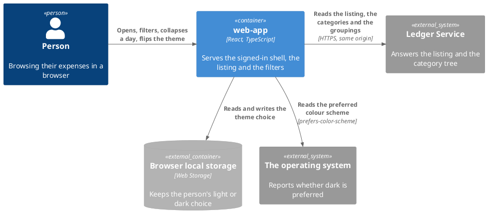
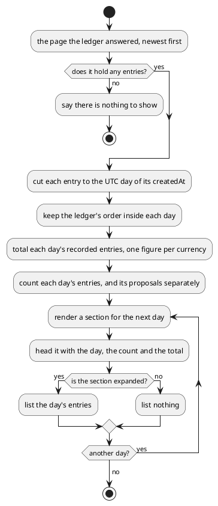
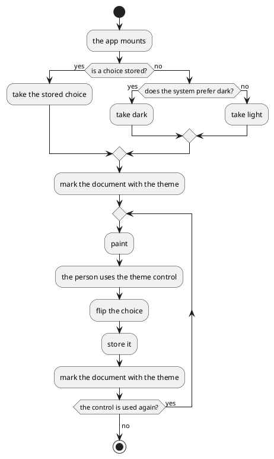

# Design: Redesign the Web App

**Affected Modules:** `web-app`

## Objective

The browser client looks like unstyled HTML. Its controls are the browser's own, its listing is a bare table, and
its one visual decision is a hand-written stylesheet of sixty lines.

This change gives it a component library, a design system and an app shell. It adds four things a person can
name: a real header carrying sign-out, expenses grouped into collapsible days with the day's spend on the
section, a status that reads as a label rather than a shout, and a light and dark theme. It also puts
localization in place while every string is being touched anyway, so a second language later is a file rather
than a sweep.

No behaviour of the ledger changes. Nothing new is read, and nothing new is sent.

## Context

The module is described by [`web-app/docs/conventions/orientation.md`](../../web-app/docs/conventions/orientation.md),
and this change reverses one line of it: *"styling is one hand-written stylesheet"* stops being true, while the
answers it records for state and data fetching stand.

What exists today:

| Surface        | Where                                                                                        | What it is now                                              |
|----------------|----------------------------------------------------------------------------------------------|-------------------------------------------------------------|
| The listing    | [`src/components/ExpenseList.tsx`](../../web-app/src/components/ExpenseList.tsx)              | one flat table, six columns, no date column                 |
| The filters    | [`src/components/ExpenseFilters.tsx`](../../web-app/src/components/ExpenseFilters.tsx)        | five native controls in a flex row                          |
| The paging     | [`src/components/Pager.tsx`](../../web-app/src/components/Pager.tsx)                          | two buttons and a range sentence                            |
| The header     | [`src/pages/ExpensesPage.tsx`](../../web-app/src/pages/ExpensesPage.tsx)                      | an `h1` and a sign-out button, inside the page              |
| The styling    | [`src/styles.css`](../../web-app/src/styles.css)                                              | one hand-written stylesheet                                 |
| The strings    | every component                                                                                | English literals inline                                     |

The behaviour this redesign must not disturb is already specified and tested:
[Browse recorded expenses](../../web-app/docs/usecases/browse-recorded-expenses.md) owns which reads happen, how a
refused session is handled, and what each failure shows.

`createdAt` is already required on every entry
([`openapi/components/schemas/expense.yaml:36`](../../openapi/components/schemas/expense.yaml)), which is why day
grouping needs no ledger change and this stays a one-module task.

## Proposed Solution

Tailwind CSS v4 becomes the styling layer, and shadcn/ui the component set, copied into the module as source the
module owns. The theme is a `dark` class on the document over CSS custom properties, so switching it costs no
runtime library.

The two routes move inside one app shell. The shell carries the product name, a theme control, and — when a
session is open — sign-out.

The listing stops being a flat table. The page the ledger answers is cut into UTC days, and each day is a
collapsible section whose header carries the date, how many entries it holds, and what was spent that day.

Every user-visible string moves behind `react-i18next`, English only, with no language control on screen.

New directories under `src/`:

| Directory       | Holds                                                                       |
|-----------------|------------------------------------------------------------------------------|
| `components/ui/` | the shadcn/ui components, adapted to this module's code style                |
| `i18n/`          | the i18next setup, the English catalogue, and the key type declaration       |
| `theme/`         | resolving, applying and persisting the light or dark choice                  |
| `lib/`           | the class-name helper every `components/ui/` component imports               |

The shell itself joins `pages/`, as the layout element both routes render inside. It reads the session to decide
whether sign-out is shown, and [Architecture & Layering](../../web-app/docs/conventions/architecture.md) gives
reading context to `pages/` alone.

### Diagrams

The read flow is unchanged, so it is not redrawn — the
[use-case page](../../web-app/docs/usecases/browse-recorded-expenses.md) owns it. What follows is what this change
introduces.

`Affected Modules` lists one module, so nothing crosses between two. The diagram answers what the change reaches
outside the module, and local storage and the colour-scheme preference are both new to it.

How a page of entries becomes day sections:

A day cut by the page boundary appears in two pages, and each part totals only the entries on its own page.

How the theme is decided:

### Details

#### Dependencies

| Package                                              | Kind    | For                                                  |
|------------------------------------------------------|---------|-------------------------------------------------------|
| `tailwindcss`, `@tailwindcss/vite`                   | runtime | the styling layer and its Vite plugin                |
| `class-variance-authority`, `clsx`, `tailwind-merge` | runtime | what every shadcn/ui component imports               |
| `lucide-react`                                       | runtime | the icon set shadcn/ui components reference          |
| `radix-ui`                                           | runtime | the accessible primitives under accordion and select |
| `i18next`, `react-i18next`                           | runtime | the message catalogue and the hook that reads it     |

Each is installed with `npm install`, never by editing the manifest, per
[Building a Node Module](../conventions/node-build.md#dependencies).

#### Styling and theming

- The stylesheet becomes a Tailwind entry declaring the theme's custom properties. It replaces `src/styles.css`
  rather than joining it.
- The palette is defined once as custom properties, and the `dark` class redefines them. No component names a
  colour directly.
- The stored choice is `light` or `dark`, under one key in local storage. Nothing stored means the system decides.
- On first paint the document is marked before React mounts, so a person whose choice is dark never sees a light
  frame.
- The theme control is an icon button in the header, labelled for a screen reader.

#### The app shell

| Part                | Shown                                | Carries                                             |
|---------------------|--------------------------------------|------------------------------------------------------|
| The product name    | on every route                       | the app's title                                     |
| The theme control   | on every route                       | flips between light and dark                        |
| The sign-out button | only while a session is open         | ends the session, exactly as the page does today    |

The shell wraps both routes. The sign-out control moves out of the expenses page into the shell, and does the
same thing it does now.

#### The listing

The day section's header carries three things, so the day a large spend happened is visible without expanding it:

| On the header   | Shown as                                                                                   |
|-----------------|---------------------------------------------------------------------------------------------|
| The day         | the date, localized, with today and yesterday named rather than dated                      |
| The count       | how many entries the day holds on this page, and how many of them await a decision         |
| The day's spend | one total per currency, summing the day's recorded entries only, each formatted for its own |

A day holding nothing but proposals shows no figure, and its header says how many await a decision.

Inside an expanded section, each entry shows its description, its merchant, its category name and its amount. The
`Status` column is gone: the status rides on the entry as a badge instead.

| Status     | Reads      | Drawn as                                       |
|------------|------------|-------------------------------------------------|
| `RECORDED` | Recorded   | a muted, low-contrast badge                    |
| `PENDING`  | Pending    | an accented badge, so it is the one that stands out |

Every section is expanded when the page arrives, and any number may be collapsed independently.

Amounts are formatted with `Intl.NumberFormat` for the entry's own currency, so the symbol and the separators come
from the locale rather than from the module.

The empty state and the failure banner both become the library's alert, and say what they say today.

#### The filters

The five filters stay, and what each narrows is unchanged. Their presentation changes:

| Filter                | Becomes                                                          |
|-----------------------|-------------------------------------------------------------------|
| Grouping              | a styled select on the accessible primitive                      |
| Category              | a styled select on the accessible primitive                      |
| Status                | a styled select, with each value read as a label, not shouted    |
| Recorded from and to  | one period control holding two native date inputs                |

The period is sent as a pair or not at all. The ledger refuses a lone `from` or a lone `to` with 400
([`openapi/components/parameters/expense-filters.yaml:30`](../../openapi/components/parameters/expense-filters.yaml)),
which the filters do not prevent today.

#### Localization

- One catalogue, `en`, with `en` as the fallback. No language detector and no control on screen.
- Keys are namespaced by surface — the shell, the listing, the filters, the paging, the failures.
- A type declaration derives the key union from the English catalogue, so an unknown key fails `npm run typecheck`.
- Dates and amounts are formatted by `Intl`, driven by the resolved language, not by strings in the catalogue.

#### Testing environment

The accessible primitives use browser APIs jsdom does not implement. `vitest.setup.ts` gains stubs for them, or
no test touching a select or an accordion can render:

| API                                  | Needed by                                  |
|--------------------------------------|---------------------------------------------|
| `matchMedia`                         | resolving the system colour scheme         |
| `ResizeObserver`                     | the popup primitives                       |
| `Element.prototype.hasPointerCapture` | the select primitive's pointer handling    |
| `Element.prototype.scrollIntoView`   | the select primitive moving to an option   |

Tests keep querying by role and accessible name, per
[Testing Conventions](../../web-app/docs/conventions/testing.md#testing-style). The primitives render real roles,
so the rule survives the redesign.

#### Build and configuration

| Change                                    | Where                                                        |
|-------------------------------------------|---------------------------------------------------------------|
| The Tailwind plugin joins the plugin list | `web-app/vite.config.ts`                                     |
| `src/components/ui/**` leaves coverage    | `web-app/vite.config.ts`, `test.coverage.exclude`             |
| The theme is marked before React mounts   | `web-app/index.html`                                         |

No environment variable is added, so [Configuration](../../web-app/docs/configuration.md) does not change.

Two conventions pages record answers this change replaces, and both are corrected with it:

| Page                                                                                     | What is no longer true                              |
|------------------------------------------------------------------------------------------|------------------------------------------------------|
| [`conventions/orientation.md`](../../web-app/docs/conventions/orientation.md)             | styling is one hand-written stylesheet              |
| [`conventions/architecture.md`](../../web-app/docs/conventions/architecture.md)           | the directory structure, which gains four entries   |

## Acceptance Scenarios

The expenses page and the sign-in page are the entry points. Every scenario below is a branch of a diagram above,
or of the filter rules under **Details**.

- **A1:** the listing is grouped into days
  - Given: a signed-in person, and a page holding entries recorded on three different UTC days
  - When: they open the app
  - Then: three sections are shown, each headed with its day, its count and its total, and each expanded

- **A2:** a day's spend is visible without expanding it
  - Given: a day holding three recorded entries in one currency
  - When: the person collapses that day's section
  - Then: the section still shows the day, the count and the day's total, and none of its entries

- **A3:** a day holds more than one currency
  - Given: a day holding one recorded entry in EUR and one recorded in USD
  - When: the person looks at that day's header
  - Then: the header shows a total for EUR and a total for USD, each formatted for its own currency

- **A4:** the day is the ledger's day
  - Given: an entry whose `createdAt` falls late on one UTC day but on the next day in the viewer's own zone
  - When: the page groups it
  - Then: it groups under the UTC day, so it appears under the same day the period filter would return it for

- **A5:** there is nothing to show
  - Given: the filter matches no entries
  - When: the page renders the answer
  - Then: no sections are shown, and the page says there is nothing to show

- **A6:** a status is read, not shouted
  - Given: an entry still awaiting a decision
  - When: it is listed
  - Then: it carries a badge reading "Pending", and no column headed "Status" exists

- **A7:** a period is sent as a pair
  - Given: the filters are empty
  - When: the person sets only the first day of the period
  - Then: no listing read is sent for it, and the ledger is never asked with a lone `from`

- **A8:** a complete period narrows the listing
  - Given: the person has set the first day of the period
  - When: they set the last day too
  - Then: the listing is read with both, from the first page

- **A9:** the theme follows the system on a first visit
  - Given: no theme choice is stored, and the system prefers dark
  - When: the person opens the app
  - Then: the app is dark, and no light frame is painted first

- **A10:** the theme control overrides the system
  - Given: the app is showing dark
  - When: the person uses the theme control
  - Then: the app becomes light, and the choice survives a reload

- **A11:** the header carries sign-out only when signed in
  - Given: an anonymous person on the sign-in page
  - When: the page renders
  - Then: the header shows the product name and the theme control, and no sign-out control

- **A12:** signing out still ends the session
  - Given: a signed-in person
  - When: they use the sign-out control in the header
  - Then: the ledger is told to end the session, and the sign-in page is shown

- **A13:** a surface reads its strings from the catalogue
  - Given: a catalogue whose keys for that surface carry text distinguishable from the English wording
  - When: the surface renders
  - Then: it shows the catalogue's text, so nothing it displays is a literal in the component

- **A14:** a failed read still reports itself
  - Given: the listing read fails for a reason other than a refused session
  - When: the page renders the failure
  - Then: the failure is shown in the alert, and whatever is on screen stays

- **A15:** a proposal is not counted as spend
  - Given: a day holding two recorded entries and one still awaiting a decision, all in one currency
  - When: the person looks at that day's header
  - Then: the total sums the two recorded entries only, and the header says one entry awaits a decision

- **A16:** a day holds nothing but proposals
  - Given: a day whose only entry is still awaiting a decision
  - When: the person looks at that day's header
  - Then: the header shows no total, and says one entry awaits a decision

- **A17:** two entries share an id across statuses
  - Given: a recorded entry and a proposal that carry the same id, recorded on the same day
  - When: the day's section is expanded
  - Then: both are listed, each with its own badge, and neither replaces the other

- **A18:** one day of a set period is cleared
  - Given: a period is set with both days, and the listing on screen matches it
  - When: the person clears the last day
  - Then: no listing read is sent, and the entries on screen stay as they are

## Decisions

- **D1:** Which component library and styling layer does the redesign use?
  - Answer: Tailwind CSS v4 with shadcn/ui, whose components are copied into `src/components/ui/` as source the
    module owns, over the accessible primitives beneath them.
  - Basis: decided — the user chose it over hand-written Radix, Mantine and MUI, for the Tailwind workflow and
    because the primitives render real ARIA roles, so the module's query-by-role testing rule is untouched
    (user, 2026-08-09).

- **D2:** How is localization wired in, given English is the only language?
  - Answer: `react-i18next` with one `en` catalogue and `en` as the fallback. No language detector, and no control
    on screen. Keys are typed from the catalogue, so an unknown key fails the type check.
  - Basis: decided — the user chose it over a hand-rolled dictionary and Lingui, so a second language later is a
    file and a control rather than a sweep of every component (user, 2026-08-09).

- **D3:** How does a person control the light and dark theme?
  - Answer: The system preference decides a first visit. A control in the header overrides it, and the override
    persists in local storage.
  - Basis: decided — the user chose it over following the system with no control, and over a light default
    (user, 2026-08-09).

- **D4:** How does grouping by day interact with the ledger's paging?
  - Answer: The page the ledger answers is grouped client-side. A day cut by the page boundary appears in both
    pages, and each part counts and totals only its own entries. The pager keeps stepping by the ledger's page
    size.
  - Basis: decided — the user chose it over raising the page size and over paging by day in the ledger, which
    would have made this a two-module change (user, 2026-08-09).

- **D5:** Which day does an entry group under, given `createdAt` is an instant?
  - Answer: Its UTC day.
  - Basis: assumed — the period filter takes "whole days at UTC"
    ([`openapi/components/parameters/expense-filters.yaml:30`](../../openapi/components/parameters/expense-filters.yaml)),
    so grouping by the viewer's local day would put an entry under a heading the same period filter excludes.
    Matching the ledger keeps the two consistent.

- **D6:** Are the day sections expanded or collapsed when the page arrives?
  - Answer: Expanded, and any number may be collapsed independently.
  - Basis: assumed — [`ExpenseList.tsx`](../../web-app/src/components/ExpenseList.tsx) renders every row today, so
    defaulting to collapsed would hide on upgrade what is currently on screen. The day totals sit on the headers
    either way, so nothing is lost by defaulting open.

- **D7:** What does a day's total show when the day holds more than one currency?
  - Answer: One total per currency present, each formatted for its own currency. Nothing is converted, and each
    sums that currency's recorded entries only, per **D18**.
  - Basis: assumed — the module holds no rate and no base currency, and `currency` is per entry
    ([`openapi/components/schemas/expense.yaml`](../../openapi/components/schemas/expense.yaml)). Summing across
    currencies would state a number that is not true in any of them.

- **D8:** What replaces the uppercase status text?
  - Answer: A badge on the entry, reading "Recorded" or "Pending" from the catalogue. Recorded is muted, pending is
    accented. The `Status` column is removed.
  - Basis: decided — the user asked for the uppercase capsule to go and for the result to read as a modern
    interface (user, 2026-08-09).

- **D9:** Does the period filter still send `from` and `to` independently?
  - Answer: No. The period is one control, and the listing is read only once both days are set or both are
    cleared.
  - Basis: assumed — the ledger refuses a lone day with 400 naming both
    ([`openapi/components/parameters/expense-filters.yaml:30`](../../openapi/components/parameters/expense-filters.yaml)),
    and [`ExpenseFilters.tsx:56`](../../web-app/src/components/ExpenseFilters.tsx) sets each day on its own, so
    setting one today produces a refusal rather than a narrowed list.

- **D10:** Do the date fields become a calendar picker?
  - Answer: No. They stay native date inputs, styled to match.
  - Basis: deferred — a picker pulls a calendar component and a date library for a field that is a plain
    `YYYY-MM-DD` day the ledger takes verbatim. It comes back if a person needs to pick a range by sight rather
    than by typing.

- **D11:** Does anything about the ledger's API change?
  - Answer: No. No endpoint, no parameter and no schema moves, and no new read is added.
  - Basis: assumed — `createdAt` is already required on every entry
    ([`openapi/components/schemas/expense.yaml:47`](../../openapi/components/schemas/expense.yaml)), so grouping,
    totalling and dating are all done from what the listing already answers.

- **D12:** How are amounts formatted, given they arrive as minor units?
  - Answer: `Intl.NumberFormat` for the entry's own currency, over the existing divisor of one hundred.
  - Basis: deferred — the divisor is hardcoded in
    [`ExpenseList.tsx`](../../web-app/src/components/ExpenseList.tsx) today and is wrong for a currency with
    other than two minor units. It comes back when the ledger records such a currency; nothing in the schema
    names the exponent, so the page cannot derive it.

- **D13:** Do the shadcn/ui components count towards the coverage minimum?
  - Answer: No. `src/components/ui/**` is excluded from coverage.
  - Basis: assumed — [`vite.config.ts`](../../web-app/vite.config.ts) already excludes `src/api/generated/**` on
    the same grounds, and holding library source to 80% would measure the library rather than this module.

- **D14:** Are the copied components left as the registry writes them?
  - Answer: No. They are adapted to the module's code style on arrival — named exports, `type` over `interface`,
    no `any`.
  - Basis: assumed — [Code Style](../../web-app/docs/conventions/code-style.md) binds every file in `src/`, and
    the lint rules that enforce it run over the whole tree.

- **D15:** Does the redesign change what the page reads, or how a refused session is handled?
  - Answer: No. Which reads happen, the dropping of a stale read, the expiry-to-anonymous path and every failure
    outcome stay exactly as
    [Browse recorded expenses](../../web-app/docs/usecases/browse-recorded-expenses.md) records them.
  - Basis: assumed — that page and its tests already pin the behaviour, and nothing in this change touches
    `src/api/` or `src/auth/`.

- **D16:** Is a language control shown anywhere?
  - Answer: No. The catalogue infrastructure ships, and the screen shows no way to switch.
  - Basis: decided — the user asked for localization to be in place without a switcher, English only
    (user, 2026-08-09).

- **D17:** Which directory holds the app shell, given it decides whether to show sign-out?
  - Answer: Not `components/`. Whatever file reads the session to make that decision is a page or a layout
    element beside the route guard; a shell placed in `components/` takes "a session is open" and the sign-out
    callback as props. The directory table in `conventions/architecture.md` gains that entry along with the four
    the change already lists.
  - Basis: assumed — [Architecture & Layering](../../web-app/docs/conventions/architecture.md) says a component
    in `components/` "does not read the auth context" and gives reading context to `pages/`, and
    [`RequireAuth.tsx`](../../web-app/src/auth/RequireAuth.tsx) is the tree's one layout element that reads it,
    sitting in `auth/` rather than in `components/`.

- **D18:** Does an entry still awaiting a decision count towards the day's spend?
  - Answer: No. The total sums the day's recorded entries only. The header carries the day's entry count and,
    where the day holds any, how many of them await a decision — so the count and the figure never disagree
    unexplained. A day holding nothing but proposals shows no figure.
  - Basis: decided — the user chose recorded-only over one combined figure and over two figures side by side,
    matching the ledger's own definition of spend: its period total sums `FROM expense` alone, grouped by currency
    ([`ExpenseEntityRepository.java:21`](../../ledger-service/src/main/java/bot/finance/adapter/persistence/ExpenseEntityRepository.java)),
    and proposals are a separate table (user, 2026-08-09).

- **D19:** How does a person go back to following the system once they have overridden it?
  - Answer: They do not. The control flips between two values and stores exactly that, so the stored choice is
    `light` or `dark` and nothing else. The system preference decides only while nothing is stored, which is
    until the first override.
  - Basis: decided — the user chose the two-value flip over a three-state cycle and over a menu offering all
    three, so the stored value is two-valued and the control the shell table, the theme flow diagram and **A10**
    already describe is the one that ships (user, 2026-08-09).

- **D20:** What happens when local storage refuses, or holds something that is not a theme?
  - Answer: A value that is not a theme is treated as no stored choice, so the system preference decides; a
    write that throws leaves the choice unpersisted while the document is still marked, and nothing is recorded.
  - Basis: assumed — the theme flow diagram draws only "is a choice stored?", with no branch for an unreadable
    store or an unrecognized value, and the module logs nothing anywhere in `src/`, so a swallowed storage
    failure leaves no trace by the module's own practice rather than by oversight.

- **D21:** Does the failure banner's wording come from the catalogue?
  - Answer: No. The banner's text stays what it is today, and the catalogue covers the shell, the listing, the
    filters and the paging.
  - Basis: assumed — [the browse contract](../../web-app/docs/contracts/out/ledger-browse-api.md#when-the-call-fails)
    fixes three of the four wordings outside this module: the ledger's own message from the problem body, the
    wording synthesized in [`api/client.ts:35`](../../web-app/src/api/client.ts), and the browser's own words for
    a network failure. **D15** keeps `src/api/` untouched, so **A13** holds for component literals and not for
    what the banner is handed.

- **D22:** What proves **A13** — that no user-visible string is a literal in a component?
  - Answer: A test per surface, rendering it against a catalogue whose keys carry substituted text. **A13** is
    written that way rather than as a claim across the whole app, which no test can make.
  - Basis: assumed — [`eslint.config.js`](../../web-app/eslint.config.js) carries only `react-hooks`,
    `react-refresh` and the TypeScript rules; the rule that would check the app-wide claim,
    `react/jsx-no-literals`, needs `eslint-plugin-react`, which is in neither the manifest nor the
    **Dependencies** table, and a lint rule is not what the module's test layers assert with.

- **D23:** Whose "today" names the first section, given the day is the UTC day?
  - Answer: The UTC today, so the naming matches the grouping.
  - Basis: assumed — **D5** groups by the UTC day to stay consistent with the period filter, and a label resolved
    against the viewer's own day would name a section "Today" whose entries are grouped under a different day
    from the one the viewer is living. A viewer far enough from UTC sees "Today" over a day that is not theirs.

- **D24:** What identifies an entry once the table row is gone?
  - Answer: Its status and its id together, as the row key does today. A day section is identified by its UTC day.
  - Basis: assumed — `id` is "unique within this row's `status`, and not across it"
    ([`openapi/components/schemas/expense.yaml:16`](../../openapi/components/schemas/expense.yaml)), which
    [`ExpenseList.tsx:32`](../../web-app/src/components/ExpenseList.tsx) keys on and
    [`ExpenseList.test.tsx:99`](../../web-app/src/components/ExpenseList.test.tsx) pins. **A17** carries that
    pinning over to the sections.

- **D25:** What is read when one day of an already-set period is cleared?
  - Answer: Nothing. The listing keeps the answer it has until the pair is complete again or both days are empty.
  - Basis: assumed — **D9** reads only on a complete or an empty pair, and the ledger refuses a lone day with 400
    ([`openapi/components/parameters/expense-filters.yaml:30`](../../openapi/components/parameters/expense-filters.yaml)).
    The filters then show a half period the listing on screen does not match, which **A18** covers.

- **D26:** Can `Intl.NumberFormat` refuse a currency the ledger answers?
  - Answer: No. Every code the listing carries is a well-formed ISO 4217 code.
  - Basis: assumed — [`CurrencyCode.java:14`](../../ledger-service/src/main/java/bot/finance/domain/value/CurrencyCode.java)
    validates every code against `java.util.Currency` before it is stored, so nothing outside that set reaches
    the page and the formatter has no input that throws.

- **D27:** Is `createdAt` always answered at UTC, or can it carry another offset?
  - Answer: Always UTC, so the UTC day is the first ten characters of the value as it arrives.
  - Basis: assumed — [`ExpenseWebMapper.java:72`](../../ledger-service/src/main/java/bot/finance/adapter/web/ExpenseWebMapper.java)
    maps the stored instant with `atOffset(ZoneOffset.UTC)` on every item, so grouping needs no date library and
    no zone conversion.

- **D28:** Do the sign-in page's own strings move into the catalogue?
  - Answer: Yes. The catalogue gains a `signIn` namespace for the page's invitation and its refused-sign-in
    wording. The page also loses its `Finance Bot` heading, which the shell now carries.
  - Basis: decided — the user chose it over leaving the page's literals inline, so the Objective's "every
    user-visible string moves behind `react-i18next`" holds for every surface and a second language later is a
    file rather than a sweep (user, 2026-08-09). The `signIn` namespace joins the five **Localization** names.
    **D21** is untouched: it fixes the wording the *banner is handed* from `api/`, not the page's own literals.

- **D29:** The **Localization** namespaces list a `failures` namespace. What goes in it?
  - Answer: Nothing. No `failures` key is written.
  - Basis: assumed — **D21** puts every failure wording outside this module: the ledger's own message, the wording
    [`api/client.ts:35`](../../web-app/src/api/client.ts) synthesizes, and the browser's words for a network
    failure. The listing's empty state is the listing's own key. So the namespace would have no member.

## Design Findings

Grilled (2026-08-09): nothing to raise on authorization, contract compat, idempotency and retry, concurrency,
limits.
