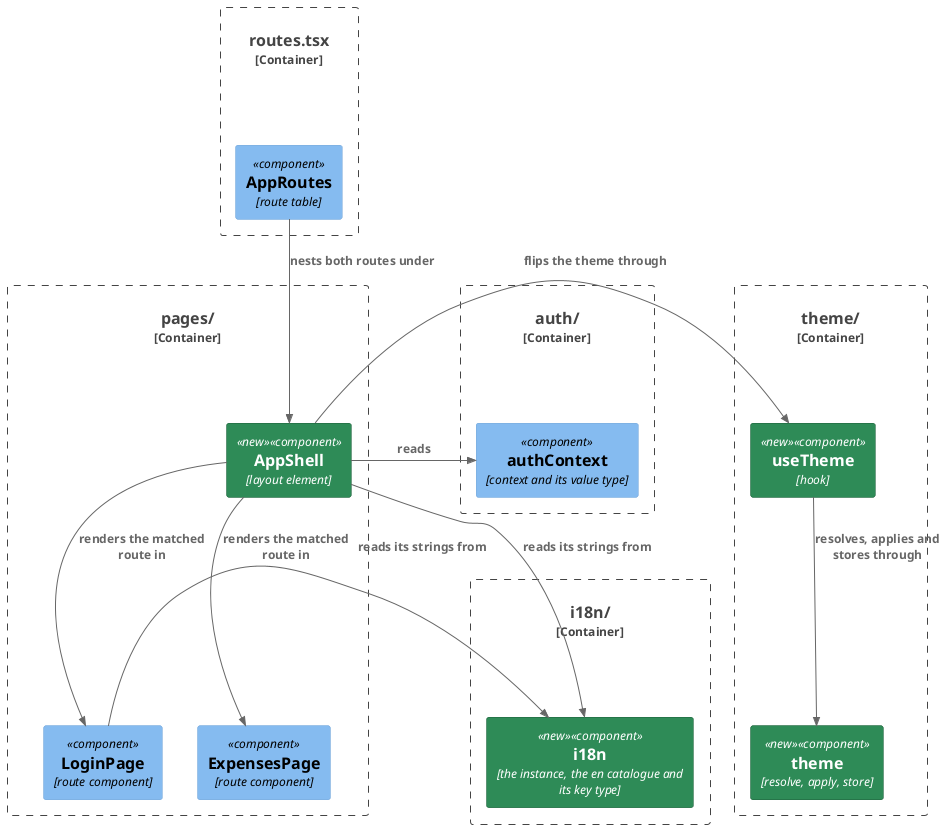
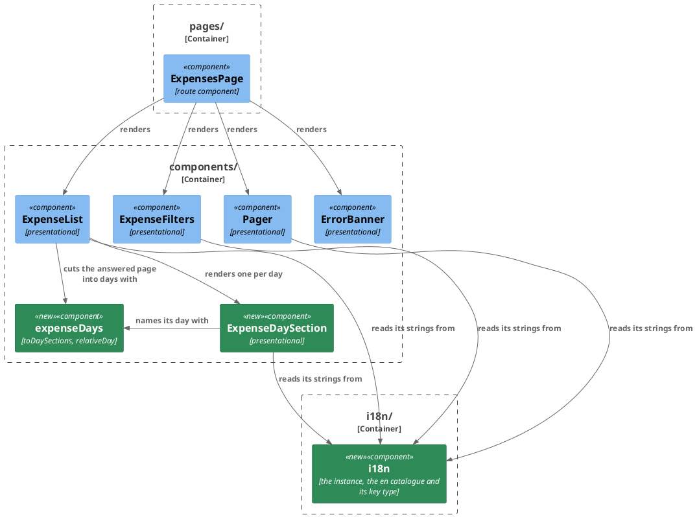

# Plan: Redesign the Web App

**Affected Modules:** `web-app`
**Design:** [Redesign the Web App](design.md)

## Components

The module's [Architecture & Layering](../../web-app/docs/conventions/architecture.md) names no layers, so the
boxes below are its directories, which is what it really organizes code by.

The change has two subjects, and each gets its own diagram: the frame both routes render in, and the listing that
frame carries. `components/ui/` is drawn in neither — see beneath them.

### The frame

### The listing

`ExpenseList`, `ExpenseFilters`, `Pager`, `ErrorBanner`, `ExpensesPage`, `LoginPage` and `routes.tsx` already
exist and are changed here; everything green is a file this plan creates. `ExpensesPage` appears in both
diagrams, drawn for context so each is read on its own.

`components/ui/` and `lib/utils.ts` are in neither diagram. They are the library, not this module's structure:
ST06 copies the seven files in whole, ST05 adds the one helper each of them imports, and **D13** takes the
directory out of coverage because holding library source to the module's minimum would measure the library. Every
surface renders through them uniformly, so the arrows carry no information a reader can act on — which is what
the diagram conventions leave out of a diagram. ST05 and ST06 name the files.

| Type                | Fields                                                                                                        |
|---------------------|---------------------------------------------------------------------------------------------------------------|
| `ExpenseDay`        | `day: string` (the UTC day, `YYYY-MM-DD`), `entries: Expense[]` (the ledger's order kept), `awaiting: number`, `totals: DayTotal[]` |
| `DayTotal`          | `currency: string`, `minorUnits: number` — one per currency present among the day's `RECORDED` entries        |
| `Theme`             | `'light' \| 'dark'` — a union of string literals, never a boolean pair                                        |

| Function                                            | Answers                                                                          |
|-----------------------------------------------------|-----------------------------------------------------------------------------------|
| `toDaySections(items: Expense[]): ExpenseDay[]`     | the page cut into UTC days, newest first, empty for an empty page                 |
| `relativeDay(day: string, now: Date): 'today' \| 'yesterday' \| null` | the day named against the **UTC** today, `null` for anything older |
| `resolveTheme(): Theme`                             | the stored choice, or the system preference when nothing valid is stored          |
| `applyTheme(theme: Theme): void`                    | marks the document element                                                        |
| `storeTheme(theme: Theme): void`                    | records the choice, swallowing a refusal to write                                 |
| `useTheme(): { theme: Theme; toggleTheme: () => void }` | the theme in force, and the two-value flip                                    |
| `cn(...inputs: ClassValue[]): string`               | the merged class list every `components/ui/` component composes with              |

| Component            | Props                                                                                  |
|----------------------|------------------------------------------------------------------------------------------|
| `AppShell`           | none — it reads the session from the context and renders the matched route in an `Outlet` |
| `ExpenseList`        | `page`, `categoryNames` — unchanged                                                     |
| `ExpenseDaySection`  | `day: ExpenseDay`, `categoryNames: Map<number, string>`                                 |
| `ExpenseFilters`     | `groupings`, `categories`, `filter`, `onChange` — unchanged                             |
| `Pager`              | `page`, `onOffset` — unchanged                                                          |
| `ErrorBanner`        | `message` — unchanged                                                                   |

| Catalogue namespace | Holds                                                                                          |
|---------------------|--------------------------------------------------------------------------------------------------|
| `shell`             | the product name, the theme control's accessible name, the sign-out control                      |
| `listing`           | the day headings, today and yesterday, the entry count, the awaiting count, the two status badges, the empty state |
| `filters`           | the five control labels, the "all" option, the two status labels read as labels rather than shouted |
| `paging`            | the previous and next controls, and the range sentence with its numbers interpolated             |
| `signIn`            | the sign-in page's invitation and its refused-sign-in wording (**D28**)                          |

Invariants the boxes cannot carry:

- A day's `totals` sum its `RECORDED` entries only, one figure per currency, nothing converted (**D18**, **D7**).
- A day holding no `RECORDED` entry has an empty `totals`, and its header shows no figure (**A16**).
- An entry is identified by its `status` and its `id` together; a day section by its UTC day (**D24**).
- The stored theme is `light` or `dark` and nothing else; an unrecognized value is treated as nothing stored, and
  a write that throws is swallowed (**D19**, **D20**).
- `ExpenseFilters` calls back with `from` and `to` only as a pair or as neither; any half period sends nothing
  (**D9**, **D25**).

## Step-by-Step Implementation Map (To-Do List)

### Stabilization

#### Interface-First / Build Stabilization

A new-file stub carries a short inline comment describing what the function is meant to do, so the red-phase agent
reads the intent rather than inventing one. `tsconfig.json` sets `noUnusedParameters` and the module runs
`@typescript-eslint/no-unused-vars` as an error, so a stub either names its argument in what it returns or throws
with it — a body that ignores its parameter will not lint.

**Configuration**

- [x] ST01 · Install the design's dependencies in one `npm install` from `web-app/`, never by editing
  `package.json`, per [Building a Node Module](../conventions/node-build.md#dependencies):
  `tailwindcss`, `@tailwindcss/vite`, `class-variance-authority`, `clsx`, `tailwind-merge`, `lucide-react`,
  `radix-ui`, `i18next`, `react-i18next`. All nine are runtime dependencies.
- [x] ST02 · `web-app/vite.config.ts` — add the Tailwind plugin to `plugins` beside `react()`, and add
  `src/components/ui/**` to `test.coverage.exclude` beside `src/api/generated/**`, which is there on the same
  grounds (**D13**). Leave the thresholds and every other entry as they stand.
- [x] ST03 · Replace the whole of `web-app/src/styles.css` with the Tailwind entry: the Tailwind import, the
  `dark` custom variant, and the palette declared once as custom properties with the `dark` class redefining
  them. No component names a colour directly, so every colour a later step needs has to exist here — surface,
  foreground, muted, accent, border and the accent used by the pending badge. `main.tsx` already imports this
  path, so nothing else moves.
- [x] ST04 · `web-app/index.html` — add a blocking inline script in the `head`, before the module script, that
  marks the document element with the theme: the stored choice under the same one key `src/theme/theme.ts` uses,
  falling back to `prefers-color-scheme`. It runs before React mounts so a person whose choice is dark never sees
  a light frame (**A9**). It is deliberately a duplicate of `resolveTheme` in plain script form — a module import
  here would be deferred and paint first.

**Interface & Signature Sync**

- [x] ST05 · Add `web-app/src/lib/utils.ts` exporting `cn`, the `clsx` + `tailwind-merge` helper every
  `components/ui/` component composes its class names with. Implement it outright — it is one line with no
  branch of its own, which the unit type excludes as simple delegation.
- [x] ST06 · Add the shadcn/ui components under `web-app/src/components/ui/`, one file each: `accordion`,
  `select`, `badge`, `alert`, `button`, `input`, `label`. Copy them as source the module owns and adapt each on
  arrival, per **D14** and [Code Style](../../web-app/docs/conventions/code-style.md): named exports, `type` over
  `interface`, no `any`. Import `cn` and the primitives by **relative path** — `tsconfig.json` declares no `paths`
  alias and every import in `src/` is relative today, so no alias is introduced and no `components.json` is
  committed.
- [x] ST07 · Add `web-app/src/i18n/en.ts` — the English catalogue, keys namespaced by surface as the Components
  table above lists: `shell`, `listing`, `filters`, `paging`, `signIn`. The design's **Localization** also names a
  `failures` namespace; **D29** leaves it with no member, so none is written. The wordings are the ones on screen
  today, plus the new ones this change introduces (the product name, the theme control's accessible name, the day
  headings, today and yesterday, the counts, the two status badges).
- [x] ST08 · Add `web-app/src/i18n/config.ts` — the i18next instance initialized with the `en` catalogue and `en`
  as the fallback, no language detector and no control, per **D2** and **D16**. It initializes the default
  instance on import, so a component rendered on its own in a test reads the same catalogue the app does. Import
  it from `src/main.tsx`.
- [x] ST09 · Add `web-app/src/i18n/i18next.d.ts` — the module augmentation deriving the key union from
  `typeof en`, so an unknown key fails `npm run typecheck`.
- [x] ST10 · Stub `web-app/src/theme/theme.ts`: the `Theme` union, the one storage key, and `resolveTheme`,
  `applyTheme` and `storeTheme` with the signatures the Components table gives, each carrying its intent comment.
- [x] ST11 · Stub `web-app/src/theme/useTheme.ts` — the hook returning the theme in force and `toggleTheme`, with
  its intent comment.
- [x] ST12 · Stub `web-app/src/components/expenseDays.ts` — the `ExpenseDay` and `DayTotal` types, and
  `toDaySections` and `relativeDay` with the signatures the Components table gives. `tsconfig.json` sets
  `noUncheckedIndexedAccess`, so anything indexing into the items has to narrow rather than assert.
- [x] ST13 · Stub `web-app/src/components/ExpenseDaySection.tsx` — takes its props and renders nothing, so
  `ExpenseList` has something to compose against.
- [x] ST14 · Stub `web-app/src/pages/AppShell.tsx` — renders `<main><Outlet /></main>` and no header yet.
- [x] ST15 · Move the frame into the shell and keep the build green:
    - `src/routes.tsx` — wrap the whole route table in a `<Route element={<AppShell />}>` so both `/login` and the
      guarded `/` render inside it.
    - `src/pages/ExpensesPage.tsx` — drop its `<main>`, its `<header>`, its `Expenses` heading and its sign-out
      button, and stop reading `signOut` from the context. It keeps `sessionExpired` and everything else it does.
    - `src/pages/LoginPage.tsx` — drop its `<main>` and its `Finance Bot` heading, which the shell now carries.
      Its paragraph, the widget and the refusal banner stay; their wordings move to the catalogue in GU11.
- [x] ST16 · Skip the three cases ST15 leaves failing, with `it.skip` and a reason naming the step that reworks
  each, so the suite reports what is owed rather than hiding it:
    - `src/App.test.tsx` — the two signed-in cases assert a level-1 heading named `Expenses`, which no longer
      exists; name RU08.
    - `src/pages/ExpensesPage.test.tsx` — the case that clicks the `Sign out` button, which has moved to the
      shell; name RU10.

**Shared Test Infrastructure**

- [x] ST17 · Extend `web-app/vitest.setup.ts` with what jsdom does not implement and the accessible primitives
  need — `matchMedia`, `ResizeObserver`, `Element.prototype.hasPointerCapture` and
  `Element.prototype.scrollIntoView` — and import `./src/i18n/config` so every test renders against the real
  catalogue. `matchMedia` is stubbed as a query-answering fake that reports *not* dark by default and can be
  replaced per test, because RU01 and RU02 both drive the system preference both ways.
- [x] ST18 · Add `web-app/src/testing/catalogue.ts` — a helper that swaps the `en` catalogue for one whose keys
  carry text distinguishable from the English wording, and restores it afterwards. RU04, RU05, RU06, RU07, RU08,
  RU09 and RU11 each render one surface against it, which is what **D22** makes **A13** provable by; without one
  owner seven step agents each invent their own.
- [x] ST20 · Add to `web-app/src/testing/` a helper that opens a `combobox` trigger by its accessible name and
  clicks the option named, awaiting the primitive's own open state rather than sleeping. RU06 reworks four cases
  in `ExpenseFilters.test.tsx` onto it and RU10 reworks `chooseGroceries` in `ExpensesPage.test.tsx` onto it, and
  the two step agents run in parallel; without one owner each writes its own. It sits beside
  `src/testing/catalogue.ts`, which ST18 creates, and `src/testing/**` is already excluded from coverage.

- [x] ST19 · Confirm the module compiles and lints green before the red phase starts:
  `tools/agent-test/agent-test.sh --module web-app --compile`, and `npm run lint` from `web-app/`. The module has
  no architecture-enforcement test — its
  [Testing Conventions](../../web-app/docs/conventions/testing.md) name none — so there is nothing else to
  confirm here.

### Red Phase

#### TDD Unit Red Phase

Every step below is a unit test: this module's [Testing Conventions](../../web-app/docs/conventions/testing.md)
map all three of its layers — module, component and page — onto the unit type, because each fakes everything the
code under test depends on. Queries are by role and accessible name throughout; the primitives render real roles,
so the rule survives the redesign.

- [x] RU01 · `theme` · test: `theme.test.ts` · covers: `resolveTheme()`, `applyTheme()`, `storeTheme()` · scenarios: A9, A10
    - `resolveTheme()`:
        - given: nothing stored, and a `matchMedia` reporting the system prefers dark
          when: resolveTheme is called
          then: it answers dark, so a first visit follows the system
        - given: nothing stored, and a `matchMedia` reporting the system does not prefer dark
          when: resolveTheme is called
          then: it answers light
        - given: `dark` stored while the system reports it prefers light
          when: resolveTheme is called
          then: it answers dark — the stored override wins over the system, and the system decides only while
          nothing is stored
        - given: a stored value that is not a theme, such as `system` or an empty string
          when: resolveTheme is called
          then: it answers what the system prefers, exactly as if nothing were stored
        - given: a local storage whose read throws
          when: resolveTheme is called
          then: it answers what the system prefers and nothing is rethrown, so an unreadable store never stops
          the app rendering
    - `applyTheme()`:
        - given: the document element carrying no theme marker
          when: applyTheme is called with dark
          then: the document element carries the dark marker the stylesheet's dark variant turns on
        - given: the document element already marked dark
          when: applyTheme is called with light
          then: the marker is gone, so light is the absence of the marker rather than a second one
    - `storeTheme()`:
        - given: an empty local storage
          when: storeTheme is called with dark
          then: `dark` is recorded under the module's one key, and nothing else is written
        - given: a local storage whose write throws
          when: storeTheme is called
          then: nothing is recorded, nothing is rethrown, and nothing is logged — the module logs nowhere in
          `src/`, and a swallowed storage failure leaves no trace by its own practice

- [x] RU02 · `useTheme` · test: `useTheme.test.tsx` · covers: the hook · scenarios: A9, A10
    - the hook:
        - given: nothing stored and the system reporting it prefers dark
          when: a component using the hook is first rendered
          then: the very first render already reports dark and the document is already marked, so no light frame
          is painted before an effect runs
        - given: the hook reporting dark
          when: toggleTheme is called
          then: it reports light, the document loses the dark marker, and `light` is stored
        - given: `light` stored and the system preferring dark
          when: toggleTheme is called and a second component mounts the hook afresh
          then: the second mount reports dark, so the choice survives a reload rather than living in memory
        - given: the hook reporting dark
          when: toggleTheme is called twice
          then: it reports dark again and the stored value is `dark` — the control flips between two values and
          never reaches a third

- [x] RU03 · `expenseDays` · test: `expenseDays.test.ts` · covers: `toDaySections()`, `relativeDay()` · scenarios: A1, A3, A4, A5, A15, A16, A17
    - `toDaySections()`:
        - given: entries recorded on three different UTC days, newest first
          when: toDaySections is called
          then: three sections come back, one per day, in the order the page gave them, and each section holds
          only its own day's entries in that same order
        - given: an entry whose `createdAt` is `2026-08-01T23:30:00Z`, read where the local day is already the
          2nd
          when: toDaySections is called
          then: it groups under `2026-08-01`, the UTC day, so it sits under the same day the period filter would
          return it for
        - given: a day holding three recorded entries, all EUR
          when: toDaySections is called
          then: that day carries one total, EUR, summing all three in minor units
        - given: a day holding one recorded EUR entry and one recorded USD entry
          when: toDaySections is called
          then: that day carries two totals, one per currency, neither converted into the other
        - given: a day holding two recorded entries and one still awaiting a decision, all one currency
          when: toDaySections is called
          then: the day's total sums the two recorded entries only, its entries number three, and its awaiting
          count is one
        - given: a day whose only entry is still awaiting a decision
          when: toDaySections is called
          then: the day carries no total at all, its entries number one, and its awaiting count is one
        - given: a recorded entry and a proposal carrying the same id, recorded on the same day
          when: toDaySections is called
          then: both stay in that day's entries, neither replacing the other
        - given: an empty item list
          when: toDaySections is called
          then: no sections come back
    - `relativeDay()`:
        - given: a day equal to the UTC day of the instant given as now
          when: relativeDay is called
          then: it answers today
        - given: the UTC day before that one
          when: relativeDay is called
          then: it answers yesterday
        - given: a day three UTC days back
          when: relativeDay is called
          then: it answers null, so the section is headed with its date instead
        - given: a now whose local day is ahead of its UTC day — late evening at UTC, already tomorrow locally
          when: relativeDay is called with that UTC day
          then: it still answers today, resolved against the UTC today, so the naming matches the grouping

- [x] RU04 · `ExpenseDaySection` · test: `ExpenseDaySection.test.tsx` · covers: the rendered day section · scenarios: A2, A3, A6, A13, A15, A16, A17
    - the rendered day section:
        - given: a day of three recorded EUR entries with a total, rendered expanded
          when: the section is read
          then: its header carries the day, how many entries it holds and the day's total, and every entry is
          listed
        - given: the clock fixed so that the section's day is the UTC today, and again so that it is the UTC day
          before
          when: the header is read in each case
          then: it names the day today and yesterday respectively, rather than dating it — the section resolves
          the naming through `relativeDay`, which is the real collaborator here and not a mock
        - given: the clock fixed several UTC days past the section's day
          when: the header is read
          then: it shows the date, localized through `Intl`, driven by the resolved language rather than by a
          string in the catalogue
        - given: a recorded entry of 1250 minor units in EUR, in an expanded section
          when: it is listed
          then: it shows its description, its merchant, its category name and its amount formatted by
          `Intl.NumberFormat` for EUR over the existing divisor of one hundred, and it carries a muted badge
          reading Recorded
        - given: that same section
          when: the person collapses it
          then: the header still carries the day, the count and the total, and none of its entries is listed
        - given: a day carrying a EUR total and a USD total
          when: the header is read
          then: both figures are shown, each formatted for its own currency by `Intl.NumberFormat`, so the symbol
          and the separators come from the locale rather than from the module
        - given: a day of two recorded entries and one awaiting a decision
          when: the header is read
          then: the total is the two recorded entries' sum and the header says one entry awaits a decision
        - given: a day whose only entry awaits a decision
          when: the header is read
          then: no figure is shown and the header says one entry awaits a decision
        - given: an entry still awaiting a decision, in an expanded section
          when: it is listed
          then: it carries a badge reading Pending, and no column headed Status exists anywhere in the section
        - given: a recorded entry and a proposal carrying the same id, in an expanded section
          when: the section is read
          then: both are listed, each with its own badge, and neither replaces the other
        - given: an entry whose category is absent from the lookup, in an expanded section
          when: it is listed
          then: it still shows its description, its merchant and its amount, with the category left unnamed
          rather than the section failing, and neither the raw id nor `null` nor `undefined` leaks into it
        - given: an entry with no merchant beside one that has one, in an expanded section
          when: both are listed
          then: the one with a merchant shows it and the one without shows no `null` or `undefined` in its place
        - given: the catalogue swapped for one whose `listing` keys carry substituted text
          when: the section is rendered
          then: it shows the catalogue's text, so nothing it displays is a literal in the component

- [x] RU05 · `ExpenseList` · test: `ExpenseList.test.tsx` · covers: the rendered listing · scenarios: A1, A5, A13
    - the rendered listing:
        - given: a page holding entries recorded on three different UTC days
          when: the listing is rendered
          then: three sections are shown, each headed with its day, its count and its total, and each expanded
        - given: those three sections
          when: the person collapses one of them
          then: that one hides its entries and the other two stay expanded, so any number may be collapsed
          independently
        - given: the catalogue swapped for one whose `listing` keys carry substituted text
          when: the listing is rendered
          then: the empty state shows the catalogue's text
    - update: the case "renders a row per entry, in the order the page gives them, showing what each holds" reads
      `getAllByRole('row')` off a table with six column headers, which the redesign removes. Rewrite it as the
      three-day scenario above, asserting the sections rather than rows; what one entry renders is now RU04's.
    - update: the cases "leaves the category unnamed when the lookup does not answer it, rather than failing",
      "renders an entry with no merchant without an empty field in its place" and "tells two entries apart when a
      recorded one and a pending one carry the same id" all assert what a single entry renders. Delete all three
      from this file only — RU04 owns them, and lists them as scenarios of its own against
      `ExpenseDaySection.test.tsx`. Do not write that file; two red-phase agents run in parallel and it is RU04's.
    - update: the case "says there is nothing to show when the page holds no entries" keeps its behaviour but its
      wording now comes from the catalogue and its element is the library's alert. Keep the case, assert through
      `role="alert"`, match the catalogue's English wording rather than the literal in the component, and add to
      it that no day section is rendered.

- [x] RU06 · `ExpenseFilters` · test: `ExpenseFilters.test.tsx` · covers: the filter controls · scenarios: A7, A8, A13, A18
    - the filter controls:
        - given: an empty filter
          when: only the first day of the period is set
          then: no callback is made at all, so the ledger is never asked with a lone `from`
        - given: an empty filter
          when: only the last day of the period is set
          then: no callback is made at all, so the ledger is never asked with a lone `to` either — the rule turns
          on the pair being complete, not on which day is present
        - given: a filter carrying both days of a period
          when: the last day is cleared
          then: no callback is made, so the listing on screen keeps the answer it has
        - given: a filter carrying both days of a period
          when: the first day is cleared
          then: no callback is made, mirroring the case above
        - given: a filter carrying both days of a period
          when: both days are cleared
          then: one callback carries neither day, so an emptied period is read again unfiltered
        - given: the status control opened
          when: its options are read
          then: each reads as a label — Recorded and Pending — rather than the shouted wire value
        - given: the catalogue swapped for one whose `filters` keys carry substituted text
          when: the controls are rendered
          then: every label and every option shows the catalogue's text
    - update: the grouping, category and status controls stop being native `select` elements and become the
      accessible primitive, which renders a `combobox` trigger and only mounts its `option` elements while it is
      open. Every case in this file that calls `user.selectOptions` — "narrows the offered categories to the
      grouping chosen, without a second call", "offers every category again when the grouping is cleared",
      "calls back with the chosen status, leaving the rest of the filter as it stood" and "calls back with the
      chosen category's id" — is reworked onto the open-and-choose helper ST20 creates, never onto one written
      here. Their assertions about what is offered and what is called back with do not change.
    - update: the case "offers every grouping and every category it was given, each by its accessible name" reads
      options through `within(control)`, which no longer holds them. Rework it to open each control first, and
      keep asserting that every grouping and every category is findable by its accessible name.
    - update: the case "calls back with both days of the period entered" typed each day and asserted the last
      call. Under the pair rule the first day produces no call at all; keep the case, and assert one call
      carrying both days rather than a last call among several.
    - update: the case "labels the period by when a row was recorded, not by when the money was spent" keeps its
      assertion; the two labels now come from the catalogue, so match its English wording.

- [x] RU07 · `Pager` · test: `Pager.test.tsx` · covers: the pager · scenarios: A13
    - the pager:
        - given: the catalogue swapped for one whose `paging` keys carry substituted text
          when: the pager is rendered on a page with more rows than it shows
          then: both controls and the range sentence show the catalogue's text, with the numbers interpolated
          into it rather than concatenated in the component
    - update: the six existing cases match the wordings `/next/i`, `/previous/i` and `/3–4 of 6/`, which are
      literals in the component today and come from the catalogue after this change. Keep every one of them and
      its behaviour assertion; match the catalogue's English wording, and reach the two controls by their
      accessible names rather than by the literal text.

- [x] RU08 · `AppShell` · test: `AppShell.test.tsx` · covers: the shell · scenarios: A10, A11, A12, A13
    - the shell:
        - given: an anonymous person, with the shell rendering the sign-in route
          when: the page renders
          then: the header shows the product name and the theme control, and no sign-out control exists
        - given: a signed-in person
          when: the page renders
          then: the header shows the product name, the theme control and a sign-out control
        - given: a signed-in person
          when: the sign-out control is used
          then: signOut is called on the context, exactly as the expenses page called it before
        - given: the shell showing dark
          when: the theme control is used
          then: the document is marked light and `light` is stored, so the same flip the header offers is the one
          that persists
        - given: the shell rendered
          when: the theme control is read
          then: it is a button carrying an accessible name, so a screen reader reaches an icon-only control
        - given: the shell wrapping a route that renders its own content
          when: the page renders
          then: that content is rendered beneath the header, so a route is not replaced by its frame
        - given: the catalogue swapped for one whose `shell` keys carry substituted text
          when: the header is rendered
          then: the product name, the theme control's name and the sign-out control show the catalogue's text
    - update: `src/App.test.tsx`'s two signed-in cases, which ST16 skipped, assert a level-1 heading named
      `Expenses` that `ExpensesPage` no longer renders. Rewrite both against what the wired application now shows
      a signed-in visitor — the shell's product-name heading and the listing's own content — and un-skip them.
      Their fetch stub answers per path and is unaffected.
    - update: `src/App.test.tsx`'s case "sends a visitor with no session to the sign-in page" now renders inside
      the shell too. Confirm it still passes rather than editing it, and add to it that the header carries no
      sign-out control for an anonymous visitor — the wired proof of the first scenario above.

- [x] RU09 · `ErrorBanner` · test: `ErrorBanner.test.tsx` · covers: the banner · scenarios: A13, A14
    - the banner:
        - given: the catalogue swapped for one whose keys all carry substituted text
          when: the banner renders the message it was handed
          then: that message is shown exactly as given, with no catalogue wording anywhere in it — the three
          failure wordings are fixed outside this module, so the banner reads its text from its prop and never
          from the catalogue
    - update: the case "announces the message it is given" keeps its assertion; the banner is now the library's
      alert, so confirm `role="alert"` still finds it rather than rewriting the case.

- [x] RU10 · `ExpensesPage` · test: `ExpensesPage.test.tsx` · covers: the route's composition · scenarios: A14
    - update: the case "ends the session through the context when the sign-out control is used", which ST16
      skipped, asserts a control the shell owns now. Delete it here — RU08 covers signing out against the shell.
      The page no longer reads `signOut` from the context at all.
    - update: the `chooseGroceries` helper and every case that reaches the category control through
      `userEvent.selectOptions` — "repeats only the listing when the filter changes, keeping the tree it already
      holds", "shows a refused filter's message while the list that was already there still stands", "reads the
      page after the one on screen when the pager steps forward, keeping the filter" and "returns to the first
      page when the filter changes" — go through the accessible primitive now. Rework `chooseGroceries` onto the
      open-and-choose helper ST20 creates, never onto one written here, and let every case call it. Their
      assertions about which reads happen and with what do not change.
    - update: the case "reads the listing, the categories and the groupings once and renders what they answered"
      reads options through `within(control)`, which no longer holds them. Open each control first, and keep both
      assertions that the answered grouping and the answered category are offered.
    - update: the cases that assert `screen.getByText('lunch')` still hold — the entry is inside an expanded day
      section, and **D6** leaves every section expanded when the page arrives. Confirm each still passes rather
      than editing it.

- [x] RU11 · `LoginPage` · test: `LoginPage.test.tsx` · covers: the sign-in page · scenarios: A13
    - the sign-in page:
        - given: the catalogue swapped for one whose `signIn` keys carry substituted text
          when: the page renders for an anonymous visitor
          then: the invitation shows the catalogue's text, so nothing the page displays is a literal in the
          component
        - given: that same catalogue, and a sign-in the context refuses
          when: the widget calls back
          then: the banner shows the catalogue's refusal wording — the page's own literal, not a message handed
          in from `api/`, which **D21** leaves outside the catalogue
    - update: the case "offers the Telegram widget to an anonymous visitor" and the case "reports a refused
      sign-in instead of failing silently" assert against wordings that come from the catalogue after this
      change. Keep both and match the catalogue's English wording; the widget's own accessible region name comes
      from `TelegramLoginButton` and does not move.
    - update: the two cases that render the page through a `MemoryRouter` do not render the shell, so nothing in
      this file asserts the product-name heading. Confirm all four still pass rather than editing them.

### Green Phase

#### TDD Unit Green Phase

- [x] GU01 · `theme` · test: `theme.test.ts`
- [x] GU02 · `useTheme` · test: `useTheme.test.tsx` · after: GU01
- [x] GU03 · `expenseDays` · test: `expenseDays.test.ts`
- [x] GU04 · `ExpenseDaySection` · test: `ExpenseDaySection.test.tsx` · after: GU03
- [x] GU05 · `ExpenseList` · test: `ExpenseList.test.tsx` · after: GU03, GU04
- [x] GU06 · `ExpenseFilters` · test: `ExpenseFilters.test.tsx`
- [x] GU07 · `Pager` · test: `Pager.test.tsx`
- [x] GU08 · `ErrorBanner` · test: `ErrorBanner.test.tsx`
- [x] GU11 · `LoginPage` · test: `LoginPage.test.tsx` · after: GU08
- [x] GU10 · `ExpensesPage` · test: `ExpensesPage.test.tsx` · after: GU05, GU06, GU07, GU08
- [x] GU09 · `AppShell` · test: `AppShell.test.tsx` · after: GU02, GU10, GU11

`GU09` is listed last because its `update:` bullets rework `src/App.test.tsx`, which renders the whole wired
application with nothing mocked and so needs every other green step done first. Each green step also writes its
own component's Tailwind classes; none of them edits `src/styles.css`, whose palette ST03 fixed.

### Post-Implementation Steps

#### Documentation Corrections

- [x] P01 · Correct [Orientation](../../web-app/docs/conventions/orientation.md) — the deliberate answer for
  styling is no longer one hand-written stylesheet but Tailwind CSS v4 with shadcn/ui components copied in as
  source the module owns. The answers it records for state and data fetching stand.
- [x] P02 · Correct [Architecture & Layering](../../web-app/docs/conventions/architecture.md) — the directory
  structure gains `components/ui/`, `i18n/`, `theme/` and `lib/`, and the shell is named in `pages/` as the
  layout element that reads the session to decide whether sign-out is shown (**D17**). Its entry for
  `components/` also says that a pure helper a component renders through — `expenseDays.ts` — sits beside it,
  since `lib/` is scoped to the class-name helper every `components/ui/` component imports.

## Open Questions / Blockers

- **Q1:** [Follow-Up Work](../conventions/follow-up.md) writes an ADR only for a decision approved for recording.
  Two candidates survive its screening, both technical and neither statable without naming a technology:
  **D1** — the module's styling layer and component set are Tailwind CSS v4 and shadcn/ui, copied in as source
  the module owns rather than taken as a dependency; and **D2** — user-visible strings are read from a
  `react-i18next` catalogue whose keys are typed from the English file. Record either, both, or neither? Without
  an ADR, P01 and P02 above are the only places the answers live.
  - A: Neither. No ADRs are written, and this plan carries no **ADRs** section. P01 and P02 hold both answers.

- **Q2:** The design never said whether the sign-in page's own strings join the catalogue. Raised while planning,
  amended into the design as **D28**.
  - A: Yes — the sign-in page too. The catalogue gains a `signIn` namespace, ST07 writes it, and RU11/GU11 cover
    the surface. **D28** is rewritten as decided rather than assumed.

- **B1:** A day section's date heading can name a different date than the day it groups. `toDaySections` groups
  strictly by the UTC day, but `ExpenseDaySection` renders the fallback heading with
  `new Intl.DateTimeFormat(locale)`, which formats in the runtime's local zone. For a reader at a negative
  offset — `America/New_York`, a day of `2026-08-01` — `new Date('2026-08-01T00:00:00Z')` is the instant
  `2026-07-31T20:00` local, so the heading reads `7/31/2026` over a section holding that UTC day's entries.
  Found by the refactor pass and left alone: passing `{ timeZone: 'UTC' }` is a behaviour change, which the
  refactor stage may not make. Unverified by execution — the suite's runner is fixed to UTC.

- **B2:** The case covering that heading cannot catch **B1**. `ExpenseDaySection.test.tsx` builds its expected
  value with the same expression it checks — `new Intl.DateTimeFormat('en').format(new Date(…))` — so it asserts
  only that the component calls `Intl` the way the test does, which holds in every zone including a wrong one.
  RU04's scenario needs a fixed expected string under a pinned zone to mean anything.

## Review Findings

- **F1:** `ExpenseDaySection` calls `relativeDay` itself, which the diagram, GU04's dependencies and RU04's
  scenarios all missed.
  - Resolution: mechanical
  - Action: applied — the `expenseDaySection → expenseDays` arrow is drawn, GU04 is `after: GU03`, and RU04 gains
    the today/yesterday scenario against a fixed clock and the localized-date one for an older day.

- **F2:** RU06's period-pair scenario and part of its status scenario restated cases its own `update:` bullets
  already keep.
  - Resolution: mechanical
  - Action: applied — the pair scenario is dropped to the `update:` bullet that owns it, and the status scenario
    is narrowed to the label wording.

- **F3:** RU05's empty-state scenario restated the existing case its own `update:` bullet keeps.
  - Resolution: mechanical
  - Action: applied — the scenario is dropped and its added assertion, that no day section is rendered, folded
    into that bullet.

- **F4:** RU06's period scenarios only ever exercised `from` present, so an implementation guarding on `to` alone
  would pass while sending a lone `to`.
  - Resolution: mechanical
  - Action: applied — the mirrored pair added: only the last day set, and the first day cleared from a complete
    period.

- **F5:** RU04 pinned neither an entry's `Intl`-formatted amount nor its `Recorded` badge, which the cases RU05
  deletes had held.
  - Resolution: mechanical
  - Action: applied — a scenario added pinning an expanded entry's formatted amount and its muted `Recorded`
    badge.

- **F6:** No **Shared Test Infrastructure** item owned the open-combobox-and-click-option helper RU06 and RU10
  both rework onto.
  - Resolution: decision
  - Action: resolved — the skill gives shared test infrastructure exactly one owner, and both steps run in
    parallel, so ST20 creates it in `src/testing/` beside ST18's catalogue helper; RU06 and RU10 now name ST20
    instead of scoping a helper to their own file.

- **F7:** `expenseDays.ts` is pure and sits in `components/`, which the architecture file defines as
  presentational components.
  - Resolution: decision
  - Action: resolved — it stays in `components/`. The design scopes `lib/` to "the class-name helper every
    `components/ui/` component imports", so a domain helper there contradicts the design, and
    [Code Style](../../web-app/docs/conventions/code-style.md) already names `components/` as the extraction
    target for shared rendering. P02 now records that `components/` also holds a pure helper its components
    render through.

- **F8:** RU05's bullet told its agent to write `ExpenseDaySection.test.tsx`, which RU04 owns and writes in
  parallel.
  - Resolution: mechanical
  - Action: applied — the bullet deletes the three cases from `ExpenseList.test.tsx` only and names RU04 as their
    owner.

- **F9:** The stabilization sub-groups run **Configuration** before **Interface & Signature Sync**, and carried a
  fourth label the skill does not define.
  - Resolution: decision
  - Action: resolved — the order stays, because ST05 and ST06 import what ST01 installs and the skill's own
    ordering would leave the two blocks build-red between them; the **Build Stabilization** label is dropped, ST19
    being the closing confirmation bullet the skill asks for rather than a sub-group.
