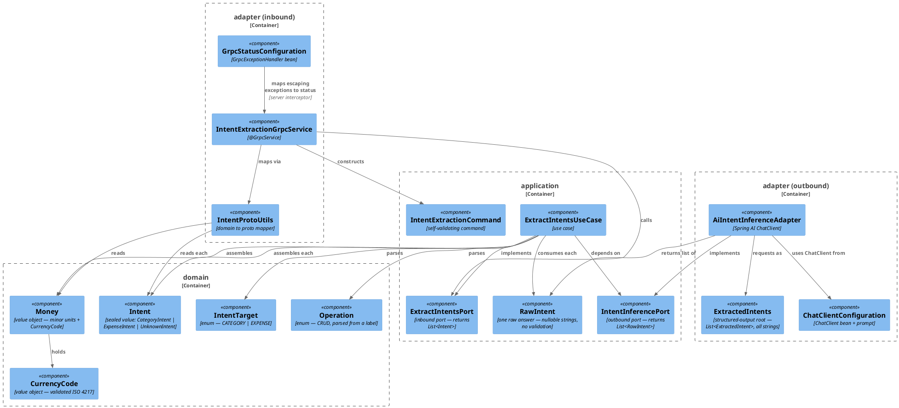
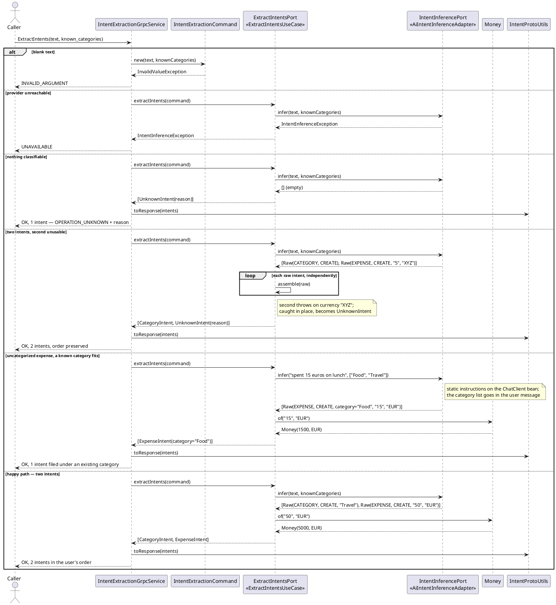

# Plan: Initialize the AI Connector Service

**Affected Modules:** `ai-connector-service`, `ledger-service`, `tools`

## Objective

Stand up a new Spring Boot service, `ai-connector-service`, that exposes a **gRPC** contract — protobuf over
HTTP/2, not REST — accepts a line of user text, and returns the structured **intents** it expresses, extracted
by an OpenAI chat model through **Spring AI 2**.

One message can carry **several** intents: *"create a Travel category and put 50 euros of taxi in it"* is a
category creation followed by an expense. The response is therefore an ordered list, not a single intent, and
**the order is the order the user expressed them** — the service never reorders. A user may equally name the
expense first (*"I ordered a coffee for 5 euros while traveling, so create a Travel category too"*), so a
caller executing the list in sequence must be ready to create a category an earlier expense already named.

The request carries **the categories the user already has**, and an expense may only be filed under one of
them: *"spent 15 euros on lunch"* becomes an expense in `Food` if `Food` is one of theirs. The caller always
includes a catch-all (`Other`), so there is always a fit. **The service never proposes a new category** — a
category is created only when the user asks for one outright.

A category the user names **anywhere in the same message** joins that set, for every entry whatever its
position: *"create a Travel category and put 50 euros of taxi in it"* and *"I ordered a coffee for 5 euros
while traveling, so create a Travel category too"* both file the expense under `Travel`, though the caller had
never heard of it. A message is one unit of intent — a user who mentions the expense first has still named the
category.

Two intent families are in scope, each with the full CRUD operation set:

- **category** — the user acts on an expense category;
- **expense** — the user acts on an expense.

Multiple currencies are supported, and **no monetary value is ever held in `double` or `float`** — on the wire,
in the domain, in the adapter's structured-output record, or anywhere in between.

The module also gets its own conventions set and README, matching the ones `ledger-service` already has.

## Proposed Solution

### Contract

A new Protocol Buffers schema at the repo-root **`proto/intent_extraction.proto`** defines one
service with one unary RPC returning a **repeated** `Intent`. Each entry carries an `Operation` plus a `oneof`
of exactly one typed payload, so a `DELETE` on a category cannot syntactically carry an amount.

The list is **ordered** (the user's order — a category creation must reach the ledger before the expense
naming it) and **never empty** ("nothing found" is one entry with `OPERATION_UNKNOWN` and a `reason`).

`UNKNOWN` is **per entry**, so one unusable answer among three leaves the other two actionable.

`known_categories` is a **closed set** and must be non-empty — an empty list is `INVALID_ARGUMENT`, since a
caller that omits it would otherwise get every categorized expense back as `UNKNOWN`. An `ExpenseIntent` whose
category is not in the set becomes `UNKNOWN`. Matching is case-insensitive and the matched spelling is
returned. The constraint applies to the category an expense is *filed under*, not to `CategoryIntent.name` — a
user asking to create `Travel` names something deliberately absent from the set.

The set is closed per request but **includes what the message itself names**: every category answer with a
usable name contributes it, wherever it sits and **whatever its operation**. This service parses intents — it
does not judge whether a set of them can be carried out together. Whether deleting a category and filing an
expense under it in one message makes sense is the caller's problem, not a parsing question. A category answer
with a blank name contributes nothing: there is no name to contribute.

A `CREATE` expense always carries a category: the catch-all guarantees a fit, so an omission is model
non-compliance and becomes `UNKNOWN`. `READ` and `DELETE` may omit it — *"delete my last expense"* names no
category, and filing it under the catch-all would invent a fact.

`default_currency` is applied **in the use case**, not by the model — an amount with no currency takes the
request's default and becomes `UNKNOWN` only when none was sent.

Only a failure to reach or parse the provider becomes a non-`OK` status.

Money crosses the wire as `int64 minor_units` plus an ISO 4217 code. `OPERATION_UNSPECIFIED = 0` is the
proto3-mandated zero value and means "never set" (a bug); `OPERATION_UNKNOWN` is a deliberate classification
outcome. The two are not interchangeable.

```proto
syntax = "proto3";

package bot.finance.ai.v1;

option java_multiple_files = true;
option java_package = "bot.finance.ai.adapter.grpc.v1";
option java_outer_classname = "IntentExtractionProto";

service IntentExtractionService {
  rpc ExtractIntents(ExtractIntentsRequest) returns (ExtractIntentsResponse);
}

message ExtractIntentsRequest {
  string text = 1;
  // The closed set an expense may be filed under; must be non-empty. The caller
  // includes a catch-all (e.g. "Other"), so a fitting entry always exists.
  repeated string known_categories = 2;
  // ISO 4217 code applied when the user states an amount but no currency. Absent means
  // an amount without a currency cannot be resolved and yields OPERATION_UNKNOWN.
  optional string default_currency = 3;
}

message ExtractIntentsResponse {
  // Ordered as the user expressed them; never empty.
  repeated Intent intents = 1;
}

message Intent {
  Operation operation = 1;
  oneof payload {
    CategoryIntent category = 2;
    ExpenseIntent  expense  = 3;
  }
  // Set only when operation is OPERATION_UNKNOWN.
  string reason = 4;
}

enum Operation {
  OPERATION_UNSPECIFIED = 0;
  OPERATION_UNKNOWN     = 1;
  OPERATION_CREATE      = 2;
  OPERATION_READ        = 3;
  OPERATION_UPDATE      = 4;
  OPERATION_DELETE      = 5;
}

message CategoryIntent {
  string name = 1;
  optional string new_name = 2;
}

message ExpenseIntent {
  // Always set for OPERATION_CREATE; may be absent for READ and DELETE.
  optional string category_name = 1;
  optional Money  amount        = 2;
  optional string description   = 3;
}

message Money {
  int64  minor_units = 1;
  string currency    = 2;
}
```

`java_package` places the generated types **inside the adapter layer** (`bot.finance.ai.adapter.grpc.v1`), so
the architecture test treats a core class referencing a protobuf message as the layer violation it is, rather
than as an unclassified dependency it would silently ignore.

Note the deliberate name collision: the proto `Intent` message and the domain `Intent` sealed interface share a
simple name. `IntentProtoUtils` is the only class that sees both, and it is exactly the case
[Imports](../ai-connector-service/docs/conventions/code-style.md#general) allows a fully qualified name for.

### Flow and layering

`IntentExtractionGrpcService` (`@GrpcService`) maps the request — its `text` and its `known_categories` — into
an `IntentExtractionCommand` and calls the `ExtractIntentsPort` inbound port. `ExtractIntentsUseCase` implements
it: it calls the `IntentInferencePort` outbound port with both, gets back a `List<RawIntent>` — each a flat
record of **nullable `String` fields** carrying one unvalidated answer — and assembles a validated domain
`Intent` from each, **independently**.

Each entry is assembled inside its own `try`, so one bad answer yields an `UnknownIntent` in its position and
leaves its neighbours intact; a single try around the loop would discard a message's usable intents. Order is
preserved throughout — `List`, never `Set`, no sorting.

Assembly is therefore **two passes**: the first collects the name of every raw answer that is a usable category
intent, the second assembles each entry against the command's categories plus those. `assemble` takes that
combined set rather than reading the command's list directly, so an expense does not depend on where in the
message its category was named.

The adapter never builds domain objects or parses amounts: it passes the model's decimal string through, and
`Money.of(String, String)` parses it with `new BigDecimal(String)`.

`AiIntentInferenceAdapter` implements the outbound port with Spring AI's `ChatClient`, structured output
targeting `ExtractedIntents` — a wrapper record holding `List<ExtractedIntent>`, giving the JSON schema a named
root. Every `ExtractedIntent` field is a `String`, `amount` included, so the schema never invites a number. A
provider or parse failure becomes `IntentInferenceException`; an empty list does not — the use case turns that
into the single `UnknownIntent`.

Known categories vary per call, so they go in the **user message**, not the `ChatClient` bean's default system
prompt: that bean is built once at startup, and a list baked into it would serve every user the first user's
categories.

`Intent` is a sealed interface over `CategoryIntent`, `ExpenseIntent` and `UnknownIntent`, so
`IntentProtoUtils` maps each entry with an exhaustive switch and a fourth intent kind cannot be added without
the compiler pointing at the mapper.

### Module scaffolding

`ai-connector-service/` is an independent Gradle build, exactly as `ledger-service/` is: its own
`settings.gradle`, `gradle.properties`, `build.gradle`, wrapper, and `Dockerfile`. Base package
`bot.finance.ai`. The gRPC server listens on **1001**; Actuator's REST endpoints — health, readiness, metrics
only, no part of the contract — on **1002**. Both are HTTP: gRPC speaks HTTP/2 on Netty, Actuator speaks
HTTP/1.1 on a servlet container. They are separate ports because they are separate servers, not because one is
HTTP and the other is not.

Verified dependency facts (all checked against Maven Central and the current reference docs):

- Spring Boot **4.1.0** ships gRPC support itself — `org.springframework.boot:spring-boot-starter-grpc-server`
  and `spring-boot-starter-grpc-server-test`. Spring gRPC's own `spring-grpc-*-spring-boot-starter` artifacts
  stop at 1.0.3 and are **not** the right choice here: the 1.1.0 BOM manages only `spring-grpc-core`, because
  the starters moved into Boot 4.
- Spring AI **2.0.0** (GA, June 2026) requires Spring Boot 4.0/4.1 — BOM `org.springframework.ai:spring-ai-bom:2.0.0`,
  starter `org.springframework.ai:spring-ai-starter-model-openai`. Note the artifact id is
  `spring-ai-starter-model-openai`, **not** `spring-ai-starter-openai` (which does not exist). It reaches the
  provider through the official `com.openai:openai-java-core` SDK over OkHttp, not `RestClient` — but
  `spring.ai.openai.base-url` still redirects it, and the wire format is the standard chat-completions schema,
  so pointing the whole client at WireMock in tests works regardless.
- Boot 4.1.0 manages `grpc-java` 1.80.0 and `protobuf-java` 4.34.2; the `com.google.protobuf` Gradle plugin
  (0.10.0) is pinned to those same versions so codegen and runtime cannot drift.
- gRPC has **no test slice** — `spring-boot-grpc-test` provides only `@AutoConfigureTestGrpcTransport` (in-process
  transport) and `@LocalGrpcServerPort`, both used with `@SpringBootTest`. The inbound-adapter test therefore
  boots the full context and isolates by mocking the inbound port, which is stated explicitly in the module's
  testing conventions rather than left as a surprise.

### Supporting changes outside the module

`tools/agent-test.sh` is hard-coded to `ledger-service` (`module_dir="$repo_root/ledger-service"` at line 14),
and its argument parser rejects anything it does not recognize — verified: `--module ai-connector-service`
exits 2 with "Unknown option". It gains a **required** `--module <name>` option.

Mandatory rather than defaulted: a default would let an omitted flag test `ledger-service` and report green
for it — a silent wrong answer.

It breaks every existing caller, so the same change updates `ledger-service/docs/conventions/build.md` (four
flagless commands) and `tools/README.md`. The `.claude/settings.local.json` permission entries use `:*` and are
unaffected — checked.

Everything else derives from `module_dir`: `runs_root` (15), the existence check (66), `run_dir` (106),
`lock_dir` (113), the `cd` (214). The lock moving under the module makes the queue per-module.

Two neighbouring files need **no** change, though both look like they would: `tools/agent-reports.gradle` is
already module-agnostic (`gradle.allprojects`, system properties only), and `tools/junit-summary.awk` filters
stack frames on `/bot\.finance/` (line 99), which `bot.finance.ai` matches — a base package outside
`bot.finance` would have silently emptied every failure summary.

Files created: the conventions set (`ai-connector-service/docs/conventions.md` + `conventions/*.md`),
`ai-connector-service/README.md`, the Gradle build files, the repo-root `proto/intent_extraction.proto`,
`AiConnectorServiceApplication`, `CurrencyCode`, `Money`, `Operation`, `IntentTarget`, `Intent`,
`CategoryIntent`, `ExpenseIntent`, `UnknownIntent`, the domain exceptions, `IntentExtractionCommand`,
`RawIntent`, `ExtractIntentsPort`, `IntentInferencePort`, `Logger`, `LoggerFactory`, `ExtractIntentsUseCase`,
`IntentExtractionGrpcService`, `IntentProtoUtils`, `GrpcStatusConfiguration`, `AiIntentInferenceAdapter`,
`ExtractedIntent`, `ExtractedIntents`, `ChatClientConfiguration`, `IntentExtractionProperties`,
`UseCaseConfiguration`, `Slf4jLogger`, `Slf4jLoggerFactory`, `CleanArchitectureTest`, `ActuatorHealthSystemTest`.
Files modified: `tools/agent-test.sh`, `tools/README.md`, `ledger-service/docs/conventions/build.md`,
`infrastructure/docker-compose.yaml`, repo-root `README.md`.

#### Diagrams





## Step-by-Step Implementation Map (To-Do List)

### Stabilization

#### API Contract

- [x] Create the repo-root **`proto/intent_extraction.proto`** with the schema given in
  [Proposed Solution](#contract) above — verbatim, including `java_package = "bot.finance.ai.adapter.grpc.v1"`
  and both `OPERATION_UNSPECIFIED` and `OPERATION_UNKNOWN`. It lives outside the module so `ledger-service` can
  generate its client stubs from the same file rather than a copy that drifts.
- [x] Point this module's build at it: `sourceSets.main.proto.srcDir("$rootDir/../proto")` (the module is its
  own Gradle build, so `rootDir` is the module directory). Keep `src/main/proto` out of the tree entirely —
  two proto source roots is how a stray second copy gets introduced.
- [x] Confirm codegen produces `IntentExtractionServiceGrpc.IntentExtractionServiceImplBase` and the message
  classes under `build/generated/sources/proto/main/` (`java/` and `grpc/` subdirectories) — every later step
  compiles against these, so a codegen failure here is a blocker, not something a step agent works around.

#### Interface-First / Build Stabilization

New-method stubs must carry a short inline comment describing the implementation intent, for example:

```java
public List<Intent> extractIntents(IntentExtractionCommand command) {
    // infers the raw answers through IntentInferencePort and assembles each into a validated Intent,
    // falling back to UnknownIntent per entry when an answer cannot be mapped
    return null;
}
```

**Interface & Signature Sync**

- [x] Create the Gradle build for `ai-connector-service/`: `settings.gradle`
  (`rootProject.name = 'ai-connector-service'`), `gradle.properties`, `build.gradle`, and the Gradle wrapper
  copied from `ledger-service/` (9.3.0). Pin in `gradle.properties`: `springBootVersion=4.1.0`,
  `springDependencyManagementVersion=1.1.7`, `springAiVersion=2.0.0`, `protobufGradlePluginVersion=0.10.0`,
  `protobufVersion=4.34.2`, `grpcVersion=1.80.0`, `awaitilityVersion=4.2.2`, `wiremockVersion=3.13.0`,
  `archunitVersion=1.4.2`, `jacocoVersion=0.8.13`, `appVersion=1.0.0`. Java toolchain 25.
- [x] Add to `build.gradle`: the `com.google.protobuf` plugin and its `protobuf { }` block wiring
  `com.google.protobuf:protoc:${protobufVersion}` and `io.grpc:protoc-gen-grpc-java:${grpcVersion}`;
  `implementation platform("org.springframework.ai:spring-ai-bom:${springAiVersion}")`;
  `spring-boot-starter-grpc-server`, `spring-boot-starter-actuator`, `spring-boot-starter-webmvc` (Actuator
  only), `org.springframework.ai:spring-ai-starter-model-openai`;
  and test dependencies `spring-boot-starter-grpc-server-test`, `spring-boot-starter-webmvc-test`,
  `io.rest-assured:rest-assured` and `io.rest-assured:json-path` (pin `restAssuredVersion=6.0.0` to match
  `ledger-service`), `org.wiremock:wiremock-standalone`, `org.awaitility:awaitility`,
  `com.tngtech.archunit:archunit-junit5`, `junit-platform-launcher`. `spring-boot-starter-webmvc-test` and
  RestAssured are both earned by `ActuatorHealthSystemTest` below. **No Testcontainers, no database dependency,
  no Flyway.**
- [x] Create `AiConnectorServiceApplication` and a `package-info.java` for every package in the tree from
  [Architecture & Layering](../ai-connector-service/docs/conventions/architecture.md#package-structure),
  including the empty `domain/model`.
- [x] Add `Logger` and `LoggerFactory` to `application/port`, and `Slf4jLogger` / `Slf4jLoggerFactory` to
  `adapter/logging` — ported unchanged from `ledger-service` so the two modules log identically.
- [x] Add the two domain exceptions in `domain/exception`, per
  [Domain](../ai-connector-service/docs/conventions/code-style.md#domain): `InvalidValueException` for every
  self-validation failure, `IntentInferenceException` for the provider giving no usable answer.
- [x] Add the domain value types with stubbed bodies: `CurrencyCode`, `Money` (`of(String, String)`,
  `amount()`), `Operation` (`fromLabel(String)`), `IntentTarget` (`fromLabel(String)`), the sealed `Intent`
  interface, and `CategoryIntent` / `ExpenseIntent` / `UnknownIntent`.
- [x] Add `IntentExtractionCommand(String text, List<String> knownCategories,
  Optional<CurrencyCode> defaultCurrency)` and `RawIntent(String target, String operation, String categoryName,
  String newCategoryName, String amount, String currency, String description)` to `application/dto`. The
  command validates itself: non-blank `text`; a `knownCategories` that is non-null, **non-empty**, and free of
  null or blank elements; a non-null `defaultCurrency` Optional. Holding a
  `CurrencyCode` rather than a raw string means an unusable default is rejected at the boundary instead of
  surfacing mid-assembly. It defensively copies the list into an unmodifiable one. `RawIntent` takes no
  validation — see [Application](../ai-connector-service/docs/conventions/code-style.md#application).
- [x] Add `extractIntents(IntentExtractionCommand): List<Intent>` to the `ExtractIntentsPort` inbound port and
  `infer(String text, List<String> knownCategories): List<RawIntent>` to the `IntentInferencePort` outbound
  port (interfaces only — the implementation stubs follow). The outbound port takes the two values, not the
  inbound command: a command is the inbound side's shape, and handing it to an outbound port would tie the two
  boundaries together for no gain. Both return `List`, never `Set` or any unordered type: the caller executes
  the intents in sequence and a reordering would break a message whose second intent depends on its first.
- [x] Stub `ExtractIntentsUseCase.extractIntents()` and its private `assemble(RawIntent, IntentExtractionCommand)`
  helper — the helper handles **one** raw answer, so the loop in `extractIntents()` can catch per entry, and it
  needs the command to reach the default currency.
- [x] Stub `AiIntentInferenceAdapter.infer()`, and add `ExtractedIntent` (the per-intent structured-output
  record, every field a `String`, `amount` included) plus `ExtractedIntents` — the wrapper record holding
  `List<ExtractedIntent>` that Spring AI targets, so the derived schema has a named root object.
- [x] Stub `IntentProtoUtils.toResponse(List<Intent>): ExtractIntentsResponse` and
  `IntentExtractionGrpcService.extractIntents(ExtractIntentsRequest, StreamObserver<ExtractIntentsResponse>)`,
  extending the generated `IntentExtractionServiceImplBase`. The mapper takes the whole list, not one intent,
  so building the repeated field stays in one place.
- [x] Add `UseCaseConfiguration` in `adapter/config` wiring `ExtractIntentsPort` to `ExtractIntentsUseCase`, and
  `ChatClientConfiguration` in `adapter/ai` declaring the `ChatClient` bean from the injected
  `ChatClient.Builder`.
- [x] Give `IntentExtractionGrpcService` a private precondition check that runs **before** it constructs the
  command, per [Application](../ai-connector-service/docs/conventions/code-style.md#application): non-blank
  `text`, a non-empty `known_categories` with no blank entry, and a `default_currency` that is either absent or
  a code `CurrencyCode` accepts — which normalizes case, so the check goes through `CurrencyCode` rather than
  calling `java.util.Currency` itself and disagreeing with the domain about the same question. A failure takes the adapter's own rejection path —
  `onError(Status.INVALID_ARGUMENT.withDescription(...).asRuntimeException())` — and the port is never called.
- [x] Add `GrpcStatusConfiguration` in `adapter/grpc` declaring a
  `org.springframework.grpc.server.exception.GrpcExceptionHandler` bean (`StatusException handleException(Throwable)`,
  returning `null` for throwables it does not recognize): `IntentInferenceException` → `UNAVAILABLE`, and
  nothing else. `InvalidValueException` is deliberately **not** mapped: the adapter rejects unusable input
  before a command is built, so one escaping to the handler means a precondition check is missing — a bug, for
  which gRPC's own `UNKNOWN` is the honest status rather than a client-error code that would hide it.
- [x] Add `bot.finance.ai.architecture.CleanArchitectureTest` with four rules: the layer-dependency rule; the
  framework-agnostic core (`org.springframework..`, `jakarta..`, `org.slf4j..`, `io.grpc..`,
  `com.google.protobuf..` banned from `domain`/`application`); `coreTypesCarryNoExternalSystemName`
  (`OpenAi`, `Grpc`, `Proto`); and `adaptersReachUseCasesThroughPorts` — no class in `adapter..`, **except**
  `adapter/config..`, may depend on `application.usecase..`.

  No `double`/`float` rule: keeping money off binary floating point is a design instruction for `Money` in
  this plan, not a module convention.
- [x] Get the module to build green before any test is written.

**Configuration**

- [x] Add `src/main/resources/application.yaml`: `spring.application.name: ai-connector-service`,
  `spring.threads.virtual.enabled: true`, `spring.grpc.server.port: 1001`, `server.port: 1002` (Actuator only),
  `spring.ai.openai.api-key: ${OPENAI_API_KEY:}`, `spring.ai.openai.base-url: ${OPENAI_BASE_URL:https://api.openai.com}`,
  `spring.ai.openai.chat.model: ${OPENAI_MODEL:gpt-4o-mini}`, `spring.ai.openai.chat.temperature: 0`, and the
  same `management.*` block `ledger-service` uses.
- [x] Add `src/main/resources/logback.xml`, ported from `ledger-service`.
- [x] Add the static extraction instructions at `src/main/resources/prompts/extract-intents.st`, applied as the
  `ChatClient` bean's default system prompt. They must instruct the model to return **one entry per distinct
  action** the message asks for, **in the order the user expressed them**; to return the amount as a **decimal
  string** and the currency as an ISO 4217 alphabetic code; to use the target labels `category` / `expense` and
  the operation labels `create` / `read` / `update` / `delete`; and to leave every field it is unsure of absent
  rather than guessing. It must also say that a single action stays a one-entry list, so the model does not
  pad, and that a message asking for nothing yields an empty list rather than an invented intent.
- [x] Add the per-call user-message template at `src/main/resources/prompts/user-message.st`, carrying the
  user's text and the known-category list. It must tell the model to file every expense under **exactly one of
  the listed categories** — always, falling back to the catch-all when none fits — and never to invent a
  category name for an expense. Keep it a separate file from the system instructions.
- [x] Add `IntentExtractionProperties` (`@ConfigurationProperties("ai.intent")`) in `adapter/ai` holding both
  prompt resource locations — the system instructions and the per-call user-message template — and wire it into
  `ChatClientConfiguration` and `AiIntentInferenceAdapter` so neither hard-codes a classpath path.
- [x] Add `src/test/resources/application-test.yaml` with a dummy `spring.ai.openai.api-key` so no test depends
  on a real key being present in the environment.
- [x] Add `ai-connector-service/Dockerfile`, ported from `ledger-service` with `EXPOSE 1001 1002`. **Its build
  context must be the repository root, not the module directory**, because the build now needs `proto/` as well
  as `ai-connector-service/` — so the `COPY` lines are repo-root-relative. Ledger's Dockerfile copies from a
  module-rooted context and is not a straight template here.
- [x] Add an `ai-connector-service` entry to `infrastructure/docker-compose.yaml`: build context `..` (the
  repository root) with `dockerfile: ai-connector-service/Dockerfile`, ports `1001:1001` and `1002:1002`,
  environment `OPENAI_API_KEY`, on the `backend` network, with no `depends_on` (it has no database).
- [x] Add a **required** `--module <name>` option to `tools/agent-test.sh`: derive `module_dir` from it (and
  with it `runs_root`, the run directory and the lock), exit 2 with the usage text when the flag is absent, and
  exit 2 when the name is not a directory at the repo root. No default — see
  [Supporting changes](#supporting-changes-outside-the-module) for why a default would let a run silently
  target the wrong module. Update the script's header comment (line 3) and its usage text.
- [x] Update the four flagless invocations in `ledger-service/docs/conventions/build.md` to carry
  `--module ledger-service`. They document the only existing caller and become wrong the moment the option is
  required.
- [x] Rewrite `tools/README.md` for two modules. It names `ledger-service` in at least five places — the
  opening sentence, the run-directory example (line 61), the "directories live under `ledger-service/build/`"
  note (line 79), a module-specific timing figure (line 138), and the raw-Gradle note (line 146) — and its
  three example commands are all flagless.
- [x] Verify the change against the existing module before relying on it here: run
  `tools/agent-test.sh --module ledger-service --all` and confirm the suite still reports as it did, and that
  an invocation with no `--module` now fails rather than defaulting.
- [x] Update the repo-root `README.md` services table: give the AI Connector Service its README link, port
  `1001`, and a stack of "Java, Spring Boot, Spring AI" — and note in the C2 diagram that the Ledger Service
  reaches it over gRPC, not REST.

**Shared Test Infrastructure**

- [x] Add `bot.finance.ai.common.WireMockSupport` — the JVM-wide singleton stub server on a dynamic port, with
  `baseUrl()`. Ported from `ledger-service`'s `common/containers/WireMockSupport`, but placed directly in
  `common`: there is no container here for a `containers` package to hold.
- [x] Add `bot.finance.ai.common.JsonUtils` and `bot.finance.ai.common.LogCapture`, ported unchanged.
- [x] Add `bot.finance.ai.common.ChatCompletionFixtures` — text-block builders for OpenAI chat-completions
  responses. The extracted JSON must be embedded **as a string inside `choices[0].message.content`**, since
  that is what Spring AI parses; a fixture that returns the payload directly produces a failure that looks like
  a mapping bug. The embedded payload is the `{"intents":[…]}` wrapper, and the builders must take a **varargs
  or list of entries** so a test can stub zero, one, or several intents in one response — every multi-intent
  scenario below depends on it. Needed by both the AI adapter test and the system test.
- [x] Add `bot.finance.ai.common.WireMockStubs` with `stubChatCompletion(String extractedJson)`,
  `stubChatCompletionServerError()` and `stubMalformedChatCompletion()`, all against
  `POST /v1/chat/completions` and all reached through `WireMockSupport.SERVER`, never the static DSL.
- [x] Add `bot.finance.ai.common.IntentFixtures` with, among the plain builders, two **operation-aware**
  factories — `categoryIntent(Operation)` and `expenseIntent(Operation)` — each returning an intent that is
  *valid for that operation*: a new name when the operation is `UPDATE`, and **both an amount and a category**
  when it is `CREATE`, so a `@ParameterizedTest` over `Operation.values()` asks for a valid instance instead of
  re-encoding the rules. Add `money()` and `rawIntent(...)` builders alongside. Needed by
  `IntentProtoUtilsTest`, `IntentExtractionGrpcServiceTest` and `ExtractIntentsUseCaseTest`.
- [x] Add `bot.finance.ai.common.RequestFixtures` — builders for a valid `ExtractIntentsRequest`, carrying a
  non-empty known-category list (`Food`, `Travel`, `Other`) by default, with overloads for the text, the
  categories and the default currency. Every gRPC test that is not specifically about request validation builds
  its request here: an empty `known_categories` is `INVALID_ARGUMENT`, so a hand-written request that omits it
  fails before reaching the behaviour under test.
- [x] Add `bot.finance.ai.common.AiAdapterTest` — the composed annotation booting only
  `AiIntentInferenceAdapter`, `ChatClientConfiguration` and Spring AI's OpenAI autoconfiguration, with
  `spring.ai.openai.base-url` pointed at `WireMockSupport.baseUrl()` via `@DynamicPropertySource`. It must not
  start the gRPC server.
- [x] Add `bot.finance.ai.common.GrpcAdapterTest` — the composed annotation combining `@SpringBootTest`,
  `@AutoConfigureTestGrpcTransport` and the `test` profile, for the inbound-adapter test. It also **owns how
  the blocking stub is obtained** — `@ImportGrpcClients(types = IntentExtractionServiceBlockingStub.class)` on
  the annotation, so every inbound test autowires the stub rather than inventing a channel.
- [x] Add `bot.finance.ai.common.AbstractSystemTest` — boots the full application over the **real Netty
  transport** on a random port (`@SpringBootTest(webEnvironment = RANDOM_PORT, properties =
  "spring.grpc.server.port=0")`), takes the bound port with `@LocalGrpcServerPort`, and builds one plaintext
  `ManagedChannel` — exposed to subclasses, so a test needing a second stub (`HealthGrpc`, say) can build one
  on it — plus the `IntentExtractionService` blocking stub, shutting the channel down after the class. It also
  exposes the Actuator port via `@LocalServerPort` for RestAssured, points `spring.ai.openai.base-url` at the
  WireMock singleton, and resets stubs in `@AfterEach`. **Not** `@AutoConfigureTestGrpcTransport`: that
  replaces the server factory, and binding the port is part of what a system test exists to prove.

  These two are the only places a stub is constructed.
- [x] Confirm `bot.finance.ai.architecture.CleanArchitectureTest` passes against the stabilized module.

### Red Phase

#### TDD Unit Red Phase

- [x] `CurrencyCode` · test: `CurrencyCodeTest` · covers: `of()`
    - `of()`:
        - given: a valid ISO 4217 alphabetic code
          when: of() is called
          then: returns a currency code holding that code
        - given: a lowercase valid code
          when: of() is called
          then: the code is normalized to upper case
        - given: a code `java.util.Currency` does not recognize
          when: of() is called
          then: throws InvalidValueException
        - given: null or a blank string
          when: of() is called
          then: throws InvalidValueException
- [x] `Money` · test: `MoneyTest` · covers: `of()`, `amount()`
    - `of()`:
        - given: "12.50" and "EUR"
          when: of() is called
          then: returns money holding 1250 minor units
        - given: "1500" and "JPY" — a zero-decimal currency
          when: of() is called
          then: returns money holding 1500 minor units, proving the exponent comes from the currency and not
          from a hard-coded 2
        - given: "12.5" and "EUR" — fewer decimals than the currency's scale
          when: of() is called
          then: returns money holding 1250 minor units
        - given: "12.505" and "EUR" — more decimals than the currency's scale
          when: of() is called
          then: throws InvalidValueException rather than rounding silently
        - given: an amount that is not a decimal number ("twelve", "1e3", "12,50", "NaN", "Infinity")
          when: of() is called
          then: throws InvalidValueException
        - given: a negative amount
          when: of() is called
          then: throws InvalidValueException
        - given: null amount or null currency code
          when: of() is called
          then: throws InvalidValueException
    - `amount()`:
        - given: money of 1250 minor units in EUR
          when: amount() is called
          then: returns a BigDecimal comparing equal to 12.50 with scale 2
        - given: money of 1500 minor units in JPY
          when: amount() is called
          then: returns a BigDecimal comparing equal to 1500 with scale 0
- [x] `Operation` · test: `OperationTest` · covers: `fromLabel()`
    - `fromLabel()`:
        - given: each of the labels "create", "read", "update", "delete"
          when: fromLabel() is called
          then: returns the matching operation
        - given: a label differing only in case or surrounded by whitespace
          when: fromLabel() is called
          then: returns the matching operation
        - given: an unrecognized label, a blank string, or null
          when: fromLabel() is called
          then: returns an empty Optional rather than throwing
- [x] `IntentTarget` · test: `IntentTargetTest` · covers: `fromLabel()`
    - `fromLabel()`:
        - given: the labels "category" and "expense"
          when: fromLabel() is called
          then: returns the matching target
        - given: an unrecognized label, a blank string, or null
          when: fromLabel() is called
          then: returns an empty Optional
- [x] `CategoryIntent` · test: `CategoryIntentTest` · covers: `CategoryIntent()`
    - `CategoryIntent()`:
        - given: an operation and a non-blank name
          when: the record is constructed
          then: the intent is created
        - given: a null or blank name
          when: the record is constructed
          then: throws InvalidValueException
        - given: a null operation
          when: the record is constructed
          then: throws InvalidValueException
        - given: a null Optional for the new name
          when: the record is constructed
          then: throws InvalidValueException — an absent value is Optional.empty(), never null
        - given: operation UPDATE with no new name
          when: the record is constructed
          then: throws InvalidValueException
- [x] `ExpenseIntent` · test: `ExpenseIntentTest` · covers: `ExpenseIntent()`
    - `ExpenseIntent()`:
        - given: an operation and all optional fields present
          when: the record is constructed
          then: the intent is created
        - given: operation READ or DELETE and every optional field empty
          when: the record is constructed
          then: the intent is created — for these operations the fields really are optional, including the
          category: *"delete my last expense"* names none, and the catch-all would invent one
        - given: a null operation
          when: the record is constructed
          then: throws InvalidValueException
        - given: a null Optional in any optional position
          when: the record is constructed
          then: throws InvalidValueException
        - given: operation CREATE with no amount
          when: the record is constructed
          then: throws InvalidValueException — the field is optional on the record but **mandatory for CREATE**,
          so the invariant is per-operation, not per-field; the message names the operation and the field, since
          the use case surfaces it verbatim as an UnknownIntent reason
        - given: operation CREATE with no category
          when: the record is constructed
          then: throws InvalidValueException — the catch-all guarantees a fit, so an omission is model
          non-compliance
- [x] `UnknownIntent` · test: `UnknownIntentTest` · covers: `UnknownIntent()`
    - `UnknownIntent()`:
        - given: a non-blank reason
          when: the record is constructed
          then: the intent is created
        - given: a null or blank reason
          when: the record is constructed
          then: throws InvalidValueException — an unknown result that does not say why is not useful to the
          caller
- [x] `IntentExtractionCommand` · test: `IntentExtractionCommandTest` · covers: `IntentExtractionCommand()`
    - `IntentExtractionCommand()`:
        - given: non-blank text and a list of category names
          when: the record is constructed
          then: the command is created and exposes both
        - given: null, empty, or whitespace-only text
          when: the record is constructed
          then: throws InvalidValueException
        - given: non-blank text and an empty category list
          when: the record is constructed
          then: throws InvalidValueException — the caller always sends at least the catch-all
        - given: a null category list
          when: the record is constructed
          then: throws InvalidValueException — absence is the empty list, never null
        - given: a category list containing a null or blank element
          when: the record is constructed
          then: throws InvalidValueException
        - given: a mutable category list used to construct the command
          when: that list is modified afterwards
          then: the command's list is unchanged, and attempting to modify the command's own list throws
        - given: a present default currency
          when: the record is constructed
          then: the command exposes it as a CurrencyCode
        - given: a null defaultCurrency Optional
          when: the record is constructed
          then: throws InvalidValueException — absence is Optional.empty(), never null
- [x] `ExtractIntentsUseCase` · test: `ExtractIntentsUseCaseTest` · covers: `extractIntents()`
    - `extractIntents()`:
        - given: the mocked port returns one raw expense answer with target "expense", operation "create",
          amount "15.00" and currency "EUR"
          when: extractIntents() is called
          then: returns a single ExpenseIntent with operation CREATE and money of 1500 minor units, and the
          port was called with **both** the command's text and its known categories
        - given: the mocked port returns an expense answer naming a category that was **not** in the command's
          known categories
          when: extractIntents() is called
          then: that position holds an UnknownIntent whose reason names the rejected category — the service
          never proposes a new one
        - given: an expense answer naming a known category in different case ("food" against "Food")
          when: extractIntents() is called
          then: the ExpenseIntent carries "Food" — matching is case-insensitive, the caller's spelling wins
        - given: a category-creation answer naming something absent from the known categories
          when: extractIntents() is called
          then: a CategoryIntent is returned — the closed set constrains what an expense is filed under, not
          what the user may ask to create
        - given: a category-creation answer naming "Travel", then an expense answer filed under "Travel", and a
          command whose known categories do **not** include it
          when: extractIntents() is called
          then: returns a CategoryIntent then an ExpenseIntent carrying "Travel" — a category created earlier in
          the message is available to the entries that follow it
        - given: the same two answers in the opposite order — the expense filed under "Travel" first, the
          creation of "Travel" second — with "Travel" absent from the known categories
          when: extractIntents() is called
          then: returns an ExpenseIntent carrying "Travel" then a CategoryIntent — position does not matter, as
          in *"I ordered a coffee for 5 euros while traveling, so create a Travel category too"*
        - given: a creation of "Travel" followed by an expense naming "travel" in a different case
          when: extractIntents() is called
          then: the ExpenseIntent carries "Travel" — a category created in-message matches case-insensitively
          and returns its own spelling, exactly as a pre-existing one does
        - given: a category answer whose operation is **delete** naming "Travel", followed by an expense filed
          under "Travel", with "Travel" absent from the known categories
          when: extractIntents() is called
          then: both resolve — a CategoryIntent and an ExpenseIntent carrying "Travel". Any operation
          contributes the name; whether the pair is *executable* is the caller's problem, not this service's
        - given: a category-creation answer that fails to assemble (a blank name), followed by an expense filed
          under that same name
          when: extractIntents() is called
          then: both positions hold an UnknownIntent — a creation that did not survive assembly never happened,
          so it adds nothing
        - given: the mocked port returns one raw category answer with target "category" and operation "delete"
          when: extractIntents() is called
          then: returns a single CategoryIntent with operation DELETE and the given name
        - given: the mocked port returns three raw answers whose targets are expense, category, expense
          when: extractIntents() is called
          then: the returned list has the same size and the same order as the port's list, position by position
        - given: the mocked port returns a valid category answer, an expense answer with an unknown currency,
          and a valid expense answer
          when: extractIntents() is called
          then: returns three intents — CategoryIntent, UnknownIntent, ExpenseIntent — so one unusable answer
          neither drops its neighbours nor shifts their positions
        - given: the mocked port returns an answer whose target is null or unrecognized
          when: extractIntents() is called
          then: that position holds an UnknownIntent whose reason names the unrecognized target
        - given: the mocked port returns an answer whose operation is unrecognized
          when: extractIntents() is called
          then: that position holds an UnknownIntent whose reason names the unrecognized operation
        - given: the mocked port returns an expense answer whose amount is not a decimal number
          when: extractIntents() is called
          then: that position holds an UnknownIntent whose reason **is the rejected value's exception message**,
          rather than propagating InvalidValueException — a bad answer is a classification outcome, not a fault
        - given: the mocked port returns an expense answer with operation "create" and no amount
          when: extractIntents() is called
          then: that position holds an UnknownIntent whose reason names the missing amount — the record's
          per-operation rejection reaches the caller as a readable reason
        - given: a command carrying default currency EUR, and an expense answer with amount "15" and no
          currency
          when: extractIntents() is called
          then: the ExpenseIntent carries money of 1500 minor units in EUR — the request's default fills the gap
        - given: a command with **no** default currency, and an expense answer with an amount but no currency
          when: extractIntents() is called
          then: that position holds an UnknownIntent — a bare number with nothing to denominate it is not money
        - given: a command carrying default currency EUR, and an expense answer that names USD explicitly
          when: extractIntents() is called
          then: the ExpenseIntent carries USD — a stated currency always beats the default
        - given: the mocked port returns an empty list
          when: extractIntents() is called
          then: returns exactly one UnknownIntent with a non-blank reason — the contract's never-empty
          guarantee
        - given: the mocked port returns null
          when: extractIntents() is called
          then: returns exactly one UnknownIntent
        - given: the mocked port returns a list containing a null element
          when: extractIntents() is called
          then: that position holds an UnknownIntent and the surrounding entries are unaffected
        - given: the mocked port throws IntentInferenceException
          when: extractIntents() is called
          then: the exception propagates — a provider failure is not an unknown intent
        - given: a null command
          when: extractIntents() is called
          then: throws InvalidValueException and the port is never called
- [x] `IntentProtoUtils` · test: `IntentProtoUtilsTest` · covers: `toResponse()`
    - `toResponse()`:
        - given: a single ExpenseIntent with operation CREATE and money of 1500 minor units in EUR
          when: toResponse() is called
          then: the response holds one intent carrying OPERATION_CREATE, the expense payload, `minor_units`
          1500 and currency "EUR"
        - given: a READ ExpenseIntent whose optional fields are all empty
          when: toResponse() is called
          then: the expense payload is selected and no optional field reports presence
        - given: a single CategoryIntent with operation UPDATE and a new name
          when: toResponse() is called
          then: the response holds one intent carrying OPERATION_UPDATE, the category payload, and the new name
        - given: a single UnknownIntent
          when: toResponse() is called
          then: the response holds one intent carrying OPERATION_UNKNOWN, the reason, and no payload set in
          the oneof
        - given: a list of CategoryIntent, UnknownIntent, ExpenseIntent
          when: toResponse() is called
          then: the response holds three intents in that same order, each with its own operation and payload
        - given: each Operation enum constant in turn, paired with an intent valid for it (a per-operation
          fixture — `CategoryIntent` requires a new name for UPDATE, `ExpenseIntent` an amount for CREATE)
          when: toResponse() is called
          then: the matching proto Operation is set, and OPERATION_UNSPECIFIED is never produced

#### TDD Integration Red Phase

- [x] `AiIntentInferenceAdapter` · test: `AiIntentInferenceAdapterTest` · covers: `infer()`
    - `infer()`:
        - given: the provider is stubbed to return one extracted expense entry
          when: infer() is called
          then: returns a single RawIntent carrying the entry's fields verbatim, with the amount still the
          decimal string the provider sent
        - given: the provider is stubbed to return three extracted entries — category, expense, category
          when: infer() is called
          then: returns three RawIntents in the same order the provider listed them
        - given: the provider is stubbed to return an entry with several fields absent
          when: infer() is called
          then: those RawIntent fields are null and no exception is thrown — the adapter validates nothing
        - given: the provider is stubbed to return an empty `intents` array
          when: infer() is called
          then: returns an empty list, not null and not an exception — deciding what emptiness means belongs
          to the use case
        - given: the provider is stubbed to return an extracted category entry
          when: infer() is called
          then: the request WireMock received names the configured model and carries the user's text, and the
          JSON schema it sent declares `intents` as an array whose entries' `amount` is a string, not a number
        - given: known categories "Food" and "Travel"
          when: infer() is called
          then: the request WireMock received carries both names in a **user** message, and the system message
          is the static instructions with no category in it
        - given: infer() is called once with categories "Food", then again with categories "Travel"
          when: both requests are inspected
          then: the second request carries "Travel" and not "Food" — proving the per-call list is not baked
          into the shared `ChatClient` bean
        - given: the provider responds 500
          when: infer() is called
          then: throws IntentInferenceException, not a Spring AI or HTTP client exception
        - given: the provider responds 200 with a body Spring AI cannot parse into the structured record
          when: infer() is called
          then: throws IntentInferenceException
- [x] `IntentExtractionGrpcService` · test: `IntentExtractionGrpcServiceTest` ·
  covers: `IntentExtractionService.ExtractIntents` · mocks: `ExtractIntentsPort`
    - _Every request comes from `RequestFixtures` unless the scenario names its own fields; the fixture carries
      a non-empty `known_categories`, without which the adapter rejects the call before the port is reached._
    - Happy Path:
        - given: the mocked port returns a single ExpenseIntent with operation CREATE and money of 1500 minor
          units in EUR
          when: ExtractIntents is called over the in-process transport with a valid text and two known
          categories
          then: the port is called with a command carrying that text **and both category names in order**, and
          the response holds one intent with OPERATION_CREATE, `minor_units` 1500 and currency "EUR"
        - given: a request with no `known_categories` — the proto3 default, an empty repeated field
          when: ExtractIntents is called
          then: fails with INVALID_ARGUMENT and the port is never called
        - given: the mocked port returns a CategoryIntent followed by an ExpenseIntent
          when: ExtractIntents is called
          then: the response holds two intents in that order, each with its own payload set in the oneof
        - given: a request carrying `default_currency` as "EUR" and, in turn, as "eur"
          when: ExtractIntents is called
          then: in both cases the command the port receives holds a present `CurrencyCode` of EUR — the field's
          request-to-command mapping is the adapter's, and nothing else covers it. **The code is matched
          case-insensitively**: `CurrencyCode` normalizes, and rejecting only this one field for its casing
          would be the odd case out in a contract whose category matching is case-insensitive throughout
        - given: the mocked port returns a single UnknownIntent
          when: ExtractIntents is called
          then: the RPC completes with status OK carrying one intent with OPERATION_UNKNOWN and the reason —
          unknown is never a non-OK status
    - Error Mapping:
        - given: the mocked port throws IntentInferenceException
          when: ExtractIntents is called
          then: fails with status UNAVAILABLE
        - given: the mocked port throws a RuntimeException the handler does not recognize
          when: ExtractIntents is called
          then: fails with status UNKNOWN, and the exception's message does not appear in the status
          description — the handler returns null for it rather than mapping it. An **absent** description
          satisfies this: the framework's fallback yields `Status.UNKNOWN` with none, which is the strongest
          form of not leaking. The assertion must therefore tolerate null rather than require a description
    - Validation: the adapter rejects these itself, before building a command, and the port is never called for
      any of them — `text` absent (the proto3 default empty string) or whitespace-only; `known_categories`
      empty or containing a blank entry; a `default_currency` present but not a known ISO 4217 code **in any
      casing**. Each fails with INVALID_ARGUMENT. Accepted: an absent `default_currency`, and a known code in
      any casing

#### TDD System Test Red Phase

- [x] `ExtractIntentsSystemTest` · covers: `IntentExtractionService.ExtractIntents`
    - _Entered over a real Netty channel on the bound port, per `AbstractSystemTest` — so a happy path here
      also proves the server binds and serves, which the in-process transport would have hidden. Requests come
      from `RequestFixtures`, so every one carries a non-empty `known_categories`._
    - Happy Path:
        - given: the provider is stubbed to extract an expense of 15.00 EUR in a "lunch" category
          when: ExtractIntents is called with "spent 15 euros on lunch"
          then: returns OK with one intent — OPERATION_CREATE, the expense payload, `minor_units` 1500 and
          currency "EUR"
        - given: the provider is stubbed to extract a "Travel" category creation followed by a 50 EUR taxi
          expense filed under "Travel", and known categories that do **not** include "Travel"
          when: ExtractIntents is called with "create a Travel category and put 50 euros of taxi in it"
          then: returns OK with two intents — the category creation first, then an expense carrying "Travel" —
          proving the whole stack carries a multi-intent answer through in the user's order, and that a category
          created in the message is available to the expense that follows it
        - given: known categories "Food", "Travel" and "Other", and the provider stubbed to file the expense
          under "Food"
          when: ExtractIntents is called with "spent 15 euros on lunch", naming no category
          then: returns OK with an expense whose category is "Food", and the request the provider received
          carried all three names — proving the closed set reaches the model end to end
        - given: the provider is stubbed to return an empty `intents` array
          when: ExtractIntents is called with "what is the weather"
          then: returns OK with exactly one intent carrying OPERATION_UNKNOWN and a non-empty reason
    - Unhappy Path:
        - given: the provider is stubbed to respond 500
          when: ExtractIntents is called with a valid text
          then: fails with status UNAVAILABLE
- [x] `ActuatorHealthSystemTest` · covers: `GET /actuator/health`
    - Happy Path:
        - given: the fully wired application
          when: GET /actuator/health is called with RestAssured on the Actuator port
          then: returns 200 with status "UP" — the second server is really running, and the readiness and
          liveness groups the `management.*` block declares are present
        - given: the fully wired application
          when: the gRPC health service `grpc.health.v1.Health/Check` is called on the gRPC port
          then: reports SERVING — Spring Boot backs it with the same Actuator health contributors, so the two
          surfaces cannot disagree

### Green Phase

#### TDD Unit Green Phase

- [x] `CurrencyCode` · test: `CurrencyCodeTest`
- [x] `Money` · test: `MoneyTest` · after: `CurrencyCode`
- [x] `Operation` · test: `OperationTest`
- [x] `IntentTarget` · test: `IntentTargetTest`
- [x] `CategoryIntent` · test: `CategoryIntentTest`
- [x] `ExpenseIntent` · test: `ExpenseIntentTest` · after: `Money`
- [x] `UnknownIntent` · test: `UnknownIntentTest`
- [x] `IntentExtractionCommand` · test: `IntentExtractionCommandTest` · after: `CurrencyCode`
- [x] `ExtractIntentsUseCase` · test: `ExtractIntentsUseCaseTest` · after: `CurrencyCode`, `Money`, `Operation`,
  `IntentTarget`, `CategoryIntent`, `ExpenseIntent`, `UnknownIntent`, `IntentExtractionCommand`
- [x] `IntentProtoUtils` · test: `IntentProtoUtilsTest` · after: `Money`, `CategoryIntent`, `ExpenseIntent`,
  `UnknownIntent`

#### TDD Integration Green Phase

- [x] `AiIntentInferenceAdapter` · test: `AiIntentInferenceAdapterTest`
- [x] `IntentExtractionGrpcService` · test: `IntentExtractionGrpcServiceTest` ·
  covers: `IntentExtractionService.ExtractIntents` · mocks: `ExtractIntentsPort` ·
  after: `IntentProtoUtils`, `IntentExtractionCommand`

#### TDD System Test Green Phase

- [x] `ExtractIntentsSystemTest` · covers: `IntentExtractionService.ExtractIntents`
- [x] `ActuatorHealthSystemTest` · covers: `GET /actuator/health`

  Both went green with no production change of their own: the unit and integration green steps completed the
  whole stack, leaving these steps nothing to fix. Verified by a full-suite run, not assumed.

## Open Questions / Blockers

- **Q1:** The `.proto` currently lives only in `ai-connector-service/src/main/proto/`. When `ledger-service` starts
  calling this service it will need the same schema to generate its client stubs — should the schema move to a
  shared location (a repo-root `proto/` directory both builds read), or should `ledger-service` keep its own
  copy? This plan assumes it stays put and the question is settled when the caller lands.
- A: yes, a shared location is preferred.

- **Q2:** Actuator is included, which adds a second server — a servlet container on port 1002 — purely for
  health/readiness/metrics over REST. Spring gRPC also exposes a gRPC health service
  (`spring.grpc.server.health.enabled`, on by default). Keep Actuator's REST surface for metrics parity with
  `ledger-service`, or drop `spring-boot-starter-webmvc` and run a single-server process with gRPC health
  checks only? This plan assumes Actuator stays.
- A: what is the industry standard for spring boot grpc health checks?

- **Q3:** `ExpenseIntent` is planned to reject a CREATE with no amount, and `CategoryIntent` to reject an UPDATE with
  no new name — turning an under-specified answer into an `UnknownIntent` the caller must handle. The
  alternative is to accept partial intents and let `ledger-service` decide whether to ask the user for the
  missing piece. Which behaviour do you want?
- A: I would reject them and map the error message. 

- **Q4:** What should happen when the user's text names an amount with no currency at all ("spent 15 on lunch")?
  This plan returns `UnknownIntent`. The alternatives are a configured default currency in this service, or
  returning the expense with the amount absent and letting the caller apply the user's default.
- A: yes, we can have a default currency as a parameter (grpc interface).

- **Q5:** `gpt-4o-mini` is set as the default model via `OPENAI_MODEL`. Confirm that is the model you want, and
  whether `temperature: 0` is right for extraction (it makes the same text extract the same way, at the cost of
  never varying phrasing — which for structured extraction is what you want).
- A: yes.

- **Q6:** Should the number of intents returned from one message be capped? Nothing currently bounds it: a long or
  adversarial message could make the model emit dozens of entries, and every one of them becomes work the
  ledger service executes. A configured maximum (say 10) could either truncate the list or replace the whole
  answer with a single `UNKNOWN`. This plan applies no cap.
- A: no cap, I think we can limit the telegram message size.

- **Q7:** Should `known_categories` be capped, and what happens past the cap? Every name goes into the prompt, so a
  user with hundreds of categories inflates cost and latency on each call and eventually hits the context
  window. Options: reject past a limit with `INVALID_ARGUMENT`, truncate silently, or let the caller decide
  what to send. This plan applies no limit.
- A: no limit, but it will be applied in the ledger's service. 

- **Q8:** `known_categories` is a bare `repeated string`. If the ledger service ever needs the model's choice
  resolved back to a category **id** rather than matched by name, the field has to become a message. Names now
  is the smaller contract and matching by name is the caller's job — confirm that is right, or say so now while
  the schema has no released consumers.
- A: I think we can keep it as a string.

- **Q9:** Must an `ExpenseIntent` always carry a category now that a catch-all is guaranteed? The proto keeps
  `category_name` optional, so the model may still omit it. Making it mandatory for expenses would turn an
  omission into `UNKNOWN` rather than letting the ledger apply its own fallback.
- A: yes, we can always fill it with 'other' in case nothing else fits. 

- **Q10:** The service does not require `known_categories` to be non-empty, so an empty list makes every categorized
  expense `UNKNOWN`. That is self-consistent, but a caller that forgets the field gets a silent wall of
  `UNKNOWN` instead of an error. Reject an empty list with `INVALID_ARGUMENT` instead?
- A:  yes, reject an empty list. 

- **Q11:** When two intents in one message conflict or duplicate — "delete the Travel category" twice, or a category
  deletion followed by an expense filed under that same category — does this service detect it, or is
  consistency the caller's problem? This plan does neither: intents are assembled independently and no entry is
  compared against another, so the ledger service sees the contradiction first.
- A: it's ledger's job.

Blockers recorded during implementation:

- **B1** (stabilization, resolved): the generated-source path was wrong in three documents — protobuf Gradle
  plugin 0.10.0 emits `build/generated/sources/proto/main/` (plural, split into `java/` and `grpc/`), not
  `build/generated/source/proto/main/`. Corrected in this plan, `conventions/architecture.md` and
  `conventions/orientation.md`. Not a blocker to the build; codegen and compilation both succeeded.
- **B2** (stabilization, resolved): the plan created `IntentExtractionProperties` without fixing the property
  keys it binds, so the agent writing `application.yaml` and the agent writing the record could disagree. Keys
  settled as `ai.intent.system-prompt` and `ai.intent.user-message-template`, both `classpath:` resources.
- **B4** (stabilization, resolved): three of the plan's API assumptions were wrong, all corrected in place.
  `@ImportGrpcClients` is `org.springframework.grpc.client.ImportGrpcClients`, not a
  `boot.grpc.test.autoconfigure` type. `@DynamicPropertySource` requires a static method in a class body, so
  the two composed annotations register their properties with a `DynamicPropertyRegistrar` bean instead;
  `AbstractSystemTest`, being an abstract class, uses `@DynamicPropertySource` as planned. `@AiAdapterTest` must
  also list `Slf4jLoggerFactory` among its context classes — `AiIntentInferenceAdapter` needs a `LoggerFactory`
  bean that no component scan supplies in so narrow a slice.

  Spring AI 2.0.0's OpenAI model reaches the provider through the official `openai-java` SDK over OkHttp, not
  `RestClient` as the plan claimed. `spring.ai.openai.base-url` still redirects it and the wire format is
  unchanged, so the WireMock strategy holds — but it is now proven only at the first outbound-adapter test,
  not by the plan's reasoning.
- **B5** (red phase, **resolved**): a category created in one message could not be named by an expense in that
  same message unless it already appeared in `known_categories`, so *"create a Travel category and put 50 euros
  of taxi in it"* yielded `CategoryIntent(Travel)` followed by `UnknownIntent`. Resolved by letting a
  category answer anywhere in the message extend the available set for **every** entry, whatever its position
  and whatever its operation — see [Contract](#contract) and the flow description. Neither position nor
  operation matters, because neither is a parsing question: *"I ordered a coffee for 5 euros while traveling,
  so create a Travel category too"* names the expense first and must still resolve, and a delete paired with an
  expense in that category is a *feasibility* judgement this service does not make. Scenarios were added to
  `ExtractIntentsUseCaseTest` and the system test's multi-intent scenario now withholds `Travel` from
  `known_categories`, so it proves the rule rather than passing by fixture coincidence.

  Consequence for the caller: the response preserves the user's order and the service never reorders, so a
  ledger executing the list in sequence may meet an expense naming a category created later in the same list —
  or one whose category the same list deletes. Reconciling that is the caller's job, consistent with **Q11**.
- **B7** (refactor phase, **resolved**): a lowercase `default_currency` was rejected at the gRPC
  boundary but accepted by the domain. `IntentExtractionGrpcService`'s precondition check calls
  `java.util.Currency.getInstance(code)` directly, so `"eur"` fails with `INVALID_ARGUMENT`; `CurrencyCode`'s
  compact constructor upper-cases before validating, so `CurrencyCode.of("eur")` succeeds — and
  `CurrencyCodeTest` asserts exactly that normalization. The two disagree on the same question. The adapter
  matches this plan as written (stabilization specified "a code `java.util.Currency` knows"), and the validation
  matrix only exercises `"EUR"` and `"ZZZ"`, so nothing pins the intended behaviour for a lowercase code.

  Left unchanged by the refactor phase — routing the adapter through `CurrencyCode` was the natural
  deduplication ("onto the value object that owns the data"), but it would have silently started accepting
  lowercase codes, an observable behaviour change and so out of bounds for a behaviour-preserving pass.

  Resolved by decision: **the RPC accepts a known code in any casing.** The domain already normalizes and
  category matching is case-insensitive throughout the contract, so rejecting only this field for its casing
  was the odd case out. The adapter's precondition check now goes through `CurrencyCode` in a single
  conversion — no second parse, and the rule lives in one place — rejecting an unusable code on the adapter's
  own `INVALID_ARGUMENT` path before the port is reached. `IntentExtractionGrpcServiceTest`'s happy-path
  scenario became a `@ParameterizedTest` over `"EUR"` and `"eur"`; `"ZZZ"` is still rejected.
- **B6** (green phase, resolved): the OpenAI base URL was missing its `/v1` segment everywhere. The
  `com.openai:openai-java-core` SDK builds its request as `baseUrl + ["chat", "completions"]` and never prepends
  a version, so `/v1` must be part of the base URL itself. `WireMockSupport.baseUrl()` returned
  `http://localhost:<port>` while the stubs were registered at `/v1/chat/completions`, and every call 404'd —
  which `AiIntentInferenceAdapterTest`'s two error-path tests *absorbed*, since an unmatched-stub 404 also
  produces `IntentInferenceException`. Resolved with `WireMockSupport.openAiBaseUrl()`, used by both
  `@AiAdapterTest` and `AbstractSystemTest`.

  The same defect was in production: `application.yaml`'s `spring.ai.openai.base-url` defaulted to
  `https://api.openai.com` and would have 404'd against the real provider. No test could have caught it — the
  dynamic property overrides it in every test. Corrected to `https://api.openai.com/v1`.
- **B3** (stabilization, resolved): a `void` RPC stub with an empty body terminates no `StreamObserver`, so
  every red-phase gRPC test would block to its deadline instead of failing. Overriding the generated method had
  removed the base class's own `UNIMPLEMENTED` response. `IntentExtractionGrpcService.extractIntents` now ends
  in `super.extractIntents(request, responseObserver)`, so the stub fails fast until the green phase replaces
  it. A stub for a method returning a value does not have this problem — hence nothing else needed it.

## Review Findings

- **F1:** The plan omits the `## Test Layer Mapping` section that `plan-task.md`'s **3. Plan Structure** lists
  as required. (The bundled `.claude/templates/example-plan.md` also omits it, so this may be a template
  inconsistency rather than a plan defect — but the two disagree and one of them should be corrected.)
- Action: test layer mapping is not the part of the plan, it's part of the skill. Maybe it's missplaced in the skill. Let's consider adjusting it. 

- **F2:** Conventions conflict over who rejects blank request text.
  `ai-connector-service/docs/conventions/code-style.md` (Application) states that a caller mapping external
  input into a command "must check its own preconditions **before** constructing it, so that unusable input
  takes that caller's normal rejection path instead of surfacing as an exception from the record". The plan does
  the opposite: `GrpcStatusConfiguration` maps `InvalidExtractionRequestException` → `INVALID_ARGUMENT`
  (Stabilization) and `IntentExtractionGrpcServiceTest`'s `Validation:` line relies on that mapping firing. Only
  one can be right — either `IntentExtractionGrpcService` validates `text` itself and calls
  `onError(Status.INVALID_ARGUMENT…)` (making the exception mapping dead code), or the convention is amended to
  say the record's exception *is* the adapter's rejection path. Left unresolved, the two red-phase steps that
  touch this will each pick a different answer.
- Action: let's with the convention. 

- **F3:** Two `ExpenseIntent` scenarios contradict each other (`TDD Unit Red Phase` → `ExpenseIntent()`).
  "given: an operation and every optional field empty / then: the intent is created" cannot hold at the same
  time as "given: operation CREATE with no amount / then: throws InvalidIntentException" unless the first
  scenario explicitly names a non-CREATE operation. As written, a step agent can satisfy one only by breaking
  the other.
- Action: but the second test means it is a mandatory field, not optional, isn't? 

- **F4:** The `IntentProtoUtilsTest` parameterized scenario "given: each Operation enum constant in turn" is
  not satisfiable with a single fixture. `CategoryIntent` rejects `UPDATE` without a new name and
  `ExpenseIntent` rejects `CREATE` without an amount (both per this plan's own unit scenarios), so the
  parameterized case needs a per-operation fixture. The scenario does not say that, and `IntentFixtures` as
  specified provides one valid instance of each intent, not one per operation.
- Action: what do you suggest? 

- **F5:** `after: Operation` on the `CategoryIntent` and `ExpenseIntent` green-phase steps is a false
  dependency. `Operation`'s only green-phase behaviour is `fromLabel()`; the enum constants those two tests
  construct with exist as soon as the type does. The marker serializes three steps that could run in parallel.
  `after: Money` on `ExpenseIntent` and `after: CurrencyCode` on `Money` are real and should stay.
- Action: agree.

- **F6:** No step creates the gRPC client stub every inbound test enters through. `IntentExtractionGrpcServiceTest`
  and `ExtractIntentSystemTest` both call `ExtractIntent` over the transport, but neither the **Shared Test
  Infrastructure** bullets nor the step bodies name the mechanism — `@ImportGrpcClients(types = …BlockingStub.class)`
  plus autowiring, versus building a stub from an injected `GrpcChannelFactory`. Per `plan-task.md`'s
  shared-fixture rule this belongs in stabilization with exactly one owner; as it stands two parallel red-phase
  steps will invent it twice, differently.
- Action: yes, it should belong to the stabilization step. 

- **F7:** The system tests enter over the in-process transport, which replaces the very wiring they exist to
  prove. `@AutoConfigureTestGrpcTransport` swaps out the Netty server factory, so nothing in the suite
  demonstrates that the service binds port 1001 or serves a real channel — and `spring.grpc.server.port` is
  therefore never exercised. `spring-boot-grpc-test` ships `@LocalGrpcServerPort` for a real-transport run;
  consider using it for `ExtractIntentSystemTest` while keeping in-process for the adapter test. Note this also
  requires amending `ai-connector-service/docs/conventions/testing.md`, which currently prescribes in-process
  for both.
- Action: Good idea, you will need to adjust hte plan. 

- **F8:** The `coreUsesNoBinaryFloatingPoint` architecture rule enforces less than
  `architecture.md`'s Money section claims. ArchUnit's `fields()` syntax catches declared fields (record
  components included) but not a `double` parameter, local variable, or method return type in
  `domain`/`application` — yet the conventions say money is never held in `double` "not as a field, not as a
  local, not as an intermediate in a conversion". Either add a members-based rule (e.g. over method return
  types and parameter types) or narrow the conventions wording so the document does not promise an
  unenforced guarantee.
- Action: I didn't want it to become a convention in the first place. It was an instruciton on how to creation the money class for the plan not the convention. 

- **F9:** `spring-boot-starter-webmvc-test` is listed in the build's test dependencies but nothing in the plan
  uses it — there is no web layer, no controller, and no Actuator assertion anywhere in the three test phases.
  Drop it, or add the health-endpoint coverage that would justify keeping it.
- Action: let's test the health endpoint. 

- **F10:** The `tools/README.md` update is scoped as a single sub-clause but that file is coupled to
  `ledger-service` in at least five places: its opening sentence ("the single entry point for compiling and
  testing `ledger-service`"), the run-directory example at line 61, the "directories live under
  `ledger-service/build/`" note at line 79, a module-specific timing figure at line 138 ("the whole suite takes
  about 28 seconds"), and the raw-Gradle note at line 146. Verified against the file. Sizing this as a token
  edit will leave the document wrong for both modules.
- Action: don't understand your point.

- **F11:** `IntentExtractionProperties` is created under **Configuration** but no step consumes it — the
  `ChatClientConfiguration` bullet describes loading the prompt without referencing the properties record, and
  no test asserts the prompt resource is resolved from configuration. Either wire it explicitly in the
  `ChatClientConfiguration` bullet or drop it and load the prompt with `@Value("classpath:prompts/extract-intent.st")`.
- Action: I would rather have a property than a value annotation. 

- **F12:** Coverage-balance and existing-test-update rules were checked and are **not applicable** — verified
  that `ai-connector-service/src/` does not exist, so no listed scenario can duplicate an existing test and no
  existing assertion can be left incomplete by this change. Recorded so the check is known to have run rather
  than been skipped. Placement note: the repo-root `README.md` update currently sits in Stabilization →
  Configuration though it is post-implementation documentation; harmless, but it is the one item in that
  sub-group that no red-phase test depends on.
- Action: okay, good boy. 

Re-review (2026-07-27):

- **F13:** The worked stub example under **Interface-First / Build Stabilization** is stale — it still shows
  `public Intent extractIntent(IntentExtractionCommand command)` returning a single `Intent`, with a comment
  about assembling "a validated Intent". The port is now `extractIntents(...): List<Intent>`. This is the one
  snippet a step agent copies verbatim when writing stubs.
- **Action:** must be fixed

- **F14:** `IntentFixtures.expenseIntent(Operation)` is specified as supplying "an amount when it is `CREATE`",
  but Q9 added a second `CREATE` invariant: a category is now mandatory too. The factory as described builds an
  `ExpenseIntent` that its own compact constructor rejects, so every parameterized test using it fails at
  `CREATE`.
- **Action:** fix

- **F15:** `IntentProtoUtilsTest` still lists "given: an ExpenseIntent whose optional fields are all empty"
  without naming an operation. After Q9 that object is constructible only for `READ`/`DELETE` — the same defect
  F3 flagged for `ExpenseIntentTest`, reintroduced in a second test class.
- **Action:** Fixed — the scenario names a `READ` intent.

- **F16:** Q10 makes an empty `known_categories` an `INVALID_ARGUMENT`, but most test scenarios still call the
  RPC without mentioning categories: 5 invocations in `ExtractIntentsSystemTest`, only 1 of which specifies
  them (verified by count), plus the `CategoryIntent`-then-`ExpenseIntent` and single-`UnknownIntent` scenarios
  in `IntentExtractionGrpcServiceTest`. As written each fails with `INVALID_ARGUMENT` before reaching the
  behaviour under test. Either every scenario states a non-empty list, or `AbstractSystemTest` and
  `@GrpcAdapterTest` supply a default one and the scenarios say so.
- **Action:** Fixed — added `RequestFixtures` to Shared Test Infrastructure, carrying a non-empty `known_categories` by default, and both gRPC-facing steps now state that requests come from it unless a scenario names its own fields. The validation scenarios that supply an empty list deliberately stay as they are.

- **F17:** No happy-path scenario asserts `default_currency` reaching the command. `IntentExtractionGrpcServiceTest`
  covers only its rejection (`Validation:` line) — nothing checks that a valid code is mapped into
  `IntentExtractionCommand.defaultCurrency` as a `CurrencyCode`. The use-case tests exercise the field, but by
  constructing the command directly, so the adapter's mapping of request field → command is untested.
- **Action:** Fixed — added a happy-path scenario asserting `default_currency` reaches the command as a `CurrencyCode`.

- **F18:** `IntentExtractionCommand`'s green step carries no `after:`, but its test now constructs
  `Optional<CurrencyCode>` values, so `CurrencyCode.of()` must already be implemented — a real unmocked
  collaborator. `after: CurrencyCode` is missing there, and on `ExtractIntentsUseCase`, whose tests build
  commands carrying a default currency.
- **Action:** Fixed — `after: CurrencyCode` added to `IntentExtractionCommand` and `ExtractIntentsUseCase`.

- **F19:** `ActuatorHealthSystemTest`'s second scenario calls `grpc.health.v1.Health/Check`, which needs a
  `HealthGrpc` stub on the system test's channel. `AbstractSystemTest` is specified as building only the
  `IntentExtractionServiceBlockingStub` and does not expose the `ManagedChannel`, so the test has no supported
  way to obtain one — the same shared-fixture gap as F6. (`grpc-services` is on the classpath via
  `spring-boot-starter-grpc-server`, so the stub class itself exists.)
- **Action:** Fixed — `AbstractSystemTest` now exposes the `ManagedChannel`, so a test can build a second stub on it.

- **F20:** `spring-boot-starter-validation` is listed in the build but nothing uses it. Bean validation cannot
  reach the core (`jakarta..` is banned by the architecture test) and the adapter validates by hand, per the
  convention resolved in F2. Same class of finding as the `spring-boot-starter-webmvc-test` one, which was
  resolved by earning the dependency; this one has nothing to earn it.
- **Action:** Fixed — `spring-boot-starter-validation` dropped from the build.

