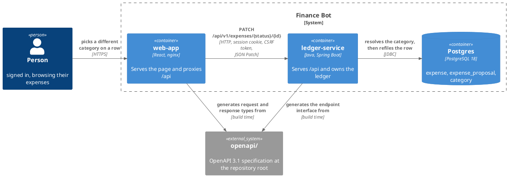
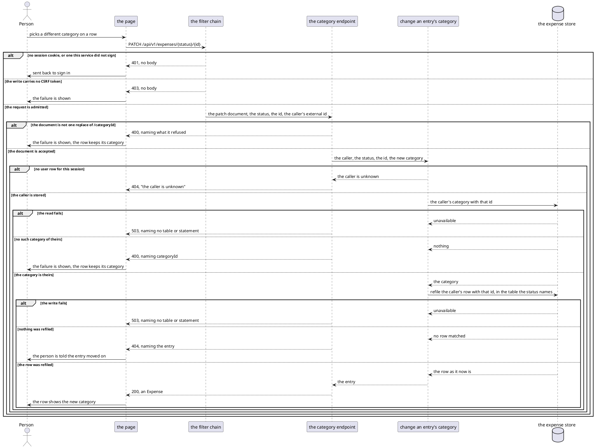
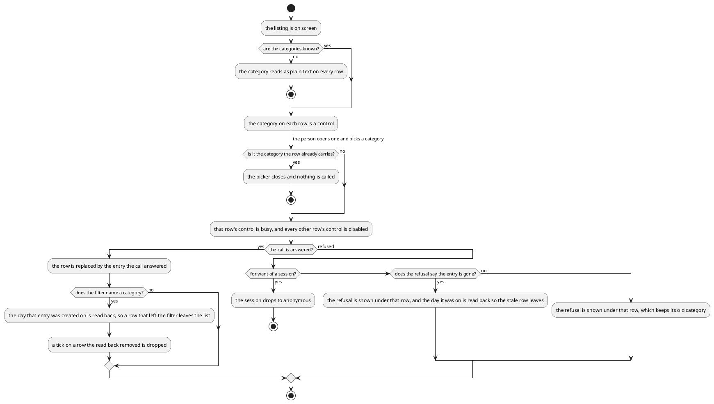

# Design: Change an Entry's Category

**Affected Modules:** `ledger-service`, `web-app`

**Shared artifact:** the OpenAPI specification under repo-root [`openapi/`](../../openapi/ledger-api.yaml).
`ledger-service` generates the endpoint interface it implements from it. `web-app` generates the request and
response types it calls with. Neither module owns it, so it lands on its own before either module's work. Nothing
else crosses between the two.

## Objective

A person browsing their ledger sees what each entry is filed under and can do nothing about it. A pending
proposal's category is the model's guess, and a recorded expense keeps whatever category it was created with.
Getting one wrong today means living with it.

This change lets a person refile an entry from the page. They pick a different category on the row, and the entry
moves to it. Both a pending proposal and a recorded expense can be refiled, because both are on the same listing
and both can be wrong.

## Context

What already exists, and what this change extends.

**The listing the page reads** — `GET /api/v1/expenses`
([`ExpensesController`](../../ledger-service/src/main/java/bot/finance/adapter/web/ExpensesController.java),
[the browse API](../../ledger-service/docs/contracts/in/web-browse-api.md)) answers `PENDING` and `RECORDED`
entries as one page, described by [`openapi/ledger-api.yaml`](../../openapi/ledger-api.yaml). An `Expense` carries
`status`, `id` and `categoryId`, and an id is unique within its status only. The page renders it through
[Browse recorded expenses](../../web-app/docs/usecases/browse-recorded-expenses.md).

**The category name is already on screen** —
[`ExpenseDaySection`](../../web-app/src/components/ExpenseDaySection.tsx) resolves `categoryId` against the map the
page builds from `listCategories`, and prints it on the row's secondary line beside the merchant.

**The picker already exists** — [`CategoryFilter`](../../web-app/src/components/CategoryFilter.tsx) is a
searchable popover, grouped by grouping, that the filter bar uses to narrow the listing to one category.

**The only writes the browser makes** — `POST /api/v1/session` and `POST /api/v1/expenses/acceptances`, both
admitted by
[`SecurityConfiguration`](../../ledger-service/src/main/java/bot/finance/adapter/security/SecurityConfiguration.java)
and both carrying the CSRF token [`client.ts`](../../web-app/src/api/client.ts) reads back from the cookie the
chain sets. The chain's last rule is `denyAll`, so a path it does not name is refused.

**The acceptance this change sits beside** —
[Accept the proposals a person chose](../../ledger-service/docs/usecases/accept-chosen-proposals.md), designed in
[21-accept-expenses-from-the-web](../implemented/21-accept-expenses-from-the-web/design.md). It is the page's other
write, and this design mirrors how it reports a failure and how it reads a touched day back.

Four facts about the store this change writes to:

- **A pending entry is a row in `expense_proposal` and a recorded one a row in `expense`**
  ([`V002`](../../ledger-service/src/main/resources/db/migration/V002__create_expense.sql),
  [`V003`](../../ledger-service/src/main/resources/db/migration/V003__create_expense_proposal.sql)). Both carry
  `category_id NOT NULL REFERENCES category (id)`, `created_at` and `updated_at`.
- **A category and a grouping are the same table**
  ([`V001`](../../ledger-service/src/main/resources/db/migration/V001__create_user_and_category.sql)). A grouping
  has `parent_id IS NULL`, a category has a parent, and both carry the `user_id` they belong to.
- **The foreign key checks existence, not ownership.** `expense.category_id` references `category (id)` with
  nothing narrowing it to the row's own user, so any check that a category is the caller's is the service's.
- **Nothing updates either row today.** Every statement in
  [`ExpenseEntityRepository`](../../ledger-service/src/main/java/bot/finance/adapter/persistence/ExpenseEntityRepository.java)
  and
  [`ExpenseProposalEntityRepository`](../../ledger-service/src/main/java/bot/finance/adapter/persistence/ExpenseProposalEntityRepository.java)
  inserts, deletes, moves or reads.

## Proposed Solution

### What the change adds

One write endpoint, described by the shared specification.

| Endpoint                                    | Takes                                        | Answers                |
|---------------------------------------------|----------------------------------------------|------------------------|
| `PATCH /api/v1/expenses/{status}/{id}`      | a JSON Patch document of exactly one operation | the entry as it now is |

`status` is the `PENDING` or `RECORDED` token the listing already answers with, and it says which of the two
tables the id names (F1). The document replaces one field and no other (D3):

```json
[ { "op": "replace", "path": "/categoryId", "value": 42 } ]
```

The specification gains one path file and two schemas:

```
openapi/
├── paths/
│   └── expense-category.yaml           PATCH /api/v1/expenses/{status}/{id}
└── ledger-api.yaml                     CategoryPatch, CategoryPatchOperation
```

The path file writes its own `400` and `404` descriptions instead of reusing the shared ones, because this
endpoint refuses for reasons those descriptions rule out (F22).

The store gains nothing. No column, no table and no migration: both rows already carry the category and the
instant they were last updated (F15).

On the page, the category on every row becomes a control that opens the picker the filter bar already uses.
Choosing a category calls the endpoint, and the row shows the new name once the call is answered (F12). A tick
survives the change, and a ticked row is still accepted with the category it now carries (F14).

### Diagrams

Both modules take the repository's [Diagram Format](../conventions/diagrams.md) unchanged, with `web-app`'s
[route colour](../../web-app/docs/conventions/documentation.md#diagram-colour) applying to its own components. No
component diagram appears here: classes belong to the plan.

#### Container — what this change reaches



Telegram is absent on purpose. A report already posted keeps the category name it was sent with, and nothing is
sent to correct it (D12).

#### Flow — refiling an entry



#### Flow — what the page decides

The branches name one participant, so the decisions are the content.



### Details

#### `ledger-service` — what the wire carries

| `CategoryPatchOperation` field | Meaning                                                     |
|--------------------------------|-------------------------------------------------------------|
| `op`                           | `replace`, and no other operation                           |
| `path`                         | `/categoryId`, and no other field                           |
| `value`                        | the id of a category of the caller's, above 0               |

`CategoryPatch` is an array of exactly one of those. The media type is `application/json-patch+json`.

| Path part | Meaning                                                                          |
|-----------|-----------------------------------------------------------------------------------|
| `status`  | `PENDING` or `RECORDED`, the token the listing answers, saying which table the id names |
| `id`      | the id of the caller's entry, as the listing answered it                          |

The answer is an `Expense`, the same schema the listing's `items` carry, reading as the entry now stands.

#### `ledger-service` — what the caller gets

| Status | Raised by                                                                                                    |
|--------|----------------------------------------------------------------------------------------------------------------|
| 200    | the row was refiled, including where it already carried that category (F6)                                     |
| 400    | a document that is not one `replace` of `/categoryId`, a value below 1, a body that is not JSON, a `status` that is neither token, or a `categoryId` naming no category of the caller's (F4) |
| 401    | no session, refused by the filter chain before the endpoint is reached                                          |
| 403    | no CSRF token, refused by the filter chain                                                                      |
| 404    | no entry of the caller's with that id and status (F5), or a session outliving its user row                      |
| 503    | either statement failed — `PersistenceFailedException`. The category read raises it as every other read on this store does, and nothing is written |

Each 400 message is composed by this module and names the field and the bound it broke, as the listing's already
are. The two 404s carry different messages: one names the entry, the other says the caller is unknown (F5).

#### `ledger-service` — the two statements

The category is resolved before the row is refiled, so an unknown category and an unknown entry stay two answers
rather than one (F8). The read admits only a category of the caller's that is filed under a grouping:

```sql
SELECT id
FROM category
WHERE id = :categoryId AND user_id = :userId AND parent_id IS NOT NULL
```

The write names the table the `status` chose, and is otherwise the same statement twice. It answers the row it
changed, so the response body costs no second read (F21):

```sql
UPDATE expense
SET category_id = :categoryId, updated_at = :now
WHERE id = :id AND user_id = :userId
RETURNING id, category_id, description, merchant, amount_minor_units, currency_code, created_at
```

The status is not selected. It is the `{status}` the path carried, which is what chose the table (F21).

`created_at` is not touched, so the entry stays on the day it appeared on (F7). An empty answer is the 404 (F5).
`:now` is truncated to microseconds before it is bound, because the column holds microseconds and the driver
rounds rather than truncates
([`ExpenseRepositoryAdapter`](../../ledger-service/src/main/java/bot/finance/adapter/persistence/ExpenseRepositoryAdapter.java)).

#### `ledger-service` — build and security

| Setting                 | Change                                                                              |
|-------------------------|---------------------------------------------------------------------------------------|
| `SecurityConfiguration` | `PATCH /api/v1/expenses/*/*` joins the chain as `.authenticated()`, ahead of `denyAll` |
| the generated interface | one more operation on the `expenses` tag, nothing else                                 |

Five documents state facts this change moves, and are corrected with it:

| Document                                                                          | Correction                                                        |
|-------------------------------------------------------------------------------------|---------------------------------------------------------------------|
| [the browse API](../../ledger-service/docs/contracts/in/web-browse-api.md)        | the boundary carries a second write, and what it refuses          |
| [the web app's side of it](../../web-app/docs/contracts/out/ledger-browse-api.md) | a second request is a write, and it carries a JSON Patch body     |
| [Expense](../../ledger-service/docs/domain/expense.md)                            | its Lifecycle says `Changed | never`, which is no longer true     |
| [Expense proposal](../../ledger-service/docs/domain/expense-proposal.md)          | the same row, for the pending side                                |
| [`expenses.http`](../../ledger-service/docs/requests/expenses.http)               | the new request, driven by hand against a running service         |

#### `web-app`

| Surface               | Change                                                                                                  |
|-----------------------|-----------------------------------------------------------------------------------------------------------|
| the expenses client   | a `changeCategory` function sending the patch document, declared against the generated types              |
| the category picker   | the filter's popover becomes a control both the filter bar and a row use, with the filter's "All" entry offered only to the filter, and a width of its own when a row opens it (F26) |
| the day section       | the row's category name becomes that control — a ghost button with a chevron (D34) — and stays plain text where the row's category has no name (F13). A refused change is shown under that row (D35) |
| the expense list      | carries which row is being changed, the refusal to show, and the change callback down, and holds none of its own state |
| the expenses page     | owns which row is being changed and what its last refusal said, calls the client, and replaces the answered row |
| the English catalogue | the control's label and its empty state; a refusal shows the ledger's own words (F28)                     |

One change is out at a time. The row being changed is busy, every other row's control is disabled until the
answer arrives (F27), and ticking is unaffected except where a row leaves the list (F24).

## Acceptance Scenarios

### `PATCH /api/v1/expenses/{status}/{id}`

- **A1:** a recorded expense is refiled
  - Given: the person is signed in and has a `RECORDED` entry filed under one of their categories
  - When: they patch `/categoryId` to another of their categories
  - Then: the response is 200 carrying the entry with the new `categoryId`, and a later listing shows it under
    that category

- **A2:** a pending proposal is refiled
  - Given: the person is signed in and has a `PENDING` entry
  - When: they patch `/categoryId` to another of their categories
  - Then: the response is 200 with the new `categoryId`, the entry is still `PENDING`, and accepting it afterwards
    records it under the new category

- **A3:** the entry keeps the day it appeared on
  - Given: an entry created on an earlier day
  - When: its category is changed today
  - Then: the answered `createdAt` is unchanged, and the listing still shows it on its original day

- **A4:** the category it already carries
  - Given: an entry filed under a category
  - When: the same `categoryId` is patched onto it
  - Then: the response is 200 with that category, and nothing else about the entry changes

- **A5:** the category is not the caller's
  - Given: a `categoryId` naming another person's category
  - When: the person patches it onto their own entry
  - Then: the response is 400 naming `categoryId`, and the entry is unchanged

- **A6:** the category is a grouping
  - Given: a `categoryId` naming one of the person's own groupings
  - When: they patch it onto their entry
  - Then: the response is 400 naming `categoryId`, and the entry is unchanged

- **A7:** the entry is not the caller's
  - Given: an id naming another person's entry of that status
  - When: the person patches it
  - Then: the response is 404 naming the entry, and the other person's entry is unchanged

- **A8:** the entry no longer exists
  - Given: a `PENDING` id whose proposal was accepted or discarded a moment earlier
  - When: the person patches it
  - Then: the response is 404 naming the entry, and nothing is written

- **A9:** the document is not one replace of `/categoryId`
  - Given: the person is signed in
  - When: they send an empty document, two operations, an `op` other than `replace`, a `path` other than
    `/categoryId`, or a value below 1
  - Then: the response is 400, and nothing is written

- **A10:** the status is not a status
  - Given: the person is signed in
  - When: they patch `/api/v1/expenses/ACCEPTED/7`
  - Then: the response is 400, and nothing is written

- **A11:** nobody is signed in
  - Given: the request carries no session cookie, or one this service did not sign
  - When: it patches an entry
  - Then: the response is 401, and the endpoint is never reached

- **A12:** the write carries no CSRF token
  - Given: a valid session cookie and no `X-XSRF-TOKEN` header
  - When: the request patches an entry
  - Then: the response is 403, and nothing is written

- **A13:** the session outlives its user row
  - Given: a valid session whose user row no longer exists
  - When: it patches an entry
  - Then: the response is 404 saying the caller is unknown

- **A14:** the store is unavailable
  - Given: the person is signed in and the store answers neither the category read nor the write
  - When: they patch an entry
  - Then: the response is 503 for either failure, naming no table or statement, and nothing is changed

- **A15:** the report in Telegram is left as sent
  - Given: a `PENDING` entry whose report names its old category
  - When: the category is changed from the page
  - Then: nothing is sent to Telegram, the report still reads the old name, and tapping Confirm records the entry
    under its new category

### The page

- **A16:** the category on a row is a control
  - Given: a listing on screen and the categories answered
  - When: the person opens the control on a `PENDING` row and on a `RECORDED` row
  - Then: both offer the person's categories, grouped as the filter offers them, and neither offers an "all"
    entry

- **A17:** the row shows the new category
  - Given: a row filed under one category
  - When: the person picks another and the call answers
  - Then: that row reads the new category, its control is usable again, and no other row changed

- **A18:** the row waits for the answer
  - Given: a row whose change is still out
  - When: the person looks at it
  - Then: it still reads the old category and its control is busy, while every other row stays usable

- **A19:** the change is refused
  - Given: a person changing a row's category
  - When: the call answers 503
  - Then: the service's message is shown under that row, the row keeps its old category, the page's own banner is
    untouched, and the listing is otherwise unchanged

- **A20:** the session expires mid-change
  - Given: a person changing a row's category whose session has expired
  - When: the call answers 401
  - Then: the page drops to anonymous and sends them to `/login`, without a reload

- **A21:** a row leaves the category being filtered on
  - Given: the listing narrowed to one category, showing a `RECORDED` row and a `PENDING` row filed under it
  - When: the person refiles either of them to a different category
  - Then: the day it was created on is read back, the row is gone from the list, that day's figures read as they
    now are, and the pager still reads the numbers the original page answered

- **A22:** a row's category has no name
  - Given: a listing where the categories read failed, and one where a row's `categoryId` is absent from the
    answered categories
  - When: the listing renders
  - Then: that row's category reads as plain text, no control is offered, and the listing is otherwise unchanged

- **A23:** a ticked row survives being refiled
  - Given: a ticked `PENDING` row, on an unfiltered listing
  - When: its category is changed and the call answers
  - Then: the row is still ticked, the action still names it, and accepting it records it under the new category

- **A24:** picking the category the row already carries calls nothing
  - Given: a row filed under a category
  - When: the person opens its control and picks that same category
  - Then: the picker closes, no request is sent, and the row is unchanged

- **A25:** the entry moved on
  - Given: a `PENDING` row that was accepted from Telegram a moment earlier
  - When: the person refiles it and the call answers 404
  - Then: the service's message is shown under that row, and the day it was on is read back so the stale row
    leaves the list

- **A26:** a second row cannot be changed while one change is out
  - Given: a row whose change is still out
  - When: the person reaches for another row's category
  - Then: that control is disabled, and it is usable again once the answer arrives

- **A27:** a tick is dropped with the row it was on
  - Given: a ticked `PENDING` row on a listing narrowed to its category
  - When: it is refiled to a different category and the read back removes it from the list
  - Then: the tick is dropped, and the action no longer counts it

## Decisions

- **D1:** Which entries may be refiled?
  - Answer: Both. A `PENDING` proposal and a `RECORDED` expense are equally editable, through one endpoint.
  - Basis: decided — the user chose both over recorded-only and pending-only (2026-08-10). A proposal's category
    is the model's guess and the likeliest one to be wrong, and both statuses stand on the same listing row.

- **D3:** Which JSON Patch operations does the endpoint accept?
  - Answer: Exactly one operation per document: `replace` on `/categoryId`. `op` and `path` are declared as
    single-value enums in the specification, so anything else is refused before the use case is reached.
  - Basis: decided — the user asked for a JSON Patch endpoint and named the category as what becomes editable
    (2026-08-10). Nothing else on an entry is editable from any surface today, so a wider document would declare
    an operation with no implementation behind it.

- **D12:** Is a Telegram report corrected when a proposal it lists is refiled?
  - Answer: No. Nothing is sent, and the report keeps the category name it was posted with. Tapping its buttons
    afterwards records the proposal under the category it now has.
  - Basis: decided — the user chose leaving the report over rewriting its text (2026-08-10). D9 of
    [design 21](../implemented/21-accept-expenses-from-the-web/design.md) already attaches no importance to a
    report going stale, and the resolution path reads the category from the row rather than from the message
    ([`ResolveProposalsUseCase`](../../ledger-service/src/main/java/bot/finance/application/usecase/ResolveProposalsUseCase.java)).

- **D34:** How does the row's category read as a control before anybody touches it?
  - Answer: A `ghost` button carrying a small chevron after the name — no border and no resting fill, at the
    secondary line's own size, so the row's height does not change. The chevron is what says it can be picked.
  - Basis: decided — the user chose a ghost button with a caret over a dotted underline and over an outline
    field (2026-08-10). The repository has one precedent for a control shaped like text, the filters' `ghost`
    reset button ([`ExpenseFilters`](../../web-app/src/components/ExpenseFilters.tsx)), and `ghost` carries no
    resting surface, border or ring ([`button.tsx`](../../web-app/src/components/ui/button.tsx)), so without the
    chevron it reads as plain text until it is tapped.

- **D35:** Where does a refused change appear, relative to the row that was refused?
  - Answer: On the row itself, under the entry the change was refused for. The page's top banner keeps reporting
    the listing's own failures and is not used for this call. The row grows while the message is shown, and the
    message goes when the next change on that row is sent.
  - Basis: decided — the user chose the row over the banner, with and without scrolling it into view
    (2026-08-10). A row control can sit inside the last day of a full page, so the banner
    ([`ExpensesPage`](../../web-app/src/pages/ExpensesPage.tsx)) is off screen exactly when this call fails, and
    appearing it pushes the filters, the action bar and every day section down under the person's pointer.

## Design Findings

Grilled (2026-08-10), `grill-design`: failure modes, retries, concurrency, data edges, compatibility, lifecycle,
observability, authorization, limits, business invariants.

Grilled (2026-08-10), `grill-frontend`: empty and extreme data, defaults, layout stability, control consistency,
colour, motion, third-party embeds, library cost, locale, keyboard reach.

| #   | Question                                            | Answer                                                                | Evidence                                                        |
|-----|-----------------------------------------------------|-------------------------------------------------------------------------|-------------------------------------------------------------------|
| F1  | A pending id told from a recorded one?              | A `{status}` path segment, the token the listing already answers        | `openapi/ledger-api.yaml`, where an id is unique within its status |
| F2  | Is the `test` operation supported?                  | No — deferred until two people share a ledger                          | an entry version on the listing, which nothing offers yet         |
| F3  | What does a successful patch answer?                | 200 with the entry, in the listing's `Expense` shape                    | `ExpenseWebMapper`, which already renders it                      |
| F4  | `categoryId` names no category of theirs?           | 400 naming `categoryId`; a grouping, an unknown id and a stranger's are one answer | `WebExceptionHandler`, whose 404 says only "the caller is unknown" |
| F5  | The entry is not theirs, or is gone?                | 404, with a message naming the entry                                    | `WebExceptionHandler.onEntityNotFound`                            |
| F6  | Patching the category it already carries?           | 200; the row is written and `updated_at` moves                          | `ExpenseEntityRepository`, which cuts days by `created_at`        |
| F7  | Does refiling move the entry to today?              | No — `created_at` is untouched                                         | D13 of design 21                                                  |
| F8  | Why two statements, not one conditional update?     | One would collapse F4 and F5 into "no rows matched"                     | `V002`, whose foreign key checks existence not ownership          |
| F9  | The entry accepted while the patch is in flight?    | The write matches no row, so 404                                        | `ExpenseProposalEntityRepository`, which moves rows in one statement |
| F10 | Anything observable over Telegram or MCP?           | No                                                                      | no proto or MCP tool schema is touched                            |
| F11 | What does the page do once answered?                | Replaces the row; under a category filter reads that day back           | `expenseDays.ts` — `touchedDaysOf` answers `PENDING` days only    |
| F12 | Does the row show the new category before the answer? | No — busy until answered                                              | `ExpensesPage`, which disables rather than predicts               |
| F13 | A row whose category has no name?                   | Plain text, no control                                                  | `ExpenseList`, which renders it unnamed today                     |
| F14 | Does refiling change what is ticked?                | No — the tick is held by id                                            | `ExpensesPage`                                                    |
| F15 | Does the store change?                              | No migration, no column, no index                                       | `V002`, `V003`, which declare both columns                        |
| F16 | What proves a refile in production?                 | One info line: user, status, id, the category it now carries            | `code-style.md`, `AcceptExpensesUseCase`                          |
| F17 | Will the generator and Spring carry the media type? | Verified in the plan's first step; fallback is a hand-written method     | no path in `openapi/` declares another media type                 |
| F18 | An `op` or `path` outside the declared enum?        | 400, possibly with the generic unreadable-body message                  | `WebExceptionHandler`, which maps both refusals                   |
| F19 | A long category name on a narrow row?               | Truncates; the picker shows it in full                                  | `ExpenseDaySection`, `CategoryFilter`; `V001` bounds it at 100    |
| F20 | Refile into a category that does not exist yet?     | No — that is a create endpoint, not this one                           | the browse API, read-only on the tree                             |
| F21 | How does the write produce the 200's body?          | `RETURNING`; an empty answer is the 404. Status comes from the path     | `ExpenseProposalEntityRepository.acceptByIds`                     |
| F22 | Do the shared error responses still fit?            | No — the path file writes its own 400 and 404 descriptions             | `errors.yaml`, and `expense-acceptances.yaml`'s inline 403        |
| F23 | The filter changes while a change is out?           | Applied against the page on screen, dropped if the row is gone          | `ExpensesPage`, its refs and its `cancelled` guard                |
| F24 | A tick on a row the read back removed?              | Dropped                                                                 | `expenseDays.ts`, whose `mergeDay` leaves the set alone           |
| F25 | What is looked at by eye before this is done?       | Eight things: narrow row, refusal row, both themes, picker from a scrolled row, busy row, keyboard and focus, filtered refile, reduced motion | `web-app/docs/conventions/testing.md`; D39 of design 21 |
| F26 | How wide is the picker opened from a row?           | Its own width, not its trigger's                                        | `CategoryFilter`, whose trigger is a full-width field             |
| F27 | How many changes may be out at once?                | One; every other control is disabled                                    | `ExpensesPage`, which holds one `accepting` flag                  |
| F28 | Which words does a refusal show?                    | The ledger's own                                                        | `client.ts`, which puts `message` on the `ApiError`               |
| F29 | How do merchant and category share the line?        | The merchant gives way first; the control keeps a minimum width         | `ExpenseDaySection`, one joined span today                        |
| F30 | What does a busy control do to focus?               | Stays focusable and `aria-busy`; focus moves to the day header when the row leaves | D31 of design 21, collapsed day sections               |
| F31 | Can `PATCH /api/v1/expenses/*/*` collide with the acceptance path? | No — they differ in segment count, and the chain denies by default | `SecurityConfiguration`                                     |
| F32 | Are the new use-case pages this design's to write?  | No — they are follow-up work                                           | `docs/conventions/follow-up.md`, `archive-knowledge`              |
| F33 | What does the pager read after a row leaves the filter? | The numbers the original page answered                              | A21; D27 of design 21 accepted the same price                     |
| F34 | Does `:now` need truncating before it is written?   | Yes, to microseconds                                                    | `ExpenseRepositoryAdapter`, which truncates every write           |
