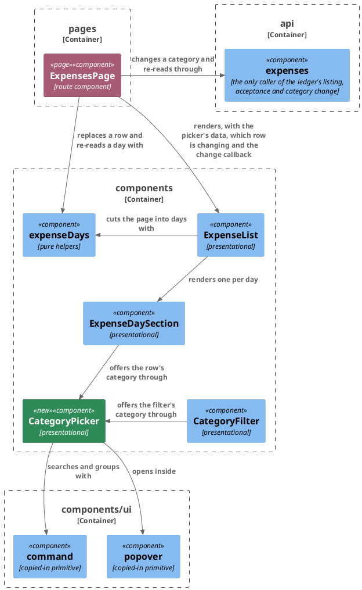

# Plan: Change an Entry's Category — `web-app`

**Affected Modules:** `web-app`
**Design:** [Change an Entry's Category](../design.md)

## Components

The design named surfaces; these are the files that hold them. The module has no layers to enforce, so the
boundaries below are its own directories.



| File                                | Gains                                                                                             |
|-------------------------------------|----------------------------------------------------------------------------------------------------|
| `api/expenses.ts`                   | `changeCategory(entry, categoryId): Promise<Expense>`, sending the patch document at `application/json-patch+json` |
| `components/CategoryPicker.tsx`     | the popover and the searchable, grouped list, lifted out of `CategoryFilter` so a row and the filter open one control |
| `components/CategoryFilter.tsx`     | keeps its label and its field-shaped trigger, and renders the list through `CategoryPicker`        |
| `components/expenseDays.ts`         | `ExpenseCategoryChangeProps`, `replaceEntry`, `ticksStillOnPage`, and `utcDayOf` made public       |
| `components/ExpenseDaySection.tsx`  | the row's category as a ghost trigger with a chevron, the refusal shown under that row, and the day header taking focus when a refiled row leaves |
| `components/ExpenseList.tsx`        | carries the picker's data, which row is changing, the refusal and the callback down, and holds none of its own state |
| `pages/ExpensesPage.tsx`            | which row is being changed, what its last refusal said, the call, the row replacement and the day read back |
| `i18n/en.ts`                        | the control's label, its search placeholder and its empty state                                    |

### What a box cannot carry

| Prop                                                  | Carried by                              | Holds                                                                 |
|-------------------------------------------------------|-----------------------------------------|-------------------------------------------------------------------------|
| `categories: Category[]`, `groupings: Grouping[]`     | `ExpenseList`, `ExpenseDaySection`      | what the picker offers and how it is grouped; empty where the read failed |
| `changingKey: string \| null`                          | `ExpenseList`, `ExpenseDaySection`      | the `${status}-${id}` of the row whose change is out, or nothing        |
| `changeFailure: { key: string; message: string } \| null` | `ExpenseList`, `ExpenseDaySection`   | the ledger's own words, and the row they were refused for               |
| `focusDay: string \| null`                             | `ExpenseList`, `ExpenseDaySection`      | the day whose header takes focus, set when a read back removed the row a person's control was on (D33) |
| `onChangeCategory: (entry: Expense, categoryId: number) => void` | `ExpenseList`, `ExpenseDaySection` | a row refiled to a category the person picked                    |
| `trigger: ReactNode`                                   | `CategoryPicker`                        | the control that opens the list, rendered as the popover's own trigger  |
| `withAll: boolean`                                     | `CategoryPicker`                        | whether an entry meaning "no category" is offered — the filter's, never a row's (D29) |
| `width: 'trigger' \| 'own'`                            | `CategoryPicker`                        | what the popup is sized by — the trigger's width for the filter, a width of its own for a row (D29) |
| `searchPlaceholder: string`, `emptyText: string`       | `CategoryPicker`                        | the two strings each surface names from its own part of the catalogue   |

`CategoryPicker` takes its trigger as a node rather than a variant, because the trigger is what the two surfaces
differ in most: the filter's is a full-width field with its own `<Label>` and `aria-labelledby`, and a row's is a
ghost button carrying a chevron after the name (D34). Everything they share — the search, the grouping, the tick
beside the chosen entry, the popup's bound and its scrolling — is the picker's.

The row's control names itself with a verb, never the word *category* first: the filter's trigger is queried as
`/^category/i` throughout `ExpensesPage.test.tsx`, and a row control matching that pattern makes every one of
those queries ambiguous. `dayHeaders()` in `testing/accordion.ts` is unaffected either way — it already drops any
control carrying `aria-haspopup`, which is what a popover trigger is.

## Step-by-Step Implementation Map (To-Do List)

### Stabilization

#### Interface-First / Build Stabilization

**Interface & Signature Sync**

- [x] ST01 · Add `changeCategory` to `api/expenses.ts`, declared against the types `shared/plan.md` generated,
  and stub the body:
  ```ts
  export type CategoryPatch = components['schemas']['CategoryPatch'];

  export async function changeCategory(entry: Expense, categoryId: number): Promise<Expense> {
    // patches /api/v1/expenses/{status}/{id} through `request`, which carries the cookies and the CSRF token,
    // with a document of one replace on /categoryId at application/json-patch+json, and answers the entry as
    // the ledger now holds it
    return null as unknown as Expense;
  }
  ```
- [x] ST02 · Add `components/CategoryPicker.tsx`, moving the `Popover`, the `Command` list, `toSections` and the
  chosen-entry tick out of `CategoryFilter` unchanged, and have `CategoryFilter` render its existing label and
  field-shaped trigger through it with `withAll` true and `width` `'trigger'`. This is a move, not a rewrite:
  `ExpenseFilters.test.tsx` asserts what the filter offers and must pass untouched afterwards. `toSections`'
  fallback for a category whose grouping the tree did not answer moves with it.
- [x] ST03 · Add the catalogue keys to `i18n/en.ts` under `listing`: the row control's accessible name, which
  begins with a verb and names the entry it is on rather than starting with the word *category*; the search
  placeholder the row's picker shows; and what it says when a search matches nothing. The filter keeps its own
  `filters.searchCategories` and `filters.noCategory`, which `CategoryPicker` now takes as props (D31).
- [x] ST04 · Thread the new props through. Add `ExpenseCategoryChangeProps` to `components/expenseDays.ts` with
  the fields the table above names, add `replaceEntry` and `ticksStillOnPage` there as stubs, and export the
  existing private `utcDayString` as `utcDayOf(createdAt: string): string` so the page can name the day an
  answered entry sits on. Add the props to `ExpenseList` and `ExpenseDaySection`, and have `ExpensesPage` own
  `changingKey`, `changeFailure` and `focusDay` and pass them down.

  Pass the new props inert in every existing case of `ExpenseDaySection.test.tsx`, `ExpenseList.test.tsx` and
  `ExpensesPage.test.tsx`, and change no assertion: `tsconfig.json` includes `src`, so a test file that does not
  compile fails the type check, and the suite has to stay green through this step. Both component test files
  already funnel every case through one render helper, so the props land in one place each.
- [x] ST05 · Add `changeCategory: vi.fn()` to the `vi.mock('../api/expenses', …)` factory in
  `ExpensesPage.test.tsx`. The page imports it from that module, and a factory that does not name it leaves the
  import undefined for every case in the file, not only the ones about changing a category.

**Shared Test Infrastructure**

- [x] ST06 · Nothing is added. `testing/fixtures.ts` already builds an expense, a page, a category and a
  grouping, and `chooseFromList(triggerName, optionName)` in `testing/combobox.ts` already opens a list from a
  button and picks an option by name, which is exactly how a row's picker is driven. Confirm the gate is green
  before the red phase starts: `npm --prefix web-app run verify`.

### Red Phase

#### TDD Unit Red Phase

- [x] RU01 · `changeCategory` · test: `expenses.test.ts` · covers: `changeCategory()` · scenarios: A19, A20
    - `changeCategory()`:
        - given: a CSRF cookie the ledger set, and a `RECORDED` entry with id 12
          when: changeCategory() is called with category 42
          then: one PATCH goes to `/api/v1/expenses/RECORDED/12`, carrying a body of one operation replacing
          `/categoryId` with 42, a `Content-Type` of `application/json-patch+json`, the CSRF header and the
          cookies
        - given: a `PENDING` entry
          when: changeCategory() is called
          then: the path carries `PENDING`, so the two statuses are never confused for one id
        - given: the ledger answers the entry as it now stands
          when: changeCategory() is called
          then: that entry is answered to the caller
        - given: the ledger answers 503 with a `message`
          when: changeCategory() is called
          then: the rejection carries that message and that status
        - given: the ledger answers 401, and separately 404
          when: changeCategory() is called for each
          then: the rejection carries that status, so a page can tell an expiry from an entry that moved on
- [x] RU02 · `expenseDays` · test: `expenseDays.test.ts` · covers: `replaceEntry()`, `ticksStillOnPage()`,
  `utcDayOf()` · scenarios: A17, A21, A27
    - `replaceEntry()`:
        - given: a page of three entries and one of them answered again with a different `categoryId`
          when: replaceEntry() is called
          then: that entry carries the new category, the other two are exactly as they were, its position in
          `items` is unchanged, and `limit`, `offset`, `total` and `dayTotals` are the original page's
        - given: a page where a `RECORDED` and a `PENDING` entry share an id, which an id being unique within a
          status alone makes real
          when: replaceEntry() is called with the pending one
          then: only the pending entry is replaced
        - given: an entry the page no longer holds
          when: replaceEntry() is called
          then: the page is answered unchanged and nothing throws
    - `ticksStillOnPage()`:
        - given: a page holding two pending entries, with three ids ticked
          when: ticksStillOnPage() is called
          then: only the two the page still holds are answered
        - given: a page holding a `RECORDED` entry whose id is ticked and no pending entry carrying it
          when: ticksStillOnPage() is called
          then: that id is dropped, since a tick names a pending entry
        - given: a page holding every ticked entry
          when: ticksStillOnPage() is called
          then: the set is answered unchanged
    - `utcDayOf()`:
        - given: an instant late on one UTC day, read in a zone that would name it another
          when: utcDayOf() is called
          then: it answers the UTC day, the same one `toDaySections` cut the page by
- [x] RU03 · `CategoryPicker` · test: `CategoryPicker.test.tsx` · covers: the picker · scenarios: A16
    - the picker:
        - given: categories under two groupings, and a trigger
          when: the trigger is pressed
          then: every category is offered as an option, under its grouping's heading, in the groupings' own
          order
        - given: the picker opened with `withAll` false
          when: it renders
          then: no entry meaning "no category" is offered, and every option names a real category (D29)
        - given: the picker opened with `withAll` true
          when: it renders
          then: that entry is offered, and choosing it answers `undefined`
        - given: a search naming a grouping
          when: it is typed
          then: that grouping's categories are the ones left, so typing a grouping's name finds what it holds
        - given: a search matching nothing
          when: it is typed
          then: the empty text the caller passed is what shows
        - given: two groupings holding a category of the same name
          when: the picker opens
          then: both are offered as separate options
        - given: a category whose grouping the tree did not answer
          when: the picker opens
          then: it is still offered, under a heading of its own name
- [x] RU04 · `ExpenseDaySection` · test: `ExpenseDaySection.test.tsx` · covers: the rendered day section ·
  scenarios: A16, A18, A22, A26, and D32, D33, D34
    - the row's category control:
        - given: an open day holding a `RECORDED` row and a `PENDING` row, both filed under a named category
          when: it renders
          then: each row's category is a control findable by role and accessible name, and pressing either
          offers the person's categories grouped as the filter offers them, with no "all" entry
        - given: an open day and a person picking a different category on one row
          when: the option is chosen
          then: `onChangeCategory` is called once with that row's own entry and the chosen category id
        - given: a row whose merchant is absent
          when: it renders
          then: the control stands alone on the secondary line, with no separator before it (D32)
        - given: a row with a merchant
          when: it renders
          then: both the merchant and the control are on the secondary line, in that order
    - what the row shows while a change is out:
        - given: `changingKey` naming this row
          when: it renders
          then: that row still reads its old category, its control says it is busy, and the control is still
          focusable rather than disabled (D33)
        - given: `changingKey` naming a row on this day
          when: it renders
          then: every other row's control on this day is disabled (A26)
        - given: `changingKey` null
          when: it renders
          then: no row's control is disabled or busy
    - a refused change:
        - given: `changeFailure` naming this day's second row, carrying the ledger's message
          when: it renders
          then: that message is on screen inside that row and nowhere else on the day, and the first row is
          unchanged
        - given: `changeFailure` null
          when: it renders
          then: no row carries a message
    - a row whose category has no name:
        - given: an open day whose `categoryNames` map is empty, and one whose map lacks this row's id
          when: each renders
          then: no control is offered on that row, the description, merchant and money still show, and neither
          the raw id nor `null` nor `undefined` leaks (A22)
    - the day header taking focus:
        - given: `focusDay` naming this day
          when: it renders
          then: the day's header holds focus, so a keyboard person whose row left the list is not dropped to the
          document body (D33)
        - given: `focusDay` naming another day
          when: it renders
          then: this day's header does not take focus
    - update: `it('lists a recorded entry with its description, its merchant, its category name and the amount it was given, and no status badge')`
      — assert additionally that the category name is now the accessible name of a control on that row, rather
      than plain text beside the merchant
    - update: `it('still shows the description, the merchant and the amount when the category is absent from the lookup, without leaking the id, null or undefined')`
      — assert additionally that this row offers no category control at all, which is what an unnamed category
      earns (D16)
    - update: `it('shows the catalogue’s substituted text rather than a literal, once the catalogue is swapped')`
      — add the row control's own key to what it checks, so its label cannot be a literal in the component
    - update: every other case in `ExpenseDaySection.test.tsx` was given the new props inert by `ST04` and
      asserts nothing about them; leave each exactly as it is. In particular every case that reads
      `screen.getByRole('button')` for the day header does so while the section is still collapsed, so no row
      control is mounted to make the query ambiguous
- [x] RU05 · `ExpenseList` · test: `ExpenseList.test.tsx` · covers: the expense list · scenarios: A26
    - the expense list:
        - given: a page whose entries span two days, both opened, with `changingKey` naming a row on the first
          when: it renders
          then: that row's control says it is busy and every control on the second day is disabled, so one
          change out disables the whole listing rather than one day of it
        - given: the same page with `changingKey` null
          when: a category is picked on the second day's row
          then: the list's `onChangeCategory` is called with that row's entry and the chosen id
        - given: a page whose entries span two days and a `changeFailure` naming a row on the second
          when: it renders
          then: the message shows on that row alone, and the first day carries none
    - update: every case in `ExpenseList.test.tsx` was given the new props inert by `ST04` and asserts nothing
      about them; leave each exactly as it is. The three that count day headers with `getAllByRole('button')` do
      so with every section closed, so no row control is mounted to change the count
- [x] RU06 · `ExpensesPage` · test: `ExpensesPage.test.tsx` · covers: the expenses page · scenarios: A17, A19,
  A20, A21, A23, A24, A25, A26, A27, and D26, D30, D33
    - the expenses page:
        - given: an unfiltered listing of three rows on two days
          when: a row's category is changed and the ledger answers the entry
          then: one change call carries that entry and the chosen id, that row reads the new category, no
          further listing call is made, no other row changed, and the pager reads as it did (A17, D14)
        - given: a listing narrowed to one category, holding a `RECORDED` row and a `PENDING` row filed under it
          when: either is refiled to a different category and the ledger answers
          then: one further listing call is made for the day the **answered entry** carries, spanning that day
          alone with no offset, the refiled row is gone from the list, that day's figures are the fresh read's,
          and `limit`, `offset` and `total` are still the original page's (A21, D14)
        - given: a ticked `PENDING` row on an unfiltered listing
          when: its category is changed and the ledger answers
          then: the row is still ticked, the action still names it, and accepting afterwards carries its id
          (A23)
        - given: a ticked `PENDING` row on a listing narrowed to its category
          when: it is refiled away and the read back no longer holds it
          then: the tick is dropped and the action no longer counts it (A27)
        - given: a row filed under one category
          when: the person opens its control and picks that same category
          then: no change call is made at all and the row is unchanged (A24)
        - given: a change still out
          when: the person picks a category on a second row
          then: only one change call has been made (D30)
        - given: a change the ledger answers
          when: the answer has been applied
          then: no row's control is busy or disabled, and picking a category on another row sends a second call
          (A17, A26)
        - given: a change the ledger refuses with 503
          when: the answer arrives
          then: the ledger's own message shows under that row, that row keeps its old category, the page's own
          banner is untouched, no listing call is made, and every row's control is usable again (A19, A26)
        - given: a change the ledger refuses with 404
          when: the answer arrives
          then: the ledger's message shows under that row, and one listing call is made for the day that row was
          on, so the stale row leaves (A25)
        - given: a change the ledger refuses with 401
          when: the answer arrives
          then: the session is reported expired to the context, nothing is re-read, and no message is shown on
          the row (A20)
        - given: a refused change whose message is on a row
          when: the person sends a second change on that row
          then: the message is gone before the second call's answer arrives (D35)
        - given: a change out and the person narrowing the filter before the answer arrives
          when: the answer arrives
          then: the read back is made against the filter the page holds now, and an answer naming a row the page
          no longer holds changes nothing (D26)
        - given: a refiled row that the read back removed
          when: the answer has been applied
          then: the day section that held it carries focus, rather than focus falling to the document body (D33)
        - update: `it('reads the listing, the categories and the groupings once and renders what they answered')`
          — its `getByRole('button', { name: /^category/i })` is the filter's own trigger, queried with every day
          section open. Assert additionally that this query still finds exactly one control, so the row control's
          name is proved not to collide with it
        - update: `it('repeats only the listing when the filter changes, keeping the tree it already holds')` —
          assert additionally that no change call is made when no category was picked on a row
        - update: `it('still lists the expenses, with their categories unnamed, when the categories read fails')`
          — assert additionally that no row offers a category control, since there is nothing to put on a
          trigger and nothing in the picker to choose (A22, D16)
        - update: every other case in `ExpensesPage.test.tsx` was given the mocked `changeCategory` by `ST05`
          and asserts nothing about it; leave each exactly as it is

### Green Phase

#### TDD Unit Green Phase

- [x] GU01 · `changeCategory` · test: `expenses.test.ts`
- [x] GU02 · `expenseDays` · test: `expenseDays.test.ts`
- [x] GU03 · `CategoryPicker` · test: `CategoryPicker.test.tsx`
- [x] GU04 · `ExpenseDaySection` · test: `ExpenseDaySection.test.tsx` · after: GU03
- [x] GU05 · `ExpenseList` · test: `ExpenseList.test.tsx` · after: GU04
- [x] GU06 · `ExpensesPage` · test: `ExpensesPage.test.tsx` · after: GU02, GU05

### Post-Implementation Steps

This plan earns none. What a person still has to look at —
[D28](../design.md)'s eight screens and states — goes in the task's `review/findings.md` under this module's own
heading, and nothing waits for it
([Agent Configuration](../../../web-app/docs/conventions/agent.md#what-a-person-still-has-to-look-at)). No ADR
candidate survives screening either: lifting the picker out of the filter is a file layout, which
[Follow-Up Work](../../../docs/conventions/follow-up.md) rules out as an ADR, and the answer to it is this plan's
own file table.

## Open Questions / Blockers

No question is open on this plan.

- **ST01, plan defect found during the run:** the literal stub bodies in ST01 (and the ST04 stubs) leave their
  parameters unreferenced, which `tsconfig.json`'s `noUnusedParameters` and ESLint's
  `@typescript-eslint/no-unused-vars` both reject, so the snippet as written fails `typecheck` and `lint`. The
  stabilization step kept the real parameter names and added `void` statements to keep each body a true no-op.
  The green phase drops them as it implements each body.

- **RU06 · D30, a tension between two scenarios the plan did not reconcile:** A26 disables every other row's
  control while a change is out, so D30's "the person picks a category on a second row" cannot be driven through
  the picker at all — the control the scenario reaches for is disabled by the behaviour the plan asks for one
  step earlier. The invariant D30 names still holds and is asserted: the second row's control is disabled, and
  only one change call has been made. A plan carrying both scenarios should say which one the page is observed
  through.

- **RU06 · A25, two claims that are not simultaneously observable:** the 404 scenario asks that the ledger's
  message show under the row *and* that the day be read back so the stale row leaves. The read back empties the
  day and `mergeDay` drops it, so the row carrying the message is gone once the read back resolves. Both are
  real and both are asserted, but only in sequence — the message while the read back is still out, the row's
  departure after it. A scenario naming two observations of one row should say in what order they are visible.

- **RU06 · three cases were written against fixtures and helpers that could not observe what they asserted**, and
  were corrected during the green phase without weakening any assertion: a pager fixture whose `total` equalled
  its item count, so `Pager` rendered nothing to read; a global `queryByRole('alert')` that could not tell the
  row's own message from the page's banner, both rendering through the shared `Alert`; and `dayHeaders()` in
  `testing/accordion.ts`, which returns only collapsed headers and so cannot corroborate focus on a header that
  is open. The last is a gap in the shared helper rather than in this plan — a focus assertion on an expanded
  day header has no helper to reach for, and the case now queries inline.

- **Post-Implementation Steps · a stale citation:** the section cites `D28` for "eight screens and states". The
  design carries no `D28`; the eight are its failure table's `F25`. The list was carried from `F25`.

- **`src/conventions.test.ts` does not catch every citation shape**, found during the refactor pass. Its
  `CITATION` pattern covers `ST|RU|RI|RS|GU|GI|GS` followed by two digits and `[DQPB]` followed by one or two, so
  an `A`-prefixed scenario citation — an `A26` written into a comment — passes the guardrail that exists to catch
  exactly that. One had been written by this plan and was removed by hand. The file is outside this plan's diff,
  so widening the pattern is a separate change.

## Review Findings

- **F1:** RU03 asserted that a chosen option "reads as the chosen one, findable by its accessible name", which
  the code ST02 moves cannot satisfy: `CategoryFilter` marks the chosen entry with a CSS opacity toggle on an
  `aria-hidden` icon, and nothing exposes it to a role or name query.
  - Resolution: decision
  - Action: resolved against the design — no acceptance scenario asks for it. A16 asks only that both surfaces
    offer the person's categories, grouped as the filter offers them, with no "all" entry, and the
    scenario-authoring rules forbid inventing one the design does not carry. The scenario is dropped, and ST02
    stays a move rather than a rewrite. How a chosen option is announced to assistive technology is a gap in the
    filter as it ships today, not one this change opens.

- **F2:** Nothing asserted that `ExpensesPage` clears `changingKey` once the answer arrives, so an implementation
  that never cleared it would satisfy every scenario while leaving the listing permanently disabled.
  - Resolution: mechanical
  - Action: applied — RU06 gains a scenario for the answered case, its 503 scenario gains the same clause, and
    its line gains A26.

- **F3:** The diagram drew a catalogue box and one arrow to it, with a line beneath explaining that every
  component reads it — which [Diagrams](../../conventions/diagrams.md) rules out.
  - Resolution: mechanical
  - Action: applied — the `i18n` boundary, its component, the arrow and the paragraph are gone; ST03 is where
    the catalogue keys are named.

- **F4:** RU04's closing `update:` bullet said "the three cases" read `getByRole('button')` for the day header;
  fifteen do.
  - Resolution: mechanical
  - Action: applied — reworded to "every case". RU05's sibling claim of three was correct and stands.
