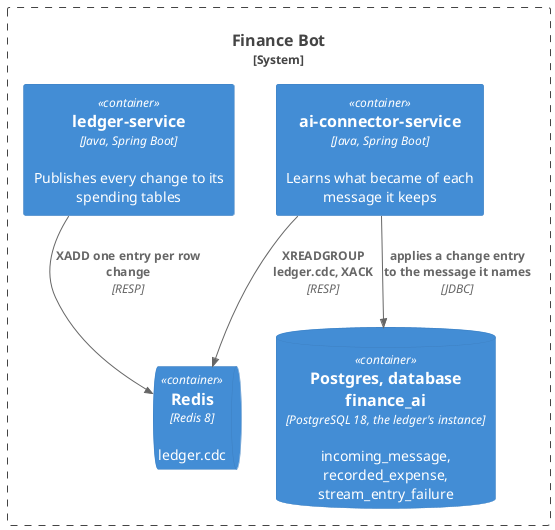
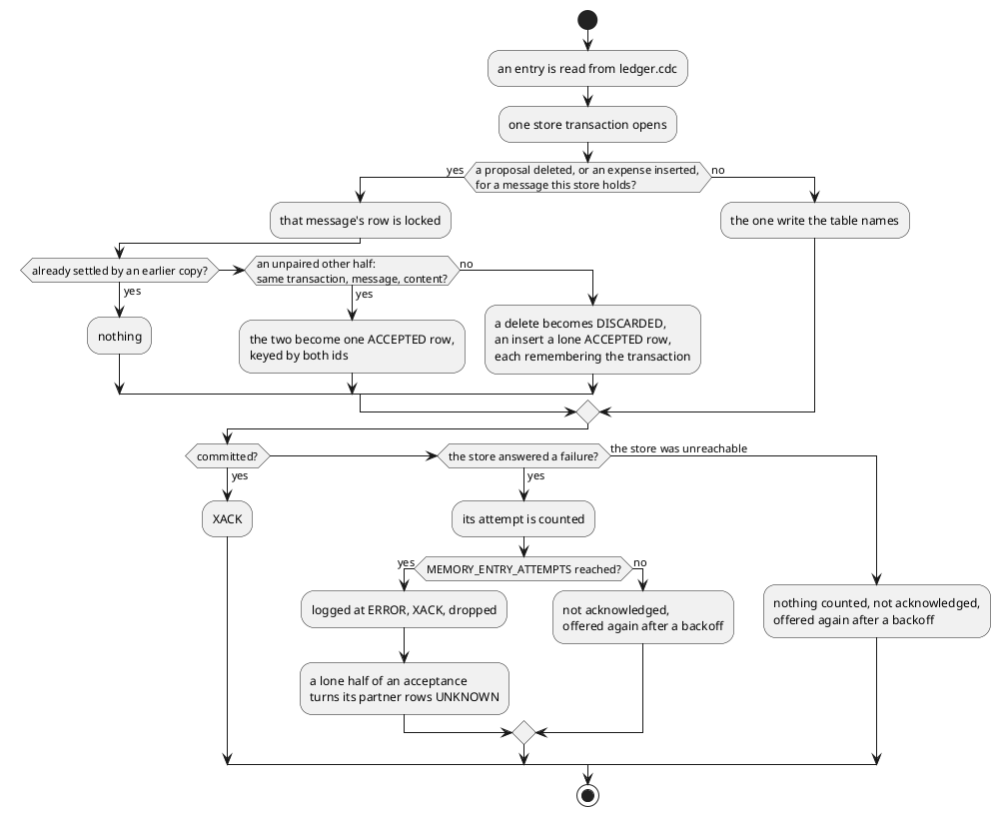

# Design: The Connector Learns What Became of a Message

**Affected Modules:** `ai-connector-service`

## Objective

The second of three tasks giving the connector a memory
([31](../31-the-connector-registers-the-message/design.md) is the sequence). Task 31 keeps every message the
connector is handed. This task learns what became of it: the connector reads the ledger's change stream and
records, beside each message, which expenses were proposed from it, which the person accepted, which they
discarded, and where each ended up filed. A category renamed in the ledger is renamed here.

Nothing reads these rows yet; [task 33](../33-the-model-reads-the-connectors-memory/design.md) puts them in front
of the model. This task ships behind 31's `MEMORY_ENABLED`.

## Context

| What exists                                                        | Where                                                                                                                                                                                                                       | What this change does with it                                                                                          |
|--------------------------------------------------------------------|-----------------------------------------------------------------------------------------------------------------------------------------------------------------------------------------------------------------------------|------------------------------------------------------------------------------------------------------------------------|
| The message store, keyed by `(user_id, incoming_message_id)`       | [Design 31](../31-the-connector-registers-the-message/design.md), the store section                                                                                                                                         | The row every learned outcome hangs off; an outcome for a message it lacks is dropped (F5)                              |
| The change stream and what an entry carries                        | [`change-stream.md`](../../ledger-service/docs/contracts/out/change-stream.md)                                                                                                                                              | Read by the connector; its "no consumer" line is corrected                                                              |
| The rows those entries carry                                       | [`database.md`](../../ledger-service/docs/contracts/out/database.md)                                                                                                                                                        | `user_id` and `incoming_message_id` on `expense` and `expense_proposal` are the join back to a registered message      |
| Accept and discard, as one statement each                          | [ADR 0012](../../ledger-service/docs/adr/0012-a-set-of-rows-moves-between-tables-in-one-statement.md)                                                                                                                       | Fixes how an acceptance is recognised: a proposal delete and an expense insert sharing `source.txId` (F3)              |
| What the accept statement carries across                           | [`ExpenseProposalEntityRepository`](../../ledger-service/src/main/java/bot/finance/adapter/persistence/ExpenseProposalEntityRepository.java)                                                                                | Content only, not the proposal id — why the pairing matches on content (F13)                                            |
| The stream design, and what a consumer must expect                 | [Design 23](../implemented/23-broadcast-ledger-changes-to-redis/design.md)                                                                                                                                                  | At-least-once, non-identical redeliveries, a capped stream, no snapshot — the consumer here is built to those           |
| The module's package structure and banned imports                  | [Architecture](../../ai-connector-service/docs/conventions/architecture.md)                                                                                                                                                 | Gains `adapter/redis`; the banned list gains `org.springframework.data.redis..`                                        |
| The ledger's containerized Redis for tests                         | `ledger-service/src/test/java/bot/finance/common/containers/`                                                                                                                                                                | Mirrored in the connector's `common/containers`                                                                        |
| The local runtime                                                  | [`docker-compose.yaml`](../../infrastructure/docker-compose.yaml)                                                                                                                                                           | The connector gains `REDIS_URL`                                                                                        |

## Proposed Solution

### What the change adds

| Surface                          | What it becomes                                                                                                   |
|----------------------------------|-------------------------------------------------------------------------------------------------------------------|
| Redis                            | The connector joins `ledger.cdc` as a consumer group and applies each entry to its store                          |
| The connector's database         | Two tables more: the expenses the ledger made of each message, and the entries the store has refused              |
| `/actuator/health`               | Gains the Redis component the starter brings                                                                      |
| Configuration                    | A Redis address, the stream key, and how many failures an entry gets                                              |

**Nothing here decides how an expense is filed.** The rows record what the ledger did; the ledger's tools still
record, and the person still accepts.

**The memory is an aid.** An entry that cannot be applied is dropped after a bounded number of tries; one lost
outcome costs a prompt in task 33, not a turn (D1).

### Diagrams

The module takes the repository's [Diagram Format](../conventions/diagrams.md) unchanged. There is no component
diagram: classes belong to the plan.

#### Container — what this change reaches



#### Flow — applying one entry from the change stream

Most entries are one guard and one write, which is a table (below, *What an entry does*). The one place the shape
carries meaning is a proposal leaving the ledger: the two halves of an acceptance arrive in either order, and each
half has to find the other.



**What an entry does** — every captured table, every operation. A spending entry (`expense_proposal`, `expense`)
is first checked for a message: one with no `incoming_message_id`, or one this store lacks, is ignored and
acknowledged whatever its `op` (F5). Every entry is acknowledged once its effect is committed.

| Table              | `op` | What the ledger did                                   | Effect here                                                                                          |
|--------------------|------|-------------------------------------------------------|------------------------------------------------------------------------------------------------------|
| `expense_proposal` | `c`  | the model proposed an expense from a message          | upsert a `PROPOSED` row keyed by `proposal_id`, with the entry's category id and enrichment names     |
| `expense_proposal` | `u`  | the person refiled a pending proposal                 | the row keyed by `proposal_id` takes the new `category_id` and names; stays `PROPOSED`               |
| `expense_proposal` | `d`  | the person discarded it — a lone delete               | the row becomes `DISCARDED`, remembering `source.txId` (F3)                                          |
| `expense_proposal` | `d`  | the person accepted it — paired with an `expense` `c` in the same `source.txId` | see the accept table below                                                    |
| `expense`          | `c`  | an accepted proposal became an expense                | see the accept table below                                                                            |
| `expense`          | `c`  | an expense recorded with no proposal, but with a message id | a lone `ACCEPTED` row keyed by `expense_id`, remembering `source.txId`, in case its delete follows |
| `expense`          | `u`  | the person refiled a recorded expense                 | the row keyed by `expense_id` takes the new `category_id` and names                                  |
| `expense`          | `d`  | the expense was removed                               | the row keyed by `expense_id` is removed; the message stays                                          |
| `category`         | `c`  | a category or grouping was created                    | nothing — no row names it yet                                                                        |
| `category`         | `u`  | a category (has a parent) was renamed                 | every row with that `category_id` takes `after.name`                                                 |
| `category`         | `u`  | a grouping (no parent) was renamed                    | every row of that `user_id` whose `grouping_name` is `before.name` takes `after.name` (F7)            |
| `category`         | `u`  | a category was moved to another grouping              | nothing — the entry carries no name for the new parent (F9)                                          |
| `category`         | `d`  | a category or grouping was deleted                    | nothing — a live expense's category cannot be deleted; a cascade with the person is Design 31 F20    |
| any                | `r`  | a snapshot read                                       | ignored — none is emitted (F17)                                                                      |
| any other table    | any  |                                                       | ignored                                                                                              |

**The accept flow** — one ledger transaction, two entries, in either order, `n` of each when a report accepts
`n` proposals:

| Arrives           | Store holds                                                       | Effect                                                                                     |
|-------------------|-------------------------------------------------------------------|--------------------------------------------------------------------------------------------|
| proposal `d`      | a `PROPOSED` row, and no lone `ACCEPTED` row from that `txId`     | the row becomes `DISCARDED`, remembering `txId` — provisional                              |
| expense `c`       | a `DISCARDED` row from that `txId`, same message, same content    | the lowest such `proposal_id` becomes `ACCEPTED` and takes `expense_id`                    |
| expense `c`       | no such row                                                       | a lone `ACCEPTED` row keyed by `expense_id`, remembering `txId`                             |
| proposal `d`      | a lone `ACCEPTED` row from that `txId`, same message, same content| the lowest such `expense_id` row takes `proposal_id`; the proposal's own fields are already there |
| either            | the row is already `ACCEPTED` with both ids                       | nothing — a redelivery (F14)                                                               |

Content-equal means equal `description`, `merchant`, `amount_minor_units`, `currency_code` and `category_id`
(F13, F16). Both halves run under the message's row lock (F12).

### Details

#### The store

One migration, `V002__create_recorded_expense.sql`, on the database task 31 created:

```sql
CREATE TABLE recorded_expense (
    id                 BIGSERIAL   PRIMARY KEY,
    message_id         BIGINT      NOT NULL REFERENCES incoming_message (id) ON DELETE CASCADE,
    user_id            BIGINT      NOT NULL,
    proposal_id        BIGINT      UNIQUE,
    expense_id         BIGINT      UNIQUE,
    description        TEXT        NOT NULL,
    merchant           TEXT,
    amount_minor_units BIGINT      NOT NULL,
    currency_code      VARCHAR(3)  NOT NULL,
    category_id        BIGINT      NOT NULL,
    category_name      TEXT,
    grouping_name      TEXT,
    status             TEXT        NOT NULL CHECK (status IN ('PROPOSED', 'ACCEPTED', 'DISCARDED', 'UNKNOWN')),
    moved_in_tx        TEXT,
    updated_at         TIMESTAMPTZ NOT NULL,
    CONSTRAINT ck_recorded_expense_has_a_key CHECK (proposal_id IS NOT NULL OR expense_id IS NOT NULL)
);

CREATE INDEX idx_recorded_expense_message       ON recorded_expense (message_id);
CREATE INDEX idx_recorded_expense_category      ON recorded_expense (category_id);
CREATE INDEX idx_recorded_expense_user_grouping ON recorded_expense (user_id, grouping_name);
CREATE INDEX idx_recorded_expense_moved_in_tx   ON recorded_expense (moved_in_tx);

CREATE TABLE stream_entry_failure (
    entry_id        TEXT        PRIMARY KEY,
    attempts        INT         NOT NULL,
    first_failed_at TIMESTAMPTZ NOT NULL,
    last_error      TEXT        NOT NULL
);
```

| Column                        | Holds                                                                                        |
|-------------------------------|----------------------------------------------------------------------------------------------|
| `user_id`                     | copied from the message, so a grouping rename is one indexed update (F8)                      |
| `proposal_id`, `expense_id`   | the ledger's row ids; a row has one from birth and may gain the other on acceptance          |
| `category_name`, `grouping_name` | from the entry's `enrichment`; `NULL` when the ledger sent none                            |
| `status`                      | `PROPOSED` → `ACCEPTED` or `DISCARDED`; `UNKNOWN` when the other half of its acceptance was dropped (F19); a category change moves nothing |
| `moved_in_tx`                 | the `source.txId` that deleted the proposal or inserted the expense; how the two halves meet |
| `updated_at`                  | the last entry applied; a row's own `id` is its arrival order, which task 33 sorts by         |
| `stream_entry_failure`        | one row per stream entry the store has refused, and how often — D1's count, kept where a redelivery to another instance can read it (F18) |

#### The stream consumer

The connector reads `ledger.cdc` as consumer group `ai-connector`, one consumer per instance, from the stream's
end at the group's creation, and acknowledges each entry after its change is committed. The group is created with
`MKSTREAM`, so a ledger that has not yet published anything — capture off, or a fresh stack — is a stream with
nothing in it rather than a failure (F10).

| Property                        | How it holds                                                                                                     |
|---------------------------------|------------------------------------------------------------------------------------------------------------------|
| at-least-once, applied once     | an insert or update is an upsert keyed by the ledger's row id; a status transition checks the row's state first, so a redelivered delete cannot demote an `ACCEPTED` row (F4, F14) |
| non-identical redeliveries      | the later copy's names win, and the two differ only across a rename (F4)                                         |
| an entry for an unknown message | ignored and acknowledged: a message from before task 31, or one whose registration failed (F5)                   |
| an entry for a row with no message id | ignored and acknowledged (F15)                                                                              |
| two consumers, one transaction's two halves | a delete or an insert for a known message is applied in one store transaction holding a row lock on that message, so the halves serialize on the one row they share; no other entry locks anything (F12) |
| the store refuses the change    | not acknowledged; the consumer backs off and reads its pending entries again before new ones                     |
| an entry fails `MEMORY_ENTRY_ATTEMPTS` times | logged at `ERROR` with the entry id, table, `op` and row key, then acknowledged and dropped (D1). Only a failure the store answered counts as an attempt, written to `stream_entry_failure` in its own transaction so a redelivery to another instance sees it; an unreachable store counts nothing, so an outage never drops entries (F18). The row is deleted when the entry is acknowledged |
| a dropped entry is one half of an acceptance | every `DISCARDED` row of that message with that `source.txId` becomes `UNKNOWN`: a provisional discard whose partner is gone must not be taught as a rejection (F19) |
| Redis unreachable               | the consumer retries with backoff and the health component reads down; nothing is lost while the stream keeps it |
| entries trimmed before they were read | gone; the outcomes they carried are never learned, and a trimmed expense insert leaves its proposal's provisional `DISCARDED` standing (F6) |
| a second connector instance     | the group hands each entry to one consumer; a consumer that dies has its pending entries claimed by another      |

Two reasons the tables cannot carry:

- **An acceptance is recognised by `source.txId`, not by any flag.** ADR 0012 makes accept a proposal delete and
  an expense insert in one transaction, and nothing else tells it from a discard (F3). That is why a lone delete is
  `DISCARDED` provisionally, and why the accept table matches on transaction, message and content.
- **A rename follows the id where it can and the name where it must.** A grouping's id is on no expense row, but
  its name is unique per person, so the name is a key (F7).

#### Configuration

| Variable                   | Sets                                              | Default                                      | Required         | Secret |
|----------------------------|---------------------------------------------------|----------------------------------------------|------------------|--------|
| `REDIS_URL`                | where the ledger's stream is read                 | `redis://localhost:6379`                     | when memory is on| no     |
| `CDC_STREAM_KEY`           | the stream, matching the ledger's                 | `ledger.cdc`                                 | no               | no     |
| `MEMORY_ENTRY_ATTEMPTS`    | how many store-answered failures an entry gets before it is dropped | `3`                        | no               | no     |

`MEMORY_ENABLED=false` (Design 31) conditions the Redis client and the consumer off with everything else.

#### Build, enforcement, infrastructure and documents

| Setting                                                       | Change                                                                                                                                                  |
|---------------------------------------------------------------|---------------------------------------------------------------------------------------------------------------------------------------------------------|
| `ai-connector-service/build.gradle`                           | `spring-boot-starter-data-redis`; Testcontainers for Redis                                                                                              |
| `CleanArchitectureTest`                                       | `org.springframework.data.redis..` joins the packages banned from `domain`/`application`                                                                |
| Architecture conventions                                      | `adapter/redis` (the consumer) joins the package list                                                                                                   |
| `infrastructure/docker-compose.yaml`                          | The connector gets `REDIS_URL`; Redis has no healthcheck, and the consumer's own backoff covers a cold start (F11)                                       |
| `common/containers/`                                          | `RedisContainers`, a JVM-wide singleton as the ledger's is                                                                                              |
| `application-test.yaml`                                       | The Redis health contributor off with `MEMORY_ENABLED`, so `ActuatorHealthSystemTest` still reads `UP`                                                  |
| `ai-connector-service/docs/usecases/`                         | A new page: learn what became of a message — the consumer's flow and outcomes                                                                           |
| `ai-connector-service/docs/contracts/out/`                    | A new page: the change stream as read here, linking the ledger's; the database page gains two tables                                                    |
| [`change-stream.md`](../../ledger-service/docs/contracts/out/change-stream.md) | "Nothing consumes the stream yet" names its first consumer                                                                            |

## Acceptance Scenarios

### The change stream

- **A1:** a proposal is learned
  - Given: a registered message
  - When: an `expense_proposal` insert carrying its `incoming_message_id` reaches the stream
  - Then: a `PROPOSED` row holds the proposal id, the amount, the currency, the category id and both names

- **A2:** an acceptance is learned, whichever half arrives first
  - Given: a `PROPOSED` row
  - When: a proposal delete and an expense insert sharing `source.txId` reach the stream, in either order
  - Then: one row is `ACCEPTED`, holding both the proposal id and the expense id, and no second row exists

- **A3:** a discard is learned
  - Given: a `PROPOSED` row
  - When: a proposal delete reaches the stream with no expense insert in its transaction
  - Then: the row is `DISCARDED`

- **A4:** several proposals accepted at once
  - Given: three `PROPOSED` rows from one message
  - When: three deletes and three inserts sharing one `source.txId` reach the stream
  - Then: each row is `ACCEPTED` with the expense id whose content matches it

- **A5:** two identical proposals accepted together
  - Given: two `PROPOSED` rows from one message with the same content
  - When: two deletes and two inserts sharing one `source.txId` reach the stream
  - Then: each row is `ACCEPTED` with one expense id each, and neither is `DISCARDED`

- **A6:** a category change follows the row
  - Given: an `ACCEPTED` row
  - When: an `expense` update with a new `category_id` reaches the stream
  - Then: the row holds the new category id and the names from the entry's `enrichment.after`

- **A7:** a pending proposal is refiled
  - Given: a `PROPOSED` row
  - When: an `expense_proposal` update with a new `category_id` reaches the stream
  - Then: the row holds the new category id and the names from `enrichment.after`, and stays `PROPOSED`

- **A8:** a category rename follows the id
  - Given: rows under category `42`
  - When: a `category` update for id `42` with a parent reaches the stream
  - Then: every row under `42` holds `after.name`, and no other row changes

- **A9:** a grouping rename follows the name
  - Given: rows of one person under grouping `Dining`
  - When: a `category` update with no parent renames that person's `Dining` to `Food`
  - Then: those rows read `Food`; another person's `Dining` is untouched

- **A10:** an entry for an unknown message
  - Given: no registered message with that `incoming_message_id`
  - When: an `expense_proposal` insert for it reaches the stream
  - Then: nothing is stored, and the entry is acknowledged

- **A11:** an expense with no message
  - Given: any state
  - When: an `expense` insert whose `incoming_message_id` is null reaches the stream
  - Then: nothing is stored, and the entry is acknowledged

- **A12:** a recorded expense is deleted
  - Given: an `ACCEPTED` row
  - When: an `expense` delete for its expense id reaches the stream
  - Then: the row is gone, and the message stays

- **A13:** an entry is delivered twice
  - Given: an entry already applied and acknowledged
  - When: the same change reaches the consumer again with a different `enrichment` name
  - Then: the same row is updated in place, holding the later name

- **A14:** a delete is redelivered after the acceptance
  - Given: an `ACCEPTED` row holding both ids
  - When: its proposal delete reaches the consumer again
  - Then: the row stays `ACCEPTED` throughout, and the entry is acknowledged

- **A15:** two instances apply one acceptance
  - Given: two connector instances in the group, and a `PROPOSED` row
  - When: the delete and the insert of one transaction are handed to different instances
  - Then: one row is `ACCEPTED` with both ids, and no second row exists

- **A16:** the store refuses mid-apply
  - Given: the connector's database refuses writes
  - When: an entry is read
  - Then: it is not acknowledged, and once the database is back it is applied and acknowledged before newer entries

- **A17:** a poison entry
  - Given: an entry whose apply fails every time
  - When: it has been delivered `MEMORY_ENTRY_ATTEMPTS` times
  - Then: an `ERROR` names it, it is acknowledged and dropped, and the entries after it are applied

- **A18:** the store is unreachable while an entry is pending
  - Given: an entry delivered `MEMORY_ENTRY_ATTEMPTS` times, every time to a database refusing connections
  - When: the database returns
  - Then: the entry is applied and acknowledged; it was never dropped

- **A19:** a poison entry travels to another instance
  - Given: an entry that failed twice on one instance, which then dies
  - When: another instance claims and applies it, and the store refuses again
  - Then: that is its third failure — it is dropped, not started over

- **A20:** the expense half of an acceptance is dropped
  - Given: a `DISCARDED` row remembering `txId`, and the paired `expense` insert failing every time
  - When: the insert is dropped
  - Then: the row is `UNKNOWN`

- **A21:** the ledger's Redis is unreachable
  - Given: Redis refuses connections
  - When: the connector runs
  - Then: turns are served, the health component reads down, and reading resumes where it stopped once Redis returns

- **A22:** the stream does not exist yet
  - Given: a Redis with no `ledger.cdc` key
  - When: the connector starts
  - Then: it starts, the group exists on an empty stream, and the first entry the ledger publishes is applied

- **A23:** the memory is switched off
  - Given: `MEMORY_ENABLED=false`
  - When: the connector starts
  - Then: no consumer runs and no group is created

## Decisions

- **D1:** What happens to an entry that cannot be applied?
  - Answer: It is retried on redelivery up to `MEMORY_ENTRY_ATTEMPTS` (`3`); then it is logged at `ERROR`,
    acknowledged and dropped. A store outage is different: that is a refused write on every entry, and the
    consumer backs off rather than burning attempts (A16, A18).
  - Basis: decided — the user chose retry-then-drop over retrying forever, since the memory is an aid and one
    lost outcome costs a prompt, not a turn (user, 2026-08-15)

## Design Findings

Grilled (2026-08-15): three passes over the undivided design this task was cut from — failure modes, concurrency,
redelivery, data edges, compatibility, lifecycle; contract compat and authorization found clear.

| #   | Question                                                        | Answer                                                                                                                | Evidence                                                                                                          |
|-----|-----------------------------------------------------------------|-----------------------------------------------------------------------------------------------------------------------|-------------------------------------------------------------------------------------------------------------------|
| F1  | Does anything rename a category today?                          | No use case does; the consumer handles `category` entries anyway, since the stream promises them                      | [`change-stream.md`](../../ledger-service/docs/contracts/out/change-stream.md), Design 23 F79                      |
| F2  | Does the connector need the grouping id?                        | No — the enrichment carries the grouping name and F7 renames by it                                                    | [`change-stream.md`](../../ledger-service/docs/contracts/out/change-stream.md), enrichment block                  |
| F3  | How is an accept told from a discard?                           | By `source.txId`: a delete with a partner insert is an accept, alone it is a discard                                   | [ADR 0012](../../ledger-service/docs/adr/0012-a-set-of-rows-moves-between-tables-in-one-statement.md)             |
| F4  | Redelivered, and not byte-identical?                            | Every insert or update is an upsert by the ledger's row id, so a second copy lands on the same row                     | [`change-stream.md`](../../ledger-service/docs/contracts/out/change-stream.md), "What is not promised"            |
| F5  | An entry for a message the store never saw?                     | Ignored; a message from before task 31, one whose registration failed, or one already purged                          | Design 31, registration and retention                                                                             |
| F6  | Entries trimmed before the consumer read them?                  | Lost; those outcomes are never learned — and a trimmed expense insert leaves its proposal's provisional `DISCARDED` standing, since nothing marks it `UNKNOWN` (F19) — deferred until an outage long enough to matter has happened | `CDC_STREAM_MAX_LENGTH`, [configuration](../../ledger-service/docs/configuration.md) |
| F7  | Renaming a grouping, whose id no expense row carries?           | By name: a grouping's name is unique per person                                                                       | `uq_category_user_parent_name`, [`database.md`](../../ledger-service/docs/contracts/out/database.md)              |
| F8  | What supports the grouping rename query?                        | `user_id` copied onto each expense row and `idx_recorded_expense_user_grouping`; one indexed update over one person's rows under one grouping, at most a year of them — normalising the grouping into its own row is deferred until a rename is frequent | The migration above; F1 |
| F9  | A category moved to another grouping?                           | Not followed — the entry carries no name for the new parent; deferred until a use case re-parents a category           | [`change-stream.md`](../../ledger-service/docs/contracts/out/change-stream.md), no enrichment on a category        |
| F10 | The stream key does not exist yet?                              | The group is created with `MKSTREAM`                                                                                  | Design 23 A11, `CDC_ENABLED=false` leaves the stream unwritten                                                     |
| F11 | A cold `docker compose up`?                                     | Redis has no healthcheck; the consumer's backoff covers it                                                             | [`docker-compose.yaml`](../../infrastructure/docker-compose.yaml)                                                 |
| F12 | Two consumers applying one transaction's two halves?             | Each delete or insert for a known message runs in one store transaction locking that message row; no other entry locks anything | `proposal_id`/`expense_id` `UNIQUE` in the migration; the consumer table above                          |
| F13 | Two identical proposals accepted together?                       | An insert claims the lowest unpaired matching proposal id, once                                                       | [`ExpenseProposalEntityRepository`](../../ledger-service/src/main/java/bot/finance/adapter/persistence/ExpenseProposalEntityRepository.java), which carries content and drops the id |
| F14 | A proposal delete redelivered after the row is `ACCEPTED`?       | Nothing — a transition checks the row's state first                                                                   | [`change-stream.md`](../../ledger-service/docs/contracts/out/change-stream.md), "What is not promised"            |
| F15 | An expense entered by hand, with no message — now or from a future web form? | Ignored on `c`, `u` and `d` alike: no text exists to learn from, and the column is already nullable, so the guard is live today | [`database.md`](../../ledger-service/docs/contracts/out/database.md), `expense.incoming_message_id` nullable; A11 |
| F16 | Insert-first order — what does the delete claim?                | The lowest unpaired candidate on the other side, whichever side that is                                                | The accept table above                                                                                            |
| F17 | An `op` other than `c`, `u`, `d`?                               | Ignored; none can arrive today — no snapshot, and recovery restarts at the end of the log                              | Design 23, `CDC_SNAPSHOT_MODE` and the recovery flow                                                              |
| F18 | Where does D1's attempt count live?                             | In `stream_entry_failure`, keyed by entry id — Redis's counter cannot tell a refusal from an outage, and an in-memory one does not survive a claim by another instance | The migration above; the consumer table |
| F19 | What does a dropped expense insert leave behind?                | Its proposal's `DISCARDED` turned `UNKNOWN`, which task 33 never shows; a trimmed insert cannot be caught (F6)          | The accept table's provisional discard                                                                             |
| F20 | A redelivered message after the first turn recorded proposals — doubled? | Yes, and today too: the ledger acknowledges a batch only at its next poll, so a crash between the turn and that poll redelivers, and `create_expense_proposal` is not idempotent. Deferred to the ledger, whose contract owns it; this store is where "already handled" would be read if a connector-side hint were wanted | [`telegram-updates.md`](../../ledger-service/docs/contracts/in/telegram-updates.md), [`mcp.md`](../../ledger-service/docs/contracts/in/mcp.md) "What a repeated call leaves behind" |
| F21 | What proves in production that outcomes are being learned?      | Nothing beyond the Redis health component; deferred until an example is wrong and nobody can say why                    | `ai-connector-service/build.gradle`, no metrics registry; Design 23 F27                                            |

Found while planning (2026-08-16):

| #   | Question                                                        | Answer                                                                                                                | Evidence                                                                                                          |
|-----|-----------------------------------------------------------------|-----------------------------------------------------------------------------------------------------------------------|-------------------------------------------------------------------------------------------------------------------|
| F22 | How long is "a backoff", and when does another instance claim a dead consumer's entries? | Constants in the consumer, not configuration: a refused entry or an unreachable store or Redis is retried after a fixed backoff; an entry pending on another consumer for longer than an idle bound is claimed. The idle bound is a Spring property with a default and no environment variable, so a test can shorten it | The ledger's [`ChangeStreamReader`](../../ledger-service/src/main/java/bot/finance/adapter/cdc/ChangeStreamReader.java) holds its retry backoffs the same way |
| F23 | An entry whose body cannot be read — no `payload`, or JSON that is not a change event? | Logged at `WARN` with the entry id, acknowledged and dropped: nothing to retry, and D1 already prices one lost outcome at a prompt | [`RedisChangeStreamWriter`](../../ledger-service/src/main/java/bot/finance/adapter/redis/RedisChangeStreamWriter.java) writes only what the ledger's own reader serialized, so such an entry is a bug on one side, never a transient |
| F24 | `MEMORY_ENTRY_ATTEMPTS` zero or negative?                       | Refused at startup as `InvalidValueException`, as the purge refuses a non-positive `MEMORY_MAX_AGE` or `MEMORY_PURGE_BATCH` | Design 31 F21; `PurgeMessagesUseCase`'s constructor                                                               |
| F26 | Does the amount cross into the core as minor units?              | Yes: the row's `amount_minor_units` is the ledger's own shape, the store keeps it as `BIGINT`, and content-equality compares it; the currency crosses as `CurrencyCode`. The gRPC rule against a wire-shaped field is about the connector's transport, which this row never touches | [Architecture](../../ai-connector-service/docs/conventions/architecture.md), "Naming Across the Layer Boundary"; the migration above |
| F25 | Where is the Redis health contributor switched off with the memory? | `management.health.redis.enabled: ${memory.enabled}` in `application.yaml`, beside `management.health.db.enabled`; the test profile's `memory.enabled: false` carries it, so `application-test.yaml` needs no line | `ai-connector-service/src/main/resources/application.yaml`, the `management.health.db` entry Design 31 added |
