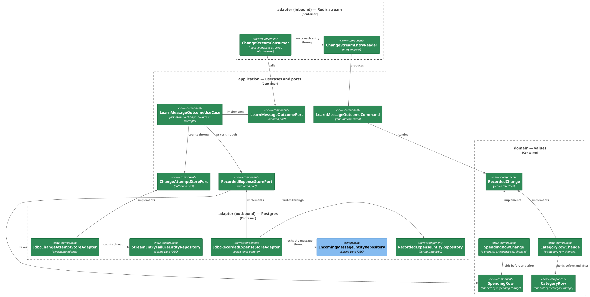

# Plan: The Connector Learns What Became of a Message

**Affected Modules:** `ai-connector-service`
**Design:** [The Connector Learns What Became of a Message](design.md)

## Components

The design named responsibilities; these are the classes that hold them. One subject, one diagram: an entry read
off the stream, applied to the store, acknowledged or held.



### What a box cannot carry

| Type                        | Package               | Holds                                                                                                                                                       | Refuses                                                                                                                                       |
|-----------------------------|-----------------------|-------------------------------------------------------------------------------------------------------------------------------------------------------------|-----------------------------------------------------------------------------------------------------------------------------------------------|
| `ChangeOperation`           | `domain/value`        | `CREATED`, `UPDATED`, `DELETED`                                                                                                                             | —                                                                                                                                             |
| `SpendingKind`              | `domain/value`        | `PROPOSAL`, `EXPENSE`                                                                                                                                       | —                                                                                                                                             |
| `SpendingRow`               | `domain/value`        | `long id`, `long userId`, `Optional<String> incomingMessageId`, `String description`, `Optional<String> merchant`, `long amountMinorUnits`, `CurrencyCode currencyCode`, `long categoryId`, `Optional<String> categoryName`, `Optional<String> groupingName`; `messageIdentity(): Optional<MessageIdentity>` — the amount stays in minor units, the ledger's own row shape and what content-equality compares (design F26) | a null or blank `description`, a null `currencyCode`, a null `Optional`, as `InvalidValueException`                                              |
| `CategoryRow`               | `domain/value`        | `long id`, `long userId`, `Optional<Long> parentId`, `String name`                                                                                          | a null or blank `name`, a null `Optional`, as `InvalidValueException`                                                                         |
| `RecordedChange`            | `domain/value`        | sealed interface, permits the two below                                                                                                                     | —                                                                                                                                             |
| `SpendingRowChange`         | `domain/value`        | `SpendingKind kind`, `ChangeOperation op`, `String transactionId`, `Optional<SpendingRow> before`, `Optional<SpendingRow> after`; `row()` is `after` where present, else `before`; `messageIdentity()` is `row().messageIdentity()` | `CREATED` with no `after`, `DELETED` with no `before`, `UPDATED` missing either, a null or blank `transactionId`, as `InvalidValueException`  |
| `CategoryRowChange`         | `domain/value`        | `ChangeOperation op`, `Optional<CategoryRow> before`, `Optional<CategoryRow> after`; the same presence rule                                                 | the same, as `InvalidValueException`                                                                                                          |
| `LearnMessageOutcomeCommand`| `application/dto`     | `String deliveryId`, `RecordedChange change`                                                                                                                | a null or blank `deliveryId`, a null `change`, as `InvalidValueException`                                                                     |
| `LearnOutcome`              | `application/dto`     | `APPLIED`, `RETRY_LATER`, `DROPPED`                                                                                                                         | —                                                                                                                                             |
| `MemoryProperties`          | `adapter/scheduling`  | gains `int entryAttempts`, bound to `memory.entry-attempts`                                                                                                 | —                                                                                                                                             |
| `ChangeStreamProperties`    | `adapter/redis`       | `String key`, `Duration claimIdle`, bound to `ledger.change-stream.*`                                                                                       | —                                                                                                                                             |
| `RecordedExpenseEntity`     | `adapter/persistence` | the row of `recorded_expense`, `@Id Long id`                                                                                                                | —                                                                                                                                             |
| `StreamEntryFailureEntity`  | `adapter/persistence` | the row of `stream_entry_failure`, `@Id String entryId`                                                                                                     | —                                                                                                                                             |

| Port                       | Methods                                                                                                                                                                                                                                                                                                                                                                                                                                                                                                                                                                                                                                                                                                                                                                                                                                                                                                                                                                                                                                                                                                                                                                             |
|----------------------------|-------------------------------------------------------------------------------------------------------------------------------------------------------------------------------------------------------------------------------------------------------------------------------------------------------------------------------------------------------------------------------------------------------------------------------------------------------------------------------------------------------------------------------------------------------------------------------------------------------------------------------------------------------------------------------------------------------------------------------------------------------------------------------------------------------------------------------------------------------------------------------------------------------------------------------------------------------------------------------------------------------------------------------------------------------------------------------------------------------------------------------------------------------------------------------------------------------------------------------------------------------------------------------------------------------------------------------------------------------------------------------------------------------------------------------------------------------------------------------------|
| `LearnMessageOutcomePort`  | `LearnOutcome learn(LearnMessageOutcomeCommand command)` — applies the change the design's *What an entry does* table names and answers `APPLIED` (an ignored entry included); a `MessageStoreUnavailableException` is `RETRY_LATER` and counts nothing; a `MessageStoreFailedException` is counted through `ChangeAttemptStorePort`, and answers `RETRY_LATER` below `entryAttempts` and `DROPPED` at it — logged at `ERROR` naming the delivery id, the kind, the op and the row id, the message's `DISCARDED` rows of that `transactionId` turned `UNKNOWN` when the change is an expense `CREATED` (F19 — a dropped proposal `DELETED` wrote no provisional row and leaves nothing behind), and the attempts cleared. `APPLIED` clears the attempts too. `LearnMessageOutcomeUseCase` takes the two stores, `int entryAttempts` and a `LoggerFactory`, and refuses a non-positive `entryAttempts` as `InvalidValueException` (design F24) |
| `RecordedExpenseStorePort` | `void recordProposed(SpendingRow proposal)` — upsert keyed by `proposal_id`, `PROPOSED` on insert, status untouched on conflict, `message_id`/`user_id` from the message row, no-op for a message the store lacks; `void settleProposalDeleted(SpendingRow proposal, String transactionId)` and `void settleExpenseInserted(SpendingRow expense, String transactionId)` — the design's accept table, each one transaction holding `SELECT … FOR UPDATE` on the message row, no-op for a message the store lacks; `void refileExpense(SpendingRow expense)` — the row keyed by `expense_id` takes the entry's content and names; `void removeExpense(long expenseId)`; `void renameCategory(long categoryId, String name)`; `void renameGrouping(long userId, String from, String to)`; `void abandonAcceptance(MessageIdentity message, String transactionId)` — every `DISCARDED` row of that message with that `moved_in_tx` becomes `UNKNOWN`. Each of these five is a no-op when nothing matches — an expense whose insert was trimmed (F6), a category no row is under. Content-equal is `description`, `merchant` (`IS NOT DISTINCT FROM`), `amount_minor_units`, `currency_code`, `category_id`. A `DataAccessResourceFailureException` or `TransientDataAccessException` becomes `MessageStoreUnavailableException`; any other `DataAccessException` becomes `MessageStoreFailedException` |
| `ChangeAttemptStorePort`   | `int countFailure(String deliveryId, String error)` — upsert on `stream_entry_failure`, answers the attempts so far, in its own transaction; `void clear(String deliveryId)`. The same exception translation                                                                                                                                                                                                                                                                                                                                                                                                                                                                                                                                                                                                                                                                                                                                                                                                                                                                                                                                                                       |

| Exception                          | Package            | Raised by                                                                       | Becomes                                                                          |
|------------------------------------|--------------------|---------------------------------------------------------------------------------|----------------------------------------------------------------------------------|
| `MessageStoreUnavailableException` | `domain/exception` | a store that cannot be reached, behind either new port; extends `MessageStoreFailedException` so Design 31's catch sites stand | `RETRY_LATER`, uncounted (D1, F18)                                            |

Classes drawn without their wiring, because a box cannot carry it:

| Class                        | Package               | Holds                                                                                                                                                                                                                                                                                                                                                                                                                                                                                                                                                                                                                                                                                                                                                                                                                                                                                                                                                                                                                                                                                                                                                                                                                                                                                                                                                                                                                                                                             |
|------------------------------|-----------------------|-------------------------------------------------------------------------------------------------------------------------------------------------------------------------------------------------------------------------------------------------------------------------------------------------------------------------------------------------------------------------------------------------------------------------------------------------------------------------------------------------------------------------------------------------------------------------------------------------------------------------------------------------------------------------------------------------------------------------------------------------------------------------------------------------------------------------------------------------------------------------------------------------------------------------------------------------------------------------------------------------------------------------------------------------------------------------------------------------------------------------------------------------------------------------------------------------------------------------------------------------------------------------------------------------------------------------------------------------------------------------------------------------------------------------------------------------------------------------------------|
| `ChangeStreamConfiguration`  | `adapter/redis`       | `@ConditionalOnProperty(memory.enabled)`; enables `ChangeStreamProperties`; a `StringRedisTemplate` bean over the autoconfigured `RedisConnectionFactory`, as the ledger's `RedisConfiguration`; a single-thread `ExecutorService` bean the consumer runs on                                                                                                                                                                                                                                                                                                                                                                                                                                                                                                                                                                                                                                                                                                                                                                                                                                                                                                                                                                                                                                                                                                                                                                                                                       |
| `ChangeStreamEntryReader`    | `adapter/redis`       | `Optional<LearnMessageOutcomeCommand> read(String entryId, Map<String, String> body)` — parses `payload` and `enrichment` with Jackson; empty for a table other than `expense_proposal`, `expense`, `category`, and for an `op` other than `c`, `u`, `d`; a spending row's names come from `enrichment.before`/`after`, absent when the block or the field is missing; `source.txId` is carried as text; a body with no `payload`, unparseable JSON, or a row missing a required column throws `InvalidValueException` (F23)                                                                                                                                                                                                                                                                                                                                                                                                                                                                                                                                                                                                                                                                                                                                                                                                                                                                                                                                                                       |
| `ChangeStreamConsumer`       | `adapter/redis`       | `@Component`, `@ConditionalOnProperty(memory.enabled)`, `SmartLifecycle`. `start()` submits `run()` to the executor; `stop()` flags it and interrupts. `run()`: `XGROUP CREATE <key> ai-connector $ MKSTREAM`, `BUSYGROUP` ignored; the consumer name is the host name; then a loop of — `XAUTOCLAIM` entries idle past `claimIdle` from other consumers, own pending (`XREADGROUP … ID 0`), then new (`XREADGROUP … ID > BLOCK 1s`); each entry through the reader and the port; `APPLIED` and `DROPPED` `XACK`; `RETRY_LATER` sleeps `RETRY_BACKOFF` (1 s) and restarts the loop at own pending; an unreadable entry logs `WARN` with the entry id and `XACK`s (F23); a `DataAccessException` from Redis logs `WARN`, sleeps `RECONNECT_BACKOFF` (2 s) and restarts at the group creation; a `RuntimeException` from the port logs `ERROR` and is treated as `RETRY_LATER`. Constants, not configuration (F22)                                                                                                                                                                                                                                                                                                                                                                                                                                                                                                                                                                              |

## Step-by-Step Implementation Map (To-Do List)

### Stabilization

#### Database

- [x] ST01 · Add migration `ai-connector-service/src/main/resources/db/migration/V002__create_recorded_expense.sql`,
  exactly as the design's **The store** section states: `recorded_expense` with its four indexes and
  `ck_recorded_expense_has_a_key`, and `stream_entry_failure`.

#### Interface-First / Build Stabilization

New-method stubs carry a short inline comment describing the implementation intent, and no comment anywhere cites
a step id — `CommentConventionsTest` fails the run on one.

**Interface & Signature Sync**

- [x] ST02 · Add to `ai-connector-service/build.gradle`: `org.springframework.boot:spring-boot-starter-data-redis`;
  for tests `org.testcontainers:testcontainers-toxiproxy` (Q1) — `RedisContainers` itself is a `GenericContainer`
  as the ledger's is, needing no module of its own. Confirm the module compiles.

- [x] ST03 · Add to `domain/value`: `ChangeOperation`, `SpendingKind`, `SpendingRow`, `CategoryRow`,
  `RecordedChange`, `SpendingRowChange`, `CategoryRowChange`, with the components the Components table names, every
  compact constructor left to validate nothing yet, and `SpendingRow.messageIdentity()`,
  `SpendingRowChange.row()`, `SpendingRowChange.messageIdentity()` stubbed:
  ```java
  public Optional<MessageIdentity> messageIdentity() {
      // pairs userId with incomingMessageId where the row carries one
      return Optional.empty();
  }
  ```
  Add `domain/exception/MessageStoreUnavailableException extends MessageStoreFailedException`, in the shape its
  parent has.

- [x] ST04 · Add `application/dto/LearnMessageOutcomeCommand` (compact constructor validating nothing yet, a `TODO`
  at the refusal point) and `application/dto/LearnOutcome`. Add `application/port/LearnMessageOutcomePort`,
  `application/port/RecordedExpenseStorePort` and `application/port/ChangeAttemptStorePort` with the methods the
  port table names. Stub `application/usecase/LearnMessageOutcomeUseCase` (constructor: `RecordedExpenseStorePort`,
  `ChangeAttemptStorePort`, `int entryAttempts`, `LoggerFactory`, no refusal yet):
  ```java
  public LearnOutcome learn(LearnMessageOutcomeCommand command) {
      // dispatches the change to the store by kind and op, counts a store-answered failure and drops the
      // change at entryAttempts, retries an unreachable store uncounted
      return null;
  }
  ```

- [x] ST05 · Give `MemoryProperties` a fifth component `int entryAttempts`, and in `UseCaseConfiguration` declare
  `@Bean @ConditionalOnProperty(name = "memory.enabled", havingValue = "true") LearnMessageOutcomePort
  learnMessageOutcomePort(RecordedExpenseStorePort, ChangeAttemptStorePort, MemoryProperties, LoggerFactory)`
  built from `properties.entryAttempts()`.

- [x] ST06 · In `adapter/persistence`: `RecordedExpenseEntity` (`@Table("recorded_expense")`),
  `RecordedExpenseEntityRepository extends CrudRepository<RecordedExpenseEntity, Long>` carrying the `@Modifying
  @Query` statements the port table's contracts need — the `INSERT … SELECT … FROM incoming_message … ON CONFLICT
  (proposal_id) DO UPDATE` upsert, the content/name update by `expense_id`, the delete by `expense_id`, the two
  renames, the `UNKNOWN` update, and the reads and updates the two `settle*` transactions sequence (a row by
  `proposal_id`, a row by `expense_id`, the lowest content-equal `DISCARDED` row of a `moved_in_tx`, the lowest
  content-equal lone `ACCEPTED` row of one, the status/id updates and the `INSERT` of a lone `ACCEPTED` row);
  `StreamEntryFailureEntity` (`@Table("stream_entry_failure")`) and
  `StreamEntryFailureEntityRepository extends CrudRepository<StreamEntryFailureEntity, String>` carrying the
  `INSERT … ON CONFLICT (entry_id) DO UPDATE SET attempts = stream_entry_failure.attempts + 1, last_error =
  EXCLUDED.last_error RETURNING attempts` and the delete. Give `IncomingMessageEntityRepository`
  `Optional<Long> lockId(long userId, String incomingMessageId)` — `SELECT id … FOR UPDATE`. Then stubs for
  `JdbcRecordedExpenseStoreAdapter` and `JdbcChangeAttemptStoreAdapter` (`@Component`,
  `@ConditionalOnProperty(name = "memory.enabled", havingValue = "true")`), one per port method, each with its
  intent comment, the two `settle*` methods `@Transactional`:
  ```java
  @Transactional
  public void settleExpenseInserted(SpendingRow expense, String transactionId) {
      // under the message's row lock: a row already keyed by this expense id takes the entry's names; else the
      // lowest content-equal DISCARDED row of this transaction becomes ACCEPTED and takes the expense id; else
      // a lone ACCEPTED row is inserted remembering the transaction; a message the store lacks is a no-op
  }
  ```

- [x] ST07 · Create `adapter/redis` with its `package-info.java`, and in it: `ChangeStreamProperties`,
  `ChangeStreamConfiguration` (as the Components table states), the stub `ChangeStreamEntryReader` (`@Component`,
  taking an `ObjectMapper`):
  ```java
  public Optional<LearnMessageOutcomeCommand> read(String entryId, Map<String, String> body) {
      // parses payload and enrichment into a RecordedChange, empty for a table or op nothing here learns from,
      // InvalidValueException for a body that is not a change event
      return Optional.empty();
  }
  ```
  and the stub `ChangeStreamConsumer` (`@Component`, `@ConditionalOnProperty(name = "memory.enabled",
  havingValue = "true")`, `SmartLifecycle`, constructor: `StringRedisTemplate`, `ChangeStreamProperties`,
  `ChangeStreamEntryReader`, `LearnMessageOutcomePort`, the executor bean — declared
  `@Bean(destroyMethod = "shutdown") ExecutorService changeStreamExecutor()` and taken with
  `@Qualifier("changeStreamExecutor")`, since `memoryPurgeExecutor` is an `ExecutorService` too — and
  `LoggerFactory`), `start()`/`stop()`/
  `isRunning()` in `MemoryPurgeScheduler`'s shape over the executor, and:
  ```java
  public void run() {
      // creates the group on the stream, then reads claimed, pending and new entries in turn, hands each to the
      // reader and the port, and acknowledges what was applied or dropped
  }
  ```

- [x] ST08 · Add `org.springframework.data.redis..` to `CleanArchitectureTest.domainAndApplicationStayFrameworkAgnostic`
  and `Redis` to `coreTypesCarryNoExternalSystemName`. Confirm the class passes.

**Configuration**

- [x] ST09 · In `application.yaml`: `spring.data.redis.url: ${REDIS_URL:redis://localhost:6379}`,
  `spring.data.redis.timeout: 2s` (fixed, as the ledger bounds its commands — a blackholed connection otherwise
  waits on Lettuce's 60 s default), `management.health.redis.enabled: ${memory.enabled}` beside `management.health.db.enabled` (F25);
  `memory.entry-attempts: ${MEMORY_ENTRY_ATTEMPTS:3}`; a `ledger.change-stream:` root with
  `key: ${CDC_STREAM_KEY:ledger.cdc}` and `claim-idle: 30s`. Nothing in `application-test.yaml`: the test profile's
  `memory.enabled: false` carries the health switch, and the Lettuce client the starter declares opens no
  connection until asked, as Design 31's idle datasource does.

- [x] ST10 · In `infrastructure/docker-compose.yaml`: `ai-connector-service` gains `REDIS_URL: redis://redis:6379`,
  as `ledger-service` has, and nothing else — no healthcheck on `redis` (F11).

**Shared Test Infrastructure**

- [x] ST11 · Add `common/containers/RedisContainers` — a JVM-wide `GenericContainer` singleton on `redis:8` in the
  shape `ledger-service`'s has, with `redisUrl()`, `connectionFactory()`, `unreachableConnectionFactory()` and
  `template(...)`, and `common/containers/Network` and `common/containers/ToxiproxyContainers` beside it (the
  ledger's, unchanged — Q1). Give `AbstractMemorySystemTest` the container's URL
  as `spring.data.redis.url` and a stream key of its own as `ledger.change-stream.key` (`ledger.cdc-` and a random
  suffix, exposed as a protected field), both through a `DynamicPropertyRegistrar` bean a subclass can override —
  the shape `ledger-service`'s `CdcCaptureTest` uses, so RS03 can point its own context at a closed port — and
  truncate `stream_entry_failure` after each test beside `incoming_message` (`recorded_expense` cascades). Add
  `common/boot/@RedisAdapterTest` — `@SpringBootTest` on `ChangeStreamConfiguration`, `ChangeStreamConsumer`,
  `ChangeStreamEntryReader`, `Slf4jLoggerFactory` and Jackson's `ObjectMapper`,
  `@ImportAutoConfiguration(DataRedisAutoConfiguration.class)` (Boot 4's name, as the ledger's `McpAdapterTest`
  excludes it), the test profile, `memory.enabled=true`, `ledger.change-stream.claim-idle=2s`, the same registrar
  for the URL and a per-context stream key, and `@Testcontainers(disabledWithoutDocker = true)`; a test class adds
  `@MockitoBean LearnMessageOutcomePort`. Two cached contexts consuming one key in one group would steal each
  other's entries, which is what the per-context key prevents. Ship
  the throwaway boot test the conventions require, and note that every container-backed class skips when Docker is
  down.

- [x] ST12 · Add `common/fixtures/ChangeStreamEntryFixtures` — builders of an entry body (`Map<String, String>` of
  `payload` and `enrichment`) for: a proposal `c`/`u`/`d`, an expense `c`/`u`/`d`, a category `u` with and without
  a parent, an `r`, an unknown table, and a body with no `payload`; every builder takes the row's ids, user, message
  id, content, category id and names, and a `txId`. Add `common/fixtures/RecordedChangeFixtures` — the same set as
  `RecordedChange` values, plus a `SpendingRow` builder with defaults. Add `common/stubs/LedgerChangeStreamStubs` —
  static helpers over `RedisContainers`: `publish(String key, Map<String, String> body): String` (XADD, answers the
  entry id), `pending(String key, String group): long` (XPENDING count), `readAsOther(String key, String group,
  String consumer)` (XREADGROUP under another consumer name without acknowledging), `deleteStream(String key)`,
  `groupExists(String key, String group)`. Add `common/rows/RecordedExpenseRowUtils` — over a `JdbcTemplate`: insert
  a row with every column given, read a row by `proposal_id` and by `expense_id` as a small record (status, both
  ids, category id, both names, `moved_in_tx`), count rows of a message, delete all; and
  `common/rows/StreamEntryFailureRowUtils` — read attempts of an entry id, insert a row, delete all.

- [x] ST13 · Confirm `CleanArchitectureTest`, `CommentConventionsTest` and `DisplayNameConventionsTest` pass, and
  that the pre-existing suite — the memory-off classes with no Redis, and the memory-on classes now booting with
  the Redis container — is still green.

### Red Phase

#### TDD Unit Red Phase

- [x] RU01 · `SpendingRow` · test: `SpendingRowTest` · covers: the compact constructor, `messageIdentity()` ·
  scenarios: A11
    - the compact constructor:
        - given: a null or blank description, or a null currency code
          when: the record is constructed
          then: InvalidValueException is thrown for each, never NullPointerException
        - given: a null Optional for merchant, incomingMessageId, categoryName or groupingName
          when: the record is constructed
          then: InvalidValueException is thrown for each
    - `messageIdentity()`:
        - given: a row carrying an incoming message id
          when: messageIdentity() is called
          then: it carries the row's userId and that id
        - given: a row with no incoming message id
          when: messageIdentity() is called
          then: it is empty

- [x] RU02 · `SpendingRowChange` · test: `SpendingRowChangeTest` · covers: the compact constructor, `row()`,
  `messageIdentity()`
    - the compact constructor:
        - given: CREATED with no after, DELETED with no before, or UPDATED missing either side
          when: the record is constructed
          then: InvalidValueException is thrown for each
        - given: a null or blank transactionId, or a null kind or op
          when: the record is constructed
          then: InvalidValueException is thrown for each
    - `row()`:
        - given: an UPDATED change with both sides
          when: row() is called
          then: it is the after row
        - given: a DELETED change
          when: row() is called
          then: it is the before row
    - `messageIdentity()`:
        - given: a change whose row carries a message id
          when: messageIdentity() is called
          then: it is that row's identity

- [x] RU03 · `CategoryRowChange` · test: `CategoryRowChangeTest` · covers: the compact constructor
    - the compact constructor:
        - given: CREATED with no after, DELETED with no before, or UPDATED missing either side
          when: the record is constructed
          then: InvalidValueException is thrown for each

- [x] RU07 · `CategoryRow` · test: `CategoryRowTest` · covers: the compact constructor
    - the compact constructor:
        - given: a null or blank name
          when: the record is constructed
          then: InvalidValueException is thrown for each, never NullPointerException
        - given: a null parentId Optional
          when: the record is constructed
          then: InvalidValueException is thrown

- [x] RU04 · `LearnMessageOutcomeCommand` · test: `LearnMessageOutcomeCommandTest` · covers: the compact constructor
    - the compact constructor:
        - given: a delivery id and a change
          when: the record is constructed
          then: both read back unchanged
        - given: a null or blank delivery id, or a null change
          when: the record is constructed
          then: InvalidValueException is thrown for each

- [x] RU05 · `LearnMessageOutcomeUseCase` · test: `LearnMessageOutcomeUseCaseTest` · covers: the constructor,
  `learn()` · scenarios: A1, A3, A6, A7, A8, A9, A11, A12, A16, A17, A18, A20
    - the constructor:
        - given: an entryAttempts of zero or negative
          when: the use case is constructed
          then: InvalidValueException is thrown for each
    - `learn()`:
        - given: a proposal CREATED, and a proposal UPDATED, each carrying a message id
          when: learn() is called with each
          then: recordProposed() receives the after row, and the outcome is APPLIED
        - given: a proposal DELETED carrying a message id
          when: learn() is called
          then: settleProposalDeleted() receives the before row and the transaction id
        - given: an expense CREATED carrying a message id
          when: learn() is called
          then: settleExpenseInserted() receives the after row and the transaction id
        - given: an expense UPDATED, and an expense DELETED
          when: learn() is called with each
          then: refileExpense() receives the after row, removeExpense() receives the before row's id
        - given: an expense CREATED, UPDATED and DELETED whose row carries no message id, and a proposal CREATED
          whose row carries none
          when: learn() is called with each
          then: the store is never touched and the outcome is APPLIED
        - given: a category UPDATED with a parent and a new name
          when: learn() is called
          then: renameCategory() receives the category id and after.name
        - given: a category UPDATED with no parent and a new name
          when: learn() is called
          then: renameGrouping() receives the user id, before.name and after.name
        - given: a category UPDATED whose name is unchanged (a move), a category CREATED, and a category DELETED
          when: learn() is called with each
          then: the store is never touched and the outcome is APPLIED
        - given: a store that applies
          when: learn() is called
          then: attempts.clear() receives the delivery id
        - given: a store throwing MessageStoreUnavailableException
          when: learn() is called three times with entryAttempts 3
          then: each outcome is RETRY_LATER, countFailure() is never called, and one WARN per call is logged
        - given: a store throwing MessageStoreFailedException and an attempt store answering 1, then 2
          when: learn() is called twice
          then: each outcome is RETRY_LATER, countFailure() received the delivery id each time, and nothing is
          logged above WARN
        - given: an expense CREATED with a message id, a store throwing MessageStoreFailedException and an attempt
          store answering entryAttempts
          when: learn() is called
          then: the outcome is DROPPED, one ERROR line names the delivery id, the kind, the op and the row id and
          carries nothing from the description or merchant, abandonAcceptance() receives the message identity and
          the transaction id, and clear() receives the delivery id
        - given: a proposal DELETED, a category UPDATED, an expense UPDATED and a proposal CREATED under the same
          failure
          when: learn() is called with each
          then: the outcome is DROPPED and abandonAcceptance() is never called
        - given: a store throwing MessageStoreFailedException and an attempt store that itself throws
          MessageStoreUnavailableException
          when: learn() is called
          then: the outcome is RETRY_LATER and nothing propagates
        - given: a drop whose abandonAcceptance() throws MessageStoreFailedException
          when: learn() is called
          then: the outcome is still DROPPED, one WARN is logged, and nothing propagates

- [x] RU06 · `ChangeStreamEntryReader` · test: `ChangeStreamEntryReaderTest` · covers: `read()` · scenarios: A1,
  A11
    - `read()`:
        - given: a proposal `c` body with enrichment
          when: read() is called
          then: the command carries the entry id and a SpendingRowChange PROPOSAL CREATED whose after row holds
          the id, user id, message id, description, merchant, amount, currency, category id, and the names from
          enrichment.after, and whose transaction id is source.txId as text
        - given: a proposal `d` body
          when: read() is called
          then: the change is DELETED with a before row and no after
        - given: an expense `u` body whose enrichment carries different before and after names
          when: read() is called
          then: before holds the before names and after the after names
        - given: an expense `c` body whose row has a null incoming_message_id
          when: read() is called
          then: the after row's message id is empty
        - given: a spending body with no enrichment block
          when: read() is called
          then: both names are empty on every row
        - given: a category `u` body with a parent, and one with a null parent
          when: read() is called
          then: a CategoryRowChange whose after row's parentId is present, then empty
        - given: an `r` body, and a body naming a table other than the three
          when: read() is called
          then: it answers empty
        - given: a body with no payload field, one whose payload is not JSON, and one whose row lacks a required
          column
          when: read() is called with each
          then: InvalidValueException is thrown

#### TDD Integration Red Phase

- [x] RI01 · `JdbcRecordedExpenseStoreAdapter` · test: `JdbcRecordedExpenseStoreAdapterTest` · covers:
  `recordProposed()`, `settleProposalDeleted()`, `settleExpenseInserted()`, `refileExpense()`, `removeExpense()`,
  `renameCategory()`, `renameGrouping()`, `abandonAcceptance()` · scenarios: A1, A2, A3, A4, A5, A6, A7, A8, A9, A10,
  A12, A13, A14, A15, A20
    - `recordProposed()`:
        - given: a registered message and no row
          when: recordProposed() is called
          then: one PROPOSED row keyed by the proposal id holds the content, the category id, both names, the
          message's id and user id, and an updated_at
        - given: that row, ACCEPTED with both ids
          when: recordProposed() is called again with a different category name
          then: there is still one row, it holds the later name, and it is still ACCEPTED
        - given: no registered message under the row's identity
          when: recordProposed() is called
          then: no row is written
    - `settleProposalDeleted()`:
        - given: a PROPOSED row and no other row
          when: settleProposalDeleted() is called with a transaction id
          then: the row is DISCARDED remembering it
        - given: a lone ACCEPTED row of the transaction, same message, same content, and the PROPOSED row
          when: settleProposalDeleted() is called
          then: one row remains, ACCEPTED, holding both ids
        - given: two lone ACCEPTED rows of the transaction with equal content
          when: settleProposalDeleted() is called
          then: the lower expense id takes the proposal id and the other stays lone
        - given: an ACCEPTED row holding both ids
          when: settleProposalDeleted() is called again
          then: the row is unchanged
        - given: no registered message
          when: settleProposalDeleted() is called
          then: nothing changes
    - `settleExpenseInserted()`:
        - given: a DISCARDED row of the transaction, same message, same content
          when: settleExpenseInserted() is called
          then: that row is ACCEPTED, holds the expense id and no second row exists
        - given: two DISCARDED rows of the transaction with equal content
          when: settleExpenseInserted() is called twice with two expense ids
          then: each row is ACCEPTED with one expense id each, the lower proposal id first
        - given: three DISCARDED rows of the transaction with different content
          when: settleExpenseInserted() is called for each content
          then: each row is ACCEPTED with the expense id whose content matches
        - given: a DISCARDED row of another transaction, or of another message
          when: settleExpenseInserted() is called
          then: a lone ACCEPTED row keyed by the expense id is written and the DISCARDED row stands
        - given: a row already keyed by the expense id
          when: settleExpenseInserted() is called again with a different name
          then: there is still one row and it holds the later name
        - given: a PROPOSED row, rows written and committed rather than left in the test's transaction, and two
          threads — one calling settleProposalDeleted(), one settleExpenseInserted(), for one transaction
          when: both run at once, repeatedly over fresh rows
          then: every run ends with one ACCEPTED row holding both ids and no second row
    - `refileExpense()`, `removeExpense()`:
        - given: an ACCEPTED row
          when: refileExpense() is called with a new category id and names
          then: the row holds them and stays ACCEPTED
        - given: an ACCEPTED row
          when: removeExpense() is called with its expense id
          then: the row is gone and the message row stays
        - given: no row under the expense id
          when: refileExpense() and removeExpense() are called with it
          then: nothing changes and nothing is thrown
    - `renameCategory()`, `renameGrouping()`:
        - given: rows under category 42 and rows under 43
          when: renameCategory() is called for 42
          then: only the rows under 42 hold the new name
        - given: rows of one person under grouping "Dining" and another person's under "Dining"
          when: renameGrouping() is called for the first person
          then: the first person's rows read "Food" and the other's are untouched
        - given: no row under the category, and no row of the person under the grouping
          when: renameCategory() and renameGrouping() are called
          then: nothing changes and nothing is thrown
    - `abandonAcceptance()`:
        - given: a DISCARDED row of the transaction, a DISCARDED row of another transaction, and a lone ACCEPTED
          row of the transaction
          when: abandonAcceptance() is called
          then: only the first is UNKNOWN
        - given: no row of the message under the transaction
          when: abandonAcceptance() is called
          then: nothing changes and nothing is thrown
    - against a mocked repository, the way `JdbcMessageStoreAdapterTest` reaches a store the container cannot be
      made into:
        - given: a repository throwing DataAccessResourceFailureException, and one throwing
          TransientDataAccessResourceException
          when: recordProposed() is called
          then: MessageStoreUnavailableException is thrown wrapping it
        - given: a repository throwing another DataAccessException
          when: recordProposed() is called
          then: MessageStoreFailedException, not its subtype, is thrown wrapping it

- [x] RI02 · `JdbcChangeAttemptStoreAdapter` · test: `JdbcChangeAttemptStoreAdapterTest` · covers:
  `countFailure()`, `clear()` · scenarios: A17, A19
    - `countFailure()`:
        - given: no row for the entry id
          when: countFailure() is called
          then: it answers 1, and the row holds the error and a first_failed_at
        - given: that row
          when: countFailure() is called twice more with another error
          then: it answers 2, then 3, and the row holds the latest error and the first first_failed_at
        - given: rows for two entry ids
          when: countFailure() is called for one
          then: the other's attempts are unchanged
    - `clear()`:
        - given: a row for the entry id
          when: clear() is called
          then: it is gone; a second clear() changes nothing
    - against a mocked repository:
        - given: a repository throwing DataAccessResourceFailureException, and one throwing another
          DataAccessException
          when: countFailure() is called
          then: MessageStoreUnavailableException, then MessageStoreFailedException, is thrown wrapping it

- [x] RI03 · `ChangeStreamConsumer` · test: `ChangeStreamConsumerTest` · covers: `start()`, `stop()` · scenarios:
  A16, A17, A21, A22
    - `start()`:
        - given: a Redis with no stream under the key, and the mocked port answering APPLIED
          when: the context starts and one entry is published
          then: the group `ai-connector` exists on the stream, the port received a command carrying that entry's
          id and change, and the group's pending count reads zero
        - given: two entries published, the port answering RETRY_LATER for the first and APPLIED for the second
          when: the consumer runs
          then: the first stays pending and is offered again after the backoff, before the second is offered again
          — the port sees the first entry's id at least twice and never the second before the first's last offer
        - given: the port answering DROPPED
          when: an entry is offered
          then: it is acknowledged and the next entry is offered
        - given: a body with no payload
          when: it is published
          then: one WARN names its entry id, it is acknowledged, and the port never sees it
        - given: an entry read under another consumer name and never acknowledged
          when: claimIdle passes
          then: the consumer under test offers it to the port and acknowledges it once APPLIED
        - given: the port throwing a RuntimeException
          when: an entry is offered
          then: one ERROR is logged, the entry stays pending, and the consumer keeps running
        - given: a nested group whose context points `spring.data.redis.url` at `ToxiproxyContainers.proxiedRedisUrl()`
          (Q1) with the proxy cut before the first entry
          when: the proxy is restored
          then: entries published while it was cut are offered and acknowledged, and the consumer never stopped
    - `stop()`:
        - given: a running consumer
          when: stop() is called
          then: isRunning() reads false within a bound, and an entry published afterwards is never offered

#### TDD System Test Red Phase

- [x] RS01 · `LearnMessageOutcomeSystemTest` · covers: `ChangeStreamConsumer.run()` · scenarios: A1, A2, A3, A10
    - Happy Path:
        - given: the memory on, a message registered through `IncomingMessageRowUtils`, and the stream on the
          container
          when: a proposal `c` for that message is published, then its `d` and an expense `c` sharing one txId
          then: within a bound one row is ACCEPTED holding both ids, the amount, the currency, the category id and
          both names, and the group's pending count reads zero
        - given: a PROPOSED row learned the same way
          when: its `d` is published alone
          then: within a bound the row is DISCARDED
    - Unhappy Path:
        - given: no registered message under the entry's identity
          when: a proposal `c` for it is published
          then: within a bound the entry is acknowledged and no row exists for its proposal id

- [x] RS02 · `MemoryHealthSystemTest` · covers: `GET /actuator/health`
    - Happy Path:
        - update: `whenActuatorHealthCalledWithMemoryOn_thenAnswers200UpAndDbUp()` — it asserts `status` UP and
          `components.db.status` UP; assert `components.redis.status` UP beside them, and rename to say so
    - Unhappy Path: none reachable here — a Redis that refuses is RS03's own context

- [x] RS03 · `ChangeStreamUnavailableSystemTest` · covers: `IntentExtractionService/ExtractIntents`,
  `GET /actuator/health` · scenarios: A21
    - Happy Path:
        - given: the memory on, the database container, and `spring.data.redis.url` at a port nothing listens on
          (its own registrar overriding `AbstractMemorySystemTest`'s)
          when: the RPC is called with a token minted for a user and a message, the provider stubbed to record one
          expense
          then: it answers empty and one row holds the request's text — a turn is served
    - Unhappy Path:
        - given: the same
          when: the endpoint is requested
          then: it answers 503, `status` reads `DOWN`, `components.redis.status` reads `DOWN` and
          `components.db.status` UP

- [x] RS04 · `ActuatorHealthSystemTest` · covers: `GET /actuator/health` · scenarios: A23
    - Happy Path:
        - given: the memory off, as the test profile leaves it
          when: the endpoint is requested
          then: `components` carries no `redis`, and the context holds no `ChangeStreamConsumer` bean
    - Unhappy Path: none — the class's error paths are unchanged

### Green Phase

#### TDD Unit Green Phase

- [x] GU01 · `SpendingRow` · test: `SpendingRowTest`
- [x] GU02 · `SpendingRowChange` · test: `SpendingRowChangeTest` · after: GU01
- [x] GU07 · `CategoryRow` · test: `CategoryRowTest`
- [x] GU03 · `CategoryRowChange` · test: `CategoryRowChangeTest` · after: GU07
- [x] GU04 · `LearnMessageOutcomeCommand` · test: `LearnMessageOutcomeCommandTest` · after: GU02
- [x] GU05 · `LearnMessageOutcomeUseCase` · test: `LearnMessageOutcomeUseCaseTest` · after: GU01, GU02, GU03, GU04, GU07
- [x] GU06 · `ChangeStreamEntryReader` · test: `ChangeStreamEntryReaderTest` · after: GU01, GU02, GU03, GU04, GU07

#### TDD Integration Green Phase

- [x] GI01 · `JdbcRecordedExpenseStoreAdapter` · test: `JdbcRecordedExpenseStoreAdapterTest` · after: GU01
- [x] GI02 · `JdbcChangeAttemptStoreAdapter` · test: `JdbcChangeAttemptStoreAdapterTest`
- [x] GI03 · `ChangeStreamConsumer` · test: `ChangeStreamConsumerTest` · after: GU06

#### TDD System Test Green Phase

- [x] GS01 · `LearnMessageOutcomeSystemTest` · covers: `ChangeStreamConsumer.run()`
- [x] GS02 · `MemoryHealthSystemTest` · covers: `GET /actuator/health`
- [x] GS03 · `ChangeStreamUnavailableSystemTest` · covers: `GET /actuator/health`
- [x] GS04 · `ActuatorHealthSystemTest` · covers: `GET /actuator/health`

### Post-Implementation Steps

#### Documentation

These are the pages `archive-knowledge` does not write; the use-case page and the new `contracts/out/` pages are
its output and are not listed here.

- [x] P01 · Correct [`change-stream.md`](../../ledger-service/docs/contracts/out/change-stream.md): "Nothing
  consumes the stream yet" and the "none exists" counterpart name `ai-connector-service`, group `ai-connector`.
- [x] P02 · Correct [Architecture](../../ai-connector-service/docs/conventions/architecture.md): the adapter
  subpackages gain `redis` (the consumer of the ledger's change stream — an inbound adapter fronting Redis), the
  banned-import list gains `org.springframework.data.redis..`, the name list gains `Redis`, and the configuration
  paragraph states that `ledger.change-stream.*` binds in `adapter/redis` and `memory.entry-attempts` is read from
  `adapter/config`.
- [x] P03 · Correct [Testing](../../ai-connector-service/docs/conventions/testing.md): **Test Layers** maps
  `adapter/redis/` — the consumer to the outbound integration type via `@RedisAdapterTest` against the
  containerized Redis with the inbound port mocked, the reader to the unit type (Q2); **Package Structure** lists
  `RedisContainers`, `Network`, `RedisAdapterTest`, `ChangeStreamEntryFixtures`, `RecordedChangeFixtures`,
  `LedgerChangeStreamStubs`, `RecordedExpenseRowUtils`, `StreamEntryFailureRowUtils` and `ToxiproxyContainers`.
  Correct [Build](../../ai-connector-service/docs/conventions/build.md): **Test Isolation** names the
  containerized Redis beside Postgres.
- [x] P04 · Correct [Configuration](../../ai-connector-service/docs/configuration.md): the design's variable table.
- [x] P05 · Correct [Orientation](../../ai-connector-service/docs/conventions/orientation.md): the stack names
  Redis, and the consumed services gain the ledger's change stream.

No ADR: Q3 was answered no.

## Open Questions / Blockers

- **Q1:** A21's "reading resumes once Redis returns" and RI03's last scenario need a connection that can be cut and
  restored inside one booted context. The ledger does that with `ToxiproxyContainers` over `RedisContainers`; the
  connector's suite would gain that container and `org.testcontainers:testcontainers-toxiproxy`. Mirror it, or cover
  A21 by the unreachable-Redis system test alone and drop that RI03 scenario? (Recommended: mirror it.)
  - A: Yes, mirror it.

- **Q2:** The module's testing conventions map no test type for `adapter/redis`, which does not exist yet. This
  plan reads it the way they read `adapter/ai`: the consumer against the real, containerized Redis with the inbound
  port mocked is an outbound integration target under `@RedisAdapterTest`, and the entry reader is a unit target.
  P03 writes that mapping down. Confirm, or name another. (Recommended: confirm.)
  - A: Confirm.

- **Q3:** One ADR candidate survives screening: the attempt count lives in the connector's store keyed by the
  delivery, not in the stream's own delivery counter, so a claim by another instance continues it and an outage
  counts nothing (F18). Without an ADR, the use-case page and the database contract page hold it. Write it? (Recommended: no — it is statable as behaviour, and those pages own it.)
  - A: No.

- **B1 (ST07, widened boundary):** `ChangeStreamEntryReader` does not take an `ObjectMapper` by constructor as ST07
  said: Boot 4's Jackson autoconfiguration exposes a Jackson 3 `JsonMapper` bean, not a jackson-databind
  `ObjectMapper`, so every full-boot test failed context loading with `NoSuchBeanDefinitionException`. The reader
  owns its own `ObjectMapper` field, as the ledger's `ChangeEventPublisher` does; `@RedisAdapterTest` no longer
  imports `JacksonAutoConfiguration`.

- **B2 (ST12, fixture gaps found in red):** `RecordedExpenseRowUtils`' row record lacked the content columns, so
  RS01 and RI01 could not assert amount and currency; it gained `description`, `merchant`, `amountMinorUnits`,
  `currencyCode`. `ChangeStreamEntryFixtures.withNoPayload()` returned an empty map, which `XADD` refuses; it now
  carries only an `enrichment` field.

- **B3 (RI03/GI03, test cleanup vs the group cursor):** the consumer test's `@AfterEach` deleted the stream, which
  destroys the group too, so with the design's `$` cursor an entry published before the group's re-creation was
  invisible; the green agent had moved the cursor to `0`. Resolved for the design: the cursor is `$`, and the
  cleanup drains the group (acknowledges every pending entry, trims the stream) through
  `LedgerChangeStreamStubs.drain(key, group)`, leaving the group and its cursor standing.

- **B4 (GI03, batch order):** the plan's "RETRY_LATER … restarts the loop at own pending" is implemented as: the
  batch stops at the first retrying entry, the rest stay unacknowledged and are re-read as own pending after the
  backoff — a later entry is never offered before the retrying one's last offer. `start()` creates the group
  synchronously and re-affirms it in the loop.

- **B5 (GS01/GS03, start on an unreachable Redis):** `ChangeStreamConsumer.start()` let the connection failure
  escape and failed the application context — and, in the suite, Boot's Testcontainers lifecycle then stopped the
  shared Postgres container for every later memory-on class. `start()` now logs `WARN` and lets the loop's own
  reconnect handling take over (A21).

- **B6 (refactor finding, fixed):** `recordProposed` wrote an absent merchant as `NULLIF('', '')` while every other
  path bound `null` and matched with `IS NOT DISTINCT FROM`, so a proposal whose merchant arrived as `""` could not
  pair with its expense. Aligned to `null` on every path; the two mocked-repository stubs that pinned the `""`
  representation with `anyString()` match `any()` now.

- **Refactor additions to list in P03:** `common/boot/RedisPropertiesConfiguration` (the Redis URL and per-context
  stream-key registrar shared by `AbstractMemorySystemTest` and `@RedisAdapterTest`) and, in production,
  `adapter/persistence/MessageStoreExceptionMapper`.

## Review Findings

- **F1:** The Components diagram omitted `SpendingRow`, `CategoryRow`, `SpendingRowChange`, `CategoryRowChange` and
  `LearnMessageOutcomeCommand`.
  - Resolution: mechanical
  - Action: applied — all five drawn, with their arrows.

- **F2:** `CategoryRow` was tested inside `CategoryRowChangeTest`, against the `<ClassUnderTest>Test` rule, and its
  null-`parentId` refusal had no scenario.
  - Resolution: decision
  - Action: resolved — the module's testing conventions name the test class after the class under test, so
    `CategoryRow` gets RU07/GU07 of its own and RU03 drops the scenario.

- **F3:** `SpendingRow` carried a raw `String currencyCode` and `long amountMinorUnits` in `domain/value`, though
  `CurrencyCode` exists and the architecture bars a transport-shaped field from the core.
  - Resolution: decision
  - Action: resolved — `currencyCode` is a `CurrencyCode` (RU01 refuses null); the amount stays in minor units,
    which is the ledger's row shape and what content-equality compares, not the connector's wire — recorded as
    design F26.

- **F4:** RU05 and the port table had a dropped proposal `DELETED` call `abandonAcceptance()`, which the design
  settles only for a dropped expense insert (F19); on a multi-proposal acceptance it would turn a sibling's
  provisional `DISCARDED` `UNKNOWN`.
  - Resolution: decision
  - Action: resolved — F19 as written: only a dropped expense `CREATED` abandons; the proposal `DELETED` joins the
    never-abandons scenario, and the port table says why.

- **F5:** RU06 claimed A13 and RI03 claimed A13, A15 and A19 without a scenario proving them.
  - Resolution: mechanical
  - Action: applied — RU06 names A1, A11; RI03 names A16, A17, A21, A22.

- **F6:** RS02 claimed A21, the opposite of what its update asserts.
  - Resolution: mechanical
  - Action: applied — the claim is dropped; A21 is RS03's.

- **F7:** RS03's happy path enters the RPC while `covers:` named only the health endpoint.
  - Resolution: decision
  - Action: resolved — one class, `covers:` names both entry points, since A21 spans them.

- **F8:** ST11 named `RedisAutoConfiguration`, which does not exist on Boot 4.
  - Resolution: mechanical
  - Action: applied — `DataRedisAutoConfiguration`.

- **F9:** The consumer's `ExecutorService` parameter had two candidate beans once `memoryPurgeExecutor` exists.
  - Resolution: mechanical
  - Action: applied — ST07 names the bean, its `destroyMethod` and the `@Qualifier`.

- **F10:** `@RedisAdapterTest` and the memory-on system context both consumed `ledger.cdc` in one group on one
  singleton, stealing each other's entries.
  - Resolution: mechanical
  - Action: applied — ST11 gives each context a stream key of its own.

- **F11:** RS03 could not override `AbstractMemorySystemTest`'s `@DynamicPropertySource` URL.
  - Resolution: mechanical
  - Action: applied — ST11 registers it through an overridable `DynamicPropertyRegistrar` bean, and RS03 overrides
    it.

- **F12:** RI01 had no nothing-matches scenario for `refileExpense()`, `removeExpense()`, `renameCategory()`,
  `renameGrouping()` and `abandonAcceptance()`, and the port table stated no-op behaviour only for three methods.
  - Resolution: mechanical
  - Action: applied — one scenario per method, and the port row says the five are no-ops when nothing matches.

- **F13:** ST09 set no Redis command timeout, so a blackholed connection would wait on Lettuce's 60 s default.
  - Resolution: mechanical
  - Action: applied — `spring.data.redis.timeout: 2s`, fixed.
