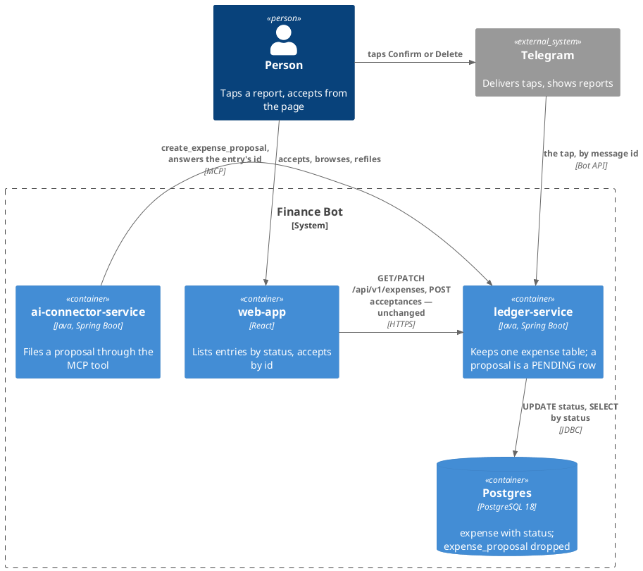
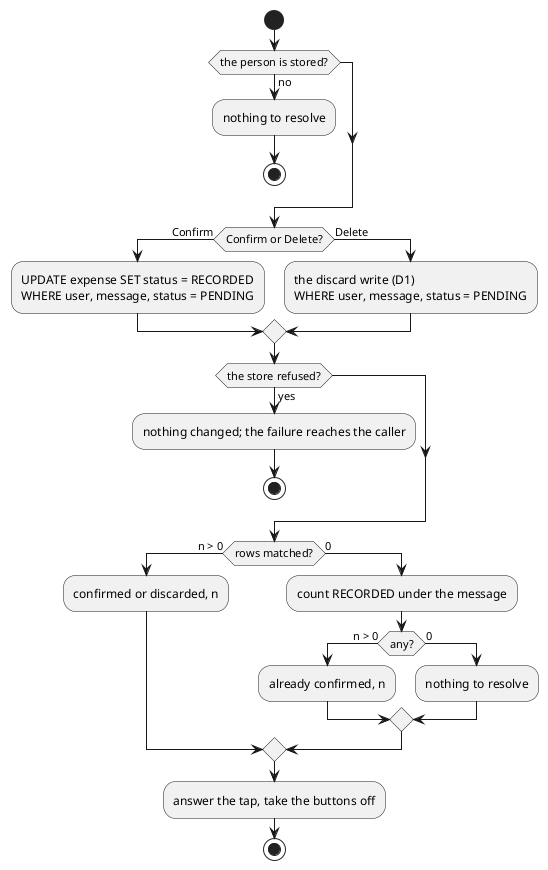

# Design: One Expense Table, With a Status

**Affected Modules:** `ledger-service`

## Objective

An expense proposal and an expense are the same record one step apart, kept in two tables with identical columns
([ADR 0006](../../ledger-service/docs/adr/0006-an-expense-proposal-is-a-table-and-an-entity-of-its-own.md)). The
split has produced no column that differs and no lifecycle that differs, and it costs two of everything: two
entities, two ports, two adapters, two refile statements, a `UNION` on every browse read, two id spaces behind one
API, and a table move where a status change would do
([ADR 0012](../../ledger-service/docs/adr/0012-a-set-of-rows-moves-between-tables-in-one-statement.md)).

This change folds `expense_proposal` into `expense` behind a `status` column. A proposal is a `PENDING` expense;
accepting it sets `RECORDED`. One id names the entry for its whole life. Every read of the person's spending
filters `RECORDED`, and every read of what waits for them filters `PENDING`. Nothing a person sees changes: the
same taps, the same page, the same tool answer.

It comes before [35](../35-the-ledger-publishes-facts-not-rows/design.md), whose events then name one id.
`spending_query` stays a table of its own: it never becomes ledger.

## Context

| What exists                                                        | Where                                                                                                                                                                                                                       | What this change does with it                                                                                          |
|--------------------------------------------------------------------|-----------------------------------------------------------------------------------------------------------------------------------------------------------------------------------------------------------------------------|------------------------------------------------------------------------------------------------------------------------|
| The two entities and their pages                                   | [`Expense`](../../ledger-service/src/main/java/bot/finance/domain/model/Expense.java), [`ExpenseProposal`](../../ledger-service/src/main/java/bot/finance/domain/model/ExpenseProposal.java), [`expense.md`](../../ledger-service/docs/domain/expense.md), [`expense-proposal.md`](../../ledger-service/docs/domain/expense-proposal.md) | One entity carrying a status and an optional message id; one page             |
| The status, today "which table holds it"                           | [`ExpenseStatus`](../../ledger-service/src/main/java/bot/finance/domain/value/ExpenseStatus.java), [`expense-status.md`](../../ledger-service/docs/domain/expense-status.md)                                                | Becomes a stored column; the values do not change                                                                      |
| The two tables, column for column                                  | [`V002`](../../ledger-service/src/main/resources/db/migration/V002__create_expense.sql), [`V003`](../../ledger-service/src/main/resources/db/migration/V003__create_expense_proposal.sql), [`V007`](../../ledger-service/src/main/resources/db/migration/V007__rename_and_widen_incoming_message_id.sql) | `expense` gains `status`; pending rows move in; `expense_proposal` is dropped (D2) |
| Accept and discard, as one statement each                          | [`ExpenseProposalEntityRepository`](../../ledger-service/src/main/java/bot/finance/adapter/persistence/ExpenseProposalEntityRepository.java), ADR 0012                                                                       | The delete-and-insert becomes one `UPDATE`, keeping ADR 0012's property (F1)                                           |
| Every proposal read and write                                      | [`ExpenseProposalRepository`](../../ledger-service/src/main/java/bot/finance/application/port/ExpenseProposalRepository.java)                                                                                                | Folded into the expense store, each operation a status predicate                                                       |
| The browse read, a `UNION` of the two tables                       | [`ExpenseEntityRepository`](../../ledger-service/src/main/java/bot/finance/adapter/persistence/ExpenseEntityRepository.java) `findPage`, `countMatching`, `totalsByCurrency`                                                | One table; totals and counts gain the `RECORDED` predicate they had by table (F2)                                     |
| The API's two id spaces                                            | [`openapi/ledger-api.yaml`](../../openapi/ledger-api.yaml) `Expense.id`, [`expense-category.yaml`](../../openapi/paths/expense-category.yaml)                                                                               | The endpoints stay; the "unique within its status" wording goes (F3)                                                   |
| The MCP tool's answer, carrying the proposal's id                  | [`mcp.md`](../../ledger-service/docs/contracts/in/mcp.md)                                                                                                                                                                   | Unchanged: the id is the entry's id, now for life                                                                     |
| The report, keyed by message, never by proposal id                 | [`TurnReportRenderer`](../../ledger-service/src/main/java/bot/finance/adapter/telegram/TurnReportRenderer.java), [`ProposalCallbackData`](../../ledger-service/src/main/java/bot/finance/adapter/telegram/ProposalCallbackData.java) | Unchanged; why moved rows may take new ids (F4)                                            |
| The capture pipeline naming both tables                            | [`ChangeStreamConfiguration`](../../ledger-service/src/main/java/bot/finance/adapter/cdc/ChangeStreamConfiguration.java), [`V009`](../../ledger-service/src/main/resources/db/migration/V009__publish_ledger_changes.sql), [`change-stream.md`](../../ledger-service/docs/contracts/out/change-stream.md) | The migration moves to `V010` and drops the table from its lines; the include list loses it (D2, F5) |
| The connector's consumer of that stream                            | [Design 32](../implemented/32-the-connector-learns-what-became-of-a-message/design.md)                                                                                                                                      | Reads a `PENDING` insert as an acceptance until 35 and its own task land; nothing runs in production (F6)              |

## Proposed Solution

### What the change adds

| Surface                  | What it becomes                                                                                                   |
|--------------------------|-------------------------------------------------------------------------------------------------------------------|
| The ledger's database    | `expense` gains `status`; `expense_proposal` is gone; its rows moved as `PENDING`                                 |
| The domain               | One `Expense`, with a status and the message it came from where one did                                           |
| The store                | One port and one adapter for expenses; every proposal operation is a status predicate on it                        |
| The API, the MCP tool, the Telegram report | Nothing a caller sees changes; ids are unique across statuses now, which the API's wording said they were not |
| The capture pipeline     | Captures `expense` and `category`; a proposal is an `expense` row whose `status` is `PENDING`                     |

**A status is what a row is, not where it is.** `PENDING → RECORDED` is one `UPDATE … WHERE status = 'PENDING'`,
and its row count is what tells a resolution from a no-op, exactly what ADR 0012's delete gave (F1). Discard is
D1.

**Every read of spending says which status it wants.** Totals, the already-accepted count and the recorded arm
of browse read `RECORDED`; the report, the clearing of emptied reports and the pending arm read
`PENDING`. A read that names no status is the browse listing asked for both, as today.

### Diagrams

The module takes the repository's [Diagram Format](../conventions/diagrams.md) unchanged. There is no component
diagram: classes belong to the plan.

#### Container — what this change reaches



#### Flow — a tap resolves a message's pending entries

The participants are the ones [the use-case page](../../ledger-service/docs/usecases/resolve-a-reported-proposal.md)
already draws; what this change alters is the decision, so it is an activity diagram.



Two taps at once: the second `UPDATE` waits on the first's row locks, re-reads the rows as `RECORDED`, matches
nothing and answers "already confirmed" — ADR 0012's guarantee, without the table move (F1).

The other writes are one guard and one statement each, which is the table below.

### Details

#### The migration

Two migration files change (D2). The merge is `V009__merge_expense_proposal_into_expense.sql`, before capture
exists:

```sql
ALTER TABLE expense
    ADD COLUMN status VARCHAR(10) NOT NULL DEFAULT 'RECORDED'
        CHECK (status IN ('PENDING', 'RECORDED')),
    ADD CONSTRAINT ck_expense_pending_has_message
        CHECK (status <> 'PENDING' OR incoming_message_id IS NOT NULL);

ALTER TABLE expense ALTER COLUMN status DROP DEFAULT;

INSERT INTO expense (user_id, category_id, description, merchant, amount_minor_units, currency_code,
                     incoming_message_id, created_at, updated_at, status)
SELECT user_id, category_id, description, merchant, amount_minor_units, currency_code,
       incoming_message_id, created_at, updated_at, 'PENDING'
FROM expense_proposal;

DROP TABLE expense_proposal;
```

| Column or rule                        | Holds                                                                                                |
|---------------------------------------|------------------------------------------------------------------------------------------------------|
| `status`                              | `PENDING` or `RECORDED`; existing rows are `RECORDED`, moved rows `PENDING`. Wide enough for a third value (D1) |
| `ck_expense_pending_has_message`      | a pending entry always came from a message; a recorded one may not have (F7)                         |
| `idx_expense_user_created_at`         | unchanged — serves the page with and without a status, since the range column leads (F12)             |
| `idx_expense_incoming_message`        | unchanged — the report, the resolution and the clearing all read by person and message               |

Nothing in the schema forbids `RECORDED → PENDING`; the writes do, since only the create insert writes `PENDING`
(F13).

The capture migration, applied to no database yet, moves behind it as `V010__publish_ledger_changes.sql` and
loses the table it named:

```sql
ALTER TABLE expense  REPLICA IDENTITY FULL;
ALTER TABLE category REPLICA IDENTITY FULL;

CREATE TABLE cdc_heartbeat (
    id        BOOLEAN     PRIMARY KEY DEFAULT TRUE CHECK (id),
    beat_at   TIMESTAMPTZ NOT NULL
);

INSERT INTO cdc_heartbeat (beat_at) VALUES (now());

CREATE PUBLICATION finance_ledger_cdc
    FOR TABLE expense, category, cdc_heartbeat
    WITH (publish = 'insert, update, delete');
```

Design 35 rewrites this `V010` in place, as it planned for `V009` (F16).

Moved rows take new ids (F4).

#### The writes

Every proposal operation becomes an expense operation with a status predicate. One store port, one adapter (F8).

| Write                                  | Statement                                                                                                        | Answers                                     |
|----------------------------------------|------------------------------------------------------------------------------------------------------------------|---------------------------------------------|
| create a proposal                      | insert with `status = 'PENDING'` and the token's message id                                                      | the stored entry, whose id the tool returns |
| create an expense                      | insert with `status = 'RECORDED'`, no message id                                                                 | the stored entry                            |
| accept, by message                     | `UPDATE … SET status = 'RECORDED', updated_at = :now WHERE user_id, incoming_message_id, status = 'PENDING'`      | rows matched                                |
| accept, by ids                         | the same `WHERE user_id, id IN (:ids), status = 'PENDING' RETURNING incoming_message_id`                          | the messages moved                          |
| discard                                | D1, `WHERE user_id, incoming_message_id, status = 'PENDING'`                                                      | rows matched                                |
| refile                                 | `UPDATE … SET category_id WHERE id, user_id, status = :status RETURNING …`                                        | the entry, or nothing                       |

`created_at` is untouched by acceptance, so an entry stays on the day it first appeared, as today (`expense.md`).

#### The reads

| Read                                     | Predicate                                        | Used by                                                       |
|------------------------------------------|--------------------------------------------------|---------------------------------------------------------------|
| the report's summaries                   | `status = 'PENDING'`, by person and message      | act on a message                                              |
| messages with pending entries            | `status = 'PENDING'`, by person and messages     | clear emptied reports                                         |
| already accepted under a message         | `status = 'RECORDED'`, by person and message     | resolve a reported proposal                                   |
| totals by currency                       | `status = 'RECORDED'`                            | summarize spending (F2)                                       |
| a page, and its count                    | `:status IS NULL OR status = :status`, one table | browse expenses; ordered `created_at DESC, status, id DESC` as today (F9) |

#### The domain

| Type              | Becomes                                                                                                                                  |
|-------------------|------------------------------------------------------------------------------------------------------------------------------------------|
| `Expense`         | gains `status` and an optional `incomingMessageId`; a `PENDING` one refuses a missing message id; two factories, one per status          |
| `ExpenseProposal` | folded into `Expense`; its exception with it, so the MCP tool's "invalid request" arm catches `InvalidExpenseException` and keeps its answer (F14) |
| `ExpenseStatus`   | unchanged values; its page stops saying "which table holds it"                                                                           |
| `ProposalIds`     | unchanged: still the ids a person ticked                                                                                                 |
| The two ports     | one expense store, whose operations the tables above name                                                                                |

#### API, tool, report and documents

| Surface or document                                                                                     | Change                                                                                                                       |
|---------------------------------------------------------------------------------------------------------|------------------------------------------------------------------------------------------------------------------------------|
| `GET /api/v1/expenses`, `POST /api/v1/expenses/acceptances`, `PATCH /api/v1/expenses/{status}/{id}`     | Unchanged. The `{status}` segment stays a guard: an id under the other status is not found, as today (F3)                    |
| [`ledger-api.yaml`](../../openapi/ledger-api.yaml) `Expense.id`, [`expense-category.yaml`](../../openapi/paths/expense-category.yaml) | "Unique within its status, not across it" becomes unique across; `web-app`'s generated types regenerate with no code change (F10) |
| `create_expense_proposal`, [`mcp.md`](../../ledger-service/docs/contracts/in/mcp.md)                     | Unchanged answer; the id it returns is the entry's for life                                                                  |
| The Telegram report and its taps                                                                        | Unchanged                                                                                                                    |
| [`expense.md`](../../ledger-service/docs/domain/expense.md)                                              | Gains the status, the two states and the lifecycle branch [`expense-proposal.md`](../../ledger-service/docs/domain/expense-proposal.md) drew; that page goes |
| [`expense-status.md`](../../ledger-service/docs/domain/expense-status.md)                                | A stored column, `PENDING -> RECORDED` only                                                                                  |
| [`database.md`](../../ledger-service/docs/contracts/out/database.md)                                     | One table, the new column, index and check; the "moves table" line goes                                                     |
| [`change-stream.md`](../../ledger-service/docs/contracts/out/change-stream.md), [`change-capture.md`](../../ledger-service/docs/contracts/out/change-capture.md), [`database.md`](../../ledger-service/docs/contracts/out/database.md) | Two captured tables; a proposal is an `expense` row with `status`; accept is a `u`; the schema line names `V010` (F5) |
| [Design 35](../35-the-ledger-publishes-facts-not-rows/design.md)                                        | Its migration is `V010`, rewritten in place; corrected with this design (F16)                                                |
| Use-case pages naming the proposal store or ADR 0006/0012                                               | Collaborator and reference lines: [resolve](../../ledger-service/docs/usecases/resolve-a-reported-proposal.md), [accept chosen](../../ledger-service/docs/usecases/accept-chosen-proposals.md), [create a proposal](../../ledger-service/docs/usecases/create-an-expense-proposal.md), [clear emptied reports](../../ledger-service/docs/usecases/clear-emptied-reports.md), [handle a message](../../ledger-service/docs/usecases/handle-incoming-message.md), [browse](../../ledger-service/docs/usecases/browse-expenses.md), [change a category](../../ledger-service/docs/usecases/change-an-expense-category.md) |
| ADR 0006, ADR 0012                                                                                      | Superseded by the ADR the plan writes: a proposal is a status, and a status change is one update                              |
| [Testing](../../ledger-service/docs/conventions/testing.md), [Code style](../../ledger-service/docs/conventions/code-style.md) | Their mentions of the proposal store                                                                                  |
| `ExpenseProposalRowUtils`                                                                               | Folded into `ExpenseRowUtils` with a status                                                                                  |
| `ColumnLimitsSchemaTest`, `AcceptedProposalChangeStreamSystemTest`                                      | The first reads `expense_proposal` widths and loses those cases; the second asserts a `d` and a `c` sharing a transaction and is reworked to one `u` (F15) |
| [Design 35](../35-the-ledger-publishes-facts-not-rows/design.md)                                        | Its `ProposalAccepted` no longer needs two ids; reworked once this lands (F11)                                               |

## Acceptance Scenarios

### The MCP tool

- **A1:** a proposal is a pending entry
  - Given: a caller token naming a person and a message
  - When: `create_expense_proposal` is called
  - Then: one `expense` row exists with `status = 'PENDING'` and that message id, and the answer carries its id

### Telegram

- **A2:** a report lists the pending entries
  - Given: two pending entries under a message and one recorded expense under it
  - When: the report for that message is assembled
  - Then: it lists the two, with Confirm and Delete

- **A3:** a tap confirms
  - Given: three pending entries under a message
  - When: Confirm is tapped
  - Then: the three rows are `RECORDED` with the same ids and `created_at`, the tap says three, the buttons come off

- **A4:** a tap discards
  - Given: two pending entries under a message
  - When: Delete is tapped
  - Then: no pending entry remains under it, the tap says two, the buttons come off (D1)

- **A5:** a second tap on a confirmed report
  - Given: a message whose entries are all `RECORDED`
  - When: Confirm or Delete is tapped again
  - Then: the tap says already confirmed, with the count, and nothing changes

- **A6:** two taps at once
  - Given: pending entries under a message
  - When: two Confirms arrive together
  - Then: the rows are `RECORDED` once, one tap says confirmed and the other already confirmed

- **A7:** a tap on a message with nothing
  - Given: no entry under the message
  - When: Confirm is tapped
  - Then: nothing to resolve

### The web API

- **A8:** the page lists both statuses
  - Given: pending and recorded entries
  - When: `GET /api/v1/expenses` with no status, then with each status
  - Then: both appear with their `status`; each filter answers its own; day totals count `RECORDED` only

- **A9:** chosen entries are accepted
  - Given: two pending entries and one recorded
  - When: `POST /api/v1/expenses/acceptances` with all three ids
  - Then: `accepted: 2`, `missing: 1`, the two are `RECORDED`, and the emptied reports lose their buttons

- **A10:** a refile under the wrong status
  - Given: a pending entry with id `7`
  - When: `PATCH /api/v1/expenses/RECORDED/7`
  - Then: not found, and the entry is unchanged

- **A11:** a refile under the right status
  - Given: the same entry
  - When: `PATCH /api/v1/expenses/PENDING/7`
  - Then: its category changes and it stays `PENDING`

### Spending

- **A12:** pending entries are not spending
  - Given: a pending and a recorded entry in a period
  - When: spending is summarized for it
  - Then: the total counts the recorded one alone

### The store

- **A13:** a pending entry needs a message
  - Given: any state
  - When: a `PENDING` row is written with no `incoming_message_id`
  - Then: the database refuses it

- **A14:** existing rows survive the migration
  - Given: a database with recorded expenses and pending proposals
  - When: `V009` runs
  - Then: every expense is `RECORDED` under its id, every proposal is a `PENDING` expense with its columns, and
    `expense_proposal` is gone

- **A15:** the store refuses a resolution
  - Given: pending entries under a message and a database refusing writes
  - When: Confirm is tapped
  - Then: nothing changes, the buttons stay, and the failure reaches the caller

- **A16:** a tap from nobody
  - Given: no person stored under the tapping identity
  - When: Confirm is tapped
  - Then: nothing to resolve, and nothing is read from `expense`

- **A17:** an acceptance on the change stream
  - Given: the engine is streaming and a pending entry
  - When: it is accepted
  - Then: one entry reaches the stream, an `expense` `u` with `before.status = PENDING` and `after.status = RECORDED`

## Decisions

- **D1:** What does a discard do to the row?
  - Answer: Deletes it, as today: `DELETE … WHERE user_id, incoming_message_id, status = 'PENDING'`.
    `ExpenseStatus` stays two values. The rejection is told to the outside as an event by
    [Design 35](../35-the-ledger-publishes-facts-not-rows/design.md) (`ProposalDiscarded`), not kept as a row.
  - Basis: decided — the user chose deleting the row and emitting the fact in 35 over a `DISCARDED` status
    (user, 2026-08-17).

- **D2:** A new migration, or the earlier ones rewritten?
  - Answer: A new one, with the data move, numbered `V009`; the capture migration that held `V009` and has run
    nowhere becomes `V010`, without `expense_proposal`, so the history reads in the order the schema was built.
    `V002`–`V007` are untouched.
  - Basis: decided — the user chose a data-moving migration and asked that it sit before the publication, so
    that applying the history once yields the aligned schema, and that 35 be brought into line (user,
    2026-08-17). [`database.md`](../../ledger-service/docs/contracts/out/database.md) rules migrations
    append-only; Design 35 D6 set that aside for the unapplied capture migration alone.

## Design Findings

Grilled (2026-08-17): reads relying on table membership, the update's concurrency, the migration against existing
rows and the connector, test infrastructure, contract wording, the diagram convention and the branch-to-scenario
pass; authorization, idempotency, recovery, limits and observability found clear.

| #   | Question                                                        | Answer                                                                                                                | Evidence                                                                                                          |
|-----|-----------------------------------------------------------------|-----------------------------------------------------------------------------------------------------------------------|-------------------------------------------------------------------------------------------------------------------|
| F1  | Does one `UPDATE` keep ADR 0012's double-tap guarantee?         | Yes — under `READ COMMITTED` the second update waits on the row locks, re-evaluates `status = 'PENDING'` on the new version, and matches nothing; its count is `0` | [ADR 0012](../../ledger-service/docs/adr/0012-a-set-of-rows-moves-between-tables-in-one-statement.md), the same reasoning for the delete |
| F2  | Which reads gain a predicate they had by table?                 | Totals by currency, the already-accepted count, the report summaries, the pending-message set; day totals already skip non-`RECORDED` entries in the application | [`ExpenseEntityRepository`](../../ledger-service/src/main/java/bot/finance/adapter/persistence/ExpenseEntityRepository.java), [`ExpenseProposalEntityRepository`](../../ledger-service/src/main/java/bot/finance/adapter/persistence/ExpenseProposalEntityRepository.java) |
| F3  | Does the API change?                                            | No — the `{status}` segment stays a guard, accept still takes bare ids of pending entries, and ids become unique across statuses, an additive relaxation | [`expense-category.yaml`](../../openapi/paths/expense-category.yaml), [`expense-acceptances.yaml`](../../openapi/paths/expense-acceptances.yaml) |
| F4  | Moved rows take new ids — does anything hold the old ones?       | Nothing — the report's taps carry the message id, and the page accepts ids it just listed                              | [`ProposalCallbackData`](../../ledger-service/src/main/java/bot/finance/adapter/telegram/ProposalCallbackData.java); [`accept-pending-expenses.md`](../../web-app/docs/usecases/accept-pending-expenses.md) |
| F5  | What does the capture pipeline see?                             | `expense` and `category`; the publication (`V010`) and the include list name those two, and an acceptance is an `expense` `u` | [`ChangeStreamConfiguration`](../../ledger-service/src/main/java/bot/finance/adapter/cdc/ChangeStreamConfiguration.java) `CAPTURED_TABLES` |
| F6  | The connector's row consumer between this and 35?               | Misreads: a `PENDING` insert as an expense recorded, the acceptance `u` as a refile, and the migration's row move as every open proposal recorded; nothing runs in production, and 35 plus the connector's task replace it | [`ChangeStreamEntryReader`](../../ai-connector-service/src/main/java/bot/finance/ai/adapter/redis/ChangeStreamEntryReader.java); Design 35 D1, D4 |
| F7  | May a recorded expense lack a message?                          | Yes — the create-expense use case writes none today; the check binds `PENDING` alone                                    | [`ExpenseEntity`](../../ledger-service/src/main/java/bot/finance/adapter/persistence/ExpenseEntity.java) `fromDomain`, `null` message |
| F8  | One store port or two?                                          | One — every proposal operation is an expense operation with a predicate; two ports over one table would keep the split in the core | [Architecture](../../ledger-service/docs/conventions/architecture.md), one adapter per system |
| F9  | Does the page keep ordering by status?                          | Yes — `created_at DESC, status, id DESC`, unchanged, so the page reads as before                                        | [`ExpenseEntityRepository`](../../ledger-service/src/main/java/bot/finance/adapter/persistence/ExpenseEntityRepository.java) `findPage` |
| F10 | Is `web-app` affected?                                          | Its generated `ledger-api.d.ts` regenerates for a description string; no type and no code changes, so it is not a module of this change | [`ledger-api.d.ts`](../../web-app/src/api/generated/ledger-api.d.ts) |
| F11 | What happens to Design 35?                                      | Reworked after this lands: `ProposalAccepted` carries one id, F6's `nextval` trick goes; deferred to that rework           | [Design 35](../35-the-ledger-publishes-facts-not-rows/design.md) F6                                               |
| F12 | Does the browse index change?                                   | No — `(user_id, created_at DESC)` stays; a status behind the range column would not help the status-less period read, and a two-valued status filtered after it costs little | [`ExpenseEntityRepository`](../../ledger-service/src/main/java/bot/finance/adapter/persistence/ExpenseEntityRepository.java) `findPage`, the period bounds |
| F13 | What forbids `RECORDED -> PENDING`?                             | The writes: only the create insert writes `PENDING`, and both accepts guard `status = 'PENDING'`; no schema rule, deferred until a write other than create sets a status | The writes table above; [`expense-status.md`](../../ledger-service/docs/domain/expense-status.md) |
| F14 | The MCP tool's answer to an invalid proposal?                   | Unchanged — its "invalid request" arm catches `InvalidExpenseException` once the proposal's exception is folded away     | [`CreateExpenseProposalMcpTool`](../../ledger-service/src/main/java/bot/finance/adapter/mcp/CreateExpenseProposalMcpTool.java); [`mcp.md`](../../ledger-service/docs/contracts/in/mcp.md), the failure table |
| F15 | Which tests does the dropped table reach?                       | `ExpenseProposalRowUtils`, `ColumnLimitsSchemaTest`'s proposal cases, `AcceptedProposalChangeStreamSystemTest`; each reworked, none deleted quietly | [Testing](../../ledger-service/docs/conventions/testing.md), a test owed a rework is disabled naming its step |
| F16 | What does Design 35 rewrite now?                                | `V010`, not `V009`: its migration section, D6 and F12 name the file this change renumbers; the rework in F11 carries it | [Design 35](../35-the-ledger-publishes-facts-not-rows/design.md) D6                                               |
