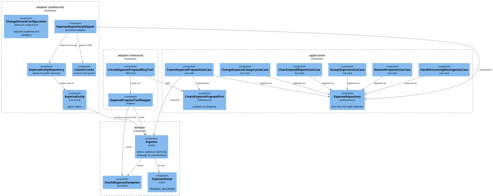

# Plan: One Expense Table, With a Status

**Affected Modules:** `ledger-service`
**Design:** [One Expense Table, With a Status](design.md)

## Components

The design named the surfaces; these are the classes that hold them. Boxes drawn in grey outline are the ones this
change deletes, kept in the diagram only so the arrows that end show where they ended.



| Type                            | Holds                                                                                                                              | Refuses                                                          |
|---------------------------------|--------------------------------------------------------------------------------------------------------------------------------------|------------------------------------------------------------------|
| `Expense`                       | `userId`, `categoryId`, `description`, `merchant`, `money`, `status`, `incomingMessageId` (optional), `createdAt`, `updatedAt`      | a `PENDING` entry with no `incomingMessageId`; everything it refuses today |
| `ExpenseEntity`                 | the same columns plus `status`, mapped to the single `expense` table                                                                | —                                                                |
| `RefiledEntryProjection`        | unchanged — the refile statement's `RETURNING` row, turned into an `ExpenseEntry` under the status the caller guarded on           | —                                                                |

`Expense`'s factories:

| Factory                                                                                       | Status     | Message id |
|-----------------------------------------------------------------------------------------------|------------|------------|
| `newProposal(userId, categoryId, description, merchant, money, incomingMessageId, now)`       | `PENDING`  | required   |
| `newExpense(userId, categoryId, description, merchant, money, now)`                            | `RECORDED` | none       |
| `stored(id, userId, categoryId, description, merchant, money, status, incomingMessageId, createdAt, updatedAt)` | as given   | optional   |

| Port                          | Methods                                                                                                                                                                                                                                         |
|-------------------------------|-------------------------------------------------------------------------------------------------------------------------------------------------------------------------------------------------------------------------------------------------|
| `ExpenseRepository`           | `create(Expense)`, `findSummariesByMessageReference(userId, reference)`, `accept(userId, reference, now)`, `discard(userId, reference)`, `acceptByIds(userId, ids, now)`, `findWithPendingProposals(userId, references)`, `countByMessageReference(userId, reference)`, `totalsByCurrency(userId, period)`, `findPage(userId, filter)`, `countMatching(userId, filter)`, `refile(userId, entryId, categoryId, status, now)` |
| `CreateExpenseProposalPort`   | `create(CreateExpenseProposalCommand): Expense`                                                                                                                                                                                                  |

| Exception                    | Raised by                                                                                          |
|------------------------------|------------------------------------------------------------------------------------------------------|
| `InvalidExpenseException`    | `Expense`, `CreateExpenseProposalCommand`, `ExpenseProposalToolMapper`, `ColumnLimits` — the one the MCP tool's "invalid request" arm catches |
| `EntityNotFoundException`    | `ExpenseRepositoryAdapter.create` on either foreign key                                             |
| `PersistenceFailedException` | any other read or write failure on `expense`                                                        |

Deleted: `ExpenseProposal`, `InvalidExpenseProposalException`, `ExpenseProposalRepository`,
`ExpenseProposalRepositoryAdapter`, `ExpenseProposalEntity`, `ExpenseProposalEntityRepository`.

## Step-by-Step Implementation Map (To-Do List)

### Stabilization

#### API Contract

- [x] ST01 · In `openapi/ledger-api.yaml`, replace `Expense.id`'s description `Unique within this row's
  `status`, and not across it.` with wording saying the id is unique across every entry of the caller's, whatever
  its status, and names that entry for its whole life
- [x] ST02 · In `openapi/paths/expense-category.yaml`, replace the `status` path parameter's description
  (`Which of the two tables the id names. An id is unique within its status and not across it, so the token is
  what says which entry is meant.`) with wording saying the segment guards the entry's current status: an id
  under the other status is not found. The parameter, its schema and its example are unchanged

#### Database

- [x] ST03 · Add migration `ledger-service/src/main/resources/db/migration/V009__merge_expense_proposal_into_expense.sql`,
  verbatim from the design:
  ```sql
  ALTER TABLE expense
      ADD COLUMN status VARCHAR(10) NOT NULL DEFAULT 'RECORDED'
          CHECK (status IN ('PENDING', 'RECORDED')),
      ADD CONSTRAINT ck_expense_pending_has_message
          CHECK (status <> 'PENDING' OR incoming_message_id IS NOT NULL);

  ALTER TABLE expense ALTER COLUMN status DROP DEFAULT;

  INSERT INTO expense (user_id, category_id, description, merchant, amount_minor_units, currency_code,
                       incoming_message_id, created_at, updated_at, status)
  SELECT user_id, category_id, description, merchant, amount_minor_units, currency_code,
         incoming_message_id, created_at, updated_at, 'PENDING'
  FROM expense_proposal;

  DROP TABLE expense_proposal;
  ```
- [x] ST04 · Rename `V009__publish_ledger_changes.sql` to `V010__publish_ledger_changes.sql` and drop
  `expense_proposal` from it — the `REPLICA IDENTITY FULL` line and the publication's table list — leaving:
  ```sql
  ALTER TABLE expense  REPLICA IDENTITY FULL;
  ALTER TABLE category REPLICA IDENTITY FULL;

  CREATE TABLE cdc_heartbeat (
      id        BOOLEAN     PRIMARY KEY DEFAULT TRUE CHECK (id),
      beat_at   TIMESTAMPTZ NOT NULL
  );

  INSERT INTO cdc_heartbeat (beat_at) VALUES (now());

  CREATE PUBLICATION finance_ledger_cdc
      FOR TABLE expense, category, cdc_heartbeat
      WITH (publish = 'insert, update, delete');
  ```
  Rename the file with `git mv` so the history follows it

#### Interface-First / Build Stabilization

How each item below is carried out — the stub's intent comment, the `TODO` on a changed signature, how a broken
test is disabled — is [`.claude/templates/stabilizing.md`](../../.claude/templates/stabilizing.md).

**Interface & Signature Sync**

- [x] ST05 · `Expense` gains `ExpenseStatus status` and a nullable `IncomingMessageId incomingMessageId`, with
  accessors `status()` and `incomingMessageId(): Optional<IncomingMessageId>`. Add
  `newProposal(userId, categoryId, description, merchant, money, incomingMessageId, now)` returning a `PENDING`
  entry, keep `newExpense(...)` answering `RECORDED` with no message id, and widen `stored(...)` to take the
  status and an `Optional<IncomingMessageId>`. Keep every existing validation line; add a `TODO` where the
  "a `PENDING` entry needs a message id" check belongs — RU01 and GU01 own it
- [x] ST06 · `ExpenseRepository` gains, with the javadoc each carries today on `ExpenseProposalRepository`:
  `List<ProposalSummary> findSummariesByMessageReference(long, IncomingMessageId)`,
  `int accept(long, IncomingMessageId, Instant)`, `int discard(long, IncomingMessageId)`,
  `List<IncomingMessageId> acceptByIds(long, ProposalIds, Instant)`,
  `Set<IncomingMessageId> findWithPendingProposals(long, Collection<IncomingMessageId>)`. `refile` gains an
  `ExpenseStatus status` parameter between `categoryId` and `now`. State on `countByMessageReference` and
  `totalsByCurrency` that they count `RECORDED` entries alone
- [x] ST07 · Stub the five new methods on `ExpenseRepositoryAdapter`, each with a short intent comment naming the
  statement it will run and its status predicate, for example:
  ```java
  @Override
  public int accept(long userId, IncomingMessageId reference, Instant now) {
      // updates the caller's PENDING entries under that message to RECORDED, answering how many rows matched
      return 0;
  }
  ```
  Change `refile`'s signature to take the status, keeping its existing body and adding a `TODO` where the status
  predicate belongs.

  In the same item, declare on `ExpenseEntityRepository` the five statements those methods call —
  `findSummariesByMessageReference`, `accept`, `discard`, `acceptByIds`, `findWithPendingProposals` — each with a
  `@Query` naming `expense` and answering the projection the adapter maps, and an intent comment naming the status
  predicate GI01 will put on it; add the `status` parameter to `refile`; and leave a `TODO` on `findPage`,
  `countMatching`, `totalsByCurrency` and `countByMessageReference` where the `UNION` comes out and the status
  predicate goes in. GI01 owns those rewrites, and no red step edits this interface
- [x] ST08 · `ExpenseEntity` gains a `String status` component; `fromDomain` writes the expense's status name and
  its message id where one is present, and `toDomain` reads both back through the widened factories
- [x] ST09 · Delete `ExpenseProposal`, `InvalidExpenseProposalException`, `ExpenseProposalRepository`,
  `ExpenseProposalRepositoryAdapter`, `ExpenseProposalEntity` and `ExpenseProposalEntityRepository` in one
  `git rm`, and fix every production call site the deletion breaks under the rows above
- [x] ST10 · `CreateExpenseProposalPort.create` answers an `Expense`; `CreateExpenseProposalCommand` raises
  `InvalidExpenseException` in place of `InvalidExpenseProposalException`; `CreateExpenseProposalUseCase` takes
  an `ExpenseRepository`, builds its entry through `Expense.newProposal(...)` and stores it with `create`
- [x] ST11 · `ResolveProposalsUseCase`, `AcceptExpensesUseCase`, `ClearEmptiedReportsUseCase`,
  `ChangeExpenseCategoryUseCase` and `HandleIncomingMessageUseCase` take one `ExpenseRepository` in place of the
  two repositories; `ChangeExpenseCategoryUseCase` passes `command.status()` to the single `refile`;
  `UseCaseConfiguration`'s five `@Bean` methods drop the `ExpenseProposalRepository` parameter. The constructor
  change breaks six test classes — `CreateExpenseProposalUseCaseTest`, `ResolveProposalsUseCaseTest`,
  `AcceptExpensesUseCaseTest`, `ClearEmptiedReportsUseCaseTest`, `ChangeExpenseCategoryUseCaseTest` and
  `HandleIncomingMessageUseCaseTest` — whose `@Mock ExpenseProposalRepository` field and its constructor argument
  collapse onto the one `ExpenseRepository` mock. Move each stub and verification onto that mock so the classes
  compile; what each case then asserts is its red step's work
- [x] ST12 · `ExpenseProposalToolMapper.toResponse` takes an `Expense`, and both its methods raise
  `InvalidExpenseException`; `CreateExpenseProposalMcpTool` catches `InvalidExpenseException` in its
  "invalid request" arm and holds an `Expense` as the stored entry. The tool's name, arguments, answer and every
  other failure arm are untouched
- [x] ST13 · `ColumnLimits` loses `validateExpenseProposalText`; `validateExpenseText` is the one entry point
- [x] ST14 · `ChangeStreamConfiguration.CAPTURED_TABLES` becomes `public.expense,public.category`;
  `ChangeEventPublisher`'s class javadoc names the two captured tables instead of three

**Shared Test Infrastructure**

- [x] ST15 · `ExpenseRowUtils.storedExpense` gains an `ExpenseStatus status` parameter and writes it into the row;
  add `expenseRowsFor(JdbcAggregateTemplate, long userId, ExpenseStatus status)` beside the existing
  `expenseRowsFor`, answering that person's rows under that status. Delete `ExpenseProposalRowUtils` — every
  operation it offered is one of these two with a status. The signature change breaks every existing caller of
  `storedExpense`; besides the classes ST16 retargets, `WebSessionSystemTest`, `SummarizeSpendingReplySystemTest`,
  `ResolveUnknownProposalsSystemTest`, `ChangeStreamMetersSystemTest` and `BroadcastLedgerChangesSystemTest` each
  gain a `RECORDED` argument and nothing else
- [x] ST16 · Retarget every test call site of `ExpenseProposalRowUtils` onto `ExpenseRowUtils`, seeding and
  reading back under `PENDING` so each assertion keeps the meaning it has today:
  `AcceptExpensesSystemTest`, `BrowseExpensesSystemTest`, `ChangeExpenseCategorySystemTest`,
  `CreateExpenseProposalMcpToolSystemTest`, `McpAuthenticationSystemTest`, `ReceiveTelegramMessageSystemTest`,
  `HandleIncomingMessageFailureSystemTest`, `ResolveProposalsSystemTest` and
  `ChangeStreamReaderTest`. Where such a test also names `ExpenseProposalEntity` as the row type, it now names
  `ExpenseEntity`
- [x] ST17 · Disable, by the mechanism [Testing](../../ledger-service/docs/conventions/testing.md) gives, every
  test the deletions leave owed a rework, each `@Disabled` naming the step that owns it:
  `ExpenseProposalTest` (RU01), `ExpenseProposalRepositoryAdapterTest` (RI01), `ColumnLimitsSchemaTest`'s
  `ProposalDescription`, `ProposalMerchant` and `ProposalCurrencyCode` cases (RI03), and
  `AcceptedProposalChangeStreamSystemTest` (RS06). `ChangeEventPublisherTest` is not disabled: it reads
  `source.table` off a hand-written payload, so its `expense_proposal` cases still pass, and RU10 repoints them
- [x] ST18 · Confirm `bot.finance.architecture.CleanArchitectureTest` still passes, and that the module's
  pre-existing suite stands where the baseline left it — the skipped count the baseline plus exactly what ST17
  disabled

### Red Phase

#### TDD Unit Red Phase

- [x] RU01 · `Expense` · test: `ExpenseTest` · covers: `newProposal()`, `newExpense()`, `stored()` · scenarios: A13
    - `newProposal()`:
        - given: a user, a category, a description, a merchant, money and an incoming message id
          when: newProposal() is called with an instant
          then: the entry is unstored, carries every field, its status is PENDING, its message id reads back, and
          both timestamps are that instant
        - given: every other field valid and no incoming message id
          when: newProposal() is called
          then: throws InvalidExpenseException
    - `newExpense()`:
        - given: a user, a category, a description, a merchant and money
          when: newExpense() is called
          then: the entry's status is RECORDED and its message id is empty
    - `stored()`:
        - given: a database id, PENDING and an incoming message id
          when: stored() is called
          then: the entry carries the id, the status and the message id, with its timestamps unchanged
        - given: a database id, PENDING and no incoming message id
          when: stored() is called
          then: throws InvalidExpenseException
        - given: a database id, RECORDED and no incoming message id
          when: stored() is called
          then: the entry is returned with an empty message id
    - update: `whenAllFieldsAreGiven_thenReturnsExpenseCarryingThemUnstoredAndStampedWithThatInstant()` — assert
      the new `status()` is RECORDED and `incomingMessageId()` is empty alongside the fields it already checks
    - update: `whenDatabaseIdAndEveryOtherFieldAreGiven_thenReturnsExpenseCarryingAllWithTimestampsUnchanged()` —
      pass the status and the optional message id the widened `stored()` now takes, and assert both read back
    - update: `whenDatabaseIdAndBlankDescriptionAreGiven_thenThrowsInvalidExpenseException()`,
      `whenDatabaseIdAndAbsentCreatedAtAreGiven_thenThrowsInvalidExpenseException()` and
      `whenDatabaseIdAndAbsentUpdatedAtAreGiven_thenThrowsInvalidExpenseException()` — each calls the widened
      `stored(...)` with `RECORDED` and an empty message id; their assertions are unchanged
    - update: `ExpenseProposalTest` — delete the class; its `NewExpenseProposalFactory` and `StoredFactory` cases
      are the PENDING cases written above, and nothing it names still exists
- [x] RU02 · `CreateExpenseProposalUseCase` · test: `CreateExpenseProposalUseCaseTest` · covers: `create()` · scenarios: A1
    - `create()`:
        - given: a stored user, a resolved grouping and category, and a command carrying a message id
          when: create() is called
          then: the entry handed to the expense store is PENDING and carries that message id
    - update: `whenGroupingAndCategoryAreAnswered_thenProposalCarriesThatCategorysId()` — the captured argument is
      an `Expense`, and the store is the `ExpenseRepository` mock
    - update: `whenProposalRepositoryStoresTheProposal_thenItIsReturnedToTheCaller()` — stub and assert on an
      `Expense` answered by `ExpenseRepository.create`
    - update: `whenCommandIsAbsent_thenThrowsInvalidExpenseProposalExceptionAndRepositoriesAreUntouched()` —
      assert `InvalidExpenseException`, and verify the one repository is untouched
    - update: `whenProposalRepositoryRaisesPersistenceFailedException_thenExceptionPropagatesUnchanged()` — stub
      `ExpenseRepository.create` to raise it
    - update: `whenCommandCarriesMessageReference_thenProposalRepositoryReceivesProposalWithThatReference()` —
      read the reference off the captured `Expense`'s `incomingMessageId()`
    - update: `whenNoUserExistsForExternalId_thenThrowsEntityNotFoundExceptionNamingUser()`,
      `whenUserRepositoryRaisesPersistenceFailedException_thenExceptionPropagatesUnchanged()`,
      `whenGroupingRepositoryAnswersNothing_thenThrowsInvalidGroupingExceptionNamingTheGrouping()`,
      `whenCategoryRepositoryAnswersNothing_thenThrowsInvalidCategoryExceptionNamingCategoryAndGrouping()`,
      `whenGroupingRepositoryRaisesPersistenceFailedException_thenExceptionPropagatesUnchanged()`,
      `whenCategoryRepositoryRaisesPersistenceFailedException_thenExceptionPropagatesUnchanged()` — each verifies
      that no proposal was stored; that verification is now on the single `ExpenseRepository` mock, and the
      outcome each asserts is unchanged
- [x] RU03 · `ResolveProposalsUseCase` · test: `ResolveProposalsUseCaseTest` · covers: `resolve()` · scenarios: A3, A4, A5, A7, A15, A16
    - `resolve()`:
        - given: the store answers two rows matched for an ACCEPT
          when: resolve() is called
          then: `accept` is called on the expense store with the caller's id, the message and the instant, and the
          acknowledgement is ACCEPTED with two
        - given: the store matches nothing for an ACCEPT and answers three already-recorded entries under the
          message
          when: resolve() is called
          then: the acknowledgement is ALREADY_ACCEPTED with three
    - update: `whenAcceptCommandResolvesTwo_thenAcceptCalledAndAcknowledgeReceivesAcceptedAcknowledgement()` —
      the mock is `ExpenseRepository`, not `ExpenseProposalRepository`
    - update: `whenDiscardCommandResolvesThree_thenAcknowledgeReceivesDiscardedAndAcceptAndExpenseRepositoryUntouched()` —
      one mock now serves both calls, so assert that `accept` was never called rather than that a second
      repository was untouched
    - update: `whenAcceptResolvesNothingAndExpensesAlreadyStored_thenAcknowledgeReceivesAlreadyAccepted()`,
      `whenDiscardResolvesNothingAndExpensesAlreadyStored_thenAcknowledgeReceivesAlreadyAccepted()`,
      `whenResolutionAndCountBothZero_thenAcknowledgeReceivesNothingToResolve()` — stub the resolution and the
      already-recorded count on the same mock
    - update: `whenNoUserStoredForExternalId_thenAcknowledgeReceivesNothingToResolveAndRepositoriesUntouched()` —
      verify the single expense store is never touched (A16 stands, on one mock)
    - update: `whenAcceptThrowsPersistenceFailedException_thenExceptionPropagatesAndAcknowledgeNeverCalled()` —
      raise from `ExpenseRepository.accept` (A15 stands)
    - update: `whenCommandIsNull_thenThrowsInvalidIncomingMessageExceptionAndPortsUntouched()` — three ports are
      left, not four; reword the `@DisplayName` accordingly and verify the one `ExpenseRepository` mock
    - update: `whenAcknowledgeThrowsMessageDeliveryFailedException_thenExceptionPropagates()` — the discard it
      stubs is on `ExpenseRepository`
- [x] RU04 · `AcceptExpensesUseCase` · test: `AcceptExpensesUseCaseTest` · covers: `accept()` · scenarios: A9
    - update: `whenMoveAnswersOneIdPerProposalForTwoPosted_thenAcceptedTwoAndMissingZero()`,
      `whenMoveAnswersNothingForTwoPosted_thenAcceptedZeroMissingTwoAndClearingNeverDispatched()`,
      `whenMoveAnswersOneIdForThreePosted_thenAcceptedPlusMissingEqualsThree()`,
      `whenNoUserRowForCallersExternalId_thenEntityNotFoundExceptionThrownAndNothingMovedOrDispatched()`,
      `whenRepositoryThrowsPersistenceFailedException_thenExceptionPropagatesAndNothingDispatched()`,
      `whenCommandIsNull_thenInvalidExpenseAcceptanceExceptionThrownAndNoPortTouched()` — every `acceptByIds`
      stub and verification moves onto the `ExpenseRepository` mock; the counting, the clearing dispatch and the
      assertions are unchanged
- [x] RU05 · `ChangeExpenseCategoryUseCase` · test: `ChangeExpenseCategoryUseCaseTest` · covers: `change()` · scenarios: A10, A11
    - `change()`:
        - given: a command naming RECORDED and a store that answers a refiled entry
          when: change() is called
          then: `refile` is called once with RECORDED and the answered entry comes back
        - given: a command naming PENDING and a store that answers a refiled entry
          when: change() is called
          then: `refile` is called once with PENDING and the answered entry comes back
    - update: `whenCalledWithRecordedStatus_thenExpenseRepositoryIsRefiledAndProposalRepositoryUntouched()` and
      `whenCalledWithPendingStatus_thenProposalRepositoryIsRefiledAndExpenseRepositoryUntouched()` — replace both
      with the two scenarios above: there is one store, so what the test proves is the status it is called with,
      not which of two was chosen
    - update: `whenRefileAnswersNothing_thenThrowsExpenseEntryNotFoundExceptionNamingEntryRatherThanCaller()`,
      `whenCategoryReadThrowsPersistenceFailedException_thenPropagatesAndNeitherRefileAttempted()`,
      `whenRefileThrowsPersistenceFailedException_thenPropagates()` — stub and verify the one `refile`, now
      taking a status
    - update: `whenCategoryReadDoesNotAdmitCategoryId_thenThrowsInvalidExpenseCategoryChangeExceptionNamingCategoryId()`,
      `whenNoUserRowStoredForExternalId_thenEntityNotFoundExceptionPropagatesAndNothingElseTouched()`,
      `whenCommandIsAbsent_thenThrowsInvalidExpenseCategoryChangeExceptionAndNoPortTouched()` — each verifies two
      repositories untouched; that verification collapses onto the one `ExpenseRepository` mock
- [x] RU06 · `ClearEmptiedReportsUseCase` · test: `ClearEmptiedReportsUseCaseTest` · covers: `clear()` · scenarios: A9
    - update: `whenMessageEmptiedWithOneReport_thenButtonsComeOffThatReportAndNothingElseSent()`,
      `whenMessageStillHasPendingProposal_thenNothingIsSentForIt()`,
      `whenOneOfTwoMessagesEmptiedAndOtherPending_thenOnlyEmptiedOnesReportCleared()`,
      `whenEmptiedMessageHasTwoReports_thenButtonsComeOffBothInRecordedOrder()`,
      `whenEmptiedMessageHasNoReportRecorded_thenNothingSentAndRemainingMessagesStillCleared()`,
      `whenEmptiedMessageHasNoReportRecorded_thenItIsNotReportedAsCleared()`,
      `whenCountsReadThrowsPersistenceFailedException_thenNothingSentAndNothingPropagates()`,
      `whenReportLookupFailsForFirstMessage_thenSecondIsStillClearedAndNothingPropagates()`,
      `whenFirstClearingRefused_thenSecondStillAttemptedAndNothingPropagates()`,
      `whenCommandCarriesNoMessageIds_thenNeitherRepositoryReadAndNothingSent()`,
      `whenCommandIsAbsent_thenThrowsInvalidProposalReportExceptionAndNoPortIsRead()` — every
      `findWithPendingProposals` stub and verification moves onto the `ExpenseRepository` mock; the outcomes are
      unchanged
- [x] RU07 · `HandleIncomingMessageUseCase` · test: `HandleIncomingMessageUseCaseTest` · covers: `handle()` · scenarios: A2
    - update: `whenHandleIsCalled_thenTheDerivedReferenceReachesBothReadBacks()`,
      `whenExtractionSucceedsWithSummaries_thenDeliverReceivesRecordedReport()`,
      `whenExtractionSucceedsWithNoSummaries_thenDeliverReceivesNothingIdentifiedReport()`,
      `whenExtractionFailsWithSummaries_thenDeliverReceivesPartialReport()`,
      `whenExtractionFailsWithNoSummaries_thenDeliverReceivesFailedReport()`,
      `whenFindSummariesThrowsPersistenceFailedException_thenExceptionPropagatesAndDeliverUntouched()`,
      `whenCompletedExtractionProducedAProposalAndASummary_thenReportIsRecordedAndCarriesBoth()`,
      `whenNoProposalAndOneSummaryExtractionCompleted_thenOutcomeIsAnswered()`,
      `whenStoredUsersIdDiffersFromExternalId_thenBothReadsCarryThatStoredId()` — the summaries read and the
      totals read are both stubbed on the one `ExpenseRepository` mock; where a test asserted that two different
      repositories each received the stored user id or the reference, assert the two calls on that one mock
    - update: `whenCommandIsNull_thenThrowsInvalidIncomingMessageExceptionAndNoPortIsCalled()`,
      `whenInitializeThrowsPersistenceFailedException_thenExceptionPropagatesAndRemainingPortsUntouched()`,
      `whenFindNamesWithCategoriesThrowsPersistenceFailedException_thenExceptionPropagates()`,
      `whenDeliverThrowsMessageDeliveryFailedException_thenExceptionPropagates()` — the untouched-repository
      verifications collapse onto the one `ExpenseRepository` mock
- [x] RU08 · `ExpenseProposalToolMapper` · test: `ExpenseProposalToolMapperTest` · covers: `toCommand()`, `toResponse()` · scenarios: A1
    - update: `whenStoredProposalCarriesMerchantAndCategoryName_thenReturnsTheResponseTheyMapOnto()` and
      `whenStoredProposalHasNoMerchant_thenResponseMerchantIsNull()` — build the stored entry with
      `Expense.stored(...)` under PENDING with a message id, and assert the response is the one it maps onto,
      unchanged field for field
    - update: `whenGroupingIsNullOrBlank_thenThrowsInvalidExpenseProposalException()`,
      `whenAmountIsAbsent_thenThrowsInvalidExpenseProposalException()`,
      `whenAmountIsAFormNeverOffered_thenThrowsInvalidExpenseProposalException()`,
      `whenRequestIsAbsent_thenThrowsInvalidExpenseProposalException()` — the expected exception is
      `InvalidExpenseException`; rename each method and its `@DisplayName` to say so
- [x] RU09 · `CreateExpenseProposalCommand` · test: `CreateExpenseProposalCommandTest` · covers: the compact constructor · scenarios: A1
    - update: `whenCategoryNameIsAbsentEmptyOrWhitespace_thenThrowsInvalidExpenseProposalException()`,
      `whenGroupingNameIsAbsentEmptyOrWhitespace_thenThrowsInvalidExpenseProposalException()`,
      `whenDescriptionIsAbsentEmptyOrWhitespace_thenThrowsInvalidExpenseProposalException()`,
      `whenMerchantOptionalIsAbsent_thenThrowsInvalidExpenseProposalException()`,
      `whenMoneyIsAbsent_thenThrowsInvalidExpenseProposalException()`,
      `whenMessageReferenceIsAbsent_thenThrowsInvalidExpenseProposalException()` — the expected exception is
      `InvalidExpenseException`; rename each method and its `@DisplayName` to say so
- [x] RU10 · `ChangeEventPublisher` · test: `ChangeEventPublisherTest` · covers: `publish()` · scenarios: A17
    - update: `whenExpenseProposalInsertIsPublished_thenEnrichmentBlockCarriesAfterSideAlone()` — its payload
      names `"table":"expense_proposal"`, a table the engine no longer reads; repoint the payload at `expense` and
      rename the method and its `@DisplayName` to say so. If that makes it an exact duplicate of
      `whenExpenseUpdateIsPublished_thenOneEntryWrittenEnrichedWithBothCategories()`, keep the insert-shaped one
      and delete neither — they differ in operation
    - update: `whenWriterRefuses_thenPublishAnswersNotPublishedAndPublishFailureCounted()` and
      `whenEventPublishes_thenPublishedCounterTaggedAndLagGaugeSetFromSourceTsMs()` — both carry the same
      `expense_proposal` payload; repoint it at `expense`, and in the second the expectation
      `meters.countPublished("expense_proposal", "c")` becomes `meters.countPublished("expense", "c")`
- [x] RU11 · `Expense` · test: `ExpenseTest` · covers: `stored()` · scenarios: A13
    - Added after the plan first reached 63/63, from B5 — the refactor pass found that the `incomingMessageId`
      argument has no null guard where every other reference argument has one, so a bare `null` in place of an
      `Optional` leaves the constructor through a `NullPointerException` rather than the exception the type
      documents. `merchant`'s guard on the line above is the shape the missing one takes.
    - `stored()`:
        - given: a database id, `PENDING`, and `null` in place of the incoming message id `Optional`
          when: stored() is called
          then: throws `InvalidExpenseException` saying the incoming message id must be present, not a
          `NullPointerException`
        - given: a database id, `RECORDED`, and `null` in place of the incoming message id `Optional`
          when: stored() is called
          then: throws `InvalidExpenseException` the same way — the status short-circuit must not let a null
          through to the field assignment

#### TDD Integration Red Phase

- [x] RI01 · `ExpenseRepositoryAdapter` · test: `ExpenseRepositoryAdapterTest` · covers: `create()`,
  `findSummariesByMessageReference()`, `accept()`, `discard()`, `acceptByIds()`, `findWithPendingProposals()`,
  `countByMessageReference()`, `totalsByCurrency()`, `findPage()`, `countMatching()`, `refile()` ·
  scenarios: A2, A3, A4, A8, A9, A10, A11, A12, A13
    - `create()`:
        - given: a stored user and category and a PENDING entry carrying a message id
          when: create() is called
          then: one `expense` row is written with `status = 'PENDING'` and that message id, and the answer carries
          the generated id
        - given: a PENDING entry whose message id is absent at the column level
          when: the row is written
          then: the database refuses it under `ck_expense_pending_has_message`
    - `findSummariesByMessageReference()`:
        - given: two PENDING entries and one RECORDED entry under the same person and message
          when: findSummariesByMessageReference() is called
          then: only the two PENDING ones come back, oldest first, with their category and grouping names
    - `accept()`:
        - given: two PENDING entries under a message and a third under another
          when: accept() is called for the first message
          then: two rows are answered, those two rows are `RECORDED` under their original ids and `created_at`,
          and the third is untouched
        - given: entries under the message that are already RECORDED
          when: accept() is called
          then: zero is answered and nothing changes
        - given: two people sharing a message id value
          when: accept() is called for one
          then: one is answered and the other person's row stays PENDING
        - given: an instant carrying nanosecond precision
          when: accept() is called
          then: the stored `updated_at` is truncated to microseconds
    - `discard()`:
        - given: two PENDING entries under a message and one RECORDED entry under it
          when: discard() is called
          then: two is answered, no PENDING entry remains under the message, and the RECORDED one still stands
    - `acceptByIds()`:
        - given: two PENDING entries reported on one message and one RECORDED entry
          when: acceptByIds() is called with all three ids
          then: the message comes back twice, the two entries are `RECORDED` under their original ids, and the
          RECORDED one is unchanged
        - given: an id naming another person's PENDING entry
          when: acceptByIds() is called
          then: nothing is answered and their row stays PENDING
    - `findWithPendingProposals()`:
        - given: one of two messages still holding a PENDING entry, the other holding only RECORDED ones
          when: findWithPendingProposals() is called with both
          then: only the first is answered
    - `countByMessageReference()`:
        - given: one RECORDED and one PENDING entry under the same message
          when: countByMessageReference() is called
          then: one is answered
    - `totalsByCurrency()`:
        - given: a PENDING and a RECORDED entry inside the period
          when: totalsByCurrency() is called
          then: the totals count the RECORDED one alone
    - `findPage()`:
        - given: PENDING and RECORDED entries for the person
          when: findPage() is called with no status, then with each status
          then: the status-less call answers both, each with its own `status`, ordered `created_at DESC, status,
          id DESC`; each filtered call answers its own kind
    - `countMatching()`:
        - given: the same rows
          when: countMatching() is called with no status and with each status
          then: the answers are the total and each kind's count
    - `refile()`:
        - given: a PENDING entry
          when: refile() is called with RECORDED
          then: nothing is answered and the row keeps its category and its status
        - given: the same entry
          when: refile() is called with PENDING and another category
          then: the answered entry carries the new category, and the stored row carries it and is still PENDING
    - update: `whenOnlyProposalRowExistsInsidePeriod_thenReturnsEmptyList()` — seed the PENDING entry through
      `ExpenseRowUtils` and keep the assertion: a PENDING row inside the period contributes no total
    - update: `whenCalledWithUnnarrowedFilter_thenBothKindsComeBackNewestFirstEachWithItsStatus()`,
      `whenCalledWithEachStatus_thenOnlyThatKindComesBackEachTime()`,
      `whenCalledWithDateRange_thenOnlyRowsInsideComeBackWithLastDayIncluded()`,
      `whenSecondPageAskedForAtOffsetOfOnePage_thenItContinuesTheFirstRepeatingNoRow()`,
      `whenCalledWithOffsetBeyondStoredRows_thenEmptyListComesBackRatherThanLastPageAgain()`,
      `whenCalledWithCategoryIdBelongingToAnotherUser_thenEmptyListComesBack()`,
      `whenTwoRowsShareCreatedAtOneInEachTable_thenOrderIsTheSameOnEveryCall()`,
      `whenCalledWithUnnarrowedFilter_thenAnswerIsEveryRowAcrossBothTables()`,
      `whenCalledWithStatusPending_thenOnlyProposalsAreCounted()`,
      `whenFilterCarriesLimitAndOffset_thenAnswerIgnoresThem()` — seed both kinds through `ExpenseRowUtils` with
      a status, and reword the names and display names that say "across both tables" or "in each table" to say
      "across both statuses" and "under each status"; the expected rows and order are unchanged
    - update: `whenIdNamesCallersPendingProposal_thenAnswerIsEmptyAndProposalRowUntouched()` — call `refile` with
      RECORDED against a PENDING entry's id and assert the row is untouched, which is now what the status
      argument guards
    - update: `whenCalledWithAnotherCategory_thenAnswersEntryWithNewCategoryAndStoredRowCarriesIt()`,
      `whenCalledForExpenseCreatedEarlierDay_thenCreatedAtUntouchedAndUpdatedAtCarriesInstantGiven()`,
      `whenCalledWithSameCategory_thenAnswerCarriesRowAndOnlyUpdatedAtMoved()`,
      `whenCalledForAnotherPersonsExpense_thenAnswerIsEmptyAndTheirRowKeepsOriginalCategory()`,
      `whenMerchantAbsent_thenAnsweredEntryCarriesNoMerchantAndNothingThrows()`,
      `whenInstantCarriesSubMicrosecondPrecision_thenStoredUpdatedAtIsTruncatedNotRounded()` — pass RECORDED to
      the widened `refile`
    - update: `whenCreateHitsNonConstraintDatabaseFailure_thenThrowsPersistenceFailedExceptionNotEntityNotFound()`,
      `whenCreateHitsConstraintViolationNamingNeitherForeignKey_thenThrowsPersistenceFailedException()`,
      `whenCountByMessageReferenceHitsDatabaseFailure_thenThrowsPersistenceFailedExceptionWrappingIt()`,
      `whenTotalsByCurrencyHitsDatabaseFailure_thenThrowsPersistenceFailedExceptionWrappingIt()`,
      `whenFindPageHitsDatabaseFailure_thenThrowsPersistenceFailedExceptionWrappingIt()`,
      `whenCountMatchingHitsDatabaseFailure_thenThrowsPersistenceFailedExceptionWrappingIt()`,
      `whenRefileHitsDatabaseFailure_thenThrowsPersistenceFailedExceptionWrappingIt()` — keep as they stand, and
      add the same mocked-store failure case for each folded-in operation (`findSummariesByMessageReference`,
      `accept`, `discard`, `acceptByIds`, `findWithPendingProposals`) plus the empty-collection case that runs no
      statement, carried over from `ExpenseProposalRepositoryAdapterTest`'s `WithAMockedStore` group
    - update: `ExpenseProposalRepositoryAdapterTest` — delete the class; the operations it covered are the ones
      written above, against the one adapter, and its `WithAMockedStore` cases are carried over by the bullet
      above
- [x] RI02 · `ExpenseRepositoryAdapter` · test: `ExpenseRepositoryAdapterConcurrencyTest` · covers: `accept()` · scenarios: A6
    - `accept()`:
        - given: three PENDING entries under one message, and two threads on separate connections
          when: both call accept() for that message at the same time
          then: one call answers three and the other zero, and the three rows are RECORDED exactly once
    - The class declares committed state, so it follows `UserRepositoryAdapterConcurrencyTest`'s arrangement for
      running two connections against the containerized database rather than the rolled-back slice
- [x] RI03 · `ColumnLimits` · test: `ColumnLimitsSchemaTest` · covers: `information_schema.tables`,
  `information_schema.columns`, `ck_expense_pending_has_message` · scenarios: A14
    - `information_schema.tables`, `information_schema.columns`, `ck_expense_pending_has_message`:
        - given: the migrated database
          when: `information_schema.tables` is read for `expense_proposal`
          then: no such table exists
        - given: the migrated database
          when: `expense`'s `status` column is read
          then: it is `NOT NULL`, has no default, and its check admits `PENDING` and `RECORDED` alone
        - given: the migrated database
          when: a `PENDING` row is inserted with a null `incoming_message_id`
          then: the database refuses it under `ck_expense_pending_has_message`
    - update: `ProposalDescription`, `ProposalMerchant` and `ProposalCurrencyCode` — delete all three nested
      classes; `expense_proposal` has no columns left to measure, and the `expense` widths they duplicated are
      already asserted by `Description`, `Merchant` and `CurrencyCode`
- [x] RI04 · `CreateExpenseProposalMcpTool` · test: `CreateExpenseProposalMcpToolTest` · covers:
  `tools/call create_expense_proposal` · mocks: `CreateExpenseProposalPort` · scenarios: A1
    - Happy Path:
        - given: the mocked port answers a stored PENDING `Expense`
          when: the tool is called with a valid payload
          then: the answer carries that entry's id, category name, description, merchant, amount, currency and
          creation instant, exactly as today
    - Error Mapping:
        - given: the mocked port raises `InvalidExpenseException`
          when: the tool is called
          then: the result is a tool error whose text begins "invalid request:" and carries the exception's message
    - update: `whenCreateExpenseProposalIsCalled_thenResultCarriesStoredProposal()` and the class's stored-entry
      helper — the port answers an `Expense` built through `Expense.stored(...)` under PENDING
    - update: `whenPortThrowsInvalidExpenseProposalException_thenToolErrorNamesFieldAtFault()` — the port raises
      `InvalidExpenseException`; rename the method and its `@DisplayName` to say so
    - update: `whenPortThrowsPersistenceFailedException_thenToolErrorSaysNotStoredNamingNoInternals()` — the
      seeded failure message names `pk_expense_proposal` on table `expense_proposal`, and the assertion is that
      no internal name leaks; change both to `pk_expense` and `expense` so the case still names a real constraint
- [x] RI05 · `ChangeStreamReader` · test: `ChangeStreamReaderTest` · covers: `start()` · scenarios: A4
    - `start()`:
        - given: capture is streaming and a PENDING entry exists
          when: the entry is discarded
          then: one `expense` `d` entry carries the whole row, and no other `expense` entry shares its transaction
    - update: `whenPendingProposalDiscardedAsLoneDelete_thenOneDeleteEventCarriesWholeRowAndNoExpenseSharesTxn()` —
      the delete lands on `expense`, so `awaitDeleteFor("expense_proposal", …)` becomes
      `awaitDeleteFor("expense", …)`, and the "nothing else in that transaction" assertion excludes the delete's
      own entry rather than looking at a second table
- [x] RI06 · `V009__merge_expense_proposal_into_expense.sql` · test: `ExpenseProposalMergeMigrationTest` ·
  covers: the migration's data move · scenarios: A14
    - the migration's data move:
        - given: a Postgres container of the class's own, migrated to `V008`, holding two recorded expenses and
          three proposals of two people's, one proposal carrying no merchant
          when: the remaining migrations run
          then: each former expense is a `RECORDED` row under its own id with every column unchanged, each former
          proposal is a `PENDING` row carrying its own columns and its message id, and `expense_proposal` no
          longer exists
    - The class declares its own container and its own Flyway target on the pattern
      `CdcAdapterTestOnItsOwnDatabase` sets, so it neither joins nor disturbs the singleton every other
      persistence test shares. It carries `@Testcontainers(disabledWithoutDocker = true)` directly, as a class
      starting a container of its own must
    - Being new shared-shaped infrastructure that only proves itself at runtime, its own boot is what the test
      asserts on; no throwaway context test is owed beside it

#### TDD System Test Red Phase

Every class in this section already exists and already enters the application the way production does. What each
step owns is the rework the merge forces on it, so each is written as `update:` bullets alone — a scenario block
beside them would be the same behaviour asked for twice, and a step agent would write it twice.

- [x] RS01 · `ResolveProposalsSystemTest` · covers: `TelegramUpdateListener.onUpdates()` · scenarios: A3, A5, A7
    - update: `whenRunningPollLoopPicksUpAcceptCallbackQuery_thenProposalsAreAcceptedAndAcknowledged()` — the
      three seeded entries are PENDING `expense` rows; assert they come back RECORDED under those same ids and
      with their `created_at` untouched, the tap answered with three and the buttons off, and read what is left
      pending through `ExpenseRowUtils.expenseRowsFor(..., PENDING)` in place of the proposal-row read
- [x] RS02 · `AcceptExpensesSystemTest` · covers: `POST /api/v1/expenses/acceptances` · scenarios: A9
    - update: `whenBothIdsArePostedWithTheSessionCookieAndCsrfToken_then200BothRecordedAndButtonsComeOff()` — seed
      a RECORDED entry beside the two pending ones and post all three ids; assert `accepted: 2` and `missing: 1`,
      that the two come back RECORDED under the ids that were posted, and that the emptied report loses its
      buttons as it does today
    - update: `whenAListOfIdsIsPostedWithNoSessionCookie_then401AndNothingIsMoved()` and
      `whenAListOfIdsIsPostedWithAValidSessionAndNoCsrfToken_then403AndNothingIsMoved()` — "nothing is moved" is
      now "the entries are still PENDING", read back through `ExpenseRowUtils.expenseRowsFor(..., PENDING)`
- [x] RS03 · `BrowseExpensesSystemTest` · covers: `GET /api/v1/expenses` · scenarios: A8
    - update: `whenTheListIsRequestedWithTheSessionCookieAndNoFilter_then200WithAPageOfBothKindsNewestFirst()` —
      the day-total assertions already prove that a pending entry counts towards nothing and stay exactly as they
      are; only the pending row's seeding moves to `ExpenseRowUtils` under PENDING, and the ordering and status
      assertions are unchanged
- [x] RS04 · `ChangeExpenseCategorySystemTest` · covers: `PATCH /api/v1/expenses/{status}/{id}` · scenarios: A10, A11
    - update: `whenARecordedExpenseAndAPendingProposalAreEachPatchedToTheSecondCategory_thenBothRefileCorrectly()` —
      assert the refiled pending entry is still PENDING afterwards and keeps its id
    - update: `whenAnIdNamesNoEntryOfTheirsUnderThatStatus_then404NamingTheEntry()` — the id now exists, under the
      other status; that is the case the `{status}` segment guards, so assert 404 and that the entry is unchanged
    - update: `whenTheRefiledPendingProposalIsAccepted_thenTheRecordedExpenseCarriesTheNewCategory()` — read the
      row back through `expenseRowsFor(..., RECORDED)` and assert its id is the one that was refiled; the plain
      `hasSize(1)` it asserts today holds for a reason the merge removes
    - update: `whenNoSessionCookie_then401AndTheRowStillCarriesItsOriginalCategory()` and
      `whenNoCsrfToken_then403AndTheRowStillCarriesItsOriginalCategory()` — seed and read the row through
      `ExpenseRowUtils` with its status
- [x] RS05 · `CreateExpenseProposalMcpToolSystemTest` · covers: `POST /mcp` · scenarios: A1
    - update: `whenToolCallNamesCategoryUnderItsGrouping_thenProposalIsStoredAndReturned()` — read the row back as
      an `ExpenseEntity` and assert `status = 'PENDING'` and the message id alongside the fields it already
      checks, with the answer's id being that row's
    - update: `whenToolCallNamesCategoryUnderTheWrongGrouping_thenNothingIsStoredAndMismatchIsNamed()` and
      `whenToolCallHasNoGrouping_thenNothingIsStoredAndMissingGroupingIsNamed()` — "nothing is stored" is now no
      PENDING `expense` row for that person
- [x] RS06 · `AcceptedProposalChangeStreamSystemTest` · covers: `POST /api/v1/expenses/acceptances` · scenarios: A17
    - update: `whenAPendingProposalIsAccepted_thenTheDeleteAndTheInsertShareOneTransactionId()` — there is no
      delete and no second insert to share a transaction with. Rewrite it, and its name and `@DisplayName`, to
      assert that one `expense` entry reaches the stream: a `u` whose `before.status` is PENDING, whose
      `after.status` is RECORDED, and which carries the same id on both sides. The `deleteEntry` helper reading
      `expense_proposal` goes with it
    - update: `whenAnIdNamesNoProposalOfTheirs_thenEndpointAnswersAsTodayAndNothingReachesTheStream()` — the
      endpoint still answers `accepted: 0` and `missing: 1`; assert that no `expense` entry carries that id, in
      place of the `expense_proposal` delete lookup

### Green Phase

#### TDD Unit Green Phase

- [x] GU01 · `Expense` · test: `ExpenseTest`
- [x] GU02 · `CreateExpenseProposalCommand` · test: `CreateExpenseProposalCommandTest`
- [x] GU03 · `ExpenseProposalToolMapper` · test: `ExpenseProposalToolMapperTest` · after: GU01, GU02
- [x] GU04 · `CreateExpenseProposalUseCase` · test: `CreateExpenseProposalUseCaseTest` · after: GU01, GU02
- [x] GU05 · `ResolveProposalsUseCase` · test: `ResolveProposalsUseCaseTest`
- [x] GU06 · `AcceptExpensesUseCase` · test: `AcceptExpensesUseCaseTest`
- [x] GU07 · `ChangeExpenseCategoryUseCase` · test: `ChangeExpenseCategoryUseCaseTest`
- [x] GU08 · `ClearEmptiedReportsUseCase` · test: `ClearEmptiedReportsUseCaseTest`
- [x] GU09 · `HandleIncomingMessageUseCase` · test: `HandleIncomingMessageUseCaseTest`
- [x] GU10 · `ChangeEventPublisher` · test: `ChangeEventPublisherTest`
- [x] GU11 · `Expense` · test: `ExpenseTest`

#### TDD Integration Green Phase

- [x] GI01 · `ExpenseRepositoryAdapter` · test: `ExpenseRepositoryAdapterTest` · after: GU01
    - Also re-enable `WebSessionSystemTest`'s `whenASignedInPersonBrowsesAndRefiles_...`, disabled under B1 because
      `findPage` reaches the dropped table and owed a rework by no step
- [x] GI02 · `ExpenseRepositoryAdapter` · test: `ExpenseRepositoryAdapterConcurrencyTest` · after: GI01
- [x] GI03 · `ColumnLimits` · test: `ColumnLimitsSchemaTest`
- [x] GI04 · `CreateExpenseProposalMcpTool` · test: `CreateExpenseProposalMcpToolTest` · covers:
  `tools/call create_expense_proposal` · mocks: `CreateExpenseProposalPort` · after: GU01, GU03
- [x] GI05 · `ChangeStreamReader` · test: `ChangeStreamReaderTest` · after: GI01
- [x] GI06 · `V009__merge_expense_proposal_into_expense.sql` · test: `ExpenseProposalMergeMigrationTest`

#### TDD System Test Green Phase

- [x] GS01 · `ResolveProposalsSystemTest` · covers: `TelegramUpdateListener.onUpdates()`
- [x] GS02 · `AcceptExpensesSystemTest` · covers: `POST /api/v1/expenses/acceptances`
- [x] GS03 · `BrowseExpensesSystemTest` · covers: `GET /api/v1/expenses`
- [x] GS04 · `ChangeExpenseCategorySystemTest` · covers: `PATCH /api/v1/expenses/{status}/{id}`
- [x] GS05 · `CreateExpenseProposalMcpToolSystemTest` · covers: `POST /mcp`
- [x] GS06 · `AcceptedProposalChangeStreamSystemTest` · covers: `POST /api/v1/expenses/acceptances`

### Post-Implementation Steps

#### ADRs

- [x] P01 · Write ADR: a proposal is a status on the expense table, and moving between statuses is one `UPDATE`
  whose row count distinguishes a resolution from a no-op. It supersedes
  [ADR 0006](../../ledger-service/docs/adr/0006-an-expense-proposal-is-a-table-and-an-entity-of-its-own.md) and
  [ADR 0012](../../ledger-service/docs/adr/0012-a-set-of-rows-moves-between-tables-in-one-statement.md), both of
  which this change makes untrue; its number is assigned when it is written, and the supersession is recorded the
  way [ADR Lifecycle](../conventions/adr.md) states

## Open Questions / Blockers

- **Q1:** A14 says existing rows survive the migration. The suite's databases are built by running the whole
  Flyway history at once, so RI03 can prove the shape the merge leaves — `expense_proposal` gone, the `status`
  column, its check and `ck_expense_pending_has_message` — but not that rows written before `V009` came through
  it. Proving the data move needs a test class declaring its own Postgres container, migrating to `V008`,
  seeding both tables, then migrating the rest, on the pattern `CdcAdapterTestOnItsOwnDatabase` already sets for
  a class that owns its database. Add that class, or accept the shape assertions alone?
  - A: Add the staged-migration test class. It is RI06 · `ExpenseProposalMergeMigrationTest`.

- **Q2:** ADR candidate, for the approval [Follow-Up Work](../../ledger-service/docs/conventions/agent.md#follow-up-work-in-a-plan)
  requires: *a proposal is a status on the expense table, and moving between statuses is one `UPDATE` whose row
  count distinguishes a resolution from a no-op.* It supersedes ADR 0006 and ADR 0012, which this change makes
  untrue. Without it, `expense.md` and `expense-status.md` carry the two states and the lifecycle, and
  `database.md` carries the one table — but neither page records that the two earlier decisions were reversed or
  why. Write the ADR?
  - A: Write it. It is P01.

- **Q3:** B5 reported a defect this change introduced: `Expense`'s constructor raises `NullPointerException`
  rather than `InvalidExpenseException` when `incomingMessageId` is passed as a bare `null` instead of an
  `Optional`. No test passes a null there, so GU01 never saw it. Fixing it changes observable behaviour, so it
  needs its own red and green steps rather than a silent edit. Fix it before the task is archived, or record it
  and inherit it?
  - A: Fix it before archiving. It is RU11 and GU11, added after the plan first reached 63/63.

- **B1:** ST03 drops `expense_proposal`, but ST07 deliberately leaves the `UNION` against it standing in
  `findPage`, `countMatching`, `totalsByCurrency` and `countByMessageReference`, and leaves `refile`, `accept` and
  `acceptByIds` without their status predicate — all of it assigned to GI01. So between stabilization and GI01 those
  statements fail at runtime against the real database, and every pre-existing test that reaches them fails too.
  The plan assumed stabilization could leave the suite green; it cannot.
  - Handling: stabilization disabled those tests rather than implementing GI01's SQL early, which is what
    [`stabilizing.md`](../../.claude/templates/stabilizing.md) prescribes for a test that compiles but would now
    fail. The widened disable set beyond ST17's list is: `ExpenseRepositoryAdapterTest`'s `FindPage`,
    `CountMatching`, `TotalsByCurrency.whenOnlyProposalRowExistsInsidePeriod` and
    `Refile.whenIdNamesCallersPendingProposal`; and the happy-path groups of `BrowseExpensesSystemTest`,
    `ChangeExpenseCategorySystemTest`, `AcceptExpensesSystemTest`, `ResolveProposalsSystemTest` and
    `WebSessionSystemTest`.

- **B2:** `WebSessionSystemTest`'s `whenASignedInPersonBrowsesAndRefiles_...` is owed no rework by any step — it
  fails only because `findPage`'s SQL is broken until GI01 — yet B1 forced it to be disabled, and no red step
  re-enables it.
  - Handling: its `@Disabled` names GI01, and GI01 re-enables it. The consequence is a documented exception to the
    [red exit check](../../.claude/templates/red-exit.md)'s "skipped count is back to the baseline": at red exit
    this one test is still skipped, and it clears at GI01 rather than in the red phase.
  - Resolved at GI01. The red exit ran at exactly one skipped test, this one, as predicted; GI01's rewrite of
    `findPage` then made it pass untouched, and its `@Disabled` came off. `WebSessionSystemTest` is 12/12 and the
    module is back to the baseline's nil skipped.

- **B3:** Sweeping every test the B1 widening disabled against the bullets of the step named to clear it turned up
  one orphan: `ExpenseRepositoryAdapterTest`'s `CountMatching.whenCalledWithCategoryIdBelongingToAnotherUser_thenAnswerIsZero()`.
  It sits inside the `CountMatching` group RI01 re-enables, but RI01's `update:` bullets name only the other three
  methods in that group, so nothing told a step agent to rework it.
  - Handling: RI01 re-enables it with the rest of its group and carries its assertion across unchanged — a
    category id belonging to another person still counts zero, which the merge does not change. Recorded rather
    than added as a step, since no new behaviour is owed.
  - The rest of the sweep is clean: all seven `FindPage` methods and the other three `CountMatching` methods are
    named by RI01, and each of the four RS-owned system-test disables is a single method its step's bullets name.

- **B4:** RS01's reworked assertion in `ResolveProposalsSystemTest` compared the database's stored `created_at`
  against an in-memory `Instant` captured at nanosecond precision, an expectation the column cannot satisfy:
  `expense.created_at` holds microseconds, and the driver **rounds** rather than truncates, so a seeded
  `…362429900Z` reads back as `…362430Z`. `ExpenseRepositoryAdapter.truncatedToMicros` exists for exactly this
  reason, but `ExpenseRowUtils.storedExpense` seeds through `JdbcAggregateTemplate` and bypasses it.
  - Handling: fixed under RS01 at GS01, keeping the assertion's intent — the accepted rows carry the same ids and
    the same `created_at` as the proposals they came from — at a precision the column can represent. No production
    change; `accept`'s preservation of `created_at` is correct and separately proven by `ExpenseRepositoryAdapterTest`.
  - Worth noting for any later test that seeds a timestamp directly: the row helpers do not truncate, so a
    nanosecond-precision seed never round-trips exactly.

- **B5:** The refactor pass reported five findings. None was fixed there — that stage changes no behaviour — and
  none is fixed here; they are recorded for a decision.
  1. **A real bug this plan introduced.** `Expense`'s constructor throws `NullPointerException`, not
     `InvalidExpenseException`, when `incomingMessageId` is null rather than `Optional.empty()`. `Expense.java:58`
     tests `status == PENDING && incomingMessageId.isEmpty()` with no preceding null guard, and line 67 calls
     `incomingMessageId.orElse(null)`. Every other parameter — `merchant` included, also an `Optional` — gets an
     explicit null check and its domain exception, and [Code Style](../../ledger-service/docs/conventions/code-style.md)
     says an entity asserts every field it cannot exist without, throwing its domain exception. A caller catching
     `InvalidExpenseException` therefore gets an NPE past its handler. Found by inspection, not by a test: nothing
     in the suite passes a null there, which is exactly why GU01 missed it. Fixing it changes observable behaviour,
     so it needs its own red and green steps rather than a wrap-up edit.
  2. `ResolveProposalsUseCaseTest` now proves one thing twice — `whenAcceptResolvesNothingAndExpensesAlreadyStored_...`
     and RU03's new `whenAcceptResolvesNothingAndThreeAlreadyRecorded_...` differ only in the count. The Testing
     Style would collapse them into one `@ParameterizedTest`. Deleting a test was outside the refactor's limits.
  3. The `ck_expense_pending_has_message` violation is proven twice by two agents, in
     `ColumnLimitsSchemaTest.StatusColumn` and `ExpenseRepositoryAdapterTest.Create`. The schema guard is the one
     that belongs; the adapter copy costs a container round trip for nothing.
  4. Two test method names still name a deleted type:
     `CreateExpenseProposalUseCaseTest.whenCommandIsAbsent_thenThrowsInvalidExpenseProposalExceptionAndRepositoriesAreUntouched`
     (its `@DisplayName` was updated, its method name was not) and
     `ResolveProposalsUseCaseTest.whenDiscardCommandResolvesThree_...AndExpenseRepositoryUntouched`.
  5. [Testing](../../ledger-service/docs/conventions/testing.md)'s Package Structure tree still lists
     `ExpenseProposalRowUtils`, which ST15 deleted. The conventions file was off-limits to the refactor pass.

## Review Findings

- **F1:** A15 and A16 were named by no step's `scenarios:` line, though RU03's bullets said they stand.
  - Resolution: mechanical
  - Action: applied — RU03 now reads `scenarios: A3, A4, A5, A7, A15, A16`.

- **F2:** RU02, RU03, RU05 and RU07 omitted `update:` bullets for the existing tests whose
  `verifyNoInteractions(expenseProposalRepository)` the merge invalidates.
  - Resolution: mechanical
  - Action: applied — each step gained a bullet listing those methods and saying the doubled untouched-repository
    verification collapses onto the one `ExpenseRepository` mock; RU03's "four ports" display name is corrected
    there too.

- **F3:** RU01 covered only one of the four `Expense.stored(...)` call sites in `ExpenseTest`.
  - Resolution: mechanical
  - Action: applied — added a bullet for the other three, each passing `RECORDED` and an empty message id.

- **F4:** ST15 changed `ExpenseRowUtils.storedExpense`'s signature without naming the call sites outside ST16's
  list.
  - Resolution: mechanical
  - Action: applied — ST15 now names `WebSessionSystemTest`, `SummarizeSpendingReplySystemTest`,
    `ResolveUnknownProposalsSystemTest`, `ChangeStreamMetersSystemTest` and `BroadcastLedgerChangesSystemTest`.

- **F5:** ST11's constructor change breaks six use-case test classes that no stabilization item named, so ST18
  could not pass.
  - Resolution: mechanical
  - Action: applied — ST11 names all six and says their mock field and constructor argument collapse onto the one
    `ExpenseRepository`.

- **F6:** `ExpenseEntityRepository` was drawn in **Components** but was the target of no step, leaving its `UNION`
  rewrite and its five new statements without an owner.
  - Resolution: mechanical
  - Action: applied — ST07 now declares the five `@Query` methods and `refile`'s status parameter, and leaves the
    `TODO`s that name GI01 as the owner of the rewrites.

- **F7:** RS07 put `ChangeStreamReaderTest` — a `@CdcAdapterTest` class, which the module's testing conventions map
  to the integration type — under **TDD System Test Red Phase**.
  - Resolution: decision
  - Action: applied — the step moved to **TDD Integration Red Phase** as RI05 targeting `ChangeStreamReader`, and
    its green step to **TDD Integration Green Phase** as GI05; RS07 and GS07 leave gaps, as the ID rule prescribes.
    Evidence: `ChangeStreamReaderTest` carries `@CdcAdapterTest`, and
    [Testing](../../ledger-service/docs/conventions/testing.md) maps the change-capture adapter to
    "Integration, outbound".

- **F8:** RS03 asked for a day-total assertion `BrowseExpensesSystemTest` already carries at lines 149–168.
  - Resolution: mechanical
  - Action: applied — RS03's bullet now says those assertions stand unchanged and only the pending row's seeding
    moves.

- **F9:** RS04 had no bullet for `whenTheRefiledPendingProposalIsAccepted_...`, whose `hasSize(1)` holds after the
  merge for a reason that proves nothing.
  - Resolution: mechanical
  - Action: applied — added it, reading back through `expenseRowsFor(..., RECORDED)` and asserting the refiled id.

- **F10:** RS01–RS06 each listed a scenario block and an `update:` bullet describing the same behaviour, so a step
  agent would write the test twice.
  - Resolution: mechanical
  - Action: applied — the system section is now `update:` bullets alone, with a line above it saying why, and the
    behaviour the dropped blocks carried is written into the bullets.

- **F11:** ST17 disabled `ChangeEventPublisherTest` cases that pass before and after the change, and counted two
  where there are three.
  - Resolution: mechanical
  - Action: applied — ST17 drops the class and says why; RU10 repoints the payloads without a disable.

- **F12:** RU10's bullet named a method that does not exist.
  - Resolution: mechanical
  - Action: applied — RU10 now names `whenExpenseProposalInsertIsPublished_thenEnrichmentBlockCarriesAfterSideAlone()`,
    `whenWriterRefuses_thenPublishAnswersNotPublishedAndPublishFailureCounted()` and
    `whenEventPublishes_thenPublishedCounterTaggedAndLagGaugeSetFromSourceTsMs()`.

- **F13:** GU09's `after: GU01` was a false dependency — `HandleIncomingMessageUseCaseTest` never constructs an
  `Expense`.
  - Resolution: mechanical
  - Action: applied — removed.

- **F14:** The design's A14 said "When: `V010` runs", but D2 and the design's migration section make the merge
  `V009`.
  - Resolution: decision
  - Action: resolved — corrected `design.md`'s A14 to name `V009`; D2 and the design's own migration section are
    the evidence, and `V010` moves no rows.

- **F15:** RU06, RU08, RU09 and RU10 carried no `scenarios:` segment, and RI03's `covers:` was prose.
  - Resolution: mechanical
  - Action: applied — RU06 takes A9, RU08 and RU09 take A1, RU10 takes A17, and RI03's `covers:` names
    `information_schema.tables`, `information_schema.columns` and `ck_expense_pending_has_message`.
