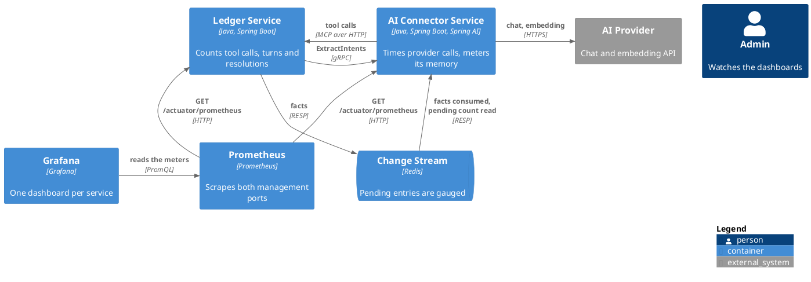
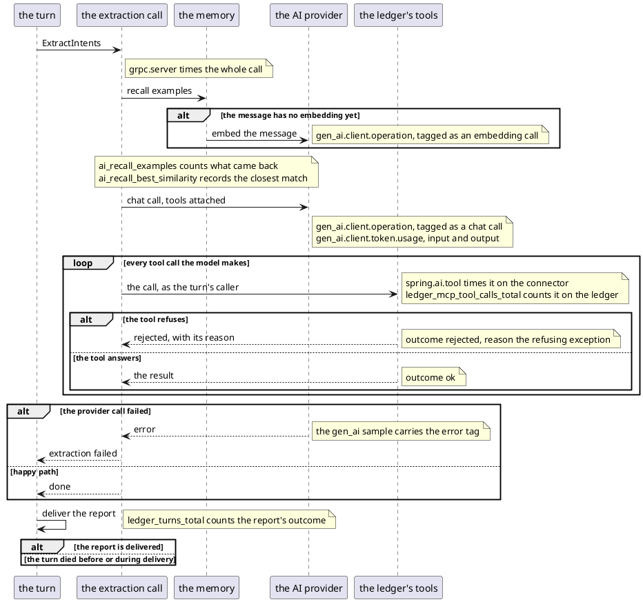

# Design: Meter the Extraction Pipeline

**Affected Modules:** `ledger-service`, `ai-connector-service`, `infrastructure`

No artifact is shared at build time. Neither service waits on the other: each declares its own meters, and the
dashboards under `infrastructure/` reference meter names as strings. Each service's operations contract page owns
its meter names, and the dashboards follow them.

## Objective

A turn crosses the ledger, the connector, the AI provider and the ledger's tools, and today only the change
stream is metered. The operator watching Grafana cannot see how often the model's tool calls are rejected, how
long the provider takes, what a turn costs in tokens, or whether the extraction produced anything a user kept.
This change puts a meter on each of those, dashboards them, and loses nothing that was already measured.

## Context

| What exists                               | Where                                                                                                                                            | What this change does with it                                              |
|-------------------------------------------|--------------------------------------------------------------------------------------------------------------------------------------------------|----------------------------------------------------------------------------|
| The ledger's custom meter style           | [`ChangeStreamMeters.java`](../../ledger-service/src/main/java/bot/finance/adapter/cdc/ChangeStreamMeters.java)                                  | Mirrored for names and tags; itself unchanged, staying in its adapter (D6) |
| A counter tagged by a domain enum         | [`OutboxMeters.java`](../../ledger-service/src/main/java/bot/finance/adapter/persistence/OutboxMeters.java)                                      | The tagging pattern every new counter follows; migrated the same way (D5)  |
| The MCP tools' ok and rejected branches   | [`CreateExpenseProposalMcpTool.java`](../../ledger-service/src/main/java/bot/finance/adapter/mcp/CreateExpenseProposalMcpTool.java)              | Each branch increments the tool-call counter                               |
| The turn's report outcome                 | [`HandleIncomingMessageUseCase.java`](../../ledger-service/src/main/java/bot/finance/application/usecase/HandleIncomingMessageUseCase.java)      | Its `ReportOutcome` becomes the turn counter's tag                         |
| The proposal resolution outcome and count | [`ResolveProposalsUseCase.java`](../../ledger-service/src/main/java/bot/finance/application/usecase/ResolveProposalsUseCase.java)                | Accepted and discarded counts feed the resolution counter                  |
| Spring AI's model and tool observations   | `spring-ai-autoconfigure-model-chat-observation-2.0.0.jar`, in the Gradle cache                                                                  | Supplies the chat, embedding, token and tool meters — none hand-rolled   |
| Spring Boot's gRPC server observations    | `spring-boot-grpc-server-4.1.0.jar`, in the Gradle cache                                                                                         | Supplies the extraction call's timer                                       |
| The connector's recall of worked examples | [`RecallExamplesUseCase.java`](../../ai-connector-service/src/main/java/bot/finance/ai/application/usecase/RecallExamplesUseCase.java)           | Each recall records how much memory contributed                            |
| The delivery attempt bound                | [`LearnMessageOutcomeUseCase.java`](../../ai-connector-service/src/main/java/bot/finance/ai/application/usecase/LearnMessageOutcomeUseCase.java) | A drop at the bound becomes a counted loss                                 |
| The operations contract pages             | [ledger](../../ledger-service/docs/contracts/in/operations.md), [connector](../../ai-connector-service/docs/contracts/in/operations.md)          | Each gains its new meters' rows                                            |
| The provisioned dashboards                | [`infrastructure/grafana/dashboards/`](../../infrastructure/grafana/dashboards/)                                                                 | Each service's dashboard gains panels for its new meters                   |
| The ledger's in-memory meter test seam    | [`InMemoryMeters.java`](../../ledger-service/src/test/java/bot/finance/common/boot/InMemoryMeters.java)                                          | Reused by the new counters' tests                                          |

## Proposed Solution

Each service records its own meters and serves them where it already serves the framework's, at
`GET /actuator/prometheus` on its management port. Nothing new is exposed and no port moves.

The ledger gains three counters: tool calls by outcome and reason, turns by report outcome, and resolved
proposals by resolution. The connector's chat, embedding, token and tool-call meters come from the framework's
observations and are documented and dashboarded rather than built. The connector builds only what the framework
cannot know: what its memory recall contributed, how far the change-stream consumer is behind, and what it
dropped for good. Both dashboards gain a panel per new meter.

### Diagrams

One turn, with where each meter moves:

After the turn: a resolution increments `ledger_proposals_resolved_total` by the count it resolved, and the
facts cross the change stream. What each delivery outcome moves is a straight line of guards, so it is a table:

| The delivery                                | Moves                                                       |
|---------------------------------------------|-------------------------------------------------------------|
| is applied and acknowledged                 | nothing new                                                 |
| fails with attempts left, stays pending     | `ai_cdc_entries_pending`, until it clears                   |
| fails on the attempt that reaches the bound | `ai_cdc_deliveries_dropped_total` — the loss is permanent |

### Details

#### `ledger-service`

| Meter                             | Kind    | Tags                        | Moves when                                                                                          |
|-----------------------------------|---------|-----------------------------|-----------------------------------------------------------------------------------------------------|
| `ledger_mcp_tool_calls_total`     | counter | `tool`, `outcome`, `reason` | a tool call answers — `outcome` is `ok` or `rejected`, `reason` is below                          |
| `ledger_turns_total`              | counter | `outcome`                   | once per handled message — the report's `ReportOutcome` name, or `UNREPORTED` (D3)                |
| `ledger_proposals_resolved_total` | counter | `resolution`                | a resolution lands — incremented by the expenses resolved, `resolution` `accepted` or `discarded` |

- `tool` is the tool's registered name: `create_expense_proposal`, `list_categories`, `summarize_spending`.
- `reason` is the refusing domain exception's simple name, one per rejected branch. On `ok` it reads `none`.
  The tools' final `catch (RuntimeException)` branch records the fixed value `unexpected`, keeping the tag bounded.
- Every meter is reached through an application-layer port, logger-style; only the metrics adapter touches
  Micrometer (D4).
- `ledger_turns_total{outcome="NOTHING_IDENTIFIED"}` is the silent-turn signal the change exists for.
- A resolution that resolves nothing (`ALREADY_ACCEPTED`, `NOTHING_TO_RESOLVE`) moves no counter.
- The counters are at-least-once: a Telegram batch replayed after a crash moves them again. They are read as
  rates and ratios, never as exact business counts.

#### `ai-connector-service` — framework meters, documented and dashboarded

| Meter                       | Kind    | Discriminating tags                             | Moves when                                |
|-----------------------------|---------|-------------------------------------------------|-------------------------------------------|
| `gen_ai.client.operation`   | timer   | operation name (`chat` or `embedding`), `error` | every provider call, success or failure   |
| `gen_ai.client.token.usage` | counter | token type (`input` or `output`)                | every chat answer carrying usage metadata |
| `spring.ai.tool`            | timer   | the tool's name, `error`                        | every tool call the model makes           |
| `grpc.server`               | timer   | method, status code                             | every `ExtractIntents` call               |

None of these is declared by the service. The acceptance scenarios assert they reach the scrape; where one does
not, the plan declares it through the same observation convention rather than inventing a name.

- The scrape carries the Prometheus-normalised forms — `gen_ai_client_operation_seconds_*`,
  `gen_ai_client_token_usage_total`, `spring_ai_tool_seconds_*`, `grpc_server_seconds_*`. The dashboards and the
  contract pages use those forms.
- `spring.ai.tool`'s tool tag carries the MCP client's *prefixed* name, ending in `_create_expense_proposal` —
  not the bare name the ledger's counter uses. Panels correlating the two account for it.
- Chat samples and token counters move once per model round-trip, so a turn with tool calls produces several.
  Per-turn cost and calls-per-turn are ratios over `ledger_turns_total`, never a single sample.
- An embedding call abandoned at `MEMORY_EMBEDDING_TIMEOUT` records whatever the provider eventually did, on the
  worker thread. The give-up the caller saw is visible only in the log, per F10.

#### `ai-connector-service` — its own meters

| Meter                             | Kind                 | Moves when                                                                         |
|-----------------------------------|----------------------|------------------------------------------------------------------------------------|
| `ai_recall_examples`              | distribution summary | every recall that searched, recording the number of examples returned              |
| `ai_recall_best_similarity`       | distribution summary | every recall returning at least one example, recording the closest match's score   |
| `ai_cdc_entries_pending`          | gauge                | at each scrape, sampling the group's delivered-but-unacknowledged entry count (D7) |
| `ai_cdc_deliveries_dropped_total` | counter              | the failure that reaches `MEMORY_ENTRY_ATTEMPTS` — each drop is a permanent loss |

- The similarity is projected by the closest-match query itself, and recorded where it is computed. The "best"
  score is the first row of the closest-ids search.
- `ai_cdc_entries_pending` is the group's PEL, not a backlog: entries nobody has read yet, and a consumer that is
  down, both read zero. Every instance publishes the same number, so its panel takes `max`, never `sum`.
- With the memory off (`MEMORY_ENABLED=false`) all four are absent: the meter implementations and every class
  recording through them are gated on the same switch.
- A pending read that cannot reach Redis answers its last value and logs at warn. The `redis` health component
  is what says the value is stale.

#### `infrastructure`

- [`grafana/dashboards/ledger-service.json`](../../infrastructure/grafana/dashboards/ledger-service.json) gains
  panels for tool-call rate and rejection reasons, turn outcomes, and resolution counts.
- [`grafana/dashboards/ai-connector-service.json`](../../infrastructure/grafana/dashboards/ai-connector-service.json)
  gains panels for extraction latency, provider latency by operation, token usage, tool-call latency and errors,
  tool-call rounds per turn as the ratio D2 fixes, recall contribution, pending entries and dropped deliveries.
- Latency panels plot average and max, as the existing HTTP latency panel does: no service publishes histogram
  buckets, and adding them is a separate decision.
- `prometheus/prometheus.yml` already scrapes both management ports and does not change.

#### Documentation

Each service's operations contract page gains its new meters' rows in its **Meters** table. The connector's
"the service declares none of its own" sentence is replaced by that table.

## Acceptance Scenarios

The meters are read at each service's `GET /actuator/prometheus`; the flows above drive them.

The ledger's meters:

- **A1:** a successful tool call is counted
  - Given: the caller's token names a stored user with a grouping and category
  - When: the model calls `create_expense_proposal` validly
  - Then: `ledger_mcp_tool_calls_total{tool="create_expense_proposal",outcome="ok",reason="none"}` increments

- **A2:** a rejected tool call is counted with its reason
  - Given: the caller names a grouping the user does not have
  - When: the model calls `create_expense_proposal` against it
  - Then: the counter increments with `outcome="rejected"` and `reason` naming the refusing exception

- **A3:** a turn that recorded proposals is counted
  - Given: a user sends a message naming an expense
  - When: the turn's report is delivered
  - Then: `ledger_turns_total{outcome="RECORDED"}` increments

- **A4:** a silent turn is counted
  - Given: a user sends a message the model records nothing from
  - When: the turn's report is delivered
  - Then: `ledger_turns_total{outcome="NOTHING_IDENTIFIED"}` increments

- **A5:** a turn answering a spending question is counted
  - Given: a user asks what they spent over a period
  - When: the turn's report is delivered
  - Then: `ledger_turns_total{outcome="ANSWERED"}` increments

- **A6:** a failed extraction is counted
  - Given: the connector is unreachable
  - When: the turn's report is delivered
  - Then: `ledger_turns_total{outcome="FAILED"}` increments

- **A7:** a partial turn is counted
  - Given: the extraction stored a proposal and then failed
  - When: the turn's report is delivered
  - Then: `ledger_turns_total{outcome="PARTIAL"}` increments

- **A22:** a turn that never reports is counted
  - Given: Telegram refuses the report's delivery
  - When: the turn ends
  - Then: `ledger_turns_total{outcome="UNREPORTED"}` increments

- **A8:** an accepted report adds its count
  - Given: a delivered report holds two proposals
  - When: the user accepts it
  - Then: `ledger_proposals_resolved_total{resolution="accepted"}` grows by two

- **A9:** a discarded report adds its count
  - Given: a delivered report holds one proposal
  - When: the user discards it
  - Then: `ledger_proposals_resolved_total{resolution="discarded"}` grows by one

- **A10:** a repeated resolution adds nothing
  - Given: a report already accepted
  - When: the user accepts it again
  - Then: neither resolution counter moves

The connector's meters:

- **A11:** the extraction call is timed
  - Given: the service is up
  - When: `ExtractIntents` is called
  - Then: the scrape shows a `grpc.server` sample for that method

- **A12:** the chat call is timed and its tokens counted
  - Given: the provider answers a chat call with usage metadata
  - When: a turn runs
  - Then: the scrape shows a chat-tagged `gen_ai.client.operation` sample and grown input and output `gen_ai.client.token.usage` counters

- **A13:** the embedding call is timed
  - Given: a registered message with no stored embedding
  - When: recall embeds it
  - Then: the scrape shows an embedding-tagged `gen_ai.client.operation` sample

- **A14:** a provider failure is visible on the timer
  - Given: the provider refuses the chat call
  - When: a turn runs
  - Then: that operation's sample carries the error tag, and the extraction call fails

- **A15:** a tool call is timed on the connector
  - Given: the model makes a tool call during a turn
  - When: the turn runs
  - Then: the scrape shows a `spring.ai.tool` sample whose tool tag ends in that tool's name

- **A16:** a recall that found examples is measured
  - Given: the user has earlier messages close to the new one
  - When: recall runs
  - Then: `ai_recall_examples` records how many came back, and `ai_recall_best_similarity` the closest score

- **A17:** a recall that found nothing is measured
  - Given: the user has no message within `MEMORY_MIN_SIMILARITY`
  - When: recall runs
  - Then: `ai_recall_examples` records a zero, and no similarity sample is recorded

- **A18:** the pending gauge shows the backlog
  - Given: deliveries the store keeps refusing sit pending in the consumer group
  - When: the gauge is sampled
  - Then: `ai_cdc_entries_pending` reads their count, and reads zero once they clear

- **A19:** a dropped delivery is counted
  - Given: a delivery has failed one attempt short of `MEMORY_ENTRY_ATTEMPTS`
  - When: the attempt that reaches the bound fails
  - Then: `ai_cdc_deliveries_dropped_total` increments and the entry is acknowledged

- **A20:** the memory switch removes its meters
  - Given: `MEMORY_ENABLED=false`
  - When: the scrape is read
  - Then: no `ai_recall_*` or `ai_cdc_*` meter appears

The dashboards:

- **A21:** a fresh clone shows the new panels
  - Given: the compose stack is up with provisioned dashboards
  - When: the admin opens either service's dashboard
  - Then: the new panels render against the live meters

## Decisions

- **D1:** `infrastructure` has no conventions file — what governs its dashboard edits?
  - Answer: For this change, the infrastructure README and the existing dashboard JSONs are the authority.
    Running `init-conventions` for `infrastructure/` stays a separate task.
  - Basis: decided — the user chose the README and existing dashboards over running `init-conventions` first
    (user, 2026-08-20).

- **D2:** How are tool-call rounds per turn measured?
  - Answer: As a Grafana ratio — the `spring.ai.tool` call rate divided by the `ledger_turns_total` rate. It
    shows the average rounds per turn and its drift. A per-turn distribution meter is deferred until the average
    proves too blunt.
  - Basis: decided — the user chose the ratio over a custom meter wrapping the tool callbacks (user, 2026-08-20).

- **D4:** How does the code reach a meter?
  - Answer: Through an interface in the application layer, the way logging already works: meter ports beside
    `Logger`/`LoggerFactory`, implemented in a metrics adapter that alone touches Micrometer. The turn,
    resolution and dropped-delivery counts are recorded by the use cases that decide those facts; the tool-call,
    recall and pending meters stay in the adapters that alone hold their values.
  - Basis: decided — the user chose meter ports over adapter-held meter classes, with recording moved to where
    each fact is decided (user, 2026-08-20).

- **D5:** Do the ledger's pre-existing meters migrate to the D4 shape?
  - Answer: Yes, in this task. The outbox drop counter and the change-stream counters and gauges move behind
    the same kind of port, with only the metrics adapter touching Micrometer. Every meter name and tag is
    unchanged, so the operations contract, the dashboards and anything alerting on them see no difference.
  - Basis: decided — the user wants no follow-up work left after this task (user, 2026-08-20).

- **D6:** Do the change-stream meters and slot gauges cross into the application layer under D5?
  - Answer: No. Their facts — slot WAL status, retained bytes, engine state — are adapter-shaped, which the
    architecture conventions ban from `application/port`. They keep their current shape in `adapter/cdc`; of
    the pre-existing meters, only the outbox drop counter migrates behind a port.
  - Basis: decided — the user chose keeping them in the adapter over overriding the transport-shape rule for
    meter ports (user, 2026-08-20).

- **D7:** How is the pending-entries gauge fed?
  - Answer: Pulled at scrape time. The gauge samples a pending-count port the change-stream adapter implements
    with a live `XPENDING`, so every scrape reads a fresh value and no poll schedule exists. A read that cannot
    reach Redis answers the last value it saw and logs at warn; the `redis` health component is what says the
    value is stale.
  - Basis: decided — the user chose scrape-time pull over a fixed poll pushing the gauge (user, 2026-08-20),
    accepting that a scrape performs one Redis read.

- **D3:** What counts a turn that never reaches its report?
  - Answer: `ledger_turns_total{outcome="UNREPORTED"}`. The counter moves once per handled message: with the
    report's `ReportOutcome` when delivery succeeds, with `UNREPORTED` when the turn dies before or during
    delivery — user initialization, a missing catch-all grouping, Telegram refusing the send. One counter stays
    the turn denominator.
  - Basis: decided — the user chose the tag value over a separate failure counter or the log alone
    (user, 2026-08-20).

## Design Findings

Grilled (2026-08-20): meter placement and layering, unreported turns, tag cardinality, the framework meters'
real names and semantics, the pending gauge's meaning under scale, dashboard statistics, replay double-counting;
authorization, data and contract compatibility found clear.

| #   | Question                                                       | Answer                                                                                      | Evidence                                                                                                                                                   |
|-----|----------------------------------------------------------------|---------------------------------------------------------------------------------------------|------------------------------------------------------------------------------------------------------------------------------------------------------------|
| F1  | What naming do the new meters follow?                          | Service prefix and snake case: `ledger_*`, `ai_*`                                           | [`ChangeStreamMeters.java`](../../ledger-service/src/main/java/bot/finance/adapter/cdc/ChangeStreamMeters.java)                                            |
| F2  | Hand-roll the provider timers and token counters?              | No — the framework observes them; A12–A15 assert they reach the scrape                  | `ChatObservationAutoConfiguration`, in `spring-ai-autoconfigure-model-chat-observation-2.0.0.jar`                                                          |
| F3  | What does the `reason` tag hold?                               | The refusing domain exception's simple name — one value per catch branch                  | [`CreateExpenseProposalMcpTool.java`](../../ledger-service/src/main/java/bot/finance/adapter/mcp/CreateExpenseProposalMcpTool.java)                        |
| F4  | Count resolutions or resolved expenses?                        | Expenses, by the resolution's count; no-op resolutions move nothing                         | [`ResolveProposalsUseCase.java`](../../ledger-service/src/main/java/bot/finance/application/usecase/ResolveProposalsUseCase.java)                          |
| F5  | What are the turn counter's tag values?                        | The five `ReportOutcome` names, plus `UNREPORTED` (D3)                                      | [`HandleIncomingMessageUseCase.java`](../../ledger-service/src/main/java/bot/finance/application/usecase/HandleIncomingMessageUseCase.java)                |
| F6  | How is the pending gauge fed?                                  | Superseded by D7 — sampled at scrape time through a pending-count port                    | the design's D7                                                                                                                                            |
| F7  | What do the memory meters do with the memory off?              | Absent — the implementations and every recording class share the memory gate              | [`UseCaseConfiguration.java`](../../ai-connector-service/src/main/java/bot/finance/ai/adapter/config/UseCaseConfiguration.java)                            |
| F8  | Any per-user tag anywhere?                                     | No — every tag is a bounded set; a user id is unbounded                                   | [`ChangeStreamMeters.java`](../../ledger-service/src/main/java/bot/finance/adapter/cdc/ChangeStreamMeters.java)                                            |
| F9  | Count entries acknowledged without applying?                   | Deferred — the warn log stays the record; recurring unreadable entries bring it back      | [`ChangeStreamConsumer.java`](../../ai-connector-service/src/main/java/bot/finance/ai/adapter/redis/ChangeStreamConsumer.java)                             |
| F10 | Count embedding give-ups?                                      | Deferred — the error log stays the record; a stuck backfill brings it back                | [`MessageEmbedder.java`](../../ai-connector-service/src/main/java/bot/finance/ai/application/usecase/MessageEmbedder.java)                                 |
| F11 | Meter the transcription service?                               | Deferred — no such module exists in the tree yet                                          | [the root README](../../README.md)                                                                                                                         |
| F12 | Alert rules on the new meters?                                 | Deferred — dashboards only; an on-call rotation brings alerting back                      | [`infrastructure/README.md`](../../infrastructure/README.md)                                                                                               |
| F13 | Which layer records a meter?                                   | Whoever decides the fact, through a meter port (D4); Micrometer only in the metrics adapter | [`Slf4jLoggerFactory.java`](../../ai-connector-service/src/main/java/bot/finance/ai/adapter/logging/Slf4jLoggerFactory.java)                               |
| F14 | What does `reason` hold on the tools' catch-all branch?        | The fixed value `unexpected` — an arbitrary class name is an unbounded tag                | [`CreateExpenseProposalMcpTool.java`](../../ledger-service/src/main/java/bot/finance/adapter/mcp/CreateExpenseProposalMcpTool.java)                        |
| F15 | Where does the similarity score come from?                     | Projected by the closest-match query, recorded where computed                               | [`IncomingMessageEntityRepository.java`](../../ai-connector-service/src/main/java/bot/finance/ai/adapter/persistence/IncomingMessageEntityRepository.java) |
| F16 | Is a recall that could not search distinguishable?             | Deferred — it records nothing, as "found nothing" does; the warn log stays the record     | [`RecallExamplesUseCase.java`](../../ai-connector-service/src/main/java/bot/finance/ai/application/usecase/RecallExamplesUseCase.java)                     |
| F17 | What tool name does `spring.ai.tool` carry?                    | The MCP client's prefixed name, ending in the bare tool name                                | `McpToolUtils.java`, in `spring-ai-mcp-2.0.0.jar`                                                                                                          |
| F18 | What does the pending gauge read under scale?                  | The group-wide PEL, identical from every instance — panels take `max`                     | [`ChangeStreamConsumer.java`](../../ai-connector-service/src/main/java/bot/finance/ai/adapter/redis/ChangeStreamConsumer.java)                             |
| F19 | Percentile latency panels?                                     | Deferred — no histogram buckets are published; panels plot avg and max                    | [`ledger-service.json`](../../infrastructure/grafana/dashboards/ledger-service.json)                                                                       |
| F20 | What names appear in the scrape?                               | The Prometheus-normalised underscored forms                                                 | [`ledger-service.json`](../../infrastructure/grafana/dashboards/ledger-service.json)                                                                       |
| F21 | Which failure drops a delivery?                                | The one that reaches `MEMORY_ENTRY_ATTEMPTS`, not the one after                             | [`LearnMessageOutcomeUseCase.java`](../../ai-connector-service/src/main/java/bot/finance/ai/application/usecase/LearnMessageOutcomeUseCase.java)           |
| F22 | Does the timer show an embedding the caller abandoned?         | No — the sample is the provider's eventual outcome; the log stays the give-up record      | [`AiMessageEmbeddingAdapter.java`](../../ai-connector-service/src/main/java/bot/finance/ai/adapter/ai/AiMessageEmbeddingAdapter.java)                      |
| F23 | Is one chat sample one turn?                                   | No — one per model round-trip; per-turn figures are ratios over `ledger_turns_total`      | [`AiExpenseRecordingAdapter.java`](../../ai-connector-service/src/main/java/bot/finance/ai/adapter/ai/AiExpenseRecordingAdapter.java)                      |
| F24 | What flags a stale pending gauge?                              | The `redis` health component going down                                                     | [the connector's operations page](../../ai-connector-service/docs/contracts/in/operations.md)                                                              |
| F25 | Exact counts under a replayed Telegram batch?                  | No — at-least-once, read as rates; the published-events counter already is                | [`TelegramUpdateListener.java`](../../ledger-service/src/main/java/bot/finance/adapter/telegram/TelegramUpdateListener.java)                               |
| F26 | What does the pending count answer before any successful read? | `NaN`, absent from the scrape — `0` would read as a drained group                         | the design's D7, which gives staleness to the `redis` health component                                                                                     |
