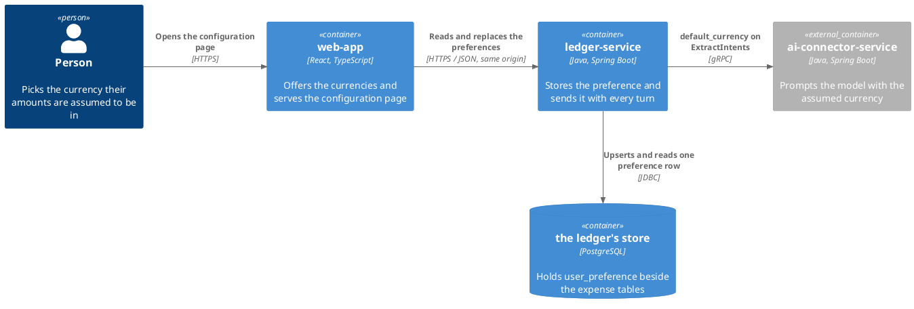
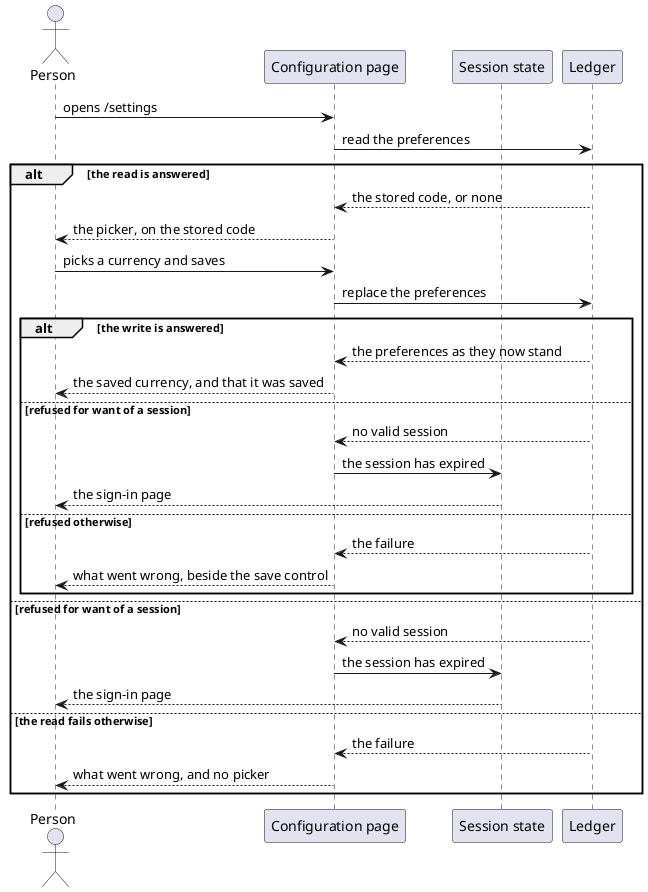

# Design: Set a default currency

**Affected Modules:** `ledger-service`, `web-app`

The two modules share one artifact: [`openapi/ledger-api.yaml`](../../openapi/ledger-api.yaml), with its
`paths/preferences.yaml`. The ledger generates its endpoints from it, the browser generates its response types
from it, and neither owns it. It is written before either module's work.

## Objective

A person picks the currency their spending is assumed to be in, and the bot stops ignoring an amount stated with
no currency. Today `HandleIncomingMessageUseCase` sends `Optional.empty()` as the extraction request's default
currency, so an amount without a currency is not acted on. The choice is stored per person, edited from a
configuration page in the web app, and sent to the AI connector on every turn through the `default_currency`
field the contract already carries.

## Context

| What exists                                    | Where                                                                                                                         | What this change does with it                                                     |
|------------------------------------------------|-------------------------------------------------------------------------------------------------------------------------------|-----------------------------------------------------------------------------------|
| `Money` and `CurrencyCode`                     | [`Money.java`](../../ledger-service/src/main/java/bot/finance/domain/value/Money.java)                                        | `CurrencyCode` is the stored type; the preference holds no amount                 |
| `expense.currency_code`                        | [`V002__create_expense.sql`](../../ledger-service/src/main/resources/db/migration/V002__create_expense.sql)                   | The new column copies its type and width                                          |
| `IntentExtractionRequest.defaultCurrency`      | [`IntentExtractionRequest.java`](../../ledger-service/src/main/java/bot/finance/application/dto/IntentExtractionRequest.java) | Stops being `Optional.empty()` at the one call site that builds it                |
| `default_currency` on the gRPC contract        | [`intent_extraction.proto`](../../proto/intent_extraction.proto)                                                              | Unchanged; the connector already threads it to the prompt                         |
| The browse API and its schema                  | [`ledger-api.yaml`](../../openapi/ledger-api.yaml)                                                                            | Gains a `preferences` tag                                                         |
| `SecurityConfiguration`'s web chain            | [`SecurityConfiguration.java`](../../ledger-service/src/main/java/bot/finance/adapter/security/SecurityConfiguration.java)    | Both new paths join its matcher list, ahead of `denyAll` (F11)                    |
| `UserEntityRepository.insertIfAbsent`          | [`UserEntityRepository.java`](../../ledger-service/src/main/java/bot/finance/adapter/persistence/UserEntityRepository.java)   | The shape the preference upsert is written in (F14)                               |
| `WebExceptionHandler`                          | [`WebExceptionHandler.java`](../../ledger-service/src/main/java/bot/finance/adapter/web/WebExceptionHandler.java)             | Gains a handler for a refused currency code                                       |
| The English catalogue                          | [`en.ts`](../../web-app/src/i18n/en.ts)                                                                                       | Gains a `settings` namespace and one key per currency (D1)                        |
| The route table and the shell                  | [`routes.tsx`](../../web-app/src/routes.tsx), [`AppShell.tsx`](../../web-app/src/pages/AppShell.tsx)                          | Gain a `/settings` route behind the guard, a gear link and a linked wordmark (D4) |
| `ExpensesPage`, the only page behind the guard | [`ExpensesPage.tsx`](../../web-app/src/pages/ExpensesPage.tsx)                                                                | Mirrored — the same read-on-mount, banner, and `sessionExpired` handling        |
| `CategoryPicker` and the `Command` popover     | [`CategoryPicker.tsx`](../../web-app/src/components/CategoryPicker.tsx)                                                       | The popover primitives are reused; the component itself is not (F17)              |

## Proposed Solution

### What the change adds

- One row per person in a new `user_preference` table, holding an ISO 4217 currency code.
- `GET /api/v1/preferences` and `PUT /api/v1/preferences`, under a new `preferences` tag, admitted by the session
  cookie the browse API already uses.
- A `/settings` route in the web app, behind the route guard, reached from a gear control in the shell.
- The currency choices in the web app itself: every current ISO 4217 code an amount can be recorded in, each
  named by a key in the English catalogue, so a second locale renames them without touching the ledger
  (D1, D6, F31).
- The stored code on every intent extraction request the ledger sends, in place of today's `Optional.empty()`.

A choice, once made, is changed but never cleared (D2). A person who has never opened the page keeps today's
behaviour: no `default_currency` on the request, and an amount with no currency is not acted on (D3).

### Diagrams



The shared artifact is what crosses between the two modules: `web-app` reaches `ledger-service` only over the
schema above. The currency list crosses nothing — it is the browser's, and only the chosen code travels.



The endpoints' own branches are a table of condition and outcome, under **the API** below, and the turn's are a
table under **the turn** (F15, F16).

### Details

#### `ledger-service` — the store

`V011__create_user_preference.sql`:

```sql
CREATE TABLE user_preference (
    user_id               BIGINT     PRIMARY KEY REFERENCES app_user (id) ON DELETE CASCADE,
    default_currency_code VARCHAR(3) NOT NULL
);
```

| Column                  | Holds                                                                |
|-------------------------|----------------------------------------------------------------------|
| `user_id`               | the person, and the key — a person has at most one preferences row |
| `default_currency_code` | an ISO 4217 code as `CurrencyCode` normalizes it, upper-cased        |

No row means no default. A row always carries a code, because a choice cannot be cleared (D2).

The key is assigned rather than generated, which is new for this module. The write is therefore an explicit
`INSERT ... ON CONFLICT (user_id) DO UPDATE`, in the shape `UserEntityRepository.insertIfAbsent` already uses; a
`save()` on an assigned id issues an `UPDATE` and the first write finds no row (F14). The conflict clause is also
what makes two concurrent replacements land one after the other rather than one of them failing.

#### `ledger-service` — the API

`Preferences` is what a read answers. One field today:

| Field             | Type               | Bound                                                               |
|-------------------|--------------------|---------------------------------------------------------------------|
| `defaultCurrency` | `[string, "null"]` | an ISO 4217 code, upper-cased. `null` only where nothing was chosen |

`PreferencesUpdate` is what `PUT` takes, and it replaces the whole resource:

| Field             | Type     | Bound                                                                          |
|-------------------|----------|--------------------------------------------------------------------------------|
| `defaultCurrency` | `string` | required, `^[A-Za-z]{3}$`, and a code an amount can be recorded in. Never null |

The two schemas differ so that a `null` cannot be written: the answer carries the unset state, the request cannot
express it (D2).

The pattern admits either case, and `CurrencyCode` upper-cases what it is given. A pattern of `^[A-Z]{3}$` would
be generated as a `@Pattern`, refusing `eur` before the controller is reached and before anything can normalize
it (F30). The answer always carries the upper-cased code.

That bound has no home today. `CurrencyCode` accepts every code `Currency.getInstance` knows, `XAU` included, and
narrowing it would retroactively refuse a code already stored on an expense. So the refusal is the preferences
boundary's own guard, raising `InvalidMoneyException`, and `CurrencyCode` is unchanged (F12).

| The caller gets | When                                                                            |
|-----------------|---------------------------------------------------------------------------------|
| 200             | the read or the replacement was answered                                        |
| 400             | `defaultCurrency` is absent, `null`, or not a code an amount can be recorded in |
| 401             | no session is open                                                              |
| 404             | the session names a user the store no longer holds (F39)                       |
| 403             | a write carried no CSRF token                                                   |
| 503             | the store did not answer                                                        |

`WebExceptionHandler` maps `InvalidMoneyException` to 400 naming the field and the code, rather than letting the
`InvalidValueException` fallback answer "the request carried a value this service cannot accept".

#### `ledger-service` — build and security

| Setting                 | Change                                                                                           |
|-------------------------|--------------------------------------------------------------------------------------------------|
| `SecurityConfiguration` | `GET` and `PUT /api/v1/preferences` join the web chain as `.authenticated()`, ahead of `denyAll` |
| the generated interface | one new tag, `preferences`, and nothing else                                                     |

Four documents state facts this change moves, and are corrected with it:

| Document                                                                          | Correction                                                       |
|-----------------------------------------------------------------------------------|------------------------------------------------------------------|
| [the browse API](../../ledger-service/docs/contracts/in/web-browse-api.md)        | one more tag on the boundary, and a second write                 |
| [the web app's side of it](../../web-app/docs/contracts/out/ledger-browse-api.md) | the configuration page's read and its write                      |
| [the database](../../ledger-service/docs/contracts/out/database.md)               | an eighth table, its column, and a row in **What a Table Holds** |
| [`docs/requests/`](../../ledger-service/docs/requests/)                           | a `preferences/` directory, one `.http` file per operation       |

#### `ledger-service` — the turn

`HandleIncomingMessageUseCase` reads the sender's stored code after `initializeUserPort.initialize` and passes it
as `IntentExtractionRequest.defaultCurrency`. The read is the one new call in that use case.

| The stored preference | The extraction request carries                                       |
|-----------------------|----------------------------------------------------------------------|
| a code                | `default_currency` set to it                                         |
| no row                | no `default_currency`, as every request does today                   |
| a read that failed    | no `default_currency`; the failure is logged and the turn runs (F10) |

Nothing else reads the preference. An expense keeps the currency it was recorded with, and no figure is converted.

#### `web-app` — the currencies

The choices are the module's own data, not the ledger's (D1).

- **The catalogue is the list.** A `currencies` namespace in `en.ts` holds one key per offered code —
  `currencies.EUR: 'Euro'` — and the offered set is `keyof typeof en.currencies`. There is no array beside it, so
  a code with no name and a name no code offers are the same impossible thing (F27).
- The namespace is data, not a surface's strings, which is the one place this extends `en.ts`'s own rule that a
  namespace names the surface reading it (F28).
- A second locale renames every entry by translating the namespace, which is what the module already does for
  every other string.
- **What the set holds:** a code ISO 4217 currently publishes, minus every code no amount can be recorded in —
  `XAU`, `XDR`, `XXX` and their kind, whose default fraction digits are `-1`. Those are current and would be
  refused by the ledger with a 400 (A8), so offering one is offering a dead entry (F31). Codes ISO 4217 has
  withdrawn are out too (D6).
- The ledger's own guard stays the wider "an amount can be recorded in it", so a withdrawn code reaching it by
  hand is accepted (F29). What the two sets disagreeing means for the picker is D8.
- **Where the set comes from:** transcribed once from the ISO 4217 published table, named in a comment above the
  namespace. Nothing checks it afterwards; it is corrected when a person reports a currency they cannot pick
  (D7).

#### `web-app` — the configuration page

- **Route:** `/settings`, inside `RequireAuth`, rendered in `AppShell` like `/`.
- **Reached from:** a gear icon button in the shell header, beside the theme control and shown only while a
  session is open, carrying an `aria-label` from the catalogue as the theme control does. It is a `NavLink`, so
  it marks itself `aria-current` and wears the active style while `/settings` is open, and pressing it there
  re-navigates harmlessly (D10). **Left by:** the product name, which becomes a link to `/`, wearing the ghost
  button's hover and its `focus-visible:ring-accent` so Tab reaches it visibly (D4, D9).
- The page reads the preferences on mount and renders a searchable picker over the module's currency list. The
  picker is a new component beside `CategoryPicker`, reusing the `Popover` and `Command` primitives under it;
  `CategoryPicker`'s own props are category-shaped and do not carry a currency (F17).
- An entry reads as its name then its code — `Euro (EUR)` — carried as one `value` string, so the search matches
  either part (D5). cmdk's default filter scores a subsequence and ranks rather than excludes, so a three-letter
  query narrows the list without emptying it (F33).
- The list is ordered by the displayed name, compared with an `Intl.Collator` on the resolved language, the way
  `ExpenseDaySection` resolves a locale for its dates (F32). The order cannot be baked into the catalogue: D5
  orders by a name a second locale rewrites.
- The list is one flat group with no headings, bounded and scrolling inside the popover, and narrowed by its
  search (F18). It carries no entry meaning "no default": a choice cannot be cleared (D2).
- With nothing stored, the picker's trigger reads its own unset wording and no entry is selected (F19).
- With a stored code the set does not hold, the trigger reads the bare code and no entry is selected. Picking a
  currency then differs from what is stored, so the save control appears and replaces it (D8).
- The picker sits in a `bg-card` panel at the width `ExpenseFilters` gives a field, not across the shell (F20).
  The popover takes the trigger's width, and the trigger truncates its text as `CategoryFilter` does; a
  `CommandItem` wraps rather than truncates, so the longest entry costs the row a second line (F34).
- Saving is explicit. The save control is absent while the picked currency equals the stored one, and disabled
  while a save is out, inside a row that stays in the flow either way (F21). A save while one is out sends
  nothing.
- A save that was answered is reported in a `text-sm text-muted-foreground` line carrying `role="status"`, which
  stands until the choice changes again (F22).
- A failed read shows `ErrorBanner` at the top and no picker. A failed write shows its wording beside the save
  control, as `ExpenseDaySection` does for a refused refile (F23).
- A 401 from either call goes to `sessionExpired`, as `ExpensesPage` does. The person lands back on `/` after
  signing in again, not on `/settings` (F24).
- Every string joins `en.ts` under a `settings` namespace.

## Acceptance Scenarios

### `GET /api/v1/preferences`

- **A1:** the stored code is answered
  - Given: a signed-in person whose preference row holds `EUR`
  - When: they read their preferences
  - Then: the response is 200 with `defaultCurrency: "EUR"`

- **A2:** a person who has never chosen
  - Given: a signed-in person with no preference row
  - When: they read their preferences
  - Then: the response is 200 with `defaultCurrency: null`

- **A3:** no session
  - Given: no session cookie
  - When: the preferences are read
  - Then: the response is 401

- **A19:** the store does not answer a read
  - Given: a signed-in person, and a store refusing reads
  - When: they read their preferences
  - Then: the response is 503, and the same request can be retried

### `PUT /api/v1/preferences`

- **A4:** a currency is chosen for the first time
  - Given: a signed-in person with no preference row
  - When: they replace their preferences with `defaultCurrency: "eur"`
  - Then: the response is 200 with `defaultCurrency: "EUR"`, and the row holds `EUR`

- **A5:** a chosen currency is changed
  - Given: a signed-in person whose row holds `EUR`
  - When: they replace their preferences with `defaultCurrency: "USD"`
  - Then: the response is 200 with `defaultCurrency: "USD"`, and one row still holds the person

- **A24:** the choice cannot be cleared
  - Given: a signed-in person whose row holds `EUR`
  - When: they replace their preferences with `defaultCurrency: null`
  - Then: the response is 400, and the row still holds `EUR`

- **A7:** a code ISO 4217 does not know
  - Given: a signed-in person
  - When: they replace their preferences with `defaultCurrency: "XYZ"`
  - Then: the response is 400 naming the code, and the stored preference is unchanged

- **A8:** a currency no amount can be recorded in
  - Given: a signed-in person
  - When: they replace their preferences with `defaultCurrency: "XAU"`
  - Then: the response is 400 naming the code, and the stored preference is unchanged

- **A9:** the store does not answer a write
  - Given: a signed-in person, and a store refusing writes
  - When: they replace their preferences
  - Then: the response is 503, and the same request can be retried

- **A29:** the body names no currency
  - Given: a signed-in person
  - When: they replace their preferences with a body carrying no `defaultCurrency`
  - Then: the response is 400, and the stored preference is unchanged

- **A20:** the write carries no CSRF token
  - Given: a signed-in person whose request omits the CSRF header
  - When: they replace their preferences
  - Then: the response is 403, and the stored preference is unchanged

### The currency list

- **A25:** the offered set holds no code the ledger refuses
  - Given: the `currencies` namespace
  - When: each of its codes is checked against the codes an amount can be recorded in
  - Then: none of `XAU`, `XDR` or `XXX` is offered, and every offered code is one the ledger accepts

### The configuration page

- **A11:** the stored choice is shown
  - Given: a signed-in person whose preference holds `EUR`
  - When: they open `/settings`
  - Then: the picker stands on `Euro (EUR)`, and no save control is offered

- **A26:** nothing has been chosen yet
  - Given: a signed-in person with no preference row
  - When: they open `/settings`
  - Then: the picker stands on its unset wording, and no save control is offered

- **A12:** a choice is saved
  - Given: the page is on screen with a currency picked that is not the stored one
  - When: they save
  - Then: the ledger is asked to replace the preferences, and the page reports that it was saved

- **A13:** the save is refused
  - Given: the page is on screen and the ledger refuses the write for any reason but a session
  - When: they save
  - Then: the wording is shown beside the save control, and the picker stands where they left it

- **A14:** the session has expired on a save
  - Given: the page is on screen and the ledger answers 401
  - When: they save
  - Then: the sign-in page is shown

- **A15:** the read fails
  - Given: the ledger does not answer the preferences read
  - When: they open `/settings`
  - Then: the failure is shown, and no picker is rendered

- **A22:** the session has expired on the read
  - Given: the ledger answers 401 to the read on mount
  - When: they open `/settings`
  - Then: the sign-in page is shown, and no failure banner is left behind

- **A23:** a second save while one is out
  - Given: a save is out
  - When: the save control is pressed again
  - Then: nothing is sent, and one call stands

- **A28:** a currency is found by its code
  - Given: the picker is open
  - When: they type `usd`
  - Then: `US Dollar (USD)` is among the entries shown, and the list is narrower than it was

- **A30:** a stored code the picker does not offer
  - Given: a signed-in person whose row holds `DEM`
  - When: they open `/settings`
  - Then: the trigger reads `DEM`, no entry is selected, and picking a currency offers the save control

- **A27:** the way back
  - Given: the page is on screen
  - When: they follow the product name in the header
  - Then: the listing is shown

### An incoming message

- **A16:** the stored currency reaches the model
  - Given: a person whose preference holds `EUR`
  - When: they send a message
  - Then: the extraction request carries `default_currency: "EUR"`

- **A17:** nothing is stored
  - Given: a person with no preference row
  - When: they send a message
  - Then: the extraction request carries no `default_currency`, as it does today

- **A18:** the preference read fails
  - Given: a person whose preference row cannot be read
  - When: they send a message
  - Then: the extraction request carries no `default_currency`, and the turn is delivered as it otherwise would be

## Decisions

- **D1:** Where does the configuration page's list of currencies come from?
  - Answer: The web app itself. It carries every current ISO 4217 code, and names each one through a key in its
    own catalogue, so the names follow the loaded locale. The ledger answers no currency list.
  - Basis: decided — the user chose the module's own configuration over a ledger endpoint, so the displayed names
    are adjustable per locale in the place every other string already is (user, 2026-08-23).

- **D2:** Can a person clear a default currency once one is set?
  - Answer: No. A read answers `null` until a first choice is made; after that the resource always carries a
    code, and the request schema cannot express `null`.
  - Basis: decided — the user chose a choice that stays set over one that can be returned to nothing
    (user, 2026-08-23).

- **D3:** What default does a person who never opens the page have?
  - Answer: None. No preference row means no `default_currency` on the extraction request, exactly what every
    turn sends today.
  - Basis: decided — the user chose today's behaviour over a system-wide fallback, so nothing changes for a
    person who ignores the page (user, 2026-08-23).

- **D4:** How does the shell carry the link to `/settings`, and how does a person get back to the listing?
  - Answer: A gear icon button beside the theme control, shown while a session is open, and the product name
    becomes a link to `/`.
  - Basis: decided — the user chose the icon plus a linked wordmark over a text control and a page-level back
    link, so the header costs no width at its narrowest (user, 2026-08-23).

- **D5:** What does a currency read as in the picker, and in what order do the entries stand?
  - Answer: `Euro (EUR)` — the catalogue name, then the code — ordered by the displayed name. The search matches
    either part.
  - Basis: decided — the user chose name-then-code over a bare name, so a person searching by code finds one
    (user, 2026-08-23).

- **D6:** May a person pick a currency ISO 4217 has withdrawn, such as `DEM`?
  - Answer: No. The module's list holds current codes only, and a withdrawn one is never offered.
  - Basis: decided — the user chose a current-only list over everything the platform knows (user, 2026-08-23).

- **D7:** Which published source fixes the offered set, and what refreshes it when ISO 4217 amends the list?
  - Answer: The ISO 4217 published table, transcribed once and named in a comment above the namespace. Nothing
    checks it afterwards, and it is corrected when a person reports a currency they cannot pick.
  - Basis: decided — the user chose an on-demand correction over a generated list with a CI check, so the module
    takes on no network dependency and no build script (user, 2026-08-23). Nothing in the module could have
    answered it: no ISO data ships in `web-app`, and `Intl.supportedValuesOf('currency')` still carries withdrawn
    codes.

- **D8:** What does the picker do with a stored code the offered set does not hold?
  - Answer: The trigger reads the bare code, with no entry selected. Picking a currency then differs from what is
    stored, so the save control appears and replaces it.
  - Basis: decided — the user chose showing what is stored over reading as unset, so the screen never disagrees
    with what the bot is using (user, 2026-08-23). The two sets provably diverge, because F29 leaves the ledger's
    guard wider than the browser's.

- **D9:** How does a link read at rest, on hover and under Tab?
  - Answer: The wordmark is a `Link` wearing the ghost button's hover and its `focus-visible:ring-accent`.
  - Basis: decided — the user chose reusing the control style over a new link colour or a global
    `:focus-visible`, so the module gains no token and no rule reaching controls that style their own
    (user, 2026-08-23). It is the module's first anchor, and a bare one would be invisible under Tab.

- **D10:** What does the gear do while `/settings` is the open page?
  - Answer: It is a `NavLink`. It carries `aria-current` and the active style, and pressing it there re-navigates
    harmlessly.
  - Basis: decided — the user chose marking the current route over leaving it unmarked or disabling the control,
    so assistive technology can tell where it is (user, 2026-08-23). Nothing in the module marked one before,
    because it had a single guarded route.

## Design Findings

Grilled (2026-08-23), twice — the second pass over the half the user's answers rewrote. `grill-design` — failure
modes, concurrency, contract compatibility, security, limits, scenario coverage. `grill-frontend` — empty and
extreme data, defaults, layout stability, control consistency, colour, locale, keyboard reach. Both found
idempotency, retry, recovery, lifecycle, observability, motion, third-party embeds and library cost clear.

| #   | Question                                                                  | Answer                                                                                                                                                                                                                                                                                                                                                                                                                                                                                                                                                                                                                                                                                                                                                                                                                        | Evidence                                                                                                                                                                          |
|-----|---------------------------------------------------------------------------|-------------------------------------------------------------------------------------------------------------------------------------------------------------------------------------------------------------------------------------------------------------------------------------------------------------------------------------------------------------------------------------------------------------------------------------------------------------------------------------------------------------------------------------------------------------------------------------------------------------------------------------------------------------------------------------------------------------------------------------------------------------------------------------------------------------------------------|-----------------------------------------------------------------------------------------------------------------------------------------------------------------------------------|
| F1  | What is the table called?                                                 | `user_preference`, singular, keyed by `user_id`                                                                                                                                                                                                                                                                                                                                                                                                                                                                                                                                                                                                                                                                                                                                                                               | `V001`–`V008`, every table of which is singular                                                                                                                                 |
| F2  | What format holds the code?                                               | `VARCHAR(3)`, upper-cased by `CurrencyCode`                                                                                                                                                                                                                                                                                                                                                                                                                                                                                                                                                                                                                                                                                                                                                                                   | [`V002__create_expense.sql`](../../ledger-service/src/main/resources/db/migration/V002__create_expense.sql)                                                                       |
| F3  | Does the connector change?                                                | No — it already threads `defaultCurrency` from the request to the prompt                                                                                                                                                                                                                                                                                                                                                                                                                                                                                                                                                                                                                                                                                                                                                    | [`ExtractIntentsUseCase.java`](../../ai-connector-service/src/main/java/bot/finance/ai/application/usecase/ExtractIntentsUseCase.java)                                            |
| F4  | Does changing the currency touch stored expenses?                         | Nothing — each expense keeps its own code, and nothing is converted                                                                                                                                                                                                                                                                                                                                                                                                                                                                                                                                                                                                                                                                                                                                                         | [`ledger-api.yaml`](../../openapi/ledger-api.yaml), `DayTotal`                                                                                                                    |
| F5  | Does the new table reach the change stream?                               | No — only `outbox` rows are published                                                                                                                                                                                                                                                                                                                                                                                                                                                                                                                                                                                                                                                                                                                                                                                       | [`V010__publish_facts_through_an_outbox.sql`](../../ledger-service/src/main/resources/db/migration/V010__publish_facts_through_an_outbox.sql)                                     |
| F6  | Does the preference row need timestamps?                                  | No — deferred until something asks when a choice was made                                                                                                                                                                                                                                                                                                                                                                                                                                                                                                                                                                                                                                                                                                                                                                   | `category`, which carries none                                                                                                                                                    |
| F7  | Does the MCP expense tool apply the default?                              | No — the model fills `currencyCode` itself; deferred until it is optional                                                                                                                                                                                                                                                                                                                                                                                                                                                                                                                                                                                                                                                                                                                                                   | [`CreateExpenseProposalMcpTool.java`](../../ledger-service/src/main/java/bot/finance/adapter/mcp/CreateExpenseProposalMcpTool.java)                                               |
| F8  | Where does the page sit in the shell?                                     | D4                                                                                                                                                                                                                                                                                                                                                                                                                                                                                                                                                                                                                                                                                                                                                                                                                            | [`AppShell.tsx`](../../web-app/src/pages/AppShell.tsx)                                                                                                                            |
| F9  | Does the page get its own translations file?                              | No — a `settings` namespace in the one English catalogue                                                                                                                                                                                                                                                                                                                                                                                                                                                                                                                                                                                                                                                                                                                                                                    | [`en.ts`](../../web-app/src/i18n/en.ts)                                                                                                                                           |
| F10 | What does a turn do when the preference read fails?                       | Logs a warning and sends no default; the turn is delivered                                                                                                                                                                                                                                                                                                                                                                                                                                                                                                                                                                                                                                                                                                                                                                    | [`HandleIncomingMessageUseCase.java`](../../ledger-service/src/main/java/bot/finance/application/usecase/HandleIncomingMessageUseCase.java), which does this for the report store |
| F11 | Do the new paths reach their controllers?                                 | Only once listed — the web chain ends `.anyRequest().denyAll()`                                                                                                                                                                                                                                                                                                                                                                                                                                                                                                                                                                                                                                                                                                                                                             | [`SecurityConfiguration.java`](../../ledger-service/src/main/java/bot/finance/adapter/security/SecurityConfiguration.java)                                                        |
| F12 | Where does "an amount can be recorded in it" live?                        | A guard at the preferences boundary; `CurrencyCode` is unchanged                                                                                                                                                                                                                                                                                                                                                                                                                                                                                                                                                                                                                                                                                                                                                              | [`CurrencyCode.java`](../../ledger-service/src/main/java/bot/finance/domain/value/CurrencyCode.java), which accepts `XAU`                                                         |
| F13 | What is a currency's name read from?                                      | The web app's catalogue, not the ledger — D1 leaves the ledger no currency list                                                                                                                                                                                                                                                                                                                                                                                                                                                                                                                                                                                                                                                                                                                                             | [`en.ts`](../../web-app/src/i18n/en.ts)                                                                                                                                           |
| F14 | How is a row with an assigned key written?                                | `INSERT ... ON CONFLICT (user_id) DO UPDATE`; `save()` would issue an `UPDATE`                                                                                                                                                                                                                                                                                                                                                                                                                                                                                                                                                                                                                                                                                                                                                | [`UserEntityRepository.java`](../../ledger-service/src/main/java/bot/finance/adapter/persistence/UserEntityRepository.java)                                                       |
| F15 | Does the `PUT` earn an activity diagram?                                  | No — five of six guards are one condition and an exit, which is the status table                                                                                                                                                                                                                                                                                                                                                                                                                                                                                                                                                                                                                                                                                                                                            | [`diagrams.md`](../../docs/conventions/diagrams.md), "Choosing a Flow Diagram"                                                                                                    |
| F16 | Does the turn earn a sequence diagram?                                    | No — every arm names the same two participants, so it is three table rows                                                                                                                                                                                                                                                                                                                                                                                                                                                                                                                                                                                                                                                                                                                                                   | [`diagrams.md`](../../docs/conventions/diagrams.md), "The test: read the branches"                                                                                                |
| F17 | Which component renders the picker?                                       | A new sibling; `CategoryPicker`'s props are category-shaped throughout                                                                                                                                                                                                                                                                                                                                                                                                                                                                                                                                                                                                                                                                                                                                                        | [`CategoryPicker.tsx`](../../web-app/src/components/CategoryPicker.tsx)                                                                                                           |
| F18 | What holds a list of ~150 entries?                                        | `CommandList` is `max-h-72 overflow-y-auto`, and the search narrows it                                                                                                                                                                                                                                                                                                                                                                                                                                                                                                                                                                                                                                                                                                                                                        | [`command.tsx`](../../web-app/src/components/ui/command.tsx)                                                                                                                      |
| F19 | What does the picker read when nothing is stored?                         | Its own unset wording on the trigger, and no entry selected — no "clear" entry, per D2                                                                                                                                                                                                                                                                                                                                                                                                                                                                                                                                                                                                                                                                                                                                      | [`CategoryPicker.tsx`](../../web-app/src/components/CategoryPicker.tsx)                                                                                                           |
| F20 | How wide is the field on a wide screen?                                   | A `bg-card` panel at the field width, not across `max-w-5xl`                                                                                                                                                                                                                                                                                                                                                                                                                                                                                                                                                                                                                                                                                                                                                                  | [`ExpenseFilters.tsx`](../../web-app/src/components/ExpenseFilters.tsx)                                                                                                           |
| F21 | Is the save control hidden or disabled?                                   | Hidden with nothing to save, disabled while out, in a row kept in the flow                                                                                                                                                                                                                                                                                                                                                                                                                                                                                                                                                                                                                                                                                                                                                    | [`ExpenseActionBar.tsx`](../../web-app/src/components/ExpenseActionBar.tsx)                                                                                                       |
| F22 | What reports a save, given no success colour?                             | A muted `role="status"` line, as the acceptance's count already is                                                                                                                                                                                                                                                                                                                                                                                                                                                                                                                                                                                                                                                                                                                                                            | [`ExpensesPage.tsx`](../../web-app/src/pages/ExpensesPage.tsx), [`styles.css`](../../web-app/src/styles.css)                                                                      |
| F23 | Where does a refused save's wording go?                                   | Beside the save control; the top banner keeps meaning "no picker"                                                                                                                                                                                                                                                                                                                                                                                                                                                                                                                                                                                                                                                                                                                                                             | [`ExpenseDaySection.tsx`](../../web-app/src/components/ExpenseDaySection.tsx)                                                                                                     |
| F24 | Where does a person land after signing in again?                          | On `/` — deferred until a second guarded route makes a `from` worth carrying                                                                                                                                                                                                                                                                                                                                                                                                                                                                                                                                                                                                                                                                                                                                                | [`LoginPage.tsx`](../../web-app/src/pages/LoginPage.tsx)                                                                                                                          |
| F25 | What has to be looked at with human eyes, and what question decides each? | `/settings` at the shell's full width and its narrowest, both themes. The picker closed on a stored currency and closed with nothing stored — *does the trigger read as a choice or as an empty field*. Open and unscrolled — *do the entries read in order by name, with the code trailing rather than leading the eye*. Open and scrolled — *is the bound visible before the list is*. Open on its longest entry — *does the name or the code give way first, on the trigger and in the row*. Searched with `usd` — *does the exact code rank first*, and searched with a query matching nothing — *is the empty state legible*. The header with the gear and the linked wordmark at the narrowest width — *does either wrap*. A refused save beside the control — *is it read as belonging to the control* | [`testing.md`](../../web-app/docs/conventions/testing.md), "What the Suite Cannot See"                                                                                            |
| F26 | Do the body and the scenarios pre-empt a decision?                        | No — the body names D7–D10 where it stops rather than answering them                                                                                                                                                                                                                                                                                                                                                                                                                                                                                                                                                                                                                                                                                                                                                      | this file, **Decisions**                                                                                                                                                          |
| F27 | Is the offered set an array or the catalogue?                             | The catalogue — `keyof typeof en.currencies` is the set, so the two cannot drift                                                                                                                                                                                                                                                                                                                                                                                                                                                                                                                                                                                                                                                                                                                                            | [`en.ts`](../../web-app/src/i18n/en.ts), which is `as const`                                                                                                                      |
| F28 | Does a data namespace break `en.ts`'s own rule?                           | Yes, and deliberately — every other namespace names the surface reading it                                                                                                                                                                                                                                                                                                                                                                                                                                                                                                                                                                                                                                                                                                                                                  | [`en.ts`](../../web-app/src/i18n/en.ts), lines 1–2                                                                                                                              |
| F29 | Does the ledger refuse a withdrawn code?                                  | No — its bound is "an amount can be recorded in it"; only a hand-written request can send one                                                                                                                                                                                                                                                                                                                                                                                                                                                                                                                                                                                                                                                                                                                               | [`Money.java`](../../ledger-service/src/main/java/bot/finance/domain/value/Money.java)                                                                                            |
| F30 | Does `^[A-Z]{3}$` survive a lower-cased code?                             | No — it generates a `@Pattern` refusing `eur` before anything normalizes it                                                                                                                                                                                                                                                                                                                                                                                                                                                                                                                                                                                                                                                                                                                                                 | [`build.gradle`](../../ledger-service/build.gradle), the `spring` generator with bean validation                                                                                  |
| F31 | Does "every current code" hold codes the ledger refuses?                  | Yes — `XAU`, `XDR`, `XXX` are current and have `-1` fraction digits, so the set excludes them                                                                                                                                                                                                                                                                                                                                                                                                                                                                                                                                                                                                                                                                                                                               | [`Money.java`](../../ledger-service/src/main/java/bot/finance/domain/value/Money.java), line 33                                                                                   |
| F32 | What orders the list by a name a locale rewrites?                         | An `Intl.Collator` on the resolved language, read at render                                                                                                                                                                                                                                                                                                                                                                                                                                                                                                                                                                                                                                                                                                                                                                   | [`ExpenseDaySection.tsx`](../../web-app/src/components/ExpenseDaySection.tsx), which resolves a locale the same way                                                               |
| F33 | What does a three-letter query show?                                      | A ranked, narrowed list — cmdk scores a subsequence rather than excluding                                                                                                                                                                                                                                                                                                                                                                                                                                                                                                                                                                                                                                                                                                                                                   | [`command.tsx`](../../web-app/src/components/ui/command.tsx), which passes no `filter`                                                                                            |
| F34 | What does the longest entry do?                                           | The trigger truncates; a `CommandItem` wraps to a second line                                                                                                                                                                                                                                                                                                                                                                                                                                                                                                                                                                                                                                                                                                                                                                 | [`CategoryFilter.tsx`](../../web-app/src/components/CategoryFilter.tsx), [`command.tsx`](../../web-app/src/components/ui/command.tsx)                                             |
| F35 | Does one person see two names for a currency?                             | Yes — `Euro` on `/settings`, `€` in the listing; deferred until a second locale lands, which is D1's purpose                                                                                                                                                                                                                                                                                                                                                                                                                                                                                                                                                                                                                                                                                                              | [`MoneyRenderer.java`](../../ledger-service/src/main/java/bot/finance/adapter/web/MoneyRenderer.java)                                                                             |
| F36 | What does a second preference cost the `PUT`?                             | A required field breaks every client, an optional one stops it being a replacement — deferred, since one field is the resource today                                                                                                                                                                                                                                                                                                                                                                                                                                                                                                                                                                                                                                                                                        | `CategoryPatch` in [`ledger-api.yaml`](../../openapi/ledger-api.yaml)                                                                                                             |
| F37 | Is `user_preference` the fifth table?                                     | No, the eighth — `cdc_heartbeat` and `outbox` are already there                                                                                                                                                                                                                                                                                                                                                                                                                                                                                                                                                                                                                                                                                                                                                             | [`database.md`](../../ledger-service/docs/contracts/out/database.md)                                                                                                              |
| F38 | What tells anyone the offered set has gone stale?                         | Nothing — deferred by D7; a person reporting a currency they cannot pick is the signal                                                                                                                                                                                                                                                                                                                                                                                                                                                                                                                                                                                                                                                                                                                                      | [`testing.md`](../../web-app/docs/conventions/testing.md), which forbids an expectation built from the expression under test                                                      |
| F39 | What does a session naming a user the store no longer holds get?          | 404, as every other browse-API path answers — the status table above omitted it                                                                                                                                                                                                                                                                                                                                                                                                                                                                                                                                                                                                                                                                                                                                             | [`WebExceptionHandler.java`](../../ledger-service/src/main/java/bot/finance/adapter/web/WebExceptionHandler.java), `onEntityNotFound`                                             |
| F40 | What does the boundary guard ask, and of what?                            | `CurrencyCode.recordsAmounts()` — a query on the code, added without touching what the record admits. F12's "unchanged" means the constructor still accepts every code `Currency.getInstance` knows                                                                                                                                                                                                                                                                                                                                                                                                                                                                                                                                                                                                                          | [`Money.java`](../../ledger-service/src/main/java/bot/finance/domain/value/Money.java), line 31, which is where the rule lives today                                              |
