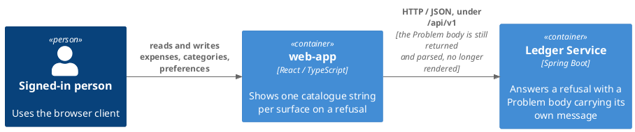
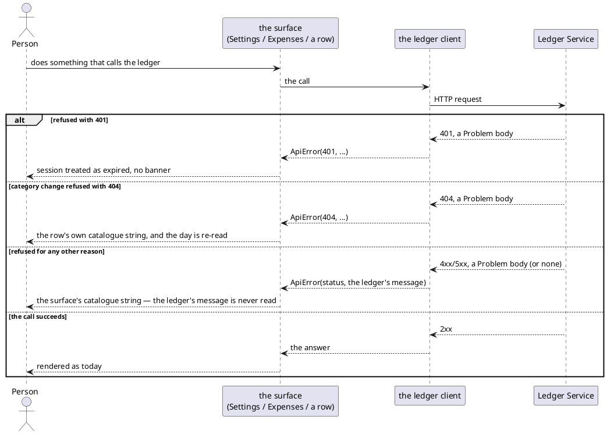

# Design: The Browser Owns Its Refusal Wording

**Affected Modules:** `web-app`

## Objective

Stop showing the ledger's own English `Problem.message` when a call is refused. `SettingsPage` and `ExpensesPage`
put that string on screen at five call sites, and fall back to three more English literals hardcoded beside them
when the body carries none. Those strings are composed in Java and never reach the catalogue, so a translated
surface would still show untranslatable English. `LoginPage` already avoids this, showing `t('signIn.refused')`
regardless of what the ledger said. This change gives every other refusal the same treatment: one catalogue
string per surface, and the ledger's own wording never rendered.

## Context

| What exists                                       | Where                                                                  | What this change does with it                                                    |
|----------------------------------------------------|-------------------------------------------------------------------------|------------------------------------------------------------------------------------|
| The sign-in page's refusal wording                 | `web-app/src/pages/LoginPage.tsx`                                       | Mirrored for the other five call sites — one cause-agnostic catalogue string      |
| The five call sites reading `error.message`        | `web-app/src/pages/SettingsPage.tsx`, `web-app/src/pages/ExpensesPage.tsx` | Stop reading it for display; keep reading `.status` for the 401/404 branches      |
| The English catalogue                               | `web-app/src/i18n/en.ts`                                                | Gains the new keys, namespaced by surface as every other string already is       |
| `ApiError` and how it is built                     | `web-app/src/api/client.ts`                                             | Unchanged — still carries the ledger's message and status, just no longer read for text |
| The browse API's documented failure behaviour       | `web-app/docs/contracts/out/ledger-browse-api.md`                       | Its **When the Call Fails** table is rewritten to match                          |
| The finding this change comes from                 | `docs/implemented/40-set-a-default-currency/review/findings.md`, R2      | The rationale and the five call sites it counted                                 |
| The module's practice of logging nowhere in `src/`  | `web-app/src/theme/theme.ts:34`                                         | No new logging is added; the ledger's raw text is simply not shown, not captured |

## Proposed Solution

Six refusal-handling call sites — `SettingsPage`'s read and its save, `ExpensesPage`'s list/categories/groupings
read and its accept (all funneled through one `report` callback), and `ExpensesPage`'s per-row category change —
stop building their banner text from the caught error and show a fixed catalogue string instead. The string is
chosen by which page-level surface failed, not by the ledger's status or wording, so it needs no translation of
server prose and reads the same for every cause. Each surface keeps branching on `ApiError.status` exactly as
today: 401 still hands off to `sessionExpired` with no banner, and a category change refused with 404 still
re-reads the row's day — only the text shown on the non-branching path changes.

### Diagrams

One module, so nothing crosses that did not already. The `Problem` body is unchanged end to end — `web-app` just
stops putting its `message` field on screen.

### Details

| Surface                                             | New key                          | Reused for                                                        |
|------------------------------------------------------|-----------------------------------|---------------------------------------------------------------------|
| `SettingsPage` (top-of-page and beside the save control) | `settings.refused`               | the preferences read failing, and the write failing                |
| `ExpensesPage`'s page-level banner                    | `listing.refused`                | the listing read, the categories read, the groupings read, and accepting entries all fail through the one `report` callback already |
| `ExpensesPage`'s per-row category control              | `listing.categoryChangeRefused`  | a category change refused for any reason but 401, 404 included    |

This table reuses one key across every action a page shares, which D1 confirms.

`SettingsPage.report` and `ExpensesPage.report` stop branching on `error instanceof Error` for their message, and
branch on `error instanceof ApiError` instead — the same type the 401/404 checks in those functions already test.
`fetch` itself throws a plain `Error`, never an `ApiError`, on a genuine network failure (`client.ts` only builds
one once a `Response` comes back), so a network failure still falls through to the browser's own wording exactly
as it does today; only a call the ledger actually answered — refused or not — shows the surface's fixed string.
This also retires the three hardcoded English fallback literals the finding named (`'That call was not
answered.'`, `'That read was not answered.'`, `'That change was not answered.'`).

`web-app/docs/contracts/out/ledger-browse-api.md`'s **When the Call Fails** table currently says the person is
shown "the ledger's own wording" for four of its seven rows, and a fifth — "A body empty or not JSON" — shows
wording `client.ts` synthesizes from the method, path and status. Both kinds of text come from the same
`ApiError.message`, so both are rewritten to say a fixed, surface-owned string is shown instead, and that neither
kind of message is read for display any longer. The 401 row, the network row and the "nothing is retried" line
are unaffected.

## Acceptance Scenarios

- **A1:** the preferences read is refused
  - Given: the settings page is opened and the ledger refuses the read for a reason other than an expired session
  - When: the read answers
  - Then: `settings.refused` is shown at the top of the page, and no picker is rendered

- **A2:** the preferences write is refused
  - Given: the settings page is on screen with a currency picked, and the ledger refuses the write for a reason
    other than an expired session
  - When: the save control is used
  - Then: `settings.refused` is shown beside the save control, and the picker stands on what was picked

- **A3:** a listing-page read or the acceptance is refused
  - Given: the expenses page is on screen, and the listing read, the categories read, the groupings read, or an
    acceptance is refused for a reason other than an expired session
  - When: that call answers
  - Then: `listing.refused` is shown as the page's own banner, and whatever was already on screen stands

- **A4:** a category change is refused for a reason other than the row moving on
  - Given: an entry's category control is used, and the ledger refuses the change for a reason other than an
    expired session or the entry having moved on
  - When: the change answers
  - Then: `listing.categoryChangeRefused` is shown beside that row, and the row's own category stands unchanged

- **A5:** a category change is refused because the entry moved on
  - Given: an entry's category control is used, and the ledger answers 404 because the row no longer matches what
    the page holds
  - When: the change answers
  - Then: `listing.categoryChangeRefused` is shown beside that row, and the day is re-read exactly as it is today

- **A6:** any of the above is refused because the session expired
  - Given: any of the calls above is made with a session the ledger no longer accepts
  - When: it answers 401
  - Then: the session is treated as expired and no banner is shown, unaffected by this change

- **A7:** the ledger cannot be reached at all
  - Given: any of the calls above fails before a response comes back — a network failure, not a refusal
  - When: `fetch` itself throws
  - Then: the browser's own wording is shown, exactly as it is today, and none of the new catalogue strings apply

## Decisions

- **D1:** On a page whose refusals have more than one moment — `SettingsPage`'s read and its save; `ExpensesPage`'s
  listing read, categories read, groupings read and accept — does every one show the exact same string, or does
  each action get its own?
  - Answer: One shared string per page. `settings.refused` covers both `SettingsPage`'s read and its save;
    `listing.refused` covers `ExpensesPage`'s listing read, categories read, groupings read and accept — as the
    Details table already proposed.
  - Basis: decided — the user chose one shared string per page over one per action, matching `LoginPage`'s single
    `signIn.refused` (2026-08-25).

## Design Findings

Grilled (2026-08-25): empty & extreme data, default state, layout stability, control consistency, colour,
motion, third-party embeds, library cost, locale, reachability, and the mechanism the Proposed Solution names for
telling a refusal apart from a network failure.

| #  | Question                                                              | Answer                                                                                   | Evidence                                                                 |
|----|------------------------------------------------------------------------|---------------------------------------------------------------------------------------------|-----------------------------------------------------------------------------|
| F1 | Does the ledger's raw message still get logged for diagnosis?        | No — nothing is added to log it; the module's own practice is to log nowhere in `src/`      | `web-app/src/theme/theme.ts:34`                                             |
| F2 | Does any refusal keep its own specific wording?                      | No — every non-401 refusal on every surface shows one fixed, surface-owned string          | `web-app/src/pages/LoginPage.tsx` (the one existing precedent)              |
| F3 | Is the 400 "field out of bounds" wording (e.g. `from must be a date`) reachable through the UI, and does it need to survive? | No — `PeriodFilter` only ever emits a preset or an unset pair, never a free-typed day, so the ledger cannot refuse a listing read with a field-validation 400 through this UI | `web-app/src/components/ExpenseFilters.tsx`, `PeriodFilter.tsx`             |
| F4 | Is wording namespaced per surface, consistent with the rest of the catalogue? | Yes — one namespace per page, the way `settings`, `listing` and `signIn` already work        | `web-app/src/i18n/en.ts` (existing namespaces)                              |
| F5 | Does `Problem.message` leave the `ledger-api` contract, or does `WebExceptionHandler` change? | No — nothing else reads it today (`ai-connector-service` never calls `ledger-api`), so `ledger-service` is untouched; revisit if another caller needs the contract to change | `openapi/ledger-api.yaml`, `ledger-service/src/main/java/bot/finance/adapter/web/WebExceptionHandler.java` |
| F6 | Does a network failure (no response at all) still show the browser's own wording, or does it get folded into the fixed string too? | It stays unaffected — the report functions branch on `error instanceof ApiError`, not `instanceof Error`, so a plain `Error` from `fetch` itself falls through untouched | `web-app/src/api/client.ts:31-36` (`ApiError` is only built once a `Response` comes back) |
| F7 | Does the "A body empty or not JSON" row of `ledger-browse-api.md` change too, or only the rows already saying "the ledger's own wording"? | It changes too — its text is `client.ts`-synthesized but reaches the screen through the same `ApiError.message` the surface stops reading, so five of the seven rows change, not four | `web-app/src/api/client.ts:31-36`, `web-app/docs/contracts/out/ledger-browse-api.md` |
| F8 | Do the plain-`Error` diagnostic literals a malformed 2xx body throws (`expenses.ts`, `preferences.ts`) belong to this design too? | No — deferred. They're the same class of untranslatable literal, but outside this design's objective (a refusal's `Problem.message`); revisit if a future review tallies them the way R2 tallied these five call sites | `web-app/src/api/expenses.ts:55,68`, `web-app/src/api/preferences.ts:12,25` |
| F9 | The three retired fallback literals were the `else` of `error instanceof Error`, not of `ApiError` — what does a rejection that is neither an `ApiError` nor an `Error` show once the branch changes? | The surface's catalogue string, same as an `ApiError` — every throw in `api/` is an `Error` or `ApiError` today, so this path is unreached defensive typing (`unknown` in a `catch`), and folding it into the catalogue string finishes retiring the literals instead of leaving one behind | `web-app/src/api/{client,expenses,preferences,session}.ts` (every `throw` is `new Error(...)` or `new ApiError(...)`) |
