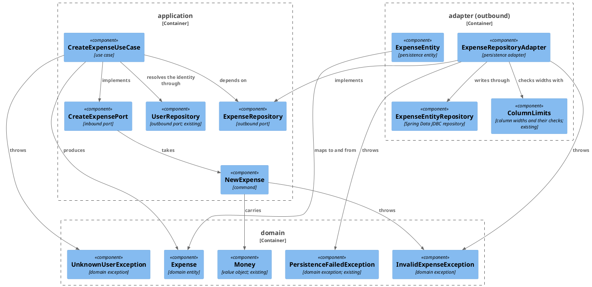
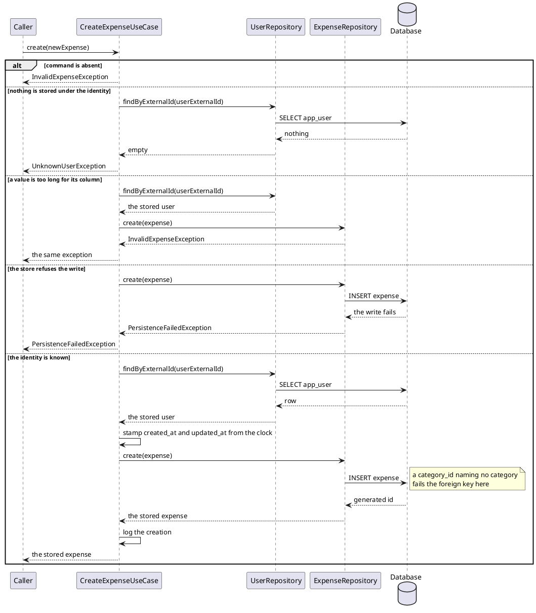

# Plan: Create an Expense

**Affected Modules:** `ledger-service`

## Objective

Give the service a use case that records one expense against an existing user and stores it. The caller supplies
the identity the user is known by, what was spent, what it was for, and optionally where — the use case resolves
the user, stamps the row's timestamps, and stores it.

Nothing drives the use case yet — this plan adds the inbound port and its implementation, not a caller, following
the same shape as [Initialize a new user](../3-initialize-a-new-user/plan.md).

## Proposed Solution

### The row

The schema the request names, mapped onto the module's existing types:

| Column                | Type           | From                                                        |
|-----------------------|----------------|-------------------------------------------------------------|
| `id`                  | `BIGSERIAL`    | generated                                                   |
| `user_id`             | `BIGINT`       | the user the external identity resolves to                  |
| `category_id`         | `BIGINT`       | `NewExpense.categoryId`                                     |
| `description`         | `VARCHAR(500)` | `NewExpense.description`                                    |
| `merchant`            | `VARCHAR(255)` | `NewExpense.merchant`, nullable, blank normalized to absent |
| `amount_minor_units`  | `BIGINT`       | `Money.minorUnits`                                          |
| `currency_code`       | `VARCHAR(3)`   | `Money.currencyCode`                                        |
| `created_at`          | `TIMESTAMPTZ`  | stamped by the use case                                     |
| `updated_at`          | `TIMESTAMPTZ`  | stamped by the use case, equal to `created_at` at creation  |

Amount and currency are one domain concept — `Money` — split across two columns, as `Money` already models a
currency and its minor units. The `>= 0` check restates `Money`'s own invariant at the column, so a row written
by anything but this adapter cannot violate it either.

Every expense is filed under a category. The command carries the category's database id (**Q5**), so the use case
resolves nothing and an id naming no category is rejected by the foreign key like any other bad write. The
category is not cascade-deleted through: a category with expenses against it cannot be removed until they are
dealt with.

A present-but-blank merchant is normalized to absent rather than rejected — the general rule **F3** settles, and
one this module had not written down before.

### Time

The timestamps are stamped by the use case from a `java.time.Clock` taken on its constructor. A clock is a
dependency like any other and injecting it is what makes the stamped values assertable; `Instant.now()` inside
the domain would not be. `java.time` is JDK, so the core stays framework-free. The production clock is
`Clock.systemUTC()`, constructed where the use case is wired rather than declared as a bean of its own —
`adapter/config` holds use-case wiring and nothing else.

`TIMESTAMPTZ` stores microseconds, `Instant` carries nanoseconds. A value written and read back is therefore the
stamped instant truncated to microseconds, which the round-trip test asserts rather than exact equality.

Found while implementing GI01: the JDBC driver **rounds** the sub-microsecond remainder rather than truncating it,
so `…123456789` came back as `…123457`. The adapter truncates to microseconds before saving, which makes the
round trip exact and what is stored equal to what a reader of the domain object sees.

### Domain

`domain/model/Expense` — an entity carrying an optional database id, the owning user's database id, the
category's database id, the description, an optional merchant, the `Money`, and the two timestamps. Built through
`newExpense(long userId, long categoryId, String description, Optional<String> merchant, Money money, Instant
now)` — which stamps both timestamps from `now` — or `stored(...)` taking every field. Identity is the database
id: two stored
expenses are the same expense when their ids match, and an unstored one equals only itself. `Expense` validates
nothing; `NewExpense` checks upstream of every production call site and the column widths belong to the adapter,
the split [ADR 0004](../ledger-service/docs/adr/0004-column-widths-are-checked-in-the-persistence-adapter.md)
already settled.

`domain/exception/InvalidExpenseException` — the command's own rejections.

`domain/exception/UnknownUserException` — no user is stored under the given identity. A distinct case from
`InvalidUserException`: the identity is well-formed, it just names nobody.

### Application

`application/dto/NewExpense` — the inbound-port command, a record
`(String userExternalId, long categoryId, String description, Optional<String> merchant, Money money)` validating
itself: a blank external id throws `InvalidUserException`, a blank description, a non-positive category id, or an
absent `merchant`/`money` throws `InvalidExpenseException`. A merchant that is present but blank is normalized to
`Optional.empty()`.

`application/port/CreateExpensePort` — `Expense create(NewExpense newExpense)`.

`application/port/ExpenseRepository` — `Expense create(Expense expense)`.

`application/usecase/CreateExpenseUseCase` — resolves the external identity through the existing `UserRepository`,
throws `UnknownUserException` when nothing is stored under it, builds the `Expense` with the clock's instant,
stores it, and logs the creation.

`adapter/config/UseCaseConfiguration` gains the `CreateExpensePort` bean.

### Persistence

`adapter/persistence/ExpenseEntity` — `record ExpenseEntity(@Id Long id, Long userId, Long categoryId, String
description, String merchant, long amountMinorUnits, String currencyCode, Instant createdAt, Instant updatedAt)`
annotated
`@Table("expense")`, with `toDomain()` and `static fromDomain(Expense)`. The optional merchant is a nullable
column and an `Optional` in the domain; the entity is where the two meet.

`adapter/persistence/ExpenseEntityRepository extends CrudRepository<ExpenseEntity, Long>` — `save` on an entity
whose id is absent inserts.

`adapter/persistence/ExpenseRepositoryAdapter` — a `@Component` implementing `ExpenseRepository`. It checks the
column widths through `ColumnLimits` before writing, and translates every runtime exception its infrastructure
raises into `PersistenceFailedException`. A `user_id` or `category_id` naming no stored row fails the foreign key,
which is a storage failure like any other and reaches the caller as `PersistenceFailedException` — the use case
has already rejected the unknown-identity case by then.

`ColumnLimits` gains `DESCRIPTION = 500`, `MERCHANT = 255` and `CURRENCY_CODE = 3`, plus the checks for the first
two. Currency needs no check: `CurrencyCode` accepts only ISO 4217 codes, which are three characters. The
constant still earns its place, because `ColumnLimitsSchemaTest` reads the live schema and fails if a migration
and a constant disagree.

Migration `src/main/resources/db/migration/V002__create_expense.sql`:

```sql
CREATE TABLE expense (
    id                 BIGSERIAL    PRIMARY KEY,
    user_id            BIGINT       NOT NULL REFERENCES app_user (id) ON DELETE CASCADE,
    category_id        BIGINT       NOT NULL REFERENCES category (id),
    description        VARCHAR(500) NOT NULL,
    merchant           VARCHAR(255),
    amount_minor_units BIGINT       NOT NULL CHECK (amount_minor_units >= 0),
    currency_code      VARCHAR(3)   NOT NULL,
    created_at         TIMESTAMPTZ  NOT NULL,
    updated_at         TIMESTAMPTZ  NOT NULL
);

CREATE INDEX idx_expense_user_created_at ON expense (user_id, created_at DESC);
```

The index is what every future read of a user's spending will go through — newest first, per user.

`category_id` carries no `ON DELETE` clause, so a category cannot be deleted while expenses reference it. The
cascade `user_id` carries is deliberate the other way: deleting a user takes their categories *and* their
expenses, since neither means anything without them.

Files touched: `V002__create_expense.sql`, `InvalidExpenseException`, `UnknownUserException`, `Expense`,
`NewExpense`, `CreateExpensePort`, `ExpenseRepository`, `CreateExpenseUseCase`, `ExpenseEntity`,
`ExpenseEntityRepository`, `ExpenseRepositoryAdapter`, `ColumnLimits`, `UseCaseConfiguration`,
`docs/conventions/code-style.md` for the optional-text rule, and `docs/conventions/testing.md` for the new shared
test helpers.

#### Diagrams

There is no inbound-adapter boundary below: nothing drives `CreateExpensePort` yet, which is also why this plan
has no system-test phase.





## Step-by-Step Implementation Map (To-Do List)

### Stabilization

#### Database

- [x] ST01 · Add migration `src/main/resources/db/migration/V002__create_expense.sql` with the table and index
  given under **Persistence**, verbatim

#### Interface-First / Build Stabilization

**Interface & Signature Sync**

- [x] ST02 · Add `domain/exception/InvalidExpenseException` and `domain/exception/UnknownUserException`, both
  unchecked, shaped like the existing `InvalidUserException`
- [x] ST03 · Add `domain/model/Expense` — a final class holding `Long id`, `long userId`, `long categoryId`,
  `String description`, `String merchant` (nullable), `Money money`, `Instant createdAt`, `Instant updatedAt`,
  with `newExpense(long userId, long categoryId, String description, Optional<String> merchant, Money money,
  Instant now)`, `stored(long id, long userId, long categoryId, String description, Optional<String> merchant,
  Money money, Instant createdAt, Instant updatedAt)`, and the accessors `Optional<Long> id()`, `long userId()`,
  `long categoryId()`, `String description()`, `Optional<String> merchant()`, `Money money()`,
  `Instant createdAt()`, `Instant updatedAt()`. It validates nothing (see **Domain**). No `equals`/`hashCode`
  yet; identity semantics are GU01's target
- [x] ST04 · Add `application/dto/NewExpense` as
  `record NewExpense(String userExternalId, long categoryId, String description, Optional<String> merchant, Money
  money)` with a stub compact constructor:
  ```java
  public NewExpense {
      // rejects an absent or blank external id with InvalidUserException; rejects a category id
      // that is not positive, an absent or blank description, an absent merchant Optional, and
      // an absent money with InvalidExpenseException;
      // normalizes a present-but-blank merchant to Optional.empty()
  }
  ```
- [x] ST05 · Add `application/port/CreateExpensePort` with `Expense create(NewExpense newExpense)`, documenting
  the runtime exceptions it throws as `@throws` javadoc — `InvalidExpenseException`, `UnknownUserException`,
  `PersistenceFailedException`
- [x] ST06 · Add `application/port/ExpenseRepository` with `Expense create(Expense expense)` and the same
  `@throws` javadoc — `InvalidExpenseException` for a column-width violation, `PersistenceFailedException` for a
  failed write
- [x] ST07 · Add `application/usecase/CreateExpenseUseCase` implementing `CreateExpensePort`, taking
  `UserRepository`, `ExpenseRepository`, `Clock` and `LoggerFactory` on its constructor, with a stubbed
  `create()`:
  ```java
  public Expense create(NewExpense newExpense) {
      // rejects an absent command; resolves the external id through UserRepository and throws
      // UnknownUserException when nothing is stored under it; builds the Expense against the
      // resolved user's database id and the command's category id, with Instant.now(clock);
      // stores it, logs the creation at info level, and returns what was stored
      return null;
  }
  ```
- [x] ST08 · Add `adapter/persistence/ExpenseEntity` as
  `record ExpenseEntity(@Id Long id, Long userId, Long categoryId, String description, String merchant, long
  amountMinorUnits, String currencyCode, Instant createdAt, Instant updatedAt)` annotated `@Table("expense")` —
  complete, including
  `toDomain()` and `static fromDomain(Expense expense)`. All components stay on the canonical constructor so
  `JdbcAggregateTemplate` can read rows back in `ExpenseRepositoryAdapterTest`
- [x] ST09 · Add `adapter/persistence/ExpenseEntityRepository extends CrudRepository<ExpenseEntity, Long>`, with
  no methods of its own
- [x] ST10 · Extend `adapter/persistence/ColumnLimits` with `DESCRIPTION = 500`, `MERCHANT = 255` and
  `CURRENCY_CODE = 3`, and with `static void validateExpenseText(String description, String merchant)` —
  **written complete, not stubbed**, like the existing `validateExternalId`: it rejects an absent description, a
  description over 500 characters, and a merchant over 255 characters with `InvalidExpenseException`, and lets an
  absent merchant through. No later step owns this method — GI01's agent may touch only
  `ExpenseRepositoryAdapter`, and `ColumnLimitsSchemaTest` never calls it — so RI01's over-length scenarios go
  green on what this step writes.
  `CURRENCY_CODE` gets no check — `CurrencyCode` accepts only three-character ISO 4217 codes. The constant exists
  for `ColumnLimitsSchemaTest`
- [x] ST11 · Add `adapter/persistence/ExpenseRepositoryAdapter` as a `@Component` implementing
  `ExpenseRepository`, taking `ExpenseEntityRepository` on its constructor, with a stubbed method:
  ```java
  public Expense create(Expense expense) {
      // checks the column widths through ColumnLimits before writing anything; saves the
      // entity mapped from the domain; translates every runtime exception into
      // PersistenceFailedException; returns the expense carrying its generated id
      return null;
  }
  ```
- [x] ST17 · Write the optional-text rule into `ledger-service/docs/conventions/code-style.md`, under
  **Application** beside the existing command-validation rule: a command's optional text field normalizes a
  present-but-blank value to `Optional.empty()` rather than rejecting it, so absence has one representation by the
  time anything downstream reads it. The rule is general (**F3**), and `NewExpense.merchant` is only its first
  application — without it written down the next optional field decides again from scratch

**Configuration**

- [x] ST12 · Add the `CreateExpensePort` bean method to `adapter/config/UseCaseConfiguration`, wired from
  `UserRepository`, `ExpenseRepository` and `LoggerFactory`, and passing `Clock.systemUTC()` constructed inside
  the method. No `Clock` bean is declared: `adapter/config` holds use-case wiring and nothing else

**Shared Test Infrastructure**

- [x] ST13 · Add `bot.finance.common.ExpenseRowUtils` with
  `static List<ExpenseEntity> expenseRowsFor(JdbcAggregateTemplate jdbcAggregateTemplate, long userId)`, shaped
  like the existing `CategoryRowUtils`, and list it in the package-structure tree in
  `ledger-service/docs/conventions/testing.md`
- [x] ST14 · Add `bot.finance.common.UserRowUtils` with
  `static long storedUserId(UserEntityRepository repository, String externalId)` — every expense test needs a
  stored user row before it can write an expense, since `expense.user_id` is a foreign key. List it in the same
  tree
- [x] ST16 · Extend `bot.finance.common.CategoryRowUtils` with
  `static long storedCategoryId(JdbcAggregateTemplate jdbcAggregateTemplate, long userId, String name)`, writing
  one root category row and returning its generated id — `expense.category_id` is a foreign key, so every expense
  test needs one

**Close-out**

- [x] ST15 · Compile the module and confirm `bot.finance.architecture.CleanArchitectureTest` still passes ·
  after: ST01, ST02, ST03, ST04, ST05, ST06, ST07, ST08, ST09, ST10, ST11, ST12, ST13, ST14, ST16, ST17

### Red Phase

#### TDD Unit Red Phase

- [x] RU01 · `Expense` · test: `ExpenseTest` · covers: `newExpense()`, `stored()`, `equals()`, `hashCode()`
    - `newExpense()`:
        - given: a user id, a category id, a description, a merchant, a money and an instant
          when: newExpense() is called
          then: returns an expense carrying all of them, with no database id, and with both timestamps equal to
          that instant
        - given: an absent merchant
          when: newExpense() is called
          then: returns an expense whose merchant is empty
    - `stored()`:
        - given: a database id and every other field, with a created_at earlier than its updated_at
          when: stored() is called
          then: returns an expense carrying all of them, each timestamp unchanged
    - `equals()`:
        - given: two stored expenses with the same database id but every other field different
          when: they are compared
          then: they are equal and their hash codes match — the database id is the identity
        - given: two stored expenses with different database ids
          when: they are compared
          then: they are not equal
        - given: two unstored expenses built from identical fields
          when: they are compared
          then: they are not equal — an expense with no id is only itself
- [x] RU02 · `NewExpense` · test: `NewExpenseTest` · covers: `NewExpense()`
    - `NewExpense()`:
        - given: a user external id that is absent, empty, or only whitespace
          when: the record is constructed
          then: throws InvalidUserException
        - given: a description that is absent, empty, or only whitespace
          when: the record is constructed
          then: throws InvalidExpenseException
        - given: a category id of zero or negative
          when: the record is constructed
          then: throws InvalidExpenseException
        - given: an absent merchant Optional
          when: the record is constructed
          then: throws InvalidExpenseException — absence is `Optional.empty()`, never null
        - given: a merchant that is present but empty or only whitespace
          when: the record is constructed
          then: the record's merchant is `Optional.empty()` — a blank optional value is normalized to absent,
          never stored as whitespace (**F3**)
        - given: an absent money
          when: the record is constructed
          then: throws InvalidExpenseException
        - given: every field present, the merchant a non-blank name
          when: the record is constructed
          then: the record carries them unchanged
- [x] RU03 · `CreateExpenseUseCase` · test: `CreateExpenseUseCaseTest` · covers: `create()`
    - `create()`:
        - given: a user stored under the command's external id and a clock fixed at a known instant
          when: create() is called
          then: the expense repository is asked to store an expense carrying that user's database id and the
          command's category id, description, merchant and money, with both timestamps equal to the clock's
          instant; the stored expense is returned
        - given: nothing stored under the command's external id
          when: create() is called
          then: throws UnknownUserException and the expense repository is untouched
        - given: an absent command
          when: create() is called
          then: throws InvalidExpenseException and neither repository is touched
        - given: a stored user, and an expense repository that raises PersistenceFailedException
          when: create() is called
          then: the exception reaches the caller unchanged and is not swallowed or retried
        - given: a user repository that raises PersistenceFailedException while resolving the identity
          when: create() is called
          then: the exception reaches the caller unchanged and the expense repository is untouched

#### TDD Integration Red Phase

- [x] RI01 · `ExpenseRepositoryAdapter` · test: `ExpenseRepositoryAdapterTest` · covers: `create()`
    - `create()`:
        - given: a stored user, a stored category, and an unstored expense carrying a merchant
          when: create() is called
          then: one expense row exists for that user carrying the category id, description, merchant, minor units
          and currency code given, and the returned expense carries its generated database id
        - given: a stored user, a stored category, and an unstored expense with no merchant
          when: create() is called
          then: the row's merchant column is null and the returned expense's merchant is empty
        - given: a stored user, a stored category, and an unstored expense stamped with an instant carrying
          nanosecond precision
          when: create() is called and the row is read back
          then: both timestamps equal that instant truncated to microseconds — what `TIMESTAMPTZ` stores
        - given: a stored user, a stored category, and an expense whose description is absent
          when: create() is called
          then: throws InvalidExpenseException before anything is written, rather than failing the NOT NULL
          constraint downstream
        - given: a stored user, a stored category, and an expense whose description is exactly 500 characters
          when: create() is called
          then: the row is written and carries the whole description
        - given: a stored user, a stored category, and an expense whose description is 501 characters
          when: create() is called
          then: throws InvalidExpenseException before anything is written, so no expense row exists afterwards
        - given: a stored user, a stored category, and an expense whose merchant is exactly 255 characters
          when: create() is called
          then: the row is written and carries the whole merchant
        - given: a stored user, a stored category, and an expense whose merchant is 256 characters
          when: create() is called
          then: throws InvalidExpenseException before anything is written
        - given: a stored category and an expense whose user id names no stored user
          when: create() is called
          then: throws PersistenceFailedException carrying the framework exception as its cause — the foreign key
          rejects the write
        - given: a stored user and an expense whose category id names no stored category
          when: create() is called
          then: throws PersistenceFailedException carrying the framework exception as its cause
        - given: a mocked store that raises a non-constraint failure
          when: create() is called
          then: throws PersistenceFailedException carrying the framework exception as its cause, so no framework
          type crosses the port
        - given: two expenses created for two different stored users, each with its own stored category
          when: create() is called for each
          then: each user owns exactly its own row, and neither references the other's
- [x] RI02 · `ColumnLimits` · test: `ColumnLimitsSchemaTest` · covers: `DESCRIPTION`, `MERCHANT`,
  `CURRENCY_CODE`
    - `DESCRIPTION`:
        - given: the migrated schema in the containerized database
          when: `expense.description`'s `character_maximum_length` is read from `information_schema.columns`
          then: it equals the constant
    - `MERCHANT`:
        - given: the migrated schema in the containerized database
          when: `expense.merchant`'s `character_maximum_length` is read
          then: it equals the constant
    - `CURRENCY_CODE`:
        - given: the migrated schema in the containerized database
          when: `expense.currency_code`'s `character_maximum_length` is read
          then: it equals the constant
    - The existing `ExternalId` and `CategoryName` nested classes are untouched; this step adds three beside them
      against the same `COLUMN_WIDTH_QUERY`

### Green Phase

#### TDD Unit Green Phase

- [x] GU01 · `Expense` · test: `ExpenseTest`
- [x] GU02 · `NewExpense` · test: `NewExpenseTest`
- [x] GU03 · `CreateExpenseUseCase` · test: `CreateExpenseUseCaseTest` · after: GU01, GU02

#### TDD Integration Green Phase

- [x] GI01 · `ExpenseRepositoryAdapter` · test: `ExpenseRepositoryAdapterTest` · after: GU01
- [x] GI02 · `ColumnLimits` · test: `ColumnLimitsSchemaTest`

## Open Questions / Blockers

- **Q1:** The requested schema carries no category, while `ExpenseIntent` already carries a `categoryName` and
  every user is created with 97 categories. An expense stored by this plan is therefore uncategorized, and adding
  the column later is a second migration plus a backfill decision for the rows written in between. Should
  `expense` carry a nullable `category_id` from the start, or is uncategorized deliberate for now?
- A: oh my, category id is required, I forgot to mention it.
  Applied — `expense.category_id` is `NOT NULL REFERENCES category (id)` with no `ON DELETE` clause, and the id
  runs through `NewExpense`, `Expense` and `ExpenseEntity`. How the caller names the category is **Q5**.

- **Q2:** `description` is capped at 500 characters and `merchant` at 255. Neither was specified. Confirm, or give
  the widths the product wants — the caps land in `V002` and in `ColumnLimits`, and changing them afterwards is a
  new migration.
- A: confirmed.

- **Q3:** `NewExpense` carries the external identity and the use case rejects an unknown one with
  `UnknownUserException`. The alternative is to create the user on the spot through the existing
  `InitializeUserPort`, so a person's first message can be an expense rather than requiring a separate
  initialization. Which does the product want?
- A: let's reject the new expense if the user is unknown.

- **Q4:** No caller exists, so this plan has no system-test phase and the port is unreachable at runtime — the
  same position [plan 3](../3-initialize-a-new-user/plan.md) ended in. Confirm nothing should reach the
  port in this plan.
- A: confirmed.

- **Q5:** **Q1** makes `category_id` required, so the command must carry the category somehow. By name — matching
  `ExpenseIntent.categoryName`, but needing a `CategoryRepository`, a resolution rule and an answer for a name
  that matches twice (`Travel` is a group and a child of Insurance) — or by database id?
- A: by database id. `NewExpense` carries `long categoryId` and the use case passes it through; an id naming no
  category is rejected by the foreign key as a storage failure. No resolution port, no ambiguity rule. Whatever
  eventually drives this port and holds only a category *name* resolves it on its own side.

## Review Findings

- **F1:** ST10 stubbed `ColumnLimits.validateExpenseText` while no later step owned implementing it, so RI01's
  over-length scenarios could never go green.
- Resolution: mechanical
- Action: applied — ST10 now writes the method complete, with the reason it cannot be deferred.

- **F2:** RI01 had no scenario for an absent description, though ST10's check rejects one.
- Resolution: mechanical
- Action: applied — added the scenario to RI01's `create()`.

- **F3:** A present-but-blank merchant (`Optional.of("   ")`) is unvalidated everywhere and reaches the column as
  whitespace, while the sibling `description` is blank-checked in `NewExpense`. Reject, normalize to
  `Optional.empty()`, or store as given — plus the matching RU02 scenario.
- Resolution: decision
- Action: general rule: if an optional field is present but blank, then map it to an empty column.
  Applied — `NewExpense` normalizes a present-but-blank merchant to `Optional.empty()` (ST04), with a matching
  RU02 scenario, and ST17 writes the rule into `code-style.md` so it holds for every optional field after this
  one.

- **F4:** ST12 declared a `Clock` bean in `adapter/config`, which the architecture conventions reserve for
  use-case wiring and "nothing else".
- Resolution: decision
- Action: resolved against the repository — `architecture.md` ("Use-case wiring is the exception, living in
  `adapter/config`, which holds nothing else") rules out a second bean there, and a separate configuration class
  for one JDK factory call buys nothing. ST12 now constructs `Clock.systemUTC()` inside the `createExpensePort`
  bean method; no `Clock` bean exists. **Time** and **Application** updated to match.

Re-review (2026-07-29):

- **F5:** RI01's unknown-category scenario asserted "no expense row exists afterwards" after a real foreign-key
  violation, which the aborted transaction makes unreadable rather than empty.
- Resolution: mechanical
- Action: applied — dropped the trailing clause; the over-length scenarios keep theirs, rejecting before any
  statement runs.

- **F6:** Only RI01's first scenario named a stored category, though `expense.category_id` is now
  `NOT NULL REFERENCES category (id)` and every write needs one.
- Resolution: mechanical
- Action: applied — every RI01 scenario that reaches a write now names a stored category in its `given:`.

- **F7:** **Files touched** omitted `docs/conventions/testing.md`, which ST13 and ST14 edit.
- Resolution: mechanical
- Action: applied — added it to the list.
