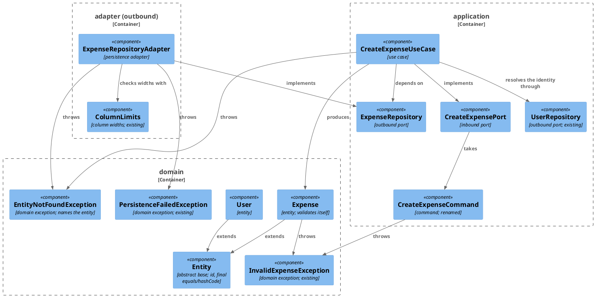
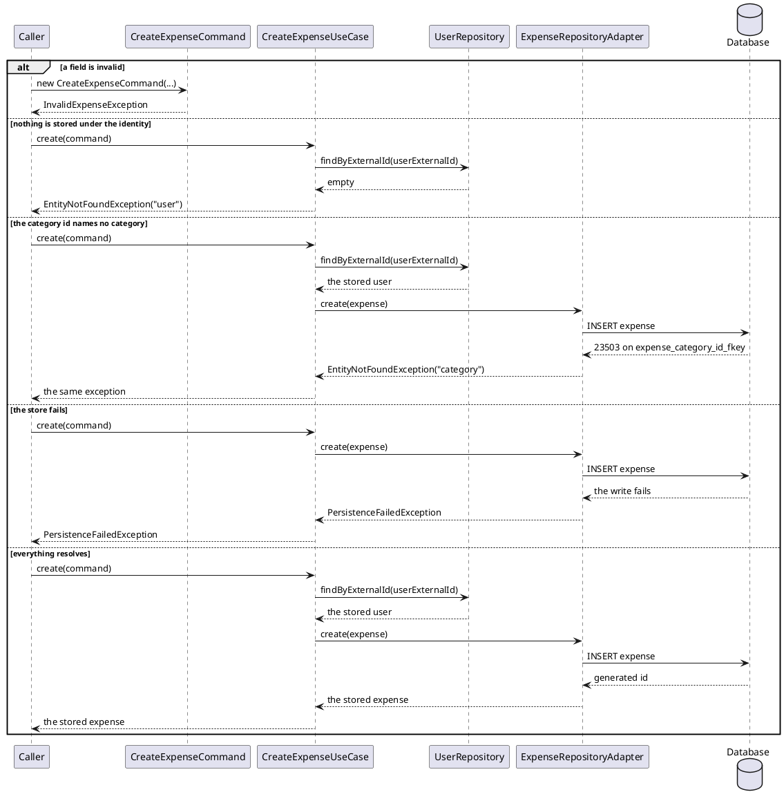

# Plan: Bring the Domain Under the Entity, Not-Found and Command-Naming Rules

**Affected Modules:** `ledger-service`, `ai-connector-service`

## Objective

Follow-up to [Create an expense](../5-create-expense/5-plan-create-expense.md). Four conventions
[`code-style.md`](../ledger-service/docs/conventions/code-style.md) now states are unmet by the code that plan
produced, and two documentation pages hold facts they do not own:

1. an entity asserts its own required fields — `Expense` asserts none;
2. a reference to something that is not stored raises a not-found exception — an unknown `category_id` surfaces
   as `PersistenceFailedException`, and `UnknownUserException` is a name of its own rather than the rule's;
3. an inbound-port command is named `<UseCase>Command` — `NewExpense` is not;
4. entities extend `domain/model/Entity`, which owns identity — no such base exists, and `User` is equal by
   external id.

Plus: `docs/adr/0007` records product behaviour, and six `docs/domain/` pages across the two services describe
`application/dto` records on the domain layer's pages. Everything but those six pages is `ledger-service`;
`ai-connector-service` is here for that one correction (**Q5**).

## Proposed Solution

### `domain/model/Entity`

```java
public abstract class Entity {

    private final Long id;

    protected Entity(Long id) {
        this.id = id;
    }

    public Optional<Long> id() {
        return Optional.ofNullable(id);
    }

    @Override
    public final boolean equals(Object other) { … }

    @Override
    public final int hashCode() { … }
}
```

Four details the rule leaves open, settled here:

- **Same concrete class, same id.** `getClass() != other.getClass()` rejects, so a future `Expense` subtype and an
  `Expense` never match. `instanceof Entity` would make any two entity types with id 7 equal, since the only field
  the comparison reads lives on the shared supertype.
- **Reference equality while the id is absent.** `id == null` returns `this == other`; two unstored entities built
  from identical fields are different things until the store gives them names.
- **`System.identityHashCode(this)` for an absent id**, so an unstored entity's hash is stable across calls and
  distinct per instance, matching what its `equals` promises. `Objects.hashCode(null)` would collapse every
  unstored entity into bucket 0.
- **`final`**, so no subclass reintroduces attribute equality. What `final` cannot enforce is a class that never
  extends `Entity` at all — that is the ArchUnit rule below.

`Expense` and `User` extend it, pass their id to `super`, and lose their own `id` field, `id()` accessor,
`equals` and `hashCode`. `domain/value` records are untouched: they are equal by attributes by definition.

`CleanArchitectureTest` gains `everyDomainModelClassIsAnEntity` — every class in `bot.finance.domain.model` is
assignable to `Entity`. The rule filters out `package-info` and test classes: `@AnalyzeClasses(packages =
"bot.finance")` imports the test classpath too, and `ExpenseTest`/`UserTest` reside in the same package.
`areTopLevelClasses()` drops nested test fixtures and `@Nested` groups, `haveSimpleNameNotEndingWith("Test")` the
test classes themselves — narrower than `ImportOption.DoNotIncludeTests`, which would silently shrink the scope of
the three rules already in the file.

`User`'s identity becomes its id, reversing **Q6** of [plan 3](../3-initialize-a-new-user/3-plan-initialize-a-new-user.md). Nothing
in production compares users: `InitializeUserUseCase` returns what the repository hands back. The only assertions
that rest on external-id equality are `UserTest`'s own, which RU03 deletes; `UserRepositoryAdapterConcurrencyTest`
compares two `User`s as well, but both racing callers resolve to the same row, so the assertion becomes id
equality and holds unchanged.

### `Expense` validates itself

Both factories run the same assertions, throwing `InvalidExpenseException`: a description that is present and not
blank, a `Money`, a positive `userId` and `categoryId`, a `merchant` `Optional` that is present (absence is
`Optional.empty()`), and both instants. Column widths stay with the persistence adapter
([ADR 0004](../ledger-service/docs/adr/0004-column-widths-are-checked-in-the-persistence-adapter.md)).

**Where the command and the entity overlap, and why it is not double validation.** `CreateExpenseCommand` checks a
positive category id, a non-blank description, a present merchant `Optional` and a present money — all four also
asserted by `Expense`. It additionally checks `userExternalId`, which the entity never carries; the entity
additionally asserts `userId` and the two instants, which the command never carries. The rule warns against a use
case re-checking the fields of the command it was handed: one path, two checks of the same input, drifting apart
with no authoritative one. These are two objects with different reachability. `ExpenseRepository.create(Expense)`
and `ExpenseEntity.toDomain()` build an `Expense` with no command anywhere in the call, and the entity's
assertions are the only thing standing there. The command's are what turns bad input into a rejection at the
boundary, before a user lookup runs.

Consequences the plan carries:

- `ExpenseEntity.toDomain()` runs the invariants on read, so a row that violates them fails loudly instead of
  producing an impossible entity.
- `ColumnLimits.validateExpenseText`'s `description == null` branch becomes unreachable and is deleted, together
  with `ExpenseRepositoryAdapterTest`'s absent-description scenario — the adapter can no longer be handed such an
  expense.
- `ExpenseRepositoryAdapterTest`'s two foreign-key scenarios use `-1L` as the unknown id. A negative id no longer
  constructs, so they move to a positive id naming no row.

`User` follows the same pattern (**Q3** — every domain object validates itself): `newUser`/`stored` assert a
present, non-blank external id with `InvalidUserException`, `ColumnLimits.validateExternalId`'s null branch goes
dead with it, and `UserRepositoryAdapterTest`'s `User.newUser(null)` scenario goes with the branch.

### Not found is not a storage failure

`domain/exception/UnknownUserException` is deleted. In its place, one type naming the entity it did not find
(**Q1**):

```java
public class EntityNotFoundException extends RuntimeException {

    private final String entityType;

    public EntityNotFoundException(String entityType, String message) { … }

    public String entityType() { … }
}
```

`entityType` is text, not a `Class`: the missing category is a `domain/value/Category`, not an entity class, so
there is no common type to name it by. Accessor without a `get` prefix, as everywhere else in the module.

It is raised in three places: by `CreateExpenseUseCase` (`"user"`) when nothing is stored under the command's
external id, and by `ExpenseRepositoryAdapter` when the write is rejected by `expense_category_id_fkey`
(`"category"`) or `expense_user_id_fkey` (`"user"`). The rule says the use case and the adapter alike, and the
adapter is reachable through `ExpenseRepository` without the use case.

`PersistenceFailedException` goes back to meaning the store failed, and covers everything else.

How the adapter tells them apart: it walks the cause chain of the runtime exception for a `java.sql.SQLException`
whose SQLState is `23503` (`foreign_key_violation`), then reads the constraint name out of that exception's
message — `expense_category_id_fkey` or `expense_user_id_fkey`, the names Postgres generated for `V002`'s two
unnamed `REFERENCES` clauses. Anything else, including a `23503` whose constraint is neither, stays
`PersistenceFailedException`; the fallback is what keeps a future third foreign key from silently reporting a
missing category.

`CreateExpensePort` and `ExpenseRepository` document it in their `@throws` javadoc.

### `<UseCase>Command`

Every inbound-port command is renamed (**Q2**): `NewExpense` → `CreateExpenseCommand`, `NewUser` →
`InitializeUserCommand`, `IncomingMessage` → `HandleIncomingMessageCommand`, each with its port, use case, mapper
and tests. `IntentExtractionRequest` is the input of an *outbound* port and keeps its name, which the rule says
outright — it is the fourth and last record in `application/dto`.

The naming is then enforced. A rule over the `dto` package itself cannot express it, because
`IntentExtractionRequest` belongs there and must not end in `Command`; what the convention actually says is a
property of the *port*, so the rule reads the port: for every interface in `application/port` implemented by a
class in `application/usecase` — which is what makes a port inbound, and is why the adapter-implemented
`IntentExtractionPort` is not caught — every parameter type of its methods that lives in `application/dto` is
named `<use case name minus `UseCase`>Command`. A custom `ArchCondition` in `CleanArchitectureTest`, since no
built-in predicate relates two classes this way.

`ai-connector-service` gets the same treatment (**F14**), since a rule that holds in one of two services is not a
convention: `IntentExtractionCommand` → `ExtractIntentsCommand`, the rule written into that module's own
`code-style.md` — which states the command *validation* rule but not the naming one — and the same enforcement
rule in its `CleanArchitectureTest`, whose package roots are `bot.finance.ai.*`. `RawIntent` is an outbound
port's result and keeps its name, the case that module's code-style already carves out.

The archived plans in `docs/implemented/` keep the old names. They are history.

### Documentation

- `ledger-service/docs/adr/0007-a-category-is-named-by-its-stored-id.md` is deleted. Number 0007 is not reused.
  What survives is a clause on the Rules line in `create-an-expense.md` that already states the rule: a name is
  ambiguous per parent, so the caller resolves it.
- `docs/domain/` is for the domain layer, and every `application/dto` page there is deleted, its content folded
  into the page that owns it (**Q5** — the rule holds uniformly, so the reach is all four, not the two that
  prompted it): `new-expense.md` and `new-user.md` into the Rules of `create-an-expense.md` and
  `initialize-a-new-user.md`, `incoming-message.md` into `handle-incoming-message.md`'s, and
  `intent-extraction-request.md` into `contracts/out/ai-connector.md`, the boundary whose input it describes.
  Inbound links: `domain/expense.md` (one bullet), `create-an-expense.md` (two references) and
  `handle-incoming-message.md` (one); nothing links to `intent-extraction-request.md`.
- `ai-connector-service` carries the same two-page version of the defect, and its `orientation.md` says
  `docs/domain/` holds one page per value object: `intent-extraction-command.md` folds into
  `usecases/extract-intents.md`'s Rules, `raw-intent.md` into `contracts/out/ai-provider.md` — where the
  provider's answers come from, and where "every field may be absent" is a property of that boundary. Nothing
  links to either.
- `domain/user.md`'s "the identity is the user" invariant and `domain/expense.md`'s identity invariant are
  rewritten to the stored-id rule.
- `create-an-expense.md` gains a "Category unknown" outcome, and its "Storage failed" row loses the unknown-id
  case.

Files touched — production: `Entity`, `Expense`, `User`, `EntityNotFoundException`, `UnknownUserException`
(deleted), `CreateExpenseCommand` (was `NewExpense`), `InitializeUserCommand` (was `NewUser`),
`HandleIncomingMessageCommand` (was `IncomingMessage`), `CreateExpensePort`, `InitializeUserPort`,
`HandleIncomingMessagePort`, `ExpenseRepository`, `CreateExpenseUseCase`, `InitializeUserUseCase`,
`HandleIncomingMessageUseCase`, `ExpenseRepositoryAdapter`, `ColumnLimits`, `TelegramUpdateUtils`,
`TelegramUpdateListener`.

Tests: `CleanArchitectureTest`, `EntityTest`, `ExpenseTest`, `UserTest`, `CreateExpenseCommandTest`,
`InitializeUserCommandTest`, `HandleIncomingMessageCommandTest`, `CreateExpenseUseCaseTest`,
`HandleIncomingMessageUseCaseTest`, `InitializeUserUseCaseTest`, `ExpenseRepositoryAdapterTest`,
`UserRepositoryAdapterTest`, `TelegramUpdateUtilsTest`, `TelegramUpdateListenerTest`.

Documentation: `ledger-service/docs/adr/0007…`, `docs/domain/new-expense.md`, `new-user.md`,
`incoming-message.md` and `intent-extraction-request.md` (all deleted), `docs/domain/expense.md`,
`docs/domain/user.md`, `docs/usecases/create-an-expense.md`, `initialize-a-new-user.md`,
`handle-incoming-message.md`, `docs/contracts/out/ai-connector.md`, `docs/conventions/architecture.md`,
`docs/conventions/testing.md`.

`ai-connector-service`: `ExtractIntentsCommand` (was `IntentExtractionCommand`), `ExtractIntentsPort`,
`ExtractIntentsUseCase`, `IntentExtractionGrpcService`, `ExtractIntentsCommandTest`, `ExtractIntentsUseCaseTest`,
`IntentExtractionGrpcServiceTest`, `CleanArchitectureTest`, `docs/domain/intent-extraction-command.md` and
`raw-intent.md` (deleted), `docs/usecases/extract-intents.md`, `docs/contracts/out/ai-provider.md`,
`docs/conventions/code-style.md`, `docs/conventions/architecture.md`.

#### Diagrams

Nothing drives `CreateExpensePort` yet, so there is no inbound-adapter boundary and no system-test phase.





## Step-by-Step Implementation Map (To-Do List)

### Stabilization

#### Interface-First / Build Stabilization

**Interface & Signature Sync**

- [x] ST01 · Add `domain/model/Entity` — an abstract class holding `private final Long id`, a
  `protected Entity(Long id)` constructor, `public Optional<Long> id()`, and stubbed `final` overrides:
  ```java
  @Override
  public final boolean equals(Object other) {
      // equal when other is the same concrete class (getClass(), never instanceof) and carries the
      // same non-null id; reference equality while this id is absent
      return this == other;
  }

  @Override
  public final int hashCode() {
      // the id's hash when present, System.identityHashCode(this) when absent
      return 0;
  }
  ```
- [x] ST02 · `domain/model/Expense` extends `Entity`: delete its `id` field, `id()` accessor, `equals` and
  `hashCode`, pass the id to `super(id)` from the private constructor, and add the validation stub at the top of
  that constructor:
  ```java
  // asserts, throwing InvalidExpenseException: a present, non-blank description; a present money;
  // a positive userId and categoryId; a present merchant Optional; both instants present
  ```
  Both factories build through this constructor, so both validate
- [x] ST03 · `domain/model/User` extends `Entity`, on the same terms as ST02 — id to `super`, own `id()`,
  `equals` and `hashCode` deleted — and validates itself, with the stub:
  ```java
  // asserts a present, non-blank external id, throwing InvalidUserException
  ```
- [x] ST04 · Add `domain/exception/EntityNotFoundException`, unchecked, holding `private final String entityType`,
  with the constructor `EntityNotFoundException(String entityType, String message)` and the accessor
  `String entityType()`. Delete `domain/exception/UnknownUserException` and swap every usage:
  `CreateExpenseUseCase`'s `orElseThrow`, which now names `"user"`; `CreateExpensePort.create`'s `@throws`
  javadoc, stating both cases it covers — an external id naming no user, and a category id naming no category,
  which the adapter raises and the use case lets through; and, in `CreateExpenseUseCaseTest`,
  `whenNoUserExistsForExternalId_thenThrowsUnknownUserExceptionAndExpenseRepositoryIsUntouched()` — its method
  name, its `@DisplayName` text, and an assertion that also reads `entityType()` as `"user"`, which is now the
  only thing telling a missing user from a missing category
- [x] ST05 · `adapter/persistence/ExpenseRepositoryAdapter`: keep the existing `create()` logic and the existing
  `PersistenceFailedException` translation intact, and add a `TODO` at the head of the `catch` block —
  *classify the failure: walk the cause chain for a `SQLException` with SQLState `23503`; a violation of
  `expense_category_id_fkey` becomes `EntityNotFoundException("category", …)`, one of `expense_user_id_fkey`
  becomes `EntityNotFoundException("user", …)`, everything else stays `PersistenceFailedException`; and the
  `.toDomain()` of the saved row moves out of the `try`, since ST02 makes it throw
  `InvalidExpenseException` for a row that violates the invariants and the `catch` would bury that as a storage
  failure*. Update
  `application/port/ExpenseRepository`'s `@throws` javadoc with the new exception and the two cases raising it
- [x] ST06 · Rename `application/dto/NewExpense` to `CreateExpenseCommand` and `NewExpenseTest` to
  `CreateExpenseCommandTest`, updating `CreateExpensePort`, `CreateExpenseUseCase` and `CreateExpenseUseCaseTest`.
  Rename the other two inbound-port commands with it:
    - `NewUser` → `InitializeUserCommand` — `InitializeUserPort`, `InitializeUserUseCase`, `NewUserTest` →
      `InitializeUserCommandTest`;
    - `IncomingMessage` → `HandleIncomingMessageCommand` — `HandleIncomingMessagePort`,
      `HandleIncomingMessageUseCase`, `HandleIncomingMessageUseCaseTest`, `TelegramUpdateListener` (the
      `Optional<…>` type and the local it holds), `IncomingMessageTest` → `HandleIncomingMessageCommandTest`, and
      `TelegramUpdateUtils.toIncomingMessage()` → `toHandleIncomingMessageCommand()` with
      `TelegramUpdateUtilsTest`'s nested `ToIncomingMessage` → `ToHandleIncomingMessageCommand`, since every
      mapper in the module is named for the type it produces (`toIntents`, `toMoney`, `toProtoRequest`).
      `ReceiveTelegramMessageSystemTest` and `TelegramPollFailureRecoverySystemTest` reference only
      `HandleIncomingMessageUseCase` and are untouched.

  Nested test classes move with their type: `NewExpenseConstructor` → `CreateExpenseCommandConstructor`,
  `NewUserConstructor` → `InitializeUserCommandConstructor`, `IncomingMessageConstructor` →
  `HandleIncomingMessageCommandConstructor`. Two conventions pages use the old names as worked examples and are
  rewritten with the new ones: `ledger-service/docs/conventions/architecture.md`'s transport-shaped-field rule and
  `ledger-service/docs/conventions/testing.md`'s nested-class example. `IntentExtractionRequest` is untouched.
  Nothing under `docs/implemented/` is touched
- [x] ST07 · Delete the now-unreachable null branches in `adapter/persistence/ColumnLimits`: the
  `description == null` check in `validateExpenseText` and the `externalId == null` check in
  `validateExternalId`. The entity asserts both before either method can be reached. Delete, in the same step,
  the one test that exercised the second branch —
  `UserRepositoryAdapterTest.whenUnstoredUserExternalIdIsAbsent_thenThrowsInvalidUserExceptionBeforeWritingAnything()`,
  whose `User.newUser(null)` no longer constructs. The first branch's test is dropped in RI01, which has other
  work in the same class
- [x] ST08 · Add `everyDomainModelClassIsAnEntity` to `bot.finance.architecture.CleanArchitectureTest`:
  ```java
  @ArchTest
  static final ArchRule everyDomainModelClassIsAnEntity = classes()
          .that()
          .resideInAPackage("bot.finance.domain.model")
          .and()
          .areTopLevelClasses()
          .and()
          .doNotHaveSimpleName("package-info")
          .and()
          .haveSimpleNameNotEndingWith("Test")
          .should()
          .beAssignableTo(Entity.class);
  ```
  The filters exclude the test classes that share the package; see **Proposed Solution**
- [x] ST14 · Add `inboundPortCommandsAreNamedAfterTheirUseCase` to `CleanArchitectureTest`, enforcing the naming
  ST06 applies. A custom `ArchCondition<JavaClass>` over the interfaces in `bot.finance.application.port`: for an
  interface implemented by a class in `bot.finance.application.usecase`, every parameter type of its methods that
  resides in `bot.finance.application.dto` must be named `<implementing class's simple name minus the trailing
  `UseCase`>Command`. An interface no use case implements is outbound and is not checked, which is what leaves
  `IntentExtractionPort`/`IntentExtractionRequest` alone. `allowEmptyShould(true)`, like the rules beside it.
  Write it against the renamed types, so it passes as ST06 lands rather than describing a future state · after:
  ST06
- [x] ST17 · In `ai-connector-service`, rename `application/dto/IntentExtractionCommand` to
  `ExtractIntentsCommand` — `ExtractIntentsPort`, `ExtractIntentsUseCase`, `adapter/grpc/IntentExtractionGrpcService`,
  `IntentExtractionCommandTest` → `ExtractIntentsCommandTest` (its nested class with it),
  `ExtractIntentsUseCaseTest` and `IntentExtractionGrpcServiceTest`. `RawIntent` is an outbound port's result and
  keeps its name. The generated proto types are untouched: the rename is internal to the core
- [x] ST18 · Add the same enforcement rule to `bot.finance.ai.architecture.CleanArchitectureTest`, as ST14 writes
  it but rooted at `bot.finance.ai.application.*`; its `@AnalyzeClasses` and existing rules already use that
  prefix · after: ST17

**Documentation**

- [x] ST09 · Delete `ledger-service/docs/adr/0007-a-category-is-named-by-its-stored-id.md` and extend the Rules
  line in `ledger-service/docs/usecases/create-an-expense.md` that already carries the rule with the reason it
  exists — a name is unique only among its siblings, so it can be ambiguous, and the caller that holds the name
  resolves it. Drop the ADR link. Number 0007 is not reused
- [x] ST10 · Delete `ledger-service/docs/domain/new-expense.md` and `ledger-service/docs/domain/new-user.md`.
  Fold `new-expense.md`'s invariants into `create-an-expense.md`'s Rules, and `new-user.md`'s into
  `initialize-a-new-user.md`'s Rules. Fix the inbound links: `domain/expense.md`'s "New expense — what it is built
  from" bullet, and `create-an-expense.md`'s two `../domain/new-expense.md` references (Rules and the Outcomes
  table). The rule reaches every `application/dto` page under `docs/domain/` (**Q5**), so two more go with them:
  `incoming-message.md`, whose invariants fold into `handle-incoming-message.md`'s Rules and whose one inbound
  link is that page's own; and `intent-extraction-request.md`, which is no command and folds instead into
  `docs/contracts/out/ai-connector.md`, the boundary whose input it describes — nothing links to it
- [x] ST11 · Rewrite the identity invariants: `ledger-service/docs/domain/user.md`'s "The identity is the user"
  becomes the stored-id rule, and `domain/expense.md`'s identity bullet is restated as the same rule both entities
  now share
- [x] ST12 · Update `create-an-expense.md` for the not-found rule in both places it shows outcomes: the Outcomes
  table gains a "Category unknown" row and its "Storage failed" row no longer covers an id naming nothing, and the
  `## Flow` diagram gains the matching `alt` branch, leaving its store-failure branch to genuine failures
- [x] ST15 · In `ai-connector-service`, delete `docs/domain/intent-extraction-command.md` and
  `docs/domain/raw-intent.md`, folding the first's invariants into `docs/usecases/extract-intents.md`'s Rules and
  the second's into `docs/contracts/out/ai-provider.md`, naming the command as ST17 renames it. Nothing links to
  either page · after: ST17
- [x] ST16 · Record the two new rules in `ledger-service/docs/conventions/architecture.md`, which enumerates them:
  add `everyDomainModelClassIsAnEntity` and `inboundPortCommandsAreNamedAfterTheirUseCase` to the **Architecture
  Enforcement → Rules** list, and correct the closing line of **Naming Across the Layer Boundary**, which says a
  command's name is a code-style rule left to review — it is now enforced · after: ST08, ST14
- [x] ST19 · Give `ai-connector-service`'s conventions the rule its code now carries: the `<UseCase>Command`
  naming rule in `docs/conventions/code-style.md`'s **Application** section, beside the command-validation rule
  it already states and worded as `ledger-service`'s is, and the new ArchUnit rule in
  `docs/conventions/architecture.md`'s **Rules** list · after: ST17, ST18

**Close-out**

- [x] ST13 · Compile both modules and confirm each one's architecture test passes, including the new rules —
  `bot.finance.architecture.CleanArchitectureTest` and `bot.finance.ai.architecture.CleanArchitectureTest` ·
  after: ST01, ST02, ST03, ST04, ST05, ST06, ST07, ST08, ST14, ST17, ST18

### Red Phase

#### TDD Unit Red Phase

- [x] RU01 · `Entity` · test: `EntityTest` · covers: `equals()`, `hashCode()`, `id()`
    - The test defines its own concrete subclasses; per the nested-class shadowing rule they are named for their
      role, e.g. `StoredThing` and `OtherThing`, both trivial `Entity` subclasses taking a `Long id`
    - `equals()`:
        - given: two instances of the same subclass carrying the same id
          when: they are compared
          then: they are equal
        - given: two instances of the same subclass carrying different ids
          when: they are compared
          then: they are not equal
        - given: two instances of *different* subclasses carrying the same id
          when: they are compared
          then: they are not equal — the concrete class is part of the identity
        - given: two instances of the same subclass, both with an absent id
          when: they are compared
          then: they are not equal, and each equals itself
        - given: an instance with an absent id and another of the same subclass carrying an id
          when: they are compared, in both directions
          then: they are not equal
        - given: any instance
          when: it is compared with null and with an unrelated object
          then: it is not equal to either
    - `hashCode()`:
        - given: two instances of the same subclass carrying the same id
          when: their hash codes are taken
          then: they match
        - given: an instance with an absent id
          when: its hash code is taken twice
          then: both equal `System.identityHashCode` of that instance
        - given: two instances with an absent id
          when: their hash codes are taken
          then: they differ
    - `id()`:
        - given: an instance built with an id and one built without
          when: `id()` is read
          then: the first contains that id and the second is empty
- [x] RU02 · `Expense` · test: `ExpenseTest` · covers: `newExpense()`, `stored()`
    - `newExpense()`:
        - given: a description that is absent, empty, or only whitespace
          when: `newExpense()` is called
          then: throws InvalidExpenseException
        - given: an absent money
          when: `newExpense()` is called
          then: throws InvalidExpenseException
        - given: a user id of zero or negative
          when: `newExpense()` is called
          then: throws InvalidExpenseException
        - given: a category id of zero or negative
          when: `newExpense()` is called
          then: throws InvalidExpenseException
        - given: an absent merchant `Optional`
          when: `newExpense()` is called
          then: throws InvalidExpenseException — absence is `Optional.empty()`, never null
        - given: an absent instant
          when: `newExpense()` is called
          then: throws InvalidExpenseException
    - `stored()`:
        - given: a database id, a blank description, and every other field valid
          when: `stored()` is called
          then: throws InvalidExpenseException — both factories assert the same invariants
        - given: a database id and either timestamp absent
          when: `stored()` is called
          then: throws InvalidExpenseException
    - update: the `Equality` nested class — delete it. All three of its cases are `Entity`'s behaviour and are
      covered once in `EntityTest`
- [x] RU03 · `User` · test: `UserTest` · covers: `newUser()`, `stored()`
    - `newUser()`:
        - given: an external id that is absent, empty, or only whitespace
          when: `newUser()` is called
          then: throws InvalidUserException
    - `stored()`:
        - given: a database id and a blank external id
          when: `stored()` is called
          then: throws InvalidUserException
    - update: the `Equality` nested class — delete it. Its two cases assert equality by external id, which is the
      rule being reversed; what replaces them is `Entity`'s behaviour, covered once in `EntityTest`. Nothing in
      production compares users

#### TDD Integration Red Phase

- [x] RI01 · `ExpenseRepositoryAdapter` · test: `ExpenseRepositoryAdapterTest` · covers: `create()`
    - `create()`:
        - given: a stored user and an expense whose category id is positive and names no stored category
          when: `create()` is called
          then: throws EntityNotFoundException whose `entityType()` is `"category"`, not PersistenceFailedException
        - given: a stored category and an expense whose user id is positive and names no stored user
          when: `create()` is called
          then: throws EntityNotFoundException whose `entityType()` is `"user"`
        - given: the mocked store of the existing `WithAMockedStore` group, raising a runtime exception whose
          cause chain carries a `SQLException` with SQLState `23503` and a constraint name that is neither
          foreign key of `expense`
          when: `create()` is called
          then: throws PersistenceFailedException — the fallback the classification rests on, which no
          real-database scenario can reach
    - update: `whenUserIdNamesNoStoredUser_thenThrowsPersistenceFailedExceptionCarryingFrameworkExceptionAsCause()`
      and
      `whenCategoryIdNamesNoStoredCategory_thenThrowsPersistenceFailedExceptionCarryingFrameworkExceptionAsCause()`
      — delete both; the two scenarios above replace them, with a positive unknown id in place of `-1L`, which no
      longer constructs
    - update: `whenDescriptionIsAbsent_thenThrowsInvalidExpenseExceptionBeforeWritingAnything()` — delete it. The
      entity rejects an absent description at construction, so the adapter cannot be handed one
    - update: `whenCreateHitsNonConstraintDatabaseFailure_thenThrows…()` — unchanged in intent, but assert
      explicitly that the exception is `PersistenceFailedException` and *not* `EntityNotFoundException`, since
      that is the boundary this change draws

### Green Phase

#### TDD Unit Green Phase

- [x] GU01 · `Entity` · test: `EntityTest`
- [x] GU02 · `Expense` · test: `ExpenseTest` · after: GU01
- [x] GU03 · `User` · test: `UserTest` · after: GU01

#### TDD Integration Green Phase

- [x] GI01 · `ExpenseRepositoryAdapter` · test: `ExpenseRepositoryAdapterTest` · after: GU02

## Open Questions / Blockers

- **Q1:** What shape is the not-found exception? One `EntityNotFoundException` carrying the entity it names, or one
  type per entity (`UserNotFoundException`, `CategoryNotFoundException`)? "One exception type per error case"
  pulls toward per-entity, and a caller that acts differently on a missing user than on a missing category can
  only do so with two types. Against it: `domain/exception` already holds ten types and grows by one per entity,
  and every not-found case is handled the same way by every caller that exists today. The plan is written for
  per-entity types; choosing the single type collapses ST04 to one class and renames the exceptions in ST05 and
  RI01.
- A: We can provide a field in `EntityNotFoundException` carrying the entity it names, or a `getEntityType()`
  method returning the entity type.
  Applied — one `EntityNotFoundException` holding a `String entityType` with an `entityType()` accessor (no `get`
  prefix, as elsewhere in the module); `"user"` and `"category"` are the two values this plan raises it with.
  Text rather than a `Class`, since a missing category is a `domain/value/Category`, not an entity type.

- **Q2:** How far does the `<UseCase>Command` rename reach? `NewExpense` → `CreateExpenseCommand` is item 3 and
  is not in question. `NewUser` is `InitializeUserPort`'s command and `IncomingMessage` is
  `HandleIncomingMessagePort`'s, both commands by the same test; `IncomingMessage` costs the most, touching the
  Telegram adapter, its mapper method, three of its tests and two conventions pages that use the name as a worked
  example. Renaming all three, or only `NewExpense`? Leaving the other two makes the rule describe one of three
  commands. The plan is written for the full reach (ST06, and `incoming-message.md` in ST10).
- A: rename all dtos, we can even enforce the naming in dto folder with arch unit tests.
  Applied — all three inbound-port commands renamed (ST06), and ST14 enforces the naming. The rule reads the
  *port*, not the `dto` package: `IntentExtractionRequest` lives there too and must keep its name, so a rule over
  the folder would forbid what the convention allows.

- **Q3:** Does `User` validate itself as well? The entity rule is general, and leaving `User` out makes the
  conventions describe one of two entities. It costs the deletion of `ColumnLimits.validateExternalId`'s null
  branch and of the one `UserRepositoryAdapterTest` scenario that reaches it (both ST07), because a `User`
  carrying a null external id can no longer be constructed. `User` extends `Entity` either way. The plan is
  written for yes.
- A: all domain objects must validate themselves.
  Applied — `User` validates itself in both factories (ST03, RU03), and the two `ColumnLimits` null branches it
  makes unreachable go with it (ST07).

- **Q4:** Record as an ADR: *an entity is identified by its stored id — same concrete class, same id, and an
  entity with no id equals only itself*. The rule is in `code-style.md`, but the rejected alternative (a natural
  key, which is what `User` used) and the consequence (a reference to an unsaved entity never equals its stored
  self, so nothing may be keyed on an entity before it is stored) live nowhere. Without a `yes`, no ADR is
  written and P01 is dropped; `code-style.md`'s rule and `domain/user.md`'s rewritten invariant carry the rule
  without the reasoning.
- A: I missed your question. What's the point?
  Answered — the ADR would hold what the conventions do not: that the rejected alternative was a natural key
  (which is what `User` used until now), and that the cost is a pre-save reference never equalling its stored
  self, so nothing may key a map or a set on an unstored entity. Decided: **no ADR**. P01 and the
  **Post-Implementation Steps** group are dropped; `code-style.md`'s rule and `domain/user.md`'s rewritten
  invariant carry the rule, and the reasoning stays unrecorded.

- **Q5:** `ledger-service/docs/domain/intent-extraction-request.md` documents an `application/dto` record on the
  domain layer's pages, exactly as the two pages item 6 deletes did — `orientation.md` says `docs/domain/` holds
  one page per entity and value object. It is not a command, so it has no use case to fold into; its owner would
  be `contracts/out/ai-connector.md`, the boundary it describes the input of. Fold it there in this plan, or
  leave it and treat it separately? The plan leaves it, since the correction it belongs to is the AI connector's,
  not this one's.
- A: Those rules are uniform for all services.
  Applied — `intent-extraction-request.md` folds into `contracts/out/ai-connector.md` (ST10), and, since the rule
  is uniform, `ai-connector-service` joins **Affected Modules** for the same two-page defect: its
  `intent-extraction-command.md` and `raw-intent.md` (ST15). No code in that module changes.

## Review Findings

- **F1:** ST04 never gave `CreateExpensePort` the `@throws CategoryNotFoundException` its own sequence diagram
  shows reaching the caller.
- Resolution: mechanical
- Action: applied — ST04 names both exceptions on the port's javadoc.

- **F2:** ST06's `IncomingMessage` call-site list named the two system tests, which never reference the type, and
  omitted the two conventions pages that use it as a worked example.
- Resolution: mechanical
- Action: applied — ST06 drops the system tests and adds `architecture.md` and `testing.md`.

- **F3:** ST06 renamed the test classes but not the nested classes named after the old types.
- Resolution: mechanical
- Action: applied — ST06 names all three nested renames.

- **F4:** ST04 swapped only the assertion in `CreateExpenseUseCaseTest`'s unknown-identity test, leaving the old
  exception name in its method name and `@DisplayName`.
- Resolution: mechanical
- Action: applied — ST04 names the method, the display name and the assertion.

- **F5:** The prose claimed `UserTest` held the only external-id equality assertions;
  `UserRepositoryAdapterConcurrencyTest` compares two `User`s as well.
- Resolution: mechanical
- Action: applied — the sentence now names that test and states its assertion becomes id equality and holds.

- **F6:** ST12 updated `create-an-expense.md`'s Outcomes table but not the `## Flow` diagram showing the same
  outcomes.
- Resolution: mechanical
- Action: applied — ST12 covers both.

- **F7:** No scenario reached the constraint-name fallback the plan calls load-bearing.
- Resolution: mechanical
- Action: applied — RI01 gains a mocked-store scenario raising a `23503` with an unrecognised constraint name.

- **F8:** RI02/GI02 were an empty Red/Green pair: `UserRepositoryAdapter` is unchanged by the plan, and RI02 held
  only a test deletion.
- Resolution: decision
- Action: resolved against the repository — `UserRepositoryAdapter.create` is untouched by every step, so GI02 had
  no production work and no failing test; the deleted test fails because of ST07's `ColumnLimits` change, which is
  where the deletion now lives. RI02 and GI02 are dropped.

- **F9:** ST06 renamed `IncomingMessage` but left `TelegramUpdateUtils.toIncomingMessage()` and its nested test
  class unspecified.
- Resolution: decision
- Action: resolved against the repository — every mapper in the module is named for the type it produces
  (`toIntents`, `toMoney`, `toProtoRequest`, `toIncomingMessage`), so ST06 names
  `toHandleIncomingMessageCommand()`, the nested `ToHandleIncomingMessageCommand`, and the
  `Optional<…>` type in `TelegramUpdateListener`.

- **F10:** ST10's stated reason for deleting the two `docs/domain/` command pages applies equally to
  `incoming-message.md` and `intent-extraction-request.md`, which it left in place.
- Resolution: decision
- Action: partly resolved against the repository — `incoming-message.md` documents a command and, on **Q2**'s
  reach, would name a deleted type, so ST10 folds it into `handle-incoming-message.md`. `intent-extraction-request`
  is the input of an outbound port, which `code-style.md` says is not a command, so it has no use case to fold
  into; whether this plan moves it to the AI connector's contract page is **Q5**.

Re-review (2026-07-30):

- **F11:** ST04's rewrite of the use case's not-found test checked only the exception type, which with one
  `EntityNotFoundException` no longer says which entity was missing.
- Resolution: mechanical
- Action: applied — ST04 requires asserting `entityType()` is `"user"`.

- **F12:** No step recorded the two new ArchUnit rules in `architecture.md`'s Rules list, or corrected its line
  saying a command's name is an unenforced code-style rule.
- Resolution: mechanical
- Action: applied — new ST16, after ST08 and ST14, edits both places in one pass rather than having two steps open
  the same file.

- **F13:** `.toDomain()` sits inside the adapter's `try`, so ST02's new invariants would surface a bad row as
  `PersistenceFailedException` rather than loudly.
- Resolution: mechanical
- Action: applied — ST05's TODO moves the mapping out of the `try`.

- **F14:** `ai-connector-service` joins **Affected Modules** on **Q5**'s "those rules are uniform for all
  services", but only for its two `docs/domain/` pages. That module's `application/dto/IntentExtractionCommand` is
  `ExtractIntentsPort`'s command, implemented by `ExtractIntentsUseCase` — under the `<UseCase>Command` rule it is
  `ExtractIntentsCommand`, and its `bot.finance.ai.architecture.CleanArchitectureTest` carries no equivalent of
  ST14. Its own `docs/conventions/code-style.md` does not state the `<UseCase>Command` rule at all, so nothing
  there is violated today. Either the rename, the rule and the conventions line extend to that module (new
  steps, and ST15 stops being docs-only), or the plan states that the AI connector's command naming is out of
  scope.
- Resolution: decision
- Action: extended, on the user's decision — ST17 renames `IntentExtractionCommand` → `ExtractIntentsCommand`,
  ST18 adds that module's enforcement rule, ST19 writes both into its conventions, and ST13 now compiles and
  checks both modules. `RawIntent` keeps its name: an outbound port's result, which that module's code-style
  already treats separately.

