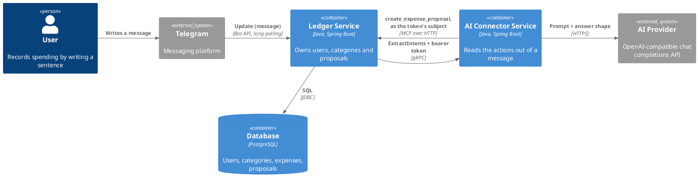
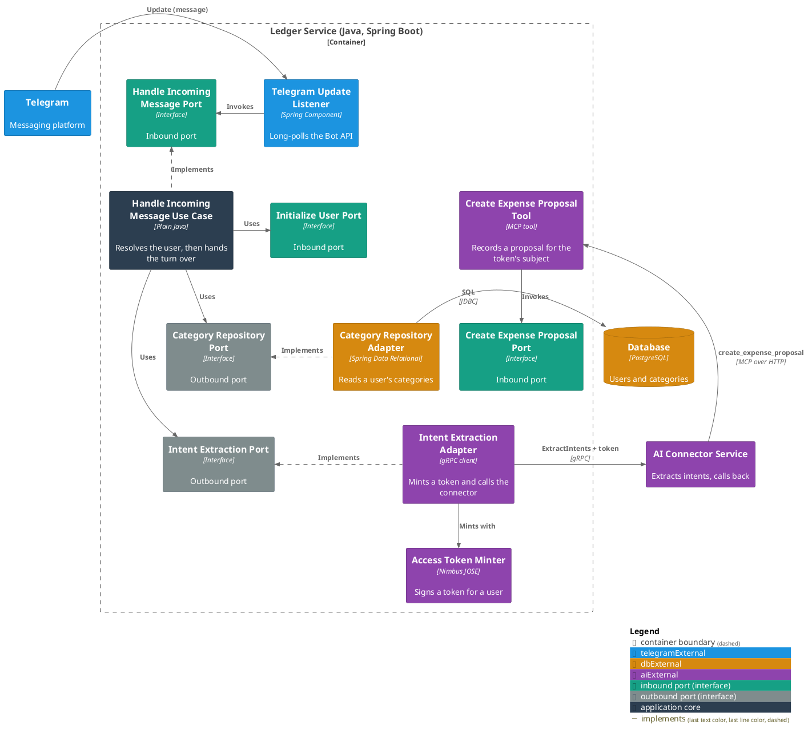
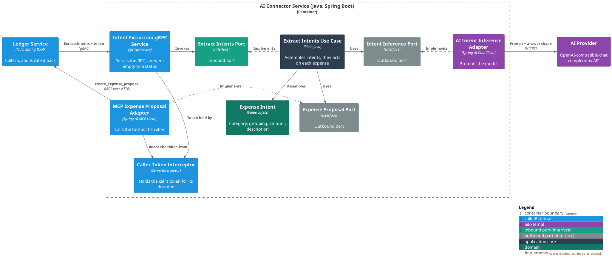
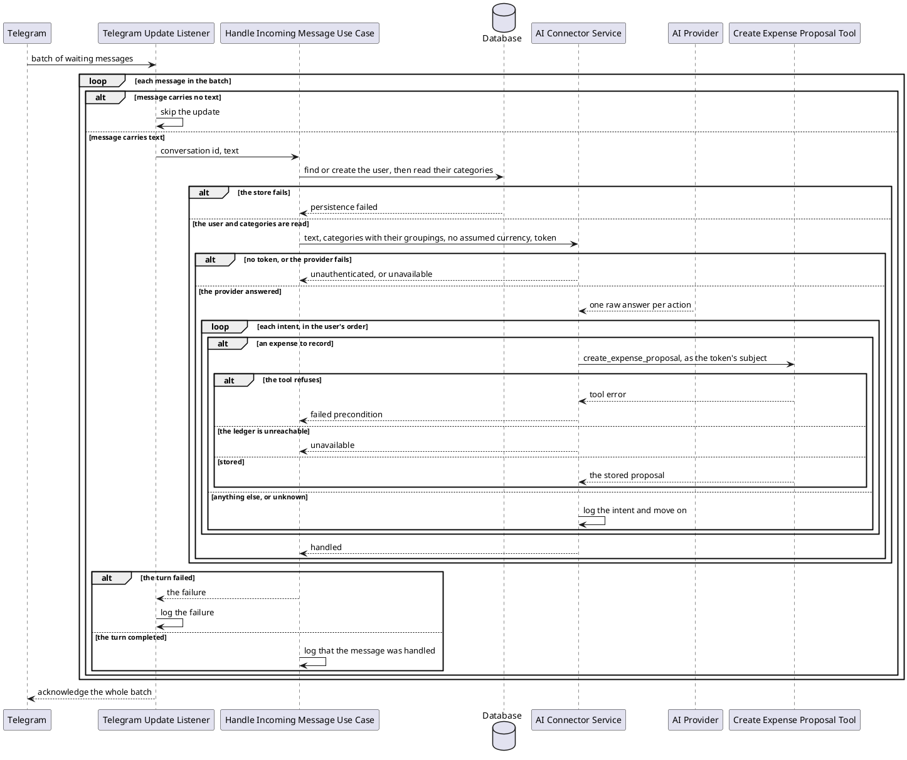

# Handle Incoming Message Extracts Intents

**Affected Modules:** `ledger-service`, `ai-connector-service`

## Objective

A user's message currently stops at a log line in the ledger. This change carries it the whole way: the ledger
resolves the person behind the conversation, sends their text and their categories to the AI Connector Service
with a token to act as them, and the connector turns each expense the message asks for into a
`create_expense_proposal` call back into the ledger's MCP server. What comes back over gRPC is that the message
was handled, or a failure — no intent crosses the boundary any more.

This joins the three pieces already built separately: the Telegram entry point, the intent extraction boundary
(uncalled since [`4-plan-ledger-ai-connector-integration.md`](../4-ledger-ai-connector-integration/4-plan-ledger-ai-connector-integration.md)),
and the MCP server (with no client since
[`8-plan-mcp-adapter-create-expense-proposal.md`](../8-mcp-adapter-create-expense-proposal/8-plan-mcp-adapter-create-expense-proposal.md)).

## Context

- [`HandleIncomingMessageUseCase`](../ledger-service/src/main/java/bot/finance/application/usecase/HandleIncomingMessageUseCase.java)
  — today a null check and a log line, driven by
  [`TelegramUpdateListener`](../ledger-service/src/main/java/bot/finance/adapter/telegram/TelegramUpdateListener.java),
  which swallows a failure and confirms the batch.
- [`IntentExtractionPort`](../ledger-service/src/main/java/bot/finance/application/port/IntentExtractionPort.java)
  and [`AiConnectorIntentExtractionAdapter`](../ledger-service/src/main/java/bot/finance/adapter/aiconnector/AiConnectorIntentExtractionAdapter.java)
  — the outbound boundary, described in [AI Connector Service — intent extraction](../ledger-service/docs/contracts/out/ai-connector.md).
- [`CreateExpenseProposalMcpTool`](../ledger-service/src/main/java/bot/finance/adapter/mcp/CreateExpenseProposalMcpTool.java)
  and [`AccessTokenMinter`](../ledger-service/src/main/java/bot/finance/adapter/security/AccessTokenMinter.java)
  — the tool this change gives its first caller, and the minter that has never been called in production.
  [The MCP contract](../ledger-service/docs/contracts/in/mcp.md) already names the intended client and says the
  token arrives "when the Ledger Service dispatches a turn to the AI Connector Service and hands it a token to
  call back with"; [ADR 0007](../ledger-service/docs/adr/0007-an-mcp-caller-is-identified-by-a-signed-token-not-a-tool-argument.md)
  makes that token the only identity a tool call acts as.
- [`InitializeUserUseCase`](../ledger-service/src/main/java/bot/finance/application/usecase/InitializeUserUseCase.java)
  — find-or-create against an external identity, giving a new user 97 categories.
  [Its page](../ledger-service/docs/usecases/initialize-a-new-user.md) records that nothing calls it yet.
- [`CreateExpenseProposalUseCase`](../ledger-service/src/main/java/bot/finance/application/usecase/CreateExpenseProposalUseCase.java)
  — resolves a category by name, refuses a grouping, and refuses an ambiguous name with `retry with
  parentCategory naming one of: …`. That refusal is why the parent name has to travel.
- [`ExtractIntentsUseCase`](../ai-connector-service/src/main/java/bot/finance/ai/application/usecase/ExtractIntentsUseCase.java)
  — assembles a validated `Intent` per raw answer and matches each category against the closed set. Its
  assembly is kept; only what happens to the finished list changes.
- [`proto/intent_extraction.proto`](../proto/intent_extraction.proto) — the shared schema, and
  [ADR 0005](../../adr/0005-the-ledger-mirrors-the-intent-vocabulary-in-its-own-domain.md), which had each service
  mirror the intent vocabulary in its own domain.

## Proposed Solution

### The shared schema

[`proto/intent_extraction.proto`](../proto/intent_extraction.proto) becomes a request and an acknowledgement.
Every intent message — `Intent`, `CategoryIntent`, `ExpenseIntent`, `Money`, `Operation` — is deleted with the
response that carried them.

```proto
service IntentExtractionService {
  rpc ExtractIntents(ExtractIntentsRequest) returns (ExtractIntentsResponse);
}

message ExtractIntentsRequest {
  string text = 1;
  // The closed set an expense may be filed under; must be non-empty. The caller
  // includes a catch-all, so a fitting entry always exists.
  repeated KnownCategory known_categories = 2;
  // ISO 4217 code applied when the user states an amount but no currency. Absent means
  // an amount without a currency is not acted on.
  optional string default_currency = 3;
}

// A category an expense may be filed under, and the grouping it sits in. Both are
// always set: a category that can hold an expense always hangs off a grouping, and
// "Auto" says little without "Insurance" above it.
message KnownCategory {
  string name = 1;
  string parent_name = 2;
}

// Empty: a call that returns has been acted on. A failure is a gRPC status.
message ExtractIntentsResponse {}
```

The caller's token travels as gRPC call metadata, `authorization: Bearer <jwt>`, not as a field.

### `ledger-service` — application layer

**`application/dto/KnownCategory.java`** — new: `record KnownCategory(String name, String parentName)`, rejecting
a null or blank value for either.

**`application/port/CategoryRepository.java`** — one method added:

```java
/**
 * @throws PersistenceFailedException if the lookup fails
 */
List<KnownCategory> findKnownCategories(long userId);
```

**`application/dto/IntentExtractionRequest.java`** — `knownCategories` becomes `List<KnownCategory>`, and the
record gains `String userExternalId` (present, not blank), which is the subject the adapter mints a token for.
The existing checks stand: non-blank text, a non-empty category list, no null element, an `Optional` currency.

**`application/port/IntentExtractionPort.java`** — `extract` returns `void`. It throws
`InvalidExtractionRequestException` for an absent request and `IntentExtractionFailedException` when the turn
does not complete.

**`application/usecase/HandleIncomingMessageUseCase.java`** — rewritten. Constructor takes `InitializeUserPort`,
`CategoryRepository`, `IntentExtractionPort` and `LoggerFactory`. `handle`:

1. reject an absent command with `InvalidIncomingMessageException`, as today;
2. `initializeUserPort.initialize(new InitializeUserCommand(command.conversationId()))`;
3. `categoryRepository.findKnownCategories(user.id().orElseThrow())`;
4. `intentExtractionPort.extract(new IntentExtractionRequest(command.text(), knownCategories, Optional.empty(),
   user.externalId()))`;
5. log at info that the conversation's message was handled.

**Deleted:** `domain/value/Intent.java`, `CategoryIntent.java`, `ExpenseIntent.java`, `UnknownIntent.java`,
`Operation.java` and `domain/exception/InvalidIntentException.java` — the mirrored vocabulary has nothing left
to mirror. `Money` and `CurrencyCode` stay: the expense and proposal models use them.

### `ledger-service` — adapter layer

**`adapter/persistence/CategoryEntityRepository.java`** — one statement replaces the per-row parent lookup:

```java
@Query("""
        SELECT c.name AS name, p.name AS parent_name
        FROM category c
        JOIN category p ON c.parent_id = p.id
        WHERE c.user_id = :userId
        """)
List<KnownCategoryProjection> findKnownCategories(@Param("userId") Long userId);
```

with `KnownCategoryProjection(String name, String parentName)` alongside it in `adapter/persistence`.

**`adapter/persistence/CategoryRepositoryAdapter.java`** — implements `findKnownCategories`, mapping the
projection and wrapping a `RuntimeException` in `PersistenceFailedException`, as its siblings do.

**`adapter/aiconnector/AiConnectorIntentExtractionAdapter.java`** — mints a token for
`request.userExternalId()` through `AccessTokenMinter`, attaches it as `authorization: Bearer <jwt>` metadata on
the stub, calls the RPC, and returns nothing. A `StatusRuntimeException` still becomes
`IntentExtractionFailedException` naming the status. The empty-answer check goes with the intent list.

**`adapter/aiconnector/IntentProtoUtils.java`** — keeps only `toProtoRequest`, now mapping `KnownCategory` to the
proto message; every response mapper is deleted.

**`adapter/config/UseCaseConfiguration.java`** — `handleIncomingMessagePort` gains `InitializeUserPort`,
`CategoryRepository` and `IntentExtractionPort`.

No migration and no new ledger configuration: the connector's address, the keystore, and the token lifetime are
already in [configuration](../ledger-service/docs/configuration.md).

### `ai-connector-service` — domain layer

**`domain/value/ExpenseIntent.java`** — gains `Optional<String> parentCategoryName`, rejecting null as its
siblings do. It is the grouping of the category the expense was matched to, and it is what disambiguates a name
two categories share. `CREATE` also comes to require a description, beside the amount and the category it
already requires (**D32**).

### `ai-connector-service` — application layer

**`application/dto/KnownCategory.java`** — new: `record KnownCategory(String name, String parentName)`, both
present and not blank, with a `label()` rendering `Parent > Child`.

**`application/dto/ExtractIntentsCommand.java`** — `knownCategories` becomes `List<KnownCategory>`; its
non-empty and no-blank-element checks stand.

**`application/port/ExpenseProposalPort.java`** — new outbound port:

```java
/**
 * @throws ExpenseProposalFailedException if the proposal is refused or the ledger cannot be reached
 */
void propose(ProposedExpense expense);
```

**`application/dto/ProposedExpense.java`** — new: `record ProposedExpense(String categoryName,
Optional<String> parentCategoryName, String description, Money amount)`.

**`domain/exception/ExpenseProposalFailedException.java`** — new, alongside `IntentInferenceException`,
carrying whether the ledger refused the proposal or could not be reached (**D35**).

**`application/port/ExtractIntentsPort.java`** — `extractIntents` returns `void`.

**`application/usecase/ExtractIntentsUseCase.java`** — the assembly loop is unchanged; what follows it is new.
The use case takes `ExpenseProposalPort` and `LoggerFactory` as well, and:

- renders `KnownCategory.label()` for the prompt, so the model sees `Insurance > Travel` beside `Travel` and can
  say which it means. `IntentInferencePort.infer(String, List<String>)` is unchanged.
- matches a raw category name against the closed set by label first, then by bare name; a bare name matching
  several entries is unknown, naming the labels to retry with. A match carries its parent onto the
  `ExpenseIntent`.
- walks the finished intents in the user's order and calls `expenseProposalPort.propose` for every
  `ExpenseIntent` whose operation is `CREATE`.
- logs, at info, each intent it does not act on, by target and operation.

### `ai-connector-service` — adapter layer

**`adapter/grpc/IntentExtractionGrpcService.java`** — reads `KnownCategory` from the request, keeps its
`INVALID_ARGUMENT` rejections (blank text, empty set) and gains one for an entry whose name or parent name is
blank, and answers an empty
`ExtractIntentsResponse` once the port returns. `ExpenseProposalFailedException` becomes `FAILED_PRECONDITION`
when the ledger refused the proposal and `UNAVAILABLE` when it could not be reached, mapped in
`GrpcStatusConfiguration` beside the inference failure.

**`adapter/grpc/CallerTokenInterceptor.java`** — new `ServerInterceptor`, reading `authorization` from the call's
metadata into an `io.grpc.Context` key, and **`adapter/grpc/CallerTokenUtils.callerToken()`** reading it back —
the mirror of the ledger's `AuthenticatedCallerUtils`. A call arriving with no token is refused `UNAUTHENTICATED`
before the use case runs.

**`adapter/ledger/`** — new subpackage, the one that fronts the ledger:

- `McpExpenseProposalAdapter` implements `ExpenseProposalPort`. Per call it opens an MCP client over Streamable
  HTTP against `LedgerMcpProperties.url()`, carrying `Authorization: Bearer <callerToken()>` on every request,
  invokes `create_expense_proposal` with `category`, `parentCategory`, `description`, `amountMinorUnits` and
  `currencyCode`, and closes it. A tool result flagged `isError` becomes a refusal; a transport failure and a
  missing token become an unreachable ledger — both as `ExpenseProposalFailedException`. `merchant` is not sent
  — nothing extracts one.
- `LedgerMcpProperties` — `@ConfigurationProperties` for the base URL.

**`build.gradle`** — `implementation "org.springframework.ai:spring-ai-starter-mcp-client"`.

**Configuration** — one new variable, `LEDGER_MCP_URL`, default `http://localhost:1000`, with
[`infrastructure/docker-compose.yaml`](../infrastructure/docker-compose.yaml) supplying the ledger's container
address, as it already does in the other direction for `AI_CONNECTOR_GRPC_TARGET`.

### Containers



### Components — `ledger-service`



The ledger's domain boundary only loses classes here: the intent vocabulary goes, and nothing replaces it.

### Components — `ai-connector-service`



### Flow



## Decisions

- **D1:** How does the ledger get from a conversation to a stored user?
- Answer: it calls `InitializeUserPort.initialize` with the conversation id as the external identity, so a first
  message creates the user and their 97 categories, and every later one finds them.
- Basis: assumed — [`initialize-a-new-user.md`](../ledger-service/docs/usecases/initialize-a-new-user.md) states
  the use case exists so "a person can record spending from their first message" and that nothing calls it yet;
  `InitializeUserUseCase` is find-or-create and safe to call on every message.

- **D2:** Is the conversation id the person's external identity?
- Answer: yes — it is passed to `InitializeUserCommand` and is the subject the callback token is minted for.
- Basis: assumed — the command carries nothing else that identifies anyone, and
  [`TelegramUpdateUtils`](../ledger-service/src/main/java/bot/finance/adapter/telegram/TelegramUpdateUtils.java)
  fills it from `chat.id`, which for a private chat is the user's own id. A group chat would be one shared user;
  no group behaviour exists anywhere in the repository.

- **D3:** What does the closed set carry?
- Answer: every category with a parent, as a name and its grouping's name, both always present (**D42**) — a new
  `CategoryRepository.findKnownCategories(long userId)` returning `KnownCategory`.
- Basis: assumed — a leaf is what an expense can be filed under (`CreateExpenseProposalUseCase` refuses a
  grouping), and the tool takes `parentCategory` precisely to break a tie between two leaves sharing a name
  ([the MCP contract](../ledger-service/docs/contracts/in/mcp.md#what-the-tool-takes)). Sending bare names would
  make the *Travel* collision (**D14**) unresolvable at the far end of the turn.

- **D4:** What currency is assumed when the user states an amount without one?
- Answer: none — `Optional.empty()`, so such an amount makes its entry unknown and no proposal is recorded.
- Basis: deferred — nothing stores a currency preference: `User` carries only an external id and the `user`
  table has no currency column. A per-user or per-deployment default brings this back.

- **D5:** What happens to the extracted intents?
- Answer: the connector acts on them itself. Every `ExpenseIntent` with operation `CREATE` becomes a
  `create_expense_proposal` call; every other intent is logged and skipped. Nothing crosses back but the
  acknowledgement.
- Basis: decided — the whole retarget, over carrying parent names alone or leaving the callback to a later
  change (user, 2026-07-31).

- **D6:** Where does a failure end up on the ledger side?
- Answer: it propagates out of the use case unchanged — `PersistenceFailedException`,
  `IntentExtractionFailedException`, `InvalidExtractionRequestException`, `InvalidUserException`. The listener
  logs it and confirms the batch, as today.
- Basis: assumed — `TelegramUpdateListener.handle` already catches `RuntimeException`, logs it and returns, and
  its javadoc records that rethrowing would stall the poll loop.

- **D7:** Is a failed turn retried?
- Answer: no. One message is one turn; a failure is logged and the message is gone.
- Basis: assumed — [the outbound contract](../ledger-service/docs/contracts/out/ai-connector.md) states nothing
  is retried and nothing is cached, and the batch is acknowledged whole regardless of outcome.

- **D8:** May an application use case depend on another use case's inbound port?
- Answer: yes — `HandleIncomingMessageUseCase` depends on the `InitializeUserPort` interface, never on
  `InitializeUserUseCase`, and the wiring stays in `UseCaseConfiguration`.
- Basis: assumed — `CleanArchitectureTest.layersRespectCleanArchitectureDependencies` permits
  application → application, and the ledger has no `adaptersReachUseCasesThroughPorts` equivalent to breach.

- **D9:** What if a user has no leaf categories?
- Answer: `IntentExtractionRequest`'s constructor throws `InvalidExtractionRequestException` and the connector is
  never called. No emptiness check is added to the use case.
- Basis: assumed — the record already refuses an empty list, and a user is only ever created together with the
  97 defaults, so this is reachable only if someone deletes every child category by hand.

- **D10:** Which documents record the new behaviour?
- Answer: none in this change. Both use-case pages, both sides of the intent-extraction contract, the ledger's
  MCP contract ("**None exists yet**"), and both configuration pages are rewritten by `archive-knowledge` after
  the plan finishes.
- Basis: assumed — [agent conventions](../ledger-service/docs/conventions/agent.md) list `archive-knowledge` as
  the post-implementation action that writes the use-case and contract pages.

- **D11:** What does a message now cost the poll loop?
- Answer: more than before, and nothing here changes the shape. A turn is a model round trip plus one MCP call
  per expense, all inside the ledger's ten-second gRPC deadline, run on the polling thread.
- Basis: deferred — `TelegramUpdateListener.process` handles the batch inline and pengrad polls again only when
  it returns, so with `polling.limit: 100` a batch of slow turns holds the loop for minutes and every
  conversation queues behind the slowest message. Moving handling onto an executor, and revisiting the deadline
  now that a turn contains writes, is its own change. This design does raise the deadline's stakes: **D19**.

- **D12:** What happens when a batch is replayed?
- Answer: every expense in it is proposed again, and nothing recognizes the duplicates.
- Basis: deferred — the offset is confirmed only when `process` returns, so a crash mid-batch replays it;
  `TelegramUpdateUtils` drops `update.updateId()` and the message id, so nothing carries a natural key inward,
  and [the MCP contract](../ledger-service/docs/contracts/in/mcp.md#semantics) states the tool is not idempotent
  by design. It costs a duplicate *proposal*, which a human reviews before it becomes an expense — that review
  is what makes this tolerable rather than the safety of the write.

- **D13:** What if two messages for the same conversation are handled at once?
- Answer: they are not, and the store settles it even if they were.
- Basis: assumed — [ADR 0001](../ledger-service/docs/adr/0001-telegram-updates-arrive-by-long-polling.md) gives
  one instance the loop, and
  [`UserRepositoryAdapter.insertOrFindExisting`](../ledger-service/src/main/java/bot/finance/adapter/persistence/UserRepositoryAdapter.java)
  inserts if absent and re-reads under READ COMMITTED, backed by `uq_app_user_external_id`.

- **D14:** Is a leaf name on its own enough to name a category?
- Answer: no, and this change carries the grouping so it does not have to be. The defaults hold a leaf *Travel*
  under *Insurance* and a grouping *Travel*; the model is shown `Insurance > Travel`, answers with a label, and
  the parent reaches the tool as `parentCategory`.
- Basis: assumed — `CreateExpenseProposalUseCase.resolveCategoryId` answers `several categories named Travel
  exist, retry with parentCategory naming one of: …` for exactly this name, and
  [ADR 0003](../ledger-service/docs/adr/0003-a-category-is-unique-per-user-and-parent-not-per-user.md) is why the
  collision is legal rather than a data defect.

- **D15:** Does a user's own words still reach the log, and at what level?
- Answer: yes, at debug in the connector's inference adapter and nowhere else. The ledger's info line names the
  conversation and that the message was handled, never its text.
- Basis: assumed — `AiIntentInferenceAdapter` already logs the rendered user message at debug, so debug-level
  user content on this path is the established practice; today's ledger info line, which logs the whole message,
  goes.

- **D16:** A message fails in production — what does the operator have to search for?
- Answer: on the ledger, `update.updateId()` and a stack trace, naming neither the conversation nor the user.
- Basis: deferred — the failure line belongs to `TelegramUpdateListener.handle`, which this change does not
  touch (**D6**). Answering the user is what makes widening it worth its own change.

- **D17:** How are a user's categories read in one statement?
- Answer: a declared `@Query` joining `category` to its parent, returning name and parent name, replacing the
  per-row parent lookup `toStoredCategory` does.
- Basis: assumed — `CategoryRepositoryAdapter.toStoredCategory` issues a `findById` per row, which over ~77 leaves
  would be 78 statements on every message; the join is served by `uq_category_user_parent_name`, whose leading
  column is `user_id`, in [`V001`](../ledger-service/src/main/resources/db/migration/V001__create_user_and_category.sql).
  Order is unspecified and irrelevant — the closed set is matched by name, and the answer's order is the user's.

- **D18:** Whose ledger does a conversation id address?
- Answer: the user stored under that id in `app_user.external_id` — the same namespace an MCP token's `sub`
  addresses, which is exactly what makes the callback land on the right ledger.
- Basis: assumed — [ADR 0007](../ledger-service/docs/adr/0007-an-mcp-caller-is-identified-by-a-signed-token-not-a-tool-argument.md)
  makes the token's subject the only identity a tool acts as, and `AccessTokenMinter.mint` takes that subject as
  the external id. The identity is read from the update Telegram delivered against the bot's own token, never
  from anything a message body says.

- **D19:** How does the callback token reach the connector?
- Answer: as gRPC call metadata, `authorization: Bearer <jwt>`, minted per call by
  `AiConnectorIntentExtractionAdapter` for `request.userExternalId()`. It is not a field in the schema, and the
  ledger's core never holds it.
- Basis: assumed — [ADR 0007](../ledger-service/docs/adr/0007-an-mcp-caller-is-identified-by-a-signed-token-not-a-tool-argument.md)
  keeps a credential off the payload and on the transport, and
  [the ledger's naming rule](../ledger-service/docs/conventions/architecture.md#naming-across-the-layer-boundary)
  bars a transport-shaped field from `domain`/`application`. The user's external id does cross the port, which is
  an identity rather than a credential, and the minter lives in the adapter layer where it can be reached.

- **D20:** How long may a turn take, against a two-minute token?
- Answer: the ledger's ten-second call deadline stands, well inside the token's `MCP_JWT_TTL` default of two
  minutes, so a token cannot expire mid-turn.
- Basis: assumed — [configuration](../ledger-service/docs/configuration.md) gives `MCP_JWT_TTL` a `2m` default
  and the outbound contract gives the call ten seconds. Raising the deadline past the TTL is what would break
  this, which is why **D11** names them together.

- **D21:** Does the connector inspect the token?
- Answer: no. It is opaque text, held for the call, put on the callback's `Authorization` header, never parsed,
  never logged, never stored. A call arriving without one is refused `UNAUTHENTICATED` before the use case runs.
- Basis: assumed — validation is the ledger's, described in
  [the MCP contract](../ledger-service/docs/contracts/in/mcp.md), and the connector holds no key to check a
  signature with. Refusing early keeps the model round trip off a turn that could never record anything.

- **D22:** Which intents does the connector act on?
- Answer: `ExpenseIntent` with operation `CREATE`, and nothing else. Reads, updates, deletes, every
  `CategoryIntent`, and every `UnknownIntent` are logged by target and operation, and the turn still succeeds.
- Basis: assumed — `create_expense_proposal` is the only tool the ledger publishes
  ([the MCP contract](../ledger-service/docs/contracts/in/mcp.md#operations)), so nothing else has anywhere to
  go. A turn that found only unknowns is not a failure: it is a message asking for nothing this system does.

- **D23:** What does a successful call answer with?
- Answer: an empty `ExtractIntentsResponse`. Success means the turn was acted on; there is no count, no per-intent
  outcome, and no text for the user.
- Basis: decided — the connector answers "extracted, or an error occurred" (user, 2026-07-31). Anything richer
  only has a reader once the ledger replies to the user, which is its own change (**D16**).

- **D24:** One tool call fails halfway through a message asking for three expenses. What then?
- Answer: the turn stops at the first failure and the call comes back carrying the status **D35** gives it. The
  proposals already stored stand, and the ledger cannot tell which they were.
- Basis: deferred — the alternative, finishing the remaining intents and reporting a partial, needs a per-intent
  answer the empty response deliberately does not carry (**D23**). Since a replay already duplicates proposals
  (**D12**) and a human reviews every one, stopping early is the smaller mess. Reporting per-intent outcomes
  comes with replying to the user.

- **D25:** How does the connector's MCP client carry a different token on every call?
- Answer: it builds a client for the call, with the caller's token on its transport, and closes it after — once
  per proposal, as **D34** works out. Nothing is pooled.
- Basis: assumed — [the MCP contract](../ledger-service/docs/contracts/in/mcp.md#semantics) states every call
  carries its own token and the server keeps nothing between calls, so a client is worth exactly one turn; a
  shared client would have to rewrite an `Authorization` header per request against a stateless server that
  gains nothing from the reuse.

- **D26:** Which MCP client library, over which transport?
- Answer: `org.springframework.ai:spring-ai-starter-mcp-client` — the synchronous, `HttpClient`-backed one — over
  Streamable HTTP.
- Basis: assumed — it is in `spring-ai-bom` 2.0.0, which the connector already imports, beside
  `spring-ai-starter-mcp-client-webflux`; the reactive one buys nothing on a blocking gRPC handler. The ledger
  serves Streamable HTTP at `/mcp` via `spring-ai-starter-mcp-server-webmvc`.

- **D27:** How does the model say *which* Travel it means?
- Answer: the closed set reaches the prompt as labels — `Insurance > Travel` beside `Travel` — and the use case
  matches an answer by label first, then by bare name. A bare name matching several entries is unknown, naming
  the labels to retry with.
- Basis: assumed — `IntentInferencePort.infer(String, List<String>)` already takes the set as strings and joins
  them into the prompt, so labels cost the inference adapter and the prompt template nothing. Matching stays in
  `ExtractIntentsUseCase.matchCategory`, which already resolves case-insensitively and already throws
  `InvalidValueException` — an unknown entry — for a name it cannot place.

- **D28:** What parent does a category the message asks to create carry?
- Answer: none. A category named into existence by the same message has no grouping, so an expense filed under it
  sends no `parentCategory`.
- Basis: assumed — `ExtractIntentsUseCase.availableCategories` adds such names to the closed set for the rest of
  the message, and a `CategoryIntent` carries only a name and a new name. The ledger will refuse the proposal —
  nothing creates the category there, since `create_expense_proposal` is the only tool (**D22**) — and that
  refusal fails the turn (**D24**). Making a category first needs a second tool.

- **D29:** What happens to the ledger's intent vocabulary?
- Answer: it is deleted — `Intent`, `CategoryIntent`, `ExpenseIntent`, `UnknownIntent`, `Operation`,
  `InvalidIntentException`, and the response half of `IntentProtoUtils`. `Money` and `CurrencyCode` stay.
- Basis: assumed — no intent crosses into the ledger any more, and
  [ADR 0005](../../adr/0005-the-ledger-mirrors-the-intent-vocabulary-in-its-own-domain.md) had the ledger mirror the
  vocabulary only because the wire carried it. The ADR's decision still holds for the connector, which keeps its
  own; whether the change is worth recording as a superseding ADR is the plan's question to ask.

- **D30:** Is re-typing `known_categories` in place safe?
- Answer: yes — field 2 changes from `repeated string` to `repeated KnownCategory`, and the deleted response
  messages are simply removed rather than reserved.
- Basis: assumed — both modules build from the one schema, so a change reaches the build rather than the runtime
  ([the compatibility section](../ai-connector-service/docs/contracts/in/intent-extraction.md#compatibility)),
  and nothing in production speaks this RPC: the ledger's boundary had no caller and the connector's only
  clients are its own tests.

- **D31:** Where does the connector reach the ledger?
- Answer: a new `LEDGER_MCP_URL`, defaulting to `http://localhost:1000`, with compose supplying the ledger's
  container address.
- Basis: assumed — the ledger publishes port 1000 in
  [`infrastructure/docker-compose.yaml`](../infrastructure/docker-compose.yaml) and serves MCP at `/mcp` on its
  own port ([the MCP contract](../ledger-service/docs/contracts/in/mcp.md)); the reverse direction is already
  configured exactly this way with `AI_CONNECTOR_GRPC_TARGET`. `MCP_ENABLED=false` on the ledger makes every
  callback fail, which is what that switch already means.

- **D32:** A message says "spent 12 euros" and nothing else. What description does the proposal carry?
- Answer: none, and nothing is proposed for it. A `CREATE` expense requires a description as it already requires
  an amount and a category: an entry without one is an `UnknownIntent` naming the missing piece, logged and
  skipped (**D22**), and every other entry in the message is still acted on. `ExpenseIntent`'s constructor
  gains the check, so no description-less `CREATE` can be assembled at all.
- Basis: decided — no description means the intent is skipped, over filling it from the user's words or from the
  matched category (user, 2026-07-31). It follows the connector's own rule that an entry missing what its action
  requires is unknown ([extract-intents](../ai-connector-service/docs/usecases/extract-intents.md#rules)), and no
  call the ledger is bound to refuse is ever made.

- **D33:** The ten-second deadline expires while the connector is mid-turn. What is stored, and what does the
  ledger believe?
- Answer: the connector runs on to the end of the turn and keeps proposing; the ledger has already thrown
  `IntentExtractionFailedException` naming `DEADLINE_EXCEEDED`, and the listener has logged the message as
  failed. A failure line therefore does not mean nothing was written.
- Basis: deferred — the deadline is `spring.grpc.client.channel.ai-connector.default.deadline: 10s` and the
  ledger's stub abandons the call when it expires, but nothing on the connector side observes cancellation:
  `ExtractIntentsUseCase` is a plain class that cannot see `io.grpc.Context`, and the MCP client the design
  builds carries no deadline of its own. Checking cancellation between intents means a transport concern
  reaching the core, which the module's [naming rule](../ai-connector-service/docs/conventions/architecture.md#naming-across-the-layer-boundary)
  bars, so it is its own change. The window widens with every intent in a message (**D40**).

- **D34:** Is the MCP client built once per turn, as **D25** says, or once per proposal?
- Answer: once per proposal. `ExpenseProposalPort.propose(ProposedExpense)` takes one expense and carries no
  turn boundary, so the adapter has nothing to scope a client to — a three-expense message performs three
  `initialize` handshakes and three `tools/list`-capable sessions inside the ten-second deadline.
- Basis: assumed — the port as designed is per-expense, and the adapter section itself says "per call it opens
  an MCP client … and closes it". **D25**'s reasoning (a token per call, a server that keeps nothing) holds
  either way; only its "per turn" wording does not. The ledger serves `protocol: STATELESS`, so a per-proposal
  handshake is legal, and it is the cost, not the correctness, that this multiplies.

- **D35:** `UNAVAILABLE` is the status for every proposal failure. Is a refused proposal an unavailability?
- Answer: no. A refusal the ledger will repeat — an unknown category, a grouping, an ambiguous name — comes back
  `FAILED_PRECONDITION`. `UNAVAILABLE` is kept for a ledger that could not be reached: a transport failure, a
  timeout, a 5xx. `ExpenseProposalFailedException` carries which of the two it is, and
  `GrpcStatusConfiguration` maps it. `INVALID_ARGUMENT` stays what it is today — the request the connector was
  called with.
- Basis: decided — separate the permanent refusal from the unreachable ledger (user, 2026-07-31). It keeps
  [the connector's failure table](../ai-connector-service/docs/contracts/in/intent-extraction.md#failures)
  honest, where `UNAVAILABLE` means "the caller may retry" and a tool error carrying "retry with parentCategory
  naming one of: …" is never fixed by retrying the same call.

- **D36:** Does the connector's architecture guardrail still hold once an MCP client lands in it?
- Answer: not without an edit. `io.modelcontextprotocol..` joins the banned packages in
  `domainAndApplicationStayFrameworkAgnostic`, and `Mcp` joins `coreTypesCarryNoExternalSystemName`.
- Basis: assumed — [the module's convention](../ai-connector-service/docs/conventions/architecture.md#architecture-enforcement)
  says "each new external-service library joins the list as its adapter lands", the connector's list today names
  only `org.springframework..`, `jakarta..`, `org.slf4j..`, `io.grpc..` and `com.google.protobuf..`, and the
  ledger's own list already carries both entries from when its MCP server landed.

- **D37:** What removes the ledger's documentation for the vocabulary this change deletes?
- Answer: the plan does, alongside the classes — [`docs/domain/intent.md`](../ledger-service/docs/domain/intent.md),
  `expense-intent.md`, `category-intent.md`, `unknown-intent.md` and `operation.md`.
- Basis: assumed — [agent conventions](../ledger-service/docs/conventions/agent.md#post-implementation-actions)
  scope `archive-knowledge` to a page per use case, the contracts, and approved ADRs; nothing in it deletes a
  domain page, and [orientation](../ledger-service/docs/conventions/orientation.md#documentation-references)
  says `docs/domain/` holds one page per value object. **D10** covers the pages that get rewritten, not these.

- **D38:** The ledger's poll thread waits on the connector, which calls back into the ledger. Can that deadlock,
  or exhaust the pool?
- Answer: no. The callback is served by the web container, not by the waiting thread, and the waiting turn holds
  no database connection: `HandleIncomingMessageUseCase` finishes both reads before it calls the port, and every
  `@Transactional` in this service sits on a persistence-adapter method, never around a use case.
- Basis: assumed — `UseCaseConfiguration` wires plain use-case beans with no transactional proxy;
  `spring.threads.virtual.enabled: true` and one in-flight turn at a time ([ADR 0001](../ledger-service/docs/adr/0001-telegram-updates-arrive-by-long-polling.md),
  **D11**) keep the callback well inside Hikari's ten connections.

- **D39:** What if a category name contains the label separator?
- Answer: nothing today can produce one — the closed set is built from `Category.defaults()`, none of whose 97
  names contains `>`, and no tool creates a category (**D22**), so a label parses back unambiguously.
- Basis: assumed — `Category.defaults()` is the only source of stored categories, and a name a message asks to
  create never becomes a label: it is added to the available set bare, as `ExtractIntentsUseCase.availableCategories`
  already does. This returns the day a user can name a category of their own.

- **D40:** How many proposals may one message make?
- Answer: as many as the model returns entries for; nothing caps it.
- Basis: deferred — `ExtractIntentsUseCase` walks whatever list the provider answers with, and the only bound is
  the provider's own output limit and the ten-second deadline cutting the loop short (**D33**). A per-message cap
  belongs with replying to the user, which is what would tell them the rest was dropped.

- **D41:** What does a present-but-blank `parent_name` do?
- Answer: it is refused `INVALID_ARGUMENT` alongside a blank `name`, before the provider is called. Nothing
  downstream has to treat it as absent.
- Basis: assumed — with the field required (**D42**) a blank one is the only way it can arrive malformed, and
  the gRPC service already rejects a blank `name` and an empty set that way. Left through, it would render a
  label like ` > Travel` and reach `create_expense_proposal` as a `parentCategory` no stored grouping matches —
  `CreateExpenseProposalUseCase.narrowByParentName` compares the parent by exact equality. The ledger's inner
  join never emits one, but the connector cannot assume its caller is the ledger.

- **D42:** Is a category's grouping optional on the wire?
- Answer: no. `parent_name` is a plain `string`, always set, and both dtos hold it as a non-blank `String`. A
  category that can hold an expense always hangs off a grouping, and half the leaf names say little alone —
  *Auto* is *Insurance > Auto*, and the model is told so.
- Basis: decided — the pair always travels together (user, 2026-07-31). The repository agrees: the closed set is
  leaves only (**D3**), read by an inner join that cannot emit a parentless row, and `Category.defaults()` gives
  every one of the 77 leaves a grouping. `ExpenseIntent.parentCategoryName` stays optional regardless — a
  category the same message asks to create has no grouping (**D28**).

- **D43:** What happens to the connector's `IntentProtoUtils`?
- Answer: it is deleted, with `IntentProtoUtilsTest`. Reading `KnownCategory` off the request stays inline in
  `IntentExtractionGrpcService`, where reading `known_categories` already is.
- Basis: assumed — the class's only public method is `toResponse(List<Intent>)`, and every private member below
  it maps an intent onto a message the schema no longer carries (**D29**'s reasoning, applied on this side of
  the wire). Nothing else calls it.

## Design Findings

Grilled (2026-07-31): nothing to raise on authorization, idempotency & retry, lifecycle.
