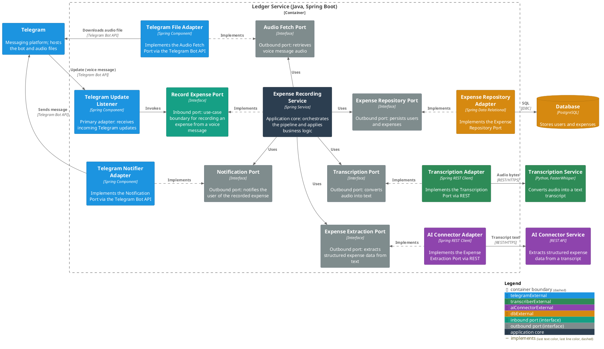

# Ledger Service

The Ledger Service is the orchestration core of the [Finance Bot](../README.md)
system. It receives Telegram updates, coordinates transcription and AI-driven
expense extraction, persists the result, and confirms it back to the user.

Diagrams follow the [C4 model](https://c4model.com) and are written in
[PlantUML](https://plantuml.com/). 

For C1 (System Context) and C2 (Container),
see the [root README](../README.md#architecture). C3 below zooms into this
service specifically.

## Package Structure

Code is organized by Clean Architecture layer, under `bot.finance`:

```
bot.finance
├── domain          # enterprise business rules
│   ├── model       # entities with identity, e.g. Expense, User
│   ├── value       # value objects
│   └── exception
├── application     # application business rules
│   ├── usecase
│   ├── port        # inbound/outbound port interfaces
│   └── dto
└── adapter         # interface adapters
    ├── web
    └── persistence
```

### C3 — Component

Every interaction the Ledger Service has with something outside its own boundary
(Telegram, the Transcription Service, the AI Connector Service, the database) is
mediated by an **abstract port (interface)** — never a direct call from the
application core. 

Inbound ports are driven by the outside world; outbound ports are
driven by the core and implemented by adapters. Adapters are color-coded by the
external dependency they front, so it's clear at a glance which piece talks to what.


