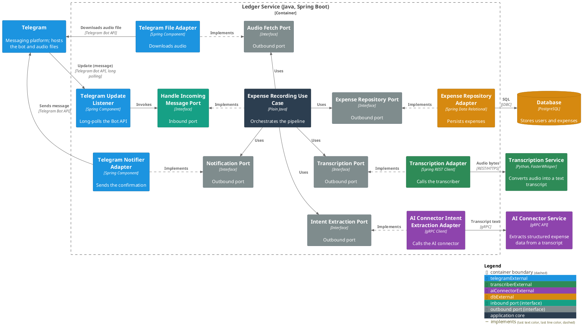

# Ledger Service

The orchestration core of the [Finance Bot](../README.md) system. It receives
Telegram updates, coordinates transcription and AI-driven expense extraction,
persists the result, and confirms it back to the user.

For C1 (System Context) and C2 (Container) see the [root README](../README.md#architecture);
C3 is below. Package structure is in the
[Architecture & Layering conventions](docs/conventions/architecture.md#package-structure).

### Use Cases

- [Receive a user's message](docs/usecases/handle-incoming-message.md)
- [Initialize a new user](docs/usecases/initialize-a-new-user.md)

### Contracts

- [Telegram — incoming messages](docs/contracts/in/telegram-updates.md) (inbound)

### Running It

- [Configuration](docs/configuration.md) — the environment variables a deployment supplies.

### C3 — Component

The expense pipeline, the service's primary use case; each [use case](#use-cases)
page carries its own C3. Every interaction with something outside the service
boundary goes through a port, never a direct call from the core. Adapters are
colour-coded by the external dependency they front.

