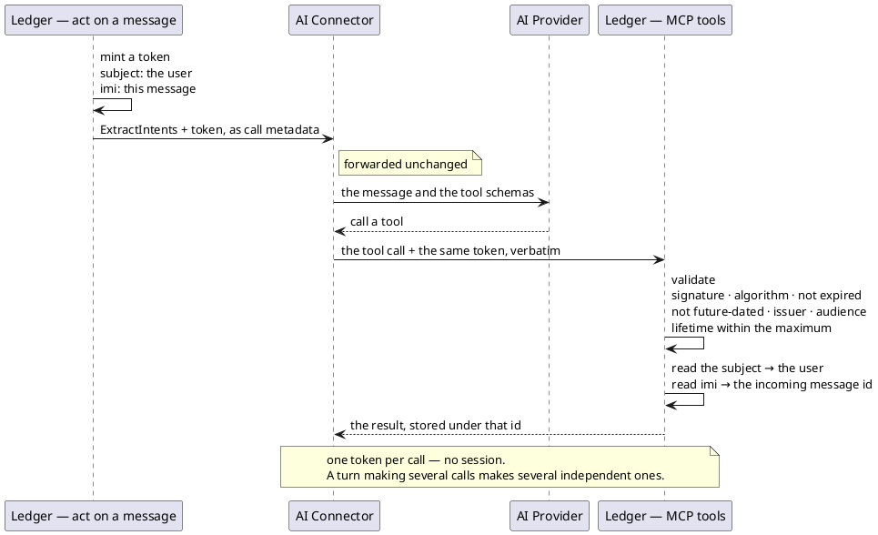

# Agent acting for a user — the ledger's tools (MCP over HTTP)

A language model acting for a user acts on their message here, one tool call per thing the message asks for.

- **Counterpart:** [the AI Connector Service](../../../../ai-connector-service/docs/contracts/out/ledger-mcp.md),
  acting for the user whose message it was handed
- **Transport:** MCP over Streamable HTTP, stateless, at `/mcp` on the service's own port
- **Schema:** none held in a file — the server publishes each tool's argument schema over the protocol itself,
  and a client reads it by listing the tools

## Operations

| Operation                 | Purpose                                                                                                   | Used by                                                                    |
|---------------------------|-----------------------------------------------------------------------------------------------------------|----------------------------------------------------------------------------|
| List the tools            | tells a client which tools exist and what each takes                                                      | the client, to put the tools and their arguments in front of its model     |
| `create_expense_proposal` | records one expense the model read from its caller's message                                              | [Create an expense proposal](../../usecases/create-an-expense-proposal.md) |
| `list_categories`         | answers which categories one of the caller's groupings holds                                              | [List a grouping's categories](../../usecases/list-categories.md)          |
| `summarize_spending`      | records the period the model read from a question about what its caller spent                             | [Summarize spending over a period](../../usecases/summarize-spending.md)   |
| Fetch the signing keys    | publishes the public half of the key tokens are signed with, so a client can verify and follow a rotation | any holder of a token                                                      |

### What `create_expense_proposal` takes

| Argument       | Meaning                                                                                | Required |
|----------------|------------------------------------------------------------------------------------------|----------|
| `category`     | the category's name — one filed under a grouping                                       | yes      |
| `grouping`     | the grouping it is filed under, as `list_categories` was asked for it                  | yes      |
| `description`  | what was bought                                                                        | yes      |
| `merchant`     | who it was bought from — null or blank is none                                         | no       |
| `amount`       | the amount as the message writes it, in the currency's main unit — 7200 for 7200 HUF   | yes      |
| `currencyCode` | ISO 4217, three letters                                                                | yes      |

**Who the proposal is recorded against, and which message it belongs to, both come off the token and nothing
else** ([ADR 0007](../../adr/0007-an-mcp-caller-is-identified-by-a-signed-token-not-a-tool-argument.md),
[ADR 0015](../../adr/0015-a-turn-is-named-by-the-message-that-started-it-not-by-a-value-minted-beside-it.md)).

### What `create_expense_proposal` answers with

The stored proposal: its id, the category name it was filed under, the description, the merchant, the amount in
the currency's main unit, the currency code, and the instant it was created. It carries no identity.

### What `list_categories` takes

| Argument   | Meaning                                        | Required |
|------------|------------------------------------------------|----------|
| `grouping` | the grouping's name, exactly as it was offered | yes      |

### What `list_categories` answers with

Under `grouping`, the grouping the call named; under `categories`, the names of the categories filed under it,
ordered by name. It carries no identity and no stored id.

### What `summarize_spending` takes

| Argument | Meaning                                                    | Required |
|----------|------------------------------------------------------------|----------|
| `from`   | the first day of the period, counted, as `YYYY-MM-DD`      | yes      |
| `to`     | the last day of the period, counted, as `YYYY-MM-DD`       | yes      |

The caller works the period out against [the day the turn states](../out/ai-connector.md) and sends two days. A
relative phrase is never sent.

### What `summarize_spending` answers with

Under `from` and `to`, the period that was accepted, as the two days it was stored as. **No amount, no count and
no expense.** What the caller asked about is put in front of the user by
[the turn](../../usecases/handle-incoming-message.md).

## What a repeated call leaves behind

| Tool                      | Repeating it                                                                     |
|---------------------------|----------------------------------------------------------------------------------|
| `create_expense_proposal` | not idempotent — two calls store two proposals, indistinguishable from two intended ones |
| `list_categories`         | stores nothing, so a duplicate or a retry leaves no row behind                   |
| `summarize_spending`      | idempotent in what the user reads — two calls leave two rows, the turn reports the period once, and both rows go once the report is delivered |

## How a caller authenticates

- The token is a short-lived RS256 JSON Web Token, issued and validated by this service itself.
- Its subject is the [id the ledger stores the caller under](../../domain/authenticated-user-id.md), never the
  identity Telegram knows them by. Its issuer is `ledger-service` and its audience `mcp-adapter`.
- It carries the instant it was issued, the instant it expires, a unique id, and the
  [incoming message id](../../domain/incoming-message-id.md) of the message being handled.
- The signing key comes from a keystore read at startup. Its public half is published, unauthenticated, at
  `/.well-known/jwks.json`.
- A rotation is a new key in the keystore and a restart. A client re-reads the keys and needs no change.
- The keystore, its password, the key, and the lifetime are all [configuration](../../configuration.md).
- A token outlives the turn it was minted for. Nothing revokes one early.

Every other address on this port answers to nobody.

## Failures

| Condition                                                                               | Signal                                                               |
|-----------------------------------------------------------------------------------------|----------------------------------------------------------------------|
| No token, an expired one, a wrong issuer or audience, or one whose lifetime is too long | 401 on the transport, with no tool result and nothing describing why |
| An argument's value is not the type the published schema declares                       | refused against the schema, before the tool runs                     |
| An argument is missing, malformed, or an amount its currency cannot record              | a tool error naming the invalid request and the field at fault       |
| The grouping sent holds no category of the category name sent                           | a tool error naming both, so it can be corrected                     |
| The grouping name is unknown                                                            | a tool error repeating it, so it can be corrected                    |
| A listing's grouping name names a category rather than a grouping                       | a tool error saying so, so it can be corrected                       |
| A day of a period is blank, or is not written `YYYY-MM-DD`                              | a tool error naming the day at fault and the value it could not read |
| A period's last day is before its first                                                 | a tool error saying the period ends before it starts                 |
| The token's subject names no stored user                                                | a tool error saying the user is unknown                              |
| The token's subject is not a stored user's id at all                                    | a tool error naming the request invalid                              |
| The token carries no readable incoming message id, on a proposal call                   | a tool error saying the proposal could not be created                |
| The token carries no readable incoming message id, on a summary call                    | a tool error saying the spending could not be summarized             |
| The proposal or the period cannot be stored, or the categories cannot be read           | a tool error saying so, naming no table, constraint or stack frame   |
| Anything else                                                                           | a tool error saying the call could not be completed                  |

A failure inside the tool is a successful call carrying an error result, never an exception on the transport.
Authentication is the exception: it never reaches the tool at all, so a model never reads why it was refused.

Every rejection is logged with the kind of failure, and with neither the arguments nor the token. A call's
arguments reach the log only at debug level.

## Compatibility

A tool's name and description, and each argument's description, are part of the contract: the language model
picks a tool and fills its arguments from them. Rewording one changes what arrives, and nothing fails at build
time.

A tool added here reaches a client when it next reads the published list. A client that has already read one
goes on offering only what it read.

Adding an optional argument costs a client nothing. For a client outside this repository, renaming one, or
making an optional one required, is a new tool rather than an edit. Inside it, the tools and their one caller
ship together, so an argument is renamed or made required in place.

A client that read the list before a rename goes on sending the old argument name, and every call of that tool
fails until it restarts and reads the list again.

What the ledger hands its own tool through the token costs a client nothing either
([ADR 0015](../../adr/0015-a-turn-is-named-by-the-message-that-started-it-not-by-a-value-minted-beside-it.md)).
A caller minting its own tokens would have to carry that claim, which the proposal and summary tools both refuse
a call without.

Moving to an identity provider outside this service means the tokens are minted and the keys published
elsewhere. Callers change where they get a token; the tools and their arguments do not change.

The endpoint can be switched off entirely, which makes every call to it fail rather than answer — see
[configuration](../../configuration.md).
