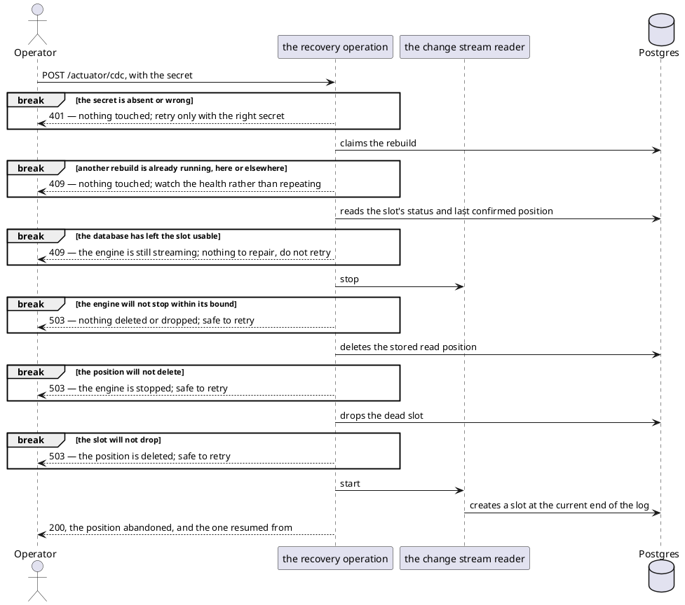

# An operator running the service — health, meters and slot recovery (HTTP)

The boundary a deployment is watched and repaired through: everything an operator needs to see how the service
is doing, and the one operation they can run against it by hand.

It is served on its own port, `MANAGEMENT_PORT`, which is never published alongside the service's own. Nothing
the product is used with is reachable here, and nothing here is reachable there.

- **Counterpart:** an operator, or the monitoring that stands in for one
- **Transport:** HTTP on the management port
- **Schema:** none held in a file

## Operations

| Operation                                   | Address                    | Who may call                                                       | Purpose                                                                             |
|---------------------------------------------|----------------------------|--------------------------------------------------------------------|-------------------------------------------------------------------------------------|
| [Health](#health)                           | `GET /actuator/health`     | anyone reaching the port                                           | whether the service and each of its parts is up, for a liveness and readiness probe |
| [Meters](#meters)                           | `GET /actuator/prometheus` | anyone reaching the port                                           | every meter in the Prometheus text format, for the metrics collector                |
| [Rebuilding the slot](#rebuilding-the-slot) | `POST /actuator/cdc`       | the `X-Cdc-Recovery-Secret` header, matching `CDC_RECOVERY_SECRET` | replaces an invalidated replication slot and restarts change capture                |

## Health

A `changeStream` component appears whenever capture is switched on, carrying a `state` detail.

| State       | Means                                                                                           | Component reads |
|-------------|-------------------------------------------------------------------------------------------------|-----------------|
| `STREAMING` | this instance holds the replication slot and is reading the log                                 | up              |
| `STANDBY`   | another instance holds the slot, and this one is waiting for it                                 | up              |
| `DOWN`      | this instance is not publishing — it never started, or it is stalled retrying a refused write | down            |

`STANDBY` is up on purpose: in a scaled deployment every instance but one is a standby, so alarming on it would
alarm permanently.

With capture switched off the component is absent altogether, and the aggregate health is unaffected by it.

What each of these states costs the database is [what change capture owes](../out/change-capture.md).

## Meters

| Meter                               | Kind    | Says                                                                                       |
|-------------------------------------|---------|--------------------------------------------------------------------------------------------|
| `ledger_mcp_tool_calls_total`       | counter | tool calls answered, tagged by `tool`, `outcome` and `reason`                              |
| `ledger_turns_total`                | counter | messages handled, tagged by the `outcome` the report carried                               |
| `ledger_proposals_resolved_total`   | counter | expenses a tap resolved, tagged by `resolution`                                            |
| `ledger_cdc_events_published_total` | counter | facts appended to the stream, tagged by `type` ([the catalogue](../out/change-stream.md))  |
| `ledger_cdc_publish_failures_total` | counter | appends the stream refused                                                                 |
| `ledger_cdc_facts_dropped_total`    | counter | facts the ledger could not record, tagged by `type` — each one reaches no consumer, ever |
| `ledger_cdc_event_lag_seconds`      | gauge   | now, less the instant stamped on the last fact appended                                    |
| `ledger_cdc_state`                  | gauge   | the capture state, as an ordinal                                                           |
| `ledger_cdc_outbox_rows`            | gauge   | rows left in the outbox — anything but zero is a write that did not delete its own       |
| `ledger_cdc_slot_retained_bytes`    | gauge   | how much log the replication slot is holding — the one to alarm on                       |
| `ledger_cdc_slot_wal_status`        | gauge   | what the database says about that slot, as an ordinal                                      |

The first three counters count a [redelivered batch](telegram-updates.md#failures) again. They are read as rates
and ratios, never as exact business counts.

The two slot gauges and the outbox gauge are read on the same timer whether or not capture is on, so a slot left
behind by switching capture off is still visible. `ledger_cdc_slot_retained_bytes` is what a bound is watched
against — see [configuration](../../configuration.md).

### `ledger_mcp_tool_calls_total`

| Tag       | Values                                                                                            |
|-----------|---------------------------------------------------------------------------------------------------|
| `tool`    | the [tool](mcp.md) the call named                                                                 |
| `outcome` | `ok`, or `rejected` for a call answered with an error                                             |
| `reason`  | `none` on `ok`; on `rejected`, the [refusal](mcp.md#failures), or `unexpected` for an unnamed one |

### `ledger_turns_total`

| Value                                                             | The turn                                                                      |
|-------------------------------------------------------------------|-------------------------------------------------------------------------------|
| `RECORDED`, `ANSWERED`, `NOTHING_IDENTIFIED`, `PARTIAL`, `FAILED` | delivered [that report](../../usecases/handle-incoming-message.md#the-report) |
| `UNREPORTED`                                                      | ended before any report reached the user                                      |

### `ledger_proposals_resolved_total`

| Value       | Counts                                                                               |
|-------------|--------------------------------------------------------------------------------------|
| `accepted`  | the expenses a [Confirm tap](../../usecases/resolve-a-reported-proposal.md) recorded |
| `discarded` | the expenses a [Delete tap](../../usecases/resolve-a-reported-proposal.md) removed   |

A tap that resolves nothing moves neither.

### `ledger_cdc_state`

| Value | State       |
|-------|-------------|
| `0`   | `STREAMING` |
| `1`   | `STANDBY`   |
| `2`   | `DOWN`      |

### `ledger_cdc_slot_wal_status`

| Value | Slot                                                          |
|-------|---------------------------------------------------------------|
| `0`   | reserved — the log it needs is kept                         |
| `1`   | extended — it has reached beyond the checkpoint, still kept |
| `2`   | unreserved — the log it needs may be removed at any moment  |
| `3`   | lost — the log it needs is gone, and the slot is dead       |
| `4`   | absent — no slot of that name exists                        |

A slot the database cannot classify reads as lost.

## Rebuilding the slot

The only repair for a slot the database has invalidated.

A crash between the delete and the drop leaves no position beside a slot that still exists, which is what a
first start already handles.

**It never replays the gap.** Every change made while the slot was dead is gone from the stream permanently. The
position it abandoned and the moment it did so are written to the service's log, at error, once. Nothing else
records which hours are missing.

Every endpoint keeps serving throughout, capture alone being what stops.

## Compatibility

A meter renamed or a tag added is a change to whatever alerts on it, including the provisioned dashboard,
[`infrastructure/grafana/dashboards/ledger-service.json`](../../../../infrastructure/grafana/dashboards/ledger-service.json).

Moving the management port changes where a probe and a collector point, and nothing else. Publishing it beside
the service's own port would put the rebuild operation on a reachable address, guarded by the shared secret
alone.
