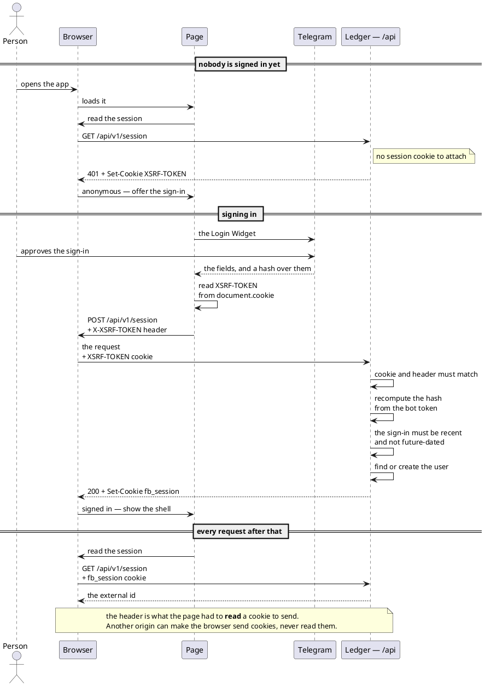
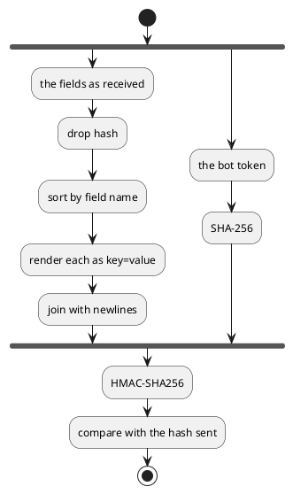

# A person signing in from a browser — the session API (HTTP)

A person opens the web app, signs in with their Telegram account, and the browser holds a session for as long as
it lasts. This is the boundary a browser signs in through. One thing crosses it: proof from Telegram that the
person at the keyboard is a particular Telegram user.

What that session then admits is [the browse API](web-browse-api.md), a separate interface on the same
transport.

- **Counterpart:** [the Web App](../../../../web-app/docs/contracts/out/ledger-session-api.md), running in a
  person's browser
- **Transport:** HTTP under `/api/v1`, on the service's own port, reached from the same origin as the page
- **Schema:** [`openapi/paths/session.yaml`](../../../../openapi/paths/session.yaml) and
  [`openapi/components/schemas/session.yaml`](../../../../openapi/components/schemas/session.yaml)

## Operations

| Operation        | Purpose                                                      | Used by                                                          |
|------------------|--------------------------------------------------------------|------------------------------------------------------------------|
| Open a session   | checks a Telegram sign-in and opens a browser session for it | [Initialize a new user](../../usecases/initialize-a-new-user.md) |
| Read the session | answers who the browser is signed in as                      | the page, on load, to decide what to show                        |
| End the session  | clears the session, whether or not one was open              | the app shell's sign-out control                                 |

### What opening a session takes

Every field the Login Widget handed the page, unchanged, including any Telegram adds later. The widget signs all
of them, so dropping one or adding one makes the sign-in unverifiable. The fields the ledger reads by name:

| Field       | Meaning                                                               | Required |
|-------------|-----------------------------------------------------------------------|----------|
| `id`        | the Telegram user id, which is the identity the ledger already stores | yes      |
| `auth_date` | when Telegram signed the payload, as epoch seconds                    | yes      |
| `hash`      | Telegram's signature over every other field                           | yes      |

**There is no identity argument and no password.** Who is signing in comes off the signature and nothing else.

### What opening a session answers with

The external id the session was opened for, and a `Set-Cookie` carrying the session. The cookie is not readable
by page scripts, is scoped by `WEB_SESSION_COOKIE_NAME`, `WEB_SESSION_COOKIE_SECURE` and
`WEB_SESSION_COOKIE_SAME_SITE`, and expires after `SESSION_JWT_TTL`.

### What reading the session answers with

The external id the session was opened for. Nothing else — the session carries no name, no photo and no
Telegram profile.

### What ending the session answers with

No body, and a `Set-Cookie` that clears the session cookie immediately.

## Semantics

- **Signing in is find-or-create.** A Telegram user signing in for the first time is stored, with the default
  category tree; one signing in again resolves to the row already there.
- **The identity is the same one Telegram messages carry.** A person who has used the bot and one who has only
  used the web app are the same user, under the same external id.
- **Every write is CSRF-protected**, sign-in included. A browser reads the token from the `XSRF-TOKEN` cookie
  the service sets on any request under `/api`, and sends it back in the `X-XSRF-TOKEN` header. The unauthenticated
  read a page makes on load is enough to obtain one.
- **The token is the second guard, not the only one.** `WEB_SESSION_COOKIE_SAME_SITE` already keeps the session
  cookie off a cross-site write, so a forged request usually arrives with no session at all. The token covers
  what that setting does not — a same-site subdomain, and any browser or deployment where it is relaxed.
- **The session is stateless.** Nothing is stored server-side, so nothing has to be cleaned up and nothing is
  shared between instances.
- **A session cannot be revoked before it expires.** Ending it clears the browser's cookie; a copy taken
  beforehand stays valid until `SESSION_JWT_TTL` runs out.
- **A sign-in older than `TELEGRAM_LOGIN_MAX_AGE` is refused**, so a captured payload cannot be replayed
  indefinitely.
- Reading and ending a session are idempotent. Opening one repeatedly issues a new cookie each time and stores
  no second user.

### How a browser authenticates

The browser is a participant in its own right: it attaches cookies by destination, without being asked
and without telling the page.

- The session is a long-lived RS256 JSON Web Token, issued and validated by this service itself.
- It names the user as its subject, `ledger-service` as its issuer, and `web-app` as its audience.
- It is carried only in its cookie. The `Authorization` header is not read under `/api`, so a token minted for
  another audience cannot be presented here by hand.
- It is verified against the public half of the signing key in process, so no request is made to the published
  key set.
- The signing key, the lifetime, and every cookie attribute are all [configuration](../../configuration.md).

### How the sign-in's signature is checked

The bot token is never sent anywhere. It is the key on one side of the check, and Telegram used it on the
other:

Which fields go into the left arm is the whole of it — every one received, whether or not this service knows
what it means.

## Failures

| Condition                                                                 | Signal                                             |
|---------------------------------------------------------------------------|----------------------------------------------------|
| The signature does not match the fields sent                              | 401, naming only that the sign-in was not accepted |
| The sign-in carries no hash, no id, or no readable `auth_date`            | 401, the same way                                  |
| The sign-in is older than `TELEGRAM_LOGIN_MAX_AGE`, or dated ahead        | 401, the same way                                  |
| A write carries no CSRF token                                             | 403, before the request reaches the endpoint       |
| The session is read with no cookie, or with one this service did not sign | 401                                                |
| The user cannot be stored                                                 | 503, naming no table, constraint or stack frame    |
| Anything else                                                             | 500, saying the request could not be completed     |

A rejected sign-in stores nothing and sets no cookie. Neither the payload nor its hash is echoed back or logged —
a rejected payload is still a credential.

## Compatibility

The sign-in body is Telegram's field set, not this service's. A field Telegram adds is signed by the widget and
included in the check without any change here, which is why the whole payload is forwarded rather than a chosen
subset.

The cookie's name and attributes are configuration, so a deployment can change them without a client change: the
browser sends back whatever it was given.

Adding an operation under `/api` costs a browser nothing. Moving the session to an identity provider outside this
service would change where a token is minted, not what the browser sends.

The unversioned `/api/session` is gone. It is no longer served, and a request to it is refused by the filter
chain with a 401 rather than a 404. Every path under `/api` now carries the version.
