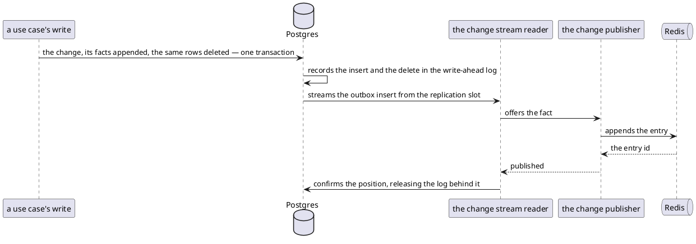

# Change capture — the write-ahead log this service reads (logical replication)

Every spending write appends the facts it produced to an outbox table, in the transaction that made the change.
The service reads those rows back out of Postgres's write-ahead log and publishes them onto
[the change stream](change-stream.md)
([ADR 0019](../../../../docs/adr/0019-the-ledger-publishes-facts-through-a-transactional-outbox-rather-than-its-own-row-changes.md)).

- **Counterpart:** the same PostgreSQL database the rows live in — [Database](database.md)
- **Transport:** logical replication through the `pgoutput` plugin, consumed by an engine embedded in this service
- **Schema:** the publication `finance_ledger_cdc`, declared in
  `src/main/resources/db/migration/V010__publish_facts_through_an_outbox.sql`

## What is published

| Table             | Published |
|-------------------|-----------|
| `outbox`          | yes       |
| `cdc_heartbeat`   | yes       |
| every other table | no        |

The publication sends inserts and updates, and no deletes. The insert is the fact; the update is the heartbeat.

**The outbox row is deleted in the transaction that wrote it**, so the table is empty at rest. That delete must
never reach a consumer, so the publication filters it out before the replication slot. What is left behind is
watched through [meters](../in/operations.md#meters).

`cdc_heartbeat`'s single row is advanced on a timer, which moves the replication slot forward while only
uncaptured tables are written. Retained log is cluster-wide, so without it ordinary traffic would pin the log.
Its own change is dropped in the reader and reaches no consumer.

## How a fact travels

What a refusal does to the reported state is [Health](../in/operations.md#health).

## The slot and the stored position

Neither is declared by a migration. Both are created on first start.

- **The replication slot.** Creating one cannot run inside a transaction, and every migration is wrapped in one.
  Its name is [configuration](../../configuration.md).
- **`debezium_offset_storage`.** The engine's offset store creates the table and owns its shape.

Postgres retains every segment after the position the slot has confirmed, so a stopped service loses nothing.

## What the database owes

| Requirement                            | Without it                                                                       |
|----------------------------------------|----------------------------------------------------------------------------------|
| `wal_level = logical`                  | capture reports down and stops retrying; the rest of the service serves normally |
| `REPLICATION` on the service's account | the slot cannot be opened                                                        |
| the publication present                | capture reports down and takes no slot                                           |
| a bound on what a slot may retain      | an unread slot retains log until the disk is gone                                |

The bound is the database's setting, not the service's. A slot that passes it is invalidated, and only
[rebuilding it](../in/operations.md#rebuilding-the-slot) brings capture back.

## Compatibility

A change to the captured set is a migration.
