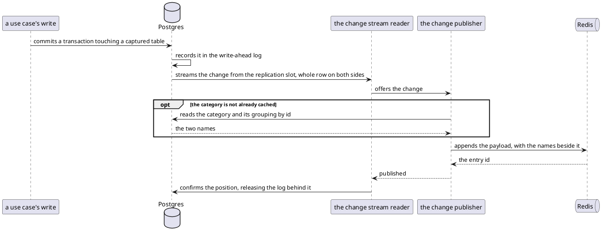

# Change capture — the write-ahead log this service reads (logical replication)

The service reads its own committed row changes back out of Postgres's write-ahead log and republishes them onto
[the change stream](change-stream.md). What the rows hold is [the database's own contract](database.md).

- **Counterpart:** the same PostgreSQL database the rows live in — [Database](database.md)
- **Transport:** logical replication through the `pgoutput` plugin, consumed by an engine embedded in this service
- **Schema:** the publication `finance_ledger_cdc` and the replica identity, declared in
  `src/main/resources/db/migration/V009__publish_ledger_changes.sql`

## What is published

| Table              | Reaches the log | Reaches [the stream](change-stream.md) |
|--------------------|-----------------|----------------------------------------|
| `expense`          | yes             | yes                                    |
| `expense_proposal` | yes             | yes                                    |
| `category`         | yes             | yes                                    |
| `cdc_heartbeat`    | yes             | no                                     |
| every other table  | no              | no                                     |

The three captured tables run under `REPLICA IDENTITY FULL`. A change to any of them logs the whole row: both
sides of an update, and the row a delete removed.

The publication is restricted to inserts, updates and deletes.

`cdc_heartbeat`'s single row is advanced on a timer, which moves the replication slot forward while only
uncaptured tables are written. Retained log is cluster-wide, so without it ordinary traffic would pin the log.

## How a change travels

The position is confirmed only after Redis has taken the entry, which is what makes delivery
[at-least-once](change-stream.md). What a refusal does is [the operator's boundary](../in/operations.md).

## The slot and the stored position

Neither is declared by a migration. Both are created on first start.

- **The replication slot.** Creating one cannot run inside a transaction, and every migration is wrapped in one.
  Its name is [configuration](../../configuration.md).
- **`debezium_offset_storage`.** The engine's offset store creates the table and owns its shape.

Postgres retains every segment after the position the slot has confirmed, so a stopped service loses nothing.

## What the database owes

| Requirement                            | Without it                                                                       |
|----------------------------------------|----------------------------------------------------------------------------------|
| `wal_level = logical`                  | capture reports down and stops retrying; the rest of the service serves normally |
| `REPLICATION` on the service's account | the slot cannot be opened                                                        |
| the publication present                | capture reports down and takes no slot                                           |
| a bound on what a slot may retain      | an unread slot retains log until the disk is gone                                |

The bound is the database's setting, not the service's. What happens when a slot passes it is
[the operator's boundary](../in/operations.md).

## Compatibility

A change to the captured set is a migration, so it shows in a diff.

Adding a table publishes its changes from that point on, never retrospectively. A consumer sees nothing about
rows that existed before. Removing one silently stops a consumer being told about it.
