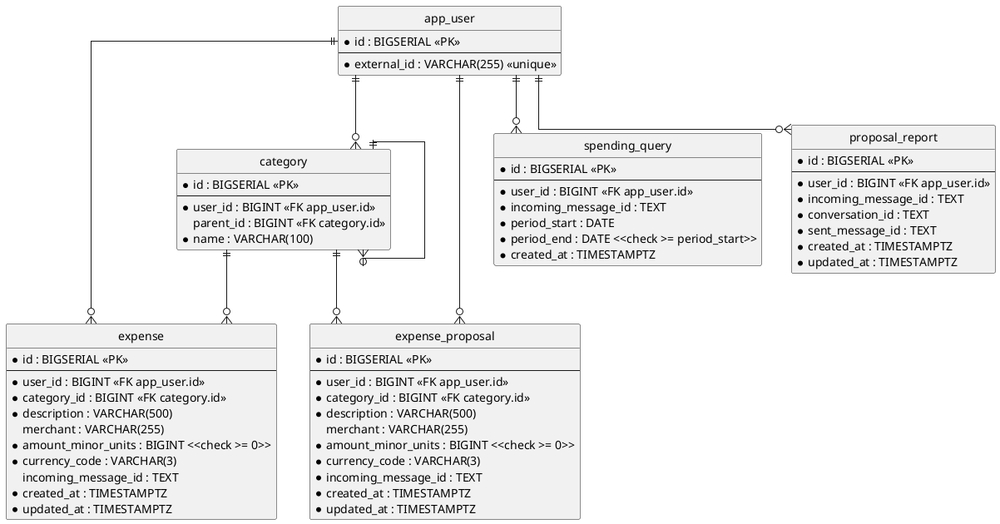

# Database — users, categories, expenses and expense proposals (SQL)

Everything the service remembers. A user is stored under the identity the delivering platform knows them by; the
categories they file spending under, the expenses they record, the expense proposals assembled against them, the
periods they have asked about, and where each report they were sent was posted, all hang off that user.

- **Counterpart:** the service's own PostgreSQL database — its address is [configuration](../../configuration.md)
- **Transport:** SQL over JDBC
- **Schema:** below. No file holds the current state — it is spread across every migration ever applied, so this
  diagram is the one place it is written down. Read from `src/main/resources/db/migration/`.

This page carries the schema, not the statements run against it. What each use case reads and writes is on its
own page, which lists this contract as a collaborator.

## Schema

Indexes beyond the constraints above:

- `uq_category_user_parent_name` on `(user_id, parent_id, name)`, **`NULLS NOT DISTINCT`**.
- `idx_expense_user_created_at` on `(user_id, created_at DESC)`.
- `idx_expense_incoming_message` on `(user_id, incoming_message_id)`.
- `idx_expense_proposal_user_created_at` on `(user_id, created_at DESC)`.
- `idx_expense_proposal_incoming_message` on `(user_id, incoming_message_id)`.
- `idx_spending_query_incoming_message` on `(user_id, incoming_message_id)`.
- `idx_proposal_report_incoming_message` on `(user_id, incoming_message_id)`.

## What a Column Means

- **A `category` row with no parent is a grouping.** That is the only thing telling a grouping from a category
  carrying the same name.
- `incoming_message_id` is a [message](../../domain/incoming-message-id.md), in all four tables that carry one.
  A value stored while the column was a `UUID` reads back as that UUID's canonical text.
- **An incoming message id is in `expense_proposal` or in `expense`, never both.** No constraint enforces it
  ([ADR 0012](../../adr/0012-a-set-of-rows-moves-between-tables-in-one-statement.md)).
- **`proposal_report` carries two message names, and they are different messages.** `incoming_message_id` is
  what a person sent; `sent_message_id` is [the report](../../domain/proposal-report.md) the bot sent back about
  it, in `conversation_id`.
- **`proposal_report` has no unique key.** One incoming message reported twice holds a row each.
- `user_id` cascades on delete everywhere. `category_id` does not: a category cannot be removed while an expense
  or a proposal references it.

## Compatibility

Migrations are append-only. An applied migration is never edited — a change is a new one, so every database
reaches the same state by the same path.

Widening a column or adding a nullable one costs callers nothing. Narrowing one, or adding a constraint the
stored rows already violate, breaks the migration itself rather than the caller.
