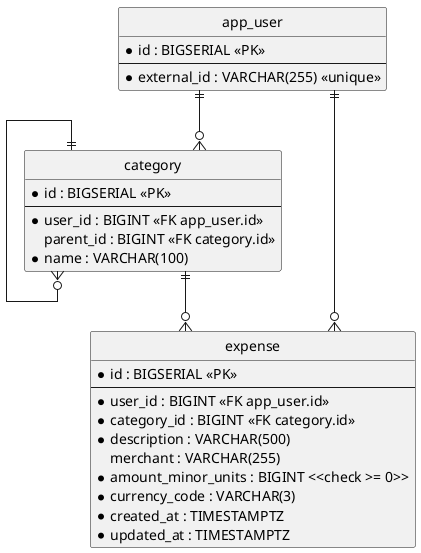

# Database — users, categories and expenses (SQL)

Everything the service remembers. A user is stored under the identity the delivering platform knows them by; the
categories they file spending under, and the expenses they record, hang off that user.

- **Counterpart:** the service's own PostgreSQL database — its address is [configuration](../../configuration.md)
- **Transport:** SQL over JDBC
- **Schema:** below. No file holds the current state — it is spread across every migration ever applied, so this
  diagram is the one place it is written down. Read from `src/main/resources/db/migration/`.

## Schema

Indexes beyond the constraints above:

- `uq_category_user_parent_name` on `(user_id, parent_id, name)`, **`NULLS NOT DISTINCT`**.
- `idx_expense_user_created_at` on `(user_id, created_at DESC)`.

`expense.user_id` cascades on delete: removing a user removes their expenses. `expense.category_id` carries no
`ON DELETE` clause: a category cannot be removed while expenses reference it.

## Operations

| Operation               | Purpose                                          | Used by                                                          |
|-------------------------|--------------------------------------------------|------------------------------------------------------------------|
| Find a user by identity | reads the user stored under an external identity | [Initialize a new user](../../usecases/initialize-a-new-user.md), [Create an expense](../../usecases/create-an-expense.md) |
| Create a user           | stores a user and their categories together      | [Initialize a new user](../../usecases/initialize-a-new-user.md) |
| Create an expense       | stores an expense against a user and category    | [Create an expense](../../usecases/create-an-expense.md)         |

## Compatibility

Migrations are append-only. An applied migration is never edited — a change is a new one, so every database
reaches the same state by the same path.

Widening a column or adding a nullable one costs callers nothing. Narrowing one, or adding a constraint the
stored rows already violate, breaks the migration itself rather than the caller.
