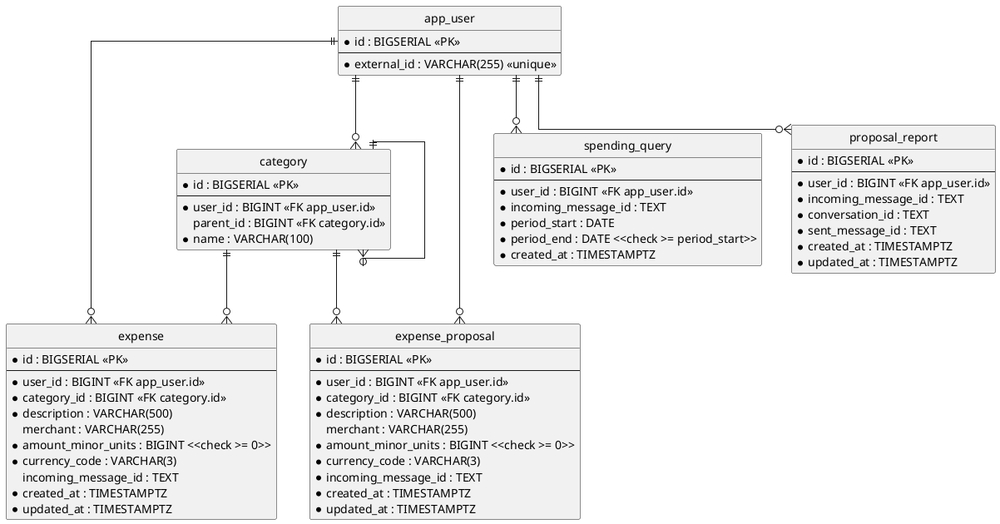

# Database — users, categories, expenses and expense proposals (SQL)

Everything the service remembers. A user is stored under the identity the delivering platform knows them by; the
categories they file spending under, the expenses they record, the expense proposals assembled against them, the
periods they have asked about, and where each report they were sent was posted, all hang off that user.

- **Counterpart:** the service's own PostgreSQL database — its address is [configuration](../../configuration.md)
- **Transport:** SQL over JDBC
- **Schema:** below. No file holds the current state — it is spread across every migration ever applied, so this
  diagram is the one place it is written down. Read from `src/main/resources/db/migration/`.

This page carries the schema, not the statements run against it. What each use case reads and writes is on its
own page, which lists this contract as a collaborator.

## Schema

Indexes beyond the constraints above:

- `uq_category_user_parent_name` on `(user_id, parent_id, name)`, **`NULLS NOT DISTINCT`**.
- `idx_expense_user_created_at` on `(user_id, created_at DESC)`.
- `idx_expense_incoming_message` on `(user_id, incoming_message_id)`.
- `idx_expense_proposal_user_created_at` on `(user_id, created_at DESC)`.
- `idx_expense_proposal_incoming_message` on `(user_id, incoming_message_id)`.
- `idx_spending_query_incoming_message` on `(user_id, incoming_message_id)`.
- `idx_proposal_report_incoming_message` on `(user_id, incoming_message_id)`.

## What a Table Holds

| Table              | Domain                                                | A row is                                                          |
|--------------------|-------------------------------------------------------|--------------------------------------------------------------------|
| `app_user`         | [User](../../domain/user.md)                          | a person, under the identity Telegram knows them by                |
| `category`         | [Grouping](../../domain/grouping.md), with no parent  | a heading spending is filed under, never spending itself           |
| `category`         | [Category](../../domain/category.md), with a parent   | what one expense is filed under, inside its grouping               |
| `expense`          | [Expense](../../domain/expense.md)                    | spending the person has confirmed                                  |
| `expense_proposal` | [Expense proposal](../../domain/expense-proposal.md)  | spending read out of a message, awaiting the person's decision     |
| `spending_query`   | [Spending query](../../domain/spending-query.md)      | a period a message asked about, waiting to be totalled in a report |
| `proposal_report`  | [Proposal report](../../domain/proposal-report.md)    | the message the bot sent back, so its buttons can be reached again |

- A grouping and a category are the same table. The parent is what tells them apart.
- `incoming_message_id` is a [message a person sent](../../domain/incoming-message-id.md), in all four tables
  that carry one.
- `proposal_report` names two different messages: `incoming_message_id` is what the person sent,
  `sent_message_id` is what the bot sent back in `conversation_id`.
- A proposal that becomes an expense moves table
  ([ADR 0012](../../adr/0012-a-set-of-rows-moves-between-tables-in-one-statement.md)).

## Compatibility

Migrations are append-only. An applied migration is never edited — a change is a new one, so every database
reaches the same state by the same path.

Widening a column or adding a nullable one costs callers nothing. Narrowing one, or adding a constraint the
stored rows already violate, breaks the migration itself rather than the caller.
