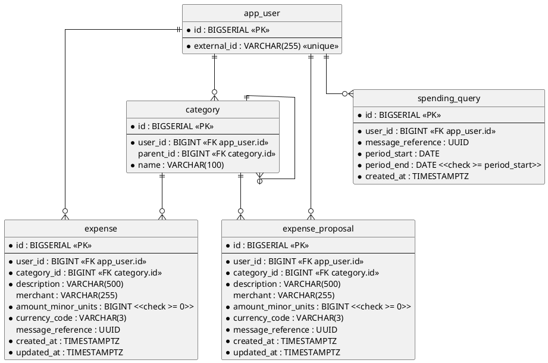

# Database — users, categories, expenses and expense proposals (SQL)

Everything the service remembers. A user is stored under the identity the delivering platform knows them by; the
categories they file spending under, the expenses they record, the expense proposals assembled against them, and
the periods they have asked about, all hang off that user.

- **Counterpart:** the service's own PostgreSQL database — its address is [configuration](../../configuration.md)
- **Transport:** SQL over JDBC
- **Schema:** below. No file holds the current state — it is spread across every migration ever applied, so this
  diagram is the one place it is written down. Read from `src/main/resources/db/migration/`.

## Schema

Indexes beyond the constraints above:

- `uq_category_user_parent_name` on `(user_id, parent_id, name)`, **`NULLS NOT DISTINCT`**.
- `idx_expense_user_created_at` on `(user_id, created_at DESC)`.
- `idx_expense_message_reference` on `(user_id, message_reference)`.
- `idx_expense_proposal_user_created_at` on `(user_id, created_at DESC)`.
- `idx_expense_proposal_message_reference` on `(user_id, message_reference)`.
- `idx_spending_query_message_reference` on `(user_id, message_reference)`.

`expense_proposal.message_reference` is the [message](../../domain/message-reference.md) that produced the row.
Rows stored before the column existed each carry a reference of their own, so no two of them are read as one
message.

`expense.message_reference` is the message whose report the user confirmed, and it is empty for an expense no
message produced. Rows stored before the column existed keep no reference: there is none to invent for them.

A reference lives in `expense_proposal` or in `expense` and never in both, so which table holds it answers
whether the report was resolved
([ADR 0012](../../adr/0012-a-set-of-rows-moves-between-tables-in-one-statement.md)).

A category row with no parent is a grouping. That is how a grouping is told from a category carrying the same
name: a grouping is read as the parentless row, a category as a row under one.

Every read of the table leads with `user_id` and is covered end to end by `uq_category_user_parent_name`, so a
grouping's id supplied from anywhere else answers nothing.

`spending_query.message_reference` is the [message](../../domain/message-reference.md) that asked the question
the row records. Nothing updates a row. It is read and then deleted by `(user_id, message_reference)`, which its
index covers end to end, so the table holds only the questions whose answers have not yet reached their user.
Rows a failed delivery leaves behind stay until that user is removed.

`expense.user_id`, `expense_proposal.user_id` and `spending_query.user_id` cascade on delete: removing a user
removes their expenses, their proposals and the questions they asked. `expense.category_id` and
`expense_proposal.category_id` carry no `ON DELETE` clause: a category cannot be removed while either references
it.

**A date-bounded read converts its period to instants before the statement, in Java, and binds them as
parameters.** No `DATE` is cast to a timestamp in SQL, where the session's time zone would decide the result.
The bounds of a [spending period](../../domain/spending-period.md) are its first day at UTC midnight, and the
day after its last day at UTC midnight, taken as the exclusive upper bound — so both end days count whole.

## Operations

| Operation                                          | Purpose                                                                                                    | Used by                                                                                                                                                                                                |
|----------------------------------------------------|------------------------------------------------------------------------------------------------------------|--------------------------------------------------------------------------------------------------------------------------------------------------------------------------------------------------------|
| Find a user by identity                            | reads the user stored under an external identity                                                           | [Initialize a new user](../../usecases/initialize-a-new-user.md), [Create an expense](../../usecases/create-an-expense.md), [Create an expense proposal](../../usecases/create-an-expense-proposal.md) |
| Create a user                                      | stores a user and their categories together                                                                | [Initialize a new user](../../usecases/initialize-a-new-user.md)                                                                                                                                       |
| Create an expense                                  | stores an expense against a user and category                                                              | [Create an expense](../../usecases/create-an-expense.md)                                                                                                                                               |
| Find a user's grouping by name                     | reads the one parentless row of that user carrying a name                                                  | [Create an expense proposal](../../usecases/create-an-expense-proposal.md), [List a grouping's categories](../../usecases/list-categories.md)                                                          |
| Find a category by name under a grouping           | reads the one row of that user carrying a name under that grouping                                         | [Create an expense proposal](../../usecases/create-an-expense-proposal.md)                                                                                                                             |
| Find a grouping's categories                       | reads the names of the categories filed under one grouping of that user, ordered by name                   | [List a grouping's categories](../../usecases/list-categories.md)                                                                                                                                      |
| Tell whether a category carries a name             | answers whether any category of that user, filed under a grouping, carries a name                          | [List a grouping's categories](../../usecases/list-categories.md)                                                                                                                                      |
| Find the groupings one user's categories sit under | reads the names of one user's groupings that hold at least one category, ordered by name, in one statement | [Act on a user's message](../../usecases/handle-incoming-message.md)                                                                                                                                   |
| Create an expense proposal                         | stores a proposal against a user and category                                                              | [Create an expense proposal](../../usecases/create-an-expense-proposal.md)                                                                                                                             |
| Find what a message recorded                       | reads the proposals stored under one message, oldest first, each with its category and grouping            | [Act on a user's message](../../usecases/handle-incoming-message.md)                                                                                                                                   |
| Confirm what a message proposed                    | turns one user's proposals under one message into expenses carrying that message, in one statement         | [Resolve a reported proposal](../../usecases/resolve-a-reported-proposal.md)                                                                                                                           |
| Discard what a message proposed                    | removes one user's proposals under one message                                                             | [Resolve a reported proposal](../../usecases/resolve-a-reported-proposal.md)                                                                                                                           |
| Count what a message had confirmed                 | answers how many of one user's expenses are stored under one message                                       | [Resolve a reported proposal](../../usecases/resolve-a-reported-proposal.md)                                                                                                                           |
| Record a period a user asked about                 | stores one period against a user and the message that asked about it                                       | [Summarize spending over a period](../../usecases/summarize-spending.md)                                                                                                                               |
| Find the periods a message asked about             | reads the distinct periods stored under one message, oldest first                                          | [Act on a user's message](../../usecases/handle-incoming-message.md)                                                                                                                                   |
| Total a user's expenses over a period              | sums and counts one user's expenses by currency between two instants, ordered by currency code             | [Act on a user's message](../../usecases/handle-incoming-message.md)                                                                                                                                   |

## Compatibility

Migrations are append-only. An applied migration is never edited — a change is a new one, so every database
reaches the same state by the same path.

Widening a column or adding a nullable one costs callers nothing. Narrowing one, or adding a constraint the
stored rows already violate, breaks the migration itself rather than the caller.
