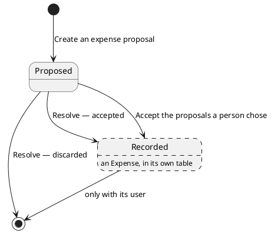

# Expense proposal

One spending record assembled against a user and filed under a category, not yet accepted into their ledger
([ADR 0006](../adr/0006-an-expense-proposal-is-a-table-and-an-entity-of-its-own.md)).

## Invariants

| Field                                            | Bound                |
|--------------------------------------------------|----------------------|
| `id`                                             | only once stored     |
| `userId`                                         | `> 0`                |
| `categoryId`                                     | `> 0`                |
| `description`                                    | mandatory, non-blank |
| `merchant`                                       | optional, may be empty |
| [`money`](money.md)                              | mandatory            |
| [`incomingMessageId`](incoming-message-id.md)    | mandatory            |
| `createdAt`, `updatedAt`                         | mandatory            |

Two stored proposals with the same `id` are the same proposal. An unstored one equals only itself.

## Lifecycle

| Event    | By                                                                                | Notes                                             |
|----------|-----------------------------------------------------------------------------------|---------------------------------------------------|
| Created  | [Create an expense proposal](../usecases/create-an-expense-proposal.md)           | one per spending the model read out of a message  |
| Changed  | never                                                                             | every field is fixed at creation                  |
| Removed  | [Resolve a reported proposal](../usecases/resolve-a-reported-proposal.md)         | accepted or discarded, and removed either way     |
| Removed  | [Accept the proposals a person chose](../usecases/accept-chosen-proposals.md)     | accepted from the page, by id                     |

Accepting does not change a proposal's state — it removes the proposal and writes an [expense](expense.md)
carrying the same values, in one statement
([ADR 0012](../adr/0012-a-set-of-rows-moves-between-tables-in-one-statement.md)). The two are separate tables and
separate types ([ADR 0006](../adr/0006-an-expense-proposal-is-a-table-and-an-entity-of-its-own.md)), so "pending"
and "recorded" are not a column on either.

The two acceptances differ only in what they name: a tap resolves every proposal under one message, and the page
accepts the ones it was given by id.

A proposal nobody resolves stays proposed. Nothing expires one.

## Made of / held by

The owning user's id, the filed category's id, a description, an optional merchant, a [money](money.md) amount,
the incoming message id of the message it came from, and the instants it was created and last updated.

- [User](user.md) — who the proposal is recorded against.
- [Category](category.md) — what it is filed under, by the category's stored id.
- [Incoming message id](incoming-message-id.md) — which message produced it, and what the report answering that
  message is assembled from.
- [Money](money.md) — what was proposed, and its [currency](currency-code.md).
- How long its text may be is checked where it is stored
  ([ADR 0004](../adr/0004-column-widths-are-checked-in-the-persistence-adapter.md)).
