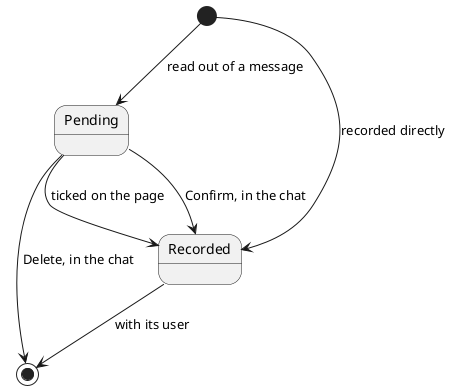

# Expense

One purchase or payment recorded against a user and filed under a category, either waiting for that user's
decision or already in their ledger.

## Invariants

| Field                                         | Bound                                                |
|-----------------------------------------------|------------------------------------------------------|
| `id`                                          | only once stored; never changes, acceptance included |
| `userId`                                      | `> 0`                                                |
| `categoryId`                                  | `> 0`                                                |
| `description`                                 | mandatory, non-blank                                 |
| `merchant`                                    | optional                                             |
| [`money`](money.md)                           | mandatory                                            |
| [`status`](expense-status.md)                 | mandatory                                            |
| [`incomingMessageId`](incoming-message-id.md) | mandatory while pending, optional once recorded      |
| `createdAt`, `updatedAt`                      | mandatory; `createdAt` never changes                 |

Two stored expenses with the same `id` are the same expense. An unstored one equals only itself.

## Lifecycle

| Event    | By                                                                            | Notes                                                  |
|----------|-------------------------------------------------------------------------------|--------------------------------------------------------|
| Created  | [Create an expense proposal](../usecases/create-an-expense-proposal.md)       | pending, one per spending read out of a message        |
| Created  | [Create an expense](../usecases/create-an-expense.md)                         | recorded, naming no message                            |
| Recorded | [Resolve a reported proposal](../usecases/resolve-a-reported-proposal.md)     | every pending entry under the message, on a Confirm    |
| Recorded | [Accept the proposals a person chose](../usecases/accept-chosen-proposals.md) | the pending entries a person ticked on the page        |
| Changed  | [Change an entry's category](../usecases/change-an-expense-category.md)       | its category, and nothing else, under either status    |
| Removed  | [Resolve a reported proposal](../usecases/resolve-a-reported-proposal.md)     | a Delete removes every pending entry under the message |
| Removed  | never, once recorded                                                          | only with its user, by the store's own cascade         |
| Expired  | never                                                                         | a pending entry waits indefinitely                     |

## Made of / held by

- [User](user.md) — who the expense is recorded against.
- [Expense status](expense-status.md) — whether it is waiting for a decision or already in the ledger.
- [Incoming message id](incoming-message-id.md) — which message produced it, kept through the acceptance.
- [Category](category.md) — what it is filed under, by the category's stored id.
- [Money](money.md) — what was spent, and its [currency](currency-code.md).
- [Spending period](spending-period.md) — the stretch of days a user's recorded expenses are totalled over.
- How long its text may be is checked where it is stored
  ([ADR 0004](../adr/0004-column-widths-are-checked-in-the-persistence-adapter.md)).
