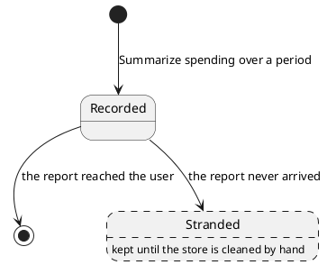

# Spending query

One period a caller asked about, recorded against the message that asked, so the turn answering that message
knows what to total.

## Invariants

- A query is stored or not yet stored, and carries the store's own id only once it is.
- Two stored queries with the same id are the same query, whatever else differs; a query not yet stored equals
  only itself.
- The owning user's id is positive.
- A period is present.
- The reference of the message that asked is present.
- The instant it was recorded is present.
- A query is only ever recorded, never changed.
- It is removed once the report carrying its period has reached the user, and not before. A report that never
  arrived leaves its queries behind.

## Lifecycle

| Event   | By                                                                       | Notes                                            |
|---------|--------------------------------------------------------------------------|--------------------------------------------------|
| Created | [Summarize spending over a period](../usecases/summarize-spending.md)    | one per period a caller asked about              |
| Changed | never                                                                    | every field is fixed at recording                |
| Removed | [Act on a user's message](../usecases/handle-incoming-message.md)        | only once the report reached the user            |

Removal is not guaranteed, which is the one thing worth drawing: a report that never arrives strands its queries,
and nothing else collects them.

## Made of / held by

The owning user's id, a [spending period](spending-period.md), the reference of the message it came from, and
the instant it was recorded.

- [User](user.md) — whose spending the question is about, and the only spending it can reach.
- [Incoming message id](incoming-message-id.md) — which message asked, and what the report answering that message
  reads back.
- [Database](../contracts/out/database.md) — where one is kept, and for how long.
