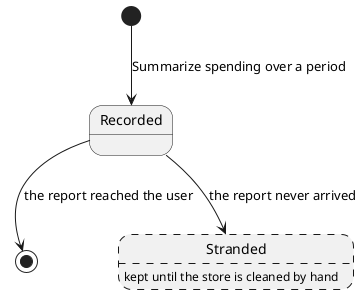

# Spending query

One period a caller asked about, recorded against the message that asked, so the turn answering that message
knows what to total.

## Invariants

| Field                                            | Bound            |
|--------------------------------------------------|------------------|
| `id`                                             | only once stored |
| `userId`                                         | `> 0`            |
| [`period`](spending-period.md)                   | mandatory        |
| [`incomingMessageId`](incoming-message-id.md)    | mandatory        |
| `createdAt`                                      | mandatory        |

Two stored queries with the same `id` are the same query. An unstored one equals only itself.

## Lifecycle

| Event   | By                                                                       | Notes                                            |
|---------|--------------------------------------------------------------------------|--------------------------------------------------|
| Created | [Summarize spending over a period](../usecases/summarize-spending.md)    | one per period a caller asked about              |
| Changed | never                                                                    | every field is fixed at recording                |
| Removed | [Act on a user's message](../usecases/handle-incoming-message.md)        | only once the report reached the user            |

Removal is not guaranteed, which is the one thing worth drawing: a report that never arrives strands its queries,
and nothing else collects them.

## Made of / held by

The owning user's id, a [spending period](spending-period.md), the incoming message id of the message it came
from, and the instant it was recorded.

- [User](user.md) — whose spending the question is about, and the only spending it can reach.
- [Incoming message id](incoming-message-id.md) — which message asked, and what the report answering that message
  reads back.
- [Database](../contracts/out/database.md) — where one is kept, and for how long.
