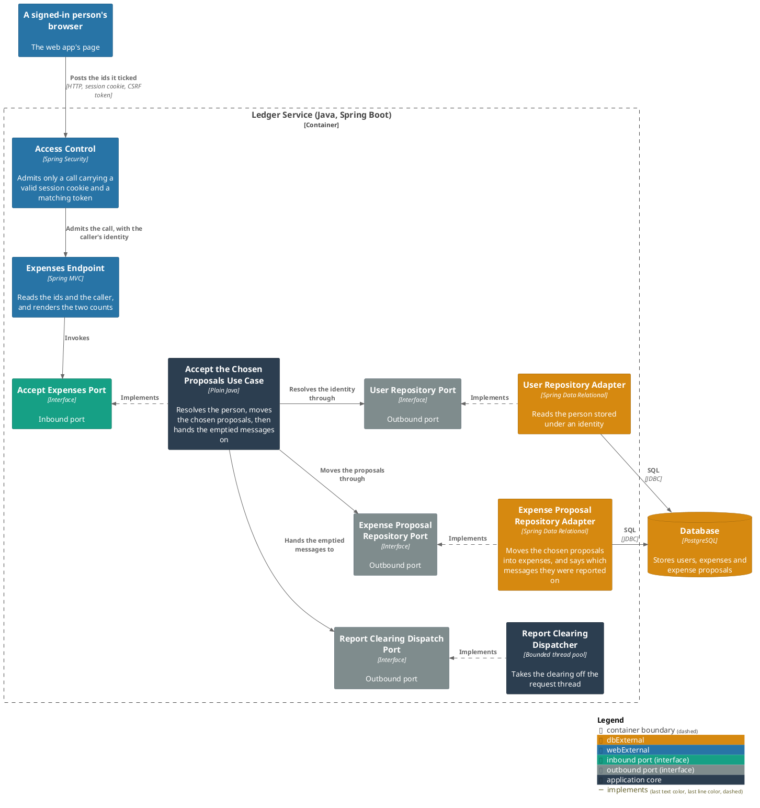
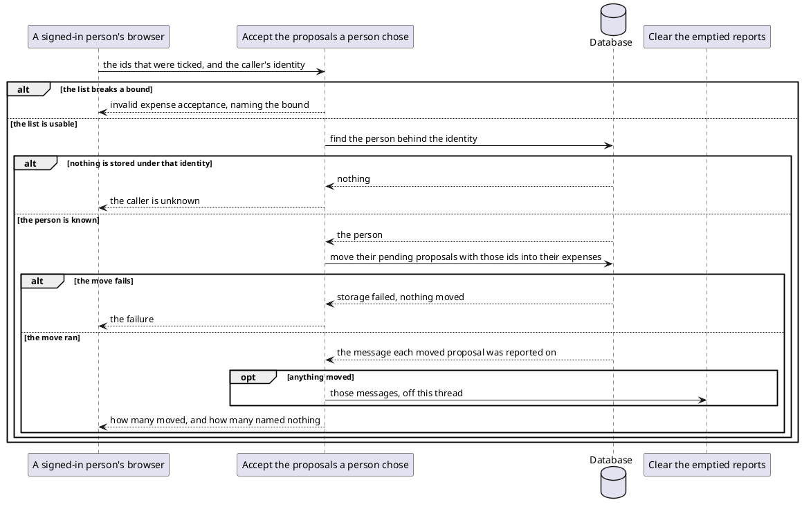

# Accept the proposals a person chose

- **In**
  - the identity of the authenticated caller
  - the [ids of the pending entries](../domain/proposal-ids.md) to accept
- **Out**
  - how many proposals became expenses
  - how many of the ids named nothing
- **Why:** it lets a person turn spending into their ledger from the page they are already reading it on, one
  entry or a whole day at a time

*Implemented by `AcceptExpensesUseCase`.*

## Prerequisites

- The caller is authenticated. The request never names whose ledger it is.
- A user is stored under that identity.

What bounds the list, what an id is taken as, and how the two counts relate are all fixed by
[the specification](../../../openapi/ledger-api.yaml).

## Collaborators

| Direction | Collaborator                                                                         | Through                                                                           | For                                                                                 |
|-----------|--------------------------------------------------------------------------------------|-----------------------------------------------------------------------------------|-------------------------------------------------------------------------------------|
| in        | [Accept pending expenses](../../../web-app/docs/usecases/accept-pending-expenses.md) | [Browsing the ledger from a browser](../contracts/in/web-browse-api.md)           | turning the entries a person ticked into their ledger                               |
| out       | [Database](../contracts/out/database.md)                                             | [Users, categories, expenses and expense proposals](../contracts/out/database.md) | resolving the identity, and moving the chosen proposals into that person's expenses |
| out       | [Clear the emptied reports](clear-emptied-reports.md)                                | [Clear the emptied reports](clear-emptied-reports.md)                             | handing over the messages this acceptance may have emptied                          |

## Rules

- Only that person's pending proposals are reachable. An id is never widened to somebody else's row.
- The move is one statement, so an acceptance and a Telegram **Confirm** racing over the same rows move them
  once ([ADR 0012](../adr/0012-a-set-of-rows-moves-between-tables-in-one-statement.md)).
- An accepted proposal keeps the day it was proposed on — see [Expense](../domain/expense.md#lifecycle).
- The order the ids were given in is kept, and says nothing about what moves.
- The messages the moved rows were reported on are handed to the clearing, each one once.
- An acceptance that moved nothing hands nothing over.
- The clearing runs after the caller is answered, so nothing it does can change the answer.
- One info line per acceptance names the person, how many moved and how many named nothing.

## Outcomes

| Outcome           | When                                                               | Result                                                                                       |
|-------------------|--------------------------------------------------------------------|----------------------------------------------------------------------------------------------|
| Spending accepted | the ids name pending proposals of the caller's                     | those become expenses, both counts are answered, and the emptied messages go to the clearing |
| Nothing matched   | no id names a pending proposal of theirs                           | both counts are answered, and no clearing is handed over                                     |
| List rejected     | the list is empty, too long, repeats an id, or holds an id below 1 | invalid expense acceptance, naming the bound — nothing is moved                            |
| Body rejected     | the body is not JSON, or breaks a bound the specification declares | the request is refused, naming the field — nothing is moved                                |
| Request rejected  | the request names no ids                                           | the request is refused — nothing is looked up                                              |
| Identity unknown  | nothing is stored under the caller's identity                      | the request is rejected, and nothing is moved or handed over                                 |
| Storage failed    | the move fails                                                     | the failure reaches the caller, and nothing is moved or handed over                          |

What each outcome answers a browser with is [the browse API](../contracts/in/web-browse-api.md)'s, and the
[specification](../../../openapi/ledger-api.yaml) describes every one.

## Components

Where the clearing goes from there is [its own page](clear-emptied-reports.md).

## Flow

